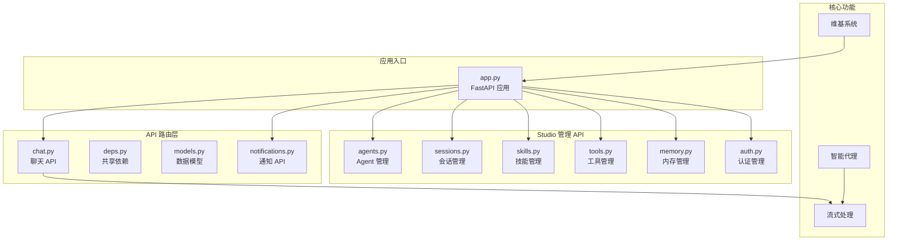
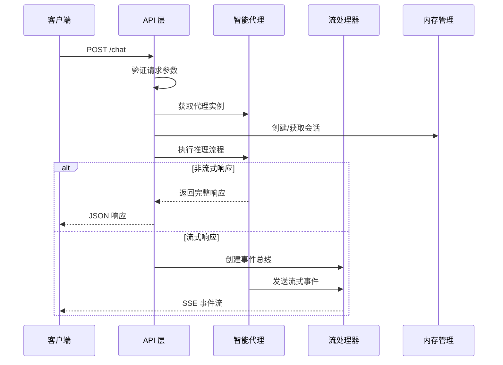
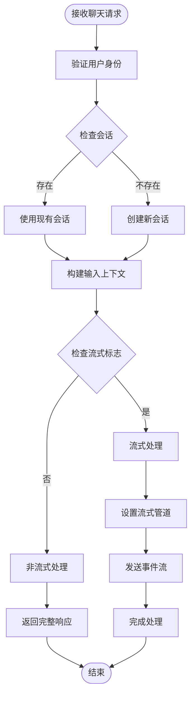
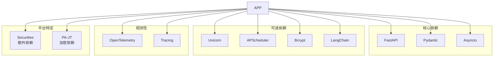

# 维基系统 API 文档

<cite>
**本文档引用的文件**
- [app.py](file://src/ark_agentic/app.py)
- [chat.py](file://src/ark_agentic/api/chat.py)
- [models.py](file://src/ark_agentic/api/models.py)
- [deps.py](file://src/ark_agentic/api/deps.py)
- [notifications.py](file://src/ark_agentic/api/notifications.py)
- [agents.py](file://src/ark_agentic/studio/api/agents.py)
- [sessions.py](file://src/ark_agentic/studio/api/sessions.py)
- [skills.py](file://src/ark_agentic/studio/api/skills.py)
- [tools.py](file://src/ark_agentic/studio/api/tools.py)
- [memory.py](file://src/ark_agentic/studio/api/memory.py)
- [auth.py](file://src/ark_agentic/studio/api/auth.py)
- [ark-agentic-api.postman_collection.json](file://docs/postman/ark-agentic-api.postman_collection.json)
- [pyproject.toml](file://pyproject.toml)
</cite>

## 目录
1. [简介](#简介)
2. [项目结构](#项目结构)
3. [核心组件](#核心组件)
4. [架构概览](#架构概览)
5. [详细组件分析](#详细组件分析)
6. [依赖分析](#依赖分析)
7. [性能考虑](#性能考虑)
8. [故障排除指南](#故障排除指南)
9. [结论](#结论)

## 简介

Ark-Agentic 是一个轻量级的 ReAct Agent 框架，提供了统一的 API 接口来处理智能代理交互。该系统支持保险和证券两个主要领域的智能代理，并集成了维基系统的文档管理功能。

系统的核心特性包括：
- 统一的 FastAPI 服务入口
- 支持流式和非流式响应的聊天接口
- 多协议的 SSE 流式输出支持
- Studio 管理界面的完整 API
- 维基系统的文档浏览功能
- 通知和作业管理系统

## 项目结构

**图表来源**
- [app.py:1-351](file://src/ark_agentic/app.py#L1-L351)
- [chat.py:1-177](file://src/ark_agentic/api/chat.py#L1-L177)
- [agents.py:1-131](file://src/ark_agentic/studio/api/agents.py#L1-L131)

**章节来源**
- [app.py:1-351](file://src/ark_agentic/app.py#L1-L351)
- [pyproject.toml:1-112](file://pyproject.toml#L1-L112)

## 核心组件

### 应用入口组件

应用入口位于 `app.py`，负责：
- 初始化 FastAPI 应用程序
- 配置 CORS 中间件
- 注册所有 API 路由
- 设置环境变量和日志配置
- 管理代理注册和生命周期

### API 路由组件

系统包含多个专门的 API 路由模块：
- **聊天 API** (`chat.py`): 处理用户与智能代理的交互
- **通知 API** (`notifications.py`): 管理通知和作业调度
- **Studio API**: 提供管理界面的完整 API 功能

### 维基系统组件

内置的维基系统提供：
- 多语言文档树浏览
- Markdown 页面内容获取
- 安全的路径访问控制
- 项目文档集成

**章节来源**
- [app.py:48-204](file://src/ark_agentic/app.py#L48-L204)
- [chat.py:27-177](file://src/ark_agentic/api/chat.py#L27-L177)

## 架构概览

**图表来源**
- [chat.py:28-177](file://src/ark_agentic/api/chat.py#L28-L177)
- [deps.py:31-37](file://src/ark_agentic/api/deps.py#L31-L37)

## 详细组件分析

### 聊天 API 组件

聊天 API 是系统的核心接口，支持多种交互模式：

#### 请求模型
- **ChatRequest**: 包含消息内容、会话标识、流式标志等参数
- **HistoryMessage**: 外部历史消息格式
- **RunOptions**: 运行时配置选项

#### 响应模型
- **ChatResponse**: 标准响应格式
- **SSEEvent**: 流式事件格式

#### 关键功能特性

**图表来源**
- [chat.py:40-177](file://src/ark_agentic/api/chat.py#L40-L177)
- [models.py:27-69](file://src/ark_agentic/api/models.py#L27-L69)

**章节来源**
- [chat.py:27-177](file://src/ark_agentic/api/chat.py#L27-L177)
- [models.py:17-104](file://src/ark_agentic/api/models.py#L17-L104)

### Studio 管理 API 组件

Studio 提供了完整的管理界面 API，包含以下子模块：

#### Agent 管理
- **Agent 列表**: 扫描 agents 目录获取所有代理信息
- **Agent 详情**: 获取单个代理的元数据
- **Agent 创建**: 自动生成代理目录结构和配置文件

#### 会话管理
- **会话列表**: 从磁盘读取会话信息
- **会话详情**: 获取会话消息历史
- **原始数据操作**: 直接读写会话 JSONL 文件

#### 技能管理
- **技能列表**: 扫描技能目录
- **技能 CRUD**: 创建、更新、删除技能文件
- **自动重载**: 写入后自动刷新技能缓存

#### 工具管理
- **工具列表**: 通过 AST 解析发现工具
- **脚手架生成**: 自动生成工具代码模板

#### 内存管理
- **文件发现**: 自动扫描内存文件
- **内容读取**: 获取内存文件内容
- **内容编辑**: 修改内存文件内容

**章节来源**
- [agents.py:76-131](file://src/ark_agentic/studio/api/agents.py#L76-L131)
- [sessions.py:84-200](file://src/ark_agentic/studio/api/sessions.py#L84-L200)
- [skills.py:57-113](file://src/ark_agentic/studio/api/skills.py#L57-L113)
- [tools.py:41-66](file://src/ark_agentic/studio/api/tools.py#L41-L66)
- [memory.py:105-160](file://src/ark_agentic/studio/api/memory.py#L105-L160)

### 通知和作业管理组件

系统集成了通知和作业调度功能：

#### 通知 API
- **历史通知获取**: 支持限制数量和未读过滤
- **标记已读**: 批量标记通知状态
- **实时推送**: SSE 实时通知流
- **心跳机制**: 保持连接活跃

#### 作业管理
- **作业列表**: 显示所有已注册作业
- **手动触发**: 异步执行特定作业
- **调度管理**: 基于 APScheduler 的定时任务

**章节来源**
- [notifications.py:39-169](file://src/ark_agentic/api/notifications.py#L39-L169)

### 维基系统组件

内置的维基系统提供文档管理功能：

#### 目录树构建
- 支持中英文双语目录
- 基于元数据文件排序
- 安全的路径遍历防护

#### 页面访问
- Markdown 内容获取
- 语言参数验证
- 路径安全检查

**章节来源**
- [app.py:236-302](file://src/ark_agentic/app.py#L236-L302)

## 依赖分析

**图表来源**
- [pyproject.toml:7-55](file://pyproject.toml#L7-L55)

### 环境变量配置

系统支持多种环境变量配置：

| 环境变量 | 默认值 | 用途 |
|---------|--------|------|
| LOG_LEVEL | INFO | 日志级别 |
| API_HOST | 0.0.0.0 | API 主机地址 |
| API_PORT | 8080 | API 端口号 |
| ENABLE_JOB_MANAGER | false | 启用作业管理器 |
| ENABLE_MEMORY | false | 启用内存功能 |
| ENABLE_DREAM | true | 启用梦境功能 |
| STUDIO_USERS | 默认用户 | Studio 认证用户 |

**章节来源**
- [pyproject.toml:19-55](file://pyproject.toml#L19-L55)
- [app.py:16-43](file://src/ark_agentic/app.py#L16-L43)

## 性能考虑

### 流式处理优化
- SSE 事件缓冲区大小限制
- 心跳机制保持连接活跃
- 异步任务管理和取消

### 内存管理
- 代理实例缓存
- 会话状态持久化
- 内存文件工作空间隔离

### 并发处理
- 异步 I/O 操作
- 事件驱动架构
- 资源池管理

## 故障排除指南

### 常见问题诊断

#### 代理相关错误
- **404 错误**: 检查代理 ID 是否正确
- **503 错误**: 确认代理已正确初始化

#### 会话相关错误
- **会话不存在**: 验证会话 ID 和用户 ID
- **权限不足**: 检查用户认证状态

#### 流式处理问题
- **连接中断**: 检查网络连接和防火墙设置
- **超时错误**: 调整客户端超时配置

### 调试建议

1. **启用详细日志**: 设置 `LOG_LEVEL=DEBUG`
2. **检查环境变量**: 验证所有必需的配置项
3. **测试基本功能**: 使用 Postman 集合验证核心 API
4. **监控资源使用**: 关注内存和 CPU 使用情况

**章节来源**
- [chat.py:153-155](file://src/ark_agentic/api/chat.py#L153-L155)
- [sessions.py:129-135](file://src/ark_agentic/studio/api/sessions.py#L129-L135)

## 结论

Ark-Agentic 维基系统提供了一个功能完整、架构清晰的智能代理平台。系统的主要优势包括：

1. **模块化设计**: 清晰的组件分离和职责划分
2. **多协议支持**: 灵活的流式和非流式响应
3. **完整的管理界面**: Studio 提供了全面的管理功能
4. **文档集成**: 内置维基系统便于知识管理
5. **可观测性**: 完善的追踪和监控支持

该系统适合需要智能代理能力的企业级应用场景，提供了从基础聊天交互到复杂作业调度的完整解决方案。