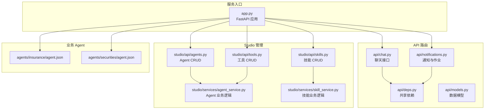
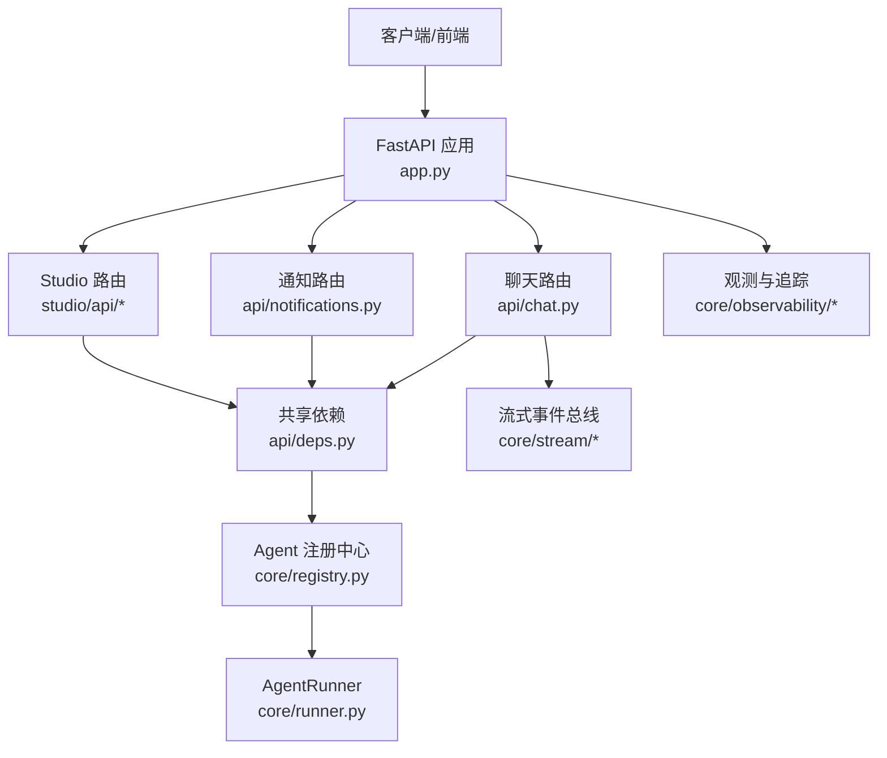
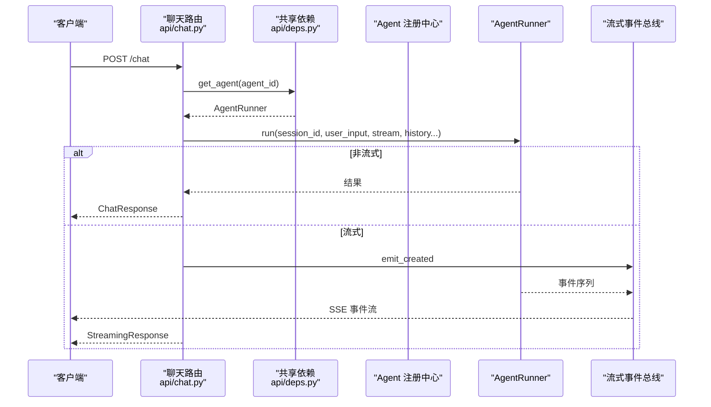
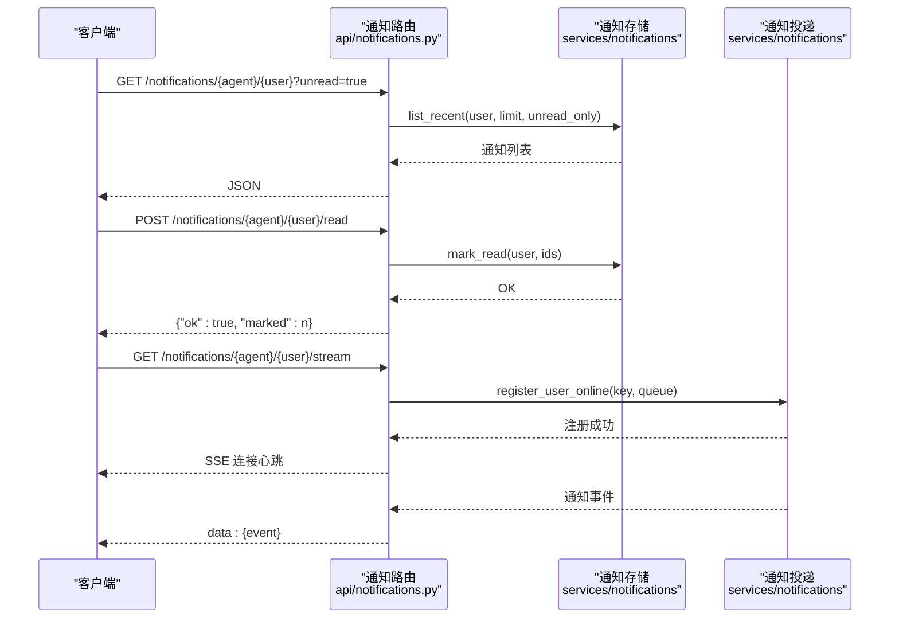
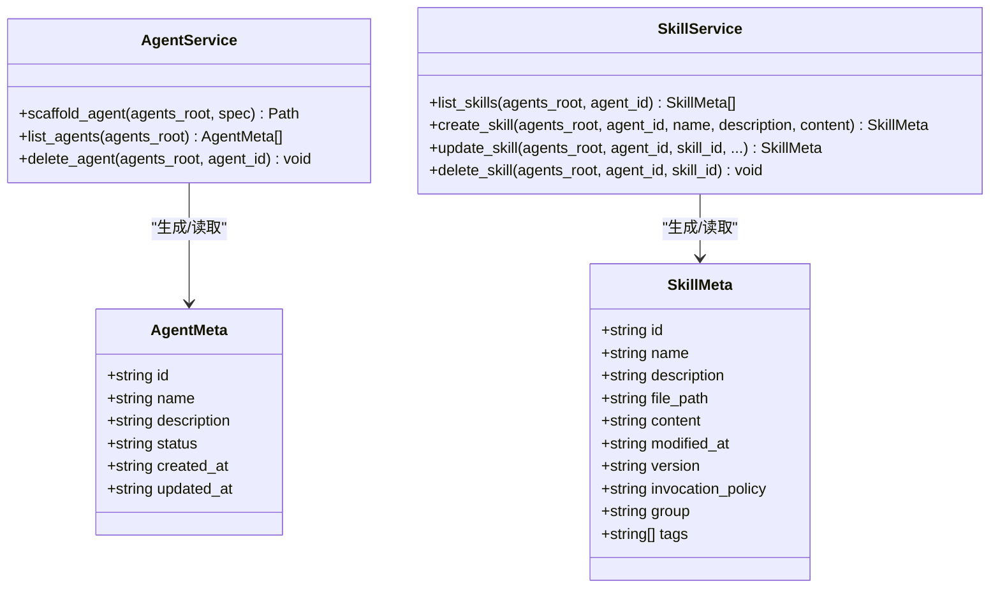
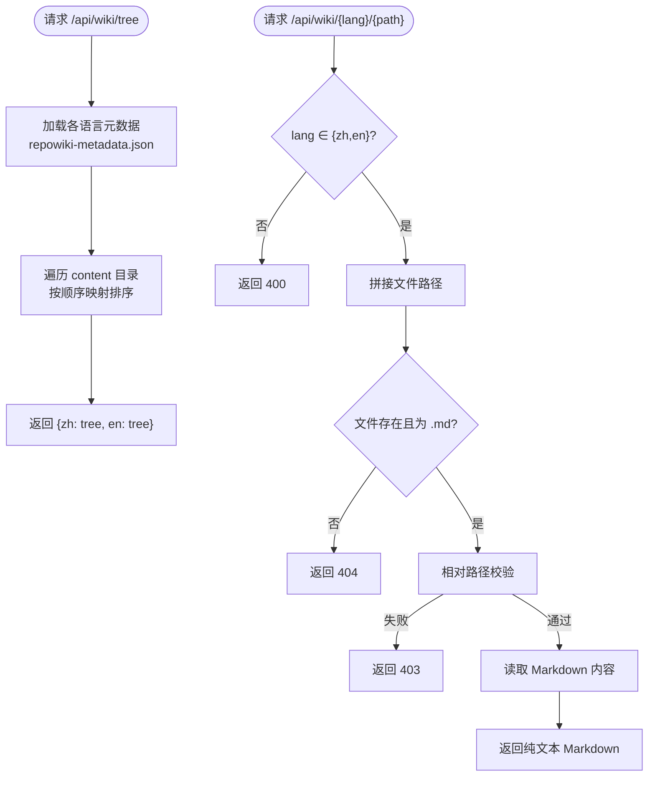
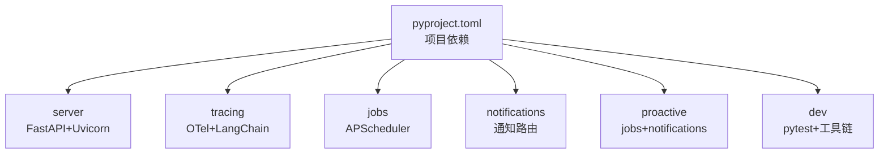

# 维基系统 API

<cite>
**本文档引用的文件**
- [app.py](file://src/ark_agentic/app.py)
- [chat.py](file://src/ark_agentic/api/chat.py)
- [models.py](file://src/ark_agentic/api/models.py)
- [deps.py](file://src/ark_agentic/api/deps.py)
- [notifications.py](file://src/ark_agentic/api/notifications.py)
- [agents.py](file://src/ark_agentic/studio/api/agents.py)
- [skills.py](file://src/ark_agentic/studio/api/skills.py)
- [tools.py](file://src/ark_agentic/studio/api/tools.py)
- [agent_service.py](file://src/ark_agentic/studio/services/agent_service.py)
- [skill_service.py](file://src/ark_agentic/studio/services/skill_service.py)
- [ark-agentic-api.postman_collection.json](file://docs/postman/ark-agentic-api.postman_collection.json)
- [agent.json（保险）](file://src/ark_agentic/agents/insurance/agent.json)
- [agent.json（证券）](file://src/ark_agentic/agents/securities/agent.json)
- [pyproject.toml](file://pyproject.toml)
- [README.md](file://README.md)
</cite>

## 目录
1. [简介](#简介)
2. [项目结构](#项目结构)
3. [核心组件](#核心组件)
4. [架构总览](#架构总览)
5. [详细组件分析](#详细组件分析)
6. [依赖分析](#依赖分析)
7. [性能考虑](#性能考虑)
8. [故障排除指南](#故障排除指南)
9. [结论](#结论)
10. [附录](#附录)

## 简介
本项目是一个面向业务落地的智能体（Agent）基础框架，提供统一的 FastAPI 服务入口，支持两类内置 Agent：保险（insurance）与证券投资（securities）。系统通过会话管理、工具与技能编排、流式响应与 SSE 推送、以及 Studio 管理界面，形成从 API 到可视化管理的完整能力闭环。

- 统一 API 提供健康检查、聊天接口、维基文档浏览、以及可选的通知与作业管理接口。
- Studio 提供 Agent、技能、工具的 CRUD 管理能力，支持脚手架生成与文件系统扫描。
- 维基系统提供多语言文档树与页面内容的读取接口，便于前端或客户端展示知识库。

## 项目结构
整体采用分层与功能域结合的组织方式：
- 核心运行时与基础设施位于 `src/ark_agentic/core/*`
- API 路由位于 `src/ark_agentic/api/*`
- Studio 管理接口位于 `src/ark_agentic/studio/*`
- 业务 Agent 定义位于 `src/ark_agentic/agents/*`
- 文档与示例 Postman 集合位于 `docs/*`

**图表来源**
- [app.py:171-203](file://src/ark_agentic/app.py#L171-L203)
- [chat.py:27-177](file://src/ark_agentic/api/chat.py#L27-L177)
- [notifications.py:24-169](file://src/ark_agentic/api/notifications.py#L24-L169)
- [agents.py:76-131](file://src/ark_agentic/studio/api/agents.py#L76-L131)
- [skills.py:57-113](file://src/ark_agentic/studio/api/skills.py#L57-L113)
- [tools.py:41-66](file://src/ark_agentic/studio/api/tools.py#L41-L66)

**章节来源**
- [app.py:171-203](file://src/ark_agentic/app.py#L171-L203)
- [pyproject.toml:1-112](file://pyproject.toml#L1-L112)

## 核心组件
- 统一服务入口与生命周期管理：负责 CORS、静态资源、健康检查、维基文档接口、以及按环境条件挂载通知与作业路由。
- 聊天 API：支持非流式与 SSE 流式响应，具备会话管理、幂等键、历史合并、运行选项覆盖等功能。
- Studio 管理 API：提供 Agent、技能、工具的增删改查，基于文件系统扫描与写入。
- 通知与作业 API：提供通知历史查询、标记已读、SSE 实时推送、作业列表与手动触发。
- 维基系统：提供多语言目录树与页面内容读取，支持安全路径校验与排序。

**章节来源**
- [app.py:320-323](file://src/ark_agentic/app.py#L320-L323)
- [app.py:236-301](file://src/ark_agentic/app.py#L236-L301)
- [chat.py:27-177](file://src/ark_agentic/api/chat.py#L27-L177)
- [models.py:27-104](file://src/ark_agentic/api/models.py#L27-L104)
- [notifications.py:39-169](file://src/ark_agentic/api/notifications.py#L39-L169)
- [agents.py:76-131](file://src/ark_agentic/studio/api/agents.py#L76-L131)
- [skills.py:57-113](file://src/ark_agentic/studio/api/skills.py#L57-L113)
- [tools.py:41-66](file://src/ark_agentic/studio/api/tools.py#L41-L66)

## 架构总览
系统采用“应用层（FastAPI）—路由层（API）—依赖层（共享 Registry）—业务层（Agent/Studio/服务）—基础设施（会话/流式/观测）”的分层设计。Agent 注册中心贯穿应用生命周期，路由层通过共享依赖获取 AgentRunner 并驱动运行。

**图表来源**
- [app.py:45-168](file://src/ark_agentic/app.py#L45-L168)
- [chat.py:19-38](file://src/ark_agentic/api/chat.py#L19-L38)
- [deps.py:19-37](file://src/ark_agentic/api/deps.py#L19-L37)

## 详细组件分析

### 聊天 API 组件分析
- 请求模型：支持 agent_id、消息、会话、流式、运行选项、协议、来源 BU 与应用类型、用户与消息 ID、上下文、幂等键、历史与历史合并开关。
- 会话管理：优先使用请求体中的 session_id，否则尝试从头中获取；若不存在则创建新会话；支持跨 Agent 切换时的会话重建。
- 流式输出：通过事件总线与格式化器将 Agent 生命周期事件转换为 SSE 输出，支持多种协议（internal/agui/enterprise/alone）。
- 非流式输出：直接返回最终结果，包含响应文本、工具调用、轮次与用量统计。

**图表来源**
- [chat.py:27-177](file://src/ark_agentic/api/chat.py#L27-L177)
- [deps.py:31-37](file://src/ark_agentic/api/deps.py#L31-L37)

**章节来源**
- [chat.py:27-177](file://src/ark_agentic/api/chat.py#L27-L177)
- [models.py:27-69](file://src/ark_agentic/api/models.py#L27-L69)

### 通知与作业 API 组件分析
- 通知 REST：支持按用户拉取历史通知、标记已读；按 agent 隔离存储。
- SSE 实时推送：连接建立时先推送未读计数，心跳维持连接，断开自动注销。
- 作业管理：列出所有已注册作业、手动触发某作业（异步执行，立即返回 202）。

**图表来源**
- [notifications.py:39-169](file://src/ark_agentic/api/notifications.py#L39-L169)

**章节来源**
- [notifications.py:39-169](file://src/ark_agentic/api/notifications.py#L39-L169)

### Studio 管理 API 组件分析
- Agent CRUD：扫描 agents 目录，读取/写入 agent.json，支持创建目录结构与最小元数据回退。
- 技能 CRUD：解析 SKILL.md frontmatter，生成/更新/删除技能，支持内容与 frontmatter 分离更新。
- 工具脚手架：根据参数规范生成 Agent 工具 Python 脚手架。

**图表来源**
- [agent_service.py:30-198](file://src/ark_agentic/studio/services/agent_service.py#L30-L198)
- [skill_service.py:26-294](file://src/ark_agentic/studio/services/skill_service.py#L26-L294)

**章节来源**
- [agents.py:76-131](file://src/ark_agentic/studio/api/agents.py#L76-L131)
- [skills.py:57-113](file://src/ark_agentic/studio/api/skills.py#L57-L113)
- [tools.py:41-66](file://src/ark_agentic/studio/api/tools.py#L41-L66)
- [agent_service.py:60-138](file://src/ark_agentic/studio/services/agent_service.py#L60-L138)
- [skill_service.py:44-187](file://src/ark_agentic/studio/services/skill_service.py#L44-L187)

### 维基系统组件分析
- 维基树接口：读取 zh/en 两套 repowiki 的目录树，按元数据顺序映射排序。
- 维基页面接口：按语言与路径读取 Markdown 内容，进行路径穿越安全校验。
- README 与首页：提供 README 文本与首页重定向。

**图表来源**
- [app.py:236-301](file://src/ark_agentic/app.py#L236-L301)

**章节来源**
- [app.py:236-301](file://src/ark_agentic/app.py#L236-L301)

## 依赖分析
- 应用层依赖：FastAPI、CORS、静态文件、dotenv、OpenTelemetry（可观测性）、APScheduler（可选作业）。
- 核心运行时：Agent 注册中心、AgentRunner、会话管理、流式事件总线、工具与技能加载器。
- Studio 依赖：文件系统扫描、YAML frontmatter 解析、路径安全校验。
- 可选特性：作业管理与通知需要额外依赖组（proactive）。

**图表来源**
- [pyproject.toml:19-55](file://pyproject.toml#L19-L55)

**章节来源**
- [pyproject.toml:19-55](file://pyproject.toml#L19-L55)

## 性能考虑
- 流式响应：SSE 事件通过队列与事件总线异步推送，避免阻塞主线程；心跳机制保障长连接稳定。
- 会话与历史：非流式模式下直接返回结果，减少中间层处理；流式模式下按事件粒度输出，前端可渐进渲染。
- 作业与通知：作业异步派发，通知存储按 agent 隔离，避免跨租户干扰。
- 静态资源与维基：静态文件挂载于 /static；维基树构建按元数据顺序映射，避免全量排序成本。

## 故障排除指南
- 404 Agent 未找到：检查 agent_id 是否正确，或在 app.py 生命周期中是否完成注册。
- 400/409/400：Studio CRUD 接口返回的错误码，分别表示资源已存在、资源不存在、参数校验失败。
- 503 通知/作业未初始化：在未启用相关 extras 的情况下，通知与作业路由不会挂载。
- 路径穿越：维基页面接口对路径进行安全校验，若出现 403，请确认 lang 与 path 合法且未越权访问。

**章节来源**
- [deps.py:31-37](file://src/ark_agentic/api/deps.py#L31-L37)
- [skills.py:76-82](file://src/ark_agentic/studio/api/skills.py#L76-L82)
- [tools.py:60-66](file://src/ark_agentic/studio/api/tools.py#L60-L66)
- [notifications.py:157-169](file://src/ark_agentic/api/notifications.py#L157-L169)
- [app.py:296-301](file://src/ark_agentic/app.py#L296-L301)

## 结论
本维基系统 API 以清晰的分层与模块化设计，提供了统一的聊天、通知、作业、维基与 Studio 管理能力。通过 Agent 注册中心与共享依赖，路由层能够灵活地驱动多 Agent 场景；通过 SSE 与事件总线，实现了高吞吐的流式交互体验；通过文件系统驱动的 Studio 管理，降低了业务侧的维护成本。建议在生产环境中启用可观测性与必要的 extras，以获得更完善的监控与作业能力。

## 附录

### API 端点概览
- 健康检查：GET /health
- 聊天接口：POST /chat（支持流式与非流式）
- 维基树：GET /api/wiki/tree
- 维基页面：GET /api/wiki/{lang}/{path}
- 通知 REST：GET/POST /api/notifications/{agent_id}/{user_id}*
- 通知 SSE：GET /api/notifications/{agent_id}/{user_id}/stream
- 作业管理：GET/POST /api/jobs*
- Studio Agent：GET/POST /agents*
- Studio 技能：GET/POST/PUT/DELETE /agents/{agent_id}/skills*
- Studio 工具：GET/POST /agents/{agent_id}/tools*

注：带 * 的端点仅在启用相应 extras 或环境变量时可用。

**章节来源**
- [app.py:320-323](file://src/ark_agentic/app.py#L320-L323)
- [app.py:236-301](file://src/ark_agentic/app.py#L236-L301)
- [chat.py:27-177](file://src/ark_agentic/api/chat.py#L27-L177)
- [notifications.py:39-169](file://src/ark_agentic/api/notifications.py#L39-L169)
- [agents.py:76-131](file://src/ark_agentic/studio/api/agents.py#L76-L131)
- [skills.py:57-113](file://src/ark_agentic/studio/api/skills.py#L57-L113)
- [tools.py:41-66](file://src/ark_agentic/studio/api/tools.py#L41-L66)

### Postman 集合参考
- 健康检查、聊天（非流式/流式）、会话管理、幂等键、Enterprise AGUI A2UI 示例等均有示例请求，便于快速验证。

**章节来源**
- [ark-agentic-api.postman_collection.json:1-364](file://docs/postman/ark-agentic-api.postman_collection.json#L1-L364)