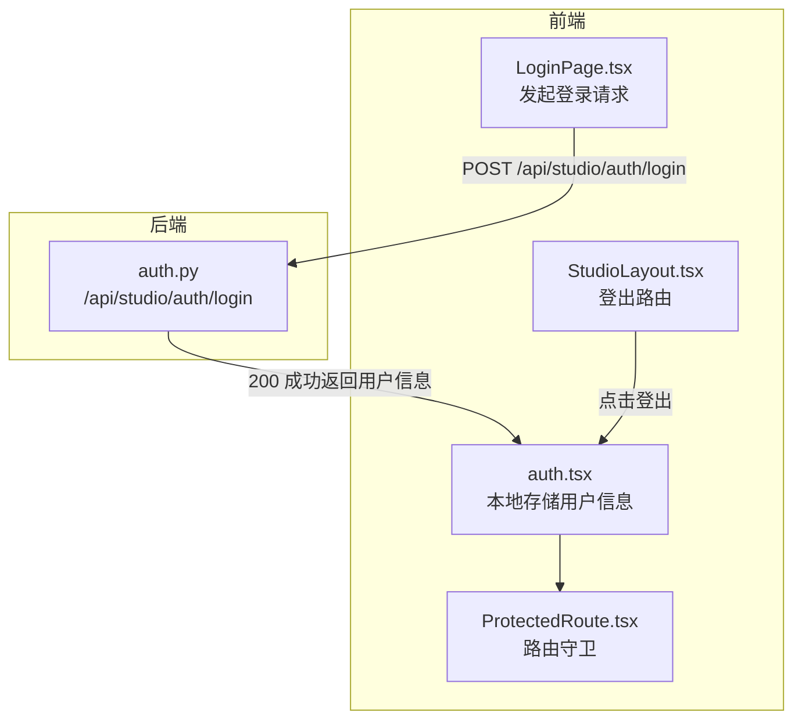
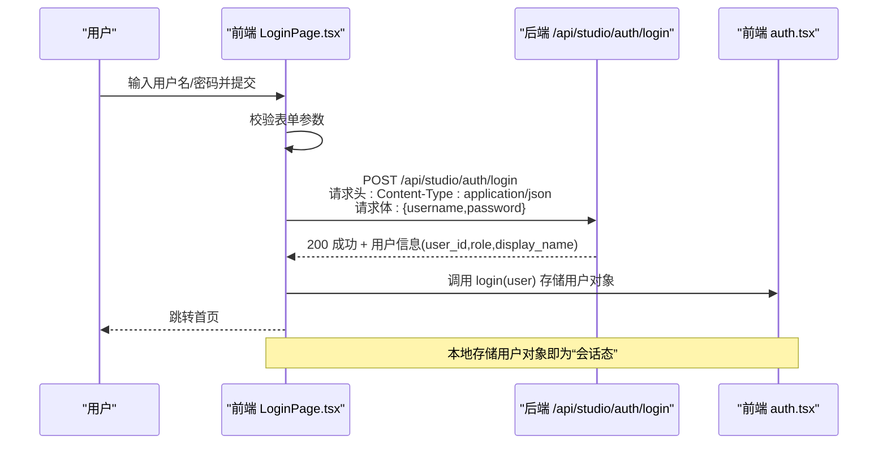
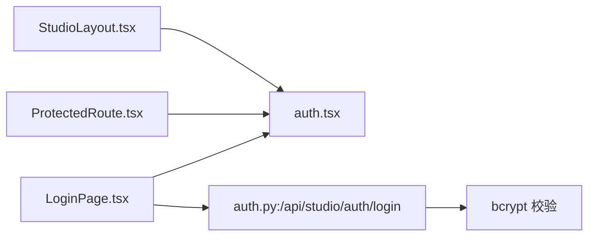

# 认证接口

<cite>
**本文档引用的文件**
- [src/ark_agentic/studio/api/auth.py](file://src/ark_agentic/studio/api/auth.py)
- [src/ark_agentic/studio/frontend/src/pages/LoginPage.tsx](file://src/ark_agentic/studio/frontend/src/pages/LoginPage.tsx)
- [src/ark_agentic/studio/frontend/src/auth.tsx](file://src/ark_agentic/studio/frontend/src/auth.tsx)
- [src/ark_agentic/studio/frontend/src/components/ProtectedRoute.tsx](file://src/ark_agentic/studio/frontend/src/components/ProtectedRoute.tsx)
- [src/ark_agentic/studio/frontend/src/layouts/StudioLayout.tsx](file://src/ark_agentic/studio/frontend/src/layouts/StudioLayout.tsx)
- [tests/unit/studio/test_auth_login.py](file://tests/unit/studio/test_auth_login.py)
</cite>

## 目录
1. [简介](#简介)
2. [项目结构](#项目结构)
3. [核心组件](#核心组件)
4. [架构总览](#架构总览)
5. [详细组件分析](#详细组件分析)
6. [依赖分析](#依赖分析)
7. [性能考虑](#性能考虑)
8. [故障排除指南](#故障排除指南)
9. [结论](#结论)

## 简介
本文件面向 Ark-Agentic Studio 的前端认证流程，聚焦登录、登出与令牌验证等认证相关 API。当前实现采用轻量级凭证校验模式：后端对用户名/密码进行校验并通过，前端在本地存储用户对象；系统未引入 JWT 或 Cookie 会话，因此不存在传统意义上的“令牌刷新”策略。本文将详细说明请求头格式、响应内容、错误处理与安全注意事项，并提供认证失败的处理方式。

## 项目结构
认证相关代码分布在后端 FastAPI 接口与前端 React 组件中，形成“后端校验 + 前端状态”的认证闭环。

图表来源
- [src/ark_agentic/studio/api/auth.py:94-114](file://src/ark_agentic/studio/api/auth.py#L94-L114)
- [src/ark_agentic/studio/frontend/src/pages/LoginPage.tsx:15-38](file://src/ark_agentic/studio/frontend/src/pages/LoginPage.tsx#L15-L38)
- [src/ark_agentic/studio/frontend/src/auth.tsx:19-39](file://src/ark_agentic/studio/frontend/src/auth.tsx#L19-L39)
- [src/ark_agentic/studio/frontend/src/components/ProtectedRoute.tsx:4-7](file://src/ark_agentic/studio/frontend/src/components/ProtectedRoute.tsx#L4-L7)
- [src/ark_agentic/studio/frontend/src/layouts/StudioLayout.tsx:26-29](file://src/ark_agentic/studio/frontend/src/layouts/StudioLayout.tsx#L26-L29)

章节来源
- [src/ark_agentic/studio/api/auth.py:1-115](file://src/ark_agentic/studio/api/auth.py#L1-L115)
- [src/ark_agentic/studio/frontend/src/pages/LoginPage.tsx:1-41](file://src/ark_agentic/studio/frontend/src/pages/LoginPage.tsx#L1-L41)
- [src/ark_agentic/studio/frontend/src/auth.tsx:1-53](file://src/ark_agentic/studio/frontend/src/auth.tsx#L1-L53)
- [src/ark_agentic/studio/frontend/src/components/ProtectedRoute.tsx:1-8](file://src/ark_agentic/studio/frontend/src/components/ProtectedRoute.tsx#L1-L8)
- [src/ark_agentic/studio/frontend/src/layouts/StudioLayout.tsx:1-129](file://src/ark_agentic/studio/frontend/src/layouts/StudioLayout.tsx#L1-L129)

## 核心组件
- 登录接口：后端提供 /api/studio/auth/login，接收用户名与密码，校验通过后返回用户标识信息。
- 前端登录页：负责收集凭据并发起登录请求，处理响应与错误。
- 前端认证上下文：在本地存储用户对象，作为“会话态”的载体。
- 路由守卫：未登录用户被重定向至登录页。
- 登出路由：清除本地用户信息并跳转登录页。

章节来源
- [src/ark_agentic/studio/api/auth.py:94-114](file://src/ark_agentic/studio/api/auth.py#L94-L114)
- [src/ark_agentic/studio/frontend/src/pages/LoginPage.tsx:15-38](file://src/ark_agentic/studio/frontend/src/pages/LoginPage.tsx#L15-L38)
- [src/ark_agentic/studio/frontend/src/auth.tsx:19-39](file://src/ark_agentic/studio/frontend/src/auth.tsx#L19-L39)
- [src/ark_agentic/studio/frontend/src/components/ProtectedRoute.tsx:4-7](file://src/ark_agentic/studio/frontend/src/components/ProtectedRoute.tsx#L4-L7)
- [src/ark_agentic/studio/frontend/src/layouts/StudioLayout.tsx:26-29](file://src/ark_agentic/studio/frontend/src/layouts/StudioLayout.tsx#L26-L29)

## 架构总览
下面的序列图展示了从用户输入凭据到完成认证的完整流程。

图表来源
- [src/ark_agentic/studio/frontend/src/pages/LoginPage.tsx:15-38](file://src/ark_agentic/studio/frontend/src/pages/LoginPage.tsx#L15-L38)
- [src/ark_agentic/studio/api/auth.py:94-114](file://src/ark_agentic/studio/api/auth.py#L94-L114)
- [src/ark_agentic/studio/frontend/src/auth.tsx:31-34](file://src/ark_agentic/studio/frontend/src/auth.tsx#L31-L34)

## 详细组件分析

### 登录接口（POST /api/studio/auth/login）
- 请求方法与路径
  - 方法：POST
  - 路径：/api/studio/auth/login
- 请求头
  - Content-Type: application/json
- 请求体字段
  - username: 字符串，必填
  - password: 字符串，必填
- 成功响应
  - 状态码：200
  - 响应体字段：
    - user_id: 字符串，用户唯一标识
    - role: 字符串，角色（如 editor/viewer）
    - display_name: 字符串，显示名称
- 失败响应
  - 状态码：401
  - 响应体：包含错误描述（例如“Invalid username or password”）

安全要点
- 密码采用 bcrypt 哈希校验，不存储明文密码。
- 支持通过环境变量配置用户集合；若环境变量无效则回退默认用户集。
- 若用户记录缺少 password_hash 字段，将拒绝验证。

章节来源
- [src/ark_agentic/studio/api/auth.py:29-38](file://src/ark_agentic/studio/api/auth.py#L29-L38)
- [src/ark_agentic/studio/api/auth.py:68-81](file://src/ark_agentic/studio/api/auth.py#L68-L81)
- [src/ark_agentic/studio/api/auth.py:83-92](file://src/ark_agentic/studio/api/auth.py#L83-L92)
- [src/ark_agentic/studio/api/auth.py:94-114](file://src/ark_agentic/studio/api/auth.py#L94-L114)
- [tests/unit/studio/test_auth_login.py:42-72](file://tests/unit/studio/test_auth_login.py#L42-L72)
- [tests/unit/studio/test_auth_login.py:74-98](file://tests/unit/studio/test_auth_login.py#L74-L98)
- [tests/unit/studio/test_auth_login.py:100-118](file://tests/unit/studio/test_auth_login.py#L100-L118)
- [tests/unit/studio/test_auth_login.py:121-132](file://tests/unit/studio/test_auth_login.py#L121-L132)

### 前端登录页面（LoginPage.tsx）
- 行为概述
  - 收集 username/password 并以 JSON 形式发送到后端。
  - 若响应非 200，解析错误信息并展示。
  - 成功后调用登录回调，将用户对象存入本地存储。
- 错误处理
  - 非 200 响应时捕获并提示错误。
  - 解析失败时回退为 HTTP 状态描述。

章节来源
- [src/ark_agentic/studio/frontend/src/pages/LoginPage.tsx:15-38](file://src/ark_agentic/studio/frontend/src/pages/LoginPage.tsx#L15-L38)

### 前端认证上下文（auth.tsx）
- 行为概述
  - 提供用户对象的读取、登录写入、登出清理。
  - 使用 localStorage 存储用户对象，键名固定。
- 登出行为
  - 清除本地存储中的用户条目，重置应用内用户状态。

章节来源
- [src/ark_agentic/studio/frontend/src/auth.tsx:19-39](file://src/ark_agentic/studio/frontend/src/auth.tsx#L19-L39)

### 路由守卫（ProtectedRoute.tsx）
- 行为概述
  - 若未检测到用户对象，则重定向到登录页。
  - 已登录则渲染子路由内容。

章节来源
- [src/ark_agentic/studio/frontend/src/components/ProtectedRoute.tsx:4-7](file://src/ark_agentic/studio/frontend/src/components/ProtectedRoute.tsx#L4-L7)

### 登出路由（StudioLayout.tsx）
- 行为概述
  - 提供登出按钮，调用登出函数并导航到登录页。

章节来源
- [src/ark_agentic/studio/frontend/src/layouts/StudioLayout.tsx:26-29](file://src/ark_agentic/studio/frontend/src/layouts/StudioLayout.tsx#L26-L29)

### 登出流程（POST /api/studio/auth/logout）
- 当前实现说明
  - 后端未提供专门的登出接口。
  - 登出通过前端清除本地存储的用户对象实现。
- 建议
  - 如需服务端撤销会话或令牌，可在后端新增 /api/studio/auth/logout 并在前端调用。

（本小节为概念性建议，不对应具体源码文件）

## 依赖分析
- 前端依赖
  - LoginPage.tsx 依赖 auth.tsx 的登录回调。
  - ProtectedRoute.tsx 依赖 auth.tsx 的用户状态。
  - StudioLayout.tsx 依赖 auth.tsx 的登出回调。
- 后端依赖
  - 登录接口依赖 bcrypt 进行密码校验。
  - 用户数据来源优先来自环境变量，其次为内置默认值。

图表来源
- [src/ark_agentic/studio/frontend/src/pages/LoginPage.tsx:15-38](file://src/ark_agentic/studio/frontend/src/pages/LoginPage.tsx#L15-L38)
- [src/ark_agentic/studio/frontend/src/auth.tsx:31-34](file://src/ark_agentic/studio/frontend/src/auth.tsx#L31-L34)
- [src/ark_agentic/studio/frontend/src/components/ProtectedRoute.tsx:4-7](file://src/ark_agentic/studio/frontend/src/components/ProtectedRoute.tsx#L4-L7)
- [src/ark_agentic/studio/frontend/src/layouts/StudioLayout.tsx:26-29](file://src/ark_agentic/studio/frontend/src/layouts/StudioLayout.tsx#L26-L29)
- [src/ark_agentic/studio/api/auth.py:83-92](file://src/ark_agentic/studio/api/auth.py#L83-L92)

章节来源
- [src/ark_agentic/studio/api/auth.py:83-92](file://src/ark_agentic/studio/api/auth.py#L83-L92)
- [src/ark_agentic/studio/frontend/src/auth.tsx:19-39](file://src/ark_agentic/studio/frontend/src/auth.tsx#L19-L39)

## 性能考虑
- 前端
  - 本地存储用户对象，避免每次页面访问都请求后端认证。
- 后端
  - bcrypt 校验成本适中，适合内部工具场景。
  - 用户列表加载受环境变量解析影响，建议在部署时预设 STUDIO_USERS。

（本节为通用建议，不涉及具体源码分析）

## 故障排除指南
- 登录失败（401）
  - 可能原因：用户名不存在、密码错误、用户记录缺少 password_hash。
  - 处理建议：确认凭据正确；检查环境变量 STUDIO_USERS 是否为合法 JSON 对象。
- 环境变量 STUDIO_USERS 无效
  - 行为：回退到内置默认用户集。
  - 处理建议：修正 JSON 格式或移除该环境变量以使用默认用户。
- 前端无法进入受保护页面
  - 行为：被路由守卫重定向到登录页。
  - 处理建议：确认登录成功且本地存储存在用户对象。

章节来源
- [tests/unit/studio/test_auth_login.py:42-72](file://tests/unit/studio/test_auth_login.py#L42-L72)
- [tests/unit/studio/test_auth_login.py:74-98](file://tests/unit/studio/test_auth_login.py#L74-L98)
- [tests/unit/studio/test_auth_login.py:100-118](file://tests/unit/studio/test_auth_login.py#L100-L118)
- [tests/unit/studio/test_auth_login.py:121-132](file://tests/unit/studio/test_auth_login.py#L121-L132)
- [src/ark_agentic/studio/api/auth.py:68-81](file://src/ark_agentic/studio/api/auth.py#L68-L81)
- [src/ark_agentic/studio/frontend/src/components/ProtectedRoute.tsx:4-7](file://src/ark_agentic/studio/frontend/src/components/ProtectedRoute.tsx#L4-L7)

## 结论
- 当前认证方案为“轻量级凭证校验 + 前端本地会话”，无需 JWT 或 Cookie。
- 登录成功后，前端将用户对象保存在本地存储，作为后续页面访问的“会话态”依据。
- 未提供后端登出接口，登出通过前端清除本地存储实现。
- 若需增强安全性或支持多设备会话管理，可考虑引入后端会话/令牌机制并在前端实现刷新策略。