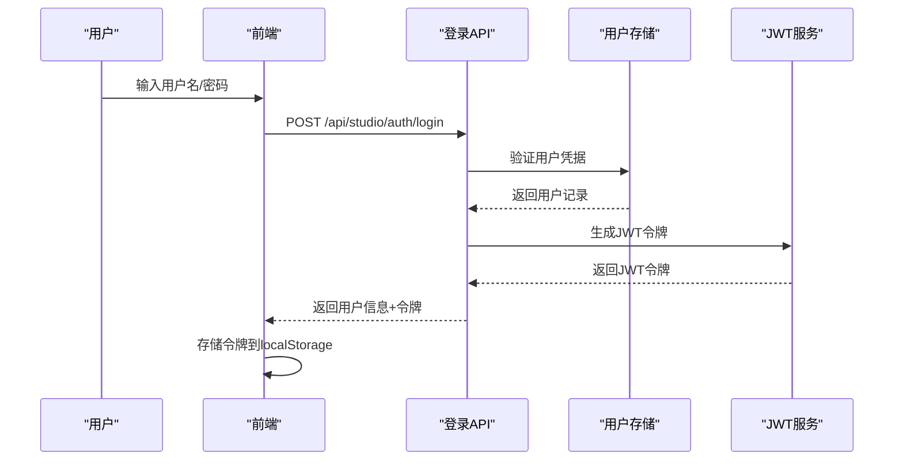
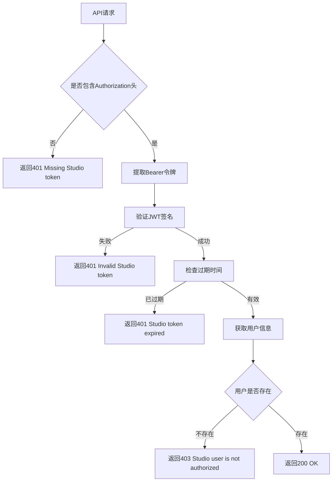

# 认证接口

<cite>
**本文档引用的文件**
- [src/ark_agentic/studio/api/auth.py](file://src/ark_agentic/studio/api/auth.py)
- [src/ark_agentic/studio/services/authz_service.py](file://src/ark_agentic/studio/services/authz_service.py)
- [src/ark_agentic/studio/frontend/src/pages/LoginPage.tsx](file://src/ark_agentic/studio/frontend/src/pages/LoginPage.tsx)
- [src/ark_agentic/studio/frontend/src/auth.tsx](file://src/ark_agentic/studio/frontend/src/auth.tsx)
- [src/ark_agentic/studio/frontend/src/components/ProtectedRoute.tsx](file://src/ark_agentic/studio/frontend/src/components/ProtectedRoute.tsx)
- [src/ark_agentic/studio/frontend/src/api.ts](file://src/ark_agentic/studio/frontend/src/api.ts)
- [tests/unit/studio/test_auth_login.py](file://tests/unit/studio/test_auth_login.py)
- [tests/unit/studio/test_users_authz.py](file://tests/unit/studio/test_users_authz.py)
</cite>

## 更新摘要
**所做更改**
- 新增JWT令牌系统实现，包括令牌生成、验证和过期处理
- 引入完整的RBAC框架，支持管理员、编辑者、查看者三种角色
- 更新登录接口以返回JWT令牌而非仅用户信息
- 新增基于角色的权限控制机制
- 完善前端令牌处理和API请求头管理
- 添加用户管理API和权限验证中间件

## 目录
1. [简介](#简介)
2. [JWT令牌系统](#jwt令牌系统)
3. [RBAC角色管理](#rbac角色管理)
4. [认证流程](#认证流程)
5. [API接口规范](#api接口规范)
6. [前端集成](#前端集成)
7. [权限控制](#权限控制)
8. [安全考虑](#安全考虑)
9. [故障排除](#故障排除)
10. [总结](#总结)

## 简介
本文件详细记录了Ark-Agentic Studio的完整认证系统，包括JWT令牌系统、RBAC角色管理和管理员保护机制。系统已从原有的轻量级认证升级为完整的RBAC框架，提供令牌签名、用户角色分配、权限验证等功能。

**更新** 系统现已支持JWT令牌认证，包含令牌生成、验证、过期处理和基于角色的权限控制。

## JWT令牌系统

### 令牌结构
系统使用标准JWT格式，包含以下声明：

- **sub**: 用户唯一标识符
- **iat**: 发布时间戳（Unix秒）
- **exp**: 过期时间戳（Unix秒）

### 令牌生成
```python
def issue_studio_token(user_id: str) -> str:
    now = int(time.time())
    payload = {
        "sub": user_id,
        "iat": now,
        "exp": now + _token_ttl_seconds(),
    }
    # 使用HS256算法签名
    header = {"alg": "HS256", "typ": "JWT"}
    # 生成签名输入并计算HMAC-SHA256签名
    signature = hmac.new(
        _token_secret().encode("utf-8"),
        signing_input.encode("ascii"),
        hashlib.sha256,
    ).digest()
    return f"{signing_input}.{_b64encode(signature)}"
```

### 令牌验证
```python
def _decode_studio_token(token: str) -> dict:
    # 分割JWT三部分
    header_b64, payload_b64, signature_b64 = token.split(".", 2)
    # 验证签名
    expected = hmac.new(
        _token_secret().encode("utf-8"),
        signing_input.encode("ascii"),
        hashlib.sha256,
    ).digest()
    # 检查过期时间
    if int(payload.get("exp", 0)) < int(time.time()):
        raise HTTPException(status_code=401, detail="Studio token expired")
    return payload
```

**章节来源**
- [src/ark_agentic/studio/services/authz_service.py:341-358](file://src/ark_agentic/studio/services/authz_service.py#L341-L358)
- [src/ark_agentic/studio/services/authz_service.py:361-386](file://src/ark_agentic/studio/services/authz_service.py#L361-L386)

## RBAC角色管理

### 角色定义
系统支持三种角色，按权限等级递减：

| 角色 | 权限描述 | 可执行操作 |
|------|----------|------------|
| admin | 管理员 | 完全访问权限，可管理用户 |
| editor | 编辑者 | 可编辑资源，有限管理权限 |
| viewer | 查看者 | 只读访问权限 |

### 用户存储
用户信息存储在SQLite数据库中，包含以下字段：
- user_id: 用户唯一标识符
- role: 用户角色（admin/editor/viewer）
- created_at: 创建时间
- updated_at: 更新时间
- created_by: 创建者
- updated_by: 最后更新者

### 角色验证
```python
def require_studio_roles(*allowed_roles: StudioRole):
    allowed = set(allowed_roles)
    
    async def _dependency(
        principal: StudioPrincipal = Depends(require_studio_user),
    ) -> StudioPrincipal:
        if principal.role not in allowed:
            raise HTTPException(status_code=403, detail="Insufficient Studio role")
        return principal
    
    return _dependency
```

**章节来源**
- [src/ark_agentic/studio/services/authz_service.py:27-28](file://src/ark_agentic/studio/services/authz_service.py#L27-L28)
- [src/ark_agentic/studio/services/authz_service.py:119-240](file://src/ark_agentic/studio/services/authz_service.py#L119-L240)
- [src/ark_agentic/studio/services/authz_service.py:408-418](file://src/ark_agentic/studio/services/authz_service.py#L408-L418)

## 认证流程

### 登录流程


**图表来源**
- [src/ark_agentic/studio/api/auth.py:96-119](file://src/ark_agentic/studio/api/auth.py#L96-L119)
- [src/ark_agentic/studio/frontend/src/pages/LoginPage.tsx:17-42](file://src/ark_agentic/studio/frontend/src/pages/LoginPage.tsx#L17-L42)

### 令牌验证流程


**图表来源**
- [src/ark_agentic/studio/services/authz_service.py:389-405](file://src/ark_agentic/studio/services/authz_service.py#L389-L405)

**章节来源**
- [src/ark_agentic/studio/api/auth.py:96-119](file://src/ark_agentic/studio/api/auth.py#L96-L119)
- [src/ark_agentic/studio/services/authz_service.py:389-405](file://src/ark_agentic/studio/services/authz_service.py#L389-L405)

## API接口规范

### 登录接口
**POST** `/api/studio/auth/login`

**请求体**
```json
{
    "username": "string",
    "password": "string"
}
```

**响应体**
```json
{
    "user_id": "string",
    "role": "admin|editor|viewer",
    "display_name": "string",
    "token": "string"
}
```

**状态码**
- 200: 登录成功
- 401: 凭据无效
- 400: 请求格式错误

### 用户管理接口

**GET** `/api/studio/users`
- 需要角色: admin
- 功能: 列出所有用户，支持分页和过滤

**POST** `/api/studio/users`
- 需要角色: admin
- 功能: 创建或更新用户角色

**DELETE** `/api/studio/users/{user_id}`
- 需要角色: admin
- 功能: 删除用户

**章节来源**
- [src/ark_agentic/studio/api/auth.py:96-119](file://src/ark_agentic/studio/api/auth.py#L96-L119)
- [src/ark_agentic/studio/api/users.py:50-94](file://src/ark_agentic/studio/api/users.py#L50-L94)

## 前端集成

### 令牌存储
前端使用localStorage存储用户令牌，键名为`ark_studio_user`：

```typescript
interface StudioUser {
    user_id: string;
    role: StudioRole;
    display_name: string;
    token: string;
}

// 存储用户信息
localStorage.setItem('ark_studio_user', JSON.stringify(user))

// 获取用户令牌
const token = JSON.parse(localStorage.getItem('ark_studio_user') || '{}').token
```

### API请求头
所有API请求自动添加Authorization头：

```typescript
function withAuth(init: RequestInit = {}): RequestInit {
    const headers = new Headers(init.headers)
    const token = getAuthToken()
    if (token) headers.set('Authorization', `Bearer ${token}`)
    return { ...init, headers }
}
```

### 权限检查
```typescript
export function canEditStudio(role: StudioRole | undefined | null): boolean {
    return role === 'admin' || role === 'editor'
}

export function canManageUsers(role: StudioRole | undefined | null): boolean {
    return role === 'admin'
}
```

**章节来源**
- [src/ark_agentic/studio/frontend/src/auth.tsx:18-39](file://src/ark_agentic/studio/frontend/src/auth.tsx#L18-L39)
- [src/ark_agentic/studio/frontend/src/api.ts:33-38](file://src/ark_agentic/studio/frontend/src/api.ts#L33-L38)
- [src/ark_agentic/studio/frontend/src/auth.tsx:71-77](file://src/ark_agentic/studio/frontend/src/auth.tsx#L71-L77)

## 权限控制

### 中间件实现
```python
async def require_studio_user(
    authorization: str | None = Header(None, alias="Authorization"),
) -> StudioPrincipal:
    payload = _decode_studio_token(_extract_bearer(authorization))
    record = get_studio_user_store().get_user(str(payload["sub"]))
    if record is None:
        raise HTTPException(status_code=403, detail="Studio user is not authorized")
    return StudioPrincipal(user_id=record.user_id, role=record.role)

def require_studio_roles(*allowed_roles: StudioRole):
    # 角色权限检查装饰器
    pass
```

### 路由保护
```typescript
// 受保护路由组件
export default function ProtectedRoute() {
    const { user } = useAuth()
    if (!user) return <Navigate to="/login" replace />
    return <Outlet />
}

// 管理员专用路由
<Route element={
    <ProtectedRoute>
        <RequireRole roles={['admin']}>
            <UsersPage />
        </RequireRole>
    </ProtectedRoute>
} />
```

**章节来源**
- [src/ark_agentic/studio/services/authz_service.py:398-405](file://src/ark_agentic/studio/services/authz_service.py#L398-L405)
- [src/ark_agentic/studio/frontend/src/components/ProtectedRoute.tsx:4-8](file://src/ark_agentic/studio/frontend/src/components/ProtectedRoute.tsx#L4-L8)

## 安全考虑

### 环境变量配置
- `STUDIO_AUTH_TOKEN_SECRET`: JWT签名密钥（必需）
- `STUDIO_AUTH_TOKEN_TTL_SECONDS`: 令牌有效期（默认43200秒）
- Studio 用户授权存储跟随 `DB_TYPE`：file 模式写入 `data/ark_studio.json`，sqlite 模式复用 `DB_CONNECTION_STR` 指向的数据库。

### 安全特性
- **令牌过期**: 自动过期机制防止长期有效令牌
- **签名验证**: 使用HMAC-SHA256确保令牌完整性
- **角色分离**: 不同角色具有不同权限范围
- **统一存储配置**: Studio 用户授权跟随项目级 `DB_TYPE` / `DB_CONNECTION_STR`
- **密码哈希**: 使用bcrypt存储密码哈希值

### 最佳实践
- 生产环境必须设置`STUDIO_AUTH_TOKEN_SECRET`
- 合理设置令牌有效期
- 定期轮换令牌密钥
- 实施适当的日志记录和监控

**章节来源**
- [src/ark_agentic/studio/services/authz_service.py:309-329](file://src/ark_agentic/studio/services/authz_service.py#L309-L329)
- [src/ark_agentic/studio/api/auth.py:1-12](file://src/ark_agentic/studio/api/auth.py#L1-L12)

## 故障排除

### 常见问题

**登录失败 (401)**
- 检查用户名和密码是否正确
- 确认`STUDIO_USERS`环境变量格式正确
- 验证密码哈希值格式

**令牌验证失败 (401)**
- 检查令牌是否过期
- 确认`STUDIO_AUTH_TOKEN_SECRET`配置正确
- 验证Authorization头格式

**权限不足 (403)**
- 确认用户角色是否足够
- 检查目标API的权限要求
- 验证用户是否存在

**令牌过期 (401)**
- 系统会自动重新登录获取新令牌
- 检查客户端是否正确处理令牌刷新

### 调试步骤
1. 检查服务器日志中的认证错误
2. 验证环境变量配置
3. 测试JWT令牌签名算法
4. 确认数据库连接正常

**章节来源**
- [tests/unit/studio/test_auth_login.py:42-72](file://tests/unit/studio/test_auth_login.py#L42-L72)
- [tests/unit/studio/test_auth_login.py:113-131](file://tests/unit/studio/test_auth_login.py#L113-L131)
- [tests/unit/studio/test_users_authz.py:62-71](file://tests/unit/studio/test_users_authz.py#L62-L71)

## 总结

Ark-Agentic Studio的认证系统已全面升级为基于JWT的RBAC框架，提供了：

- **完整的令牌系统**: 支持JWT生成、验证和过期管理
- **细粒度权限控制**: 基于角色的访问控制机制
- **安全的用户管理**: 数据库驱动的用户存储和角色管理
- **前后端一体化**: 前端自动处理令牌存储和API请求头
- **可扩展的架构**: 易于添加新的角色和权限规则

系统现已具备企业级认证能力，支持多用户协作和权限分离管理。建议在生产环境中正确配置环境变量并实施适当的安全措施。
