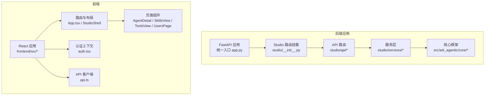
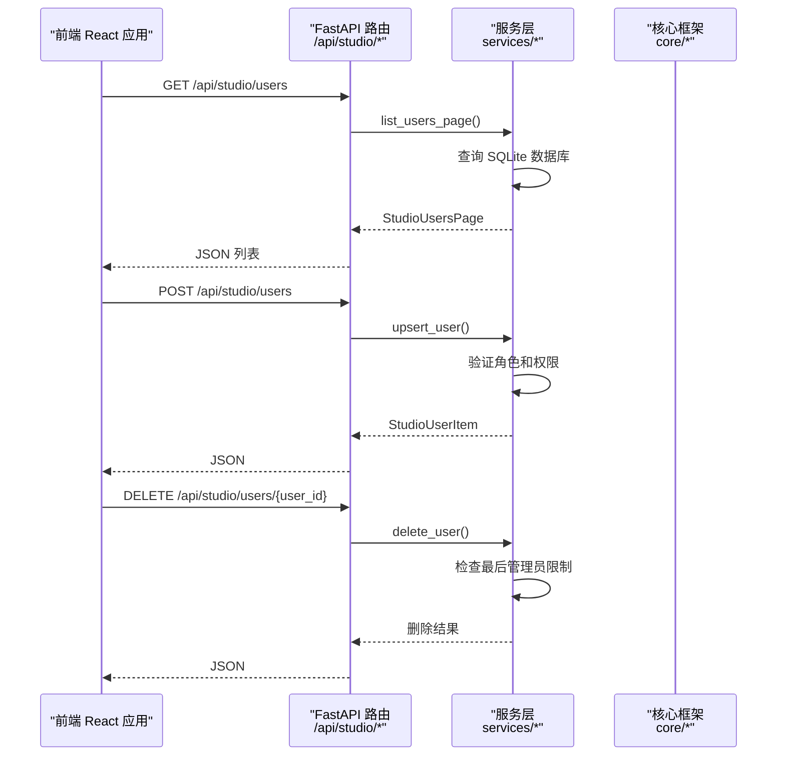
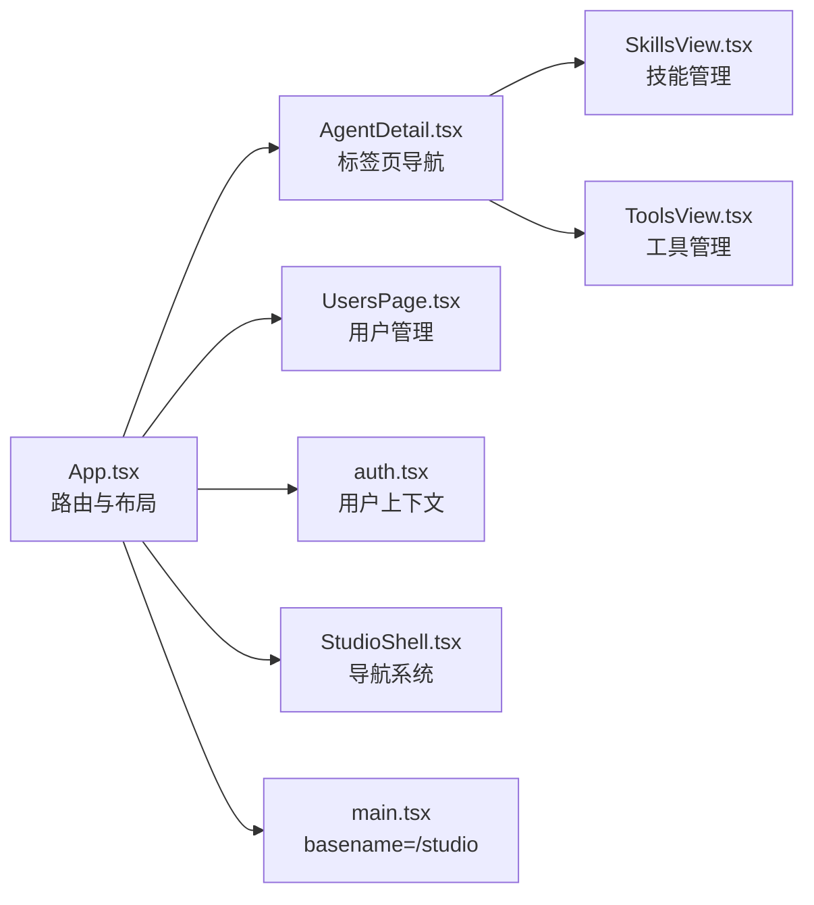
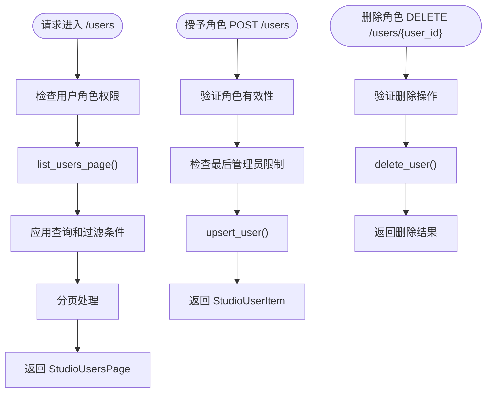
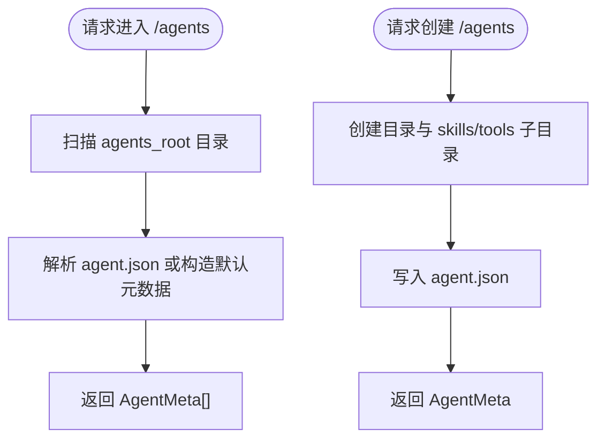
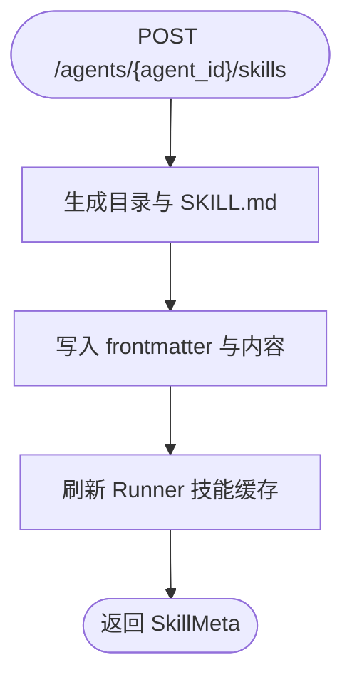
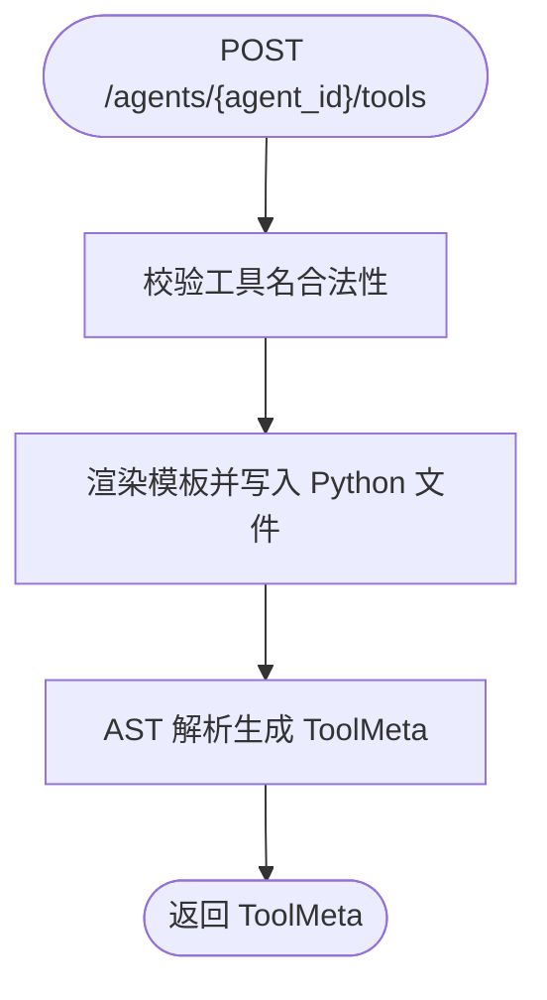
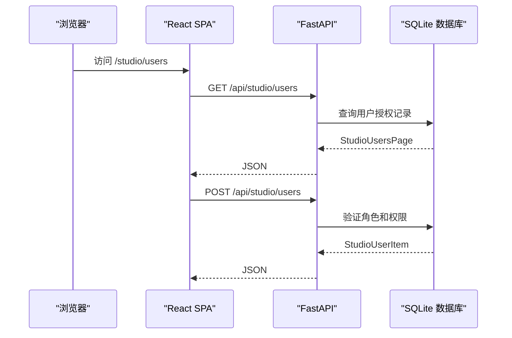
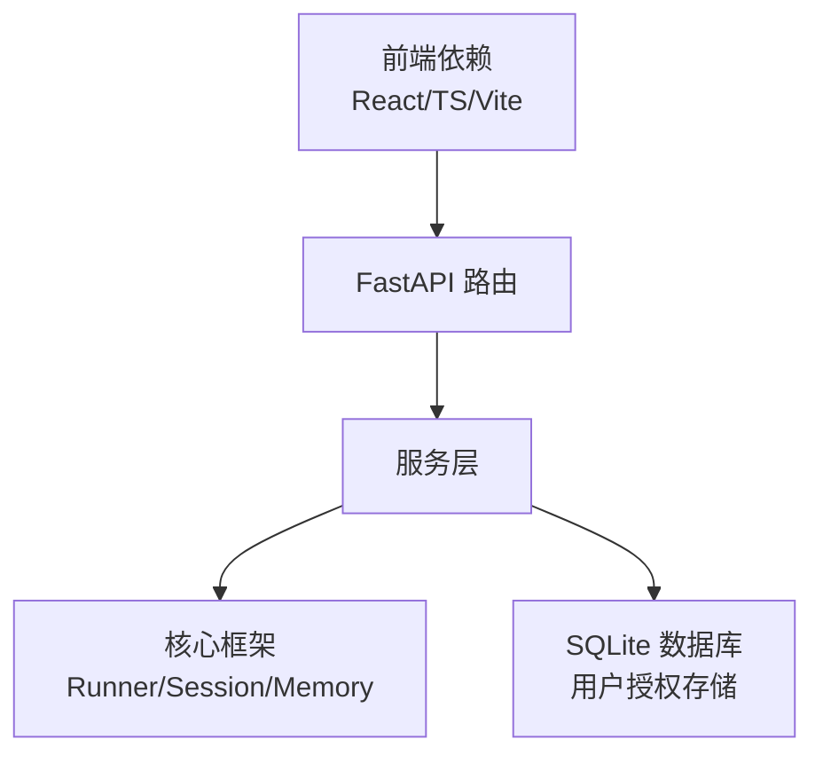

# Studio 开发工具

<cite>
**本文档引用的文件**
- [README.md](file://README.md)
- [app.py](file://src/ark_agentic/app.py)
- [__init__.py](file://src/ark_agentic/studio/__init__.py)
- [package.json](file://src/ark_agentic/studio/frontend/package.json)
- [App.tsx](file://src/ark_agentic/studio/frontend/src/App.tsx)
- [main.tsx](file://src/ark_agentic/studio/frontend/src/main.tsx)
- [auth.tsx](file://src/ark_agentic/studio/frontend/src/auth.tsx)
- [UsersPage.tsx](file://src/ark_agentic/studio/frontend/src/pages/UsersPage.tsx)
- [StudioShell.tsx](file://src/ark_agentic/studio/frontend/src/layouts/StudioShell.tsx)
- [api.ts](file://src/ark_agentic/studio/frontend/src/api.ts)
- [AgentDetail.tsx](file://src/ark_agentic/studio/frontend/src/pages/AgentDetail.tsx)
- [SkillsView.tsx](file://src/ark_agentic/studio/frontend/src/pages/SkillsView.tsx)
- [ToolsView.tsx](file://src/ark_agentic/studio/frontend/src/pages/ToolsView.tsx)
- [users.py](file://src/ark_agentic/studio/api/users.py)
- [agents.py](file://src/ark_agentic/studio/api/agents.py)
- [skills.py](file://src/ark_agentic/studio/api/skills.py)
- [tools.py](file://src/ark_agentic/studio/api/tools.py)
- [authz_service.py](file://src/ark_agentic/studio/services/authz_service.py)
- [agent_service.py](file://src/ark_agentic/studio/services/agent_service.py)
- [skill_service.py](file://src/ark_agentic/studio/services/skill_service.py)
- [tool_service.py](file://src/ark_agentic/studio/services/tool_service.py)
- [runner.py](file://src/ark_agentic/core/runner.py)
</cite>

## 目录
1. [简介](#简介)
2. [项目结构](#项目结构)
3. [核心组件](#核心组件)
4. [架构总览](#架构总览)
5. [详细组件分析](#详细组件分析)
6. [依赖分析](#依赖分析)
7. [性能考虑](#性能考虑)
8. [故障排查指南](#故障排查指南)
9. [结论](#结论)
10. [附录](#附录)

## 简介
本文件面向 Studio 开发工具，系统性阐述其前端架构（React 组件设计、状态管理、路由配置）、后端服务（API 路由设计、业务逻辑层、数据模型）、开发工作流以及与后端 API 的集成方式。重点覆盖以下能力：
- 智能体管理：Agent 列表、详情、创建与删除
- 技能编辑器：技能的增删改查、元数据与内容管理
- 工具开发平台：工具脚手架生成、参数定义与 AST 解析
- 用户管理：用户角色授权、权限控制与审计
- 会话与记忆视图：会话与用户记忆的浏览
- 与后端 API 的集成：REST 接口、认证与鉴权、前端路由与状态

## 项目结构
Studio 采用"可选控制台"模式，通过环境变量启用，挂载于统一 FastAPI 应用之下，提供 React 前端与薄 HTTP API 层，业务逻辑由服务层封装。

**图表来源**
- [app.py:137-165](file://src/ark_agentic/app.py#L137-L165)
- [__init__.py:27-84](file://src/ark_agentic/studio/__init__.py#L27-L84)
- [users.py:22](file://src/ark_agentic/studio/api/users.py#L22)
- [agents.py:22](file://src/ark_agentic/studio/api/agents.py#L22)
- [skills.py:21](file://src/ark_agentic/studio/api/skills.py#L21)
- [tools.py:21](file://src/ark_agentic/studio/api/tools.py#L21)

**章节来源**
- [app.py:137-165](file://src/ark_agentic/app.py#L137-L165)
- [__init__.py:27-84](file://src/ark_agentic/studio/__init__.py#L27-L84)

## 核心组件
- 前端组件
  - 路由与布局：App.tsx 定义受保护路由与主布局，main.tsx 配置 basename="/studio" 与认证 Provider。
  - 页面组件：AgentDetail 负责标签页导航；SkillsView 与 ToolsView 分别承载技能与工具的增删改查与脚手架生成；UsersPage 提供用户角色管理功能。
  - 认证上下文：auth.tsx 提供登录登出与角色管理，本地存储用户信息，支持角色权限检查函数。
  - API 客户端：api.ts 提供统一的 API 访问接口，包含用户管理相关的数据模型和方法。
- 后端 API
  - User：users.py 提供用户列表查询、角色授予与删除，支持分页和过滤。
  - Agent：agents.py 提供 Agent 列表、详情、创建。
  - Skill：skills.py 提供技能 CRUD，写入后刷新 Runner 的技能缓存。
  - Tool：tools.py 提供工具脚手架生成，基于 AST 解析工具元数据。
- 服务层
  - authz_service：用户授权存储，支持 SQLite 数据库存储、角色验证和权限控制。
  - agent_service：Agent 脚手架创建、列表扫描、删除。
  - skill_service：技能 CRUD、frontmatter 解析、目录安全检查。
  - tool_service：工具脚手架生成、AST 解析、参数 schema 提取。
- 集成点
  - app.py 统一挂载 Chat API 与 Studio，条件启用并挂载前端静态资源。
  - __init__.py 条件挂载 Studio 路由与前端静态文件，支持 SPA 路由兜底。

**章节来源**
- [App.tsx:8-26](file://src/ark_agentic/studio/frontend/src/App.tsx#L8-L26)
- [main.tsx:8-16](file://src/ark_agentic/studio/frontend/src/main.tsx#L8-L16)
- [auth.tsx:28-52](file://src/ark_agentic/studio/frontend/src/auth.tsx#L28-L52)
- [UsersPage.tsx:25-190](file://src/ark_agentic/studio/frontend/src/pages/UsersPage.tsx#L25-L190)
- [StudioShell.tsx:223-232](file://src/ark_agentic/studio/frontend/src/layouts/StudioShell.tsx#L223-L232)
- [api.ts:240-259](file://src/ark_agentic/studio/frontend/src/api.ts#L240-L259)
- [users.py:45-101](file://src/ark_agentic/studio/api/users.py#L45-L101)
- [agents.py:76-131](file://src/ark_agentic/studio/api/agents.py#L76-L131)
- [skills.py:57-113](file://src/ark_agentic/studio/api/skills.py#L57-L113)
- [tools.py:41-66](file://src/ark_agentic/studio/api/tools.py#L41-L66)
- [authz_service.py:119-290](file://src/ark_agentic/studio/services/authz_service.py#L119-L290)
- [agent_service.py:60-137](file://src/ark_agentic/studio/services/agent_service.py#L60-L137)
- [skill_service.py:42-183](file://src/ark_agentic/studio/services/skill_service.py#L42-L183)
- [tool_service.py:40-98](file://src/ark_agentic/studio/services/tool_service.py#L40-L98)
- [app.py:162-165](file://src/ark_agentic/app.py#L162-L165)
- [__init__.py:37-84](file://src/ark_agentic/studio/__init__.py#L37-L84)

## 架构总览
Studio 的前后端交互遵循"薄 HTTP 层 + 服务层"的分层设计，前端通过 SPA 路由访问，后端统一在 app.py 中挂载路由与静态资源。新增的用户管理功能通过独立的 API 路由和权限控制实现。

**图表来源**
- [app.py:162-165](file://src/ark_agentic/app.py#L162-L165)
- [__init__.py:37-44](file://src/ark_agentic/studio/__init__.py#L37-L44)
- [users.py:45-101](file://src/ark_agentic/studio/api/users.py#L45-L101)
- [authz_service.py:165-203](file://src/ark_agentic/studio/services/authz_service.py#L165-L203)
- [authz_service.py:242-282](file://src/ark_agentic/studio/services/authz_service.py#L242-L282)
- [authz_service.py:272-282](file://src/ark_agentic/studio/services/authz_service.py#L272-L282)

## 详细组件分析

### 前端架构与路由
- 路由与布局
  - App.tsx 定义受保护路由与主布局，包含登录页与受保护的仪表盘、智能体详情页和用户管理页。
  - main.tsx 将 BrowserRouter 的 basename 设为 "/studio"，并包裹认证 Provider。
- 页面组件
  - AgentDetail：负责标签页导航（Skills/Tools/Sessions/Memory），并传递 agentId 上下文。
  - SkillsView：Master-Detail 模式，支持新建、编辑、删除技能，展示元数据与内容。
  - ToolsView：支持脚手架生成，展示工具参数 schema。
  - UsersPage：完整的用户角色管理界面，支持分页、搜索、角色过滤和 CRUD 操作。
- 认证与鉴权
  - auth.tsx 提供用户角色（admin/editor/viewer），前端根据角色决定编辑能力。
  - 新增 canManageUsers 函数专门用于用户管理权限检查。
- 导航系统
  - StudioShell.tsx 集成用户管理导航项，根据 canManageUsers 动态显示/隐藏。

**图表来源**
- [App.tsx:8-26](file://src/ark_agentic/studio/frontend/src/App.tsx#L8-L26)
- [main.tsx:8-16](file://src/ark_agentic/studio/frontend/src/main.tsx#L8-L16)
- [UsersPage.tsx:25-190](file://src/ark_agentic/studio/frontend/src/pages/UsersPage.tsx#L25-L190)
- [StudioShell.tsx:223-232](file://src/ark_agentic/studio/frontend/src/layouts/StudioShell.tsx#L223-L232)
- [auth.tsx:28-52](file://src/ark_agentic/studio/frontend/src/auth.tsx#L28-L52)

**章节来源**
- [App.tsx:8-26](file://src/ark_agentic/studio/frontend/src/App.tsx#L8-L26)
- [main.tsx:8-16](file://src/ark_agentic/studio/frontend/src/main.tsx#L8-L16)
- [UsersPage.tsx:25-190](file://src/ark_agentic/studio/frontend/src/pages/UsersPage.tsx#L25-L190)
- [StudioShell.tsx:223-232](file://src/ark_agentic/studio/frontend/src/layouts/StudioShell.tsx#L223-L232)
- [auth.tsx:28-52](file://src/ark_agentic/studio/frontend/src/auth.tsx#L28-L52)

### 后端 API 与服务层

#### 用户管理
- 路由
  - GET /api/studio/users：分页查询用户，支持按用户名和角色过滤。
  - POST /api/studio/users：授予或更新用户角色。
  - DELETE /api/studio/users/{user_id}：删除用户角色授权。
- 服务
  - authz_service.StudioUserStore：SQLite 数据库存储用户角色授权记录。
  - 支持角色验证、最后管理员保护和权限控制。
  - 自动种子管理员账户（admin/admin）。

**图表来源**
- [users.py:45-101](file://src/ark_agentic/studio/api/users.py#L45-L101)
- [authz_service.py:165-203](file://src/ark_agentic/studio/services/authz_service.py#L165-L203)
- [authz_service.py:242-282](file://src/ark_agentic/studio/services/authz_service.py#L242-L282)
- [authz_service.py:272-282](file://src/ark_agentic/studio/services/authz_service.py#L272-L282)

**章节来源**
- [users.py:45-101](file://src/ark_agentic/studio/api/users.py#L45-L101)
- [authz_service.py:165-203](file://src/ark_agentic/studio/services/authz_service.py#L165-L203)
- [authz_service.py:242-282](file://src/ark_agentic/studio/services/authz_service.py#L242-L282)
- [authz_service.py:272-282](file://src/ark_agentic/studio/services/authz_service.py#L272-L282)

#### Agent 管理
- 路由
  - GET /api/studio/agents：扫描 agents_root，返回 AgentMeta 列表。
  - GET /api/studio/agents/{agent_id}：读取单个 Agent 的元数据。
  - POST /api/studio/agents：创建 Agent 目录与 agent.json。
- 服务
  - agent_service.list_agents：扫描目录并解析 agent.json。
  - agent_service.scaffold_agent：生成 Agent 目录结构、初始技能与工具。
  - agent_service.delete_agent：删除 Agent 目录（含安全检查）。

**图表来源**
- [agents.py:76-131](file://src/ark_agentic/studio/api/agents.py#L76-L131)
- [agent_service.py:140-157](file://src/ark_agentic/studio/services/agent_service.py#L140-L157)
- [agent_service.py:60-137](file://src/ark_agentic/studio/services/agent_service.py#L60-L137)

**章节来源**
- [agents.py:76-131](file://src/ark_agentic/studio/api/agents.py#L76-L131)
- [agent_service.py:140-157](file://src/ark_agentic/studio/services/agent_service.py#L140-L157)
- [agent_service.py:60-137](file://src/ark_agentic/studio/services/agent_service.py#L60-L137)

#### 技能编辑器
- 路由
  - GET /api/studio/agents/{agent_id}/skills：列出技能。
  - POST /api/studio/agents/{agent_id}/skills：创建技能（生成 SKILL.md）。
  - PUT /api/studio/agents/{agent_id}/skills/{skill_id}：更新技能（可仅更新 frontmatter 或替换全文）。
  - DELETE /api/studio/agents/{agent_id}/skills/{skill_id}：删除技能目录。
- 服务
  - skill_service.list_skills：遍历 skills 目录，解析 SKILL.md。
  - skill_service.create_skill：生成 frontmatter + 内容。
  - skill_service.update_skill：合并更新 name/description/content。
  - skill_service.delete_skill：删除目录（路径安全检查）。
  - 写入后刷新 Runner 技能缓存（API 层调用）。

**图表来源**
- [skills.py:68-83](file://src/ark_agentic/studio/api/skills.py#L68-L83)
- [skill_service.py:60-101](file://src/ark_agentic/studio/services/skill_service.py#L60-L101)
- [skills.py:44-53](file://src/ark_agentic/studio/api/skills.py#L44-L53)

**章节来源**
- [skills.py:57-113](file://src/ark_agentic/studio/api/skills.py#L57-L113)
- [skill_service.py:42-183](file://src/ark_agentic/studio/services/skill_service.py#L42-L183)

#### 工具开发平台
- 路由
  - GET /api/studio/agents/{agent_id}/tools：列出工具（AST 解析）。
  - POST /api/studio/agents/{agent_id}/tools：生成 AgentTool 脚手架。
- 服务
  - tool_service.list_tools：递归扫描 tools 目录，AST 解析工具类元数据。
  - tool_service.scaffold_tool：渲染模板生成 Python 文件，支持参数规范。
  - tool_service.parse_tool_file：提取 name/description/group/parameters。

**图表来源**
- [tools.py:52-65](file://src/ark_agentic/studio/api/tools.py#L52-L65)
- [tool_service.py:59-98](file://src/ark_agentic/studio/services/tool_service.py#L59-L98)
- [tool_service.py:101-176](file://src/ark_agentic/studio/services/tool_service.py#L101-L176)

**章节来源**
- [tools.py:41-66](file://src/ark_agentic/studio/api/tools.py#L41-L66)
- [tool_service.py:40-98](file://src/ark_agentic/studio/services/tool_service.py#L40-L98)
- [tool_service.py:101-176](file://src/ark_agentic/studio/services/tool_service.py#L101-L176)

### 与后端 API 的集成方式
- 前端 SPA 与后端路由
  - __init__.py 条件挂载 Studio 路由与前端静态资源，支持 SPA 路由兜底（/studio/* 返回 index.html）。
  - app.py 统一挂载 Chat API 与 Studio，前端通过 basename="/studio" 访问。
- 认证与鉴权
  - auth.tsx 提供用户上下文，前端根据角色显示编辑按钮；后端通过 require_studio_roles 中间件实现权限控制。
  - 新增 canManageUsers 函数支持用户管理权限检查。
- 数据模型
  - StudioUserGrant、StudioUsersPage 等作为用户管理的数据契约，API 层进行序列化与校验。
  - AgentMeta、SkillMeta、ToolMeta 作为前后端契约，API 层进行序列化与校验。

**图表来源**
- [__init__.py:63-76](file://src/ark_agentic/studio/__init__.py#L63-L76)
- [app.py:162-165](file://src/ark_agentic/app.py#L162-L165)
- [users.py:45-101](file://src/ark_agentic/studio/api/users.py#L45-L101)
- [authz_service.py:165-203](file://src/ark_agentic/studio/services/authz_service.py#L165-L203)

**章节来源**
- [__init__.py:63-76](file://src/ark_agentic/studio/__init__.py#L63-L76)
- [app.py:162-165](file://src/ark_agentic/app.py#L162-L165)
- [users.py:45-101](file://src/ark_agentic/studio/api/users.py#L45-L101)
- [authz_service.py:165-203](file://src/ark_agentic/studio/services/authz_service.py#L165-L203)

## 依赖分析
- 前端依赖
  - React 19、React Router DOM 7.x、TypeScript 5.x、Vite 7.x。
  - 新增用户管理界面依赖 React Hooks 进行状态管理。
- 后端依赖
  - FastAPI、Pydantic（数据模型与校验）、SQLAlchemy（数据库操作）、Python 标准库（os/pathlib/json/yaml/ast）。
- 关系
  - 前端通过 SPA 与后端 REST API 通信；后端服务层依赖核心框架（Runner、Session、Memory 等）以刷新技能缓存。
  - 用户管理功能通过 SQLite 数据库存储用户授权信息。

**图表来源**
- [package.json:12-30](file://src/ark_agentic/studio/frontend/package.json#L12-L30)
- [app.py:137-165](file://src/ark_agentic/app.py#L137-L165)
- [authz_service.py:119-127](file://src/ark_agentic/studio/services/authz_service.py#L119-L127)
- [runner.py:193-200](file://src/ark_agentic/core/runner.py#L193-L200)

**章节来源**
- [package.json:12-30](file://src/ark_agentic/studio/frontend/package.json#L12-L30)
- [app.py:137-165](file://src/ark_agentic/app.py#L137-L165)
- [authz_service.py:119-127](file://src/ark_agentic/studio/services/authz_service.py#L119-L127)
- [runner.py:193-200](file://src/ark_agentic/core/runner.py#L193-L200)

## 性能考虑
- 前端
  - 使用 React Router 的 basename 与 SPA 路由，减少页面刷新开销。
  - Master-Detail 模式降低列表渲染压力，仅在切换时重新请求。
  - UsersPage 实现分页加载，支持 50 条记录每页，提升大数据量下的响应性能。
- 后端
  - 技能更新后立即刷新 Runner 技能缓存，避免陈旧策略导致的额外 LLM 调用。
  - 工具列表通过 AST 解析，避免动态导入带来的风险与性能损耗。
  - 用户管理支持分页查询和过滤，SQLite 数据库优化查询性能。
- 核心框架
  - Runner 支持并行工具调用、会话压缩与输出验证，保障整体性能与稳定性。

## 故障排查指南
- 前端
  - 登录状态异常：检查 localStorage 中的用户信息键值是否存在与可解析。
  - SPA 路由 404：确认 /studio 静态资源已挂载且 SPA 路由兜底生效。
  - 用户管理权限：检查 canManageUsers 函数是否正确判断用户角色。
  - UsersPage 加载失败：检查网络请求和错误提示信息。
- 后端
  - Agent/技能/工具 CRUD 失败：检查 agents_root 目录权限与路径安全（服务层已内置安全检查）。
  - 技能更新后未生效：确认 API 层调用了刷新 Runner 技能缓存的逻辑。
  - 用户管理失败：检查 SQLite 数据库连接和权限设置。
  - 最后管理员保护：确保至少保留一个管理员账户。
- 核心框架
  - Runner 生命周期钩子可用于调试与审计，必要时在 before_model/before_tool/before_loop_end 注入日志或断点。

**章节来源**
- [auth.tsx:19-26](file://src/ark_agentic/studio/frontend/src/auth.tsx#L19-L26)
- [__init__.py:63-76](file://src/ark_agentic/studio/__init__.py#L63-L76)
- [skills.py:44-53](file://src/ark_agentic/studio/api/skills.py#L44-L53)
- [users.py:84-85](file://src/ark_agentic/studio/api/users.py#L84-L85)
- [authz_service.py:284-289](file://src/ark_agentic/studio/services/authz_service.py#L284-L289)
- [runner.py:58-86](file://src/ark_agentic/core/runner.py#L58-L86)

## 结论
Studio 通过清晰的前后端分层与约定式文件系统，提供了智能体、技能、工具和用户管理的可视化管理能力。前端采用 React SPA 与受保护路由，后端以薄 HTTP 层对接服务层与核心框架，具备良好的扩展性与可维护性。新增的用户管理功能通过 SQLite 数据库存储授权信息，支持完整的 CRUD 操作和权限控制。建议在生产环境中补充后端鉴权与前端权限控制，并完善自动化测试与 CI/CD 流水线。

## 附录
- 开发环境搭建
  - 后端：安装依赖后运行统一入口，启用 Studio 需设置环境变量。
  - 前端：在 studio/frontend 目录执行构建命令生成静态资源。
- 调试技巧
  - 前端：利用浏览器开发者工具查看网络请求与路由状态。
  - 后端：通过日志级别与 Runner 生命周期钩子定位问题。
  - 用户管理：检查 SQLite 数据库文件和权限设置。
- 部署指南
  - Docker：参考根目录 Dockerfile 与 README 的镜像构建与运行说明。
  - 环境变量：参考 README 的环境变量清单，按需配置 LLM、存储与功能开关。
  - 用户管理：配置 STUDIO_DATABASE_URL 指向持久化数据库。

**章节来源**
- [README.md:155-168](file://README.md#L155-L168)
- [README.md:703-755](file://README.md#L703-L755)
- [package.json:6-11](file://src/ark_agentic/studio/frontend/package.json#L6-L11)
- [authz_service.py:292-298](file://src/ark_agentic/studio/services/authz_service.py#L292-L298)