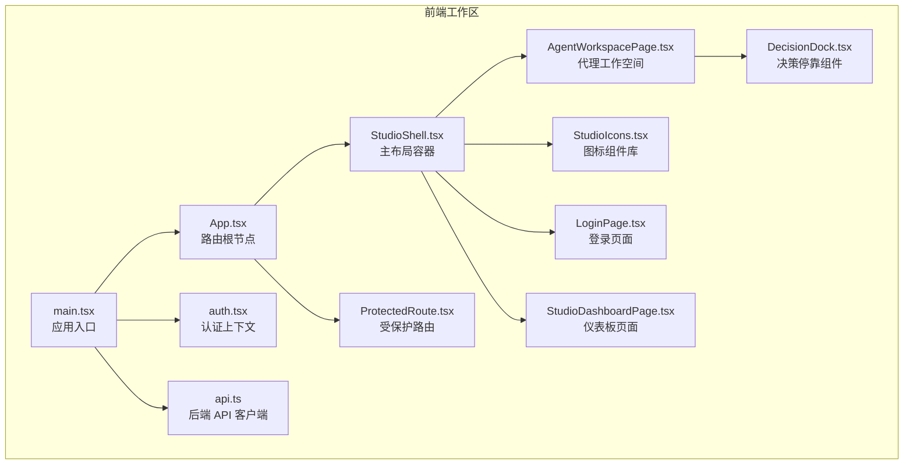
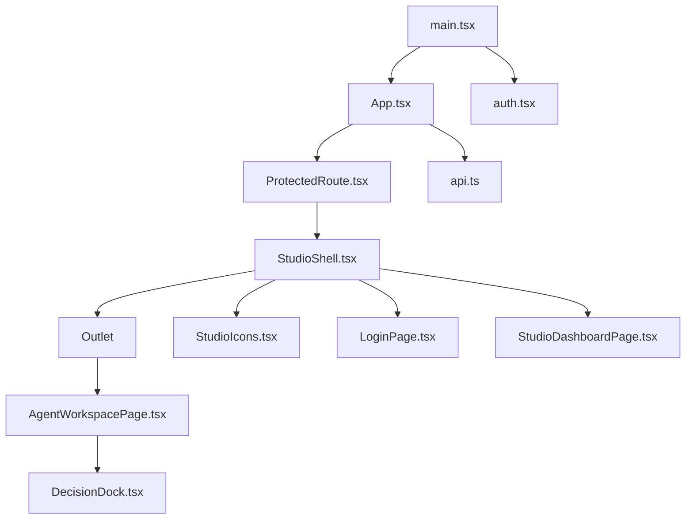
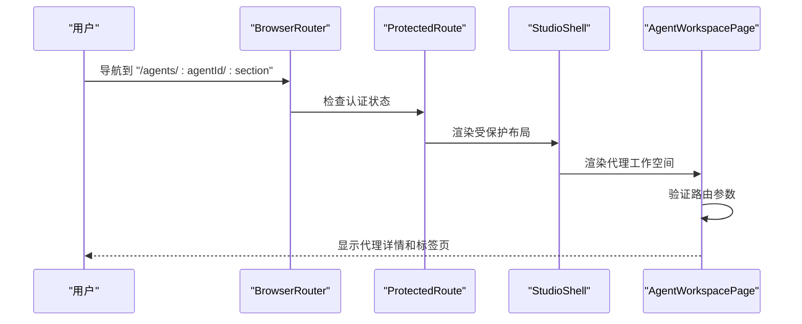
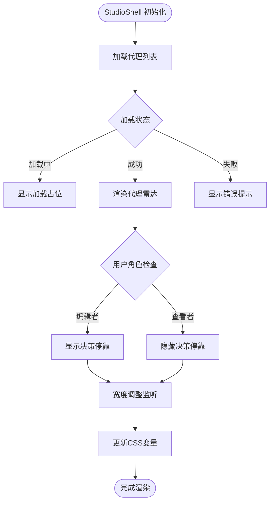
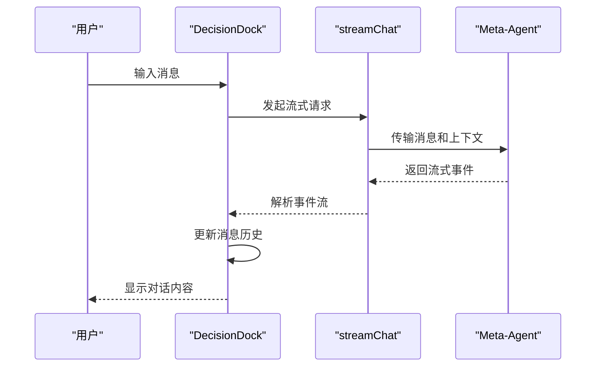
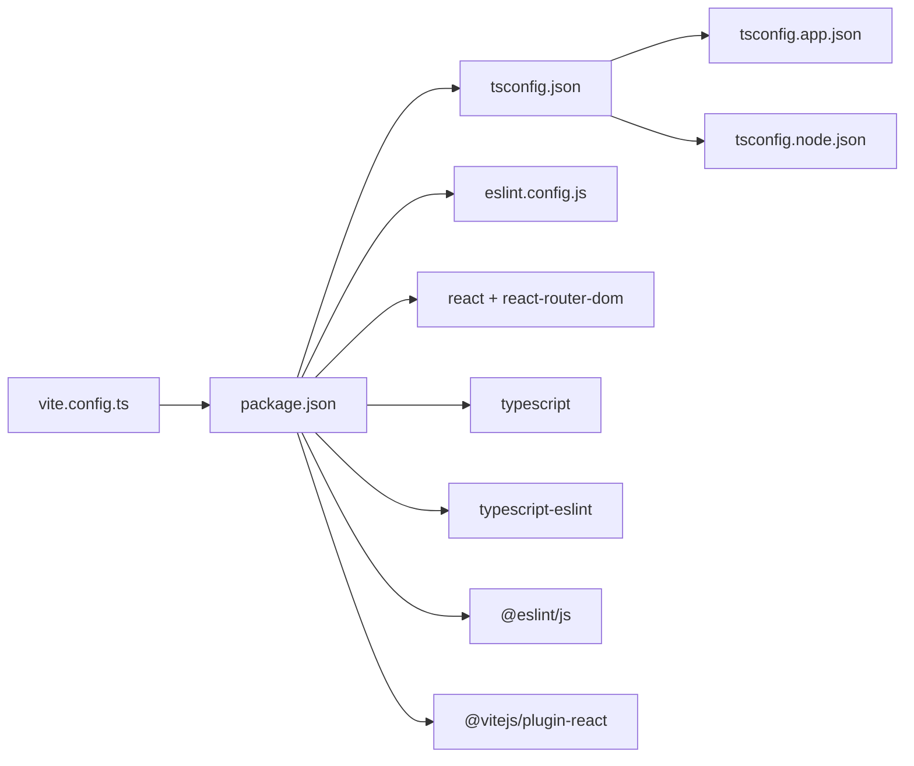

# 前端架构

<cite>
**本文引用的文件**
- [vite.config.ts](file://src/ark_agentic/studio/frontend/vite.config.ts)
- [package.json](file://src/ark_agentic/studio/frontend/package.json)
- [tsconfig.json](file://src/ark_agentic/studio/frontend/tsconfig.json)
- [tsconfig.app.json](file://src/ark_agentic/studio/frontend/tsconfig.app.json)
- [tsconfig.node.json](file://src/ark_agentic/studio/frontend/tsconfig.node.json)
- [eslint.config.js](file://src/ark_agentic/studio/frontend/eslint.config.js)
- [main.tsx](file://src/ark_agentic/studio/frontend/src/main.tsx)
- [App.tsx](file://src/ark_agentic/studio/frontend/src/App.tsx)
- [StudioShell.tsx](file://src/ark_agentic/studio/frontend/src/layouts/StudioShell.tsx)
- [DecisionDock.tsx](file://src/ark_agentic/studio/frontend/src/components/DecisionDock.tsx)
- [StudioIcons.tsx](file://src/ark_agentic/studio/frontend/src/components/StudioIcons.tsx)
- [ProtectedRoute.tsx](file://src/ark_agentic/studio/frontend/src/components/ProtectedRoute.tsx)
- [AgentWorkspacePage.tsx](file://src/ark_agentic/studio/frontend/src/pages/AgentWorkspacePage.tsx)
- [LoginPage.tsx](file://src/ark_agentic/studio/frontend/src/pages/LoginPage.tsx)
- [StudioDashboardPage.tsx](file://src/ark_agentic/studio/frontend/src/pages/StudioDashboardPage.tsx)
- [auth.tsx](file://src/ark_agentic/studio/frontend/src/auth.tsx)
- [api.ts](file://src/ark_agentic/studio/frontend/src/api.ts)
- [index.css](file://src/ark_agentic/studio/frontend/src/index.css)
</cite>

## 更新摘要
**所做更改**
- 新增 StudioShell 布局系统，提供三栏布局和动态宽度调整
- 新增 DecisionDock 决策停靠组件，支持 Meta-Agent 对话和工具调用
- 新增 StudioIcons 图标组件库，提供完整的 SVG 图标系统
- 更新路由结构，采用新的 StudioShell 布局和页面组织方式
- 重构页面组件，支持分屏视图和标签页导航
- 增强认证和权限控制，支持编辑者和查看者角色

## 目录
1. [引言](#引言)
2. [项目结构](#项目结构)
3. [核心组件](#核心组件)
4. [架构总览](#架构总览)
5. [详细组件分析](#详细组件分析)
6. [依赖关系分析](#依赖关系分析)
7. [性能考量](#性能考量)
8. [故障排查指南](#故障排查指南)
9. [结论](#结论)
10. [附录](#附录)

## 引言
本文件面向 Studio 前端架构，系统性阐述 React 组件设计模式、状态管理策略、路由配置与构建工具链。重点覆盖 Vite 构建配置、TypeScript 类型定义、ESLint 代码规范与组件结构；并从设计理念出发，总结路由导航、页面布局、组件复用与样式系统的组织方式，提供组件开发最佳实践、状态管理模式与性能优化建议。

**更新** 本次重大现代化改造引入了 StudioShell 布局系统、DecisionDock 决策停靠组件和完整的图标系统，显著提升了用户体验和开发效率。

## 项目结构
Studio 前端位于后端工程的子目录中，采用独立的前端工作区，包含 React + TypeScript + Vite + ESLint 的现代化技术栈。新的架构采用 StudioShell 作为主布局容器，提供三栏布局和动态宽度调整功能，配合 DecisionDock 决策停靠组件和完整的图标系统。

**图表来源**
- [main.tsx:1-17](file://src/ark_agentic/studio/frontend/src/main.tsx#L1-L17)
- [App.tsx:1-22](file://src/ark_agentic/studio/frontend/src/App.tsx#L1-L22)
- [StudioShell.tsx:1-310](file://src/ark_agentic/studio/frontend/src/layouts/StudioShell.tsx#L1-L310)
- [DecisionDock.tsx:1-334](file://src/ark_agentic/studio/frontend/src/components/DecisionDock.tsx#L1-L334)
- [StudioIcons.tsx:1-221](file://src/ark_agentic/studio/frontend/src/components/StudioIcons.tsx#L1-L221)
- [AgentWorkspacePage.tsx:1-800](file://src/ark_agentic/studio/frontend/src/pages/AgentWorkspacePage.tsx#L1-L800)
- [LoginPage.tsx:1-112](file://src/ark_agentic/studio/frontend/src/pages/LoginPage.tsx#L1-L112)
- [StudioDashboardPage.tsx:1-200](file://src/ark_agentic/studio/frontend/src/pages/StudioDashboardPage.tsx#L1-L200)
- [auth.tsx:1-53](file://src/ark_agentic/studio/frontend/src/auth.tsx#L1-L53)
- [ProtectedRoute.tsx:1-9](file://src/ark_agentic/studio/frontend/src/components/ProtectedRoute.tsx#L1-L9)
- [api.ts:1-290](file://src/ark_agentic/studio/frontend/src/api.ts#L1-L290)

**章节来源**
- [main.tsx:1-17](file://src/ark_agentic/studio/frontend/src/main.tsx#L1-L17)
- [App.tsx:1-22](file://src/ark_agentic/studio/frontend/src/App.tsx#L1-L22)

## 核心组件
- **StudioShell 主布局容器**
  - 提供三栏布局结构：全局导航栏、代理雷达和工作空间区域
  - 支持动态宽度调整和折叠/展开功能
  - 集成认证状态管理和代理列表管理
- **DecisionDock 决策停靠组件**
  - Meta-Agent 对话界面，支持自然语言交互
  - 实时流式聊天，支持工具调用和结果展示
  - 可调整宽度和位置的停靠面板
- **StudioIcons 图标系统**
  - 完整的 SVG 图标库，包含 20+ 个专业图标
  - 统一的图标设计规范和语义化命名
  - 支持无障碍访问和主题适配
- **路由与导航系统**
  - 基于 React Router 的嵌套路由结构
  - 受保护路由和权限控制
  - 动态页面标题和面包屑导航
- **页面组件体系**
  - AgentWorkspacePage 支持分屏视图和标签页导航
  - StudioDashboardPage 提供仪表板概览
  - LoginPage 简洁的认证界面
- **状态管理与认证**
  - 自定义认证上下文，支持用户信息持久化
  - 全局状态管理，支持代理选择和页面状态
- **API 客户端与流式通信**
  - 统一封装的 API 客户端
  - 支持流式聊天事件的异步生成器
  - 完整的类型定义和错误处理

**章节来源**
- [StudioShell.tsx:1-310](file://src/ark_agentic/studio/frontend/src/layouts/StudioShell.tsx#L1-L310)
- [DecisionDock.tsx:1-334](file://src/ark_agentic/studio/frontend/src/components/DecisionDock.tsx#L1-L334)
- [StudioIcons.tsx:1-221](file://src/ark_agentic/studio/frontend/src/components/StudioIcons.tsx#L1-L221)
- [App.tsx:1-22](file://src/ark_agentic/studio/frontend/src/App.tsx#L1-L22)
- [AgentWorkspacePage.tsx:1-800](file://src/ark_agentic/studio/frontend/src/pages/AgentWorkspacePage.tsx#L1-L800)
- [LoginPage.tsx:1-112](file://src/ark_agentic/studio/frontend/src/pages/LoginPage.tsx#L1-L112)
- [StudioDashboardPage.tsx:1-200](file://src/ark_agentic/studio/frontend/src/pages/StudioDashboardPage.tsx#L1-L200)
- [auth.tsx:1-53](file://src/ark_agentic/studio/frontend/src/auth.tsx#L1-L53)
- [api.ts:1-290](file://src/ark_agentic/studio/frontend/src/api.ts#L1-L290)

## 架构总览
前端采用"入口 → 路由 → 布局 → 页面 → 组件"的分层结构，结合 StudioShell 布局系统和 DecisionDock 决策停靠组件，形成现代化的三栏布局架构。新的架构支持动态宽度调整、实时对话和丰富的交互体验。

**图表来源**
- [main.tsx:1-17](file://src/ark_agentic/studio/frontend/src/main.tsx#L1-L17)
- [App.tsx:1-22](file://src/ark_agentic/studio/frontend/src/App.tsx#L1-L22)
- [ProtectedRoute.tsx:1-9](file://src/ark_agentic/studio/frontend/src/components/ProtectedRoute.tsx#L1-L9)
- [StudioShell.tsx:1-310](file://src/ark_agentic/studio/frontend/src/layouts/StudioShell.tsx#L1-L310)
- [AgentWorkspacePage.tsx:1-800](file://src/ark_agentic/studio/frontend/src/pages/AgentWorkspacePage.tsx#L1-L800)
- [DecisionDock.tsx:1-334](file://src/ark_agentic/studio/frontend/src/components/DecisionDock.tsx#L1-L334)
- [StudioIcons.tsx:1-221](file://src/ark_agentic/studio/frontend/src/components/StudioIcons.tsx#L1-L221)
- [LoginPage.tsx:1-112](file://src/ark_agentic/studio/frontend/src/pages/LoginPage.tsx#L1-L112)
- [StudioDashboardPage.tsx:1-200](file://src/ark_agentic/studio/frontend/src/pages/StudioDashboardPage.tsx#L1-L200)
- [auth.tsx:1-53](file://src/ark_agentic/studio/frontend/src/auth.tsx#L1-L53)
- [api.ts:1-290](file://src/ark_agentic/studio/frontend/src/api.ts#L1-L290)

## 详细组件分析

### 路由与导航系统
- **受保护路由机制**
  - 登录页直接暴露，无需认证
  - 受保护路由在无用户时自动重定向至登录页
  - 支持权限控制和角色验证
- **嵌套路由结构**
  - 根路由下嵌套 StudioShell 主布局
  - 布局内支持代理工作空间和仪表板页面
  - 代理详情页支持多标签页导航
- **动态路由参数**
  - 支持 agentId 和 section 参数传递
  - 自动验证路由有效性并重定向到默认页面
  - 支持分屏视图和标签页状态管理

**图表来源**
- [App.tsx:1-22](file://src/ark_agentic/studio/frontend/src/App.tsx#L1-L22)
- [ProtectedRoute.tsx:1-9](file://src/ark_agentic/studio/frontend/src/components/ProtectedRoute.tsx#L1-L9)
- [StudioShell.tsx:1-310](file://src/ark_agentic/studio/frontend/src/layouts/StudioShell.tsx#L1-L310)
- [AgentWorkspacePage.tsx:1-800](file://src/ark_agentic/studio/frontend/src/pages/AgentWorkspacePage.tsx#L1-L800)

**章节来源**
- [App.tsx:1-22](file://src/ark_agentic/studio/frontend/src/App.tsx#L1-L22)
- [ProtectedRoute.tsx:1-9](file://src/ark_agentic/studio/frontend/src/components/ProtectedRoute.tsx#L1-L9)
- [StudioShell.tsx:1-310](file://src/ark_agentic/studio/frontend/src/layouts/StudioShell.tsx#L1-L310)
- [AgentWorkspacePage.tsx:1-800](file://src/ark_agentic/studio/frontend/src/pages/AgentWorkspacePage.tsx#L1-L800)

### StudioShell 布局系统
- **三栏布局架构**
  - 左侧：全局导航栏，包含仪表板和代理雷达切换
  - 中央：代理雷达，支持搜索、刷新和代理列表
  - 右侧：工作空间，承载主要页面内容
- **动态宽度管理系统**
  - 支持代理雷达和决策停靠的宽度调整
  - 最小/最大宽度限制和边界保护
  - CSS 变量驱动的响应式布局
- **智能状态管理**
  - 代理列表加载、错误处理和搜索过滤
  - 用户角色控制和权限验证
  - 页面上下文传递和状态同步

**图表来源**
- [StudioShell.tsx:1-310](file://src/ark_agentic/studio/frontend/src/layouts/StudioShell.tsx#L1-L310)

**章节来源**
- [StudioShell.tsx:1-310](file://src/ark_agentic/studio/frontend/src/layouts/StudioShell.tsx#L1-L310)

### DecisionDock 决策停靠组件
- **实时对话系统**
  - Meta-Agent 对话界面，支持自然语言交互
  - 流式聊天事件处理，支持文本增量和工具调用
  - 会话状态管理和错误处理
- **工具调用集成**
  - 实时显示工具调用参数和结果
  - 工具调用块的展开/折叠控制
  - 错误状态和异常处理
- **交互控制**
  - 可调整宽度的停靠面板
  - 新会话创建和对话恢复
  - 键盘快捷键支持（Enter 发送）

**图表来源**
- [DecisionDock.tsx:1-334](file://src/ark_agentic/studio/frontend/src/components/DecisionDock.tsx#L1-L334)
- [api.ts:1-290](file://src/ark_agentic/studio/frontend/src/api.ts#L1-L290)

**章节来源**
- [DecisionDock.tsx:1-334](file://src/ark_agentic/studio/frontend/src/components/DecisionDock.tsx#L1-L334)
- [api.ts:1-290](file://src/ark_agentic/studio/frontend/src/api.ts#L1-L290)

### StudioIcons 图标组件库
- **完整图标体系**
  - 20+ 个专业 SVG 图标，涵盖导航、操作和状态
  - 统一的设计规范：20x20 像素画布，1.8px 线宽
  - 无障碍支持：aria-hidden 属性和语义化标记
- **组件化设计**
  - 基础 IconBase 组件提供统一外观
  - 每个图标独立导出，支持单独导入
  - 类型安全的 SVG Props 接口
- **应用场景**
  - 导航栏图标、按钮图标和装饰图标
  - 支持主题适配和尺寸定制
  - 语义化命名规范，易于理解和使用

**章节来源**
- [StudioIcons.tsx:1-221](file://src/ark_agentic/studio/frontend/src/components/StudioIcons.tsx#L1-L221)

### 页面布局与组件复用
- **分屏视图支持**
  - AgentWorkspacePage 支持分屏布局和标签页导航
  - 动态内容区域和侧边栏的智能切换
  - 响应式设计和移动端适配
- **组件复用策略**
  - 通过 Outlet 上下文传递共享状态
  - 代理选择和页面状态的全局管理
  - 组件间的松耦合设计和高内聚实现
- **状态管理优化**
  - 局部状态与全局状态的合理分配
  - 计算属性和 useMemo 的性能优化
  - 事件驱动的状态更新机制

**章节来源**
- [AgentWorkspacePage.tsx:1-800](file://src/ark_agentic/studio/frontend/src/pages/AgentWorkspacePage.tsx#L1-L800)
- [StudioShell.tsx:1-310](file://src/ark_agentic/studio/frontend/src/layouts/StudioShell.tsx#L1-L310)

### API 客户端与流式通信
- **统一 API 接口**
  - 完整的类型定义和接口约束
  - 统一的错误处理和响应格式
  - 支持多种数据类型的 API 调用
- **流式聊天实现**
  - AsyncGenerator 模式的事件流处理
  - 支持文本增量、工具调用和运行生命周期
  - 完善的错误捕获和状态管理
- **认证集成**
  - 自动携带认证信息和用户标识
  - 支持多用户场景和权限控制
  - 本地存储的用户状态持久化

**章节来源**
- [api.ts:1-290](file://src/ark_agentic/studio/frontend/src/api.ts#L1-L290)
- [auth.tsx:1-53](file://src/ark_agentic/studio/frontend/src/auth.tsx#L1-L53)

## 依赖关系分析
- **构建与类型系统**
  - Vite 提供现代化的开发服务器和打包工具
  - TypeScript 多配置文件组织，支持应用和工具链分离
  - ESLint 配置启用推荐规则和 React Hooks 插件
- **运行时依赖**
  - React 19 和 React Router DOM 7 实现组件化和路由控制
  - 支持现代浏览器特性和性能优化
- **开发工具链**
  - @vitejs/plugin-react 提供 React 开发热重载
  - TypeScript 和 ESLint 插件确保代码质量
  - Tailwind CSS 支持原子化样式开发

**图表来源**
- [vite.config.ts:1-28](file://src/ark_agentic/studio/frontend/vite.config.ts#L1-L28)
- [package.json:1-32](file://src/ark_agentic/studio/frontend/package.json#L1-L32)
- [tsconfig.json:1-8](file://src/ark_agentic/studio/frontend/tsconfig.json#L1-L8)
- [tsconfig.app.json](file://src/ark_agentic/studio/frontend/tsconfig.app.json)
- [tsconfig.node.json](file://src/ark_agentic/studio/frontend/tsconfig.node.json)
- [eslint.config.js:1-24](file://src/ark_agentic/studio/frontend/eslint.config.js#L1-L24)

**章节来源**
- [vite.config.ts:1-28](file://src/ark_agentic/studio/frontend/vite.config.ts#L1-L28)
- [package.json:1-32](file://src/ark_agentic/studio/frontend/package.json#L1-L32)
- [tsconfig.json:1-8](file://src/ark_agentic/studio/frontend/tsconfig.json#L1-L8)
- [eslint.config.js:1-24](file://src/ark_agentic/studio/frontend/eslint.config.js#L1-L24)

## 性能考量
- **布局性能优化**
  - StudioShell 使用 CSS 变量和 transform 实现平滑动画
  - 决策停靠组件采用虚拟滚动和懒加载
  - 代理雷达支持搜索过滤和防抖优化
- **状态管理优化**
  - useMemo 和 useCallback 减少不必要的重渲染
  - 局部状态与全局状态的合理分离
  - 事件驱动的状态更新机制
- **网络请求优化**
  - API 客户端支持请求去重和缓存策略
  - 流式聊天采用增量更新，避免全量重绘
  - 错误重试和超时处理机制
- **构建和部署优化**
  - Vite 提供快速的开发热重载和生产构建
  - Tree-shaking 和代码分割优化包大小
  - CSS 变量和原子化样式减少样式体积

## 故障排查指南
- **认证与路由问题**
  - 检查受保护路由的认证状态和权限验证
  - 确认路由参数的有效性和默认重定向
  - 验证用户角色和访问权限
- **布局和样式问题**
  - 检查 StudioShell 的 CSS 变量和布局计算
  - 验证 DecisionDock 的宽度限制和边界条件
  - 确认响应式断点和媒体查询
- **组件交互问题**
  - 调试 DecisionDock 的事件流和状态更新
  - 检查图标组件的 SVG 渲染和无障碍属性
  - 验证页面组件的上下文传递和状态同步
- **API 和网络问题**
  - 查看流式聊天的事件解析和错误处理
  - 检查认证头部和用户标识的传递
  - 验证 API 响应格式和类型定义

**章节来源**
- [auth.tsx:1-53](file://src/ark_agentic/studio/frontend/src/auth.tsx#L1-L53)
- [App.tsx:1-22](file://src/ark_agentic/studio/frontend/src/App.tsx#L1-L22)
- [api.ts:1-290](file://src/ark_agentic/studio/frontend/src/api.ts#L1-L290)
- [DecisionDock.tsx:1-334](file://src/ark_agentic/studio/frontend/src/components/DecisionDock.tsx#L1-L334)
- [StudioShell.tsx:1-310](file://src/ark_agentic/studio/frontend/src/layouts/StudioShell.tsx#L1-L310)
- [StudioIcons.tsx:1-221](file://src/ark_agentic/studio/frontend/src/components/StudioIcons.tsx#L1-L221)

## 结论
Studio 前端经过重大现代化改造，采用了 StudioShell 布局系统、DecisionDock 决策停靠组件和完整的图标系统，形成了更加现代化和用户友好的前端架构。新的架构不仅提升了用户体验，还为后续的功能扩展和维护提供了良好的基础。

**更新** 这次改造显著增强了前端的交互性和功能性，特别是在代理管理和决策支持方面，为用户提供了更加直观和高效的开发体验。

## 附录
- **最佳实践建议**
  - 组件职责单一，状态就近管理
  - 使用 TypeScript 明确类型边界，结合 ESLint 规则
  - 布局组件与业务组件分离，提高复用性
  - 流式通信采用健壮的错误处理和状态管理
  - 图标系统遵循统一的设计规范和语义化命名
- **性能优化技巧**
  - 合理使用 useMemo/useCallback 缓存计算结果
  - 采用虚拟滚动和懒加载处理大量数据
  - CSS 变量和原子化样式减少重绘和回流
  - 代码分割和按需加载优化首屏性能
- **开发工作流**
  - 使用 StudioIcons 统一图标管理
  - 通过 StudioShell 提供一致的布局体验
  - 利用 DecisionDock 增强交互和决策支持
  - 遵循响应式设计原则适配多设备