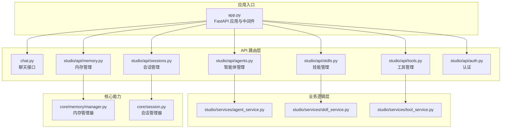
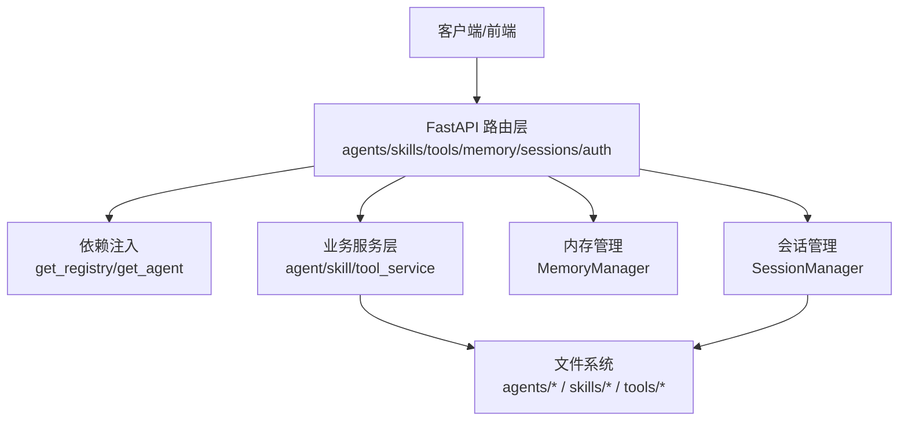
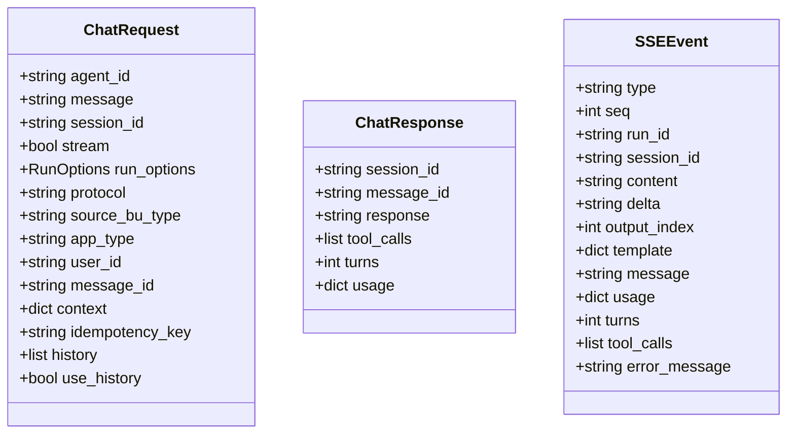
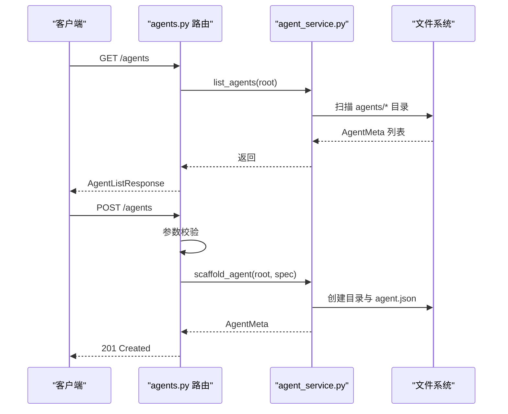
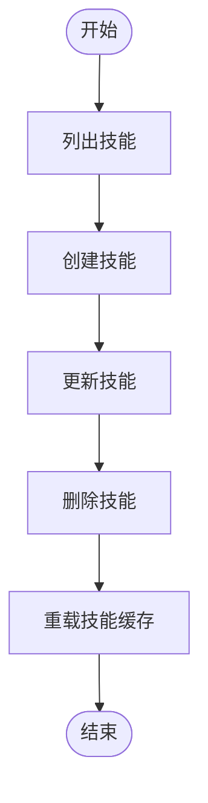
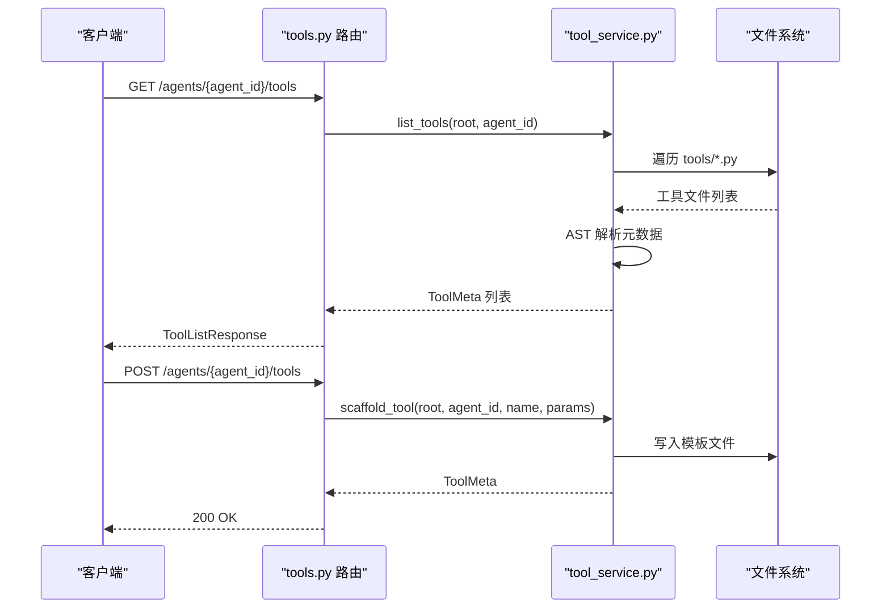
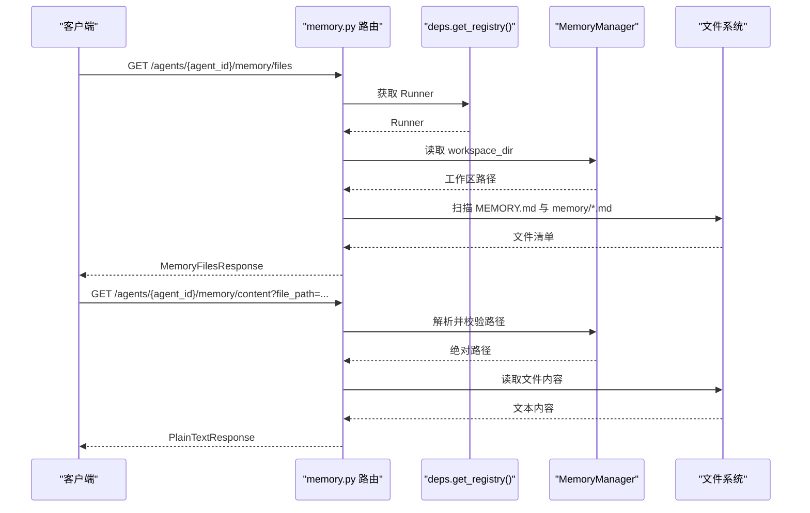
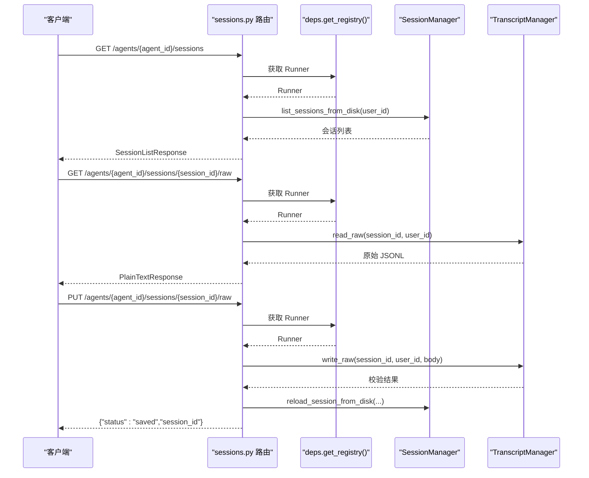
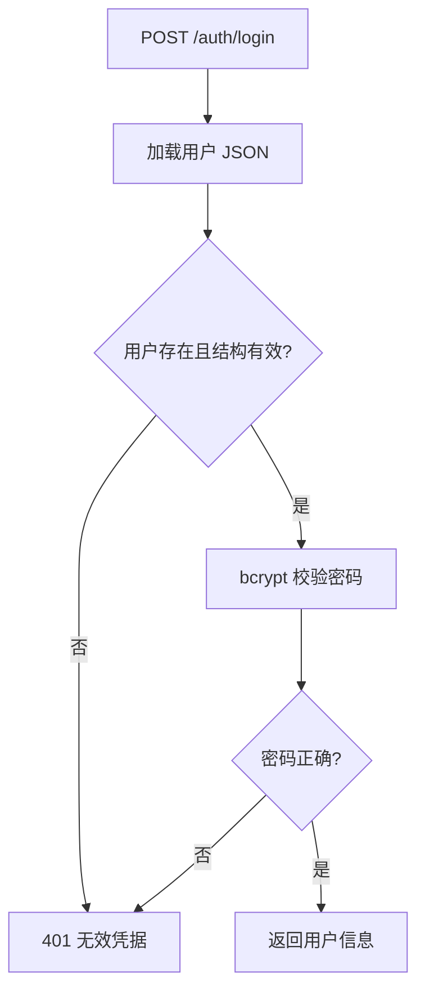
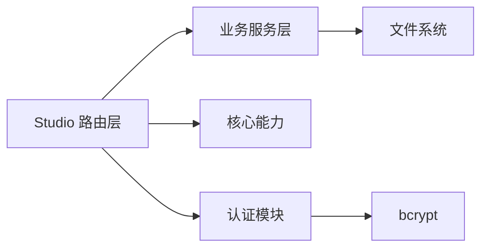

# 后端服务

<cite>
**本文引用的文件**
- [src/ark_agentic/app.py](file://src/ark_agentic/app.py)
- [src/ark_agentic/api/deps.py](file://src/ark_agentic/api/deps.py)
- [src/ark_agentic/api/models.py](file://src/ark_agentic/api/models.py)
- [src/ark_agentic/studio/api/__init__.py](file://src/ark_agentic/studio/api/__init__.py)
- [src/ark_agentic/studio/api/agents.py](file://src/ark_agentic/studio/api/agents.py)
- [src/ark_agentic/studio/api/skills.py](file://src/ark_agentic/studio/api/skills.py)
- [src/ark_agentic/studio/api/tools.py](file://src/ark_agentic/studio/api/tools.py)
- [src/ark_agentic/studio/api/memory.py](file://src/ark_agentic/studio/api/memory.py)
- [src/ark_agentic/studio/api/auth.py](file://src/ark_agentic/studio/api/auth.py)
- [src/ark_agentic/studio/api/sessions.py](file://src/ark_agentic/studio/api/sessions.py)
- [src/ark_agentic/studio/services/agent_service.py](file://src/ark_agentic/studio/services/agent_service.py)
- [src/ark_agentic/studio/services/skill_service.py](file://src/ark_agentic/studio/services/skill_service.py)
- [src/ark_agentic/studio/services/tool_service.py](file://src/ark_agentic/studio/services/tool_service.py)
- [src/ark_agentic/core/memory/manager.py](file://src/ark_agentic/core/memory/manager.py)
- [src/ark_agentic/core/session.py](file://src/ark_agentic/core/session.py)
</cite>

## 目录
1. [简介](#简介)
2. [项目结构](#项目结构)
3. [核心组件](#核心组件)
4. [架构总览](#架构总览)
5. [详细组件分析](#详细组件分析)
6. [依赖分析](#依赖分析)
7. [性能考虑](#性能考虑)
8. [故障排查指南](#故障排查指南)
9. [结论](#结论)
10. [附录](#附录)

## 简介
本文件为 Studio 后端服务的全面技术文档，聚焦于 FastAPI 路由设计、业务逻辑层实现与数据模型定义，深入解释智能体管理、技能编辑、工具开发与内存管理的 API 接口。文档同时涵盖认证授权机制、数据验证规则、错误处理策略与性能优化方案，并提供 API 使用示例、集成指南与调试技巧，帮助开发者快速理解与扩展系统。

## 项目结构
后端采用“薄 HTTP 层 + 纯业务逻辑服务层”的分层设计：
- 应用入口与生命周期：统一 FastAPI 应用、中间件、静态资源与健康检查。
- API 路由层：chat、studio（agents/skills/tools/memory/sessions/auth）等。
- 业务逻辑层：agent_service、skill_service、tool_service 等纯 Python 服务，不依赖 FastAPI。
- 核心能力：会话管理、内存管理、工具与技能解析、持久化与压缩等。

图表来源
- [src/ark_agentic/app.py:137-164](file://src/ark_agentic/app.py#L137-L164)
- [src/ark_agentic/studio/api/agents.py:22-131](file://src/ark_agentic/studio/api/agents.py#L22-L131)
- [src/ark_agentic/studio/api/skills.py:21-113](file://src/ark_agentic/studio/api/skills.py#L21-L113)
- [src/ark_agentic/studio/api/tools.py:21-66](file://src/ark_agentic/studio/api/tools.py#L21-L66)
- [src/ark_agentic/studio/api/memory.py:21-160](file://src/ark_agentic/studio/api/memory.py#L21-L160)
- [src/ark_agentic/studio/api/sessions.py:22-200](file://src/ark_agentic/studio/api/sessions.py#L22-L200)
- [src/ark_agentic/studio/services/agent_service.py:28-198](file://src/ark_agentic/studio/services/agent_service.py#L28-L198)
- [src/ark_agentic/studio/services/skill_service.py:22-289](file://src/ark_agentic/studio/services/skill_service.py#L22-L289)
- [src/ark_agentic/studio/services/tool_service.py:21-235](file://src/ark_agentic/studio/services/tool_service.py#L21-L235)
- [src/ark_agentic/core/memory/manager.py:18-92](file://src/ark_agentic/core/memory/manager.py#L18-L92)
- [src/ark_agentic/core/session.py:24-482](file://src/ark_agentic/core/session.py#L24-L482)

章节来源
- [src/ark_agentic/app.py:137-164](file://src/ark_agentic/app.py#L137-L164)

## 核心组件
- 应用入口与生命周期
  - 统一 FastAPI 应用创建、CORS 中间件、静态资源挂载、健康检查与根路径。
  - 生命周期钩子负责 Agent 注册、warmup、内存关闭与链路追踪关闭。
- API 依赖注入
  - 通过共享的 AgentRegistry 获取 AgentRunner，避免重复查找。
- 数据模型
  - Chat 请求/响应、SSE 事件等，含历史消息 JSON 字符串校验、运行选项等。
- 业务服务
  - agent_service：Agent 脚手架、列表、删除等。
  - skill_service：Skill 列表、创建、更新、删除、frontmatter 解析与 slug 规范。
  - tool_service：工具列表、脚手架生成、AST 解析参数与类元数据。
- 核心能力
  - memory/manager：轻量内存管理器，按用户读写 MEMORY.md。
  - core/session：会话生命周期、消息管理、持久化、上下文压缩与 token 统计。

章节来源
- [src/ark_agentic/app.py:63-135](file://src/ark_agentic/app.py#L63-L135)
- [src/ark_agentic/api/deps.py:19-37](file://src/ark_agentic/api/deps.py#L19-L37)
- [src/ark_agentic/api/models.py:20-104](file://src/ark_agentic/api/models.py#L20-L104)
- [src/ark_agentic/studio/services/agent_service.py:60-198](file://src/ark_agentic/studio/services/agent_service.py#L60-L198)
- [src/ark_agentic/studio/services/skill_service.py:42-289](file://src/ark_agentic/studio/services/skill_service.py#L42-L289)
- [src/ark_agentic/studio/services/tool_service.py:40-235](file://src/ark_agentic/studio/services/tool_service.py#L40-L235)
- [src/ark_agentic/core/memory/manager.py:24-92](file://src/ark_agentic/core/memory/manager.py#L24-L92)
- [src/ark_agentic/core/session.py:24-482](file://src/ark_agentic/core/session.py#L24-L482)

## 架构总览
整体采用“路由层薄封装 + 业务服务纯逻辑 + 核心能力独立模块”的分层架构，确保 API 层职责单一、可测试性高、可复用性强。

图表来源
- [src/ark_agentic/app.py:161-164](file://src/ark_agentic/app.py#L161-L164)
- [src/ark_agentic/api/deps.py:25-37](file://src/ark_agentic/api/deps.py#L25-L37)
- [src/ark_agentic/studio/services/agent_service.py:60-138](file://src/ark_agentic/studio/services/agent_service.py#L60-L138)
- [src/ark_agentic/studio/services/skill_service.py:42-102](file://src/ark_agentic/studio/services/skill_service.py#L42-L102)
- [src/ark_agentic/studio/services/tool_service.py:40-99](file://src/ark_agentic/studio/services/tool_service.py#L40-L99)
- [src/ark_agentic/core/memory/manager.py:24-70](file://src/ark_agentic/core/memory/manager.py#L24-L70)
- [src/ark_agentic/core/session.py:24-182](file://src/ark_agentic/core/session.py#L24-182)

## 详细组件分析

### 路由层与数据模型
- 路由层职责
  - 智能体管理：列表、详情、创建。
  - 技能管理：列表、创建、更新、删除。
  - 工具管理：列表、脚手架生成。
  - 内存管理：文件发现、内容读取、内容写入。
  - 会话管理：列表、详情、原始 JSONL 读写。
  - 认证：本地用户表加载、密码校验、登录返回用户信息。
- 数据模型
  - Chat 请求/响应、SSE 事件模型，含历史消息 JSON 字符串校验与运行选项。
  - Studio 各 API 的请求/响应 Pydantic 模型，含字段校验与默认值。

图表来源
- [src/ark_agentic/api/models.py:27-104](file://src/ark_agentic/api/models.py#L27-L104)

章节来源
- [src/ark_agentic/studio/api/agents.py:25-131](file://src/ark_agentic/studio/api/agents.py#L25-L131)
- [src/ark_agentic/studio/api/skills.py:24-113](file://src/ark_agentic/studio/api/skills.py#L24-L113)
- [src/ark_agentic/studio/api/tools.py:24-66](file://src/ark_agentic/studio/api/tools.py#L24-L66)
- [src/ark_agentic/studio/api/memory.py:24-160](file://src/ark_agentic/studio/api/memory.py#L24-L160)
- [src/ark_agentic/studio/api/sessions.py:25-200](file://src/ark_agentic/studio/api/sessions.py#L25-L200)
- [src/ark_agentic/studio/api/auth.py:29-115](file://src/ark_agentic/studio/api/auth.py#L29-L115)
- [src/ark_agentic/api/models.py:20-104](file://src/ark_agentic/api/models.py#L20-L104)

### 智能体管理 API（Studio）
- 能力概览
  - 列出 agents 目录下所有智能体，读取 agent.json 或自动生成最小元数据。
  - 获取单个智能体元数据。
  - 创建智能体目录与 agent.json，自动创建 skills/tools 子目录。
- 关键流程
  - 读取/写入 agent.json。
  - 目录安全检查与时间戳维护。
  - 与业务服务层解耦，HTTP 层仅做参数校验与调用。

图表来源
- [src/ark_agentic/studio/api/agents.py:76-131](file://src/ark_agentic/studio/api/agents.py#L76-L131)
- [src/ark_agentic/studio/services/agent_service.py:60-138](file://src/ark_agentic/studio/services/agent_service.py#L60-L138)

章节来源
- [src/ark_agentic/studio/api/agents.py:76-131](file://src/ark_agentic/studio/api/agents.py#L76-L131)
- [src/ark_agentic/studio/services/agent_service.py:140-198](file://src/ark_agentic/studio/services/agent_service.py#L140-L198)

### 技能编辑 API（Studio）
- 能力概览
  - 列出指定智能体的技能，解析 SKILL.md frontmatter 与正文。
  - 创建技能目录与 SKILL.md，支持自动生成 frontmatter。
  - 更新技能：可仅更新 frontmatter 或完整替换正文。
  - 删除技能目录，含路径安全检查。
- 关键流程
  - 目录 slug 化与安全检查。
  - frontmatter 解析与正文提取。
  - 写入后触发对应 AgentRunner 的技能缓存重载。

图表来源
- [src/ark_agentic/studio/api/skills.py:57-113](file://src/ark_agentic/studio/api/skills.py#L57-L113)
- [src/ark_agentic/studio/services/skill_service.py:42-183](file://src/ark_agentic/studio/services/skill_service.py#L42-L183)

章节来源
- [src/ark_agentic/studio/api/skills.py:57-113](file://src/ark_agentic/studio/api/skills.py#L57-L113)
- [src/ark_agentic/studio/services/skill_service.py:187-289](file://src/ark_agentic/studio/services/skill_service.py#L187-L289)

### 工具开发 API（Studio）
- 能力概览
  - 列出智能体工具：递归扫描 tools/*.py，通过 AST 解析 AgentTool 子类元数据。
  - 生成工具脚手架：渲染 Python 模板，支持参数规范。
- 关键流程
  - AST 遍历类定义，识别 AgentTool 继承与参数声明。
  - 模板渲染生成可直接编辑的工具文件。

图表来源
- [src/ark_agentic/studio/api/tools.py:41-66](file://src/ark_agentic/studio/api/tools.py#L41-L66)
- [src/ark_agentic/studio/services/tool_service.py:40-99](file://src/ark_agentic/studio/services/tool_service.py#L40-L99)

章节来源
- [src/ark_agentic/studio/api/tools.py:41-66](file://src/ark_agentic/studio/api/tools.py#L41-L66)
- [src/ark_agentic/studio/services/tool_service.py:101-177](file://src/ark_agentic/studio/services/tool_service.py#L101-L177)

### 内存管理 API（Studio）
- 能力概览
  - 发现并列出智能体工作区内的 MEMORY.md 与 memory/*.md 文件，按用户分组。
  - 读取/写入指定相对路径的内存文件，含路径遍历保护。
- 关键流程
  - 通过 AgentRunner 的 MemoryManager 获取工作区路径。
  - 文件扫描与路径解析，严格限制在工作区内。

图表来源
- [src/ark_agentic/studio/api/memory.py:105-160](file://src/ark_agentic/studio/api/memory.py#L105-L160)
- [src/ark_agentic/core/memory/manager.py:24-70](file://src/ark_agentic/core/memory/manager.py#L24-L70)

章节来源
- [src/ark_agentic/studio/api/memory.py:105-160](file://src/ark_agentic/studio/api/memory.py#L105-L160)
- [src/ark_agentic/core/memory/manager.py:24-70](file://src/ark_agentic/core/memory/manager.py#L24-L70)

### 会话管理 API（Studio）
- 能力概览
  - 列出会话：以磁盘 JSONL 为准，可按 user_id 过滤。
  - 会话详情：加载消息历史与状态。
  - 原始 JSONL 读写：直接读取/校验并写回，写回后重载内存。
- 关键流程
  - 通过 SessionManager 读写磁盘与内存状态。
  - JSONL 校验异常转换为 HTTP 400 并携带行号。

图表来源
- [src/ark_agentic/studio/api/sessions.py:84-200](file://src/ark_agentic/studio/api/sessions.py#L84-L200)
- [src/ark_agentic/core/session.py:127-182](file://src/ark_agentic/core/session.py#L127-L182)

章节来源
- [src/ark_agentic/studio/api/sessions.py:84-200](file://src/ark_agentic/studio/api/sessions.py#L84-L200)
- [src/ark_agentic/core/session.py:127-182](file://src/ark_agentic/core/session.py#L127-L182)

### 认证授权机制（Studio）
- 机制概览
  - 无 JWT/cookie 会话，前端本地存储已验证用户对象。
  - 用户记录来自环境变量 JSON，仅保存 password_hash（bcrypt）。
  - 登录时加载用户、校验密码哈希，返回用户标识信息。
- 关键流程
  - 加载用户 JSON，校验结构与类型。
  - bcrypt 校验密码，失败返回 401。
  - 成功返回 user_id、role、display_name。

图表来源
- [src/ark_agentic/studio/api/auth.py:94-115](file://src/ark_agentic/studio/api/auth.py#L94-L115)

章节来源
- [src/ark_agentic/studio/api/auth.py:68-115](file://src/ark_agentic/studio/api/auth.py#L68-L115)

## 依赖分析
- 组件耦合
  - 路由层仅依赖业务服务层与核心能力，保持薄封装。
  - 业务服务层不依赖 FastAPI，便于单元测试与复用。
  - 依赖注入集中于 deps.py，避免各模块重复查找。
- 外部依赖
  - 文件系统：agents/*、skills/*、tools/*、memory/*。
  - bcrypt：密码哈希校验。
  - YAML/AST：技能 frontmatter 解析与工具 AST 元数据提取。
- 循环依赖
  - 未见循环导入；路由层与服务层通过函数调用解耦。

图表来源
- [src/ark_agentic/studio/api/agents.py:14-18](file://src/ark_agentic/studio/api/agents.py#L14-L18)
- [src/ark_agentic/studio/api/skills.py:14-17](file://src/ark_agentic/studio/api/skills.py#L14-L17)
- [src/ark_agentic/studio/api/tools.py:15-17](file://src/ark_agentic/studio/api/tools.py#L15-L17)
- [src/ark_agentic/studio/api/auth.py:20-21](file://src/ark_agentic/studio/api/auth.py#L20-L21)

章节来源
- [src/ark_agentic/api/deps.py:19-37](file://src/ark_agentic/api/deps.py#L19-L37)

## 性能考虑
- I/O 与并发
  - 路由层为 I/O 密集型，建议在生产环境使用异步运行器与合适的并发参数。
  - 会话与内存文件读写涉及磁盘，建议控制批量写入与压缩频率。
- 缓存与重载
  - 技能更新后主动重载 Runner 的技能缓存，避免陈旧策略生效。
- 压缩与持久化
  - SessionManager 支持上下文压缩与 token 统计，减少长对话开销。
- 静态资源
  - 静态文件挂载于 /static，建议配合 CDN 与缓存头提升前端加载速度。

## 故障排查指南
- 常见错误与定位
  - 404：Agent/Session/文件不存在；检查 agent_id、session_id、file_path 是否正确。
  - 400：JSONL 校验失败，关注返回的行号信息；修正格式后再写回。
  - 401：认证失败；确认用户名存在且密码哈希有效。
  - 403：路径遍历保护触发；确保 file_path 位于工作区内。
- 调试建议
  - 开启日志：通过 LOG_LEVEL 调整级别，观察会话与内存操作日志。
  - 使用原始 JSONL：通过 /raw 接口读取/写回，便于人工校验与修复。
  - 分层定位：先确认路由层参数校验，再检查服务层文件系统操作，最后定位核心能力状态。

章节来源
- [src/ark_agentic/studio/api/sessions.py:190-199](file://src/ark_agentic/studio/api/sessions.py#L190-L199)
- [src/ark_agentic/studio/api/auth.py:94-115](file://src/ark_agentic/studio/api/auth.py#L94-L115)
- [src/ark_agentic/studio/api/memory.py:83-89](file://src/ark_agentic/studio/api/memory.py#L83-L89)

## 结论
本后端服务通过清晰的分层设计与严格的职责划分，实现了智能体、技能、工具与内存/会话的统一管理。路由层薄封装、业务服务层纯逻辑、核心能力独立模块，既保证了可维护性，也为后续扩展提供了良好基础。结合完善的认证机制、数据验证与错误处理策略，系统具备良好的可用性与可运维性。

## 附录

### API 使用示例（路径指引）
- 智能体管理
  - 列出智能体：GET /agents
  - 获取智能体：GET /agents/{agent_id}
  - 创建智能体：POST /agents
- 技能管理
  - 列出技能：GET /agents/{agent_id}/skills
  - 创建技能：POST /agents/{agent_id}/skills
  - 更新技能：PUT /agents/{agent_id}/skills/{skill_id}
  - 删除技能：DELETE /agents/{agent_id}/skills/{skill_id}
- 工具管理
  - 列出工具：GET /agents/{agent_id}/tools
  - 生成工具脚手架：POST /agents/{agent_id}/tools
- 内存管理
  - 列出内存文件：GET /agents/{agent_id}/memory/files
  - 读取内存内容：GET /agents/{agent_id}/memory/content?file_path=...
  - 写入内存内容：PUT /agents/{agent_id}/memory/content?file_path=...
- 会话管理
  - 列出会话：GET /agents/{agent_id}/sessions
  - 会话详情：GET /agents/{agent_id}/sessions/{session_id}
  - 读取原始 JSONL：GET /agents/{agent_id}/sessions/{session_id}/raw
  - 写回原始 JSONL：PUT /agents/{agent_id}/sessions/{session_id}/raw
- 认证
  - 登录：POST /auth/login

章节来源
- [src/ark_agentic/studio/api/agents.py:76-131](file://src/ark_agentic/studio/api/agents.py#L76-L131)
- [src/ark_agentic/studio/api/skills.py:57-113](file://src/ark_agentic/studio/api/skills.py#L57-L113)
- [src/ark_agentic/studio/api/tools.py:41-66](file://src/ark_agentic/studio/api/tools.py#L41-L66)
- [src/ark_agentic/studio/api/memory.py:105-160](file://src/ark_agentic/studio/api/memory.py#L105-L160)
- [src/ark_agentic/studio/api/sessions.py:84-200](file://src/ark_agentic/studio/api/sessions.py#L84-L200)
- [src/ark_agentic/studio/api/auth.py:94-115](file://src/ark_agentic/studio/api/auth.py#L94-L115)