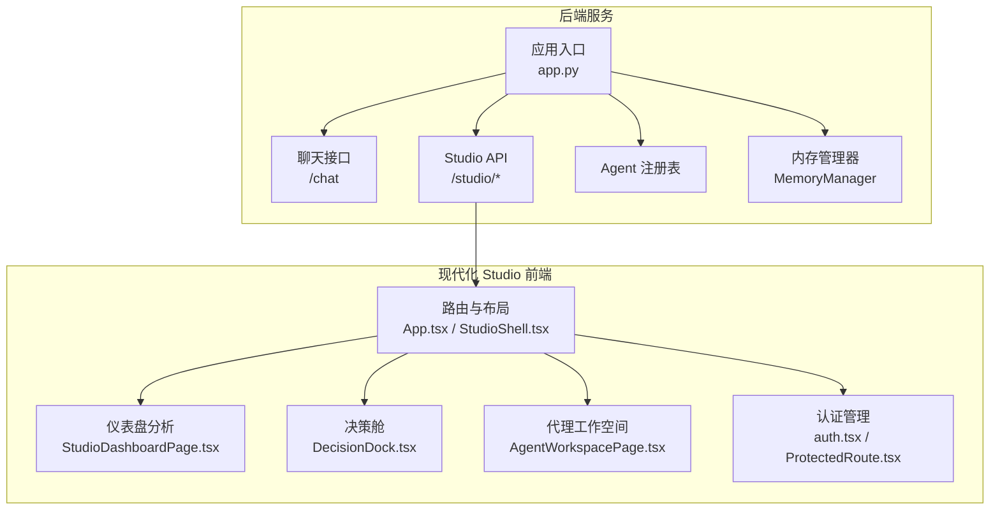
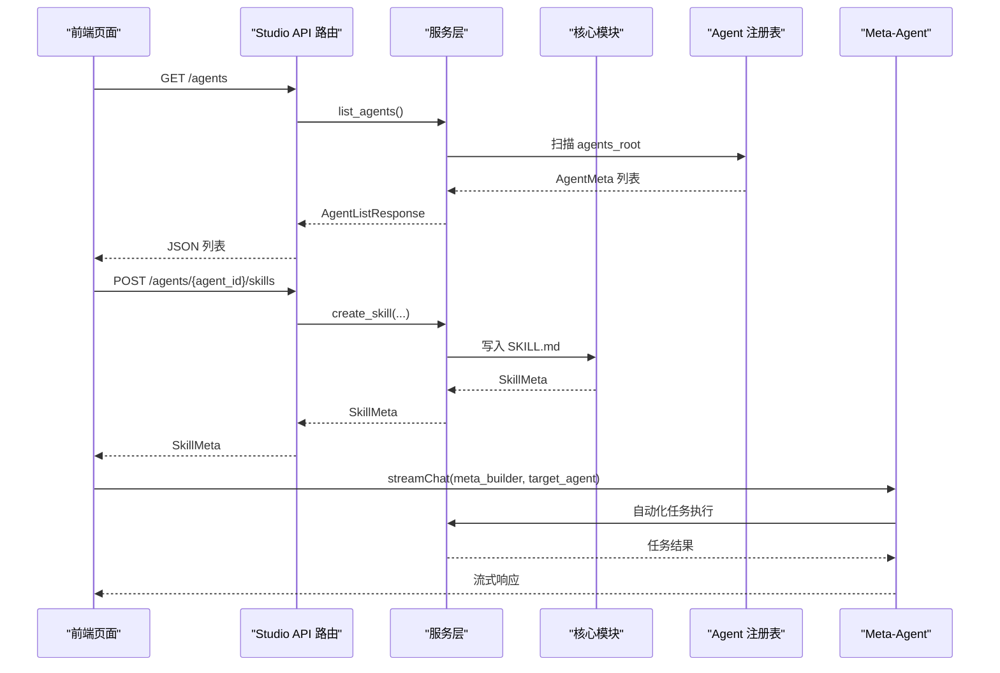
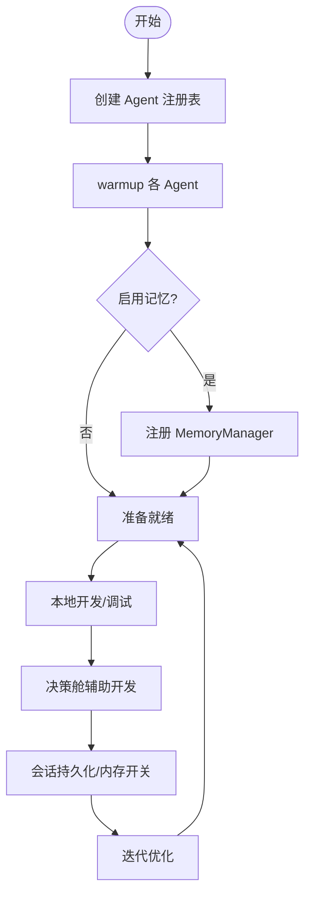
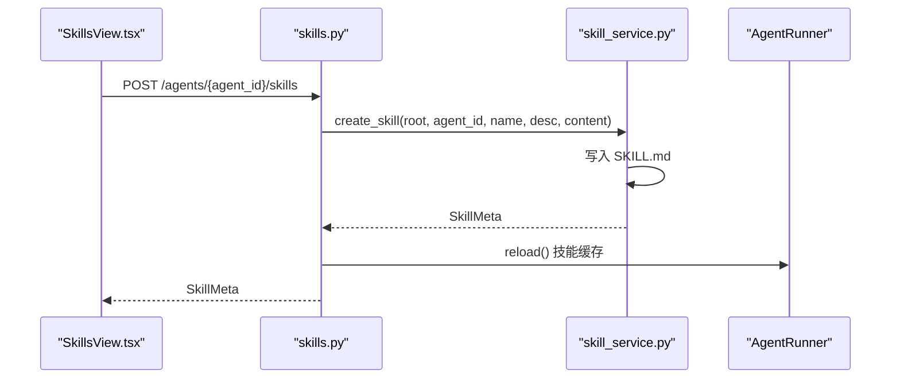
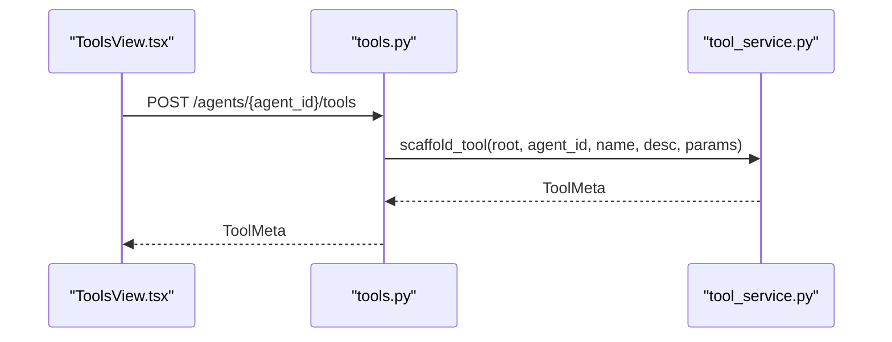
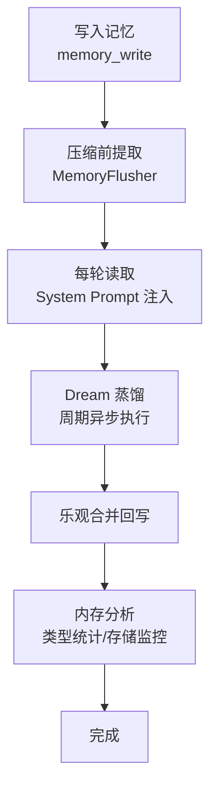
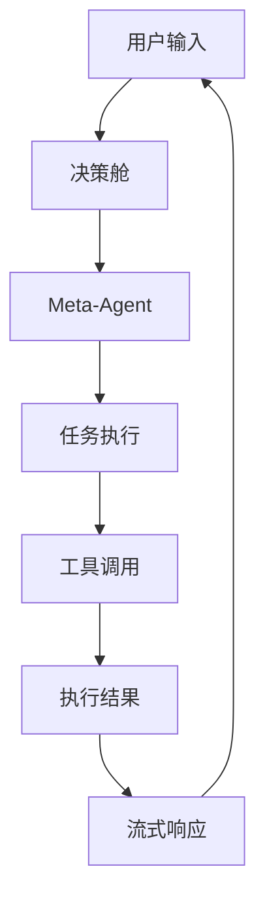
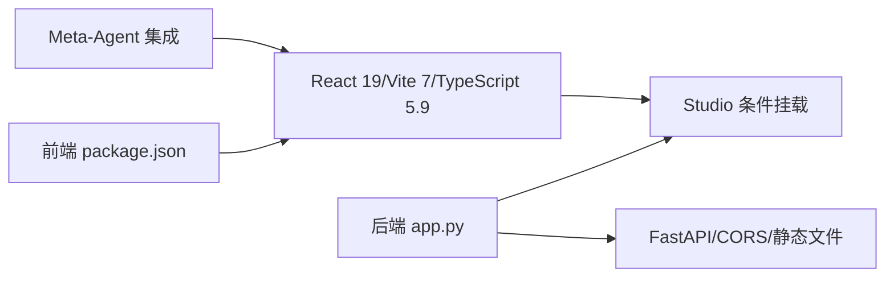

# 开发工作流

<cite>
**本文档引用的文件**
- [README.md](file://README.md)
- [app.py](file://src/ark_agentic/app.py)
- [package.json](file://src/ark_agentic/studio/frontend/package.json)
- [vite.config.ts](file://src/ark_agentic/studio/frontend/vite.config.ts)
- [manager.py](file://src/ark_agentic/core/memory/manager.py)
- [base.py](file://src/ark_agentic/core/skills/base.py)
- [base.py](file://src/ark_agentic/core/tools/base.py)
- [agent_service.py](file://src/ark_agentic/studio/services/agent_service.py)
- [agents.py](file://src/ark_agentic/studio/api/agents.py)
- [skills.py](file://src/ark_agentic/studio/api/skills.py)
- [tools.py](file://src/ark_agentic/studio/api/tools.py)
- [App.tsx](file://src/ark_agentic/studio/frontend/src/App.tsx)
- [main.tsx](file://src/ark_agentic/studio/frontend/src/main.tsx)
- [StudioShell.tsx](file://src/ark_agentic/studio/frontend/src/layouts/StudioShell.tsx)
- [DecisionDock.tsx](file://src/ark_agentic/studio/frontend/src/components/DecisionDock.tsx)
- [AgentWorkspacePage.tsx](file://src/ark_agentic/studio/frontend/src/pages/AgentWorkspacePage.tsx)
- [StudioDashboardPage.tsx](file://src/ark_agentic/studio/frontend/src/pages/StudioDashboardPage.tsx)
- [auth.tsx](file://src/ark_agentic/studio/frontend/src/auth.tsx)
- [ProtectedRoute.tsx](file://src/ark_agentic/studio/frontend/src/components/ProtectedRoute.tsx)
- [StudioIcons.tsx](file://src/ark_agentic/studio/frontend/src/components/StudioIcons.tsx)
- [api.ts](file://src/ark_agentic/studio/frontend/src/api.ts)
</cite>

## 更新摘要
**所做更改**
- 更新了前端现代化改造部分，反映 React 19、Vite 7 和 TypeScript 5.9 的最新技术栈
- 新增了决策舱（DecisionDock）功能介绍和使用指南
- 完善了仪表盘页面的可视化分析功能说明
- 更新了代理工作空间的多面板布局和交互模式
- 增强了认证和权限管理的实现细节
- 重构了前端组件架构和开发模式

## 目录
1. [简介](#简介)
2. [项目结构](#项目结构)
3. [核心组件](#核心组件)
4. [架构总览](#架构总览)
5. [详细组件分析](#详细组件分析)
6. [前端现代化改造](#前端现代化改造)
7. [决策舱功能](#决策舱功能)
8. [依赖关系分析](#依赖关系分析)
9. [性能考量](#性能考量)
10. [故障排除指南](#故障排除指南)
11. [结论](#结论)
12. [附录](#附录)

## 简介
本指南面向 Studio 开发工作流，围绕智能体开发流程、技能编辑器使用方法、工具开发平台操作步骤以及内存管理实践展开，覆盖开发环境搭建、代码组织结构、调试技巧与测试策略，并解释 Studio 与后端 API 的交互模式与数据流向。随着前端组件的现代化改造，本指南特别关注最新的 React 19、Vite 7 和 TypeScript 技术栈，以及新增的决策舱功能和增强的可视化分析能力。

## 项目结构
项目采用"后端服务 + 现代化 Studio 前端 + 核心框架"的分层组织方式：
- 后端服务：统一 FastAPI 应用，挂载聊天接口与 Studio 管理接口，按需注册 Agent 与内存能力。
- 现代化 Studio 前端：React 19 + Vite 7 + TypeScript 5.9，提供智能体、技能、工具、会话与内存的可视化管理界面，支持决策舱和仪表盘分析功能。
- 核心框架：ReAct Agent、工具系统、技能系统、会话与记忆、流式输出协议等。

**图表来源**
- [app.py:137-164](file://src/ark_agentic/app.py#L137-L164)
- [agents.py:22-91](file://src/ark_agentic/studio/api/agents.py#L22-L91)
- [skills.py:21-66](file://src/ark_agentic/studio/api/skills.py#L21-L66)
- [tools.py:21-49](file://src/ark_agentic/studio/api/tools.py#L21-L49)
- [App.tsx:8-26](file://src/ark_agentic/studio/frontend/src/App.tsx#L8-L26)
- [StudioShell.tsx:38-310](file://src/ark_agentic/studio/frontend/src/layouts/StudioShell.tsx#L38-L310)
- [StudioDashboardPage.tsx:573-800](file://src/ark_agentic/studio/frontend/src/pages/StudioDashboardPage.tsx#L573-L800)
- [DecisionDock.tsx:42-334](file://src/ark_agentic/studio/frontend/src/components/DecisionDock.tsx#L42-L334)

**章节来源**
- [README.md:596-701](file://README.md#L596-L701)
- [app.py:137-164](file://src/ark_agentic/app.py#L137-L164)

## 核心组件
- **现代化前端技术栈**
  - React 19：最新版本的 React，提供更好的性能和开发体验
  - Vite 7：现代化构建工具，支持热重载和快速开发
  - TypeScript 5.9：类型安全的开发环境，提供完整的类型推断
- **智能体与工具系统**
  - 工具基类与参数解析：提供统一的 AgentTool 抽象与参数读取辅助函数
  - 技能系统：支持技能元数据渲染、资格检查、调用策略与动态加载模式
- **内存管理**
  - MemoryManager：按用户维度管理 MEMORY.md，提供 heading-level upsert 与读写能力
- **Studio 管理平台**
  - API 层：提供 Agent/技能/工具的 CRUD 与列表接口
  - 服务层：封装脚手架创建、扫描与删除等业务逻辑
  - 前端：提供路由、页面组件与交互视图，支持决策舱和仪表盘分析

**章节来源**
- [package.json:12-31](file://src/ark_agentic/studio/frontend/package.json#L12-L31)
- [vite.config.ts:8-28](file://src/ark_agentic/studio/frontend/vite.config.ts#L8-L28)
- [base.py:46-116](file://src/ark_agentic/core/tools/base.py#L46-L116)
- [base.py:16-44](file://src/ark_agentic/core/tools/base.py#L16-L44)
- [base.py:19-50](file://src/ark_agentic/core/skills/base.py#L19-L50)
- [manager.py:24-71](file://src/ark_agentic/core/memory/manager.py#L24-L71)
- [agent_service.py:30-56](file://src/ark_agentic/studio/services/agent_service.py#L30-L56)
- [agents.py:27-47](file://src/ark_agentic/studio/api/agents.py#L27-L47)
- [skills.py:26-40](file://src/ark_agentic/studio/api/skills.py#L26-L40)
- [tools.py:26-37](file://src/ark_agentic/studio/api/tools.py#L26-L37)

## 架构总览
后端统一入口负责注册 Agent、挂载路由与条件启用 Studio。现代化前端通过 API 层访问后端资源，形成"前端页面组件 ↔ API 层 ↔ 服务层/核心模块"的清晰分层。新增的决策舱功能提供智能代理助手，支持自然语言交互和自动化任务执行。

**图表来源**
- [agents.py:76-91](file://src/ark_agentic/studio/api/agents.py#L76-L91)
- [skills.py:57-83](file://src/ark_agentic/studio/api/skills.py#L57-L83)
- [agent_service.py:60-137](file://src/ark_agentic/studio/services/agent_service.py#L60-L137)
- [DecisionDock.tsx:107-212](file://src/ark_agentic/studio/frontend/src/components/DecisionDock.tsx#L107-L212)

**章节来源**
- [app.py:162-164](file://src/ark_agentic/app.py#L162-L164)
- [README.md:68-153](file://README.md#L68-L153)

## 详细组件分析

### 智能体开发流程
- **初始化与注册**
  - 通过统一入口创建 Agent 注册表，按需注册保险与证券 Agent，并在启动时进行 warmup
  - 可按环境变量启用记忆与 Dream 蒸馏
- **脚手架与目录规范**
  - 服务层提供 scaffold_agent，按规范创建 agent.json、skills、tools 目录与初始内容
- **开发与调试**
  - 使用 CLI 与交互模式进行本地联调，结合会话持久化与内存开关定位问题
  - 新增决策舱功能，支持自然语言驱动的智能体开发

**图表来源**
- [app.py:96-112](file://src/ark_agentic/app.py#L96-L112)
- [agent_service.py:60-137](file://src/ark_agentic/studio/services/agent_service.py#L60-L137)
- [DecisionDock.tsx:42-334](file://src/ark_agentic/studio/frontend/src/components/DecisionDock.tsx#L42-L334)

**章节来源**
- [app.py:96-112](file://src/ark_agentic/app.py#L96-L112)
- [agent_service.py:60-137](file://src/ark_agentic/studio/services/agent_service.py#L60-L137)

### 技能编辑器使用方法
- **页面与交互**
  - 技能视图支持"查看/新建/编辑/删除"，表单字段包括名称、描述与 SKILL.md 内容
  - 支持选择技能、批量操作与删除确认
  - 新增搜索过滤功能，支持按标签、描述和文件路径搜索
- **API 与服务**
  - API 提供列表、创建、更新、删除接口；服务层负责写入文件系统与刷新 Runner 缓存
- **最佳实践**
  - 使用"手动/自动"调用策略与分组标签，提升技能可发现性
  - 通过资格检查确保工具链完备，避免运行期错误

**图表来源**
- [skills.py:68-98](file://src/ark_agentic/studio/api/skills.py#L68-L98)
- [skills.py:44-53](file://src/ark_agentic/studio/api/skills.py#L44-L53)

**章节来源**
- [skills.py:26-40](file://src/ark_agentic/studio/api/skills.py#L26-L40)
- [base.py:19-50](file://src/ark_agentic/core/skills/base.py#L19-L50)

### 工具开发平台操作步骤
- **页面与交互**
  - 工具视图支持"查看/脚手架"，脚手架表单输入名称与描述，生成 AgentTool 模板
  - 新增工具可靠性分析，提供文档完整性和参数 Schema 完备性评分
- **API 与服务**
  - API 提供列表与脚手架接口；服务层解析 AST 生成模板文件
- **最佳实践**
  - 为工具定义清晰的参数 Schema，必要时启用确认提示与可见性策略
  - 使用参数读取辅助函数保证健壮性

**图表来源**
- [tools.py:52-65](file://src/ark_agentic/studio/api/tools.py#L52-L65)

**章节来源**
- [tools.py:26-37](file://src/ark_agentic/studio/api/tools.py#L26-L37)
- [base.py:16-44](file://src/ark_agentic/core/tools/base.py#L16-L44)

### 内存管理实践
- **文件级存储**
  - MemoryManager 按用户维度管理 MEMORY.md，支持 heading-level upsert，自动合并与删除空段落
- **生命周期与蒸馏**
  - 写入 → 压缩前提取 → 每轮读取 → 后台 Dream 蒸馏（乐观合并）
- **前端查看与编辑**
  - 内存视图支持分组展示、折叠/展开、内容加载与在线编辑保存
  - 新增内存文件类型分析和存储统计功能

**图表来源**
- [manager.py:45-69](file://src/ark_agentic/core/memory/manager.py#L45-L69)
- [README.md:524-548](file://README.md#L524-L548)

**章节来源**
- [manager.py:24-71](file://src/ark_agentic/core/memory/manager.py#L24-L71)
- [AgentWorkspacePage.tsx:700-725](file://src/ark_agentic/studio/frontend/src/pages/AgentWorkspacePage.tsx#L700-L725)

## 前端现代化改造

### 技术栈升级
- **React 19 升级**
  - 使用最新的 React Hooks 和并发特性
  - 支持自动批处理和更好的性能优化
  - 提供更简洁的组件语法和改进的开发体验
- **Vite 7 构建工具**
  - 支持热重载和快速开发服务器
  - 优化的打包和构建流程
  - 更好的 TypeScript 支持和类型检查
- **TypeScript 5.9**
  - 完整的类型推断和类型安全
  - 改进的编译器性能和更好的错误报告
  - 支持最新的 ECMAScript 特性

### 组件架构重构
- **模块化设计**
  - 清晰的组件层次结构和职责分离
  - 可复用的 UI 组件和工具函数
  - 类型安全的 API 接口定义
- **状态管理**
  - 基于 React Context 的全局状态管理
  - 组件间通信和数据共享机制
  - 认证状态和用户权限管理

### 开发体验优化
- **开发服务器配置**
  - 支持代理设置，解决跨域问题
  - 环境变量区分（开发/生产）
  - 自动重新加载和错误边界处理
- **构建配置**
  - 生产环境优化和代码分割
  - 资源优化和缓存策略
  - 静态资源管理和版本控制

**章节来源**
- [package.json:12-31](file://src/ark_agentic/studio/frontend/package.json#L12-L31)
- [vite.config.ts:8-28](file://src/ark_agentic/studio/frontend/vite.config.ts#L8-L28)
- [main.tsx:8-17](file://src/ark_agentic/studio/frontend/src/main.tsx#L8-L17)

## 决策舱功能

### 功能概述
决策舱（DecisionDock）是一个智能代理助手，提供自然语言驱动的开发辅助功能。它支持与 meta_builder Agent 的实时对话，帮助开发者创建技能、生成工具脚手架和管理智能体。

### 核心功能
- **自然语言交互**
  - 支持中文和英文的自然语言指令
  - 实时流式响应和工具调用执行
  - 会话状态管理和上下文保持
- **自动化任务执行**
  - 技能创建和编辑辅助
  - 工具脚手架生成
  - 智能体配置和优化建议
- **可视化反馈**
  - 实时消息流显示
  - 工具调用参数和结果展示
  - 错误处理和状态指示

### 交互模式
- **会话管理**
  - 自动会话 ID 生成和跟踪
  - 多轮对话上下文维护
  - 会话恢复和状态保存
- **消息处理**
  - 用户消息发送和处理
  - Assistant 响应流式显示
  - 工具调用的实时反馈
- **界面控制**
  - 可拖拽调整大小的面板
  - 角色切换和权限控制
  - 响应式布局适配

**图表来源**
- [DecisionDock.tsx:107-212](file://src/ark_agentic/studio/frontend/src/components/DecisionDock.tsx#L107-L212)
- [api.ts:59-97](file://src/ark_agentic/studio/frontend/src/api.ts#L59-L97)

**章节来源**
- [DecisionDock.tsx:42-334](file://src/ark_agentic/studio/frontend/src/components/DecisionDock.tsx#L42-L334)
- [api.ts:22-53](file://src/ark_agentic/studio/frontend/src/api.ts#L22-L53)

## 依赖关系分析
- **前端依赖**
  - React 19、React Router 7、Vite 7 等现代化工具链
  - TypeScript 5.9 提供完整的类型安全
  - ESLint 和相关插件确保代码质量
- **后端依赖**
  - FastAPI、CORS、静态文件挂载、dotenv 环境变量加载
- **Studio 与后端**
  - 前端通过 API 路由访问后端资源；后端按环境变量条件挂载 Studio
  - 新增决策舱功能，支持与 meta_builder Agent 的实时交互

**图表来源**
- [package.json:12-31](file://src/ark_agentic/studio/frontend/package.json#L12-L31)
- [app.py:144-169](file://src/ark_agentic/app.py#L144-L169)
- [DecisionDock.tsx:125-133](file://src/ark_agentic/studio/frontend/src/components/DecisionDock.tsx#L125-L133)

**章节来源**
- [package.json:12-31](file://src/ark_agentic/studio/frontend/package.json#L12-L31)
- [app.py:144-169](file://src/ark_agentic/app.py#L144-L169)

## 性能考量
- **并行工具调用**：在 LLM 返回多个工具调用时，使用并行执行提升吞吐
- **AG-UI 流式协议**：事件驱动架构支持细粒度流式推送，降低前端等待时间
- **无数据库记忆**：纯文件 MEMORY.md，启动即用，减少部署复杂度
- **会话压缩**：自动摘要总结历史消息，维持上下文窗口稳定
- **输出验证**：自动检测数值幻觉，提升输出可靠性
- **前端性能优化**：React 19 的并发特性和虚拟 DOM 优化
- **懒加载和代码分割**：按需加载组件和路由，提升首屏加载速度

**章节来源**
- [README.md:787-794](file://README.md#L787-L794)

## 故障排除指南
- **启动与路由**
  - 确认环境变量（API_HOST、API_PORT、LOG_LEVEL）正确；健康检查端点 /health 用于存活探测
  - 检查 Vite 开发服务器配置和代理设置
- **Studio 访问**
  - 确认 ENABLE_STUDIO 为 true 时才会挂载 Studio；前端路由需在受保护路由内访问
  - 检查认证状态和用户权限
- **技能/工具 CRUD**
  - 若返回 404/409/400，请检查 agent_id 与资源是否存在；服务层会抛出相应异常
- **内存文件**
  - 若内存文件为空或加载失败，检查 MEMORY.md 路径与权限；编辑保存后刷新列表
- **决策舱功能**
  - 确认 meta_builder Agent 正常运行和可用
  - 检查流式连接和 SSE 协议支持
  - 验证用户权限和会话状态
- **LLM 与模型**
  - 确认 LLM_PROVIDER、API_KEY、MODEL_NAME、LLM_BASE_URL 等环境变量；必要时开启 Phoenix 可观测性

**章节来源**
- [app.py:213-215](file://src/ark_agentic/app.py#L213-L215)
- [agents.py:96-103](file://src/ark_agentic/studio/api/agents.py#L96-L103)
- [skills.py:76-83](file://src/ark_agentic/studio/api/skills.py#L76-L83)
- [tools.py:55-65](file://src/ark_agentic/studio/api/tools.py#L55-L65)
- [DecisionDock.tsx:195-211](file://src/ark_agentic/studio/frontend/src/components/DecisionDock.tsx#L195-L211)
- [README.md:703-755](file://README.md#L703-L755)

## 结论
本指南提供了从开发环境搭建到现代化 Studio 操作、从技能编辑到工具开发再到内存管理的全流程实践路径。通过 React 19、Vite 7 和 TypeScript 5.9 的现代化技术栈，以及新增的决策舱功能和增强的可视化分析能力，开发者可以更高效地迭代智能体能力并保障稳定性与可观测性。新的开发模式提供了更好的用户体验和开发效率。

## 附录
- **开发环境搭建要点**
  - 安装依赖与可选组件，按需启用 PA-JT 或 dev 依赖
  - 配置环境变量（LLM 提供商、API 密钥、会话/内存目录等）
  - 设置 Vite 代理和开发服务器配置
- **调试与测试**
  - 使用 CLI 与交互模式进行本地联调；pytest 覆盖单元与集成测试
  - 利用 React Developer Tools 进行组件调试
  - 使用浏览器开发者工具检查网络请求和流式响应
- **常见场景**
  - 新建 Agent：通过服务层脚手架创建目录与 agent.json
  - 新增技能：在技能视图中创建 SKILL.md，必要时刷新 Runner 缓存
  - 新建工具：在工具视图中生成 AgentTool 模板，完善参数与执行逻辑
  - 管理内存：在内存视图中查看/编辑 MEMORY.md，观察 heading upsert 效果
  - 使用决策舱：通过自然语言与 meta_builder Agent 交互，获得智能开发辅助
  - 查看仪表盘：使用可视化分析功能监控智能体性能和使用情况

**章节来源**
- [README.md:17-40](file://README.md#L17-L40)
- [agent_service.py:60-137](file://src/ark_agentic/studio/services/agent_service.py#L60-L137)
- [DecisionDock.tsx:42-334](file://src/ark_agentic/studio/frontend/src/components/DecisionDock.tsx#L42-L334)
- [StudioDashboardPage.tsx:573-800](file://src/ark_agentic/studio/frontend/src/pages/StudioDashboardPage.tsx#L573-L800)