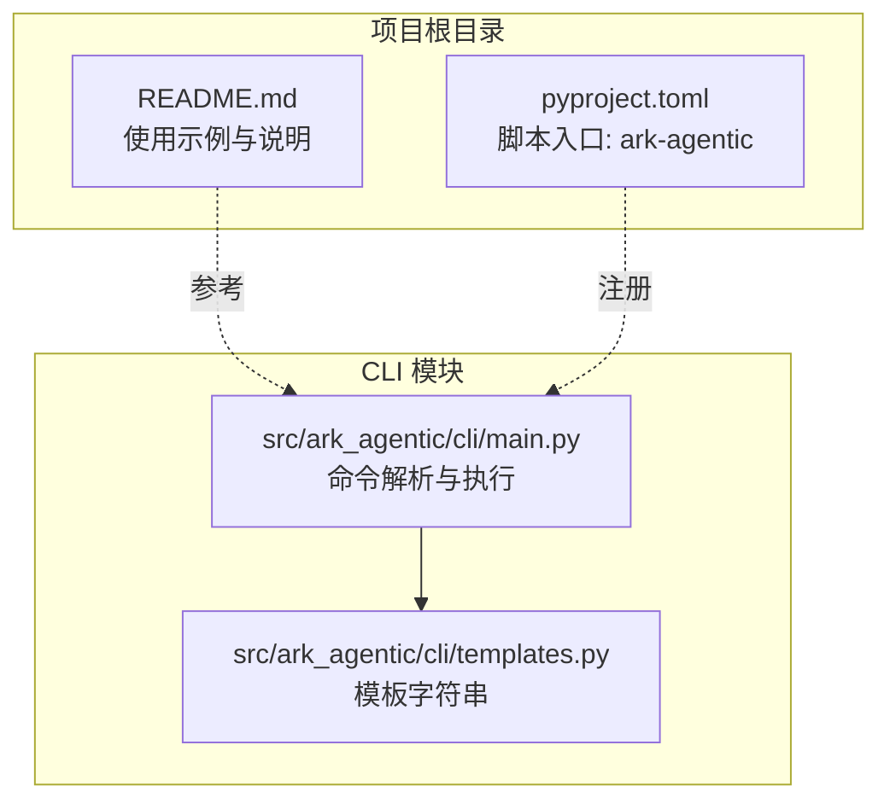
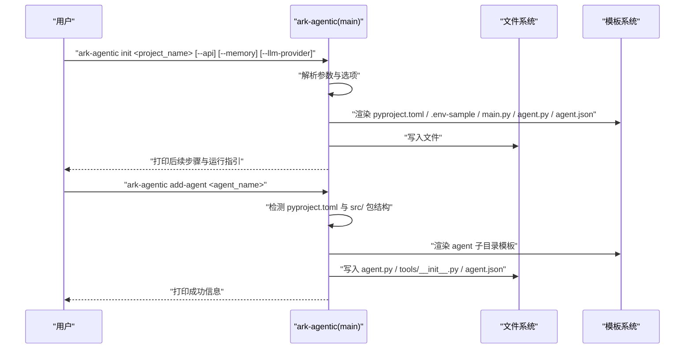
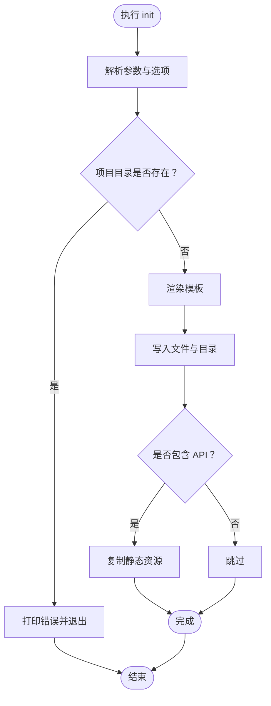
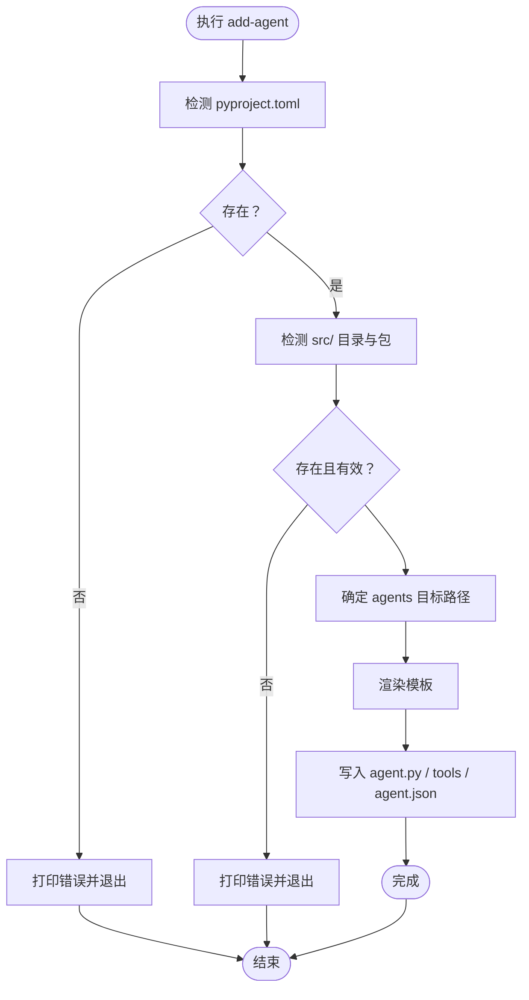
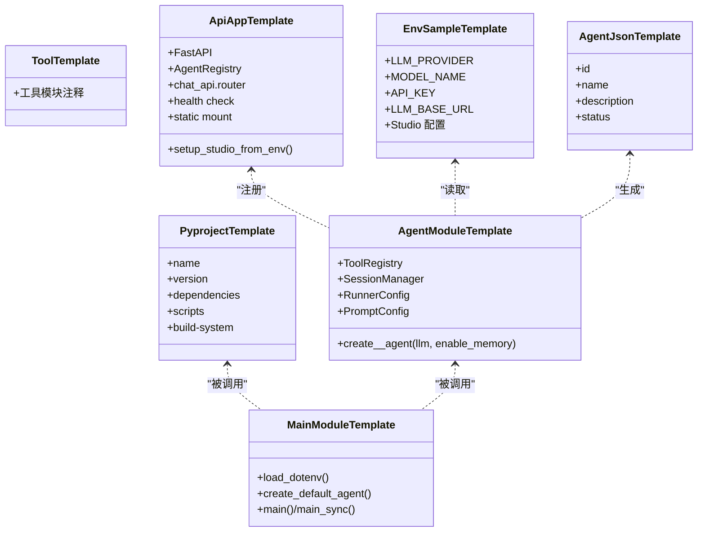
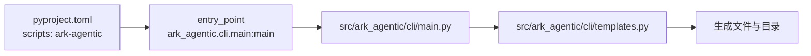
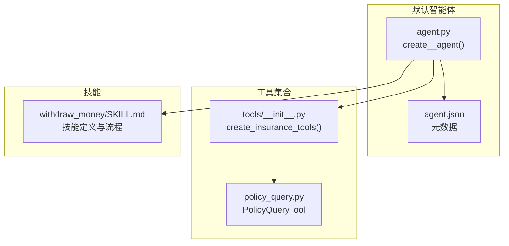

# CLI 工具

<cite>
**本文档引用的文件**
- [README.md](file://README.md)
- [pyproject.toml](file://pyproject.toml)
- [src/ark_agentic/cli/main.py](file://src/ark_agentic/cli/main.py)
- [src/ark_agentic/cli/templates.py](file://src/ark_agentic/cli/templates.py)
- [tests/integration/cli/test_cli.py](file://tests/integration/cli/test_cli.py)
- [src/ark_agentic/agents/insurance/agent.py](file://src/ark_agentic/agents/insurance/agent.py)
- [src/ark_agentic/agents/insurance/tools/__init__.py](file://src/ark_agentic/agents/insurance/tools/__init__.py)
- [src/ark_agentic/agents/insurance/skills/withdraw_money/SKILL.md](file://src/ark_agentic/agents/insurance/skills/withdraw_money/SKILL.md)
</cite>

## 目录
1. [简介](#简介)
2. [项目结构](#项目结构)
3. [核心组件](#核心组件)
4. [架构总览](#架构总览)
5. [详细组件分析](#详细组件分析)
6. [依赖分析](#依赖分析)
7. [性能考虑](#性能考虑)
8. [故障排查指南](#故障排查指南)
9. [结论](#结论)
10. [附录](#附录)

## 简介
本指南面向 Ark-Agentic 的 CLI 工具使用者，系统讲解 ark-agentic 命令行工具的子命令、模板系统、参数与使用示例，以及脚手架生成的项目结构与配置项。通过本指南，您可以：
- 使用 init 初始化新项目，支持默认 OpenAI、PA-SX、PA-JT 三种 LLM 提供商
- 使用 add-agent 在既有项目中添加新的智能体模块
- 使用 version 查看框架版本
- 理解智能体模板、工具模板与配置模板的结构与用途
- 掌握项目脚手架生成的文件清单与关键配置项

## 项目结构
CLI 工具位于 src/ark_agentic/cli 目录，包含入口文件 main.py 与模板文件 templates.py。README.md 提供了 CLI 的使用示例与说明，pyproject.toml 定义了 CLI 的可执行入口。

**图表来源**
- [src/ark_agentic/cli/main.py:1-256](file://src/ark_agentic/cli/main.py#L1-L256)
- [src/ark_agentic/cli/templates.py:1-277](file://src/ark_agentic/cli/templates.py#L1-L277)
- [README.md:186-208](file://README.md#L186-L208)
- [pyproject.toml:45-46](file://pyproject.toml#L45-L46)

**章节来源**
- [src/ark_agentic/cli/main.py:1-256](file://src/ark_agentic/cli/main.py#L1-L256)
- [src/ark_agentic/cli/templates.py:1-277](file://src/ark_agentic/cli/templates.py#L1-L277)
- [README.md:186-208](file://README.md#L186-L208)
- [pyproject.toml:45-46](file://pyproject.toml#L45-L46)

## 核心组件
- 命令入口与分发：main() 解析子命令，分发到 _cmd_init、_cmd_add_agent、_cmd_version
- 模板系统：templates.py 提供项目、主模块、智能体、工具、API 应用、环境样本、依赖配置等模板
- 测试覆盖：tests/integration/cli/test_cli.py 验证模板内容契约、命令行为与错误处理

关键职责与关系：
- main.py 负责参数解析与命令分发
- templates.py 提供模板字符串，供 main.py 渲染写入文件
- README.md 提供使用示例与说明
- pyproject.toml 将 ark-agentic 注册为可执行命令

**章节来源**
- [src/ark_agentic/cli/main.py:212-256](file://src/ark_agentic/cli/main.py#L212-L256)
- [src/ark_agentic/cli/templates.py:9-33](file://src/ark_agentic/cli/templates.py#L9-L33)
- [tests/integration/cli/test_cli.py:16-30](file://tests/integration/cli/test_cli.py#L16-L30)

## 架构总览
CLI 的工作流分为“初始化项目”和“添加智能体”两大路径，均通过模板渲染生成文件与配置。

**图表来源**
- [src/ark_agentic/cli/main.py:84-154](file://src/ark_agentic/cli/main.py#L84-L154)
- [src/ark_agentic/cli/main.py:158-202](file://src/ark_agentic/cli/main.py#L158-L202)
- [src/ark_agentic/cli/templates.py:9-155](file://src/ark_agentic/cli/templates.py#L9-L155)

## 详细组件分析

### 子命令：init 初始化项目
- 功能：生成新项目骨架，包含依赖配置、主入口、默认智能体、工具与配置文件
- 关键参数
  - project_name：项目名称（将转换为包名）
  - --api：是否包含 FastAPI 服务模板（含 Studio 支持）
  - --memory：是否包含记忆系统配置
  - --llm-provider：LLM 提供商（openai/pa-sx/pa-jt，默认 openai）
- 模板渲染与写入
  - pyproject.toml：设置项目元信息、依赖、脚本入口
  - pip.conf：镜像源配置（可选）
  - .env-sample：根据提供商写入对应的 LLM 环境变量占位
  - src/<package>/main.py：交互式入口
  - src/<package>/agents/default/：默认智能体模块与工具模板
  - src/<package>/agents/default/agent.json：智能体元数据
  - 若启用 --api：生成 src/<package>/app.py、静态资源复制
  - tests/__init__.py：测试包初始化
- 后续步骤
  - 进入项目目录，安装依赖并运行主入口或 API 服务

**图表来源**
- [src/ark_agentic/cli/main.py:84-154](file://src/ark_agentic/cli/main.py#L84-L154)
- [src/ark_agentic/cli/templates.py:9-155](file://src/ark_agentic/cli/templates.py#L9-L155)

**章节来源**
- [src/ark_agentic/cli/main.py:84-154](file://src/ark_agentic/cli/main.py#L84-L154)
- [src/ark_agentic/cli/templates.py:9-155](file://src/ark_agentic/cli/templates.py#L9-L155)
- [README.md:196-207](file://README.md#L196-L207)
- [tests/integration/cli/test_cli.py:153-175](file://tests/integration/cli/test_cli.py#L153-L175)

### 子命令：add-agent 添加智能体
- 功能：在现有项目中添加新的智能体模块
- 前置条件
  - 项目根目录存在 pyproject.toml
  - src/ 下存在有效的 Python 包（包含 __init__.py）
- 检测与生成
  - 从 src/ 下探测包名
  - 在 src/<package>/agents/<agent_name_snake>/ 下生成智能体模块与工具模板
  - 自动生成 agent.json 与空的 skills/.gitkeep
- 成功提示
  - 打印智能体添加成功的路径

**图表来源**
- [src/ark_agentic/cli/main.py:158-202](file://src/ark_agentic/cli/main.py#L158-L202)
- [src/ark_agentic/cli/templates.py:126-142](file://src/ark_agentic/cli/templates.py#L126-L142)

**章节来源**
- [src/ark_agentic/cli/main.py:158-202](file://src/ark_agentic/cli/main.py#L158-L202)
- [src/ark_agentic/cli/templates.py:126-142](file://src/ark_agentic/cli/templates.py#L126-L142)
- [tests/integration/cli/test_cli.py:20-29](file://tests/integration/cli/test_cli.py#L20-L29)

### 子命令：version 查看版本
- 功能：打印当前框架版本
- 实现：读取 __version__ 并输出

**章节来源**
- [src/ark_agentic/cli/main.py:206-207](file://src/ark_agentic/cli/main.py#L206-L207)
- [tests/integration/cli/test_cli.py:213-217](file://tests/integration/cli/test_cli.py#L213-L217)

### 模板系统与脚手架文件结构
- 项目模板（pyproject.toml）
  - 设置项目名称、版本、Python 版本要求与依赖
  - 注册脚本入口 ark-agentic → 调用 src/<package>/main.py 的 main_sync
  - 配置构建目标与测试路径
- 主模块模板（main.py）
  - 加载 .env 环境变量
  - 创建默认智能体并进入交互循环
- 智能体模板（agent.py）
  - 提供 create_<agent>_agent 工厂函数
  - 配置 ToolRegistry、SessionManager、RunnerConfig、PromptConfig
  - 支持 enable_memory 参数
- 工具模板（tools/__init__.py）
  - 提供工具模块注释与占位
- API 应用模板（app.py）
  - FastAPI 应用，注册 AgentRegistry
  - 引入 chat_api 路由与 Studio 支持
  - 提供健康检查与静态资源挂载
- 环境样本模板（.env-sample）
  - 根据 --llm-provider 写入 LLM_PROVIDER、MODEL_NAME、API_KEY、LLM_BASE_URL 等
  - 可选 Studio 配置项
- 配置模板（agent.json）
  - 智能体元数据：id、name、description、status

**图表来源**
- [src/ark_agentic/cli/templates.py:9-33](file://src/ark_agentic/cli/templates.py#L9-L33)
- [src/ark_agentic/cli/templates.py:35-72](file://src/ark_agentic/cli/templates.py#L35-L72)
- [src/ark_agentic/cli/templates.py:74-124](file://src/ark_agentic/cli/templates.py#L74-L124)
- [src/ark_agentic/cli/templates.py:136-142](file://src/ark_agentic/cli/templates.py#L136-L142)
- [src/ark_agentic/cli/templates.py:156-261](file://src/ark_agentic/cli/templates.py#L156-L261)
- [src/ark_agentic/cli/templates.py:144-154](file://src/ark_agentic/cli/templates.py#L144-L154)
- [src/ark_agentic/cli/templates.py:269-276](file://src/ark_agentic/cli/templates.py#L269-L276)

**章节来源**
- [src/ark_agentic/cli/templates.py:9-277](file://src/ark_agentic/cli/templates.py#L9-L277)

### 命令行参数与使用示例
- init
  - 语法：ark-agentic init <project_name> [--api] [--memory] [--llm-provider openai|pa-sx|pa-jt]
  - 示例：参见 README.md 的“框架 CLI (ark-agentic)”章节
- add-agent
  - 语法：ark-agentic add-agent <agent_name>
  - 说明：需在已有项目根目录下执行
- version
  - 语法：ark-agentic version
- 环境变量（.env-sample）
  - LLM_PROVIDER、MODEL_NAME、API_KEY、LLM_BASE_URL
  - 可选：ENABLE_STUDIO、AGENTS_ROOT 等

**章节来源**
- [README.md:186-208](file://README.md#L186-L208)
- [src/ark_agentic/cli/main.py:212-236](file://src/ark_agentic/cli/main.py#L212-L236)
- [src/ark_agentic/cli/templates.py:144-154](file://src/ark_agentic/cli/templates.py#L144-L154)

## 依赖分析
- CLI 注册：pyproject.toml 将 ark-agentic 注册为可执行命令，指向 src/ark_agentic/cli/main.py 的 main 函数
- 模板依赖：模板字符串在渲染时使用占位符进行格式化
- 测试依赖：tests/integration/cli/test_cli.py 覆盖模板内容契约与命令行为

**图表来源**
- [pyproject.toml:45-46](file://pyproject.toml#L45-L46)
- [src/ark_agentic/cli/main.py:212-256](file://src/ark_agentic/cli/main.py#L212-L256)
- [src/ark_agentic/cli/templates.py:1-8](file://src/ark_agentic/cli/templates.py#L1-L8)

**章节来源**
- [pyproject.toml:45-46](file://pyproject.toml#L45-L46)
- [tests/integration/cli/test_cli.py:16-30](file://tests/integration/cli/test_cli.py#L16-L30)

## 性能考虑
- 模板渲染为一次性文件写入，开销极小
- API 模板启用时会复制静态资源，建议在需要 Studio 支持时使用
- 项目初始化后，建议使用 uv pip install -e '.[server]' 安装依赖，减少后续启动延迟

## 故障排查指南
- init 时项目目录已存在
  - 现象：打印“目录已存在”并退出
  - 处理：更换项目名或删除已有目录
- add-agent 时未找到 pyproject.toml
  - 现象：打印“未找到 pyproject.toml，请在项目根目录下运行”
  - 处理：确保在项目根目录执行
- add-agent 时 src/ 下未找到包
  - 现象：打印“未找到 src/ 目录”或“未找到 Python 包”
  - 处理：确认 src/ 下存在包含 __init__.py 的包
- add-agent 时智能体已存在
  - 现象：打印“智能体已存在”
  - 处理：更换智能体名称

**章节来源**
- [src/ark_agentic/cli/main.py:92-94](file://src/ark_agentic/cli/main.py#L92-L94)
- [src/ark_agentic/cli/main.py:164-167](file://src/ark_agentic/cli/main.py#L164-L167)
- [src/ark_agentic/cli/main.py:170-173](file://src/ark_agentic/cli/main.py#L170-L173)
- [src/ark_agentic/cli/main.py:185-187](file://src/ark_agentic/cli/main.py#L185-L187)

## 结论
Ark-Agentic 的 CLI 工具提供了简洁高效的项目脚手架能力，通过模板系统快速生成可运行的智能体项目与多智能体模块。结合 README 的使用示例与本指南的参数说明，您可以快速搭建、扩展并运行基于 Ark-Agentic 的智能体应用。

## 附录

### 模板系统与示例智能体/工具/技能的关系
- 智能体模板（agent.py）展示了如何创建 AgentRunner、注册工具、配置会话与提示词
- 工具模板（tools/__init__.py）展示了工具集合的组织方式与最小化工具集合
- 技能模板（SKILL.md）展示了技能的结构、触发条件、执行流程与输出约束

**图表来源**
- [src/ark_agentic/agents/insurance/agent.py:47-143](file://src/ark_agentic/agents/insurance/agent.py#L47-L143)
- [src/ark_agentic/agents/insurance/tools/__init__.py:73-97](file://src/ark_agentic/agents/insurance/tools/__init__.py#L73-L97)
- [src/ark_agentic/agents/insurance/skills/withdraw_money/SKILL.md:1-206](file://src/ark_agentic/agents/insurance/skills/withdraw_money/SKILL.md#L1-L206)

**章节来源**
- [src/ark_agentic/agents/insurance/agent.py:47-143](file://src/ark_agentic/agents/insurance/agent.py#L47-L143)
- [src/ark_agentic/agents/insurance/tools/__init__.py:73-97](file://src/ark_agentic/agents/insurance/tools/__init__.py#L73-L97)
- [src/ark_agentic/agents/insurance/skills/withdraw_money/SKILL.md:1-206](file://src/ark_agentic/agents/insurance/skills/withdraw_money/SKILL.md#L1-L206)