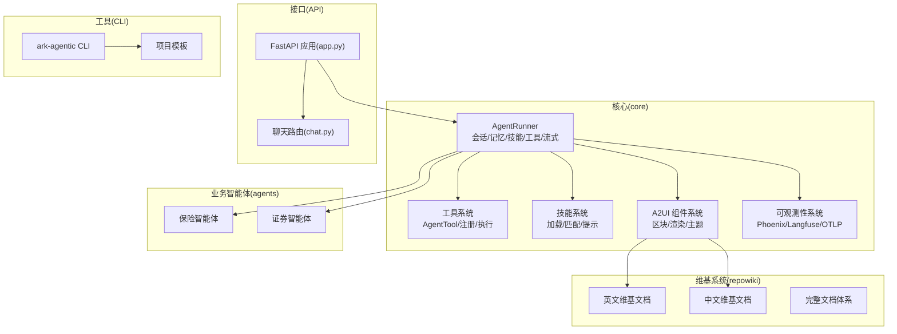
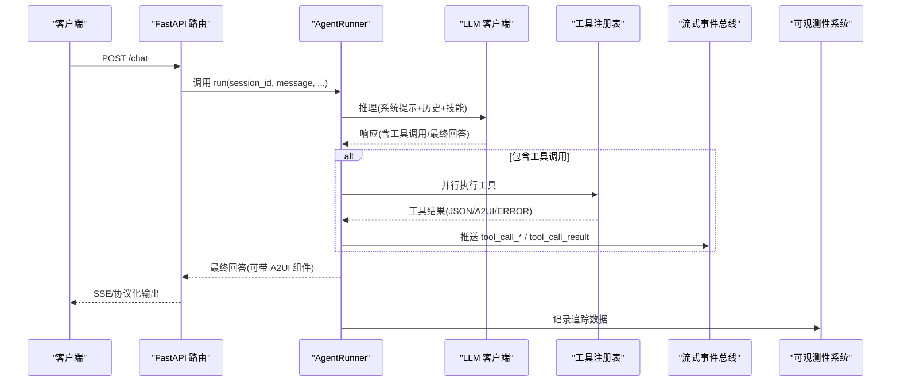
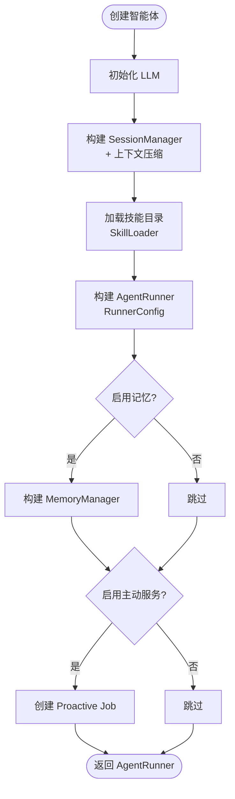
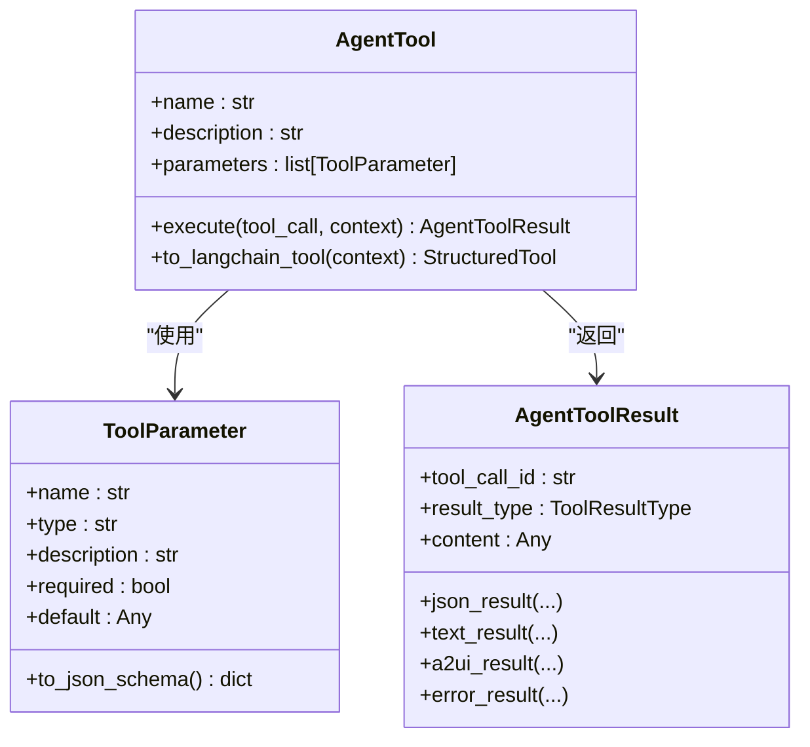
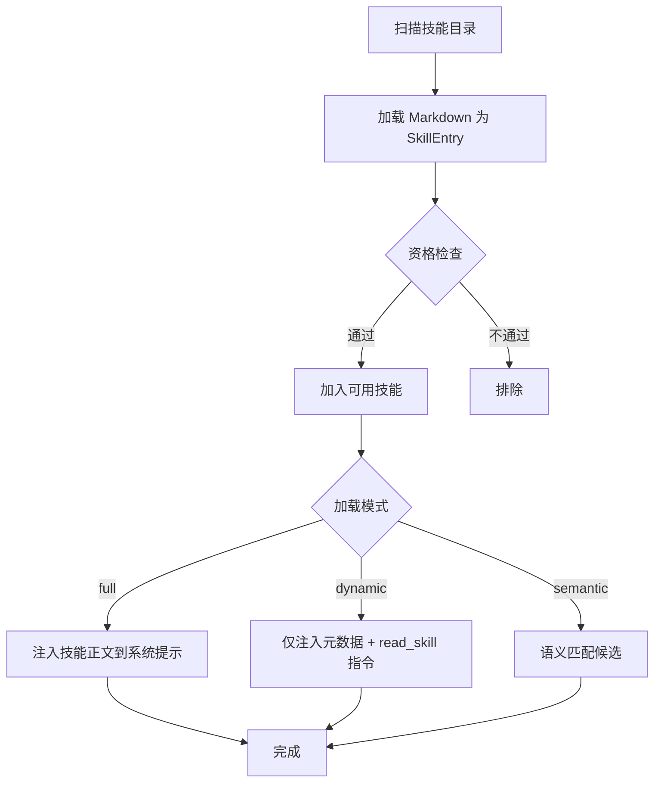
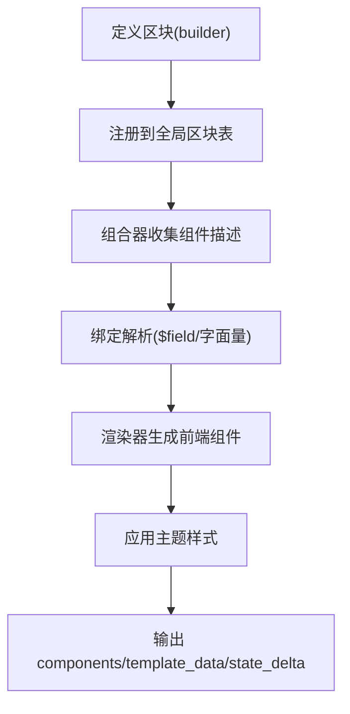
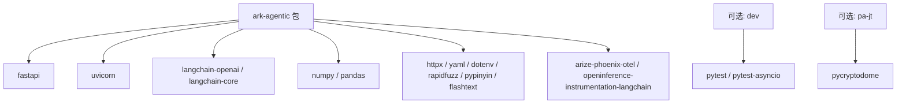

# 开发指南

<cite>
**本文档引用的文件**
- [README.md](file://README.md)
- [pyproject.toml](file://pyproject.toml)
- [src/ark_agentic/cli/main.py](file://src/ark_agentic/cli/main.py)
- [src/ark_agentic/cli/templates.py](file://src/ark_agentic/cli/templates.py)
- [src/ark_agentic/app.py](file://src/ark_agentic/app.py)
- [src/ark_agentic/agents/insurance/agent.py](file://src/ark_agentic/agents/insurance/agent.py)
- [src/ark_agentic/agents/securities/agent.py](file://src/ark_agentic/agents/securities/agent.py)
- [src/ark_agentic/core/tools/base.py](file://src/ark_agentic/core/tools/base.py)
- [src/ark_agentic/core/skills/base.py](file://src/ark_agentic/core/skills/base.py)
- [src/ark_agentic/core/a2ui/blocks.py](file://src/ark_agentic/core/a2ui/blocks.py)
- [src/ark_agentic/core/types.py](file://src/ark_agentic/core/types.py)
- [src/ark_agentic/agents/insurance/agent.json](file://src/ark_agentic/agents/insurance/agent.json)
- [src/ark_agentic/agents/securities/agent.json](file://src/ark_agentic/agents/securities/agent.json)
- [docs/a2ui/a2ui-modes-overview.md](file://docs/a2ui/a2ui-modes-overview.md)
- [docs/a2ui/a2ui-standard.md](file://docs/a2ui/a2ui-standard.md)
- [src/ark_agentic/agents/insurance/skills/withdraw_money/SKILL.md](file://src/ark_agentic/agents/insurance/skills/withdraw_money/SKILL.md)
- [src/ark_agentic/agents/insurance/skills/withdraw_money_flow/SKILL.md](file://src/ark_agentic/agents/insurance/skills/withdraw_money_flow/SKILL.md)
- [src/ark_agentic/core/observability/providers/phoenix.py](file://src/ark_agentic/core/observability/providers/phoenix.py)
- [src/ark_agentic/static/a2ui-renderer.js](file://src/ark_agentic/static/a2ui-renderer.js)
</cite>

## 更新摘要
**所做更改**
- 新增完整的维基系统章节，包含英文和中文文档体系
- 更新A2UI双模式架构文档，涵盖preset和dynamic模式
- 新增A2UI标准协议和组件定义文档
- 更新技能系统文档，包含保险取款流程和取款技能
- 新增可观测性监控文档，包含Phoenix集成
- 更新扩展机制章节，包含A2UI组件扩展和工具扩展

## 目录
1. [简介](#简介)
2. [项目结构](#项目结构)
3. [核心组件](#核心组件)
4. [架构总览](#架构总览)
5. [详细组件分析](#详细组件分析)
6. [维基系统与文档体系](#维基系统与文档体系)
7. [A2UI双模式架构](#a2ui双模式架构)
8. [A2UI标准协议与组件](#a2ui标准协议与组件)
9. [技能系统与最佳实践](#技能系统与最佳实践)
10. [可观测性与监控](#可观测性与监控)
11. [扩展机制与插件开发](#扩展机制与插件开发)
12. [依赖分析](#依赖分析)
13. [性能考虑](#性能考虑)
14. [故障排查指南](#故障排查指南)
15. [结论](#结论)
16. [附录](#附录)

## 简介
本指南面向 Ark-Agentic 的开发者，提供从环境搭建、依赖安装、数据准备到调试设置的全流程说明；涵盖自定义开发流程（新增智能体、工具开发规范、技能编写指南、A2UI 卡片设计）、CLI 使用方法、项目模板与最佳实践，以及扩展机制、插件开发与集成模式。目标是帮助你快速上手并在生产环境中稳定运行。

**更新** 新增完整的维基系统章节，包含英文和中文文档体系，涵盖开发指南、环境搭建、自定义开发、CLI工具、最佳实践等内容。

## 项目结构
Ark-Agentic 采用"核心能力 + 业务智能体 + CLI + API + Studio"的分层组织方式：
- 核心能力（core）：ReAct 运行器、会话管理、记忆系统、工具系统、技能系统、A2UI 组件系统、流式协议、LLM 客户端等
- 业务智能体（agents）：保险、证券等示例智能体，包含工具、技能与 A2UI 模板
- CLI（cli）：项目脚手架与命令行工具
- API（api + app.py）：FastAPI 服务入口与路由
- Studio（studio）：可选的管理控制台
- 文档与示例（docs、postman、scripts）
- 维基系统（repowiki）：完整的英文和中文文档体系



**图表来源**
- [src/ark_agentic/app.py:95-113](file://src/ark_agentic/app.py#L95-L113)
- [src/ark_agentic/agents/insurance/agent.py:131-142](file://src/ark_agentic/agents/insurance/agent.py#L131-L142)
- [src/ark_agentic/agents/securities/agent.py:163-172](file://src/ark_agentic/agents/securities/agent.py#L163-L172)

**章节来源**
- [README.md:596-701](file://README.md#L596-L701)

## 核心组件
- AgentRunner：ReAct 主循环、工具调用、技能加载、会话与记忆管理、流式输出、生命周期回调
- ToolRegistry/AgentTool：工具注册、参数校验、结果封装（JSON/TEXT/A2UI/ERROR）
- SkillLoader/SkillConfig：技能目录扫描、资格检查、动态/静态加载模式
- A2UI Blocks/Composer/Renderer：组件区块注册、绑定解析、渲染与主题
- SessionManager/Compaction：会话持久化、上下文压缩（LLM 摘要）
- MemoryManager/Dream：文件级 MEMORY.md 写入/刷新/蒸馏
- LLM Factory/Caller：多提供商（OpenAI 兼容、PA-SX、PA-JT）客户端
- Stream/Events：AG-UI 20 种事件类型与多协议输出适配
- Observability Provider：Phoenix/Langfuse/OTLP 可观测性集成

**章节来源**
- [src/ark_agentic/core/types.py:18-196](file://src/ark_agentic/core/types.py#L18-L196)
- [src/ark_agentic/core/tools/base.py:46-117](file://src/ark_agentic/core/tools/base.py#L46-L117)
- [src/ark_agentic/core/skills/base.py:19-50](file://src/ark_agentic/core/skills/base.py#L19-L50)
- [src/ark_agentic/core/a2ui/blocks.py:46-149](file://src/ark_agentic/core/a2ui/blocks.py#L46-L149)

## 架构总览
Ark-Agentic 的运行时由 AgentRunner 驱动，贯穿"系统提示注入 → LLM 推理 → 工具调用 → 结果回传 → 流式事件推送 → 记忆/会话持久化"的闭环。API 层通过 FastAPI 暴露统一聊天接口，支持多协议输出与可观测性追踪。



**图表来源**
- [src/ark_agentic/app.py:95-113](file://src/ark_agentic/app.py#L95-L113)
- [src/ark_agentic/core/types.py:85-196](file://src/ark_agentic/core/types.py#L85-L196)

## 详细组件分析

### 环境搭建与依赖安装
- 使用 uv 管理依赖与虚拟环境，支持可选依赖组（server、dev、pa-jt、all）
- 安装方式：
  - 本地开发：在项目根目录执行 uv pip install -e .
  - 可选依赖：uv add 'ark-agentic[dev]' 或 'ark-agentic[pa-jt]' 等
- 依赖清单与脚本入口在 pyproject.toml 中定义

**章节来源**
- [README.md:17-37](file://README.md#L17-L37)
- [pyproject.toml:1-43](file://pyproject.toml#L1-L43)

### 数据准备与存储
- 会话存储：SESSIONS_DIR（默认 data/ark_sessions）
- 用户记忆：MEMORY_DIR（默认 data/ark_memory），文件级 MEMORY.md，支持 heading-based upsert 与 Dream 蒸馏
- 环境变量示例与说明参见 README 的"环境变量"章节

**章节来源**
- [README.md:703-755](file://README.md#L703-L755)

### 调试设置与可观测性
- Phoenix 可观测性：通过 ENABLE_PHOENIX、PHOENIX_COLLECTOR_ENDPOINT、PHOENIX_PROJECT_NAME 等环境变量启用
- API 启动：uv run ark-agentic-api 或直接运行 uvicorn（app.py 中 main 函数）
- 日志级别：LOG_LEVEL 控制

**章节来源**
- [README.md:75-89](file://README.md#L75-L89)
- [src/ark_agentic/app.py:224-244](file://src/ark_agentic/app.py#L224-L244)

### 新增智能体（Agent）
- 使用 CLI 初始化项目与添加智能体模块
  - 初始化：uv run ark-agentic init <项目名> [--api] [--memory] [--llm-provider openai|pa-sx|pa-jt]
  - 添加智能体：uv run ark-agentic add-agent <智能体名>
- 智能体工厂函数负责：
  - LLM 初始化（create_chat_model_from_env）
  - 会话管理（SessionManager + CompactionConfig）
  - 技能加载（SkillLoader + SkillConfig）
  - 记忆管理（MemoryManager，可选）
  - 回调与主动服务 Job（可选）



**图表来源**
- [src/ark_agentic/agents/insurance/agent.py:47-142](file://src/ark_agentic/agents/insurance/agent.py#L47-L142)
- [src/ark_agentic/agents/securities/agent.py:37-172](file://src/ark_agentic/agents/securities/agent.py#L37-L172)

**章节来源**
- [src/ark_agentic/cli/main.py:82-154](file://src/ark_agentic/cli/main.py#L82-L154)
- [src/ark_agentic/cli/main.py:156-202](file://src/ark_agentic/cli/main.py#L156-L202)
- [src/ark_agentic/agents/insurance/agent.py:47-142](file://src/ark_agentic/agents/insurance/agent.py#L47-L142)
- [src/ark_agentic/agents/securities/agent.py:37-172](file://src/ark_agentic/agents/securities/agent.py#L37-L172)

### 工具开发规范
- 继承 AgentTool，实现 execute 方法
- 参数定义使用 ToolParameter（支持 JSON Schema 导出）
- 结果封装使用 AgentToolResult（JSON/TEXT/A2UI/ERROR）
- 可选：to_langchain_tool 适配 LangChain 生态
- 参数读取辅助函数：read_*_param/_required 支持强类型与必填校验



**图表来源**
- [src/ark_agentic/core/tools/base.py:46-117](file://src/ark_agentic/core/tools/base.py#L46-L117)
- [src/ark_agentic/core/tools/base.py:169-289](file://src/ark_agentic/core/tools/base.py#L169-L289)
- [src/ark_agentic/core/types.py:85-196](file://src/ark_agentic/core/types.py#L85-L196)

**章节来源**
- [src/ark_agentic/core/tools/base.py:46-117](file://src/ark_agentic/core/tools/base.py#L46-L117)
- [src/ark_agentic/core/tools/base.py:169-289](file://src/ark_agentic/core/tools/base.py#L169-L289)
- [src/ark_agentic/core/types.py:85-196](file://src/ark_agentic/core/types.py#L85-L196)

### 技能编写指南
- 技能目录结构：agents/<agent>/skills/<skill_name>/SKILL.md
- 技能元数据：name、description、invocation_policy（auto/manual/always）
- 资格检查：操作系统、二进制、环境变量、可用工具
- 加载模式：full（全文注入）、dynamic（仅元数据 + read_skill）、semantic（语义匹配，核心模块提供）
- 提示格式化：支持扁平/分组渲染与预算控制



**图表来源**
- [src/ark_agentic/core/skills/base.py:51-101](file://src/ark_agentic/core/skills/base.py#L51-L101)
- [src/ark_agentic/core/skills/base.py:242-304](file://src/ark_agentic/core/skills/base.py#L242-L304)

**章节来源**
- [src/ark_agentic/core/skills/base.py:19-50](file://src/ark_agentic/core/skills/base.py#L19-L50)
- [src/ark_agentic/core/skills/base.py:51-101](file://src/ark_agentic/core/skills/base.py#L51-L101)
- [src/ark_agentic/core/skills/base.py:242-304](file://src/ark_agentic/core/skills/base.py#L242-L304)

### A2UI 卡片设计
- A2UI 组件系统由 blocks/composer/renderer/theme/validator 等模块组成
- 核心思想：区块注册（agent 端注册具体组件构建器）+ 绑定解析（$field 等）+ 渲染与主题
- 输出结构：components（前端组件列表）、template_data（模板渲染键值）、state_delta（会话状态增量）
- 设计令牌：通过 A2UITheme 提供颜色、半径等视觉参数



**图表来源**
- [src/ark_agentic/core/a2ui/blocks.py:46-149](file://src/ark_agentic/core/a2ui/blocks.py#L46-L149)

**章节来源**
- [src/ark_agentic/core/a2ui/blocks.py:1-149](file://src/ark_agentic/core/a2ui/blocks.py#L1-L149)

### CLI 使用指南与项目模板
- 初始化项目：ark-agentic init <项目名> [--api] [--memory] [--llm-provider]
- 添加智能体：ark-agentic add-agent <智能体名>
- 模板内容：pyproject.toml、main.py、agents/default/agent.py、tools/__init__.py、agent.json、.env-sample
- API 模板：包含 FastAPI、CORS、静态资源挂载、健康检查、Studio 集成

**章节来源**
- [src/ark_agentic/cli/main.py:82-154](file://src/ark_agentic/cli/main.py#L82-L154)
- [src/ark_agentic/cli/main.py:156-202](file://src/ark_agentic/cli/main.py#L156-L202)
- [src/ark_agentic/cli/templates.py:9-33](file://src/ark_agentic/cli/templates.py#L9-L33)
- [src/ark_agentic/cli/templates.py:74-124](file://src/ark_agentic/cli/templates.py#L74-L124)
- [src/ark_agentic/cli/templates.py:156-261](file://src/ark_agentic/cli/templates.py#L156-L261)

### API 服务与集成模式
- 启动：uv run ark-agentic-api 或直接 uvicorn
- 路由：/chat（SSE 流式输出），支持协议选择（internal/agui/enterprise/alone）
- 统一入口：app.py 中注册保险/证券智能体，warmup 后对外提供服务
- 可选：Studio 管理界面（ENABLE_STUDIO=true）

**章节来源**
- [README.md:68-153](file://README.md#L68-L153)
- [src/ark_agentic/app.py:95-113](file://src/ark_agentic/app.py#L95-L113)
- [src/ark_agentic/app.py:161-164](file://src/ark_agentic/app.py#L161-L164)

## 维基系统与文档体系

### 完整维基架构
Ark-Agentic 采用双语维基系统，提供完整的英文和中文文档体系：

- **英文维基文档**：a2ui-modes-overview.md、a2ui-standard.md 等核心架构文档
- **中文维基文档**：完整的开发指南、最佳实践和技术规范
- **文档分类**：开发指南、环境搭建、自定义开发、CLI工具、最佳实践、技术规范

### 维基系统特点
- **双语支持**：同时维护英文和中文版本，满足国际化需求
- **模块化组织**：按功能模块划分文档，便于查找和维护
- **版本控制**：文档随代码版本同步更新，确保一致性
- **实时同步**：文档与代码库保持实时同步，避免脱节

**章节来源**
- [docs/a2ui/a2ui-modes-overview.md:1-140](file://docs/a2ui/a2ui-modes-overview.md#L1-L140)
- [docs/a2ui/a2ui-standard.md:1-804](file://docs/a2ui/a2ui-standard.md#L1-L804)

## A2UI双模式架构

### 两种交付模式对比

| 模式 | Wire 形态 | 典型 Agent | LLM 工具 |
|------|-----------|------------|----------|
| **preset** | `{ template_type, data }` | 证券 | `display_card` |
| **dynamic** | 完整 A2UI 组件树 | 保险 | `render_a2ui` |

- **preset**：后端传 `template_type` + `data`，前端按预制组件渲染
- **dynamic**：后端生成完整 A2UI 组件树（`components` + `data`），前端通用渲染

### Dynamic 模式详解

#### 核心定义
Dynamic 块注册表和 JSON 模板（`template.json`）是同一个概念的两种展开方式：
- **动态块**：LLM 从注册块中选择组合 + 填 data → `BlockComposer` 展开为完整 A2UI 树
- **template.json**：等价于一个确定性大块的 JSON 快照——跳过 LLM 编排、只填 data

#### render_a2ui 工具
单一工具 `render_a2ui`，4 个参数：
- `blocks`：块描述数组；`items` 为 `oneOf` per type 的严格 schema
- `card_type`：预定义卡片类型（如 withdraw_summary）
- `card_args`：card_type 的可选 JSON 参数
- `surface_id`：可选，有则更新已有画布，无则创建新画布

#### Transforms 内联
Transform specs 直接写在 block data 中，不再需要单独的 `transforms` 参数和 `$field` 间接引用

**章节来源**
- [docs/a2ui/a2ui-modes-overview.md:19-95](file://docs/a2ui/a2ui-modes-overview.md#L19-L95)

### Preset 模式详解

#### 流程
数据工具写入上下文 → LLM 调用 `display_card(source_tool)` → 字段提取 → `PresetRegistry` → `AgentToolResult.a2ui_result`

#### PresetRegistry
`core/a2ui/preset_registry.py` 提供注册表，各 Agent 在 factory 中注册 `template_type` → builder

**章节来源**
- [docs/a2ui/a2ui-modes-overview.md:96-140](file://docs/a2ui/a2ui-modes-overview.md#L96-L140)

## A2UI标准协议与组件

### 数据格式规范

```json
{
  "event": "beginRendering",
  "version": "1.0.0",
  "surfaceId": "test-001",
  "rootComponentId": "root-001",
  "components": [],
  "catalogId": "",
  "style": "default",
  "data": {},
  "hideVoteRecorder": false,
  "exposureData": {
    "eventId": "test-event",
    "eventName": "测试事件",
    "eventData": { "name": 123 }
  }
}
```

### 组件定义与说明

#### 布局组件
- **RowComponent**：行组件，内部元素呈水平排列
- **ColumnComponent**：列组件，内部元素呈垂直排列
- **CardComponent**：卡片组件，用于包裹内容的容器
- **ListComponent**：列表组件，用于展示数据列表
- **TableComponent**：表格组件，用于展示表格数据
- **PopupComponent**：弹窗组件，用于展示底部弹出式内容

#### 内容组件
- **TextComponent**：文本组件，用于展示静态或动态文本内容
- **RichTextComponent**：富文本组件，支持复杂文本格式渲染
- **ImageComponent**：图片组件，用于展示静态或动态图片
- **IconComponent**：图标组件，用于展示系统或自定义图标
- **TagComponent**：标签组件，用于展示标签
- **CircleComponent**：圆点组件，用于显示圆点
- **DividerComponent**：分割线组件，用于显示分割线
- **LineComponent**：线条修饰组件，用于显示线条装饰

#### 交互组件
- **ButtonComponent**：按钮组件，支持多种样式和交互行为
- **CarInsPolicyComponent**：车险预览组件，用于展示车险保单信息和续保提醒

**章节来源**
- [docs/a2ui/a2ui-standard.md:1-804](file://docs/a2ui/a2ui-standard.md#L1-L804)

## 技能系统与最佳实践

### 保险取款流程（Flow）

通过结构化 4 阶段 SOP 处理取款业务，流程由 `withdraw_money_flow_evaluator` 驱动：

1. **身份核验**：customer_info, policy_query
2. **方案查询**：rule_engine
3. **方案确认**：render_a2ui
4. **执行取款**：submit_withdrawal

### 保险取款技能

#### 核心规则
1. 每次回复前先调用 `withdraw_money_flow_evaluator` 评估当前阶段
2. 根据 evaluator 返回的 `current_stage.suggested_tools`，按阶段参考文档的操作指引执行
3. 若 evaluator 响应包含 `user_required_fields`，需向用户展示方案并收集对应字段
4. 收集完成后调用 `commit_flow_stage(stage_id=<stage_id>, user_data={...})` 提交阶段数据
5. 再次调用 `withdraw_money_flow_evaluator` 确认阶段推进
6. evaluator 返回 `flow_status=completed` 时流程结束

#### 输出约束
- 必须：每次展示取款数据时调用 `render_a2ui`
- 금：回退/引用/重复方案也必须重新出卡片
- 禁止：在文字回复中重复卡片已展示的金额、渠道名称或保单号
- 多个 PlanCard 必须在同一次 `render_a2ui` 调用中生成

**章节来源**
- [src/ark_agentic/agents/insurance/skills/withdraw_money_flow/SKILL.md:1-60](file://src/ark_agentic/agents/insurance/skills/withdraw_money_flow/SKILL.md#L1-L60)
- [src/ark_agentic/agents/insurance/skills/withdraw_money/SKILL.md:18-207](file://src/ark_agentic/agents/insurance/skills/withdraw_money/SKILL.md#L18-L207)

## 可观测性与监控

### Phoenix 可观测性集成

#### 配置选项
- **ENABLE_OBSERVABILITY**：启用可观测性
- **OBSERVABILITY_PROVIDER**：选择 Phoenix 或 Langfuse
- **PHOENIX_COLLECTOR_ENDPOINT**：Phoenix 收集器端点
- **PHOENIX_PROJECT_NAME**：项目名称

#### 安装方式
```bash
pip install "ark-agentic[phoenix]"
```

#### PhoenixProvider 功能
- 自动模式需要显式的端点来避免开发机器上没有 Phoenix 运行时的垃圾邮件
- 支持 OTLP exporter 对接 Phoenix collector
- 提供批处理跨度处理器

**章节来源**
- [README.md:401-422](file://README.md#L401-L422)
- [src/ark_agentic/core/observability/providers/phoenix.py:1-40](file://src/ark_agentic/core/observability/providers/phoenix.py#L1-L40)

### A2UI渲染器事件处理

#### 支持的交互事件
- **openLink**：链接跳转操作
- **query**：发起用户问询
- **report**：数据上报操作
- **openPopup**：开启底部弹窗操作
- **closePopup**：关闭底部弹窗操作
- **sendRequest**：发送请求操作

#### 事件参数
每个事件都有特定的参数结构，支持字面量字符串和数据路径绑定

**章节来源**
- [src/ark_agentic/static/a2ui-renderer.js:795-836](file://src/ark_agentic/static/a2ui-renderer.js#L795-L836)

## 扩展机制与插件开发

### 工具扩展
- 实现 AgentTool 子类，注册到 ToolRegistry
- 支持参数校验、结果封装和 LangChain 适配
- 提供 to_langchain_tool 方法适配生态

### 技能扩展
- 在 agents/<agent>/skills 下新增 SKILL.md
- 支持自动/手动/总是调用策略
- 支持资格检查和加载模式

### A2UI 扩展
- 在 agent 的 a2ui/blocks.py 中注册具体区块构建器
- 支持 preset 和 dynamic 两种模式
- 提供统一的组件注册和渲染机制

### 主动服务
- 为智能体配置 Proactive Job（基于 APScheduler）
- 按 cron 触发周期性任务
- 支持会话管理和状态持久化

### 回调扩展
- 利用 RunnerCallbacks 的生命周期钩子
- 支持 before_agent/after_model/before_tool/after_tool/before_loop_end/after_agent
- 提供完整的扩展点

**章节来源**
- [src/ark_agentic/core/tools/base.py:46-117](file://src/ark_agentic/core/tools/base.py#L46-L117)
- [src/ark_agentic/core/skills/base.py:104-138](file://src/ark_agentic/core/skills/base.py#L104-L138)
- [src/ark_agentic/agents/insurance/agent.py:118-129](file://src/ark_agentic/agents/insurance/agent.py#L118-L129)
- [src/ark_agentic/agents/securities/agent.py:149-161](file://src/ark_agentic/agents/securities/agent.py#L149-L161)
- [README.md:406-456](file://README.md#L406-L456)

## 依赖分析
- 核心依赖：FastAPI、Uvicorn、LangChain（OpenAI/Core）、NumPy、Pandas、RapidFuzz、PyYAML、Python-Dotenv、Arize Phoenix OTel
- 可选依赖：bcrypt（server）、pytest（dev）、pycryptodome（pa-jt）
- 依赖管理：uv add/remove，测试：uv run pytest



**图表来源**
- [pyproject.toml:7-43](file://pyproject.toml#L7-L43)

**章节来源**
- [pyproject.toml:1-99](file://pyproject.toml#L1-L99)

## 性能考虑
- 并行工具调用：使用 asyncio.gather 并行执行多个工具调用
- AG-UI 流式协议：事件驱动，支持细粒度流式推送
- 多协议适配：单一内部实现，输出层适配 4 种协议
- 零数据库记忆：纯文件 MEMORY.md，启动即用
- 会话压缩：自动总结历史消息，保持上下文窗口稳定
- 输出验证：自动检测数值幻觉，提升输出可靠性
- A2UI 渲染优化：支持 preset 和 dynamic 两种渲染模式

**章节来源**
- [README.md:787-794](file://README.md#L787-L794)

## 故障排查指南
- 环境变量缺失：确保 LLM_PROVIDER/MODEL_NAME/API_KEY/LLM_BASE_URL 等正确设置
- 记忆系统异常：检查 MEMORY_DIR 路径与权限，确认 MEMORY.md 文件存在
- LLM 认证失败：核对 API_KEY 与 LLM_BASE_URL；PA-JT 需要 RSA 签名相关配置
- Phoenix 无数据：确认 ENABLE_PHOENIX、COLLECTOR_ENDPOINT、PROJECT_NAME 等变量
- 工具执行报错：检查 ToolParameter 定义与参数读取辅助函数的使用
- 技能加载失败：确认 agents/<agent>/skills 目录结构与 SKILL.md 格式
- A2UI 渲染错误：检查组件注册和模板配置
- 维基文档同步：确认英文和中文文档版本一致

**章节来源**
- [README.md:703-755](file://README.md#L703-L755)
- [src/ark_agentic/core/tools/base.py:169-289](file://src/ark_agentic/core/tools/base.py#L169-L289)
- [src/ark_agentic/core/skills/base.py:51-101](file://src/ark_agentic/core/skills/base.py#L51-L101)

## 结论
Ark-Agentic 提供了从工具、技能到 A2UI 组件的一体化智能体开发框架。通过 CLI 快速生成项目骨架，结合核心组件与业务智能体示例，你可以高效扩展新的智能体与工具，实现可观察、可维护、可扩展的 Agent 应用。新增的完整维基系统进一步完善了文档体系，为开发者提供了更好的学习和参考资料。

## 附录

### 环境变量速查
- 核心配置：LLM_PROVIDER、API_KEY、MODEL_NAME、LLM_BASE_URL、DEFAULT_TEMPERATURE、API_HOST、API_PORT
- 存储配置：SESSIONS_DIR、MEMORY_DIR
- 功能开关：ENABLE_STUDIO、LOG_LEVEL、EMBEDDING_MODEL_PATH、AGENTS_ROOT
- 保险/证券服务配置：DATA_SERVICE_*、SECURITIES_SERVICE_* 等
- 可观测性配置：ENABLE_OBSERVABILITY、OBSERVABILITY_PROVIDER、PHOENIX_COLLECTOR_ENDPOINT、PHOENIX_PROJECT_NAME

**章节来源**
- [README.md:703-755](file://README.md#L703-L755)

### 智能体清单与标识
- 保险智能体：id="insurance"
- 证券智能体：id="securities"

**章节来源**
- [src/ark_agentic/agents/insurance/agent.json:1-8](file://src/ark_agentic/agents/insurance/agent.json#L1-L8)
- [src/ark_agentic/agents/securities/agent.json:1-8](file://src/ark_agentic/agents/securities/agent.json#L1-L8)

### 维基系统文档索引
- A2UI双模式架构：docs/a2ui/a2ui-modes-overview.md
- A2UI标准协议：docs/a2ui/a2ui-standard.md
- 技能系统文档：src/ark_agentic/agents/insurance/skills/
- 可观测性文档：src/ark_agentic/core/observability/providers/
- A2UI渲染器：src/ark_agentic/static/a2ui-renderer.js

**章节来源**
- [docs/a2ui/a2ui-modes-overview.md:1-140](file://docs/a2ui/a2ui-modes-overview.md#L1-L140)
- [docs/a2ui/a2ui-standard.md:1-804](file://docs/a2ui/a2ui-standard.md#L1-L804)
- [src/ark_agentic/agents/insurance/skills/withdraw_money/SKILL.md:1-207](file://src/ark_agentic/agents/insurance/skills/withdraw_money/SKILL.md#L1-L207)
- [src/ark_agentic/agents/insurance/skills/withdraw_money_flow/SKILL.md:1-60](file://src/ark_agentic/agents/insurance/skills/withdraw_money_flow/SKILL.md#L1-L60)
- [src/ark_agentic/core/observability/providers/phoenix.py:1-40](file://src/ark_agentic/core/observability/providers/phoenix.py#L1-L40)
- [src/ark_agentic/static/a2ui-renderer.js:795-836](file://src/ark_agentic/static/a2ui-renderer.js#L795-L836)