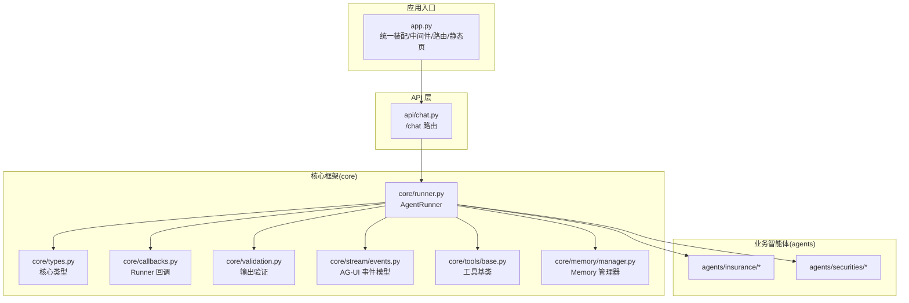
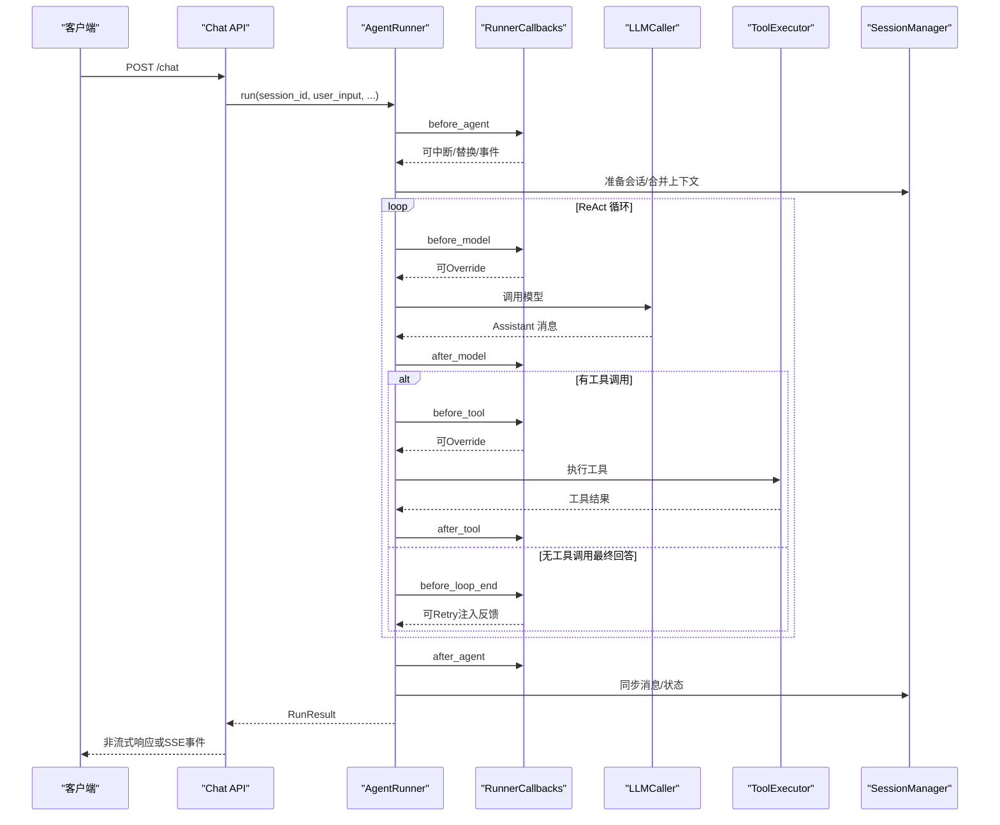
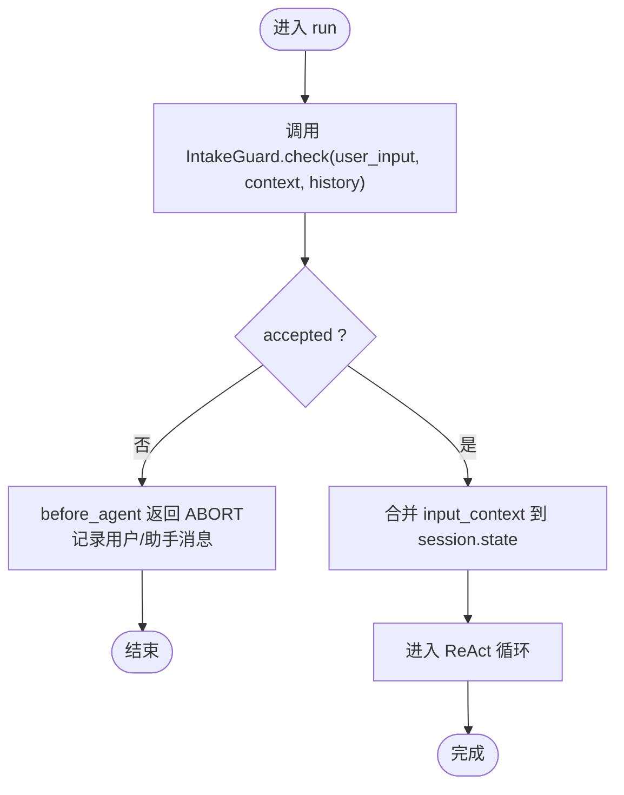
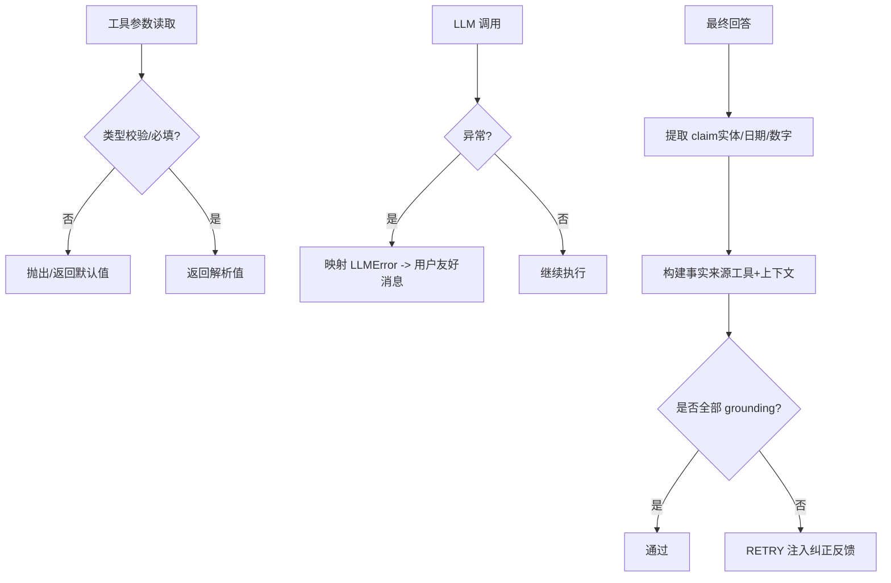
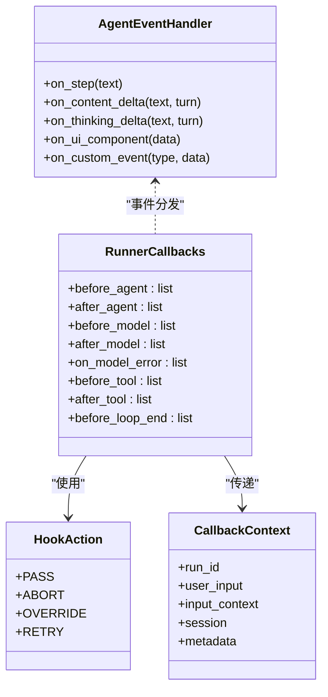
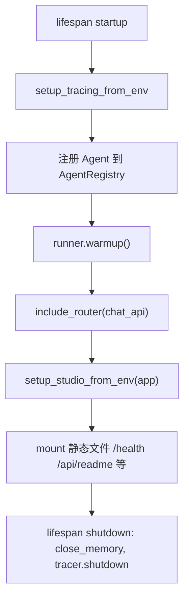
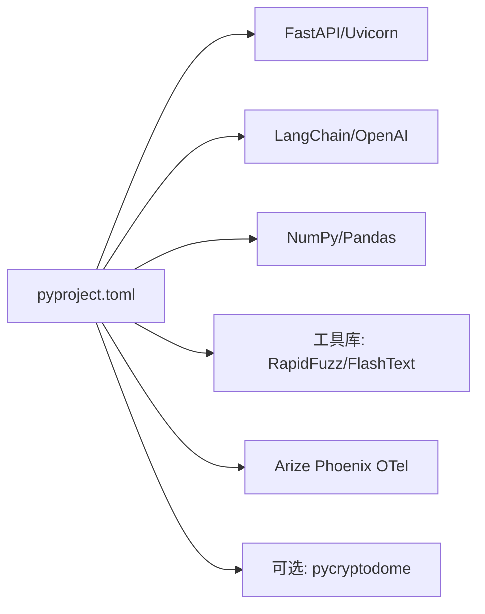

# 最佳实践

<cite>
**本文档引用的文件**
- [src/ark_agentic/__init__.py](file://src/ark_agentic/__init__.py)
- [src/ark_agentic/app.py](file://src/ark_agentic/app.py)
- [src/ark_agentic/api/chat.py](file://src/ark_agentic/api/chat.py)
- [src/ark_agentic/core/callbacks.py](file://src/ark_agentic/core/callbacks.py)
- [src/ark_agentic/core/guard.py](file://src/ark_agentic/core/guard.py)
- [src/ark_agentic/core/validation.py](file://src/ark_agentic/core/validation.py)
- [src/ark_agentic/core/runner.py](file://src/ark_agentic/core/runner.py)
- [src/ark_agentic/core/tools/base.py](file://src/ark_agentic/core/tools/base.py)
- [src/ark_agentic/core/memory/manager.py](file://src/ark_agentic/core/memory/manager.py)
- [src/ark_agentic/core/stream/events.py](file://src/ark_agentic/core/stream/events.py)
- [src/ark_agentic/core/types.py](file://src/ark_agentic/core/types.py)
- [tests/unit/core/test_callbacks.py](file://tests/unit/core/test_callbacks.py)
- [tests/unit/core/test_validation.py](file://tests/unit/core/test_validation.py)
- [pyproject.toml](file://pyproject.toml)
- [README.md](file://README.md)
</cite>

## 目录
1. [简介](#简介)
2. [项目结构](#项目结构)
3. [核心组件](#核心组件)
4. [架构总览](#架构总览)
5. [详细组件分析](#详细组件分析)
6. [依赖分析](#依赖分析)
7. [性能考虑](#性能考虑)
8. [故障排查指南](#故障排查指南)
9. [结论](#结论)
10. [附录](#附录)

## 简介
本指南面向 Ark-Agentic 智能体开发者，系统阐述安全防护、输入验证、异常处理、回调系统、中间件与扩展点、代码组织与命名、模块化设计、性能优化、内存与并发、测试与调试以及生产部署要点。文档以代码为依据，结合图示帮助读者快速掌握框架最佳实践。

## 项目结构
Ark-Agentic 采用清晰的分层与功能域划分：
- 核心框架（core）：Runner、会话、工具、技能、记忆、流式输出、提示词、LLM 适配、回调、验证等
- 业务智能体（agents）：保险、证券、Meta 构建器等
- API 层（api）：FastAPI 路由与依赖注入
- 应用入口（app.py）：统一装配、中间件、路由注册、静态页面与健康检查
- Studio（可选）：管理控制台
- CLI：项目初始化与工具
- 测试（tests）：单元、集成、E2E

图表来源
- [src/ark_agentic/app.py:137-249](file://src/ark_agentic/app.py#L137-L249)
- [src/ark_agentic/api/chat.py:27-177](file://src/ark_agentic/api/chat.py#L27-L177)
- [src/ark_agentic/core/runner.py:193-800](file://src/ark_agentic/core/runner.py#L193-L800)
- [src/ark_agentic/core/types.py:1-422](file://src/ark_agentic/core/types.py#L1-L422)
- [src/ark_agentic/core/callbacks.py:1-198](file://src/ark_agentic/core/callbacks.py#L1-L198)
- [src/ark_agentic/core/validation.py:1-605](file://src/ark_agentic/core/validation.py#L1-L605)
- [src/ark_agentic/core/stream/events.py:1-116](file://src/ark_agentic/core/stream/events.py#L1-L116)
- [src/ark_agentic/core/tools/base.py:1-289](file://src/ark_agentic/core/tools/base.py#L1-L289)
- [src/ark_agentic/core/memory/manager.py:1-92](file://src/ark_agentic/core/memory/manager.py#L1-L92)

章节来源
- [src/ark_agentic/app.py:137-249](file://src/ark_agentic/app.py#L137-L249)
- [src/ark_agentic/api/chat.py:27-177](file://src/ark_agentic/api/chat.py#L27-L177)
- [README.md:596-701](file://README.md#L596-L701)

## 核心组件
- AgentRunner：ReAct 执行器，封装 LLM 调用、工具执行、会话管理、回调、流式输出与统计
- RunnerCallbacks：Runner 生命周期回调容器，提供 7 个 hook，覆盖 Agent 级与每轮循环
- Validation：输出验证与引用校验，支持实体/日期/数字 claim 提取与 grounding
- Tool 基类与参数读取：标准化工具定义、参数校验与读取
- Session/Types：消息、工具调用/结果、会话状态、Token 统计等核心类型
- Stream Events：AG-UI 事件模型与输出格式化
- Memory Manager：纯文件 MEMORY.md 的读写与 heading upsert
- Guard：准入检查协议，由各 Agent 实现具体策略

章节来源
- [src/ark_agentic/core/runner.py:193-800](file://src/ark_agentic/core/runner.py#L193-L800)
- [src/ark_agentic/core/callbacks.py:1-198](file://src/ark_agentic/core/callbacks.py#L1-L198)
- [src/ark_agentic/core/validation.py:1-605](file://src/ark_agentic/core/validation.py#L1-L605)
- [src/ark_agentic/core/tools/base.py:1-289](file://src/ark_agentic/core/tools/base.py#L1-L289)
- [src/ark_agentic/core/types.py:1-422](file://src/ark_agentic/core/types.py#L1-L422)
- [src/ark_agentic/core/stream/events.py:1-116](file://src/ark_agentic/core/stream/events.py#L1-L116)
- [src/ark_agentic/core/memory/manager.py:1-92](file://src/ark_agentic/core/memory/manager.py#L1-L92)
- [src/ark_agentic/core/guard.py:1-34](file://src/ark_agentic/core/guard.py#L1-L34)

## 架构总览
Ark-Agentic 的执行路径从 API 路由进入，经过会话准备、Runner 生命周期回调、LLM 调用、工具执行、最终响应校验与流式输出，最终落盘并返回。

图表来源
- [src/ark_agentic/api/chat.py:27-177](file://src/ark_agentic/api/chat.py#L27-L177)
- [src/ark_agentic/core/runner.py:312-731](file://src/ark_agentic/core/runner.py#L312-L731)
- [src/ark_agentic/core/callbacks.py:98-167](file://src/ark_agentic/core/callbacks.py#L98-L167)

## 详细组件分析

### 安全防护与准入检查
- IntakeGuard 协议：在进入 ReAct 循环前进行准入检查，返回 GuardResult（accepted/message），由具体 Agent 实现
- RunnerCallbacks.before_agent：可在此阶段 ABORT 拒绝请求，或注入上下文
- 输入上下文合并：input_context 通过 session.state["temp:*"] 与最终状态剥离，避免污染

图表来源
- [src/ark_agentic/core/guard.py:25-34](file://src/ark_agentic/core/guard.py#L25-L34)
- [src/ark_agentic/core/runner.py:406-493](file://src/ark_agentic/core/runner.py#L406-L493)
- [src/ark_agentic/core/callbacks.py:98-106](file://src/ark_agentic/core/callbacks.py#L98-L106)

章节来源
- [src/ark_agentic/core/guard.py:1-34](file://src/ark_agentic/core/guard.py#L1-L34)
- [src/ark_agentic/core/runner.py:406-493](file://src/ark_agentic/core/runner.py#L406-L493)
- [src/ark_agentic/core/callbacks.py:98-106](file://src/ark_agentic/core/callbacks.py#L98-L106)

### 输入验证与异常处理模式
- 输入参数读取：提供字符串/整数/浮点/布尔/列表/字典的安全读取与必填校验，异常时返回默认值或抛出明确错误
- LLM 错误分类：统一 LLMError 与原因枚举，Runner 将错误映射为用户友好提示
- 输出验证：validate_answer_grounding 对最终回答做后置 grounding 校验，支持实体/日期/数字 claim，低分时可 RETRY 注入反馈

图表来源
- [src/ark_agentic/core/tools/base.py:169-289](file://src/ark_agentic/core/tools/base.py#L169-L289)
- [src/ark_agentic/core/runner.py:592-611](file://src/ark_agentic/core/runner.py#L592-L611)
- [src/ark_agentic/core/validation.py:213-292](file://src/ark_agentic/core/validation.py#L213-L292)

章节来源
- [src/ark_agentic/core/tools/base.py:169-289](file://src/ark_agentic/core/tools/base.py#L169-L289)
- [src/ark_agentic/core/runner.py:592-611](file://src/ark_agentic/core/runner.py#L592-L611)
- [src/ark_agentic/core/validation.py:213-292](file://src/ark_agentic/core/validation.py#L213-L292)

### 回调系统：使用方法、扩展点与事件
- RunnerCallbacks：before_agent/after_agent/before_model/after_model/on_model_error/before_tool/after_tool/before_loop_end
- HookAction：PASS/ABORT/OVERRIDE/RETRY，控制流程走向
- CallbackContext：run_id/user_input/input_context/session/metadata
- 事件总线：StreamEventBus 将 Runner 回调信号展开为 AG-UI 事件，输出层适配多种协议

图表来源
- [src/ark_agentic/core/callbacks.py:172-198](file://src/ark_agentic/core/callbacks.py#L172-L198)
- [src/ark_agentic/core/callbacks.py:43-70](file://src/ark_agentic/core/callbacks.py#L43-L70)
- [src/ark_agentic/core/callbacks.py:75-93](file://src/ark_agentic/core/callbacks.py#L75-L93)
- [src/ark_agentic/core/stream/events.py:67-116](file://src/ark_agentic/core/stream/events.py#L67-L116)

章节来源
- [src/ark_agentic/core/callbacks.py:1-198](file://src/ark_agentic/core/callbacks.py#L1-L198)
- [src/ark_agentic/core/stream/events.py:1-116](file://src/ark_agentic/core/stream/events.py#L1-L116)

### 中间件集成与扩展点设计
- FastAPI 中间件：CORS 已内置
- 路由注册：include_router(chat_api.router)，并按环境变量条件挂载 Studio
- 全局 lifespan：初始化 Tracing、注册 Agent、warmup、关闭时清理资源
- 扩展点：RunnerCallbacks 合并策略（内部 + 外部），支持 tracing 与业务回调叠加

图表来源
- [src/ark_agentic/app.py:63-135](file://src/ark_agentic/app.py#L63-L135)
- [src/ark_agentic/app.py:137-249](file://src/ark_agentic/app.py#L137-L249)

章节来源
- [src/ark_agentic/app.py:63-135](file://src/ark_agentic/app.py#L63-L135)
- [src/ark_agentic/app.py:137-249](file://src/ark_agentic/app.py#L137-L249)

### 代码组织规范、命名约定与模块化
- 模块化：按功能域划分 core/agents/api/studio/cli/static
- 命名：类名使用 PascalCase，方法/属性使用 snake_case；工具类统一以 AgentTool 命名
- 类型：核心类型集中在 types.py，消息、工具调用/结果、会话状态、Token 统计等
- 工具参数：ToolParameter 与 get_json_schema 保持与 OpenAI function calling 兼容
- 依赖注入：Runner 通过构造函数注入 ToolRegistry、SessionManager、MemoryManager 等

章节来源
- [src/ark_agentic/core/types.py:1-422](file://src/ark_agentic/core/types.py#L1-L422)
- [src/ark_agentic/core/tools/base.py:16-101](file://src/ark_agentic/core/tools/base.py#L16-L101)
- [src/ark_agentic/core/runner.py:203-284](file://src/ark_agentic/core/runner.py#L203-L284)

### 性能优化、内存管理与并发处理
- 并行工具调用：当 LLM 返回多个工具调用时，使用 asyncio.gather 并行执行
- AG-UI 流式协议：事件驱动，支持细粒度流式推送（20 种事件类型）
- 多协议适配：单一内部实现，输出层适配 4 种协议格式
- 零数据库记忆：纯文件 MEMORY.md，无 SQLite/向量库依赖，启动即用
- 会话压缩：自动总结历史消息，保持上下文窗口稳定
- 输出验证：自动检测数值幻觉，提升输出可靠性
- 并发子任务：SpawnSubtasksTool 支持并行执行多个独立子任务
- 记忆蒸馏：MemoryDreamer 异步后台执行，乐观合并回写，避免阻塞主线程

章节来源
- [README.md:787-795](file://README.md#L787-L795)
- [src/ark_agentic/core/runner.py:799-800](file://src/ark_agentic/core/runner.py#L799-L800)
- [src/ark_agentic/core/memory/manager.py:18-92](file://src/ark_agentic/core/memory/manager.py#L18-L92)
- [src/ark_agentic/core/subtask/tool.py](file://src/ark_agentic/core/subtask/tool.py)

### 测试驱动开发与调试技巧
- 测试策略：pytest + asyncio_mode，超时保护，分层测试（unit/integration/e2e）
- 回调单元测试：验证 CallbackContext、RunnerCallbacks、CallbackResult、事件
- 输出验证单元测试：覆盖 parse_cited_response、validate_answer_grounding、claim 提取、实体 Trie、相对时间等
- 调试建议：利用 CallbackContext.metadata 传递 trace_id，结合 Phoenix 可观测性追踪链路

章节来源
- [tests/unit/core/test_callbacks.py:1-74](file://tests/unit/core/test_callbacks.py#L1-L74)
- [tests/unit/core/test_validation.py:1-407](file://tests/unit/core/test_validation.py#L1-L407)
- [pyproject.toml:70-78](file://pyproject.toml#L70-L78)
- [README.md:75-89](file://README.md#L75-L89)

### 生产环境部署注意事项
- 环境变量：LLM_PROVIDER/API_KEY/MODEL_NAME/LLM_BASE_URL/API_HOST/API_PORT/SESSIONS_DIR/MEMORY_DIR 等
- Docker：镜像构建与卷挂载，暴露 8080 端口
- 健康检查：/health
- 静态页面：/insurance /securities 首页回退逻辑
- 可观测性：Phoenix 自动初始化与关闭，确保 traces 正常 flush

章节来源
- [README.md:155-169](file://README.md#L155-L169)
- [src/ark_agentic/app.py:213-222](file://src/ark_agentic/app.py#L213-L222)
- [src/ark_agentic/app.py:175-211](file://src/ark_agentic/app.py#L175-L211)
- [README.md:75-89](file://README.md#L75-L89)

## 依赖分析
- 依赖管理：uv + pyproject.toml，分组 dev/pa-jt/all
- 核心依赖：FastAPI、Uvicorn、LangChain、NumPy、Pandas、RapidFuzz、FlashText、Arize Phoenix OTel 等
- 可选依赖：PA-JT 系列需要 pycryptodome

图表来源
- [pyproject.toml:1-99](file://pyproject.toml#L1-L99)

章节来源
- [pyproject.toml:1-99](file://pyproject.toml#L1-L99)

## 性能考虑
- 并行工具调用：在工具批执行阶段使用并发，减少端到端延迟
- AG-UI 流式：事件粒度推送，前端可即时渲染，降低感知延迟
- 会话压缩：定期摘要历史，控制上下文长度，避免超限
- 输出验证：后置 grounding 降低幻觉风险，减少后续纠错成本
- 记忆系统：文件级存储，避免数据库 I/O；Dream 异步蒸馏，避免阻塞

## 故障排查指南
- LLM 错误映射：根据 LLMErrorReason 映射为用户友好提示，便于前端展示
- before_loop_end RETRY：当 validate_answer_grounding 路由为 retry 时，注入纠正反馈并继续循环
- 回调事件：通过 CallbackEvent 与 StreamEventBus 推送自定义事件，便于前端定位问题
- 日志级别：通过 LOG_LEVEL 控制全局日志，DEBUG 下注意避免过量输出

章节来源
- [src/ark_agentic/core/runner.py:592-611](file://src/ark_agentic/core/runner.py#L592-L611)
- [src/ark_agentic/core/validation.py:587-602](file://src/ark_agentic/core/validation.py#L587-L602)
- [src/ark_agentic/core/callbacks.py:51-70](file://src/ark_agentic/core/callbacks.py#L51-L70)

## 结论
Ark-Agentic 通过清晰的分层、完善的 Runner 回调体系、严格的输入/输出验证与可观测性，提供了可扩展、可维护、可生产的智能体开发框架。遵循本文的最佳实践，可在保证安全性与稳定性的同时，高效迭代业务能力。

## 附录
- 快速开始与 API 示例、CLI 使用、Docker 部署、环境变量说明详见项目 README
- 顶层便捷导入与模块导出见 __init__.py

章节来源
- [README.md:41-208](file://README.md#L41-L208)
- [src/ark_agentic/__init__.py:1-80](file://src/ark_agentic/__init__.py#L1-L80)