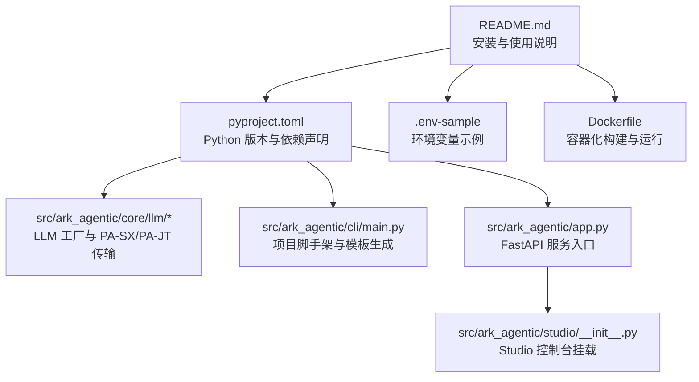
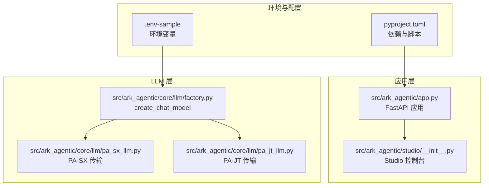
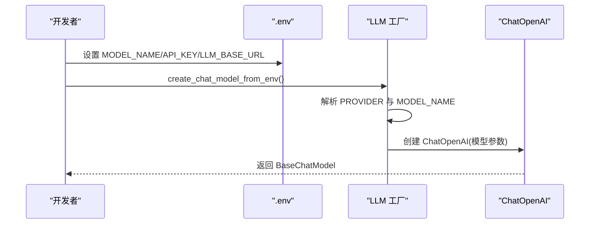
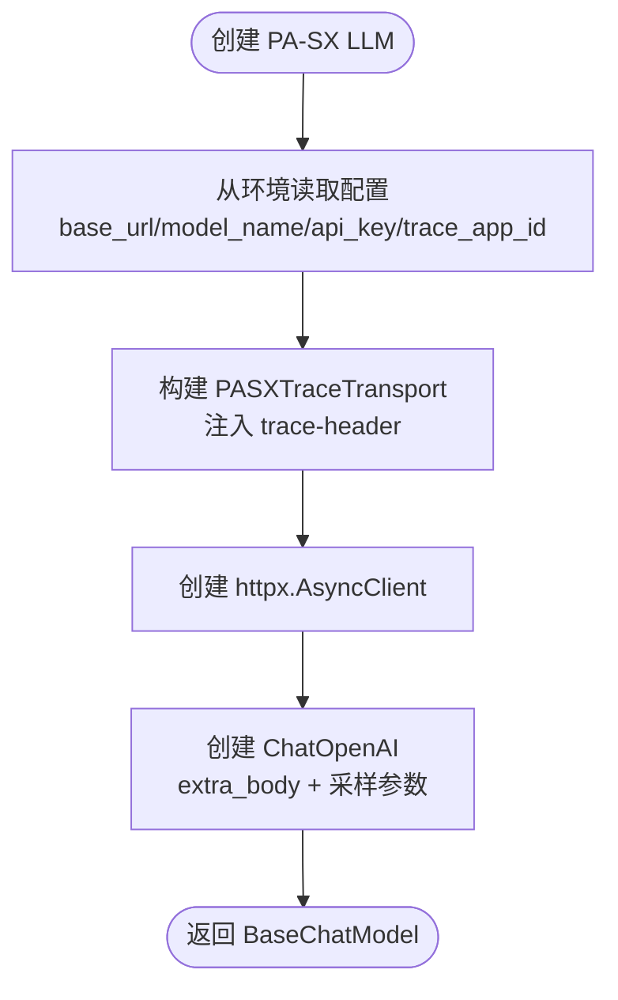
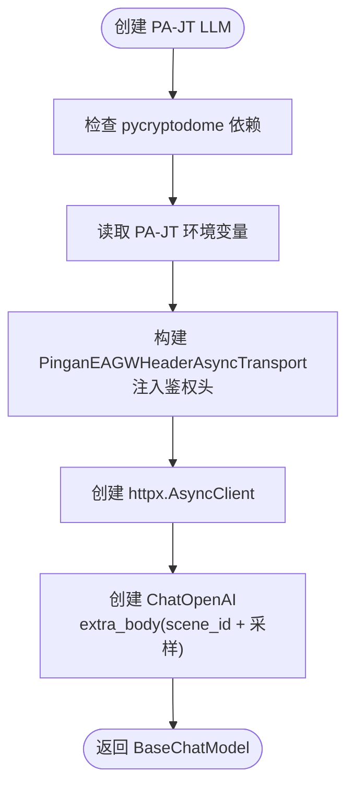
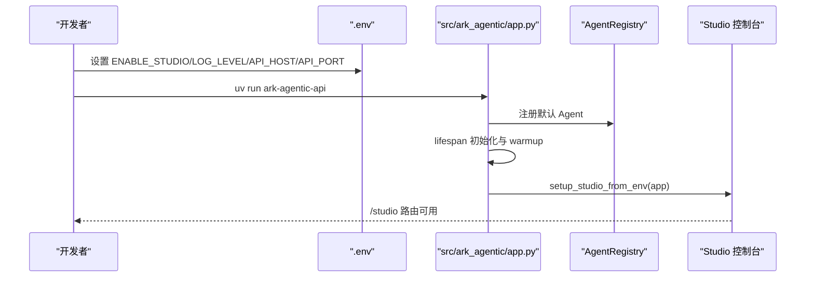
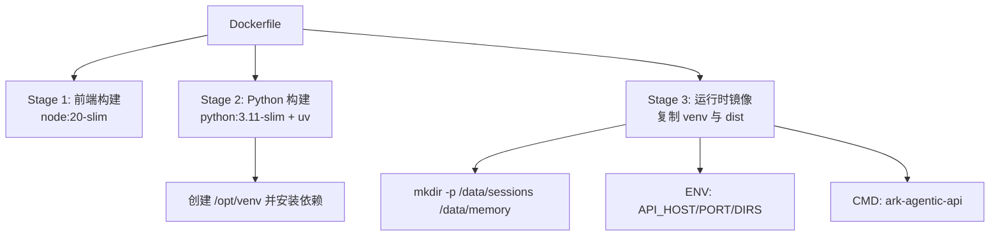
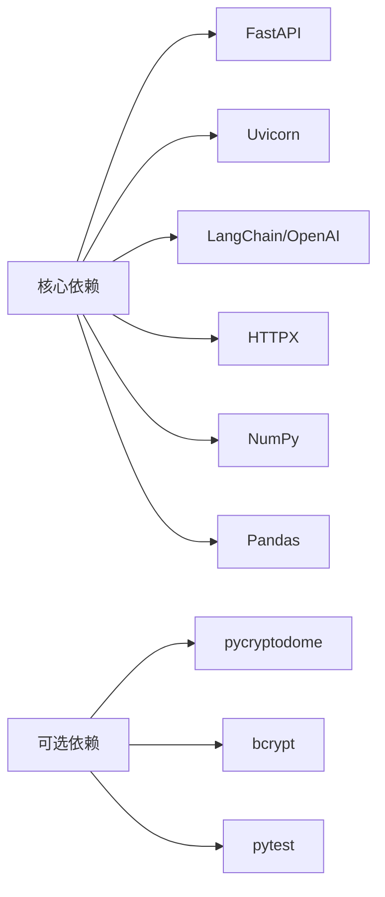

# 环境搭建

<cite>
**本文引用的文件**
- [README.md](file://README.md)
- [pyproject.toml](file://pyproject.toml)
- [.env-sample](file://.env-sample)
- [Dockerfile](file://Dockerfile)
- [src/ark_agentic/core/utils/env.py](file://src/ark_agentic/core/utils/env.py)
- [src/ark_agentic/core/llm/factory.py](file://src/ark_agentic/core/llm/factory.py)
- [src/ark_agentic/core/llm/pa_sx_llm.py](file://src/ark_agentic/core/llm/pa_sx_llm.py)
- [src/ark_agentic/core/llm/pa_jt_llm.py](file://src/ark_agentic/core/llm/pa_jt_llm.py)
- [src/ark_agentic/cli/main.py](file://src/ark_agentic/cli/main.py)
- [src/ark_agentic/app.py](file://src/ark_agentic/app.py)
- [src/ark_agentic/studio/__init__.py](file://src/ark_agentic/studio/__init__.py)
- [tests/integration/test_setup_studio_from_env.py](file://tests/integration/test_setup_studio_from_env.py)
- [scripts/publish.sh](file://scripts/publish.sh)
- [scripts/publish.ps1](file://scripts/publish.ps1)
</cite>

## 目录
1. [简介](#简介)
2. [项目结构](#项目结构)
3. [核心组件](#核心组件)
4. [架构总览](#架构总览)
5. [详细组件分析](#详细组件分析)
6. [依赖分析](#依赖分析)
7. [性能考虑](#性能考虑)
8. [故障排查指南](#故障排查指南)
9. [结论](#结论)
10. [附录](#附录)

## 简介
本指南面向 Ark-Agentic 项目的开发者与运维人员，提供从零开始的环境搭建与配置说明，涵盖以下主题：
- Python 版本要求与依赖管理
- 虚拟环境与项目初始化
- LLM 提供商配置（OpenAI、PA-SX、PA-JT）
- 开发环境与本地调试
- Docker 容器化部署
- 环境变量配置示例与常见问题

## 项目结构
Ark-Agentic 采用模块化组织，核心能力集中在 src/ark_agentic 下，包含 LLM 客户端、工具系统、会话与记忆、流式输出、API 服务与 CLI 等模块。项目通过 uv 管理依赖与运行，支持一键初始化新项目并生成 .env-sample。

**图示来源**
- [README.md](file://README.md)
- [pyproject.toml](file://pyproject.toml)
- [src/ark_agentic/core/llm/factory.py](file://src/ark_agentic/core/llm/factory.py)
- [src/ark_agentic/cli/main.py](file://src/ark_agentic/cli/main.py)
- [src/ark_agentic/app.py](file://src/ark_agentic/app.py)
- [src/ark_agentic/studio/__init__.py](file://src/ark_agentic/studio/__init__.py)
- [.env-sample](file://.env-sample)
- [Dockerfile](file://Dockerfile)

**章节来源**
- [README.md](file://README.md)
- [pyproject.toml](file://pyproject.toml)

## 核心组件
- LLM 客户端工厂：统一 OpenAI 兼容与 PA 内部模型（PA-SX/PA-JT）的创建与参数注入。
- CLI 脚手架：支持初始化项目、生成模板与 .env-sample，按提供商选择注入对应变量。
- FastAPI 服务：统一路由、可观测性与可选 Studio 控制台。
- 环境变量工具：解析 AGENTS_ROOT 与代理智能体目录，支持多级回退策略。
- Docker 镜像：多阶段构建，包含前端构建与运行时精简镜像。

**章节来源**
- [src/ark_agentic/core/llm/factory.py](file://src/ark_agentic/core/llm/factory.py)
- [src/ark_agentic/cli/main.py](file://src/ark_agentic/cli/main.py)
- [src/ark_agentic/app.py](file://src/ark_agentic/app.py)
- [src/ark_agentic/core/utils/env.py](file://src/ark_agentic/core/utils/env.py)
- [Dockerfile](file://Dockerfile)

## 架构总览
下图展示从环境变量到 LLM 客户端、再到 API 服务与 Studio 的整体链路。

**图示来源**
- [.env-sample](file://.env-sample)
- [pyproject.toml](file://pyproject.toml)
- [src/ark_agentic/app.py](file://src/ark_agentic/app.py)
- [src/ark_agentic/studio/__init__.py](file://src/ark_agentic/studio/__init__.py)
- [src/ark_agentic/core/llm/factory.py](file://src/ark_agentic/core/llm/factory.py)
- [src/ark_agentic/core/llm/pa_sx_llm.py](file://src/ark_agentic/core/llm/pa_sx_llm.py)
- [src/ark_agentic/core/llm/pa_jt_llm.py](file://src/ark_agentic/core/llm/pa_jt_llm.py)

## 详细组件分析

### Python 版本与依赖管理
- Python 版本要求：项目 requires-python >= 3.10。
- 依赖管理：使用 uv（PEP 723），支持组依赖（server、dev、pa-jt、all）。
- 关键依赖：FastAPI、Uvicorn、LangChain（OpenAI）、HTTPX、NumPy、Pandas、pytest 等。
- 可选依赖：
  - server：包含 FastAPI 与 uvicorn 标准变体。
  - dev：测试工具链。
  - pa-jt：RSA 签名所需 pycryptodome。
  - all：同时包含 dev 与 pa-jt。

建议使用 uv 进行安装与运行：
- 安装项目（开发模式）：uv pip install -e .
- 运行测试：uv run pytest -v
- 运行脚本：uv run python script.py

**章节来源**
- [pyproject.toml](file://pyproject.toml)
- [README.md](file://README.md)

### 虚拟环境与项目初始化
- 使用 CLI 初始化新项目，支持指定 LLM 提供商与是否包含 API 与内存配置。
- 初始化会生成：
  - pyproject.toml（依赖 ark-agentic）
  - src/<package>/main.py（交互式入口）
  - src/<package>/agents/default/（默认智能体骨架）
  - .env-sample（按提供商写入对应环境变量占位符）

命令示例（基于仓库内说明）：
- 初始化默认 openai：uv run ark-agentic init my-agent
- 指定 PA-SX 并包含 API：uv run ark-agentic init my-pa-agent --llm-provider pa-sx --api
- 在已有项目中添加智能体：cd my-agent && uv run ark-agentic add-agent risk-engine

**章节来源**
- [src/ark_agentic/cli/main.py](file://src/ark_agentic/cli/main.py)
- [README.md](file://README.md)

### LLM 提供商设置

#### OpenAI 兼容模型
- 必填项：MODEL_NAME、API_KEY；当使用非 OpenAI 端点时需设置 LLM_BASE_URL。
- 工厂方法：create_chat_model(model_name, api_key, base_url, sampling, streaming)。
- 环境变量：LLM_PROVIDER=openai、MODEL_NAME、API_KEY、LLM_BASE_URL、DEFAULT_TEMPERATURE。

**图示来源**
- [src/ark_agentic/core/llm/factory.py](file://src/ark_agentic/core/llm/factory.py)
- [.env-sample](file://.env-sample)

**章节来源**
- [src/ark_agentic/core/llm/factory.py](file://src/ark_agentic/core/llm/factory.py)
- [.env-sample](file://.env-sample)

#### PA-SX 模型
- 必填项：LLM_PROVIDER=pa、MODEL_NAME=PA-SX-80B/PA-SX-235B、API_KEY、LLM_BASE_URL。
- 传输层：通过自定义 AsyncBaseTransport 注入 trace-header，body 由 extra_body 注入。
- 依赖：无需额外依赖（除 PA-JT 需 pycryptodome）。

**图示来源**
- [src/ark_agentic/core/llm/pa_sx_llm.py](file://src/ark_agentic/core/llm/pa_sx_llm.py)
- [src/ark_agentic/core/llm/factory.py](file://src/ark_agentic/core/llm/factory.py)

**章节来源**
- [src/ark_agentic/core/llm/pa_sx_llm.py](file://src/ark_agentic/core/llm/pa_sx_llm.py)
- [src/ark_agentic/core/llm/factory.py](file://src/ark_agentic/core/llm/factory.py)

#### PA-JT 模型
- 必填项：LLM_PROVIDER=pa、MODEL_NAME=PA-JT-80B、LLM_BASE_URL；签名相关变量（PA_JT_OPEN_API_CODE、PA_JT_OPEN_API_CREDENTIAL、PA_JT_RSA_PRIVATE_KEY、PA_JT_GPT_APP_KEY、PA_JT_GPT_APP_SECRET、PA_JT_SCENE_ID）。
- 依赖：需要安装 pycryptodome（uv add 'ark-agentic[pa-jt]' 或 uv add pycryptodome）。
- 传输层：PinganEAGWHeaderAsyncTransport 注入多类鉴权头（RSA/HMAC 等），body 由 extra_body 注入。

**图示来源**
- [src/ark_agentic/core/llm/pa_jt_llm.py](file://src/ark_agentic/core/llm/pa_jt_llm.py)
- [src/ark_agentic/core/llm/factory.py](file://src/ark_agentic/core/llm/factory.py)

**章节来源**
- [src/ark_agentic/core/llm/pa_jt_llm.py](file://src/ark_agentic/core/llm/pa_jt_llm.py)
- [src/ark_agentic/core/llm/factory.py](file://src/ark_agentic/core/llm/factory.py)

### 开发环境与本地调试
- 启动 API 服务：uv run ark-agentic-api 或在生成的项目中 uv run python -m <package>.app。
- 环境变量：LOG_LEVEL、API_HOST、API_PORT、ENABLE_STUDIO、SESSIONS_DIR、MEMORY_DIR 等。
- Studio 控制台：通过 ENABLE_STUDIO=true 挂载，提供 Agent/Skill/Tool/Session 的可视化管理。
- Phoenix 可观测性：ENABLE_PHOENIX=true 时自动初始化追踪并在关闭时 flush。

**图示来源**
- [src/ark_agentic/app.py](file://src/ark_agentic/app.py)
- [src/ark_agentic/studio/__init__.py](file://src/ark_agentic/studio/__init__.py)
- [tests/integration/test_setup_studio_from_env.py](file://tests/integration/test_setup_studio_from_env.py)

**章节来源**
- [src/ark_agentic/app.py](file://src/ark_agentic/app.py)
- [src/ark_agentic/studio/__init__.py](file://src/ark_agentic/studio/__init__.py)
- [tests/integration/test_setup_studio_from_env.py](file://tests/integration/test_setup_studio_from_env.py)

### Docker 容器化部署
- 多阶段构建：前端构建（Node 20）与 Python 构建（Python 3.11 slim），最终运行时镜像最小化。
- 依赖安装：使用 uv venv 与 uv pip 安装依赖，包含 [memory] 组。
- 持久化：/data/sessions 与 /data/memory 为卷挂载目录，建议使用命名卷避免跨文件系统 WAL 问题。
- 健康检查：内置 HTTP GET /health。
- 环境变量：默认暴露 API_HOST、API_PORT、SESSIONS_DIR、MEMORY_DIR。

**图示来源**
- [Dockerfile](file://Dockerfile)

**章节来源**
- [Dockerfile](file://Dockerfile)

### 环境变量配置示例
- 核心配置：LLM_PROVIDER、MODEL_NAME、API_KEY、LLM_BASE_URL、DEFAULT_TEMPERATURE、API_HOST、API_PORT。
- 存储配置：SESSIONS_DIR、MEMORY_DIR。
- 功能开关：ENABLE_STUDIO、LOG_LEVEL、EMBEDDING_MODEL_PATH、AGENTS_ROOT。
- PA 模型专用：PA_SX_* 与 PA_JT_* 相关变量（按需填写）。
- 保险与证券服务：DATA_SERVICE_* 与 SECURITIES_SERVICE_* 变量（Mock/鉴权等）。

参考示例请参阅 .env-sample 与 README 的“环境变量”章节。

**章节来源**
- [.env-sample](file://.env-sample)
- [README.md](file://README.md)

## 依赖分析
- 语言与框架：Python 3.10+、FastAPI、Uvicorn、LangChain OpenAI。
- 数据与检索：NumPy、Pandas、RapidFuzz、PyPinyin、FlashText。
- 可观测性：Arize Phoenix、OpenInference Instrumentation。
- 可选：pycryptodome（PA-JT）、bcrypt（Server）、pytest（Dev）。

**图示来源**
- [pyproject.toml](file://pyproject.toml)

**章节来源**
- [pyproject.toml](file://pyproject.toml)

## 性能考虑
- 并行工具调用：LLM 返回多个工具调用时，使用异步并行执行以降低延迟。
- AG-UI 流式协议：事件驱动架构，支持细粒度流式推送。
- 会话压缩：自动摘要历史消息，保持上下文窗口稳定。
- 输出验证：自动检测数值幻觉，提升输出可靠性。
- 零数据库记忆：纯文件 MEMORY.md，启动即用，减少部署复杂度。

**章节来源**
- [README.md](file://README.md)

## 故障排查指南
- API 启动失败（端口占用）：检查 API_HOST/API_PORT，或在 app.py 中调整默认端口。
- LLM 连接错误：
  - OpenAI 兼容：确认 API_KEY 与 LLM_BASE_URL 设置正确。
  - PA-SX：确认 LLM_BASE_URL 与 API_KEY；若出现签名错误，检查 PA_JT_* 变量。
  - PA-JT：缺少 pycryptodome 将导致导入异常，使用 uv add 'ark-agentic[pa-jt]' 安装。
- Studio 无法访问：确保 ENABLE_STUDIO=true，且前端构建产物存在（/studio 路由）。
- Phoenix 未生效：确认 ENABLE_PHOENIX=true 与必要端点参数；或检查环境变量是否被覆盖。
- Docker 卷权限问题：使用命名卷而非 bind mount，避免跨文件系统 WAL 问题。

**章节来源**
- [src/ark_agentic/core/llm/pa_jt_llm.py](file://src/ark_agentic/core/llm/pa_jt_llm.py)
- [src/ark_agentic/studio/__init__.py](file://src/ark_agentic/studio/__init__.py)
- [Dockerfile](file://Dockerfile)

## 结论
通过本指南，您可以在本地与容器环境中完成 Ark-Agentic 的环境搭建与配置。建议优先使用 uv 管理依赖与运行，按需选择 LLM 提供商，并结合 .env-sample 与 Dockerfile 进行本地与生产部署。遇到问题时，可依据故障排查章节逐项核对环境变量与依赖。

## 附录
- 发布脚本：提供多平台发布流程（构建前端、打包 wheel、上传至内部 PyPI）。
- CLI 模板：初始化项目时生成的 app.py、agent.json、.env-sample 等模板文件。

**章节来源**
- [scripts/publish.sh](file://scripts/publish.sh)
- [scripts/publish.ps1](file://scripts/publish.ps1)
- [src/ark_agentic/cli/main.py](file://src/ark_agentic/cli/main.py)