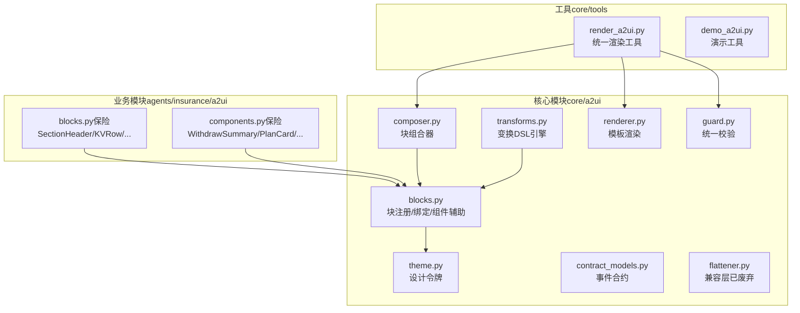
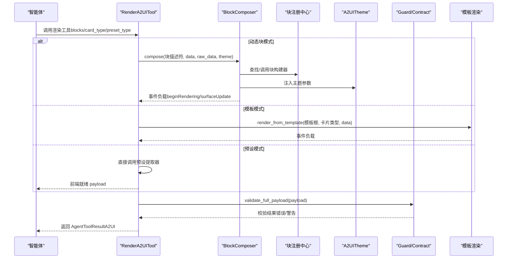
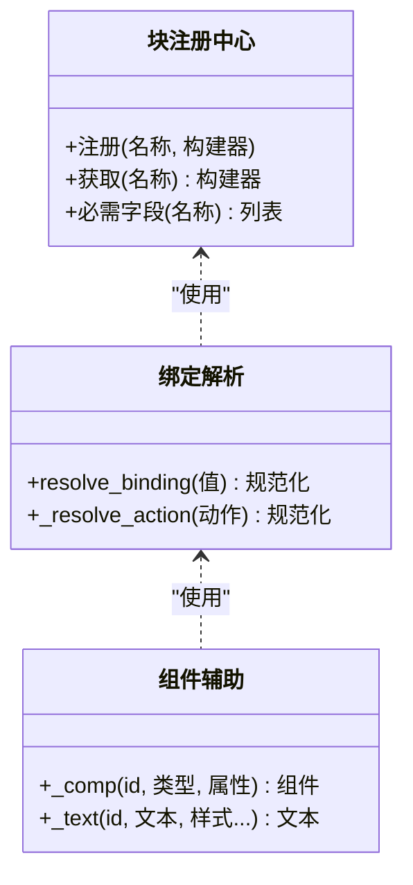
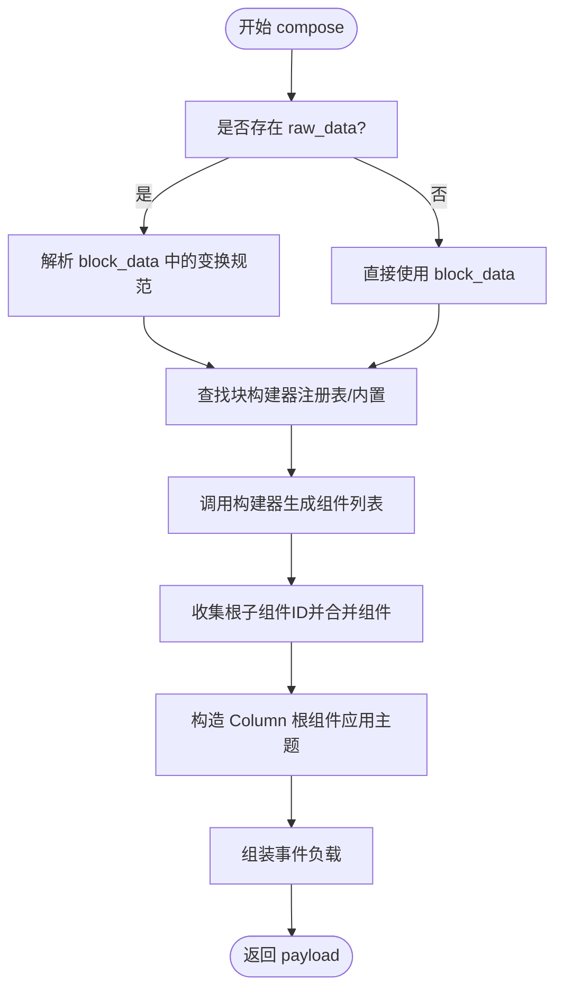
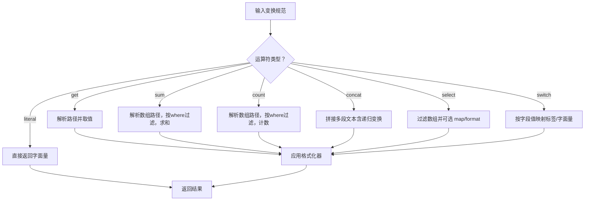
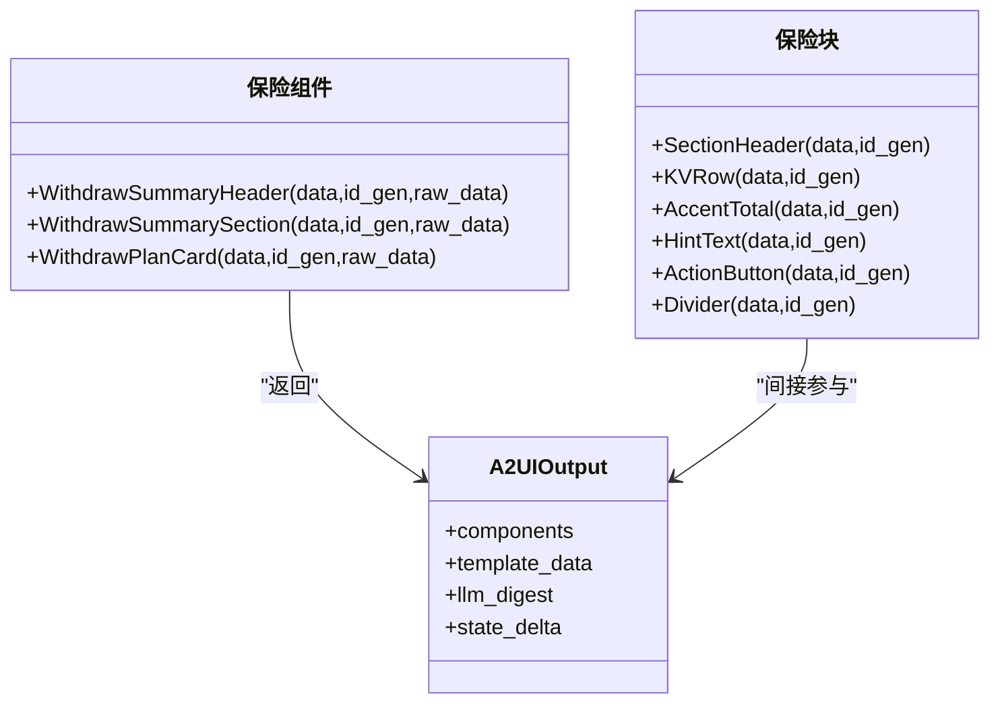
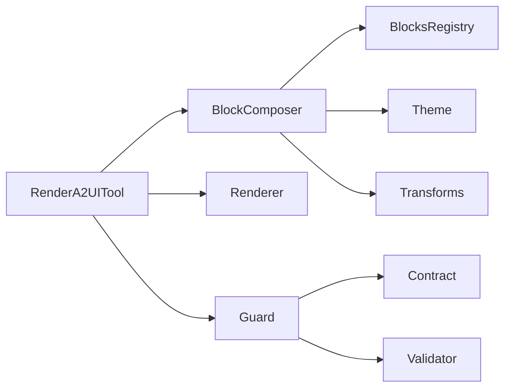

# A2UI 卡片设计

<cite>
**本文档引用的文件**
- [composer.py](file://src/ark_agentic/core/a2ui/composer.py)
- [blocks.py](file://src/ark_agentic/core/a2ui/blocks.py)
- [renderer.py](file://src/ark_agentic/core/a2ui/renderer.py)
- [theme.py](file://src/ark_agentic/core/a2ui/theme.py)
- [contract_models.py](file://src/ark_agentic/core/a2ui/contract_models.py)
- [guard.py](file://src/ark_agentic/core/a2ui/guard.py)
- [transforms.py](file://src/ark_agentic/core/a2ui/transforms.py)
- [flattener.py](file://src/ark_agentic/core/a2ui/flattener.py)
- [blocks.py（保险代理）](file://src/ark_agentic/agents/insurance/a2ui/blocks.py)
- [components.py（保险代理）](file://src/ark_agentic/agents/insurance/a2ui/components.py)
- [render_a2ui.py](file://src/ark_agentic/core/tools/render_a2ui.py)
- [demo_a2ui.py](file://src/ark_agentic/core/tools/demo_a2ui.py)
- [a2ui-standard.md](file://docs/a2ui/a2ui-standard.md)
</cite>

## 目录
1. [简介](#简介)
2. [项目结构](#项目结构)
3. [核心组件](#核心组件)
4. [架构总览](#架构总览)
5. [详细组件分析](#详细组件分析)
6. [依赖关系分析](#依赖关系分析)
7. [性能考虑](#性能考虑)
8. [故障排查指南](#故障排查指南)
9. [结论](#结论)
10. [附录](#附录)

## 简介
本指南面向 A2UI 卡片设计与实现，围绕“块组件系统”展开，系统性阐述 BlockComposer 的工作流程、块描述符的定义与校验、数据绑定与模板渲染、动态更新机制、主题定制与样式管理、响应式设计最佳实践，以及 A2UI 与智能体系统的集成与数据流转。文档同时提供完整的开发示例，帮助读者快速创建自定义块组件、配置渲染参数并实现交互逻辑。

## 项目结构
A2UI 核心位于 core/a2ui，提供通用的块系统、主题、变换引擎、合约校验与渲染工具；具体业务卡片（如保险）在 agents 下以 blocks 与 components 的形式注册到块系统中；统一渲染工具 render_a2ui 提供三种渲染路径：动态块组合、模板渲染与预设直出。

**图表来源**
- [composer.py:57-123](file://src/ark_agentic/core/a2ui/composer.py#L57-L123)
- [blocks.py:96-149](file://src/ark_agentic/core/a2ui/blocks.py#L96-L149)
- [renderer.py:15-53](file://src/ark_agentic/core/a2ui/renderer.py#L15-L53)
- [theme.py:12-39](file://src/ark_agentic/core/a2ui/theme.py#L12-L39)
- [guard.py:83-125](file://src/ark_agentic/core/a2ui/guard.py#L83-L125)
- [contract_models.py:97-123](file://src/ark_agentic/core/a2ui/contract_models.py#L97-L123)
- [transforms.py:186-316](file://src/ark_agentic/core/a2ui/transforms.py#L186-L316)
- [flattener.py:106-273](file://src/ark_agentic/core/a2ui/flattener.py#L106-L273)
- [blocks.py（保险代理）:25-145](file://src/ark_agentic/agents/insurance/a2ui/blocks.py#L25-L145)
- [components.py（保险代理）:69-470](file://src/ark_agentic/agents/insurance/a2ui/components.py#L69-L470)
- [render_a2ui.py:178-685](file://src/ark_agentic/core/tools/render_a2ui.py#L178-L685)
- [demo_a2ui.py:17-74](file://src/ark_agentic/core/tools/demo_a2ui.py#L17-L74)

**章节来源**
- [composer.py:1-123](file://src/ark_agentic/core/a2ui/composer.py#L1-L123)
- [blocks.py:1-149](file://src/ark_agentic/core/a2ui/blocks.py#L1-L149)
- [renderer.py:1-53](file://src/ark_agentic/core/a2ui/renderer.py#L1-L53)
- [theme.py:1-39](file://src/ark_agentic/core/a2ui/theme.py#L1-L39)
- [guard.py:1-125](file://src/ark_agentic/core/a2ui/guard.py#L1-L125)
- [contract_models.py:1-123](file://src/ark_agentic/core/a2ui/contract_models.py#L1-L123)
- [transforms.py:1-396](file://src/ark_agentic/core/a2ui/transforms.py#L1-L396)
- [flattener.py:1-273](file://src/ark_agentic/core/a2ui/flattener.py#L1-L273)
- [blocks.py（保险代理）:1-145](file://src/ark_agentic/agents/insurance/a2ui/blocks.py#L1-L145)
- [components.py（保险代理）:1-538](file://src/ark_agentic/agents/insurance/a2ui/components.py#L1-L538)
- [render_a2ui.py:1-685](file://src/ark_agentic/core/tools/render_a2ui.py#L1-L685)
- [demo_a2ui.py:1-74](file://src/ark_agentic/core/tools/demo_a2ui.py#L1-L74)

## 核心组件
- 块系统与注册中心：提供块构建器注册、必需字段校验、绑定解析与组件辅助函数。
- 块组合器：将块描述符转换为完整 A2UI 事件负载，支持内联变换与主题注入。
- 变换 DSL：提供 get/sum/count/select/concat/switch/literal 等运算，安全地从原始数据派生 UI 数据。
- 主题系统：集中管理视觉令牌（颜色、圆角、间距、密度），贯穿组件构建与组合。
- 统一校验：事件合约校验、组件/绑定校验与数据覆盖率检查。
- 模板渲染：从模板目录加载 template.json，合并 data 并注入 surfaceId。
- 统一渲染工具：三路渲染模式（动态块、模板、预设），参数动态生成，严格校验与错误处理。

**章节来源**
- [blocks.py:96-149](file://src/ark_agentic/core/a2ui/blocks.py#L96-L149)
- [composer.py:57-123](file://src/ark_agentic/core/a2ui/composer.py#L57-L123)
- [transforms.py:186-316](file://src/ark_agentic/core/a2ui/transforms.py#L186-L316)
- [theme.py:12-39](file://src/ark_agentic/core/a2ui/theme.py#L12-L39)
- [guard.py:83-125](file://src/ark_agentic/core/a2ui/guard.py#L83-L125)
- [contract_models.py:97-123](file://src/ark_agentic/core/a2ui/contract_models.py#L97-L123)
- [renderer.py:15-53](file://src/ark_agentic/core/a2ui/renderer.py#L15-L53)
- [render_a2ui.py:178-685](file://src/ark_agentic/core/tools/render_a2ui.py#L178-L685)

## 架构总览
A2UI 卡片渲染采用“块描述符 → 组合 → 校验 → 输出”的流水线，支持三种渲染路径：

**图表来源**
- [render_a2ui.py:328-458](file://src/ark_agentic/core/tools/render_a2ui.py#L328-L458)
- [composer.py:60-123](file://src/ark_agentic/core/a2ui/composer.py#L60-L123)
- [renderer.py:15-53](file://src/ark_agentic/core/a2ui/renderer.py#L15-L53)
- [guard.py:83-125](file://src/ark_agentic/core/a2ui/guard.py#L83-L125)
- [contract_models.py:97-123](file://src/ark_agentic/core/a2ui/contract_models.py#L97-L123)

## 详细组件分析

### 块系统与块描述符
- 块描述符：形如 { "type": "...", "data": { ... } }，type 为块类型，data 为块所需参数。
- 块注册：通过装饰器注册块构建器，支持为特定类型声明必需字段，缺失时抛出 BlockDataError。
- 绑定解析：resolve_binding 支持 $path、{"path": "..."}、{"literalString": "..."} 等，确保运行期安全。
- 组件辅助：_comp/_text 等辅助函数减少样板代码，统一组件结构。

**图表来源**
- [blocks.py:96-149](file://src/ark_agentic/core/a2ui/blocks.py#L96-L149)

**章节来源**
- [blocks.py:46-149](file://src/ark_agentic/core/a2ui/blocks.py#L46-L149)

### 块组合器（BlockComposer）工作流程
- 输入：块描述符数组、data、raw_data、主题、可选 surface/session 信息。
- 内联变换：在 compose 前对 block_data 中的变换规范进行解析，避免运行期开销。
- 构建组件：调用块构建器生成组件列表，收集根 Column 的子组件 ID。
- 根节点：构造 Column 根组件，注入主题参数（背景、内边距、间距）。
- 输出：事件负载（event/version/surfaceId/rootComponentId/style/data/components）。

**图表来源**
- [composer.py:60-123](file://src/ark_agentic/core/a2ui/composer.py#L60-L123)
- [transforms.py:186-316](file://src/ark_agentic/core/a2ui/transforms.py#L186-L316)

**章节来源**
- [composer.py:57-123](file://src/ark_agentic/core/a2ui/composer.py#L57-L123)
- [transforms.py:186-316](file://src/ark_agentic/core/a2ui/transforms.py#L186-L316)

### 变换 DSL 引擎
- 运算符：get、sum、count、concat、select、switch、literal。
- 路径解析：支持嵌套字段与数组索引/通配访问，提供详尽的错误上下文。
- 条件过滤：where 支持比较表达式与逻辑组合，返回过滤后的数组。
- 映射与格式化：select.map 支持字段映射与格式化，失败字段置空但不中断整体。
- 结果格式化：货币、百分比、整数等格式化器，保证 UI 友好输出。

**图表来源**
- [transforms.py:186-316](file://src/ark_agentic/core/a2ui/transforms.py#L186-L316)

**章节来源**
- [transforms.py:1-396](file://src/ark_agentic/core/a2ui/transforms.py#L1-L396)

### 主题系统与样式管理
- 设计令牌：颜色（强调色、标题/正文/提示/注释色、卡片/页面背景、分隔线）、形状与密度（圆角、卡片宽度、内边距、间距）、根表面间距。
- 注入方式：块构建器与组合器均从 A2UITheme 获取参数，确保全局一致性。
- 最佳实践：优先使用主题令牌而非硬编码值；通过主题切换实现品牌一致性与暗色模式适配。

**章节来源**
- [theme.py:12-39](file://src/ark_agentic/core/a2ui/theme.py#L12-L39)
- [blocks.py（保险代理）:25-145](file://src/ark_agentic/agents/insurance/a2ui/blocks.py#L25-L145)
- [composer.py:96-108](file://src/ark_agentic/core/a2ui/composer.py#L96-L108)

### 模板渲染与动态更新
- 模板渲染：从模板目录读取 template.json，注入 surfaceId，合并 data，返回完整事件负载。
- 动态更新：根据是否提供 surfaceId 决定事件类型（beginRendering 或 surfaceUpdate），支持增量组件更新。
- 数据模型更新：dataModelUpdate 仅更新 data 字段，不改变组件树。

**章节来源**
- [renderer.py:15-53](file://src/ark_agentic/core/a2ui/renderer.py#L15-L53)
- [contract_models.py:14-47](file://src/ark_agentic/core/a2ui/contract_models.py#L14-L47)
- [render_a2ui.py:328-458](file://src/ark_agentic/core/tools/render_a2ui.py#L328-L458)

### 统一校验与数据覆盖率
- 事件合约：beginRendering/surfaceUpdate/dataModelUpdate/deleteSurface 的字段约束与互斥规则。
- 组件/绑定校验：验证组件结构与绑定路径合法性。
- 数据覆盖率：检查绑定路径是否在 payload.data 中存在，避免运行期缺字段。

**章节来源**
- [contract_models.py:97-123](file://src/ark_agentic/core/a2ui/contract_models.py#L97-L123)
- [guard.py:83-125](file://src/ark_agentic/core/a2ui/guard.py#L83-L125)

### 业务卡片：保险模块
- 块（blocks）：SectionHeader/KVRow/AccentTotal/HintText/ActionButton/Divider 等，严格匹配模板样式。
- 组件（components）：WithdrawSummaryHeader/WithdrawSummarySection/WithdrawPlanCard 等，封装业务逻辑与摘要生成，返回 A2UIOutput（components/template_data/llm_digest/state_delta）。

**图表来源**
- [blocks.py（保险代理）:25-145](file://src/ark_agentic/agents/insurance/a2ui/blocks.py#L25-L145)
- [components.py（保险代理）:69-470](file://src/ark_agentic/agents/insurance/a2ui/components.py#L69-L470)

**章节来源**
- [blocks.py（保险代理）:1-145](file://src/ark_agentic/agents/insurance/a2ui/blocks.py#L1-L145)
- [components.py（保险代理）:1-538](file://src/ark_agentic/agents/insurance/a2ui/components.py#L1-L538)

### 统一渲染工具（RenderA2UITool）
- 三路模式：
  - blocks：LLM 提供块描述符 → BlockComposer 组合 → 事件负载。
  - card_type：加载 template.json + 提取器 → 事件负载。
  - preset_type：提取器直接返回前端就绪 payload。
- 参数动态生成：基于 BlocksConfig/TemplateConfig/PresetRegistry 自动生成 LLM 可见参数。
- 校验与错误处理：严格模式下合约违规直接报错，否则记录警告；聚合 llm_digest 与 state_delta。

**章节来源**
- [render_a2ui.py:178-685](file://src/ark_agentic/core/tools/render_a2ui.py#L178-L685)

### 开发示例：创建自定义块组件
以下步骤基于现有实现，指导你完成自定义块组件的开发与集成：

- 步骤 1：定义块构建器
  - 在你的代理模块中编写块构建器函数，接收 data 与 id_gen，返回组件列表。
  - 使用 _comp/_text 等辅助函数，确保组件结构一致。
  - 参考路径：[blocks.py（保险代理）:29-133](file://src/ark_agentic/agents/insurance/a2ui/blocks.py#L29-L133)

- 步骤 2：注册块类型
  - 通过装饰器注册块类型，必要时声明必需字段，以便在 compose 时自动校验。
  - 参考路径：[blocks.py:102-117](file://src/ark_agentic/core/a2ui/blocks.py#L102-L117)

- 步骤 3：在块描述符中使用
  - 在 blocks 参数中提供 { "type": "你的块类型", "data": { ... } }。
  - 参考路径：[render_a2ui.py:244-325](file://src/ark_agentic/core/tools/render_a2ui.py#L244-L325)

- 步骤 4：配置渲染参数
  - 使用 BlocksConfig 注入 agent_blocks、agent_components、theme、schemas 等。
  - 参考路径：[render_a2ui.py:51-77](file://src/ark_agentic/core/tools/render_a2ui.py#L51-L77)

- 步骤 5：实现交互逻辑
  - 在组件中通过 action 字段配置 openLink/query/report 等事件，或在块中直接生成 Button 组件。
  - 参考路径：[a2ui-standard.md:121-151](file://docs/a2ui/a2ui-standard.md#L121-L151)

- 步骤 6：主题定制
  - 通过 A2UITheme 注入自定义颜色、圆角、间距等，确保风格一致。
  - 参考路径：[theme.py:12-39](file://src/ark_agentic/core/a2ui/theme.py#L12-L39)

- 步骤 7：动态更新
  - 若已有 surfaceId，则使用 surfaceUpdate；否则使用 beginRendering。
  - 参考路径：[render_a2ui.py:374-376](file://src/ark_agentic/core/tools/render_a2ui.py#L374-L376)

- 步骤 8：校验与调试
  - 使用 validate_full_payload 检查事件合约、组件结构与数据覆盖率。
  - 参考路径：[guard.py:83-125](file://src/ark_agentic/core/a2ui/guard.py#L83-L125)

- 步骤 9：模板渲染（可选）
  - 准备 template.json 与提取器，使用 card_type 模式渲染。
  - 参考路径：[renderer.py:15-53](file://src/ark_agentic/core/a2ui/renderer.py#L15-L53)

- 步骤 10：预设直出（可选）
  - 使用 PresetRegistry 注册提取器，直接返回前端就绪 payload。
  - 参考路径：[render_a2ui.py:599-631](file://src/ark_agentic/core/tools/render_a2ui.py#L599-L631)

**章节来源**
- [blocks.py（保险代理）:29-133](file://src/ark_agentic/agents/insurance/a2ui/blocks.py#L29-L133)
- [blocks.py:102-117](file://src/ark_agentic/core/a2ui/blocks.py#L102-L117)
- [render_a2ui.py:51-77](file://src/ark_agentic/core/tools/render_a2ui.py#L51-L77)
- [a2ui-standard.md:121-151](file://docs/a2ui/a2ui-standard.md#L121-L151)
- [theme.py:12-39](file://src/ark_agentic/core/a2ui/theme.py#L12-L39)
- [guard.py:83-125](file://src/ark_agentic/core/a2ui/guard.py#L83-L125)
- [renderer.py:15-53](file://src/ark_agentic/core/a2ui/renderer.py#L15-L53)

## 依赖关系分析
- 组件耦合与内聚
  - BlockComposer 与 A2UITheme 高内聚，确保主题参数贯穿组件构建。
  - 块注册中心与块构建器解耦，便于业务模块独立扩展。
  - 统一渲染工具作为门面，屏蔽三种渲染路径差异。
- 外部依赖与集成点
  - 模板渲染依赖文件系统与 JSON 解析。
  - 校验层依赖事件合约与组件验证器。
- 循环依赖
  - 未发现循环导入；模块间单向依赖清晰。

**图表来源**
- [render_a2ui.py:328-458](file://src/ark_agentic/core/tools/render_a2ui.py#L328-L458)
- [composer.py:60-123](file://src/ark_agentic/core/a2ui/composer.py#L60-L123)
- [blocks.py:96-149](file://src/ark_agentic/core/a2ui/blocks.py#L96-L149)
- [theme.py:12-39](file://src/ark_agentic/core/a2ui/theme.py#L12-L39)
- [transforms.py:186-316](file://src/ark_agentic/core/a2ui/transforms.py#L186-L316)
- [renderer.py:15-53](file://src/ark_agentic/core/a2ui/renderer.py#L15-L53)
- [guard.py:83-125](file://src/ark_agentic/core/a2ui/guard.py#L83-L125)
- [contract_models.py:97-123](file://src/ark_agentic/core/a2ui/contract_models.py#L97-L123)

**章节来源**
- [render_a2ui.py:1-685](file://src/ark_agentic/core/tools/render_a2ui.py#L1-L685)
- [composer.py:1-123](file://src/ark_agentic/core/a2ui/composer.py#L1-L123)
- [blocks.py:1-149](file://src/ark_agentic/core/a2ui/blocks.py#L1-L149)
- [theme.py:1-39](file://src/ark_agentic/core/a2ui/theme.py#L1-L39)
- [transforms.py:1-396](file://src/ark_agentic/core/a2ui/transforms.py#L1-L396)
- [renderer.py:1-53](file://src/ark_agentic/core/a2ui/renderer.py#L1-L53)
- [guard.py:1-125](file://src/ark_agentic/core/a2ui/guard.py#L1-L125)
- [contract_models.py:1-123](file://src/ark_agentic/core/a2ui/contract_models.py#L1-L123)

## 性能考虑
- 变换计算在 compose 阶段完成，避免运行时重复计算。
- 组件 ID 生成器与根 Column 构造一次完成，减少前端遍历成本。
- 模板渲染与预设直出避免复杂树构建，适合静态/半静态场景。
- 校验在工具层集中执行，严格模式下可提前失败，降低前端错误率。

## 故障排查指南
- 事件合约错误：检查 event/surfaceId/rootComponentId/components/catalogId/data 等字段是否满足要求。
- 组件/绑定错误：确认组件类型与属性合法，绑定路径使用 path 而非 literalString。
- 数据覆盖率警告：核对 payload.data 是否包含所有绑定路径引用的键。
- 块类型未知：确认块类型已在注册中心注册，或在 agent_blocks/agent_components 中提供。
- 模板渲染失败：检查模板文件是否存在、JSON 是否合法、模板根路径是否正确。

**章节来源**
- [contract_models.py:97-123](file://src/ark_agentic/core/a2ui/contract_models.py#L97-L123)
- [guard.py:83-125](file://src/ark_agentic/core/a2ui/guard.py#L83-L125)
- [render_a2ui.py:545-597](file://src/ark_agentic/core/tools/render_a2ui.py#L545-L597)

## 结论
A2UI 卡片设计以“块组件系统”为核心，结合变换 DSL、主题系统与统一校验，形成高内聚、低耦合且可扩展的渲染体系。通过 RenderA2UITool 的三路渲染模式，开发者可在不同场景下选择最优方案：动态块组合适合复杂交互与业务逻辑；模板渲染适合标准化卡片；预设直出适合静态/半静态数据。配合严格的校验与数据覆盖率检查，可显著提升卡片渲染的稳定性与一致性。

## 附录
- A2UI 数据格式与组件规范参考：[a2ui-standard.md:1-804](file://docs/a2ui/a2ui-standard.md#L1-L804)
- 演示工具：生成示例 A2UI 卡片组件，便于端到端验证渲染链路。[demo_a2ui.py:17-74](file://src/ark_agentic/core/tools/demo_a2ui.py#L17-L74)