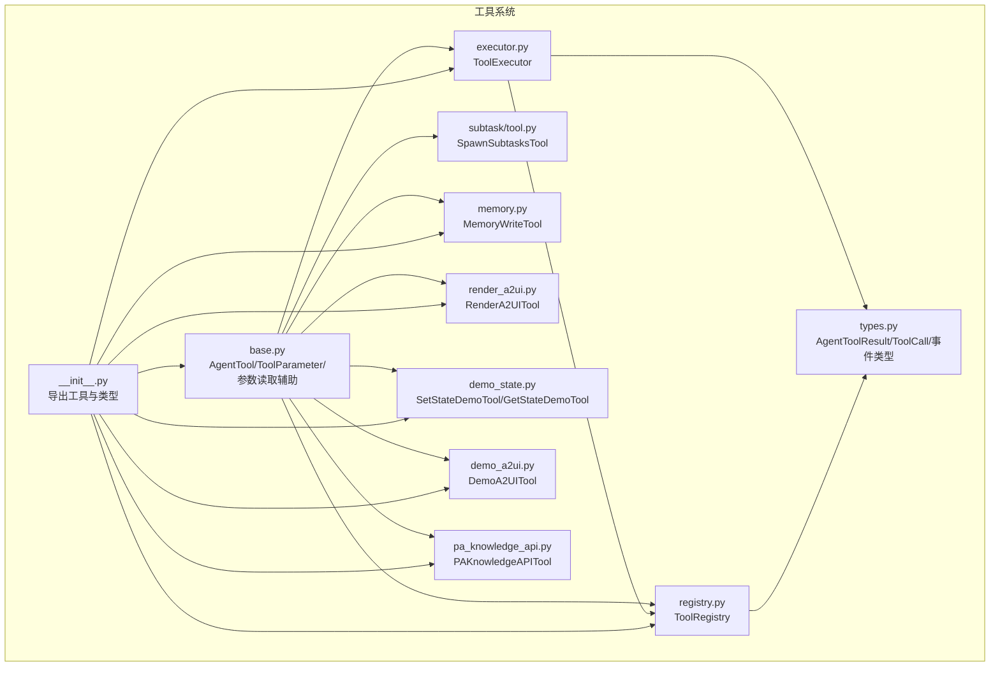
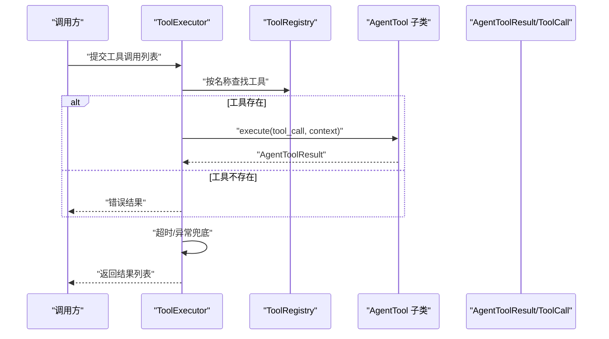
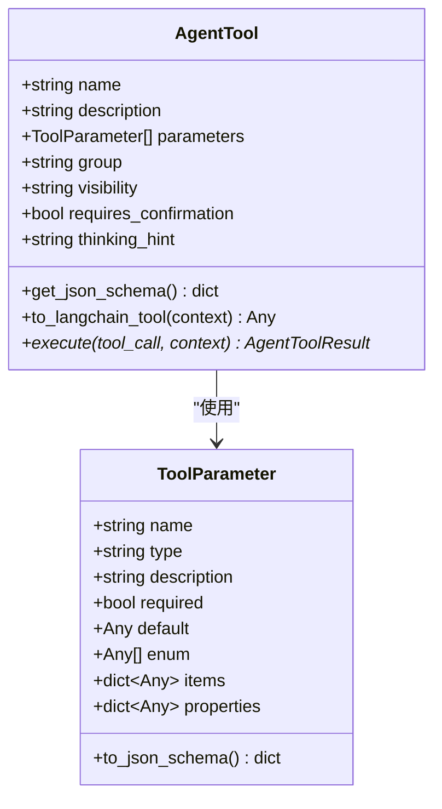
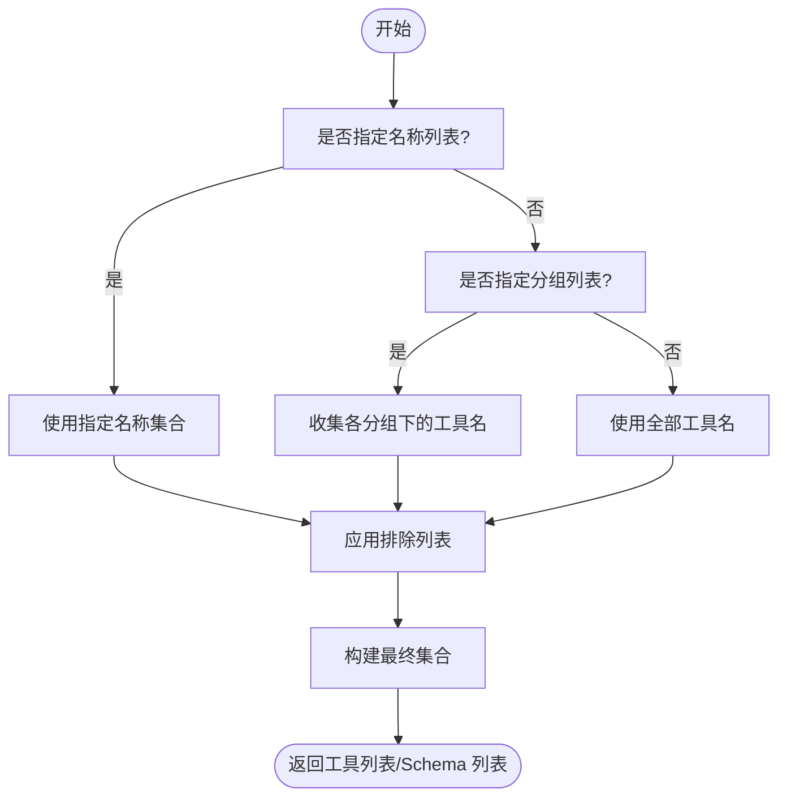
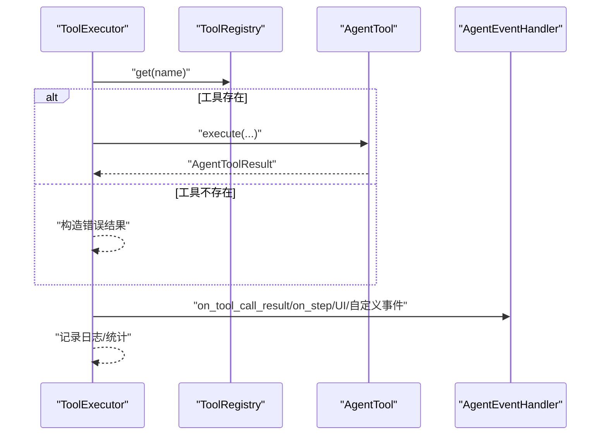
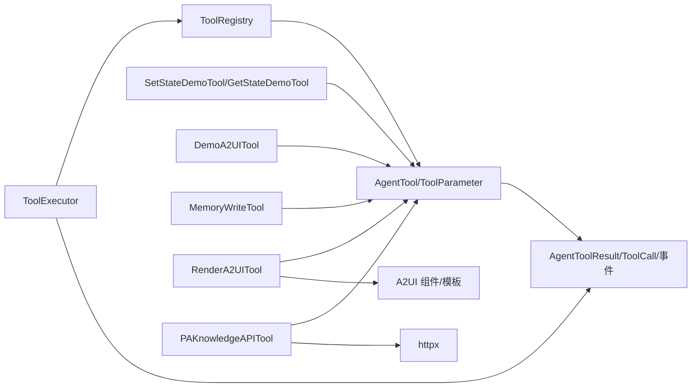

# 工具开发

<cite>
**本文引用的文件**
- [src/ark_agentic/core/tools/base.py](file://src/ark_agentic/core/tools/base.py)
- [src/ark_agentic/core/tools/registry.py](file://src/ark_agentic/core/tools/registry.py)
- [src/ark_agentic/core/tools/executor.py](file://src/ark_agentic/core/tools/executor.py)
- [src/ark_agentic/core/tools/__init__.py](file://src/ark_agentic/core/tools/__init__.py)
- [src/ark_agentic/core/subtask/tool.py](file://src/ark_agentic/core/subtask/tool.py)
- [src/ark_agentic/core/tools/memory.py](file://src/ark_agentic/core/tools/memory.py)
- [src/ark_agentic/core/tools/render_a2ui.py](file://src/ark_agentic/core/tools/render_a2ui.py)
- [src/ark_agentic/core/tools/demo_state.py](file://src/ark_agentic/core/tools/demo_state.py)
- [src/ark_agentic/core/tools/demo_a2ui.py](file://src/ark_agentic/core/tools/demo_a2ui.py)
- [src/ark_agentic/core/tools/pa_knowledge_api.py](file://src/ark_agentic/core/tools/pa_knowledge_api.py)
- [src/ark_agentic/core/tokens.py](file://src/ark_agentic/core/tokens.py)
- [src/ark_agentic/core/types.py](file://src/ark_agentic/core/types.py)
- [tests/unit/core/test_tools.py](file://tests/unit/core/test_tools.py)
</cite>

## 目录
1. [简介](#简介)
2. [项目结构](#项目结构)
3. [核心组件](#核心组件)
4. [架构总览](#架构总览)
5. [详细组件分析](#详细组件分析)
6. [依赖分析](#依赖分析)
7. [性能考虑](#性能考虑)
8. [故障排查指南](#故障排查指南)
9. [结论](#结论)
10. [附录](#附录)

## 简介
本指南面向“工具开发”主题，围绕工具基类继承机制、工具注册表工作原理、工具注册/查找/执行流程进行系统讲解，并提供从零到一的完整开发示例、参数校验与异常处理、错误报告与调试技巧，以及与智能体系统的集成最佳实践。读者将学会如何创建自定义工具类、实现工具方法、管理工具参数、处理执行期异常、并将其无缝接入智能体运行时。

## 项目结构
工具系统位于核心模块的 tools 子包，主要文件包括：
- 基类与参数辅助：base.py
- 注册表：registry.py
- 执行器：executor.py
- 工具导出入口：__init__.py
- 子任务工具：subtask/tool.py
- 内存工具：memory.py
- A2UI 渲染工具：render_a2ui.py
- 示例工具：demo_state.py、demo_a2ui.py
- PA 知识库工具：pa_knowledge_api.py
- 类型定义：types.py
- 测试：tests/unit/core/test_tools.py

图表来源
- [src/ark_agentic/core/tools/base.py:46-163](file://src/ark_agentic/core/tools/base.py#L46-L163)
- [src/ark_agentic/core/tools/registry.py:14-93](file://src/ark_agentic/core/tools/registry.py#L14-L93)
- [src/ark_agentic/core/tools/executor.py:29-101](file://src/ark_agentic/core/tools/executor.py#L29-L101)
- [src/ark_agentic/core/tools/__init__.py:7-52](file://src/ark_agentic/core/tools/__init__.py#L7-L52)
- [src/ark_agentic/core/subtask/tool.py:61-165](file://src/ark_agentic/core/subtask/tool.py#L61-L165)
- [src/ark_agentic/core/tools/memory.py:39-108](file://src/ark_agentic/core/tools/memory.py#L39-L108)
- [src/ark_agentic/core/tools/render_a2ui.py:178-312](file://src/ark_agentic/core/tools/render_a2ui.py#L178-L312)
- [src/ark_agentic/core/tools/demo_state.py:16-112](file://src/ark_agentic/core/tools/demo_state.py#L16-L112)
- [src/ark_agentic/core/tools/demo_a2ui.py:17-73](file://src/ark_agentic/core/tools/demo_a2ui.py#L17-L73)
- [src/ark_agentic/core/tools/pa_knowledge_api.py:71-195](file://src/ark_agentic/core/tools/pa_knowledge_api.py#L71-L195)
- [src/ark_agentic/core/types.py:85-196](file://src/ark_agentic/core/types.py#L85-L196)

章节来源
- [src/ark_agentic/core/tools/__init__.py:7-52](file://src/ark_agentic/core/tools/__init__.py#L7-L52)

## 核心组件
- 工具基类与参数模型
  - AgentTool：抽象基类，强制子类定义 name/description，提供 JSON Schema 生成、LangChain 适配等能力。
  - ToolParameter：参数定义，支持基础类型、枚举、数组/对象 items/properties、默认值等。
  - 参数读取辅助：read_*_param 与 read_*_param_required，统一参数解析与校验。
- 工具注册表
  - ToolRegistry：注册/查找/分组/过滤/Schema 生成，支持白名单/黑名单与分组策略。
- 工具执行器
  - ToolExecutor：顺序/并发执行工具调用、超时控制、错误兜底、事件分发。
- 类型与事件
  - AgentToolResult、ToolCall、ToolEvent 系列类型，统一结果与事件协议。

章节来源
- [src/ark_agentic/core/tools/base.py:46-163](file://src/ark_agentic/core/tools/base.py#L46-L163)
- [src/ark_agentic/core/tools/registry.py:14-93](file://src/ark_agentic/core/tools/registry.py#L14-L93)
- [src/ark_agentic/core/tools/executor.py:29-101](file://src/ark_agentic/core/tools/executor.py#L29-L101)
- [src/ark_agentic/core/types.py:85-196](file://src/ark_agentic/core/types.py#L85-L196)

## 架构总览
工具系统围绕“基类-注册表-执行器-类型”的分层设计展开，执行链路如下：

图表来源
- [src/ark_agentic/core/tools/executor.py:43-101](file://src/ark_agentic/core/tools/executor.py#L43-L101)
- [src/ark_agentic/core/tools/registry.py:41-50](file://src/ark_agentic/core/tools/registry.py#L41-L50)
- [src/ark_agentic/core/types.py:85-196](file://src/ark_agentic/core/types.py#L85-L196)

## 详细组件分析

### 工具基类与参数系统
- 继承与约束
  - 子类必须定义 name 与 description，否则在类创建阶段抛错。
  - 可设置 group、visibility、requires_confirmation、thinking_hint 等元信息。
- JSON Schema 生成
  - get_json_schema 输出 OpenAI function calling 格式，包含参数必填、类型、枚举、items/properties 等。
- LangChain 适配
  - to_langchain_tool 将 AgentTool 适配为 StructuredTool，自动绑定上下文与参数解析。
- 参数读取辅助
  - 提供字符串/整数/浮点/布尔/列表/字典的读取与必需参数校验，统一默认值与类型转换。

图表来源
- [src/ark_agentic/core/tools/base.py:46-163](file://src/ark_agentic/core/tools/base.py#L46-L163)

章节来源
- [src/ark_agentic/core/tools/base.py:46-163](file://src/ark_agentic/core/tools/base.py#L46-L163)

### 工具注册表
- 能力概览
  - 单工具注册/批量注册、按名获取/必须获取、按组获取、列出所有、分组列表、存在性检查、注销、清空。
  - 生成工具 Schema 列表，支持按名称/分组/排除过滤。
  - 策略过滤：allow/deny 与 allow_groups/deny_groups 的组合。
- 设计要点
  - 内部维护工具映射与分组映射，注册时同步加入分组；注销时同步移除分组。

图表来源
- [src/ark_agentic/core/tools/registry.py:94-168](file://src/ark_agentic/core/tools/registry.py#L94-L168)

章节来源
- [src/ark_agentic/core/tools/registry.py:14-178](file://src/ark_agentic/core/tools/registry.py#L14-L178)

### 工具执行器
- 职责
  - 限制每轮最大调用次数，全并行执行工具调用，统一超时与异常兜底。
  - 将 AgentToolResult.events 统一分发到 AgentEventHandler（UI 组件事件、自定义事件、步骤事件）。
- 关键行为
  - 超时：等待超时返回错误结果。
  - 异常：捕获异常并返回错误结果。
  - 事件分发：根据事件类型路由到 handler 对应回调。

图表来源
- [src/ark_agentic/core/tools/executor.py:43-101](file://src/ark_agentic/core/tools/executor.py#L43-L101)

章节来源
- [src/ark_agentic/core/tools/executor.py:29-127](file://src/ark_agentic/core/tools/executor.py#L29-L127)

### 完整开发示例：创建自定义工具
以下为从零到一的开发步骤与要点，结合仓库中的示例工具进行说明。

- 步骤一：选择基类并定义元信息
  - 继承 AgentTool，设置 name/description/parameters/group/visibility/thinking_hint 等。
  - 参考：[src/ark_agentic/core/tools/demo_state.py:16-64](file://src/ark_agentic/core/tools/demo_state.py#L16-L64)、[src/ark_agentic/core/tools/demo_a2ui.py:17-73](file://src/ark_agentic/core/tools/demo_a2ui.py#L17-L73)
- 步骤二：定义参数
  - 使用 ToolParameter 描述参数类型、是否必填、默认值、枚举、items/properties 等。
  - 参考：[src/ark_agentic/core/tools/base.py:16-44](file://src/ark_agentic/core/tools/base.py#L16-L44)
- 步骤三：实现 execute 方法
  - 从 tool_call.arguments 读取参数，使用 read_*_param 辅助函数进行类型转换与校验。
  - 返回 AgentToolResult 的某一构造方法（json/text/a2ui/image/error）。
  - 参考：[src/ark_agentic/core/tools/memory.py:67-108](file://src/ark_agentic/core/tools/memory.py#L67-L108)、[src/ark_agentic/core/tools/demo_state.py:45-64](file://src/ark_agentic/core/tools/demo_state.py#L45-L64)
- 步骤四：注册与使用
  - 将工具实例注册到 ToolRegistry，或通过 runner.register_tool() 注册。
  - 参考：[src/ark_agentic/core/tools/__init__.py:19-43](file://src/ark_agentic/core/tools/__init__.py#L19-L43)
- 步骤五：参数验证与错误处理
  - 使用 read_*_param_required 抛出缺失参数异常。
  - 在 execute 内捕获异常并返回 AgentToolResult.error_result。
  - 参考：[src/ark_agentic/core/tools/base.py:179-288](file://src/ark_agentic/core/tools/base.py#L179-L288)、[src/ark_agentic/core/tools/memory.py:103-108](file://src/ark_agentic/core/tools/memory.py#L103-L108)

章节来源
- [src/ark_agentic/core/tools/demo_state.py:16-112](file://src/ark_agentic/core/tools/demo_state.py#L16-L112)
- [src/ark_agentic/core/tools/demo_a2ui.py:17-73](file://src/ark_agentic/core/tools/demo_a2ui.py#L17-L73)
- [src/ark_agentic/core/tools/memory.py:39-108](file://src/ark_agentic/core/tools/memory.py#L39-L108)
- [src/ark_agentic/core/tools/base.py:169-288](file://src/ark_agentic/core/tools/base.py#L169-L288)
- [src/ark_agentic/core/tools/__init__.py:19-43](file://src/ark_agentic/core/tools/__init__.py#L19-L43)

### 工具与智能体系统的集成与最佳实践
- 与 Runner 的集成
  - 工具通过 ToolRegistry 注入 Runner，Runner 在每轮推理中根据策略过滤工具并生成 JSON Schema。
  - 参考：[src/ark_agentic/core/tools/registry.py:94-128](file://src/ark_agentic/core/tools/registry.py#L94-L128)
- 事件驱动的 UI/A2UI 渲染
  - 工具返回 A2UI 结果时，自动附加 UIComponentToolEvent；也可自定义事件类型。
  - 参考：[src/ark_agentic/core/tools/render_a2ui.py:629-631](file://src/ark_agentic/core/tools/render_a2ui.py#L629-L631)、[src/ark_agentic/core/types.py:50-67](file://src/ark_agentic/core/types.py#L50-L67)
- 子任务工具
  - SpawnSubtasksTool 支持并行子任务执行，具备会话隔离、超时控制、令牌用量聚合、转录回传等功能。
  - 参考：[src/ark_agentic/core/subtask/tool.py:61-165](file://src/ark_agentic/core/subtask/tool.py#L61-L165)
- 可选工具与多实例
  - 如 PA 知识库工具，支持多实例注册（不同 tool_name），便于在同一 Agent 中接入多个端点。
  - 参考：[src/ark_agentic/core/tools/pa_knowledge_api.py:71-102](file://src/ark_agentic/core/tools/pa_knowledge_api.py#L71-L102)

章节来源
- [src/ark_agentic/core/tools/registry.py:94-168](file://src/ark_agentic/core/tools/registry.py#L94-L168)
- [src/ark_agentic/core/tools/render_a2ui.py:629-631](file://src/ark_agentic/core/tools/render_a2ui.py#L629-L631)
- [src/ark_agentic/core/subtask/tool.py:61-165](file://src/ark_agentic/core/subtask/tool.py#L61-L165)
- [src/ark_agentic/core/tools/pa_knowledge_api.py:71-102](file://src/ark_agentic/core/tools/pa_knowledge_api.py#L71-L102)

## 依赖分析
- 组件耦合
  - ToolExecutor 依赖 ToolRegistry 与 AgentToolResult/ToolCall/事件类型。
  - ToolRegistry 依赖 AgentTool 与 ToolParameter。
  - 各具体工具依赖 base.py 的 AgentTool/ToolParameter 与 types.py 的结果/事件类型。
- 外部依赖
  - LangChain 适配（可选）：to_langchain_tool 依赖 langchain-core。
  - HTTP 客户端：PA 知识库工具使用 httpx。
  - A2UI 渲染：render_a2ui 依赖 A2UI 组件与模板渲染。

图表来源
- [src/ark_agentic/core/tools/executor.py:14-24](file://src/ark_agentic/core/tools/executor.py#L14-L24)
- [src/ark_agentic/core/tools/registry.py:11-21](file://src/ark_agentic/core/tools/registry.py#L11-L21)
- [src/ark_agentic/core/tools/base.py:13-13](file://src/ark_agentic/core/tools/base.py#L13-L13)
- [src/ark_agentic/core/tools/pa_knowledge_api.py:31-34](file://src/ark_agentic/core/tools/pa_knowledge_api.py#L31-L34)
- [src/ark_agentic/core/tools/render_a2ui.py:23-30](file://src/ark_agentic/core/tools/render_a2ui.py#L23-L30)

章节来源
- [src/ark_agentic/core/tools/executor.py:14-24](file://src/ark_agentic/core/tools/executor.py#L14-L24)
- [src/ark_agentic/core/tools/registry.py:11-21](file://src/ark_agentic/core/tools/registry.py#L11-L21)
- [src/ark_agentic/core/tools/base.py:13-13](file://src/ark_agentic/core/tools/base.py#L13-L13)
- [src/ark_agentic/core/tools/pa_knowledge_api.py:31-34](file://src/ark_agentic/core/tools/pa_knowledge_api.py#L31-L34)
- [src/ark_agentic/core/tools/render_a2ui.py:23-30](file://src/ark_agentic/core/tools/render_a2ui.py#L23-L30)

## 性能考虑
- 并发与限流
  - ToolExecutor 对每轮工具调用数量进行限制，避免资源过载。
  - 子任务工具使用信号量控制并发，防止嵌套子任务导致资源耗尽。
  - 参考：[src/ark_agentic/core/tools/executor.py:32-42](file://src/ark_agentic/core/tools/executor.py#L32-L42)、[src/ark_agentic/core/subtask/tool.py:95-104](file://src/ark_agentic/core/subtask/tool.py#L95-L104)
- 超时与错误兜底
  - 统一超时控制，异常捕获后返回错误结果，避免阻塞主流程。
  - 参考：[src/ark_agentic/core/tools/executor.py:80-87](file://src/ark_agentic/core/tools/executor.py#L80-L87)
- 结果类型与事件分发
  - A2UI 结果自动附加 UI 组件事件，减少额外逻辑开销。
  - 参考：[src/ark_agentic/core/tools/render_a2ui.py:178-183](file://src/ark_agentic/core/tools/render_a2ui.py#L178-L183)

章节来源
- [src/ark_agentic/core/tools/executor.py:32-42](file://src/ark_agentic/core/tools/executor.py#L32-L42)
- [src/ark_agentic/core/subtask/tool.py:95-104](file://src/ark_agentic/core/subtask/tool.py#L95-L104)
- [src/ark_agentic/core/tools/render_a2ui.py:178-183](file://src/ark_agentic/core/tools/render_a2ui.py#L178-L183)

## 故障排查指南
- 常见错误与定位
  - 工具未注册：ToolExecutor 查找不到工具时返回错误结果；检查 ToolRegistry 是否正确注册。
    - 参考：[src/ark_agentic/core/tools/executor.py:77-78](file://src/ark_agentic/core/tools/executor.py#L77-L78)
  - 参数缺失/类型错误：使用 read_*_param_required 抛出异常；检查 LLM 传参与 ToolParameter 定义。
    - 参考：[src/ark_agentic/core/tools/base.py:179-288](file://src/ark_agentic/core/tools/base.py#L179-L288)
  - 超时：工具执行超过阈值触发超时错误；适当提高超时或优化工具实现。
    - 参考：[src/ark_agentic/core/tools/executor.py:82-84](file://src/ark_agentic/core/tools/executor.py#L82-L84)
  - A2UI 合同校验失败：严格模式下会返回错误；查看 warnings/metadata 中的校验信息。
    - 参考：[src/ark_agentic/core/tools/render_a2ui.py:640-662](file://src/ark_agentic/core/tools/render_a2ui.py#L640-L662)
- 调试技巧
  - 开启日志：关注 TOOL_START/TOOL_DONE、SUBTASK_* 等关键日志。
  - 使用测试用例：参考单元测试对工具基类、注册表、参数读取的断言。
    - 参考：[tests/unit/core/test_tools.py:1-200](file://tests/unit/core/test_tools.py#L1-L200)

章节来源
- [src/ark_agentic/core/tools/executor.py:77-96](file://src/ark_agentic/core/tools/executor.py#L77-L96)
- [src/ark_agentic/core/tools/base.py:179-288](file://src/ark_agentic/core/tools/base.py#L179-L288)
- [src/ark_agentic/core/tools/render_a2ui.py:640-662](file://src/ark_agentic/core/tools/render_a2ui.py#L640-L662)
- [tests/unit/core/test_tools.py:1-200](file://tests/unit/core/test_tools.py#L1-L200)

## 结论
工具系统以 AgentTool 为核心，通过 ToolRegistry 实现灵活的注册与过滤，借助 ToolExecutor 提供稳定的执行与事件分发能力。配合参数读取辅助与类型体系，开发者可以快速构建高质量工具，并与智能体运行时深度集成。建议在实际开发中遵循参数定义规范、完善异常处理与日志记录，并利用测试用例保证工具质量。

## 附录
- 相关类型与事件
  - AgentToolResult：统一结果封装，支持 JSON/TEXT/A2UI/IMAGE/ERROR 等类型。
  - ToolCall：工具调用请求，包含 id/name/arguments。
  - ToolEvent 系列：UI 组件事件、自定义业务事件、步骤事件。
  - 参考：[src/ark_agentic/core/types.py:85-196](file://src/ark_agentic/core/types.py#L85-L196)

章节来源
- [src/ark_agentic/core/types.py:85-196](file://src/ark_agentic/core/types.py#L85-L196)