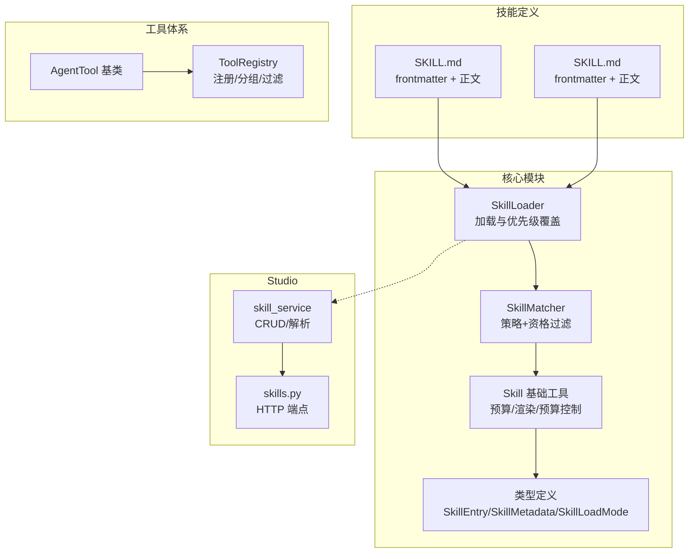
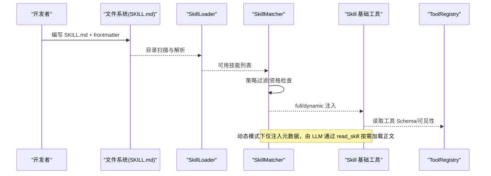
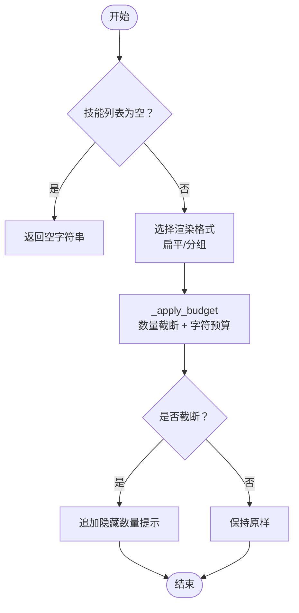
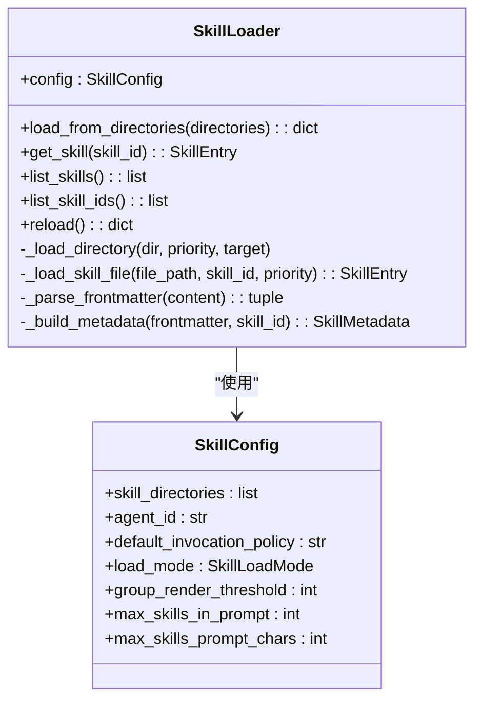
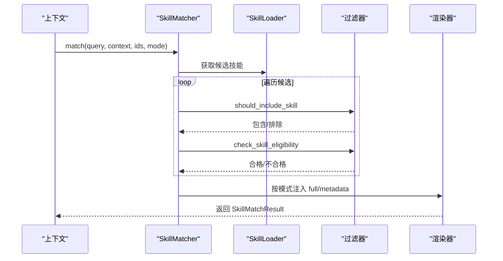
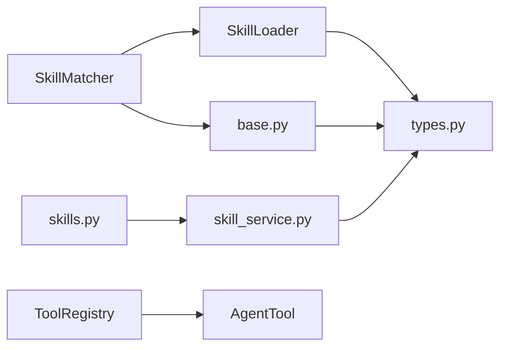

# 技能开发

<cite>
**本文引用的文件**
- [src/ark_agentic/core/skills/base.py](file://src/ark_agentic/core/skills/base.py)
- [src/ark_agentic/core/skills/loader.py](file://src/ark_agentic/core/skills/loader.py)
- [src/ark_agentic/core/skills/matcher.py](file://src/ark_agentic/core/skills/matcher.py)
- [src/ark_agentic/core/types.py](file://src/ark_agentic/core/types.py)
- [src/ark_agentic/studio/services/skill_service.py](file://src/ark_agentic/studio/services/skill_service.py)
- [src/ark_agentic/studio/api/skills.py](file://src/ark_agentic/studio/api/skills.py)
- [src/ark_agentic/core/tools/base.py](file://src/ark_agentic/core/tools/base.py)
- [src/ark_agentic/core/tools/registry.py](file://src/ark_agentic/core/tools/registry.py)
- [src/ark_agentic/agents/securities/skills/asset_overview/SKILL.md](file://src/ark_agentic/agents/securities/skills/asset_overview/SKILL.md)
- [src/ark_agentic/agents/securities/skills/profit_analysis/SKILL.md](file://src/ark_agentic/agents/securities/skills/profit_analysis/SKILL.md)
- [src/ark_agentic/agents/meta_builder/skills/meta-builder-guide/SKILL.md](file://src/ark_agentic/agents/meta_builder/skills/meta-builder-guide/SKILL.md)
- [src/ark_agentic/agents/insurance/skills/withdraw_money/SKILL.md](file://src/ark_agentic/agents/insurance/skills/withdraw_money/SKILL.md)
- [tests/unit/core/test_skills.py](file://tests/unit/core/test_skills.py)
- [tests/integration/test_studio_skills.py](file://tests/integration/test_studio_skills.py)
- [tests/skills/insurance/withdraw_money/evals/evals.json](file://tests/skills/insurance/withdraw_money/evals/evals.json)
</cite>

## 目录
1. [简介](#简介)
2. [项目结构](#项目结构)
3. [核心组件](#核心组件)
4. [架构总览](#架构总览)
5. [详细组件分析](#详细组件分析)
6. [依赖分析](#依赖分析)
7. [性能考量](#性能考量)
8. [故障排查指南](#故障排查指南)
9. [结论](#结论)
10. [附录](#附录)

## 简介
本指南面向技能开发者，系统讲解技能系统的基类设计、加载机制、匹配算法与执行流程，并提供从文件结构、配置参数到实现模式的完整开发示例，以及测试、调试与性能优化的最佳实践。读者将学会如何编写高质量、可维护、可评估的技能，使其在不同 Agent 中稳定运行。

## 项目结构
技能系统围绕“技能文件（SKILL.md）—加载器—匹配器—提示渲染—执行工具”的链路组织，辅以 Studio 的 CRUD 能力与工具注册体系，形成端到端的技能生命周期管理。

图表来源
- [src/ark_agentic/core/skills/loader.py:25-177](file://src/ark_agentic/core/skills/loader.py#L25-L177)
- [src/ark_agentic/core/skills/matcher.py:55-152](file://src/ark_agentic/core/skills/matcher.py#L55-L152)
- [src/ark_agentic/core/skills/base.py:19-344](file://src/ark_agentic/core/skills/base.py#L19-L344)
- [src/ark_agentic/core/types.py:243-308](file://src/ark_agentic/core/types.py#L243-L308)
- [src/ark_agentic/core/tools/base.py:46-130](file://src/ark_agentic/core/tools/base.py#L46-L130)
- [src/ark_agentic/core/tools/registry.py:14-178](file://src/ark_agentic/core/tools/registry.py#L14-L178)
- [src/ark_agentic/studio/services/skill_service.py:42-289](file://src/ark_agentic/studio/services/skill_service.py#L42-L289)
- [src/ark_agentic/studio/api/skills.py:57-113](file://src/ark_agentic/studio/api/skills.py#L57-L113)

章节来源
- [src/ark_agentic/core/skills/loader.py:25-177](file://src/ark_agentic/core/skills/loader.py#L25-L177)
- [src/ark_agentic/core/skills/matcher.py:55-152](file://src/ark_agentic/core/skills/matcher.py#L55-L152)
- [src/ark_agentic/core/skills/base.py:19-344](file://src/ark_agentic/core/skills/base.py#L19-L344)
- [src/ark_agentic/core/types.py:243-308](file://src/ark_agentic/core/types.py#L243-L308)
- [src/ark_agentic/core/tools/base.py:46-130](file://src/ark_agentic/core/tools/base.py#L46-L130)
- [src/ark_agentic/core/tools/registry.py:14-178](file://src/ark_agentic/core/tools/registry.py#L14-L178)
- [src/ark_agentic/studio/services/skill_service.py:42-289](file://src/ark_agentic/studio/services/skill_service.py#L42-L289)
- [src/ark_agentic/studio/api/skills.py:57-113](file://src/ark_agentic/studio/api/skills.py#L57-L113)

## 核心组件
- 技能基类与提示渲染
  - SkillConfig：技能系统配置项，如目录优先级、Agent ID、调用策略、是否允许未知技能、加载模式、分组阈值、预算上限等。
  - 资格检查与包含策略：check_skill_eligibility、should_include_skill，分别负责环境/工具依赖/策略过滤。
  - 预算与渲染：format_skills_metadata_for_prompt、build_skill_prompt、render_active_skill_section、render_skill_section，统一处理扁平/分组渲染、预算截断、XML 转义与预算提示。
- 技能加载器
  - SkillLoader：从多个目录扫描 SKILL.md，解析 YAML frontmatter，构建 SkillEntry，支持优先级覆盖与重新加载。
- 技能匹配器
  - SkillMatcher：按策略与资格过滤候选技能，依据 SkillLoadMode 决定 full_inject 与 metadata_only，提供按标签/分组检索。
- 类型与常量
  - SkillEntry/SkillMetadata/SkillLoadMode：标准化技能元数据与加载模式枚举。
- 工具体系
  - AgentTool 基类与 ToolRegistry：统一工具参数 Schema、分组与可见性控制，支持按名称/分组/白黑名单过滤。
- Studio 技能服务
  - skill_service：扫描 Agent 的 skills 目录，解析/创建/更新/删除 SKILL.md，生成前端可展示的元数据。
  - skills.py：薄 HTTP 层，调用 skill_service 并刷新 Runner 的缓存。

章节来源
- [src/ark_agentic/core/skills/base.py:19-344](file://src/ark_agentic/core/skills/base.py#L19-L344)
- [src/ark_agentic/core/skills/loader.py:25-177](file://src/ark_agentic/core/skills/loader.py#L25-L177)
- [src/ark_agentic/core/skills/matcher.py:55-152](file://src/ark_agentic/core/skills/matcher.py#L55-L152)
- [src/ark_agentic/core/types.py:243-308](file://src/ark_agentic/core/types.py#L243-L308)
- [src/ark_agentic/core/tools/base.py:46-130](file://src/ark_agentic/core/tools/base.py#L46-L130)
- [src/ark_agentic/core/tools/registry.py:14-178](file://src/ark_agentic/core/tools/registry.py#L14-L178)
- [src/ark_agentic/studio/services/skill_service.py:42-289](file://src/ark_agentic/studio/services/skill_service.py#L42-L289)
- [src/ark_agentic/studio/api/skills.py:57-113](file://src/ark_agentic/studio/api/skills.py#L57-L113)

## 架构总览
技能系统采用“声明式定义 + 动态加载 + 策略驱动”的架构，强调：
- 声明式：SKILL.md 以 frontmatter 描述元数据与调用策略，正文承载执行规则。
- 动态加载：SkillLoader 递归扫描目录，支持优先级覆盖与增量更新。
- 策略驱动：SkillMatcher 统一执行策略过滤与资格检查，再按加载模式注入提示。
- 工具协同：工具注册与可见性控制，结合技能的 required_tools，确保执行前置条件。

图表来源
- [src/ark_agentic/core/skills/loader.py:35-84](file://src/ark_agentic/core/skills/loader.py#L35-L84)
- [src/ark_agentic/core/skills/matcher.py:64-126](file://src/ark_agentic/core/skills/matcher.py#L64-L126)
- [src/ark_agentic/core/skills/base.py:242-344](file://src/ark_agentic/core/skills/base.py#L242-L344)
- [src/ark_agentic/core/tools/registry.py:94-169](file://src/ark_agentic/core/tools/registry.py#L94-L169)

## 详细组件分析

### 技能基类与提示渲染（SkillBase）
- 设计要点
  - 配置中心：SkillConfig 提供全局开关与预算参数，统一影响渲染与注入行为。
  - 策略与资格：should_include_skill 与 check_skill_eligibility 保证“策略先行、资格优先”，避免无效技能进入执行链。
  - 预算控制：_apply_budget 通过“数量上限 + 字符预算 + 二分搜索”实现高效截断，并追加提示。
  - 渲染策略：按阈值选择扁平/分组 XML；动态模式下输出“先元数据、后正文”的指令序列；full 模式直接注入完整技能正文。
- 关键函数
  - format_skills_metadata_for_prompt：按预算与阈值生成 XML 列表。
  - build_skill_prompt：将技能正文包裹在 <skill> 标签中，避免标题层级冲突。
  - render_active_skill_section：动态模式下渲染当前激活技能正文。
  - render_skill_section：兼容旧版直接拼接提示的场景。
- 复杂度与性能
  - 渲染复杂度与技能数量和长度相关；预算控制通过二分搜索在 O(log N) 内逼近字符上限。
  - XML 转义与描述截断避免冗余与越界。

图表来源
- [src/ark_agentic/core/skills/base.py:207-240](file://src/ark_agentic/core/skills/base.py#L207-L240)
- [src/ark_agentic/core/skills/base.py:242-262](file://src/ark_agentic/core/skills/base.py#L242-L262)

章节来源
- [src/ark_agentic/core/skills/base.py:19-344](file://src/ark_agentic/core/skills/base.py#L19-L344)

### 技能加载器（SkillLoader）
- 工作流程
  - 初始化：接收 SkillConfig，内部维护 {id: SkillEntry} 映射。
  - 目录扫描：遍历配置中的 skill_directories，按顺序处理，相同 id 后者覆盖前者（优先级越小越优）。
  - 文件解析：读取 SKILL.md，使用正则解析 frontmatter，构建 SkillMetadata（合并 when_to_use 至 description）。
  - 全局 ID：若配置包含 agent_id，则 skill_id 为 “agent_id.skill_name”。
  - 查询与重载：提供 get/list/list_ids 与 reload 能力。
- 配置选项
  - skill_directories：目录列表（按优先级排序）。
  - agent_id：用于生成全局唯一技能 ID。
  - default_invocation_policy：未设置时的默认调用策略。
  - 其他：预算与阈值参数由 SkillConfig 透传给渲染层。

图表来源
- [src/ark_agentic/core/skills/loader.py:25-177](file://src/ark_agentic/core/skills/loader.py#L25-L177)
- [src/ark_agentic/core/skills/base.py:19-50](file://src/ark_agentic/core/skills/base.py#L19-L50)

章节来源
- [src/ark_agentic/core/skills/loader.py:25-177](file://src/ark_agentic/core/skills/loader.py#L25-L177)

### 技能匹配算法（SkillMatcher）
- 匹配流程
  - 输入：query/context/skill_ids/check_eligibility/skill_load_mode。
  - 过滤：按 should_include_skill（策略）→ check_skill_eligibility（资格）→ 排除 ineligible/excluded。
  - 注入：按 skill_load_mode 决定 full_inject 或 metadata_only。
  - 输出：SkillMatchResult（包含两类技能列表与汇总）。
- 辅助能力
  - 按标签/分组检索：get_skill_by_tag/get_skill_by_group。
  - 直接生成提示：match_for_prompt。

图表来源
- [src/ark_agentic/core/skills/matcher.py:64-126](file://src/ark_agentic/core/skills/matcher.py#L64-L126)
- [src/ark_agentic/core/skills/base.py:104-138](file://src/ark_agentic/core/skills/base.py#L104-L138)

章节来源
- [src/ark_agentic/core/skills/matcher.py:55-152](file://src/ark_agentic/core/skills/matcher.py#L55-L152)

### 类型与常量（SkillEntry/SkillMetadata/SkillLoadMode）
- SkillMetadata：name/description/version/required_os/required_binaries/required_env_vars/invocation_policy/required_tools/group/tags/when_to_use。
- SkillEntry：id/path/content/metadata/source_priority/enabled。
- SkillLoadMode：full/dynamic。
- 作用：为加载器、匹配器与渲染器提供统一的数据契约，确保跨模块一致性。

章节来源
- [src/ark_agentic/core/types.py:243-308](file://src/ark_agentic/core/types.py#L243-L308)

### 工具体系（AgentTool 与 ToolRegistry）
- AgentTool：定义工具的 name/description/parameters/group/visibility/requires_confirmation/thinking_hint，提供 JSON Schema 与 LangChain 适配。
- ToolRegistry：注册/查找/分组/过滤/排除，支持按名称/分组/白黑名单策略，生成工具 Schema 列表。
- 与技能的协作：技能 frontmatter 的 required_tools 与工具可见性共同决定执行前置条件。

章节来源
- [src/ark_agentic/core/tools/base.py:46-130](file://src/ark_agentic/core/tools/base.py#L46-L130)
- [src/ark_agentic/core/tools/registry.py:14-178](file://src/ark_agentic/core/tools/registry.py#L14-L178)

### Studio 技能服务与 API
- skill_service：扫描 Agent 的 skills 目录，解析 SKILL.md 生成 SkillMeta，提供 list/create/update/delete 能力；支持安全路径检查与 slug 化目录名。
- skills.py：FastAPI 路由，参数校验后调用 skill_service，并在写操作后刷新 Runner 的 skill_loader 缓存。
- 与前端：前端页面展示技能元数据与 CRUD 操作。

章节来源
- [src/ark_agentic/studio/services/skill_service.py:42-289](file://src/ark_agentic/studio/services/skill_service.py#L42-L289)
- [src/ark_agentic/studio/api/skills.py:57-113](file://src/ark_agentic/studio/api/skills.py#L57-L113)
- [tests/integration/test_studio_skills.py:1-44](file://tests/integration/test_studio_skills.py#L1-L44)

## 依赖分析
- 模块耦合
  - SkillLoader 依赖 SkillConfig 与类型定义；SkillMatcher 依赖 Loader 与基础工具（策略/资格）。
  - Studio 服务与 API 依赖 Loader（通过 Runner 缓存）与类型定义。
  - 工具体系与技能体系通过 required_tools 与可见性建立弱耦合。
- 外部依赖
  - YAML frontmatter 解析、文件系统 IO、日志记录。
- 循环依赖
  - 未发现循环导入；各模块职责清晰，通过类型与接口契约解耦。

图表来源
- [src/ark_agentic/core/skills/loader.py:16-17](file://src/ark_agentic/core/skills/loader.py#L16-L17)
- [src/ark_agentic/core/skills/matcher.py:16-22](file://src/ark_agentic/core/skills/matcher.py#L16-L22)
- [src/ark_agentic/core/skills/base.py:16-16](file://src/ark_agentic/core/skills/base.py#L16-L16)
- [src/ark_agentic/core/types.py:243-308](file://src/ark_agentic/core/types.py#L243-L308)
- [src/ark_agentic/studio/services/skill_service.py:16-17](file://src/ark_agentic/studio/services/skill_service.py#L16-L17)
- [src/ark_agentic/studio/api/skills.py:14-17](file://src/ark_agentic/studio/api/skills.py#L14-L17)
- [src/ark_agentic/core/tools/registry.py:11-11](file://src/ark_agentic/core/tools/registry.py#L11-L11)
- [src/ark_agentic/core/tools/base.py:13-13](file://src/ark_agentic/core/tools/base.py#L13-L13)

章节来源
- [src/ark_agentic/core/skills/loader.py:16-17](file://src/ark_agentic/core/skills/loader.py#L16-L17)
- [src/ark_agentic/core/skills/matcher.py:16-22](file://src/ark_agentic/core/skills/matcher.py#L16-L22)
- [src/ark_agentic/core/skills/base.py:16-16](file://src/ark_agentic/core/skills/base.py#L16-L16)
- [src/ark_agentic/core/types.py:243-308](file://src/ark_agentic/core/types.py#L243-L308)
- [src/ark_agentic/studio/services/skill_service.py:16-17](file://src/ark_agentic/studio/services/skill_service.py#L16-L17)
- [src/ark_agentic/studio/api/skills.py:14-17](file://src/ark_agentic/studio/api/skills.py#L14-L17)
- [src/ark_agentic/core/tools/registry.py:11-11](file://src/ark_agentic/core/tools/registry.py#L11-L11)
- [src/ark_agentic/core/tools/base.py:13-13](file://src/ark_agentic/core/tools/base.py#L13-L13)

## 性能考量
- 渲染预算
  - 使用 max_skills_in_prompt 与 max_skills_prompt_chars 控制注入规模；超过字符预算时通过二分搜索精确截断，避免超长提示。
- 分组渲染
  - 当技能数量超过 group_render_threshold 时自动分组，降低提示体积与 LLM 计算负担。
- 动态模式
  - 仅注入元数据与指令，减少 token 消耗；由 LLM 通过 read_skill 按需加载正文，提升灵活性。
- 工具可见性
  - 通过 ToolRegistry 的分组/过滤策略缩小工具集，减少 Schema 体积与函数调用噪声。
- I/O 与缓存
  - Loader 支持 reload，Studio 写操作后主动刷新 Runner 缓存，避免陈旧技能生效。

[本节为通用指导，无需特定文件引用]

## 故障排查指南
- 常见问题
  - 技能未被包含：检查 invocation_policy（auto/manual/always）与上下文中的 requested_skills。
  - 资格不满足：查看 required_os/required_binaries/required_env_vars/required_tools 与执行环境。
  - 提示过长：调整 group_render_threshold、max_skills_in_prompt 或 max_skills_prompt_chars。
  - 动态模式下未加载正文：确认 LLM 是否遵循“先元数据、后 read_skill”的流程。
- 调试技巧
  - 使用单元测试验证渲染与预算控制：参考 tests/unit/core/test_skills.py。
  - 通过 Studio API 验证 CRUD 与缓存刷新：参考 tests/integration/test_studio_skills.py。
  - 使用 evals 评估保险取款技能：参考 tests/skills/insurance/withdraw_money/evals/evals.json。
- 日志与可观测性
  - 加载器与匹配器均输出 INFO/WARNING/ERROR 日志，便于定位目录缺失、frontmatter 解析失败、技能不可用等问题。

章节来源
- [tests/unit/core/test_skills.py:1-673](file://tests/unit/core/test_skills.py#L1-L673)
- [tests/integration/test_studio_skills.py:1-44](file://tests/integration/test_studio_skills.py#L1-L44)
- [tests/skills/insurance/withdraw_money/evals/evals.json:1-34](file://tests/skills/insurance/withdraw_money/evals/evals.json#L1-L34)

## 结论
技能系统通过“声明式定义 + 动态加载 + 策略驱动 + 预算控制 + 工具协同”的设计，实现了高扩展、可评估、易维护的技能开发与运行框架。开发者只需关注 SKILL.md 的业务规则与 frontmatter 元数据，即可在不同 Agent 中复用与演进技能，并借助 Studio 与测试体系保障质量与稳定性。

[本节为总结，无需特定文件引用]

## 附录

### 技能文件结构与配置参数
- 文件结构
  - SKILL.md：顶部 YAML frontmatter（name/description/version/invocation_policy/group/tags/required_tools/when_to_use 等），正文为技能执行规则与约束。
- 常用 frontmatter 字段
  - name：技能名称（默认目录名）。
  - description：技能描述（when_to_use 会被合并进 description）。
  - version：版本号。
  - invocation_policy：auto/manual/always。
  - group：分组，用于动态模式下的分组渲染。
  - tags：标签列表，便于检索。
  - required_tools：所需工具名列表。
  - required_os/required_binaries/required_env_vars：运行环境要求。
  - when_to_use：简短说明，用于“是否加载该技能”的决策。
- 示例参考
  - 资产与账户总览：[src/ark_agentic/agents/securities/skills/asset_overview/SKILL.md:1-186](file://src/ark_agentic/agents/securities/skills/asset_overview/SKILL.md#L1-L186)
  - 收益与分红分析：[src/ark_agentic/agents/securities/skills/profit_analysis/SKILL.md:1-58](file://src/ark_agentic/agents/securities/skills/profit_analysis/SKILL.md#L1-L58)
  - MetaBuilder 操作指南：[src/ark_agentic/agents/meta_builder/skills/meta-builder-guide/SKILL.md:1-56](file://src/ark_agentic/agents/meta_builder/skills/meta-builder-guide/SKILL.md#L1-L56)
  - 保险取款：[src/ark_agentic/agents/insurance/skills/withdraw_money/SKILL.md:1-206](file://src/ark_agentic/agents/insurance/skills/withdraw_money/SKILL.md#L1-L206)

章节来源
- [src/ark_agentic/agents/securities/skills/asset_overview/SKILL.md:1-186](file://src/ark_agentic/agents/securities/skills/asset_overview/SKILL.md#L1-L186)
- [src/ark_agentic/agents/securities/skills/profit_analysis/SKILL.md:1-58](file://src/ark_agentic/agents/securities/skills/profit_analysis/SKILL.md#L1-L58)
- [src/ark_agentic/agents/meta_builder/skills/meta-builder-guide/SKILL.md:1-56](file://src/ark_agentic/agents/meta_builder/skills/meta-builder-guide/SKILL.md#L1-L56)
- [src/ark_agentic/agents/insurance/skills/withdraw_money/SKILL.md:1-206](file://src/ark_agentic/agents/insurance/skills/withdraw_money/SKILL.md#L1-L206)

### 技能开发示例（从零到一）
- 步骤
  - 在 Agent 的 skills 目录下新建以中文/拼音命名的目录（将被 slug 化），并在其中创建 SKILL.md。
  - 在 frontmatter 中填写 name/description/version/invocation_policy/group/tags/required_tools 等。
  - 在正文编写意图识别、工具映射、执行流程、输出策略与错误处理。
  - 通过 Studio 页面或 API 创建/更新/删除技能；写操作后刷新 Runner 缓存。
  - 使用单元测试与集成测试验证加载、匹配与渲染；使用 evals 评估关键技能。
- 参考文件
  - Studio CRUD：[src/ark_agentic/studio/services/skill_service.py:42-183](file://src/ark_agentic/studio/services/skill_service.py#L42-L183)
  - Studio API：[src/ark_agentic/studio/api/skills.py:57-113](file://src/ark_agentic/studio/api/skills.py#L57-L113)
  - 加载与匹配测试：[tests/unit/core/test_skills.py:292-546](file://tests/unit/core/test_skills.py#L292-L546)
  - 保险取款评估：[tests/skills/insurance/withdraw_money/evals/evals.json:1-34](file://tests/skills/insurance/withdraw_money/evals/evals.json#L1-L34)

章节来源
- [src/ark_agentic/studio/services/skill_service.py:42-183](file://src/ark_agentic/studio/services/skill_service.py#L42-L183)
- [src/ark_agentic/studio/api/skills.py:57-113](file://src/ark_agentic/studio/api/skills.py#L57-L113)
- [tests/unit/core/test_skills.py:292-546](file://tests/unit/core/test_skills.py#L292-L546)
- [tests/skills/insurance/withdraw_money/evals/evals.json:1-34](file://tests/skills/insurance/withdraw_money/evals/evals.json#L1-L34)

### 技能测试、调试与性能优化最佳实践
- 测试
  - 单元测试：验证渲染、预算、分组、匹配策略与资格检查。
  - 集成测试：验证 Studio API 的 CRUD 与缓存刷新。
  - 评估：使用 evals.json 定义用例与断言，产出静态评审报告。
- 调试
  - 逐步断点：在 SkillLoader/SkillMatcher/Skill 基础工具的关键路径设置断点。
  - 日志：观察加载器与匹配器的日志输出，定位 frontmatter 解析与资格失败原因。
- 性能
  - 控制提示规模：合理设置 group_render_threshold 与预算参数。
  - 使用动态模式：仅注入元数据，按需加载正文。
  - 工具瘦身：通过 ToolRegistry 的分组/过滤策略缩小工具集。

章节来源
- [tests/unit/core/test_skills.py:1-673](file://tests/unit/core/test_skills.py#L1-L673)
- [tests/integration/test_studio_skills.py:1-44](file://tests/integration/test_studio_skills.py#L1-L44)
- [tests/skills/insurance/withdraw_money/evals/evals.json:1-34](file://tests/skills/insurance/withdraw_money/evals/evals.json#L1-L34)