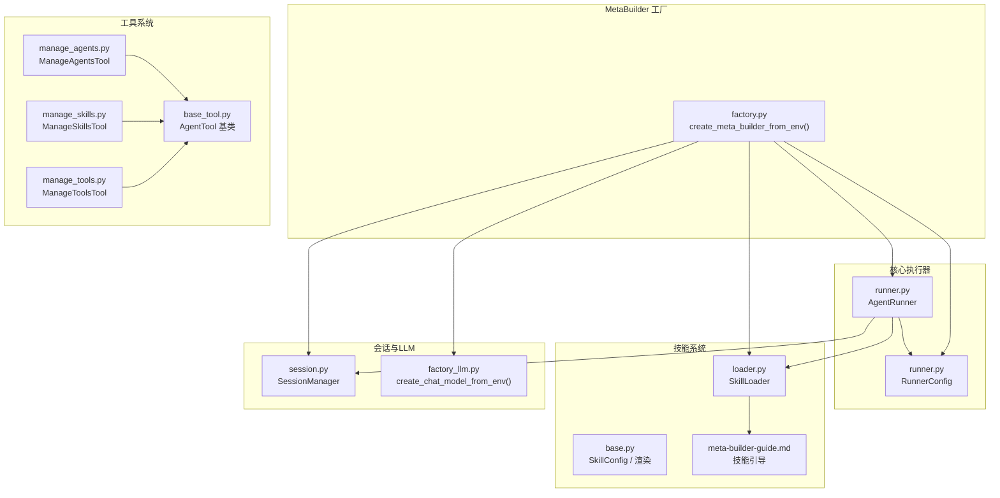
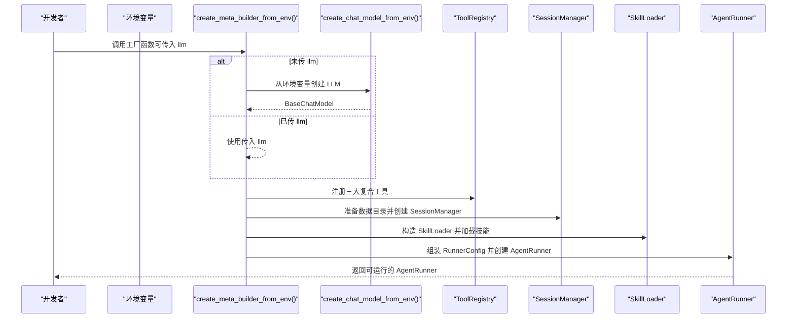
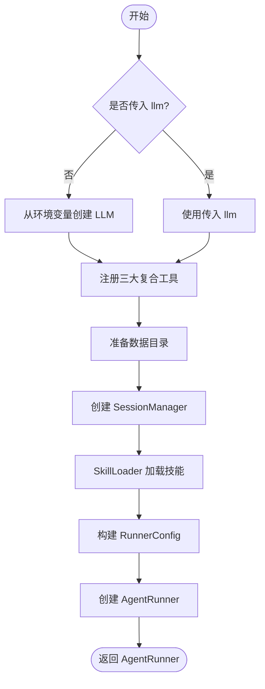
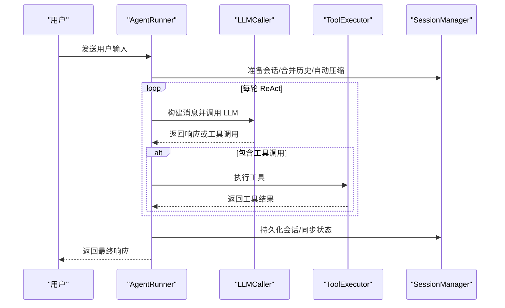
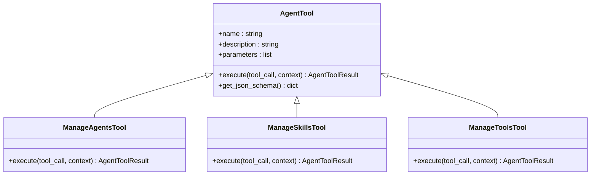
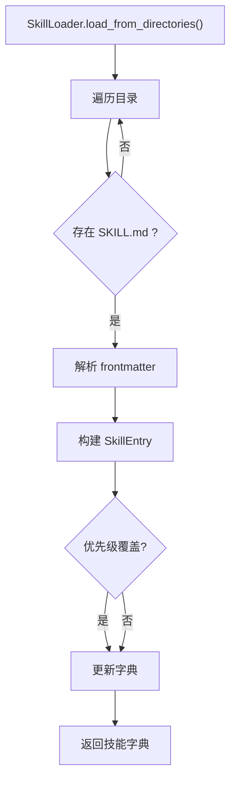
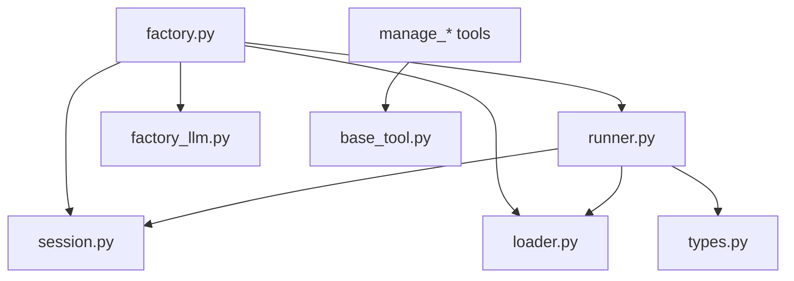

# 新增智能体

<cite>
**本文引用的文件**
- [factory.py](file://src/ark_agentic/agents/meta_builder/factory.py)
- [runner.py](file://src/ark_agentic/core/runner.py)
- [types.py](file://src/ark_agentic/core/types.py)
- [manage_agents.py](file://src/ark_agentic/agents/meta_builder/tools/manage_agents.py)
- [manage_skills.py](file://src/ark_agentic/agents/meta_builder/tools/manage_skills.py)
- [manage_tools.py](file://src/ark_agentic/agents/meta_builder/tools/manage_tools.py)
- [base.py](file://src/ark_agentic/core/skills/base.py)
- [loader.py](file://src/ark_agentic/core/skills/loader.py)
- [base_tool.py](file://src/ark_agentic/core/tools/base.py)
- [session.py](file://src/ark_agentic/core/session.py)
- [factory_llm.py](file://src/ark_agentic/core/llm/factory.py)
- [agent.json](file://src/ark_agentic/agents/meta_builder/agent.json)
- [meta-builder-guide.md](file://src/ark_agentic/agents/meta_builder/skills/meta-builder-guide/SKILL.md)
</cite>

## 目录
1. [简介](#简介)
2. [项目结构](#项目结构)
3. [核心组件](#核心组件)
4. [架构总览](#架构总览)
5. [详细组件分析](#详细组件分析)
6. [依赖关系分析](#依赖关系分析)
7. [性能考量](#性能考量)
8. [故障排查指南](#故障排查指南)
9. [结论](#结论)
10. [附录](#附录)

## 简介
本指南面向希望在 Ark-Agentic 框架中新增智能体（Agent）的开发者，围绕“MetaBuilder 智能体工厂模式”展开，重点解释 create_meta_builder_from_env() 的工作机制，以及如何基于 AgentRunner 配置 RunnerConfig 完成 LLM 初始化、工具注册、会话管理与技能加载。文档同时提供完整的智能体创建示例路径、生命周期管理、参数验证与异常处理最佳实践，并阐述智能体与工具、技能系统的集成方式。

## 项目结构
MetaBuilder 智能体位于 agents/meta_builder 目录，采用“工厂 + 复合工具 + 技能引导”的设计：
- 工厂：通过 create_meta_builder_from_env() 统一装配 AgentRunner
- 工具：ManageAgentsTool / ManageSkillsTool / ManageToolsTool 三大复合工具
- 技能：内置 MetaBuilder 操作指南（SKILL.md）作为动态加载的技能引导
- 会话：SessionManager 负责消息追踪、压缩与持久化
- LLM：通过 create_chat_model_from_env() 从环境变量初始化

**图表来源**
- [factory.py:36-101](file://src/ark_agentic/agents/meta_builder/factory.py#L36-L101)
- [runner.py:193-284](file://src/ark_agentic/core/runner.py#L193-L284)
- [manage_agents.py:108-201](file://src/ark_agentic/agents/meta_builder/tools/manage_agents.py#L108-L201)
- [manage_skills.py:172-291](file://src/ark_agentic/agents/meta_builder/tools/manage_skills.py#L172-L291)
- [manage_tools.py:185-315](file://src/ark_agentic/agents/meta_builder/tools/manage_tools.py#L185-L315)
- [loader.py:25-177](file://src/ark_agentic/core/skills/loader.py#L25-L177)
- [base.py:19-50](file://src/ark_agentic/core/skills/base.py#L19-L50)
- [session.py:24-37](file://src/ark_agentic/core/session.py#L24-L37)
- [factory_llm.py:215-266](file://src/ark_agentic/core/llm/factory.py#L215-L266)

**章节来源**
- [factory.py:36-101](file://src/ark_agentic/agents/meta_builder/factory.py#L36-L101)
- [runner.py:193-284](file://src/ark_agentic/core/runner.py#L193-L284)
- [session.py:24-37](file://src/ark_agentic/core/session.py#L24-L37)
- [factory_llm.py:215-266](file://src/ark_agentic/core/llm/factory.py#L215-L266)

## 核心组件
- 工厂函数 create_meta_builder_from_env()
  - LLM 初始化：若未传入 llm，则从环境变量创建 Chat 模型
  - 工具注册：注册三大复合工具 ManageAgentsTool / ManageSkillsTool / ManageToolsTool
  - 会话管理：准备数据目录并创建 SessionManager，配置压缩策略
  - 技能加载：通过 SkillLoader 从 skills 目录加载 MetaBuilder 操作指南
  - Runner 配置：构造 RunnerConfig，设置采样、轮次、提示词、技能配置
  - 返回 AgentRunner 实例

- AgentRunner
  - 负责 ReAct 执行循环：构建系统提示 → LLM 推理 → 工具调用 → 持久化与统计
  - 支持回调钩子、流式事件、记忆与梦境（Dream）能力
  - 提供 run()/run_ephemeral() 等运行接口

- 类型与配置
  - RunnerConfig：采样、重试、轮次、自动压缩、提示配置、技能配置、子任务与梦境开关
  - SkillConfig：技能目录、Agent ID、加载模式、预算与渲染阈值
  - SessionEntry：会话消息、Token 统计、压缩统计、活跃技能、状态

**章节来源**
- [factory.py:36-101](file://src/ark_agentic/agents/meta_builder/factory.py#L36-L101)
- [runner.py:92-129](file://src/ark_agentic/core/runner.py#L92-L129)
- [types.py:92-129](file://src/ark_agentic/core/types.py#L92-L129)
- [types.py:350-422](file://src/ark_agentic/core/types.py#L350-L422)
- [base.py:19-50](file://src/ark_agentic/core/skills/base.py#L19-L50)

## 架构总览
MetaBuilder 的工厂模式遵循“约定优于配置”：统一入口 create_meta_builder_from_env() 将 LLM、工具、会话、技能与 RunnerConfig 组装为可运行的 AgentRunner。该 Runner 以 ReAct 循环为核心，结合工具与技能系统，实现“思考-行动-观察-反思”的迭代推理。

**图表来源**
- [factory.py:36-101](file://src/ark_agentic/agents/meta_builder/factory.py#L36-L101)
- [factory_llm.py:215-266](file://src/ark_agentic/core/llm/factory.py#L215-L266)

**章节来源**
- [factory.py:36-101](file://src/ark_agentic/agents/meta_builder/factory.py#L36-L101)

## 详细组件分析

### 工厂函数 create_meta_builder_from_env() 设计原理
- LLM 初始化
  - 若 llm 为空，调用 create_chat_model_from_env() 从环境变量 MODEL_NAME、LLM_BASE_URL、API_KEY 等读取配置
  - 支持 PA 模型（PA-JT-80B、PA-SX-80B、PA-SX-235B）与 OpenAI 兼容模型
- 工具注册
  - 使用 ToolRegistry 注册三大复合工具，覆盖 Agent/Skill/Tool 的全量管理能力
  - 复合工具均继承 AgentTool，具备参数校验、JSON Schema 导出与错误处理
- 会话管理
  - 通过 prepare_agent_data_dir("meta_builder") 生成专属数据目录
  - SessionManager 配置 CompactionConfig，启用自动压缩以控制上下文长度
- 技能加载
  - SkillLoader 从 _SKILLS_DIR 目录加载 SKILL.md，解析 frontmatter 并构建 SkillEntry
  - MetaBuilder Guide 作为动态加载的技能引导，指导用户通过工具进行资产创建与管理
- Runner 配置
  - RunnerConfig 设置采样温度、最大轮次、提示词、技能配置等
  - AgentRunner 在构造时即完成工具注册、记忆工具注入、子任务工具注册等

**图表来源**
- [factory.py:36-101](file://src/ark_agentic/agents/meta_builder/factory.py#L36-L101)
- [factory_llm.py:215-266](file://src/ark_agentic/core/llm/factory.py#L215-L266)

**章节来源**
- [factory.py:36-101](file://src/ark_agentic/agents/meta_builder/factory.py#L36-L101)
- [factory_llm.py:215-266](file://src/ark_agentic/core/llm/factory.py#L215-L266)

### AgentRunner 生命周期与执行循环
- 生命周期阶段
  - warmup：注册主动服务 Job（可选）
  - run/run_ephemeral：执行 ReAct 循环，支持流式输出与事件回调
  - finalize：合并外部历史、持久化会话、触发梦境（Dream）后台任务
- 执行循环（ReAct）
  - 模型阶段：构建消息与工具列表，调用 LLM 获取响应或工具调用
  - 工具阶段：执行工具调用，累积状态与结果
  - 完成阶段：触发 before_loop_end 钩子，决定是否重试或结束
- 错误处理
  - LLMError 映射为用户友好提示（认证、配额、限流、超时、内容过滤、服务器错误、网络等）
  - 限制保护：超过最大轮次自动终止并返回兜底响应

**图表来源**
- [runner.py:312-370](file://src/ark_agentic/core/runner.py#L312-L370)
- [runner.py:652-731](file://src/ark_agentic/core/runner.py#L652-L731)

**章节来源**
- [runner.py:289-311](file://src/ark_agentic/core/runner.py#L289-L311)
- [runner.py:312-370](file://src/ark_agentic/core/runner.py#L312-L370)
- [runner.py:652-731](file://src/ark_agentic/core/runner.py#L652-L731)
- [runner.py:592-611](file://src/ark_agentic/core/runner.py#L592-L611)

### 工具系统：三大复合工具
- ManageAgentsTool
  - 支持 list/create/delete 操作，create/delete 需用户确认“我确认变更”
  - 通过 studio/services.agent_service 进行资产增删改查
- ManageSkillsTool
  - 支持 list/read/create/update/delete，create/update/delete 需确认
  - 通过 studio/services.skill_service 与解析器读写 SKILL.md
- ManageToolsTool
  - 支持 list/read/create/update/delete，create/update/delete 需确认
  - create 生成脚手架，update 时写入完整源码，delete 时删除文件

**图表来源**
- [base_tool.py:46-117](file://src/ark_agentic/core/tools/base.py#L46-L117)
- [manage_agents.py:108-201](file://src/ark_agentic/agents/meta_builder/tools/manage_agents.py#L108-L201)
- [manage_skills.py:172-291](file://src/ark_agentic/agents/meta_builder/tools/manage_skills.py#L172-L291)
- [manage_tools.py:185-315](file://src/ark_agentic/agents/meta_builder/tools/manage_tools.py#L185-L315)

**章节来源**
- [manage_agents.py:108-201](file://src/ark_agentic/agents/meta_builder/tools/manage_agents.py#L108-L201)
- [manage_skills.py:172-291](file://src/ark_agentic/agents/meta_builder/tools/manage_skills.py#L172-L291)
- [manage_tools.py:185-315](file://src/ark_agentic/agents/meta_builder/tools/manage_tools.py#L185-L315)
- [base_tool.py:46-117](file://src/ark_agentic/core/tools/base.py#L46-L117)

### 技能系统：加载、筛选与渲染
- SkillLoader
  - 从多个目录加载 SKILL.md，解析 YAML frontmatter，构建 SkillEntry
  - 目录优先级覆盖：后目录相同 ID 的技能会覆盖前目录
- SkillConfig
  - 控制 Agent ID、加载模式（full/dynamic）、预算与渲染阈值
- 渲染与预算
  - 动态模式下先渲染可用技能元数据，再通过 read_skill 按需加载正文
  - full 模式直接注入技能正文，受 max_skills_in_prompt 与 max_skills_prompt_chars 限制

**图表来源**
- [loader.py:35-84](file://src/ark_agentic/core/skills/loader.py#L35-L84)
- [base.py:207-240](file://src/ark_agentic/core/skills/base.py#L207-L240)

**章节来源**
- [loader.py:25-177](file://src/ark_agentic/core/skills/loader.py#L25-L177)
- [base.py:19-50](file://src/ark_agentic/core/skills/base.py#L19-L50)
- [base.py:242-344](file://src/ark_agentic/core/skills/base.py#L242-L344)

### 会话管理与上下文压缩
- SessionManager
  - 负责会话创建、消息追加、磁盘持久化、Token 统计与压缩
  - 支持自动压缩（ContextCompactor），在消息数量或 Token 超限时进行摘要压缩
- 压缩配置
  - CompactionConfig 指定上下文窗口与保留最近消息数量，降低长对话成本

**章节来源**
- [session.py:24-431](file://src/ark_agentic/core/session.py#L24-L431)
- [factory.py:57-62](file://src/ark_agentic/agents/meta_builder/factory.py#L57-L62)

### LLM 初始化与环境变量
- create_chat_model_from_env()
  - 读取 MODEL_NAME、LLM_PROVIDER、API_KEY、LLM_BASE_URL 等环境变量
  - 支持 PA 模型与 OpenAI 兼容模型，自动注入采样参数与调试传输层

**章节来源**
- [factory_llm.py:215-266](file://src/ark_agentic/core/llm/factory.py#L215-L266)

## 依赖关系分析
- 组件耦合
  - 工厂函数集中装配 LLM、工具、会话、技能与 RunnerConfig，降低上层调用复杂度
  - AgentRunner 通过组合模式聚合 LLMCaller、ToolExecutor、SessionManager、SkillLoader 等
- 外部依赖
  - LangChain ChatOpenAI 作为统一 LLM 接口
  - Studio 服务层提供资产增删改查能力
- 潜在风险
  - 工具确认流程（confirmation='我确认变更'）必须严格遵守，否则会返回错误
  - 动态技能加载依赖 SkillLoader 与 SkillConfig，需确保目录与 frontmatter 正确

**图表来源**
- [factory.py:36-101](file://src/ark_agentic/agents/meta_builder/factory.py#L36-L101)
- [runner.py:193-284](file://src/ark_agentic/core/runner.py#L193-L284)
- [loader.py:25-177](file://src/ark_agentic/core/skills/loader.py#L25-L177)
- [session.py:24-37](file://src/ark_agentic/core/session.py#L24-L37)
- [factory_llm.py:215-266](file://src/ark_agentic/core/llm/factory.py#L215-L266)
- [base_tool.py:46-117](file://src/ark_agentic/core/tools/base.py#L46-L117)
- [types.py:92-129](file://src/ark_agentic/core/types.py#L92-L129)

**章节来源**
- [factory.py:36-101](file://src/ark_agentic/agents/meta_builder/factory.py#L36-L101)
- [runner.py:193-284](file://src/ark_agentic/core/runner.py#L193-L284)

## 性能考量
- 上下文压缩
  - 启用 SessionManager 的自动压缩，减少 Token 使用，提升长对话稳定性
- 技能预算
  - 动态模式下通过 max_skills_in_prompt 与 max_skills_prompt_chars 控制注入规模
- 采样与轮次
  - RunnerConfig 的 temperature、max_turns 与 max_tool_calls_per_turn 影响推理质量与成本
- 流式输出
  - run() 支持流式事件回调，前端可渐进式渲染，改善用户体验

[本节为通用指导，无需特定文件引用]

## 故障排查指南
- LLM 认证失败
  - 现象：提示“模型认证失败，请检查 API 配置”
  - 排查：确认 API_KEY、MODEL_NAME、LLM_BASE_URL 等环境变量
- 请求超时或限流
  - 现象：提示“请求超时/稍后再试”
  - 排查：检查网络与服务端限流策略，必要时降低并发或增加重试
- 内容过滤
  - 现象：提示“输入包含不适当内容”
  - 排查：调整输入或联系管理员
- 技能加载失败
  - 现象：日志警告“skill load failed”
  - 排查：检查 SKILL.md frontmatter 与目录权限
- 工具确认未通过
  - 现象：工具返回“必须先让用户回复‘我确认变更’”
  - 排查：确保用户先回复确认语句，再传入 confirmation 参数

**章节来源**
- [runner.py:592-611](file://src/ark_agentic/core/runner.py#L592-L611)
- [factory.py:72-77](file://src/ark_agentic/agents/meta_builder/factory.py#L72-L77)

## 结论
通过工厂函数 create_meta_builder_from_env()，MetaBuilder 智能体实现了 LLM、工具、会话与技能的标准化装配。基于 AgentRunner 的 ReAct 执行循环与完善的错误映射，开发者可以快速扩展新的智能体。遵循“先说明、再确认、再执行”的工具操作流程与动态技能加载策略，可确保智能体在生产环境中稳定、安全地演进。

[本节为总结，无需特定文件引用]

## 附录

### 新增智能体的完整创建示例（步骤路径）
- 步骤 1：准备 Agent 数据目录
  - 参考：[factory.py:57-57](file://src/ark_agentic/agents/meta_builder/factory.py#L57-L57)
- 步骤 2：创建 LLM 实例（从环境变量）
  - 参考：[factory_llm.py:215-266](file://src/ark_agentic/core/llm/factory.py#L215-L266)
- 步骤 3：注册三大复合工具
  - 参考：[manage_agents.py:52-55](file://src/ark_agentic/agents/meta_builder/tools/manage_agents.py#L52-L55)
  - 参考：[manage_skills.py:50-53](file://src/ark_agentic/agents/meta_builder/tools/manage_skills.py#L50-L53)
  - 参考：[manage_tools.py:65-67](file://src/ark_agentic/agents/meta_builder/tools/manage_tools.py#L65-L67)
- 步骤 4：创建 SessionManager 并配置压缩
  - 参考：[factory.py:59-62](file://src/ark_agentic/agents/meta_builder/factory.py#L59-L62)
  - 参考：[session.py:24-37](file://src/ark_agentic/core/session.py#L24-L37)
- 步骤 5：加载技能（MetaBuilder Guide）
  - 参考：[loader.py:35-84](file://src/ark_agentic/core/skills/loader.py#L35-L84)
  - 参考：[meta-builder-guide.md:1-56](file://src/ark_agentic/agents/meta_builder/skills/meta-builder-guide/SKILL.md#L1-L56)
- 步骤 6：构建 RunnerConfig 并创建 AgentRunner
  - 参考：[factory.py:78-101](file://src/ark_agentic/agents/meta_builder/factory.py#L78-L101)
  - 参考：[runner.py:92-129](file://src/ark_agentic/core/runner.py#L92-L129)
- 步骤 7：运行智能体
  - 参考：[runner.py:312-370](file://src/ark_agentic/core/runner.py#L312-L370)

**章节来源**
- [factory.py:36-101](file://src/ark_agentic/agents/meta_builder/factory.py#L36-L101)
- [factory_llm.py:215-266](file://src/ark_agentic/core/llm/factory.py#L215-L266)
- [manage_agents.py:52-55](file://src/ark_agentic/agents/meta_builder/tools/manage_agents.py#L52-L55)
- [manage_skills.py:50-53](file://src/ark_agentic/agents/meta_builder/tools/manage_skills.py#L50-L53)
- [manage_tools.py:65-67](file://src/ark_agentic/agents/meta_builder/tools/manage_tools.py#L65-L67)
- [session.py:24-37](file://src/ark_agentic/core/session.py#L24-L37)
- [loader.py:35-84](file://src/ark_agentic/core/skills/loader.py#L35-L84)
- [meta-builder-guide.md:1-56](file://src/ark_agentic/agents/meta_builder/skills/meta-builder-guide/SKILL.md#L1-L56)
- [runner.py:92-129](file://src/ark_agentic/core/runner.py#L92-L129)
- [runner.py:312-370](file://src/ark_agentic/core/runner.py#L312-L370)

### 智能体与工具、技能系统的集成要点
- 工具集成
  - 所有工具继承 AgentTool，统一参数校验与 JSON Schema 导出
  - 复合工具通过 studio/services.* 与文件系统交互，确保幂等与安全
- 技能集成
  - 动态加载模式下，先渲染元数据，再按需 read_skill，避免提示词冗余
  - full 模式一次性注入技能正文，适合小规模技能集
- 会话与记忆
  - SessionManager 负责消息持久化与 Token 统计，配合自动压缩保障性能
  - 可选的记忆与梦境（Dream）能力在 Runner 中按配置启用

**章节来源**
- [base_tool.py:46-117](file://src/ark_agentic/core/tools/base.py#L46-L117)
- [base.py:242-344](file://src/ark_agentic/core/skills/base.py#L242-L344)
- [session.py:24-431](file://src/ark_agentic/core/session.py#L24-L431)
- [runner.py:244-284](file://src/ark_agentic/core/runner.py#L244-L284)