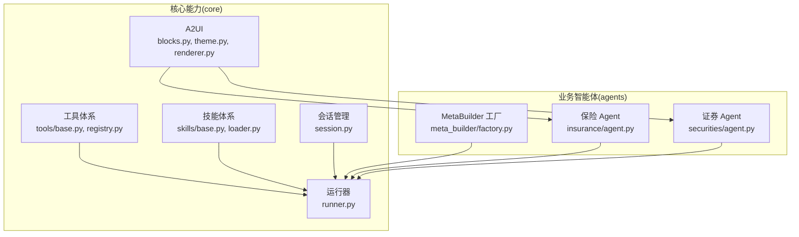
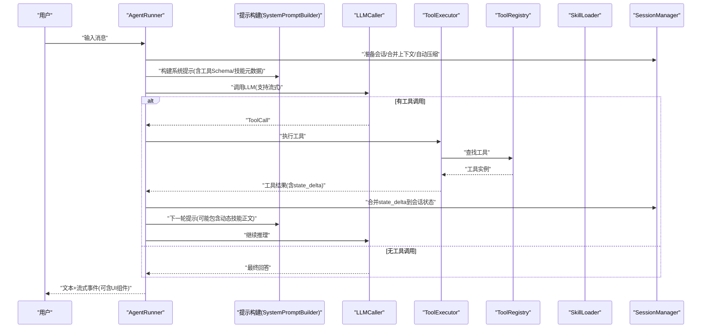
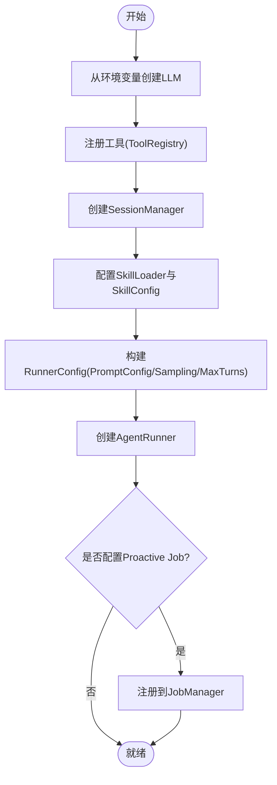
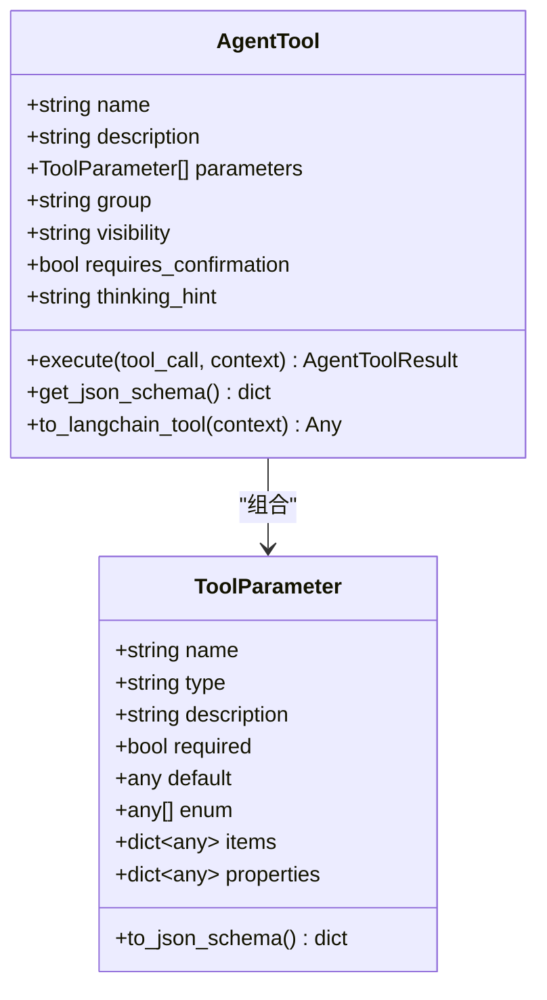
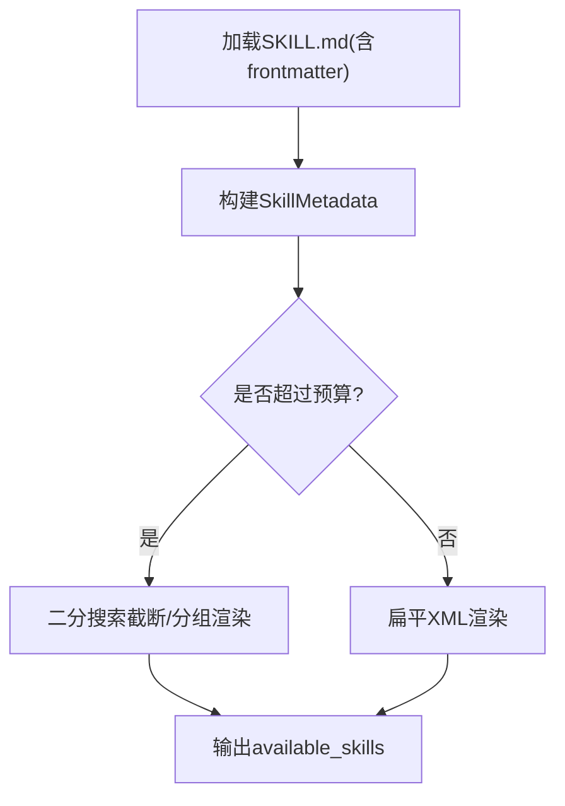
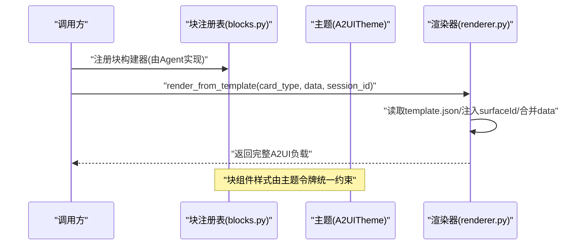
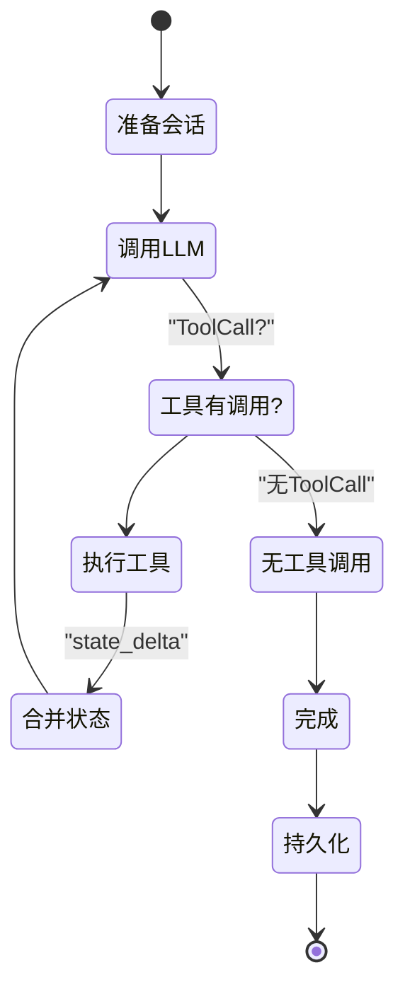
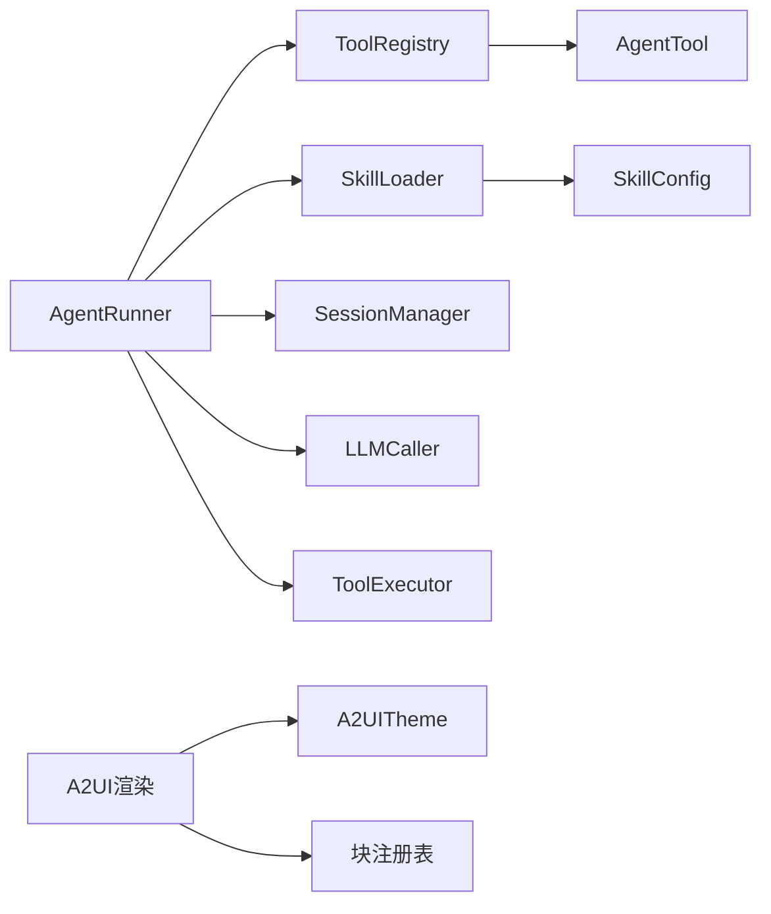

# 自定义开发

<cite>
**本文引用的文件**
- [src/ark_agentic/core/tools/base.py](file://src/ark_agentic/core/tools/base.py)
- [src/ark_agentic/core/tools/registry.py](file://src/ark_agentic/core/tools/registry.py)
- [src/ark_agentic/core/skills/base.py](file://src/ark_agentic/core/skills/base.py)
- [src/ark_agentic/core/skills/loader.py](file://src/ark_agentic/core/skills/loader.py)
- [src/ark_agentic/core/session.py](file://src/ark_agentic/core/session.py)
- [src/ark_agentic/core/runner.py](file://src/ark_agentic/core/runner.py)
- [src/ark_agentic/core/a2ui/blocks.py](file://src/ark_agentic/core/a2ui/blocks.py)
- [src/ark_agentic/core/a2ui/theme.py](file://src/ark_agentic/core/a2ui/theme.py)
- [src/ark_agentic/core/a2ui/renderer.py](file://src/ark_agentic/core/a2ui/renderer.py)
- [src/ark_agentic/agents/meta_builder/factory.py](file://src/ark_agentic/agents/meta_builder/factory.py)
- [src/ark_agentic/agents/insurance/agent.py](file://src/ark_agentic/agents/insurance/agent.py)
- [src/ark_agentic/agents/securities/agent.py](file://src/ark_agentic/agents/securities/agent.py)
- [src/ark_agentic/agents/insurance/tools/customer_info.py](file://src/ark_agentic/agents/insurance/tools/customer_info.py)
</cite>

## 目录
1. [简介](#简介)
2. [项目结构](#项目结构)
3. [核心组件](#核心组件)
4. [架构总览](#架构总览)
5. [详细组件分析](#详细组件分析)
6. [依赖分析](#依赖分析)
7. [性能考虑](#性能考虑)
8. [故障排查指南](#故障排查指南)
9. [结论](#结论)
10. [附录](#附录)

## 简介
本指南面向希望在 Ark-Agentic 平台上“自定义开发”的工程师与产品同学，围绕以下目标提供系统化、可落地的实操指引：
- 新增智能体：理解智能体工厂模式、代理配置与生命周期管理
- 工具开发：掌握工具基类继承、参数校验与异常处理规范
- 技能编写：掌握技能加载机制、匹配算法与动态配置
- A2UI 卡片设计：掌握块组件系统、主题定制与渲染流程
- 包含完整代码示例路径与最佳实践建议

## 项目结构
Ark-Agentic 采用“核心能力 + 业务智能体”的分层组织方式：
- 核心能力层（core）：工具、技能、会话、运行器、A2UI 渲染与主题、提示词构建等
- 业务智能体层（agents）：保险、证券等具体 Agent，各自封装工具、技能与 UI 模板
- Studio 前端与 API（studio 与 api）：可视化管理 Agent、Skill、Tool 的界面与接口
- 文档与样例（docs）：A2UI 设计规范、架构说明、示例 UI Schema

图表来源
- [src/ark_agentic/core/runner.py](file://src/ark_agentic/core/runner.py)
- [src/ark_agentic/core/tools/registry.py](file://src/ark_agentic/core/tools/registry.py)
- [src/ark_agentic/core/skills/loader.py](file://src/ark_agentic/core/skills/loader.py)
- [src/ark_agentic/core/a2ui/blocks.py](file://src/ark_agentic/core/a2ui/blocks.py)
- [src/ark_agentic/agents/meta_builder/factory.py](file://src/ark_agentic/agents/meta_builder/factory.py)
- [src/ark_agentic/agents/insurance/agent.py](file://src/ark_agentic/agents/insurance/agent.py)
- [src/ark_agentic/agents/securities/agent.py](file://src/ark_agentic/agents/securities/agent.py)

章节来源
- [src/ark_agentic/core/runner.py](file://src/ark_agentic/core/runner.py)
- [src/ark_agentic/core/tools/registry.py](file://src/ark_agentic/core/tools/registry.py)
- [src/ark_agentic/core/skills/loader.py](file://src/ark_agentic/core/skills/loader.py)
- [src/ark_agentic/core/a2ui/blocks.py](file://src/ark_agentic/core/a2ui/blocks.py)
- [src/ark_agentic/agents/meta_builder/factory.py](file://src/ark_agentic/agents/meta_builder/factory.py)
- [src/ark_agentic/agents/insurance/agent.py](file://src/ark_agentic/agents/insurance/agent.py)
- [src/ark_agentic/agents/securities/agent.py](file://src/ark_agentic/agents/securities/agent.py)

## 核心组件
- 工具体系：统一的工具抽象、参数读取辅助函数、注册与过滤、LangChain 适配
- 技能体系：技能配置、资格检查、匹配策略、元数据预算与渲染
- 会话管理：消息生命周期、上下文压缩、持久化与状态管理
- 运行器：ReAct 执行循环、回调钩子、错误友好化、流式事件派发
- A2UI：块组件注册与绑定、主题令牌、模板渲染

章节来源
- [src/ark_agentic/core/tools/base.py](file://src/ark_agentic/core/tools/base.py)
- [src/ark_agentic/core/tools/registry.py](file://src/ark_agentic/core/tools/registry.py)
- [src/ark_agentic/core/skills/base.py](file://src/ark_agentic/core/skills/base.py)
- [src/ark_agentic/core/skills/loader.py](file://src/ark_agentic/core/skills/loader.py)
- [src/ark_agentic/core/session.py](file://src/ark_agentic/core/session.py)
- [src/ark_agentic/core/runner.py](file://src/ark_agentic/core/runner.py)
- [src/ark_agentic/core/a2ui/blocks.py](file://src/ark_agentic/core/a2ui/blocks.py)
- [src/ark_agentic/core/a2ui/theme.py](file://src/ark_agentic/core/a2ui/theme.py)
- [src/ark_agentic/core/a2ui/renderer.py](file://src/ark_agentic/core/a2ui/renderer.py)

## 架构总览
下图展示了从“用户输入”到“工具执行与 UI 渲染”的端到端流程，以及核心模块之间的交互关系。

图表来源
- [src/ark_agentic/core/runner.py](file://src/ark_agentic/core/runner.py)
- [src/ark_agentic/core/tools/registry.py](file://src/ark_agentic/core/tools/registry.py)
- [src/ark_agentic/core/skills/loader.py](file://src/ark_agentic/core/skills/loader.py)
- [src/ark_agentic/core/session.py](file://src/ark_agentic/core/session.py)

## 详细组件分析

### 智能体工厂模式与生命周期
- 工厂函数：MetaBuilder 提供 create_meta_builder_from_env，统一创建 AgentRunner，注册工具、会话、技能与采样配置
- 业务 Agent：保险与证券 Agent 提供 create_*_agent，分别装配工具、会话、技能、记忆与主动服务 Job
- 生命周期要点：
  - 初始化：LLM、工具注册、会话管理、技能加载、Runner 配置
  - 运行期：ReAct 循环、回调钩子、流式事件、上下文压缩
  - 结束：持久化会话状态、触发 Dream 后台蒸馏

图表来源
- [src/ark_agentic/agents/meta_builder/factory.py](file://src/ark_agentic/agents/meta_builder/factory.py)
- [src/ark_agentic/agents/insurance/agent.py](file://src/ark_agentic/agents/insurance/agent.py)
- [src/ark_agentic/agents/securities/agent.py](file://src/ark_agentic/agents/securities/agent.py)
- [src/ark_agentic/core/runner.py](file://src/ark_agentic/core/runner.py)

章节来源
- [src/ark_agentic/agents/meta_builder/factory.py](file://src/ark_agentic/agents/meta_builder/factory.py)
- [src/ark_agentic/agents/insurance/agent.py](file://src/ark_agentic/agents/insurance/agent.py)
- [src/ark_agentic/agents/securities/agent.py](file://src/ark_agentic/agents/securities/agent.py)
- [src/ark_agentic/core/runner.py](file://src/ark_agentic/core/runner.py)

### 工具开发规范
- 继承与契约
  - 继承 AgentTool，至少定义 name、description，并实现 execute
  - 可选：group、visibility、requires_confirmation、thinking_hint
- 参数定义与校验
  - 使用 ToolParameter 列举参数，支持枚举、数组、对象等复杂类型
  - 使用 read_*_param/_required 辅助函数进行类型安全读取与必填校验
- 异常处理
  - 工具内部捕获业务异常，返回 AgentToolResult.error_result
  - 可在 metadata 中携带 state_delta，驱动下游自动填充
- 与 LangChain 适配
  - 可通过 to_langchain_tool 将工具包装为 StructuredTool，便于生态集成

图表来源
- [src/ark_agentic/core/tools/base.py](file://src/ark_agentic/core/tools/base.py)

章节来源
- [src/ark_agentic/core/tools/base.py](file://src/ark_agentic/core/tools/base.py)
- [src/ark_agentic/core/tools/registry.py](file://src/ark_agentic/core/tools/registry.py)

### 技能编写指南
- 技能目录与加载
  - 使用 SkillLoader 从多目录加载 SKILL.md，支持 YAML frontmatter 解析与优先级覆盖
  - 通过 SkillConfig 控制 agent_id、调用策略、动态/全量加载模式、预算上限
- 资格检查与匹配
  - check_skill_eligibility：基于 OS、二进制、环境变量、可用工具进行资格判定
  - should_include_skill：根据 invocation_policy（always/manual/auto）决定是否纳入
- 动态配置与渲染
  - dynamic 模式：先渲染 available_skills 元数据，再通过 read_skill 按需加载正文
  - full 模式：一次性注入全部技能正文
  - 支持分组渲染与预算截断，避免提示过长

图表来源
- [src/ark_agentic/core/skills/loader.py](file://src/ark_agentic/core/skills/loader.py)
- [src/ark_agentic/core/skills/base.py](file://src/ark_agentic/core/skills/base.py)

章节来源
- [src/ark_agentic/core/skills/loader.py](file://src/ark_agentic/core/skills/loader.py)
- [src/ark_agentic/core/skills/base.py](file://src/ark_agentic/core/skills/base.py)

### A2UI 卡片设计
- 块组件系统
  - 通过注册表注册各 Agent 的块构建器，统一在 core 层维护空注册表
  - 提供 resolve_binding、_comp、_text 等辅助，支持 $path 绑定与字面量
- 主题定制
  - A2UITheme 定义视觉令牌（颜色、圆角、间距等），模块级常量为向后兼容的别名
- 渲染流程
  - render_from_template 从模板目录读取 template.json，注入 surfaceId，合并 data，返回完整负载
  - 块组件与主题共同决定最终 UI 呈现

图表来源
- [src/ark_agentic/core/a2ui/blocks.py](file://src/ark_agentic/core/a2ui/blocks.py)
- [src/ark_agentic/core/a2ui/theme.py](file://src/ark_agentic/core/a2ui/theme.py)
- [src/ark_agentic/core/a2ui/renderer.py](file://src/ark_agentic/core/a2ui/renderer.py)

章节来源
- [src/ark_agentic/core/a2ui/blocks.py](file://src/ark_agentic/core/a2ui/blocks.py)
- [src/ark_agentic/core/a2ui/theme.py](file://src/ark_agentic/core/a2ui/theme.py)
- [src/ark_agentic/core/a2ui/renderer.py](file://src/ark_agentic/core/a2ui/renderer.py)

### 会话与运行器（生命周期）
- 会话管理
  - 生命周期：创建、加载、注入外部历史、消息增删、自动压缩、持久化
  - 状态：支持 state_delta 合并，供工具回写下游自动填充
- 运行器
  - ReAct 循环：构建提示 → LLM → 工具执行 → 继续循环 → 完成
  - 回调钩子：before_agent/after_agent/before_model/after_model/on_model_error/before_tool/after_tool/before_loop_end
  - 流式事件：内容增量、思考增量、UI 组件事件

图表来源
- [src/ark_agentic/core/session.py](file://src/ark_agentic/core/session.py)
- [src/ark_agentic/core/runner.py](file://src/ark_agentic/core/runner.py)

章节来源
- [src/ark_agentic/core/session.py](file://src/ark_agentic/core/session.py)
- [src/ark_agentic/core/runner.py](file://src/ark_agentic/core/runner.py)

## 依赖分析
- 组件耦合
  - AgentRunner 依赖 ToolRegistry、SkillLoader、SessionManager、LLMCaller、ToolExecutor
  - ToolRegistry 依赖 AgentTool 抽象，提供工具发现与过滤
  - SkillLoader 依赖 SkillConfig，负责技能元数据与正文解析
  - A2UI 渲染依赖模板与主题，块注册表由各 Agent 注册
- 外部依赖
  - LangChain（可选）：通过 to_langchain_tool 适配
  - 文件系统：技能与会话持久化

图表来源
- [src/ark_agentic/core/runner.py](file://src/ark_agentic/core/runner.py)
- [src/ark_agentic/core/tools/registry.py](file://src/ark_agentic/core/tools/registry.py)
- [src/ark_agentic/core/skills/loader.py](file://src/ark_agentic/core/skills/loader.py)
- [src/ark_agentic/core/a2ui/theme.py](file://src/ark_agentic/core/a2ui/theme.py)
- [src/ark_agentic/core/a2ui/blocks.py](file://src/ark_agentic/core/a2ui/blocks.py)

章节来源
- [src/ark_agentic/core/runner.py](file://src/ark_agentic/core/runner.py)
- [src/ark_agentic/core/tools/registry.py](file://src/ark_agentic/core/tools/registry.py)
- [src/ark_agentic/core/skills/loader.py](file://src/ark_agentic/core/skills/loader.py)
- [src/ark_agentic/core/a2ui/theme.py](file://src/ark_agentic/core/a2ui/theme.py)
- [src/ark_agentic/core/a2ui/blocks.py](file://src/ark_agentic/core/a2ui/blocks.py)

## 性能考虑
- 上下文压缩：SessionManager 在必要时自动压缩历史消息，降低 token 使用
- 技能预算：按条数与字符数预算截断，动态模式下优先元数据，减少提示长度
- 工具并发：ToolExecutor 限制单轮工具调用次数与超时，避免阻塞
- 流式输出：Runner 支持流式事件，前端可渐进式渲染，提升感知性能

## 故障排查指南
- LLM 错误友好化：根据错误原因映射为用户可理解的提示
- 回调钩子：before_model/after_model/on_model_error 等钩子可用于诊断与干预
- 日志与追踪：Runner 注入追踪回调，结合 run_metadata 关联 trace_id
- 工具异常：工具抛出业务异常时返回 error_result，避免中断流程

章节来源
- [src/ark_agentic/core/runner.py](file://src/ark_agentic/core/runner.py)

## 结论
通过统一的工具与技能抽象、灵活的会话与运行器、可插拔的 A2UI 渲染体系，Ark-Agentic 为“自定义开发”提供了清晰的扩展点。按照本文的流程与规范，即可快速新增智能体、工具与技能，并以一致的主题与 UI 体验交付给用户。

## 附录
- 新增工具示例路径
  - 工具基类与参数读取：[src/ark_agentic/core/tools/base.py](file://src/ark_agentic/core/tools/base.py)
  - 工具注册与过滤：[src/ark_agentic/core/tools/registry.py](file://src/ark_agentic/core/tools/registry.py)
  - 示例：保险客户信息工具实现 [src/ark_agentic/agents/insurance/tools/customer_info.py](file://src/ark_agentic/agents/insurance/tools/customer_info.py)
- 新增技能示例路径
  - 技能加载与 frontmatter 解析：[src/ark_agentic/core/skills/loader.py](file://src/ark_agentic/core/skills/loader.py)
  - 技能配置与匹配策略：[src/ark_agentic/core/skills/base.py](file://src/ark_agentic/core/skills/base.py)
- 新增智能体示例路径
  - MetaBuilder 工厂：[src/ark_agentic/agents/meta_builder/factory.py](file://src/ark_agentic/agents/meta_builder/factory.py)
  - 保险 Agent：[src/ark_agentic/agents/insurance/agent.py](file://src/ark_agentic/agents/insurance/agent.py)
  - 证券 Agent：[src/ark_agentic/agents/securities/agent.py](file://src/ark_agentic/agents/securities/agent.py)
- A2UI 卡片示例路径
  - 块注册与绑定：[src/ark_agentic/core/a2ui/blocks.py](file://src/ark_agentic/core/a2ui/blocks.py)
  - 主题令牌：[src/ark_agentic/core/a2ui/theme.py](file://src/ark_agentic/core/a2ui/theme.py)
  - 模板渲染：[src/ark_agentic/core/a2ui/renderer.py](file://src/ark_agentic/core/a2ui/renderer.py)