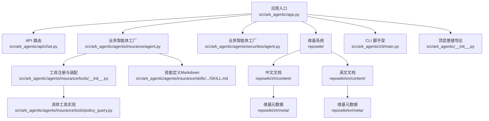
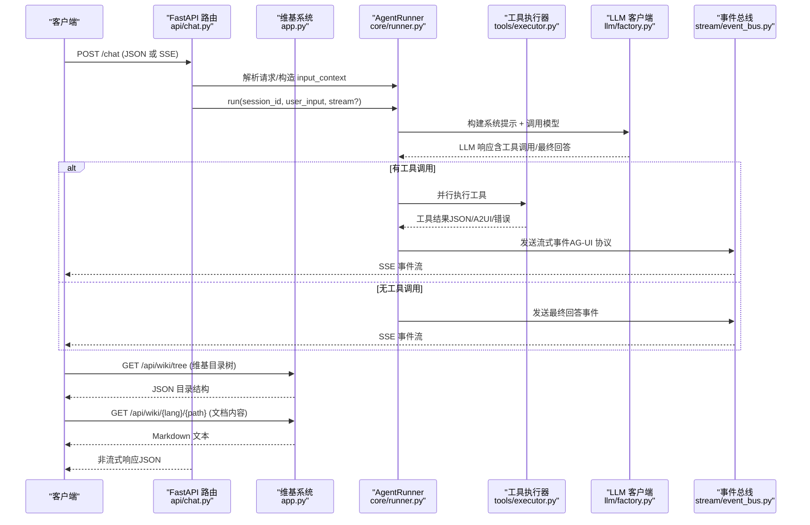
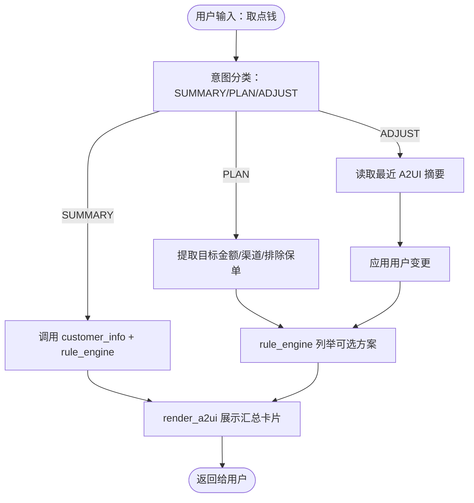
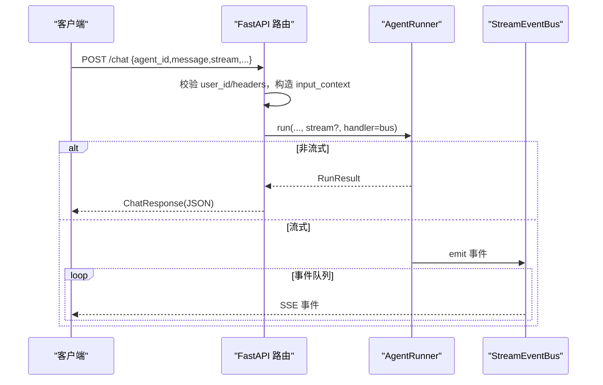
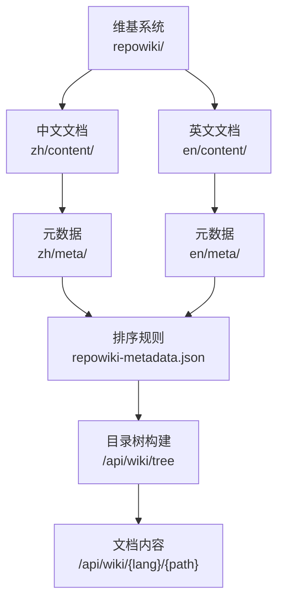
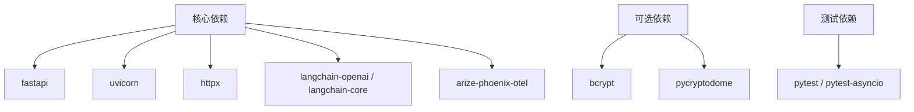

# 快速开始

<cite>
**本文档引用的文件**
- [README.md](file://README.md)
- [pyproject.toml](file://pyproject.toml)
- [Dockerfile](file://Dockerfile)
- [.env-sample](file://.env-sample)
- [src/ark_agentic/app.py](file://src/ark_agentic/app.py)
- [src/ark_agentic/__init__.py](file://src/ark_agentic/__init__.py)
- [src/ark_agentic/agents/insurance/agent.py](file://src/ark_agentic/agents/insurance/agent.py)
- [src/ark_agentic/agents/insurance/tools/__init__.py](file://src/ark_agentic/agents/insurance/tools/__init__.py)
- [src/ark_agentic/agents/insurance/tools/policy_query.py](file://src/ark_agentic/agents/insurance/tools/policy_query.py)
- [src/ark_agentic/agents/insurance/skills/withdraw_money/SKILL.md](file://src/ark_agentic/agents/insurance/skills/withdraw_money/SKILL.md)
- [src/ark_agentic/api/chat.py](file://src/ark_agentic/api/chat.py)
- [src/ark_agentic/api/models.py](file://src/ark_agentic/api/models.py)
- [src/ark_agentic/cli/main.py](file://src/ark_agentic/cli/main.py)
- [src/ark_agentic/static/home.html](file://src/ark_agentic/static/home.html)
- [postman/ark-agentic-api.postman_collection.json](file://postman/ark-agentic-api.postman_collection.json)
</cite>

## 更新摘要
**所做更改**
- 新增维基系统章节，介绍完整的中文和英文文档体系
- 更新项目结构图，包含repowiki目录结构
- 新增维基系统API端点说明
- 更新文档导航系统，包含Wiki标签页
- 新增维基元数据管理和目录树排序功能

## 目录
1. [简介](#简介)
2. [项目结构](#项目结构)
3. [核心组件](#核心组件)
4. [架构总览](#架构总览)
5. [详细组件解析](#详细组件解析)
6. [维基系统](#维基系统)
7. [依赖分析](#依赖分析)
8. [性能考虑](#性能考虑)
9. [故障排查指南](#故障排查指南)
10. [结论](#结论)
11. [附录](#附录)

## 简介
Ark-Agentic 是一个轻量级 ReAct 智能体框架，支持工具调用、技能系统、会话管理、流式输出与用户记忆。它提供统一的 FastAPI 服务端点，支持多协议的 SSE 流式输出，并内置保险与证券两类业务智能体示例，便于快速落地。

- 核心能力概览
  - ReAct 推理-行动循环，支持并行工具调用
  - 多 LLM 支持（OpenAI 兼容、PA-SX、PA-JT）
  - 技能系统（Markdown 格式，支持 full/dynamic/semantic 加载）
  - 会话管理（JSONL 持久化 + LLM 摘要压缩 + Session State）
  - 用户记忆（文件级 MEMORY.md + heading-based upsert + Dream 蒸馏）
  - AG-UI 流式协议（20 种事件类型，4 种输出协议）
  - A2UI 组件（卡片、按钮、表单等富交互渲染）
  - 输出验证（数值一致性检测，防幻觉）
  - FastAPI 服务（生产就绪，SSE 流式）
  - **新增** 完整维基系统（repowiki），支持中英文双语文档

**章节来源**
- [README.md: 1-16:1-16](file://README.md#L1-L16)

## 项目结构
仓库采用"核心框架 + 业务智能体 + API 服务 + CLI 脚手架 + 维基系统"的组织方式，便于二次开发与扩展。

**图表来源**
- [src/ark_agentic/app.py: 172-173:172-173](file://src/ark_agentic/app.py#L172-L173)
- [src/ark_agentic/api/chat.py: 19-20:19-20](file://src/ark_agentic/api/chat.py#L19-L20)
- [src/ark_agentic/agents/insurance/agent.py: 47-143:47-143](file://src/ark_agentic/agents/insurance/agent.py#L47-L143)
- [src/ark_agentic/agents/insurance/tools/__init__.py: 73-97:73-97](file://src/ark_agentic/agents/insurance/tools/__init__.py#L73-L97)
- [src/ark_agentic/agents/insurance/tools/policy_query.py: 25-77:25-77](file://src/ark_agentic/agents/insurance/tools/policy_query.py#L25-L77)
- [src/ark_agentic/cli/main.py: 84-154:84-154](file://src/ark_agentic/cli/main.py#L84-L154)
- [src/ark_agentic/__init__.py: 33-49:33-49](file://src/ark_agentic/__init__.py#L33-L49)

**章节来源**
- [README.md: 596-701:596-701](file://README.md#L596-L701)

## 核心组件
- AgentRunner：ReAct 执行器，负责系统提示构建、LLM 调用、工具执行与流式事件推送
- SessionManager：会话管理，支持 JSONL 持久化、上下文压缩与 Session State
- ToolRegistry/AgentTool：工具注册与基类，支持 JSON Schema 描述与 LangChain 适配
- SkillLoader：技能加载器，支持多种加载模式（full/dynamic/semantic）
- MemoryManager：用户记忆系统，文件级存储，支持 flush/dream/upsert
- StreamEventBus/Formatter：AG-UI 流式协议，支持 internal/agui/enterprise/alone 四种协议
- FastAPI 路由：统一 /chat 端点，支持 SSE 与非流式响应
- CLI：项目脚手架，支持 init/add-agent/version
- **新增** WikiManager：维基系统管理器，支持中英文双语文档树构建与内容加载

**章节来源**
- [src/ark_agentic/core/runner.py: 193-200:193-200](file://src/ark_agentic/core/runner.py#L193-L200)
- [src/ark_agentic/api/chat.py: 27-177:27-177](file://src/ark_agentic/api/chat.py#L27-L177)
- [src/ark_agentic/cli/main.py: 212-256:212-256](file://src/ark_agentic/cli/main.py#L212-L256)

## 架构总览
下面的架构图展示了从客户端请求到智能体执行、工具调用与流式输出的关键路径，以及新增的维基系统集成。

**图表来源**
- [src/ark_agentic/api/chat.py: 27-177:27-177](file://src/ark_agentic/api/chat.py#L27-L177)
- [src/ark_agentic/core/runner.py: 193-200:193-200](file://src/ark_agentic/core/runner.py#L193-L200)
- [src/ark_agentic/app.py: 198-261:198-261](file://src/ark_agentic/app.py#L198-L261)

## 详细组件解析

### 1) 安装与环境准备
- 使用 uv 管理依赖与虚拟环境
- 可选依赖
  - [ark-agentic[pa-jt]]：启用 PA-JT 系列模型（RSA 签名）
  - [ark-agentic[dev]]：开发工具链（pytest 等）
  - [ark-agentic[all]]：包含 pa-jt 与 dev
- 顶层便捷导入，便于快速上手

**章节来源**
- [README.md: 17-37:17-37](file://README.md#L17-L37)
- [pyproject.toml: 26-43:26-43](file://pyproject.toml#L26-L43)
- [src/ark_agentic/__init__.py: 7-29:7-29](file://src/ark_agentic/__init__.py#L7-L29)

### 2) 环境变量配置
- 核心配置
  - LLM_PROVIDER、MODEL_NAME、API_KEY、LLM_BASE_URL、DEFAULT_TEMPERATURE、API_HOST、API_PORT
- 存储配置
  - SESSIONS_DIR、MEMORY_DIR
- 功能开关
  - ENABLE_STUDIO、LOG_LEVEL、EMBEDDING_MODEL_PATH、AGENTS_ROOT
- 保险/证券服务配置
  - DATA_SERVICE_*、SECURITIES_* 等
- Phoenix 可观测性
  - ENABLE_PHOENIX、PHOENIX_COLLECTOR_ENDPOINT、PHOENIX_PROJECT_NAME 等

**章节来源**
- [README.md: 703-755:703-755](file://README.md#L703-L755)
- [.env-sample: 1-75:1-75](file://.env-sample#L1-L75)

### 3) 第一个智能体：保险取款示例
- 创建保险智能体
  - 通过工厂函数创建 AgentRunner，注册工具与技能，启用记忆与 Dream
- 工具与技能
  - 保单查询工具：调用数据服务 API，返回 JSON 结果并写入 Session State
  - 取款技能：Markdown 驱动的三步流水线（意图分类 → 参数提取 → 渲染），强制使用 A2UI 组件展示数据
- 会话与记忆
  - SessionManager 负责会话创建、历史压缩与持久化
  - MemoryManager 负责 MEMORY.md 的 upsert、flush 与 dream 蒸馏

**图表来源**
- [src/ark_agentic/agents/insurance/skills/withdraw_money/SKILL.md: 27-194:27-194](file://src/ark_agentic/agents/insurance/skills/withdraw_money/SKILL.md#L27-L194)
- [src/ark_agentic/agents/insurance/tools/policy_query.py: 55-77:55-77](file://src/ark_agentic/agents/insurance/tools/policy_query.py#L55-L77)

**章节来源**
- [src/ark_agentic/agents/insurance/agent.py: 47-143:47-143](file://src/ark_agentic/agents/insurance/agent.py#L47-L143)
- [src/ark_agentic/agents/insurance/tools/__init__.py: 73-97:73-97](file://src/ark_agentic/agents/insurance/tools/__init__.py#L73-L97)
- [src/ark_agentic/agents/insurance/tools/policy_query.py: 25-77:25-77](file://src/ark_agentic/agents/insurance/tools/policy_query.py#L25-L77)
- [src/ark_agentic/agents/insurance/skills/withdraw_money/SKILL.md: 1-206:1-206](file://src/ark_agentic/agents/insurance/skills/withdraw_money/SKILL.md#L1-L206)

### 4) API 服务与端点
- 端点：POST /chat
  - 支持非流式与 SSE 流式两种模式
  - 协议：internal/agui/enterprise/alone
  - 支持自定义 Headers（x-ark-*）
- 请求模型：ChatRequest
  - 包含 agent_id、message、session_id、stream、protocol、user_id、context、idempotency_key、history、use_history 等
- 响应模型：ChatResponse
  - 返回 session_id、message_id、response、tool_calls、turns、usage

**图表来源**
- [src/ark_agentic/api/chat.py: 27-177:27-177](file://src/ark_agentic/api/chat.py#L27-L177)
- [src/ark_agentic/api/models.py: 27-103:27-103](file://src/ark_agentic/api/models.py#L27-L103)

**章节来源**
- [README.md: 68-153:68-153](file://README.md#L68-L153)
- [src/ark_agentic/api/chat.py: 27-177:27-177](file://src/ark_agentic/api/chat.py#L27-L177)
- [src/ark_agentic/api/models.py: 27-103:27-103](file://src/ark_agentic/api/models.py#L27-L103)

### 5) Docker 部署
- 多阶段构建：Node 前端构建 + Python 构建 + 运行时镜像
- 环境变量默认值：API_HOST、API_PORT、SESSIONS_DIR、MEMORY_DIR
- 健康检查：/health
- 命令：ark-agentic-api

**章节来源**
- [Dockerfile: 1-75:1-75](file://Dockerfile#L1-L75)
- [README.md: 155-168:155-168](file://README.md#L155-L168)

### 6) CLI 脚手架
- 初始化新项目：ark-agentic init <project_name> [--api] [--memory] [--llm-provider]
- 添加智能体：ark-agentic add-agent <agent_name>
- 版本：ark-agentic version
- 生成 .env-sample 与项目骨架，便于快速起步

**章节来源**
- [README.md: 186-208:186-208](file://README.md#L186-L208)
- [src/ark_agentic/cli/main.py: 84-256:84-256](file://src/ark_agentic/cli/main.py#L84-L256)

### 7) Postman 集合
- 包含健康检查、非流式聊天、SSE 流式聊天（internal/agui/enterprise）等示例
- 可直接导入测试 /chat 端点

**章节来源**
- [postman/ark-agentic-api.postman_collection.json: 1-200:1-200](file://postman/ark-agentic-api.postman_collection.json#L1-L200)

## 维基系统

### 1) 维基系统概述
Ark-Agentic 新增了完整的维基系统（repowiki），提供中英文双语文档支持，包含快速开始、架构设计、核心概念、API参考、智能体实现等内容。

### 2) 维基系统架构
- 目录结构：repowiki/zh/ 和 repowiki/en/ 两个语言目录
- 元数据管理：每个语言目录包含 meta/ 和 content/ 子目录
- 动态排序：通过 repowiki-metadata.json 控制文档显示顺序
- 安全访问：防止路径穿越攻击

### 3) 维基系统API端点
- GET /api/wiki/tree：获取维基目录树结构
- GET /api/wiki/{lang}/{path}：获取指定语言的文档内容
- 支持中英文切换和面包屑导航

### 4) 维基系统集成
- 前端集成：home.html 中新增 Wiki 标签页和文档加载功能
- 动态渲染：支持 Mermaid 图表渲染和代码高亮
- 本地存储：支持离线查看和缓存

**图表来源**
- [src/ark_agentic/app.py: 198-261:198-261](file://src/ark_agentic/app.py#L198-L261)
- [src/ark_agentic/static/home.html: 555-620:555-620](file://src/ark_agentic/static/home.html#L555-L620)

**章节来源**
- [src/ark_agentic/app.py: 172-173:172-173](file://src/ark_agentic/app.py#L172-L173)
- [src/ark_agentic/app.py: 198-261:198-261](file://src/ark_agentic/app.py#L198-L261)
- [src/ark_agentic/static/home.html: 555-754:555-754](file://src/ark_agentic/static/home.html#L555-L754)

## 依赖分析
- 核心依赖
  - FastAPI、Uvicorn：Web 服务
  - httpx、pyyaml、python-dotenv：网络与配置
  - numpy、pandas、rapidfuzz、pypinyin：数据与文本处理
  - langchain-openai、langchain-core：LLM 适配
  - arize-phoenix-otel、openinference-instrumentation-langchain：可观测性
  - apscheduler：定时任务（可选）
- 可选依赖
  - bcrypt：服务端认证（可选）
  - pycryptodome：PA-JT 签名
  - pytest、pytest-asyncio：测试

**图表来源**
- [pyproject.toml: 7-24:7-24](file://pyproject.toml#L7-L24)
- [pyproject.toml: 26-43:26-43](file://pyproject.toml#L26-L43)

**章节来源**
- [pyproject.toml: 1-99:1-99](file://pyproject.toml#L1-L99)

## 性能考虑
- 并行工具调用：单轮多个工具调用时使用 asyncio.gather 并行执行
- AG-UI 流式协议：事件驱动，支持细粒度流式推送
- 多协议适配：单一内部实现，输出层适配四种协议
- 零数据库记忆：纯文件 MEMORY.md，启动即用
- 会话压缩：自动总结历史消息，保持上下文窗口稳定
- 输出验证：自动检测数值幻觉，提升输出可靠性
- **新增** 维基系统缓存：目录树和文档内容支持缓存机制

**章节来源**
- [README.md: 787-795:787-795](file://README.md#L787-L795)

## 故障排查指南
- 端点健康检查
  - GET /health：确认服务正常
- 常见问题
  - user_id 缺失：/chat 需要在 body 或 x-ark-user-id 头部提供
  - 会话不存在：若 session_id 不存在，将自动创建新会话
  - SSE 事件缺失：确认 Accept: text/event-stream 与 protocol 参数正确
  - LLM 调用失败：检查 API_KEY、LLM_BASE_URL、模型名称与提供商
  - 记忆写入失败：确认 MEMORY_DIR 可写，MEMORY.md upsert 逻辑
  - **新增** 维基系统问题：检查 repowiki 目录权限和元数据文件完整性
- 观测性
  - 启用 Phoenix：ENABLE_PHOENIX、PHOENIX_COLLECTOR_ENDPOINT、PHOENIX_PROJECT_NAME
  - 日志级别：LOG_LEVEL（默认 INFO）

**章节来源**
- [src/ark_agentic/api/chat.py: 40-80:40-80](file://src/ark_agentic/api/chat.py#L40-L80)
- [README.md: 75-87:75-87](file://README.md#L75-L87)
- [README.md: 703-755:703-755](file://README.md#L703-L755)

## 结论
Ark-Agentic 提供了从工具、技能、会话、记忆到流式输出的一体化能力，配合 FastAPI 与 CLI 脚手架，能够快速搭建生产级智能体应用。**新增的完整维基系统**进一步增强了项目的文档化能力，支持中英文双语文档管理，为开发者提供了更完善的开发体验。通过保险与证券示例，开发者可以迅速理解如何创建智能体、配置工具与技能，并通过 /chat 端点进行交互与流式输出。

## 附录

### A. 从零开始的完整开发流程
- 步骤 1：安装与初始化
  - 使用 uv 安装依赖，或使用 [ark-agentic init:84-154](file://src/ark_agentic/cli/main.py#L84-L154) 生成项目骨架
- 步骤 2：创建智能体
  - 在 agents/ 下新增智能体目录，编写 agent.py 与 tools/
  - 参考保险智能体工厂与工具注册
- 步骤 3：配置工具
  - 定义 AgentTool 子类，实现 execute，注册到 ToolRegistry
  - 可使用 A2UI 组件渲染复杂交互
- 步骤 4：启动服务
  - 导出 API_KEY、SESSIONS_DIR、MEMORY_DIR 等环境变量
  - 运行 uvicorn 或 docker 镜像
- 步骤 5：进行 API 调用
  - 使用 Postman 集合或 curl 调用 /chat，选择协议与流式模式
- **新增** 步骤 6：探索维基系统
  - 访问 /docs 页面，切换到 Wiki 标签页
  - 使用中文/英文语言切换按钮浏览文档
  - 通过目录树导航查看不同主题的文档内容

**章节来源**
- [README.md: 17-37:17-37](file://README.md#L17-L37)
- [src/ark_agentic/cli/main.py: 84-154:84-154](file://src/ark_agentic/cli/main.py#L84-L154)
- [src/ark_agentic/agents/insurance/agent.py: 47-143:47-143](file://src/ark_agentic/agents/insurance/agent.py#L47-L143)
- [src/ark_agentic/agents/insurance/tools/__init__.py: 73-97:73-97](file://src/ark_agentic/agents/insurance/tools/__init__.py#L73-L97)
- [README.md: 68-153:68-153](file://README.md#L68-L153)
- [src/ark_agentic/static/home.html: 555-754:555-754](file://src/ark_agentic/static/home.html#L555-L754)