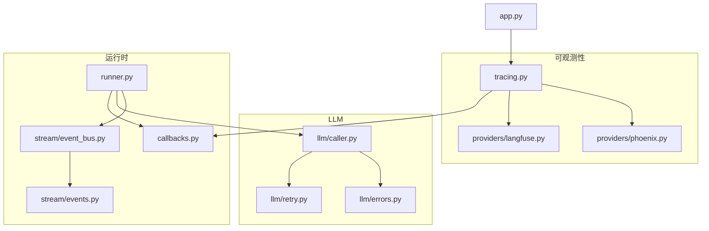
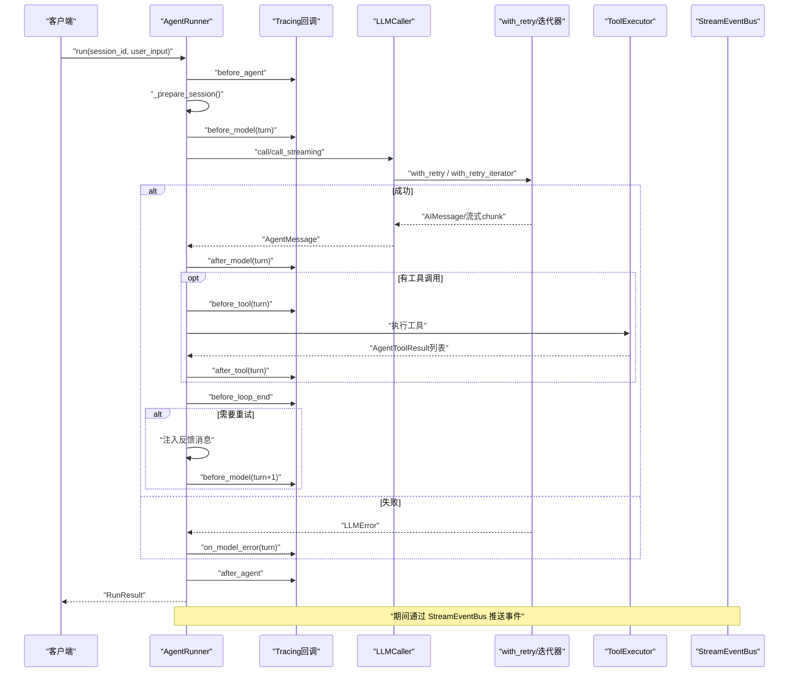
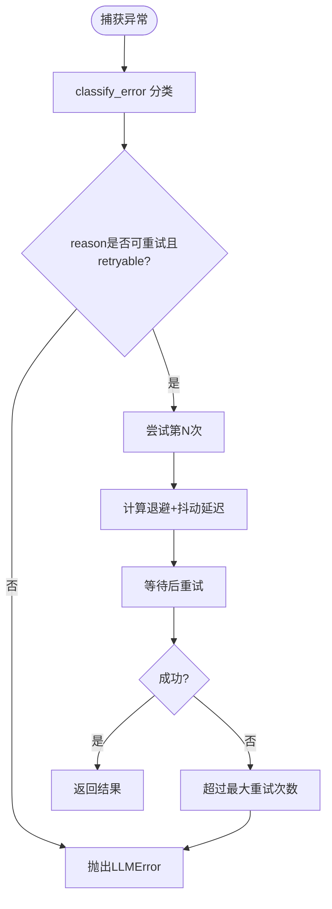
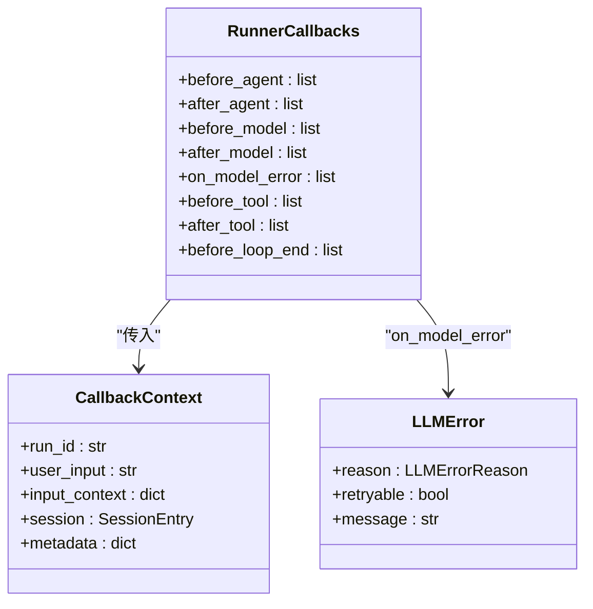
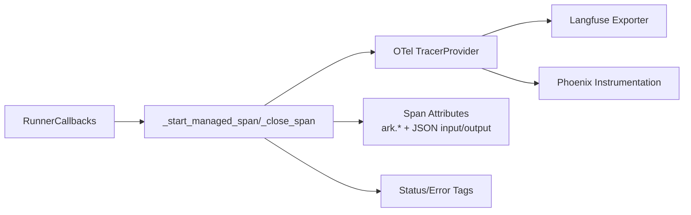
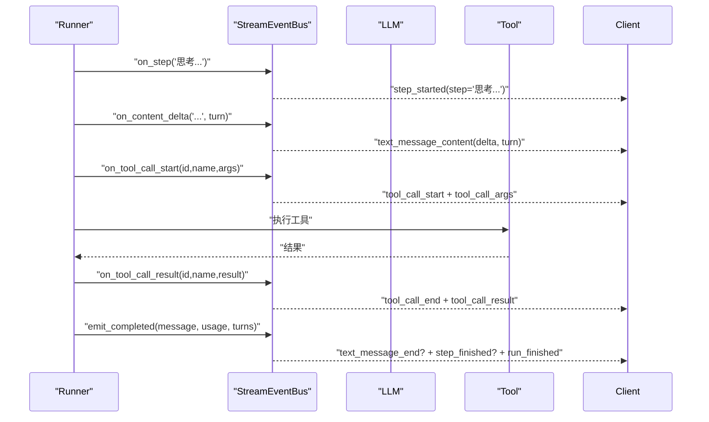
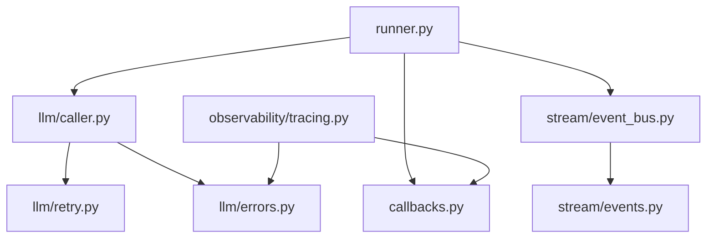

# 故障排除

<cite>
**本文档引用的文件**
- [src/ark_agentic/core/observability/tracing.py](file://src/ark_agentic/core/observability/tracing.py)
- [src/ark_agentic/core/llm/errors.py](file://src/ark_agentic/core/llm/errors.py)
- [src/ark_agentic/core/callbacks.py](file://src/ark_agentic/core/callbacks.py)
- [src/ark_agentic/core/llm/caller.py](file://src/ark_agentic/core/llm/caller.py)
- [src/ark_agentic/core/llm/retry.py](file://src/ark_agentic/core/llm/retry.py)
- [src/ark_agentic/core/observability/providers/langfuse.py](file://src/ark_agentic/core/observability/providers/langfuse.py)
- [src/ark_agentic/core/observability/providers/phoenix.py](file://src/ark_agentic/core/observability/providers/phoenix.py)
- [src/ark_agentic/core/runner.py](file://src/ark_agentic/core/runner.py)
- [src/ark_agentic/core/stream/event_bus.py](file://src/ark_agentic/core/stream/event_bus.py)
- [src/ark_agentic/core/stream/events.py](file://src/ark_agentic/core/stream/events.py)
- [src/ark_agentic/app.py](file://src/ark_agentic/app.py)
</cite>

## 目录
1. [简介](#简介)
2. [项目结构](#项目结构)
3. [核心组件](#核心组件)
4. [架构总览](#架构总览)
5. [详细组件分析](#详细组件分析)
6. [依赖分析](#依赖分析)
7. [性能考虑](#性能考虑)
8. [故障排除指南](#故障排除指南)
9. [结论](#结论)
10. [附录](#附录)

## 简介
本指南面向 Ark-Agent 的运维与开发人员，聚焦于“可观察性、LLM 错误处理、回调系统调试、性能诊断与紧急处理”。文档基于仓库中的可观测性追踪、LLM 调用与重试、回调钩子、流式事件总线等核心模块，提供系统化的诊断方法、日志分析技巧、监控告警配置与问题排查清单，并解释常见错误代码与修复建议。

## 项目结构
围绕故障排除的关键目录与文件：
- 可观测性与追踪：tracing、langfuse、phoenix
- LLM 调用与重试：caller、retry、errors
- 回调系统：callbacks、runner
- 流式事件：event_bus、events
- 应用入口：app

图表来源
- [src/ark_agentic/core/observability/tracing.py:1-500](file://src/ark_agentic/core/observability/tracing.py#L1-L500)
- [src/ark_agentic/core/observability/providers/langfuse.py:1-78](file://src/ark_agentic/core/observability/providers/langfuse.py#L1-L78)
- [src/ark_agentic/core/observability/providers/phoenix.py:1-92](file://src/ark_agentic/core/observability/providers/phoenix.py#L1-L92)
- [src/ark_agentic/core/llm/caller.py:1-218](file://src/ark_agentic/core/llm/caller.py#L1-L218)
- [src/ark_agentic/core/llm/retry.py:1-162](file://src/ark_agentic/core/llm/retry.py#L1-L162)
- [src/ark_agentic/core/llm/errors.py:1-160](file://src/ark_agentic/core/llm/errors.py#L1-L160)
- [src/ark_agentic/core/callbacks.py:1-198](file://src/ark_agentic/core/callbacks.py#L1-L198)
- [src/ark_agentic/core/runner.py:1-800](file://src/ark_agentic/core/runner.py#L1-L800)
- [src/ark_agentic/core/stream/event_bus.py:1-248](file://src/ark_agentic/core/stream/event_bus.py#L1-L248)
- [src/ark_agentic/core/stream/events.py:1-116](file://src/ark_agentic/core/stream/events.py#L1-L116)
- [src/ark_agentic/app.py:1-249](file://src/ark_agentic/app.py#L1-L249)

章节来源
- [src/ark_agentic/core/observability/tracing.py:1-500](file://src/ark_agentic/core/observability/tracing.py#L1-L500)
- [src/ark_agentic/core/llm/caller.py:1-218](file://src/ark_agentic/core/llm/caller.py#L1-L218)
- [src/ark_agentic/core/llm/retry.py:1-162](file://src/ark_agentic/core/llm/retry.py#L1-L162)
- [src/ark_agentic/core/llm/errors.py:1-160](file://src/ark_agentic/core/llm/errors.py#L1-L160)
- [src/ark_agentic/core/callbacks.py:1-198](file://src/ark_agentic/core/callbacks.py#L1-L198)
- [src/ark_agentic/core/runner.py:1-800](file://src/ark_agentic/core/runner.py#L1-L800)
- [src/ark_agentic/core/stream/event_bus.py:1-248](file://src/ark_agentic/core/stream/event_bus.py#L1-L248)
- [src/ark_agentic/core/stream/events.py:1-116](file://src/ark_agentic/core/stream/events.py#L1-L116)
- [src/ark_agentic/app.py:1-249](file://src/ark_agentic/app.py#L1-L249)

## 核心组件
- 可观测性追踪：提供 OpenTelemetry 风格的生命周期回调，自动记录 Agent/Model/Tool/Thinking 等阶段的属性与异常，支持多 Provider（Langfuse、Phoenix）。
- LLM 错误处理：统一错误分类与结构化包装，便于重试策略与用户友好提示。
- LLM 调用与重试：封装非流式/流式调用，内置指数退避+抖动重试，区分可重试与不可重试错误。
- 回调系统：Runner 生命周期钩子，支持 ABORT/OVERRIDE/RETRY/PASS 等动作，贯穿 before/after/on_error。
- 流式事件总线：将 Runner 内部事件映射为 AG-UI 事件模型，支撑前端实时展示与调试。

章节来源
- [src/ark_agentic/core/observability/tracing.py:227-481](file://src/ark_agentic/core/observability/tracing.py#L227-L481)
- [src/ark_agentic/core/llm/errors.py:31-160](file://src/ark_agentic/core/llm/errors.py#L31-L160)
- [src/ark_agentic/core/llm/caller.py:26-218](file://src/ark_agentic/core/llm/caller.py#L26-L218)
- [src/ark_agentic/core/llm/retry.py:45-162](file://src/ark_agentic/core/llm/retry.py#L45-L162)
- [src/ark_agentic/core/callbacks.py:58-198](file://src/ark_agentic/core/callbacks.py#L58-L198)
- [src/ark_agentic/core/stream/event_bus.py:67-248](file://src/ark_agentic/core/stream/event_bus.py#L67-L248)
- [src/ark_agentic/core/stream/events.py:67-116](file://src/ark_agentic/core/stream/events.py#L67-L116)

## 架构总览
下面的序列图展示了“一次典型 ReAct 循环”的关键节点与可观测性埋点，包括 LLM 调用、工具执行、错误处理与流式事件分发。

图表来源
- [src/ark_agentic/core/runner.py:312-730](file://src/ark_agentic/core/runner.py#L312-L730)
- [src/ark_agentic/core/llm/caller.py:70-192](file://src/ark_agentic/core/llm/caller.py#L70-L192)
- [src/ark_agentic/core/llm/retry.py:45-162](file://src/ark_agentic/core/llm/retry.py#L45-L162)
- [src/ark_agentic/core/observability/tracing.py:227-481](file://src/ark_agentic/core/observability/tracing.py#L227-L481)
- [src/ark_agentic/core/stream/event_bus.py:146-214](file://src/ark_agentic/core/stream/event_bus.py#L146-L214)

## 详细组件分析

### LLM 错误处理与重试
- 错误分类：基于关键字匹配与状态码识别，归类为 AUTH/QUOTA/RATE_LIMIT/TIMEOUT/CONTEXT_OVERFLOW/CONTENT_FILTER/SERVER_ERROR/NETWORK/UNKNOWN。
- 结构化包装：统一为 LLMError，携带 provider/model/status_code/reason/retryable/original_error。
- 重试策略：仅对 retryable=True 的错误进行指数退避+抖动重试；对 AUTH/QUOTA/CONTEXT_OVERFLOW/CONTENT_FILTER 直接抛出。
- 用户友好提示：根据 reason 映射为简短易懂的提示文案。

图表来源
- [src/ark_agentic/core/llm/errors.py:55-160](file://src/ark_agentic/core/llm/errors.py#L55-L160)
- [src/ark_agentic/core/llm/retry.py:45-162](file://src/ark_agentic/core/llm/retry.py#L45-L162)

章节来源
- [src/ark_agentic/core/llm/errors.py:17-160](file://src/ark_agentic/core/llm/errors.py#L17-L160)
- [src/ark_agentic/core/llm/retry.py:22-96](file://src/ark_agentic/core/llm/retry.py#L22-L96)

### 回调系统与 Runner 生命周期
- 生命周期钩子：before_agent/after_agent、before_model/after_model、on_model_error、before_tool/after_tool、before_loop_end。
- 动作语义：PASS（不干预）、ABORT（拒绝请求）、OVERRIDE（替换输出）、RETRY（注入反馈重试）。
- 合并与执行：支持内部+外部回调合并，按顺序执行，遇到非 PASS 动作即短路。
- 用户友好错误：根据 LLMError.reason 生成可读提示。

图表来源
- [src/ark_agentic/core/callbacks.py:172-198](file://src/ark_agentic/core/callbacks.py#L172-L198)
- [src/ark_agentic/core/callbacks.py:75-93](file://src/ark_agentic/core/callbacks.py#L75-L93)
- [src/ark_agentic/core/llm/errors.py:31-42](file://src/ark_agentic/core/llm/errors.py#L31-L42)

章节来源
- [src/ark_agentic/core/callbacks.py:98-198](file://src/ark_agentic/core/callbacks.py#L98-L198)
- [src/ark_agentic/core/runner.py:592-611](file://src/ark_agentic/core/runner.py#L592-L611)

### 可观测性与追踪
- 跟踪回调：为 Agent/Model/Tool/Thinking 等阶段创建 spans，设置标准化属性（如 input/output、tokens、finish_reason、ark.* 自定义标签）。
- 异常记录：在 span 上设置 error 标记与错误类型/消息，并记录 LLMError 的 reason/model 等。
- Provider 集成：Langfuse（OTLP）、Phoenix（Arize）按环境变量启用，缺失依赖时给出明确警告。
- 无 Provider 降级：未配置 Provider 时使用 NoOp tracer，零成本。

图表来源
- [src/ark_agentic/core/observability/tracing.py:227-481](file://src/ark_agentic/core/observability/tracing.py#L227-L481)
- [src/ark_agentic/core/observability/providers/langfuse.py:21-63](file://src/ark_agentic/core/observability/providers/langfuse.py#L21-L63)
- [src/ark_agentic/core/observability/providers/phoenix.py:36-77](file://src/ark_agentic/core/observability/providers/phoenix.py#L36-L77)

章节来源
- [src/ark_agentic/core/observability/tracing.py:148-222](file://src/ark_agentic/core/observability/tracing.py#L148-L222)
- [src/ark_agentic/core/observability/providers/langfuse.py:15-63](file://src/ark_agentic/core/observability/providers/langfuse.py#L15-L63)
- [src/ark_agentic/core/observability/providers/phoenix.py:22-77](file://src/ark_agentic/core/observability/providers/phoenix.py#L22-L77)

### 流式事件总线与前端对接
- 事件模型：统一的 AG-UI 事件类型（run_started/finished/error、step、text/thinking message、tool_call、state/messages、custom/raw）。
- 自动配对：step_started/finished、text_message_start/end、thinking_message_start/end。
- 回调到事件：Runner 回调（on_step/on_content_delta/on_tool_call_* 等）经总线映射为完整事件序列。
- 输出层：由 OutputFormatter 适配到不同传输协议（SSE/WS/HTTP）。

图表来源
- [src/ark_agentic/core/stream/event_bus.py:146-214](file://src/ark_agentic/core/stream/event_bus.py#L146-L214)
- [src/ark_agentic/core/stream/events.py:67-116](file://src/ark_agentic/core/stream/events.py#L67-L116)

章节来源
- [src/ark_agentic/core/stream/event_bus.py:67-248](file://src/ark_agentic/core/stream/event_bus.py#L67-L248)
- [src/ark_agentic/core/stream/events.py:30-116](file://src/ark_agentic/core/stream/events.py#L30-L116)

## 依赖分析
- Runner 依赖 LLMCaller 与 ToolExecutor，通过回调系统解耦生命周期控制与执行细节。
- LLMCaller 依赖 with_retry/with_retry_iterator 进行重试，依赖 LLMError 进行错误分类。
- Tracing 回调依赖 OTel（可选）与 LLMError，用于 span 属性与异常记录。
- Event Bus 依赖事件模型，向上游 Runner 提供统一事件接口。

图表来源
- [src/ark_agentic/core/runner.py:19-50](file://src/ark_agentic/core/runner.py#L19-L50)
- [src/ark_agentic/core/llm/caller.py:15-21](file://src/ark_agentic/core/llm/caller.py#L15-L21)
- [src/ark_agentic/core/llm/retry.py](file://src/ark_agentic/core/llm/retry.py#L16)
- [src/ark_agentic/core/llm/errors.py:10-12](file://src/ark_agentic/core/llm/errors.py#L10-L12)
- [src/ark_agentic/core/observability/tracing.py:17-18](file://src/ark_agentic/core/observability/tracing.py#L17-L18)
- [src/ark_agentic/core/stream/event_bus.py](file://src/ark_agentic/core/stream/event_bus.py#L20)
- [src/ark_agentic/core/stream/events.py](file://src/ark_agentic/core/stream/events.py#L27)

章节来源
- [src/ark_agentic/core/runner.py:19-50](file://src/ark_agentic/core/runner.py#L19-L50)
- [src/ark_agentic/core/llm/caller.py:15-21](file://src/ark_agentic/core/llm/caller.py#L15-L21)
- [src/ark_agentic/core/llm/retry.py](file://src/ark_agentic/core/llm/retry.py#L16)
- [src/ark_agentic/core/llm/errors.py:10-12](file://src/ark_agentic/core/llm/errors.py#L10-L12)
- [src/ark_agentic/core/observability/tracing.py:17-18](file://src/ark_agentic/core/observability/tracing.py#L17-L18)
- [src/ark_agentic/core/stream/event_bus.py](file://src/ark_agentic/core/stream/event_bus.py#L20)
- [src/ark_agentic/core/stream/events.py](file://src/ark_agentic/core/stream/events.py#L27)

## 性能考虑
- 重试策略：仅对可重试错误进行重试，避免对认证/配额/内容过滤等错误进行无效重试，降低总体延迟与成本。
- 流式输出：流式 LLM 调用支持增量内容与思考内容（reasoning_content）分发，减少前端等待时间。
- Token 统计：在响应元数据中记录 prompt/completion tokens，便于成本与性能分析。
- 自动压缩：在会话历史过长时自动压缩，避免 context overflow 导致的失败与重试。
- 幻觉/错误恢复：通过 before_loop_end 的 RETRY 动作注入反馈，引导模型自我修正。

章节来源
- [src/ark_agentic/core/llm/retry.py:22-96](file://src/ark_agentic/core/llm/retry.py#L22-L96)
- [src/ark_agentic/core/llm/caller.py:96-192](file://src/ark_agentic/core/llm/caller.py#L96-L192)
- [src/ark_agentic/core/runner.py:473-487](file://src/ark_agentic/core/runner.py#L473-L487)

## 故障排除指南

### 一、常见问题与诊断方法
- 认证失败（AUTH）
  - 现象：立即抛出 LLMError，不重试。
  - 诊断：检查 API Key、服务端点、权限范围。
  - 修复：更新密钥或授权策略。
- 配额不足（QUOTA）
  - 现象：402/余额不足，不重试。
  - 诊断：查看账户余额与用量阈值。
  - 修复：充值或调整用量策略。
- 速率限制（RATE_LIMIT）
  - 现象：429，自动指数退避重试。
  - 诊断：查看重试日志与延迟。
  - 修复：降低并发或申请更高配额。
- 超时（TIMEOUT）
  - 现象：连接/读取超时，可重试。
  - 诊断：网络质量、代理设置、超时阈值。
  - 修复：优化网络或增大超时。
- 上下文溢出（CONTEXT_OVERFLOW）
  - 现象：上下文长度超限，触发自动压缩。
  - 诊断：历史消息过长或工具返回过大。
  - 修复：清理历史或分段处理。
- 内容过滤（CONTENT_FILTER）
  - 现象：被安全策略拦截，不重试。
  - 诊断：检查输入内容与策略配置。
  - 修复：修改输入或调整策略。
- 服务器错误（SERVER_ERROR）
  - 现象：5xx，可重试。
  - 诊断：服务端负载与可用性。
  - 修复：扩容或切换节点。
- 网络错误（NETWORK）
  - 现象：DNS/连接不可达，可重试。
  - 诊断：DNS 解析、防火墙、代理。
  - 修复：修复网络链路或代理配置。

章节来源
- [src/ark_agentic/core/llm/errors.py:55-160](file://src/ark_agentic/core/llm/errors.py#L55-L160)
- [src/ark_agentic/core/llm/retry.py:22-96](file://src/ark_agentic/core/llm/retry.py#L22-L96)

### 二、日志分析技巧
- 关键日志位置
  - LLM 重试：[LLM_RETRY]/[LLM_STREAM_RETRY]，包含尝试次数、reason、延迟、模型名。
  - LLM 调用：流式开始、工具调用解析、usage 统计。
  - 回调：before_agent/after_agent、before_model/after_model、on_model_error、before_tool/after_tool。
  - 追踪：span 属性包含 ark.* 标签（turn、tool_count、prompt_tokens、completion_tokens、finish_reason 等）。
- 建议
  - 将 LOG_LEVEL 设为 INFO/DEBUG，结合回调与追踪定位瓶颈。
  - 对流式场景关注 thinking_content 与 content 的分发时序。

章节来源
- [src/ark_agentic/core/llm/retry.py:85-96](file://src/ark_agentic/core/llm/retry.py#L85-L96)
- [src/ark_agentic/core/llm/caller.py:120-192](file://src/ark_agentic/core/llm/caller.py#L120-L192)
- [src/ark_agentic/core/observability/tracing.py:330-351](file://src/ark_agentic/core/observability/tracing.py#L330-L351)

### 三、性能诊断
- 指标采集
  - prompt_tokens/completion_tokens：评估成本与效率。
  - turns/tool_calls_count：衡量工具使用频率与循环次数。
  - stopped_by_limit：是否因限制提前终止。
- 优化建议
  - 减少不必要的工具调用与轮次。
  - 合理设置 max_turns/max_tool_calls_per_turn。
  - 使用自动压缩与更合适的采样参数。

章节来源
- [src/ark_agentic/core/runner.py:131-153](file://src/ark_agentic/core/runner.py#L131-L153)
- [src/ark_agentic/core/runner.py:473-487](file://src/ark_agentic/core/runner.py#L473-L487)

### 四、紧急处理流程
- 立即措施
  - 临时提高 LOG_LEVEL，开启 tracing（Langfuse/Phoenix）。
  - 降低并发与重试次数，缓解上游压力。
- 逐步恢复
  - 验证 API Key/配额/网络连通性。
  - 检查工具执行耗时与返回大小。
  - 通过 before_loop_end 的 RETRY 注入反馈，引导模型修正。
- 事后复盘
  - 查看 span 属性与错误原因，补充告警规则。

章节来源
- [src/ark_agentic/core/observability/providers/langfuse.py:21-63](file://src/ark_agentic/core/observability/providers/langfuse.py#L21-L63)
- [src/ark_agentic/core/observability/providers/phoenix.py:36-77](file://src/ark_agentic/core/observability/providers/phoenix.py#L36-L77)
- [src/ark_agentic/core/runner.py:744-758](file://src/ark_agentic/core/runner.py#L744-L758)

### 五、可观测性配置与监控告警
- 配置项
  - Langfuse：LANGFUSE_PUBLIC_KEY/LANGFUSE_SECRET_KEY/LANGFUSE_HOST。
  - Phoenix：ENABLE_PHOENIX 或 PHOENIX_* 环境变量。
  - 日志：LOG_LEVEL、OTel 依赖安装。
- 告警建议
  - LLMErrorReason.RATE_LIMIT/TIMEOUT/SERVER_ERROR 持续升高。
  - 重试次数过多或延迟异常增长。
  - CONTEXT_OVERFLOW 频繁触发（提示自动压缩未生效）。
  - before_loop_end RETRY 次数异常上升。

章节来源
- [src/ark_agentic/core/observability/providers/langfuse.py:15-63](file://src/ark_agentic/core/observability/providers/langfuse.py#L15-L63)
- [src/ark_agentic/core/observability/providers/phoenix.py:22-77](file://src/ark_agentic/core/observability/providers/phoenix.py#L22-L77)
- [src/ark_agentic/app.py:93-94](file://src/ark_agentic/app.py#L93-L94)

### 六、调试工具与使用
- 回调调试
  - 在回调中使用 ctx.metadata 传递 run 级元数据（如 user_id、agent_id、model、correlation_id）。
  - 使用 CallbackResult 的 action/context_updates/event 进行行为控制与事件分发。
- 追踪调试
  - 启用 Langfuse/Phoenix 后，在 UI 中查看 span 属性与错误标签。
  - 关注 ark.error_reason/ark.error_model/ark.error_type 等字段。
- 流式调试
  - 通过 StreamEventBus 的事件序列验证前后端一致性。
  - 注意 text/thinking 的配对与截断（>2000字符自动截断）。

章节来源
- [src/ark_agentic/core/callbacks.py:75-93](file://src/ark_agentic/core/callbacks.py#L75-L93)
- [src/ark_agentic/core/observability/tracing.py:175-184](file://src/ark_agentic/core/observability/tracing.py#L175-L184)
- [src/ark_agentic/core/stream/event_bus.py:187-200](file://src/ark_agentic/core/stream/event_bus.py#L187-L200)

### 七、问题排查清单
- LLM 相关
  - API Key 是否正确？是否过期或受限？
  - 是否触发配额/速率限制？是否出现超时/网络错误？
  - 上下文是否过长？是否触发自动压缩？
- 回调与生命周期
  - before_agent 是否 ABORT 了请求？
  - before_model/after_model 是否正常执行？
  - on_model_error 是否被触发且正确分类？
  - before_tool/after_tool 是否正确处理工具结果？
  - before_loop_end 是否使用 RETRY 注入反馈？
- 追踪与日志
  - 是否启用了 Langfuse/Phoenix？OTel 依赖是否齐全？
  - 重试日志是否显示 reason 与延迟？
  - span 是否记录 ark.* 属性与错误标签？
- 流式与前端
  - 事件序列是否完整（start/end 配对）？
  - text/thinking 是否正确分发？
  - 截断是否影响诊断？

章节来源
- [src/ark_agentic/core/llm/errors.py:55-160](file://src/ark_agentic/core/llm/errors.py#L55-L160)
- [src/ark_agentic/core/callbacks.py:98-198](file://src/ark_agentic/core/callbacks.py#L98-L198)
- [src/ark_agentic/core/observability/tracing.py:227-481](file://src/ark_agentic/core/observability/tracing.py#L227-L481)
- [src/ark_agentic/core/stream/event_bus.py:146-214](file://src/ark_agentic/core/stream/event_bus.py#L146-L214)

### 八、错误代码与修复建议
- AUTH（认证失败）
  - 修复：检查密钥、域名、权限。
- QUOTA（配额不足）
  - 修复：充值或调整用量策略。
- RATE_LIMIT（速率限制）
  - 修复：降低并发或申请更高限额。
- TIMEOUT（超时）
  - 修复：检查网络与超时配置。
- CONTEXT_OVERFLOW（上下文溢出）
  - 修复：清理历史或分段处理。
- CONTENT_FILTER（内容过滤）
  - 修复：修改输入或调整策略。
- SERVER_ERROR（服务器错误）
  - 修复：扩容或切换节点。
- NETWORK（网络错误）
  - 修复：修复 DNS/代理/防火墙。
- UNKNOWN（未知错误）
  - 修复：补充日志与分类规则。

章节来源
- [src/ark_agentic/core/llm/errors.py:17-53](file://src/ark_agentic/core/llm/errors.py#L17-L53)
- [src/ark_agentic/core/runner.py:592-611](file://src/ark_agentic/core/runner.py#L592-L611)

## 结论
通过统一的 LLM 错误分类、可插拔的重试策略、完善的回调与追踪体系，以及清晰的流式事件模型，Ark-Agent 能够在复杂生产环境中快速定位问题、稳定运行并持续优化。建议在生产中启用可观测性、建立基于错误原因与指标的告警，并配合本指南的排查清单与流程，实现高效的问题闭环。

## 附录
- 应用入口与生命周期
  - app.py 在 lifespan 中初始化 tracing、注册 Agent、warmup 并在关闭时优雅停机。
- 事件模型参考
  - AG-UI 事件类型与字段定义，便于前端对齐与调试。

章节来源
- [src/ark_agentic/app.py:63-135](file://src/ark_agentic/app.py#L63-L135)
- [src/ark_agentic/core/stream/events.py:30-116](file://src/ark_agentic/core/stream/events.py#L30-L116)