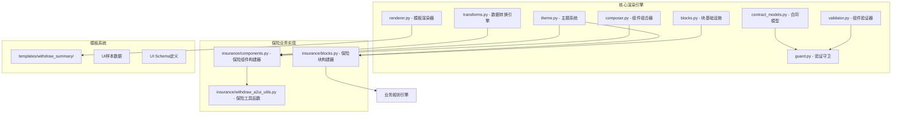
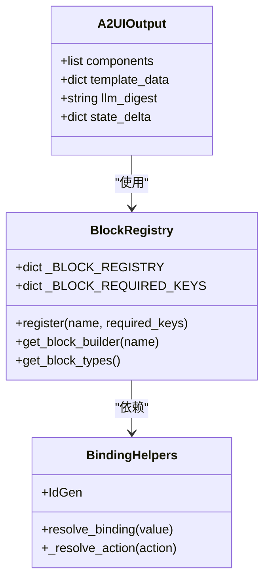
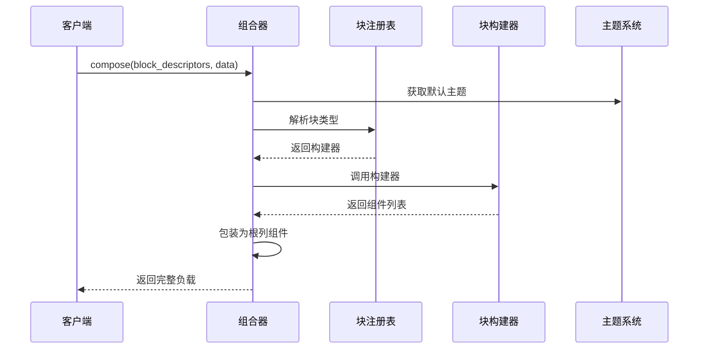
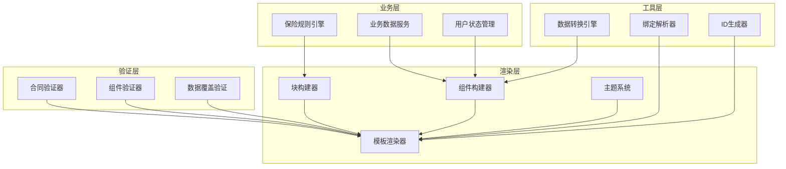
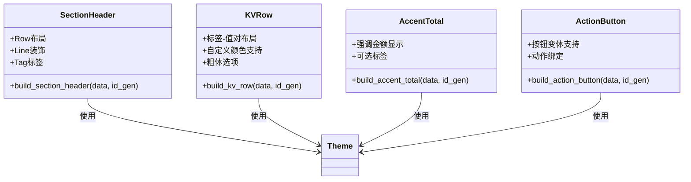
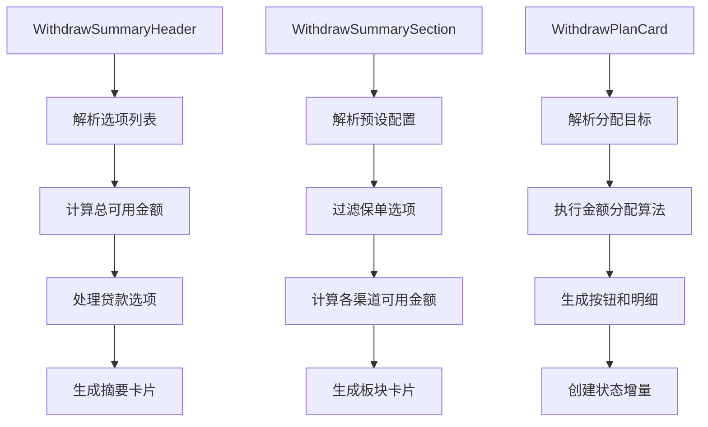
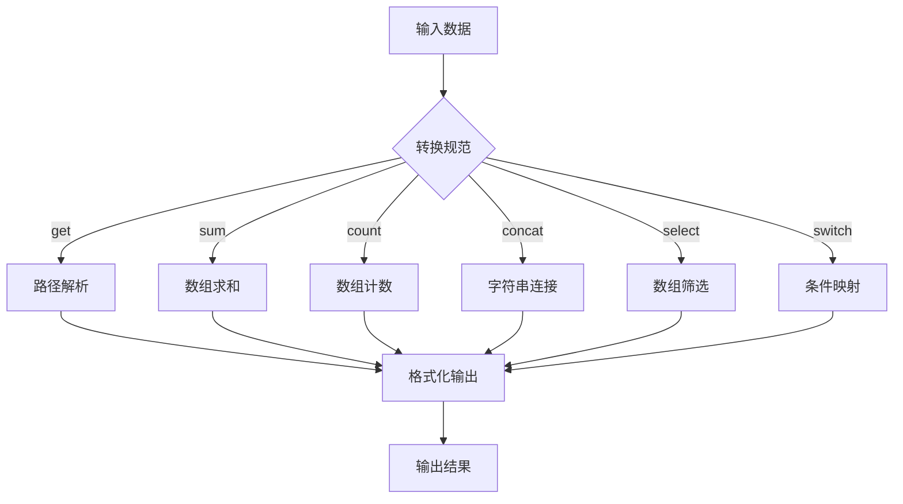
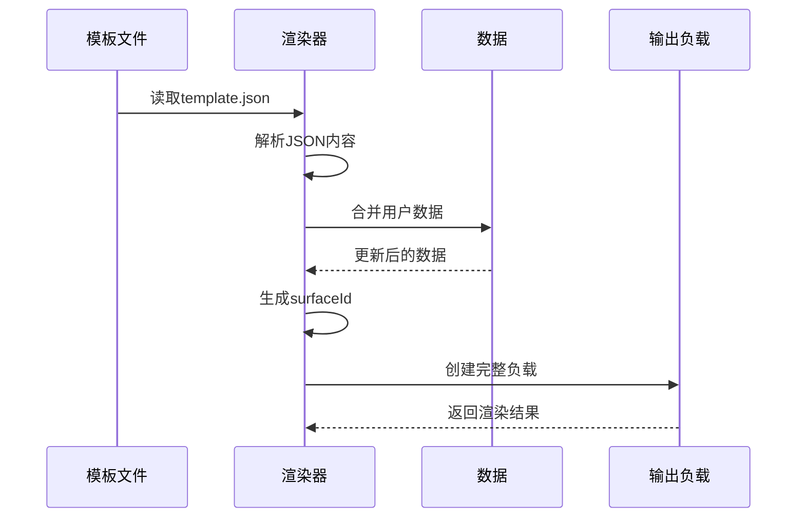
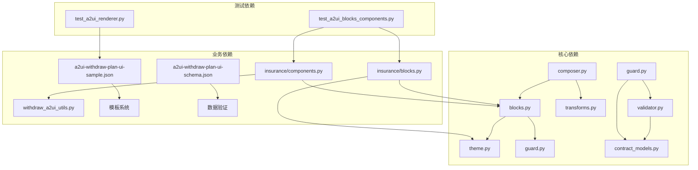
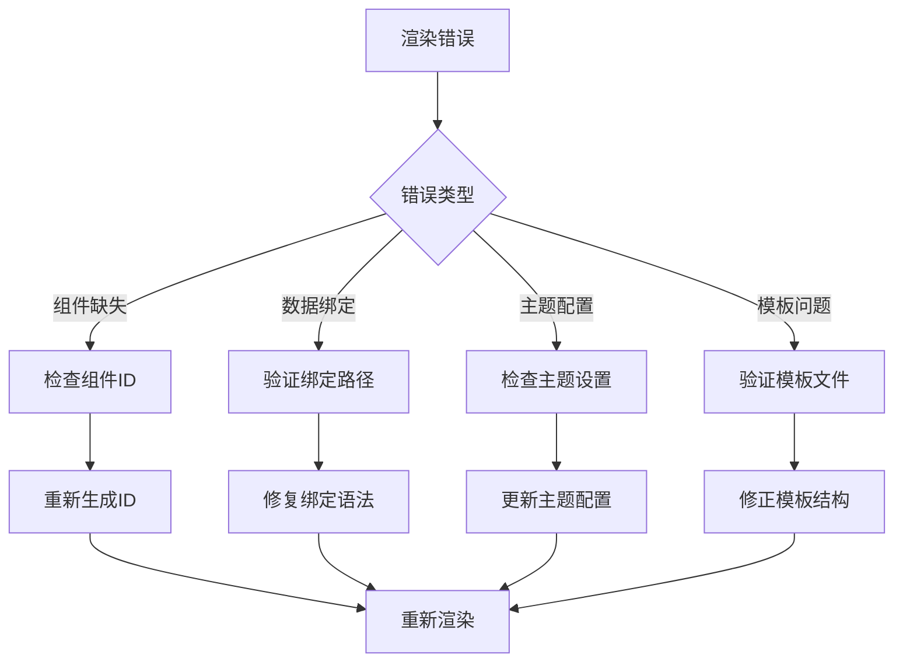

# 保险A2UI渲染系统

<cite>
**本文档引用的文件**
- [blocks.py](file://src/ark_agentic/core/a2ui/blocks.py)
- [composer.py](file://src/ark_agentic/core/a2ui/composer.py)
- [renderer.py](file://src/ark_agentic/core/a2ui/renderer.py)
- [theme.py](file://src/ark_agentic/core/a2ui/theme.py)
- [contract_models.py](file://src/ark_agentic/core/a2ui/contract_models.py)
- [transforms.py](file://src/ark_agentic/core/a2ui/transforms.py)
- [guard.py](file://src/ark_agentic/core/a2ui/guard.py)
- [validator.py](file://src/ark_agentic/core/a2ui/validator.py)
- [flattener.py](file://src/ark_agentic/core/a2ui/flattener.py)
- [blocks.py](file://src/ark_agentic/agents/insurance/a2ui/blocks.py)
- [components.py](file://src/ark_agentic/agents/insurance/a2ui/components.py)
- [withdraw_a2ui_utils.py](file://src/ark_agentic/agents/insurance/a2ui/withdraw_a2ui_utils.py)
- [a2ui-withdraw-plan-ui-sample.json](file://docs/a2ui/a2ui-withdraw-plan-ui-sample.json)
- [a2ui-withdraw-plan-ui-schema.json](file://docs/a2ui/a2ui-withdraw-plan-ui-schema.json)
- [test_a2ui_blocks_components.py](file://tests/unit/agents/insurance/test_a2ui_blocks_components.py)
- [test_a2ui_renderer.py](file://tests/unit/core/test_a2ui_renderer.py)
</cite>

## 目录
1. [简介](#简介)
2. [项目结构](#项目结构)
3. [核心组件](#核心组件)
4. [架构概览](#架构概览)
5. [详细组件分析](#详细组件分析)
6. [依赖关系分析](#依赖关系分析)
7. [性能考虑](#性能考虑)
8. [故障排除指南](#故障排除指南)
9. [结论](#结论)
10. [附录](#附录)

## 简介

保险A2UI渲染系统是一个专为保险业务场景设计的卡片式UI渲染框架。该系统采用模块化设计，通过块组件、组件组合器和模板系统实现了高度可定制的保险产品展示和交互功能。

系统的核心特点包括：
- **卡片式UI设计**：基于保险业务需求的卡片布局和视觉层次
- **数据绑定机制**：支持动态数据绑定和模板渲染
- **业务逻辑集成**：深度整合保险业务规则和计算逻辑
- **主题定制**：灵活的主题系统支持品牌一致性
- **模板系统**：标准化的模板渲染流程

## 项目结构

保险A2UI渲染系统采用分层架构设计，主要分为核心渲染引擎和业务特定实现两个层面：

**图表来源**
- [blocks.py:1-149](file://src/ark_agentic/core/a2ui/blocks.py#L1-L149)
- [composer.py:1-123](file://src/ark_agentic/core/a2ui/composer.py#L1-L123)
- [components.py:1-538](file://src/ark_agentic/agents/insurance/a2ui/components.py#L1-L538)

**章节来源**
- [blocks.py:1-149](file://src/ark_agentic/core/a2ui/blocks.py#L1-L149)
- [composer.py:1-123](file://src/ark_agentic/core/a2ui/composer.py#L1-L123)
- [theme.py:1-39](file://src/ark_agentic/core/a2ui/theme.py#L1-L39)

## 核心组件

### 块基础设施系统

块基础设施是A2UI系统的基础构件，提供了统一的组件构建和管理机制：

**图表来源**
- [blocks.py:46-149](file://src/ark_agentic/core/a2ui/blocks.py#L46-L149)

### 组件组合器

组件组合器负责将块描述符转换为完整的A2UI事件负载：

**图表来源**
- [composer.py:57-123](file://src/ark_agentic/core/a2ui/composer.py#L57-L123)

**章节来源**
- [blocks.py:96-149](file://src/ark_agentic/core/a2ui/blocks.py#L96-L149)
- [composer.py:57-123](file://src/ark_agentic/core/a2ui/composer.py#L57-L123)

## 架构概览

保险A2UI渲染系统采用分层架构，确保了业务逻辑与渲染逻辑的分离：

**图表来源**
- [components.py:69-469](file://src/ark_agentic/agents/insurance/a2ui/components.py#L69-L469)
- [guard.py:83-125](file://src/ark_agentic/core/a2ui/guard.py#L83-L125)

## 详细组件分析

### 保险块构建器

保险块构建器提供了专门针对保险业务的UI组件：

**图表来源**
- [blocks.py:25-145](file://src/ark_agentic/agents/insurance/a2ui/blocks.py#L25-L145)

### 保险组件构建器

保险组件构建器实现了复杂的业务逻辑：

**图表来源**
- [components.py:161-466](file://src/ark_agentic/agents/insurance/a2ui/components.py#L161-L466)

**章节来源**
- [blocks.py:25-145](file://src/ark_agentic/agents/insurance/a2ui/blocks.py#L25-L145)
- [components.py:69-469](file://src/ark_agentic/agents/insurance/a2ui/components.py#L69-L469)

### 数据转换引擎

数据转换引擎提供了强大的数据处理能力：

**图表来源**
- [transforms.py:186-316](file://src/ark_agentic/core/a2ui/transforms.py#L186-L316)

**章节来源**
- [transforms.py:1-396](file://src/ark_agentic/core/a2ui/transforms.py#L1-L396)

### 模板渲染系统

模板渲染系统支持基于JSON的模板文件：

**图表来源**
- [renderer.py:15-53](file://src/ark_agentic/core/a2ui/renderer.py#L15-L53)

**章节来源**
- [renderer.py:1-53](file://src/ark_agentic/core/a2ui/renderer.py#L1-L53)

## 依赖关系分析

系统采用松耦合的设计模式，通过接口和抽象类实现模块间的解耦：

**图表来源**
- [blocks.py:19-21](file://src/ark_agentic/core/a2ui/blocks.py#L19-L21)
- [components.py:23-38](file://src/ark_agentic/agents/insurance/a2ui/components.py#L23-L38)

**章节来源**
- [blocks.py:1-149](file://src/ark_agentic/core/a2ui/blocks.py#L1-L149)
- [components.py:1-538](file://src/ark_agentic/agents/insurance/a2ui/components.py#L1-L538)

## 性能考虑

### 渲染性能优化

1. **组件缓存策略**：通过ID生成器避免重复创建相同组件
2. **延迟计算**：数据转换采用惰性求值，只在需要时执行
3. **内存管理**：使用不可变数据结构减少内存占用
4. **批量处理**：支持批量组件渲染提升效率

### 数据绑定性能

1. **路径解析优化**：使用正则表达式进行快速路径匹配
2. **缓存机制**：对常用查询结果进行缓存
3. **错误处理**：优雅的错误恢复机制避免性能损失

## 故障排除指南

### 常见问题诊断

### 调试工具

1. **验证器**：提供完整的组件和数据验证
2. **日志记录**：详细的错误信息和警告
3. **测试套件**：全面的功能测试覆盖
4. **性能监控**：渲染时间和资源使用统计

**章节来源**
- [guard.py:83-125](file://src/ark_agentic/core/a2ui/guard.py#L83-L125)
- [validator.py:88-227](file://src/ark_agentic/core/a2ui/validator.py#L88-L227)

## 结论

保险A2UI渲染系统通过模块化设计和业务特定实现，成功地将复杂的保险业务逻辑与直观的UI展示相结合。系统的主要优势包括：

1. **高度可定制**：通过主题系统和组件构建器实现灵活的样式定制
2. **业务集成**：深度整合保险业务规则和计算逻辑
3. **扩展性强**：清晰的接口设计支持新功能的快速添加
4. **稳定性高**：完善的验证机制和错误处理确保系统可靠性

该系统为保险行业的数字化转型提供了坚实的技术基础，能够有效提升用户体验和业务效率。

## 附录

### UI设计规范

1. **色彩规范**：使用品牌色彩(#FF6600)作为强调色
2. **字体规范**：标题使用16px，正文使用14px，说明文字使用12px
3. **间距规范**：卡片内边距16px，卡片间间距12px，根容器间距2px
4. **响应式设计**：支持不同屏幕尺寸的自适应布局

### 模板开发指南

1. **模板结构**：遵循标准的A2UI组件树结构
2. **数据绑定**：使用path属性进行动态数据绑定
3. **样式定制**：通过主题系统实现品牌一致性
4. **交互设计**：合理使用按钮和动作组件

### 最佳实践

1. **组件复用**：优先使用现有组件而非创建新组件
2. **数据验证**：始终验证输入数据的完整性和正确性
3. **错误处理**：实现优雅的错误恢复和用户反馈
4. **性能优化**：关注渲染性能和内存使用效率