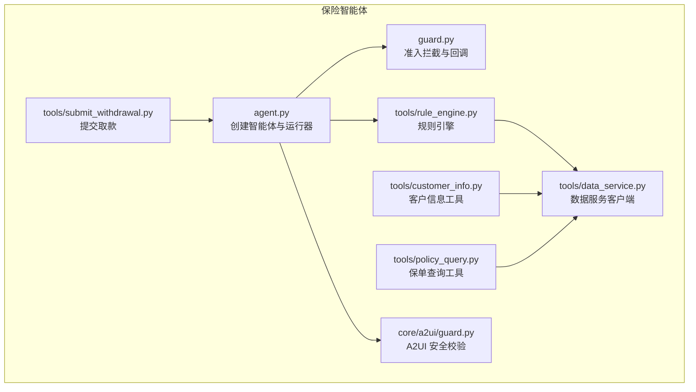
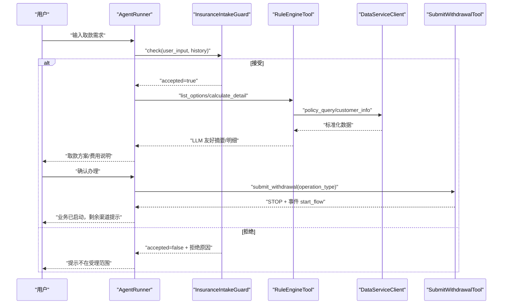
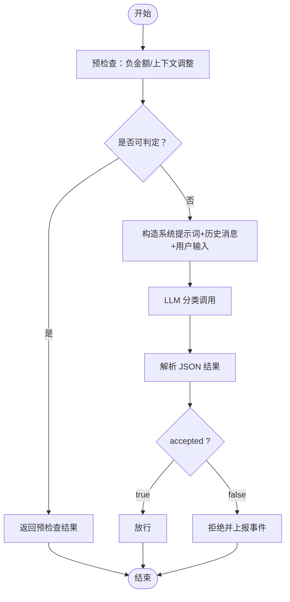
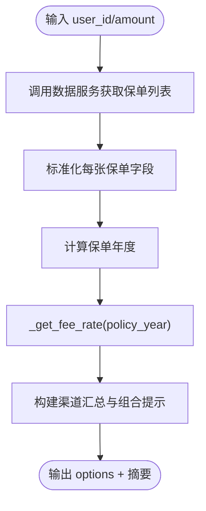
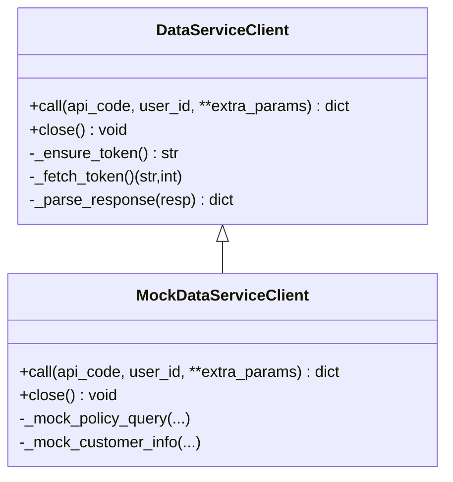
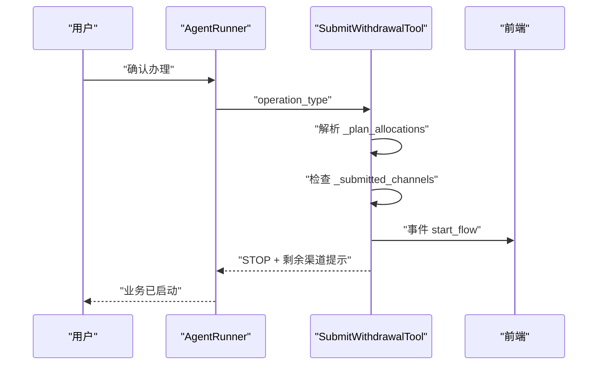
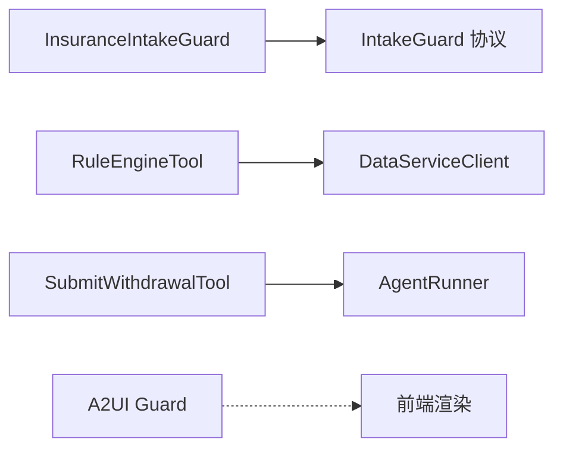

# 保险安全防护

<cite>
**本文引用的文件**
- [src/ark_agentic/agents/insurance/guard.py](file://src/ark_agentic/agents/insurance/guard.py)
- [src/ark_agentic/core/guard.py](file://src/ark_agentic/core/guard.py)
- [src/ark_agentic/core/a2ui/guard.py](file://src/ark_agentic/core/a2ui/guard.py)
- [src/ark_agentic/agents/insurance/tools/rule_engine.py](file://src/ark_agentic/agents/insurance/tools/rule_engine.py)
- [src/ark_agentic/agents/insurance/tools/data_service.py](file://src/ark_agentic/agents/insurance/tools/data_service.py)
- [src/ark_agentic/agents/insurance/tools/customer_info.py](file://src/ark_agentic/agents/insurance/tools/customer_info.py)
- [src/ark_agentic/agents/insurance/tools/policy_query.py](file://src/ark_agentic/agents/insurance/tools/policy_query.py)
- [src/ark_agentic/agents/insurance/tools/submit_withdrawal.py](file://src/ark_agentic/agents/insurance/tools/submit_withdrawal.py)
- [src/ark_agentic/agents/insurance/agent.py](file://src/ark_agentic/agents/insurance/agent.py)
- [src/ark_agentic/agents/insurance/agent.json](file://src/ark_agentic/agents/insurance/agent.json)
- [tests/unit/agents/insurance/test_guard.py](file://tests/unit/agents/insurance/test_guard.py)
- [tests/unit/agents/insurance/test_rule_engine.py](file://tests/unit/agents/insurance/test_rule_engine.py)
- [tests/integration/agents/insurance/test_insurance_api_from_env.py](file://tests/integration/agents/insurance/test_insurance_api_from_env.py)
</cite>

## 目录
1. [引言](#引言)
2. [项目结构](#项目结构)
3. [核心组件](#核心组件)
4. [架构总览](#架构总览)
5. [详细组件分析](#详细组件分析)
6. [依赖分析](#依赖分析)
7. [性能考量](#性能考量)
8. [故障排查指南](#故障排查指南)
9. [结论](#结论)
10. [附录](#附录)

## 引言
本文件面向保险安全防护系统，聚焦于“保险智能体”的安全防护机制与准入拦截能力，覆盖风险评估、合规检查、访问控制与安全策略实施。文档结合保险业务场景，阐述威胁模型与防护措施，提供安全配置指南、监控方案与应急响应流程，并解释监管与合规要点。

## 项目结构
保险安全防护系统位于保险智能体模块内，围绕“准入拦截 + 规则引擎 + 数据服务 + 提交流程”形成闭环。核心文件分布如下：
- 准入拦截：保险智能体准入检查与回调适配
- 规则引擎：取款方案计算与费用核算
- 数据服务：保单与客户信息查询、OAuth 认证与响应解析
- 提交流程：取款确认后的业务提交与跨轮续办
- A2UI 安全校验：事件契约与组件绑定校验
- 智能体装配：运行器配置、会话与记忆管理

图表来源
- [src/ark_agentic/agents/insurance/agent.py:47-143](file://src/ark_agentic/agents/insurance/agent.py#L47-L143)
- [src/ark_agentic/agents/insurance/guard.py:71-164](file://src/ark_agentic/agents/insurance/guard.py#L71-L164)
- [src/ark_agentic/agents/insurance/tools/rule_engine.py:99-445](file://src/ark_agentic/agents/insurance/tools/rule_engine.py#L99-L445)
- [src/ark_agentic/agents/insurance/tools/data_service.py:22-452](file://src/ark_agentic/agents/insurance/tools/data_service.py#L22-L452)
- [src/ark_agentic/agents/insurance/tools/customer_info.py:26-94](file://src/ark_agentic/agents/insurance/tools/customer_info.py#L26-L94)
- [src/ark_agentic/agents/insurance/tools/policy_query.py:25-77](file://src/ark_agentic/agents/insurance/tools/policy_query.py#L25-L77)
- [src/ark_agentic/agents/insurance/tools/submit_withdrawal.py:136-214](file://src/ark_agentic/agents/insurance/tools/submit_withdrawal.py#L136-L214)
- [src/ark_agentic/core/a2ui/guard.py:83-125](file://src/ark_agentic/core/a2ui/guard.py#L83-L125)

章节来源
- [src/ark_agentic/agents/insurance/agent.py:47-143](file://src/ark_agentic/agents/insurance/agent.py#L47-L143)

## 核心组件
- 准入拦截（InsuranceIntakeGuard）：基于系统提示词与少量示例，对用户输入进行确定性分类，限定在“取款业务受理范围”，并支持上下文延续与金额负值的预判放行。
- 规则引擎（RuleEngineTool）：标准化每张保单的可用金额字段，计算部分领取手续费率与到账时间，输出 LLM 友好摘要。
- 数据服务（DataServiceClient/MockDataServiceClient）：统一 OAuth 访问令牌管理与 API 调用，解析嵌套 JSON 响应，支持 Mock 测试。
- 客户信息与保单查询工具：封装真实数据查询，确保参数与错误处理规范。
- 提交取款（SubmitWithdrawalTool）：在用户确认后，从会话状态读取方案分配，提交业务流程并通知前端。
- A2UI 安全校验：事件契约校验、组件绑定校验与数据覆盖校验，防止渲染缺失键导致的 UI/逻辑问题。

章节来源
- [src/ark_agentic/agents/insurance/guard.py:71-164](file://src/ark_agentic/agents/insurance/guard.py#L71-L164)
- [src/ark_agentic/agents/insurance/tools/rule_engine.py:99-445](file://src/ark_agentic/agents/insurance/tools/rule_engine.py#L99-L445)
- [src/ark_agentic/agents/insurance/tools/data_service.py:22-452](file://src/ark_agentic/agents/insurance/tools/data_service.py#L22-L452)
- [src/ark_agentic/agents/insurance/tools/customer_info.py:26-94](file://src/ark_agentic/agents/insurance/tools/customer_info.py#L26-L94)
- [src/ark_agentic/agents/insurance/tools/policy_query.py:25-77](file://src/ark_agentic/agents/insurance/tools/policy_query.py#L25-L77)
- [src/ark_agentic/agents/insurance/tools/submit_withdrawal.py:136-214](file://src/ark_agentic/agents/insurance/tools/submit_withdrawal.py#L136-L214)
- [src/ark_agentic/core/a2ui/guard.py:83-125](file://src/ark_agentic/core/a2ui/guard.py#L83-L125)

## 架构总览
保险安全防护系统采用“准入拦截前置 + 规则引擎中间层 + 数据服务后端 + 提交流程收尾”的分层设计。运行器在进入对话循环前执行准入检查，规则引擎负责业务计算，数据服务负责外部系统集成，提交工具完成业务闭环。

图表来源
- [src/ark_agentic/agents/insurance/guard.py:102-132](file://src/ark_agentic/agents/insurance/guard.py#L102-L132)
- [src/ark_agentic/agents/insurance/tools/rule_engine.py:155-204](file://src/ark_agentic/agents/insurance/tools/rule_engine.py#L155-L204)
- [src/ark_agentic/agents/insurance/tools/data_service.py:73-129](file://src/ark_agentic/agents/insurance/tools/data_service.py#L73-L129)
- [src/ark_agentic/agents/insurance/tools/submit_withdrawal.py:152-214](file://src/ark_agentic/agents/insurance/tools/submit_withdrawal.py#L152-L214)

## 详细组件分析

### 准入拦截组件（InsuranceIntakeGuard）
- 设计要点
  - 系统提示词限定受理范围，包含取款、方案、相关查询与上下文延续。
  - temperature=0 的 LLM 调用确保分类确定性；少量示例锚定边界 case。
  - 预检查：负金额放行（下游工具校验）、上下文调整语句放行、常规 JSON 结果解析。
  - 回调适配：将准入检查结果转换为运行器回调动作，支持事件上报与中止流程。
- 安全特性
  - 防越权：非取款业务直接拒绝。
  - 防滥用：对非保险话题与非取款业务范围进行阻断。
  - 容错：LLM 失败时默认放行，避免误伤正常业务。
- 性能与可靠性
  - 单次 LLM 调用，历史窗口限制，降低延迟与上下文膨胀风险。

图表来源
- [src/ark_agentic/agents/insurance/guard.py:84-132](file://src/ark_agentic/agents/insurance/guard.py#L84-L132)

章节来源
- [src/ark_agentic/agents/insurance/guard.py:71-164](file://src/ark_agentic/agents/insurance/guard.py#L71-L164)
- [src/ark_agentic/core/guard.py:18-34](file://src/ark_agentic/core/guard.py#L18-L34)
- [tests/unit/agents/insurance/test_guard.py:57-90](file://tests/unit/agents/insurance/test_guard.py#L57-L90)

### 规则引擎组件（RuleEngineTool）
- 设计要点
  - 输入：用户ID，返回每张保单的标准化记录（四个可用金额字段、费率、年度）。
  - 计算：部分领取手续费率按保单年度阶梯设定；统一到账时间；贷款年利率固定。
  - 输出：LLM 友好摘要（渠道级汇总），隐藏保单级明细，降低敏感信息泄露风险。
- 安全特性
  - 金额字段标准化，避免字段歧义与解析错误。
  - 费用计算透明且可审计，便于合规审查。
- 性能与可靠性
  - 按可用额度降序排序，提升用户体验；组合提示帮助用户理解多保单组合。

图表来源
- [src/ark_agentic/agents/insurance/tools/rule_engine.py:209-301](file://src/ark_agentic/agents/insurance/tools/rule_engine.py#L209-L301)
- [src/ark_agentic/agents/insurance/tools/rule_engine.py:338-445](file://src/ark_agentic/agents/insurance/tools/rule_engine.py#L338-L445)

章节来源
- [src/ark_agentic/agents/insurance/tools/rule_engine.py:99-445](file://src/ark_agentic/agents/insurance/tools/rule_engine.py#L99-L445)
- [tests/unit/agents/insurance/test_rule_engine.py](file://tests/unit/agents/insurance/test_rule_engine.py)

### 数据服务组件（DataServiceClient/MockDataServiceClient）
- 设计要点
  - OAuth 访问令牌缓存与刷新，预留安全余量。
  - 统一 form-urlencoded 请求与响应解析，兼容嵌套 JSON 字符串。
  - 支持 Mock 客户端，便于开发与测试。
- 安全特性
  - 敏感参数通过 header 传递，避免日志泄露。
  - 认证失败与请求异常均以统一异常类型抛出，便于上层捕获与记录。
- 性能与可靠性
  - 异步 HTTP 客户端复用，超时配置合理，异常快速失败。

图表来源
- [src/ark_agentic/agents/insurance/tools/data_service.py:22-452](file://src/ark_agentic/agents/insurance/tools/data_service.py#L22-L452)

章节来源
- [src/ark_agentic/agents/insurance/tools/data_service.py:22-452](file://src/ark_agentic/agents/insurance/tools/data_service.py#L22-L452)

### 客户信息与保单查询工具
- 设计要点
  - 统一参数校验与错误处理，返回结构化结果并写入会话状态。
  - 支持多种查询类型（身份、联系、受益人、交易历史、服务记录、完整信息）。
- 安全特性
  - 严格参数校验，避免注入与越权访问。
  - 错误结果以统一格式返回，避免泄露内部细节。

章节来源
- [src/ark_agentic/agents/insurance/tools/customer_info.py:26-94](file://src/ark_agentic/agents/insurance/tools/customer_info.py#L26-L94)
- [src/ark_agentic/agents/insurance/tools/policy_query.py:25-77](file://src/ark_agentic/agents/insurance/tools/policy_query.py#L25-L77)

### 提交取款组件（SubmitWithdrawalTool）
- 设计要点
  - 从会话状态读取方案分配，检查重复提交，构建剩余渠道提示。
  - 发送自定义事件通知前端启动业务流程，返回 STOP 动作终止对话循环。
- 安全特性
  - 仅允许已确认的渠道提交，避免重复操作。
  - 通过事件桥接跨轮续办，保持流程可控。

图表来源
- [src/ark_agentic/agents/insurance/tools/submit_withdrawal.py:152-214](file://src/ark_agentic/agents/insurance/tools/submit_withdrawal.py#L152-L214)

章节来源
- [src/ark_agentic/agents/insurance/tools/submit_withdrawal.py:136-214](file://src/ark_agentic/agents/insurance/tools/submit_withdrawal.py#L136-L214)

### A2UI 安全校验
- 设计要点
  - 事件契约校验：确保事件载荷符合合同模型。
  - 组件绑定校验：检查组件属性的 path 引用是否在数据中存在。
  - 数据覆盖校验：发现缺失键并发出警告，避免渲染错误。
- 安全特性
  - 防止因数据缺失导致的 UI 异常与信息泄露。
  - 严格错误码与消息，便于定位问题。

章节来源
- [src/ark_agentic/core/a2ui/guard.py:83-125](file://src/ark_agentic/core/a2ui/guard.py#L83-L125)

## 依赖分析
- 组件耦合
  - 准入拦截依赖通用 Guard 协议，便于替换实现。
  - 规则引擎依赖数据服务客户端，输出标准化数据供 LLM 使用。
  - 提交取款依赖会话状态与前端事件，形成闭环。
  - A2UI 校验独立于业务逻辑，提供横切关注点。
- 外部依赖
  - LLM：用于确定性分类与方案解释。
  - 数据服务：保单与客户信息的权威来源。
  - 前端：接收业务启动事件并推进流程。

图表来源
- [src/ark_agentic/agents/insurance/guard.py:25-26](file://src/ark_agentic/agents/insurance/guard.py#L25-L26)
- [src/ark_agentic/agents/insurance/tools/rule_engine.py:33-39](file://src/ark_agentic/agents/insurance/tools/rule_engine.py#L33-L39)
- [src/ark_agentic/agents/insurance/tools/submit_withdrawal.py:206-211](file://src/ark_agentic/agents/insurance/tools/submit_withdrawal.py#L206-L211)
- [src/ark_agentic/core/a2ui/guard.py:15-16](file://src/ark_agentic/core/a2ui/guard.py#L15-L16)

章节来源
- [src/ark_agentic/core/guard.py:25-34](file://src/ark_agentic/core/guard.py#L25-L34)

## 性能考量
- 准入拦截
  - 通过预检查与历史窗口限制，减少不必要的 LLM 调用。
  - 确定性温度设置避免重复推理。
- 规则引擎
  - 标准化与排序减少 LLM 负担；组合提示帮助用户快速决策。
- 数据服务
  - 异步客户端与令牌缓存降低网络开销；响应解析健壮性高。
- 提交流程
  - STOP 动作减少后续轮次开销；事件驱动推进前端流程。

## 故障排查指南
- 准入拦截
  - 现象：频繁拒绝或误放行
  - 排查：检查系统提示词与示例是否覆盖边界；确认 LLM 返回 JSON 格式正确；查看回调事件是否正确上报。
- 规则引擎
  - 现象：可用额度不准确或手续费异常
  - 排查：核对保单生效日期与年度计算；检查字段映射与金额上限；确认 LLM 摘要是否正确。
- 数据服务
  - 现象：认证失败或响应解析异常
  - 排查：确认认证参数与 URL；检查响应字符串与嵌套 JSON；查看 Mock 模式开关。
- 提交流程
  - 现象：重复提交或剩余渠道提示缺失
  - 排查：检查会话状态中的方案分配与已提交渠道集合；确认事件 payload 与前端交互。
- A2UI 校验
  - 现象：渲染报错或数据缺失警告
  - 排查：检查组件 path 引用是否在 data 中存在；核对事件契约与组件 schema。

章节来源
- [tests/unit/agents/insurance/test_guard.py:57-90](file://tests/unit/agents/insurance/test_guard.py#L57-L90)
- [tests/integration/agents/insurance/test_insurance_api_from_env.py:10-23](file://tests/integration/agents/insurance/test_insurance_api_from_env.py#L10-L23)

## 结论
保险安全防护系统通过“准入拦截 + 规则引擎 + 数据服务 + 提交流程 + A2UI 校验”的分层设计，在保证业务可用性的同时强化了安全与合规能力。系统具备确定性分类、费用透明计算、统一认证与响应解析、事件驱动的业务闭环以及渲染前的数据校验，能够有效应对保险业务场景下的常见威胁与风险。

## 附录

### 安全配置指南
- 环境变量
  - LLM 提供商与密钥：用于创建 LLM 实例
  - 会话与记忆目录：控制会话持久化与记忆存储路径
  - 数据服务地址与认证参数：用于 DataServiceClient 初始化
  - Mock 开关：DATA_SERVICE_MOCK=true 时使用 MockDataServiceClient
- 运行器配置
  - 采样参数：金融场景建议低温与工具调用优先
  - 最大轮次：限制对话长度，降低资源占用
  - 主动服务 Cron：按需配置每日任务
- 准入拦截
  - 回调启用：在运行器回调中注册 make_before_agent_callback
  - 事件数据：拒绝时上报 intake_rejected 事件，便于监控

章节来源
- [src/ark_agentic/agents/insurance/agent.py:47-143](file://src/ark_agentic/agents/insurance/agent.py#L47-L143)
- [src/ark_agentic/agents/insurance/tools/data_service.py:40-61](file://src/ark_agentic/agents/insurance/tools/data_service.py#L40-L61)

### 监控方案
- 操作监控
  - 记录准入拦截命中率、拒绝原因分布、LLM 调用耗时与成功率
- Trace
  - 为关键流程（准入、规则引擎、数据服务、提交）打点 Trace
- 审计日志
  - 记录敏感操作（取款方案、提交）与用户行为轨迹
- 运维监控
  - 监控数据服务健康状态、认证令牌刷新频率与错误率

### 应急响应流程
- LLM 不可用
  - 默认放行策略：准入拦截在 LLM 失败时放行，避免业务中断
  - 告警：记录失败次数与错误类型，触发值班告警
- 数据服务异常
  - 重试与熔断：对认证与业务接口设置指数退避与熔断阈值
  - Mock 切换：在测试环境启用 MockDataServiceClient 快速恢复
- 提交流程中断
  - 事件回放：前端未收到 start_flow 时，触发重试与人工干预
  - 状态回滚：检查会话状态中的已提交渠道，避免重复提交

### 监管与合规考虑
- 数据最小化
  - 仅传输必要字段，避免在卡片后重复展示金额与保单号
- 风险提示
  - 对敏感操作（退保、部分领取）在输出中给出风险提示
- 可审计性
  - 保留完整的会话与事件日志，支持事后审计
- 合规提示
  - 严格区分取款业务范围，拒绝非取款类咨询与非保险话题

章节来源
- [src/ark_agentic/agents/insurance/agent.py:38-45](file://src/ark_agentic/agents/insurance/agent.py#L38-L45)
- [src/ark_agentic/agents/insurance/guard.py:37-66](file://src/ark_agentic/agents/insurance/guard.py#L37-L66)