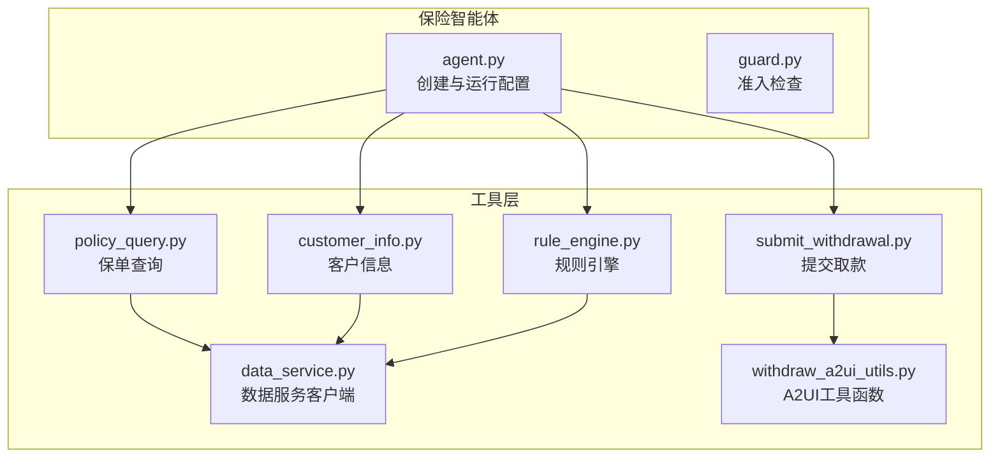
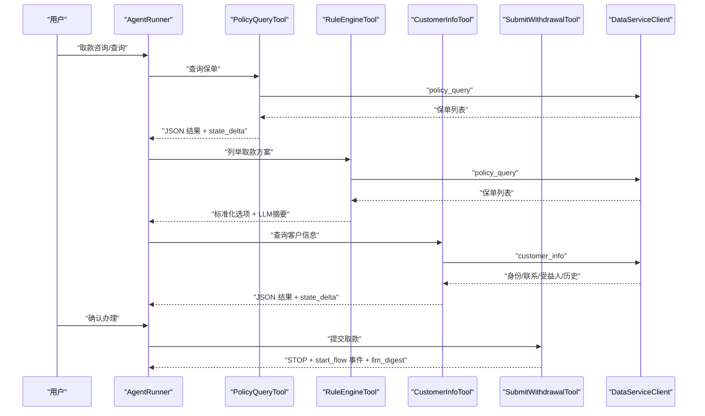
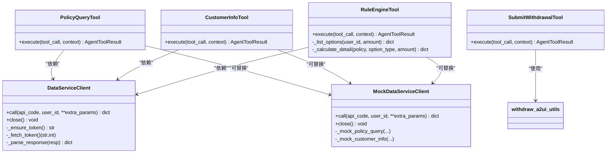

# 保险工具系统

<cite>
**本文档引用的文件**
- [customer_info.py](file://src/ark_agentic/agents/insurance/tools/customer_info.py)
- [policy_query.py](file://src/ark_agentic/agents/insurance/tools/policy_query.py)
- [data_service.py](file://src/ark_agentic/agents/insurance/tools/data_service.py)
- [rule_engine.py](file://src/ark_agentic/agents/insurance/tools/rule_engine.py)
- [submit_withdrawal.py](file://src/ark_agentic/agents/insurance/tools/submit_withdrawal.py)
- [agent.py](file://src/ark_agentic/agents/insurance/agent.py)
- [guard.py](file://src/ark_agentic/agents/insurance/guard.py)
- [withdraw_a2ui_utils.py](file://src/ark_agentic/agents/insurance/a2ui/withdraw_a2ui_utils.py)
- [__init__.py（保险工具包）](file://src/ark_agentic/agents/insurance/tools/__init__.py)
- [test_rule_engine.py](file://tests/unit/agents/insurance/test_rule_engine.py)
- [test_submit_withdrawal.py](file://tests/unit/agents/insurance/test_submit_withdrawal.py)
</cite>

## 目录
1. [简介](#简介)
2. [项目结构](#项目结构)
3. [核心组件](#核心组件)
4. [架构概览](#架构概览)
5. [详细组件分析](#详细组件分析)
6. [依赖分析](#依赖分析)
7. [性能考量](#性能考量)
8. [故障排查指南](#故障排查指南)
9. [结论](#结论)
10. [附录](#附录)

## 简介
本文件面向保险工具系统的技术文档，聚焦于保险领域专用工具的设计理念与实现细节，覆盖以下核心能力：
- 客户信息查询：身份、联系方式、受益人、交易与服务历史
- 保单数据服务：保单列表、详情、现金价值与可取款额度
- 规则引擎：基于保单四类可用金额与费率的取款方案计算与对比
- 撤保/取款申请提交：在用户确认后，驱动业务流程并跨轮续办

文档同时提供输入输出规范、参数校验、错误处理机制、最佳实践、开发与扩展指南以及调试技巧，并结合保险业务场景的特殊要求与实现约束进行说明。

## 项目结构
保险工具系统位于 agents/insurance 子模块中，采用“按功能域分层”的组织方式：
- tools：工具实现（数据服务客户端、查询工具、规则引擎、提交工具）
- a2ui：与取款相关的 A2UI 组件与工具函数
- agent：保险智能体装配与运行配置
- guard：准入检查（业务范围过滤）

图表来源
- [agent.py:1-143](file://src/ark_agentic/agents/insurance/agent.py#L1-L143)
- [guard.py:1-164](file://src/ark_agentic/agents/insurance/guard.py#L1-L164)
- [policy_query.py:1-77](file://src/ark_agentic/agents/insurance/tools/policy_query.py#L1-L77)
- [customer_info.py:1-94](file://src/ark_agentic/agents/insurance/tools/customer_info.py#L1-L94)
- [rule_engine.py:1-445](file://src/ark_agentic/agents/insurance/tools/rule_engine.py#L1-L445)
- [submit_withdrawal.py:1-214](file://src/ark_agentic/agents/insurance/tools/submit_withdrawal.py#L1-L214)
- [data_service.py:1-452](file://src/ark_agentic/agents/insurance/tools/data_service.py#L1-L452)
- [withdraw_a2ui_utils.py:1-123](file://src/ark_agentic/agents/insurance/a2ui/withdraw_a2ui_utils.py#L1-L123)

章节来源
- [agent.py:1-143](file://src/ark_agentic/agents/insurance/agent.py#L1-L143)
- [__init__.py（保险工具包）:1-97](file://src/ark_agentic/agents/insurance/tools/__init__.py#L1-L97)

## 核心组件
- 数据服务客户端：统一 OAuth 认证、表单请求与响应解析，支持真实调用与 Mock 模式
- 保单查询工具：基于数据服务 API 获取保单列表与可用金额
- 客户信息工具：按类型查询身份、联系、受益人、交易与服务记录
- 规则引擎工具：标准化每张保单的四类可用金额与费率，支持方案列举与单渠道详算
- 提交取款工具：从会话状态提取方案分配，生成业务流程事件并跨轮续办

章节来源
- [data_service.py:22-452](file://src/ark_agentic/agents/insurance/tools/data_service.py#L22-L452)
- [policy_query.py:25-77](file://src/ark_agentic/agents/insurance/tools/policy_query.py#L25-L77)
- [customer_info.py:26-94](file://src/ark_agentic/agents/insurance/tools/customer_info.py#L26-L94)
- [rule_engine.py:99-445](file://src/ark_agentic/agents/insurance/tools/rule_engine.py#L99-L445)
- [submit_withdrawal.py:136-214](file://src/ark_agentic/agents/insurance/tools/submit_withdrawal.py#L136-L214)

## 架构概览
系统以 AgentRunner 为核心，注册保险专用工具集，结合 A2UI 渲染与状态管理，完成从“查询—计算—确认—提交”的闭环。

图表来源
- [agent.py:47-143](file://src/ark_agentic/agents/insurance/agent.py#L47-L143)
- [policy_query.py:55-77](file://src/ark_agentic/agents/insurance/tools/policy_query.py#L55-L77)
- [rule_engine.py:155-204](file://src/ark_agentic/agents/insurance/tools/rule_engine.py#L155-L204)
- [customer_info.py:69-94](file://src/ark_agentic/agents/insurance/tools/customer_info.py#L69-L94)
- [submit_withdrawal.py:152-214](file://src/ark_agentic/agents/insurance/tools/submit_withdrawal.py#L152-L214)
- [data_service.py:73-129](file://src/ark_agentic/agents/insurance/tools/data_service.py#L73-L129)

## 详细组件分析

### 数据服务客户端（DataServiceClient/MockDataServiceClient）
职责与特性
- OAuth token 获取与缓存（5 分钟有效期，预留 30 秒安全余量）
- 统一 form-urlencoded POST 请求与响应解析（嵌套 JSON data.Data）
- 支持真实客户端与 Mock 客户端（通过环境变量开关）
- 异常封装为 DataServiceError，便于上层工具捕获

输入/输出与参数
- 输入：api_code（"policy_query" 或 "customer_info"）、user_id、额外表单参数
- 输出：解析后的业务数据字典（data.Data -> dict）
- 异常：HTTP/请求错误、认证失败、空 token、响应解析失败

错误处理
- HTTPStatusError：映射为 DataServiceError（含状态码与截断响应）
- RequestError：映射为 DataServiceError（请求失败）
- 认证失败：ret 非 0 或空 token
- 响应解析：尝试 text 解析与二次 JSON 解析兜底

最佳实践
- 通过 get_data_service_client 单例获取客户端，避免重复实例
- 在测试中可通过 DATA_SERVICE_MOCK=true 切换 Mock 模式
- 注意 token 过期策略与安全余量，避免频繁刷新

章节来源
- [data_service.py:22-452](file://src/ark_agentic/agents/insurance/tools/data_service.py#L22-L452)

### 保单查询工具（PolicyQueryTool）
功能概述
- 通过数据服务 API 获取用户保单列表与可用金额
- 将结果写入会话状态，供后续工具复用

输入/输出
- 参数：user_id（必填）、query_type（枚举，当前为 "list"）
- 输出：包含 policyAssertList 的字典（每条记录含保单 ID、产品名称、生效日期、四类可用金额等）

错误处理
- 捕获 DataServiceError 并返回 ERROR 类型结果

最佳实践
- 保持 query_type 的一致性，避免额外参数导致 API 不兼容
- 在 A2UI 渲染前确保已调用并写入状态

章节来源
- [policy_query.py:25-77](file://src/ark_agentic/agents/insurance/tools/policy_query.py#L25-L77)

### 客户信息工具（CustomerInfoTool）
功能概述
- 支持多种信息类型查询：身份、联系、受益人、交易历史、服务记录、完整信息
- 受益人查询可选传入 policy_id 进行定向检索

输入/输出
- 参数：user_id（必填）、info_type（枚举）、policy_id（可选）
- 输出：按 info_type 返回对应结构（如 identity/contact/beneficiaries/transactions/services/full）

错误处理
- 捕获 DataServiceError 并返回 ERROR 类型结果

最佳实践
- 受益人查询建议携带 policy_id 以提高准确性
- 完整信息适合首次交互时一次性拉取，减少多次调用

章节来源
- [customer_info.py:26-94](file://src/ark_agentic/agents/insurance/tools/customer_info.py#L26-L94)

### 规则引擎工具（RuleEngineTool）
功能概述
- list_options：接收 user_id，自动获取保单数据，标准化为每张保单一条记录，包含四类可用金额与费率
- calculate_detail：对单张保单的某个取款渠道进行详细费用计算（含手续费、利息、到账时效、保障影响）

业务规则
- 贷款年利率固定为 5%
- 部分领取手续费率按保单年度递减（第1年 3%、第2年 2%、第3-5年 1%、第6年起 0%）
- 统一到账时效为 1-3 个工作日

输入/输出
- list_options 参数：action="list_options"、user_id（必填）、amount（可选）
- calculate_detail 参数：action="calculate_detail"、policy（必填，标准化或原始字段名均可）、option_type（枚举）、amount（可选）
- 输出：list_options 返回 options 列表与汇总统计；calculate_detail 返回单渠道费用明细与影响说明

错误处理
- list_options 捕获 DataServiceError 并返回 ERROR
- calculate_detail 参数缺失时返回 ERROR

最佳实践
- 使用 _build_llm_summary 生成 LLM 友好摘要，隐藏保单级细节
- 支持原始字段名与标准化字段名，提升兼容性
- amount 可为负数或 0，便于边界测试与业务层进一步校验

章节来源
- [rule_engine.py:99-445](file://src/ark_agentic/agents/insurance/tools/rule_engine.py#L99-L445)
- [withdraw_a2ui_utils.py:55-123](file://src/ark_agentic/agents/insurance/a2ui/withdraw_a2ui_utils.py#L55-L123)

### 提交取款工具（SubmitWithdrawalTool）
功能概述
- 用户确认后，从会话状态读取 _plan_allocations，解析对应渠道的保单与金额
- 检测同一方案中尚未提交的渠道，写入 _submitted_channels，作为跨轮续办依据
- 发送 CUSTOM 事件（start_flow）到前端，携带 flow_type 与 query_msg
- 返回 STOP，停止 agent 循环，并在 STOP content 中提示剩余渠道

输入/输出
- 参数：operation_type（枚举，映射到渠道与流程）
- 输出：JSON 结果（含 STOP 消息、事件、llm_digest、state_delta）

映射关系
- operation_type -> channel -> flow_type：
  - shengcunjin -> survival_fund -> shengcunjin-claim-E031
  - bonus -> bonus -> bonus-claim
  - loan -> policy_loan -> E027Flow
  - partial -> partial_withdrawal -> U045Flow
  - surrender -> surrender -> surrender

错误处理
- 未知 operation_type：ERROR
- 通道重复提交：返回提示并 STOP，不更新状态
- 状态缺失或无分配：ERROR

最佳实践
- 在 A2UI 渲染后，确保 _plan_allocations 与 _submitted_channels 正确写入状态
- llm_digest 用于后续步骤的续办判定，需保持稳定格式

章节来源
- [submit_withdrawal.py:136-214](file://src/ark_agentic/agents/insurance/tools/submit_withdrawal.py#L136-L214)

### 保险智能体与准入检查
- create_insurance_agent：装配工具、会话、记忆、技能与主动服务 Job，设置系统协议与采样配置
- InsuranceIntakeGuard：基于 LLM 的业务范围准入检查，temperature=0，结合正则与 few-shot 示例，确保确定性

章节来源
- [agent.py:47-143](file://src/ark_agentic/agents/insurance/agent.py#L47-L143)
- [guard.py:71-164](file://src/ark_agentic/agents/insurance/guard.py#L71-L164)

## 依赖分析
组件间耦合与协作
- PolicyQueryTool/CustomerInfoTool/RuleEngineTool 均依赖 DataServiceClient/MockDataServiceClient
- SubmitWithdrawalTool 依赖 A2UI 工具函数（渠道可用性、分配与消息构建）
- AgentRunner 注册工具集合，统一调度与状态管理

图表来源
- [data_service.py:22-452](file://src/ark_agentic/agents/insurance/tools/data_service.py#L22-L452)
- [policy_query.py:25-77](file://src/ark_agentic/agents/insurance/tools/policy_query.py#L25-L77)
- [customer_info.py:26-94](file://src/ark_agentic/agents/insurance/tools/customer_info.py#L26-L94)
- [rule_engine.py:99-445](file://src/ark_agentic/agents/insurance/tools/rule_engine.py#L99-L445)
- [submit_withdrawal.py:136-214](file://src/ark_agentic/agents/insurance/tools/submit_withdrawal.py#L136-L214)
- [withdraw_a2ui_utils.py:55-123](file://src/ark_agentic/agents/insurance/a2ui/withdraw_a2ui_utils.py#L55-L123)

## 性能考量
- Token 缓存与安全余量：避免频繁认证请求，降低延迟与外部依赖压力
- 单例客户端：通过 get_data_service_client 复用 HTTP 客户端，减少连接开销
- 响应解析优化：优先使用 data.Data 字段，失败时回退至 text 解析，兼顾健壮性
- 规则计算批量化：list_options 一次性获取并排序，减少重复查询
- A2UI 渲染与状态写入：避免重复渲染与状态冗余，提升用户体验

## 故障排查指南
常见问题与定位
- 认证失败或空 token
  - 现象：DataServiceError，ret 非 0 或空 access_token
  - 排查：检查 DATA_SERVICE_AUTH_URL、client_id/secret、grant_type
- HTTP 状态码异常
  - 现象：HTTPStatusError，响应文本截断
  - 排查：查看具体状态码与响应内容，确认 API 可用性
- 请求超时或网络错误
  - 现象：RequestError
  - 排查：检查网络连通性、代理设置与超时配置
- 规则引擎参数缺失
  - 现象：calculate_detail 返回 ERROR
  - 排查：确认 policy、option_type、amount 是否正确传入
- 提交取款重复操作
  - 现象：返回“已提交办理”提示
  - 排查：检查 _submitted_channels 状态是否正确写入

单元测试参考
- 规则引擎金额处理：支持负数与 0，确保边界行为符合预期
- 提交取款状态与剩余渠道检测：验证跨轮续办逻辑与去重

章节来源
- [test_rule_engine.py:14-72](file://tests/unit/agents/insurance/test_rule_engine.py#L14-L72)
- [test_submit_withdrawal.py:222-525](file://tests/unit/agents/insurance/test_submit_withdrawal.py#L222-L525)

## 结论
保险工具系统围绕“查询—计算—确认—提交”闭环设计，通过统一的数据服务客户端与工具抽象，实现高内聚、低耦合的保险业务处理链路。规则引擎与 A2UI 工具函数共同提升用户体验与业务可控性。建议在生产环境中启用 Mock 模式进行充分测试，在变更 API 与字段映射时严格维护兼容性与稳定性。

## 附录

### 工具开发指南
- 新增工具步骤
  - 继承 AgentTool，定义 name/description/thinking_hint/group 与参数列表
  - 在 tools/__init__.py 中注册工具工厂与 A2UI 渲染工具
  - 如需访问数据服务，注入 DataServiceClient 或 MockDataServiceClient
- 参数校验与错误处理
  - 使用 read_*_param 系列函数读取参数，必要时抛出明确错误
  - 对外部依赖异常进行 DataServiceError 包装，统一返回 AgentToolResult.error_result
- 状态管理
  - 通过 metadata.state_delta 写入会话状态键，供后续工具读取
  - llm_digest 用于跨轮沟通，保持格式稳定
- A2UI 集成
  - 使用 RenderA2UITool 与 withdraw_a2ui_utils 提供的工具函数，确保渠道与分配逻辑一致

### 扩展方法
- 新增取款渠道
  - 在 _ALL_CHANNELS 与映射表中添加新渠道，更新规则引擎与提交工具的枚举与映射
  - 补充费率与影响说明，保证 calculate_detail 的完整性
- 新增查询类型
  - 在数据服务侧新增 API 后，扩展 DataServiceClient 与相应工具的参数与输出
- 主动服务
  - 借助 InsuranceProactiveJob 与 AgentRunner 的主动任务机制，实现周期性提醒与跟进

### 调试技巧
- Mock 模式：设置 DATA_SERVICE_MOCK=true，快速验证工具链路与 UI 渲染
- 日志级别：适当提高工具日志级别，观察参数解析与状态写入
- 单元测试：针对边界条件（负数、0、空结果）编写测试，确保健壮性
- 状态追踪：在 A2UI 渲染前后打印状态键，确认 _plan_allocations 与 _submitted_channels 的一致性