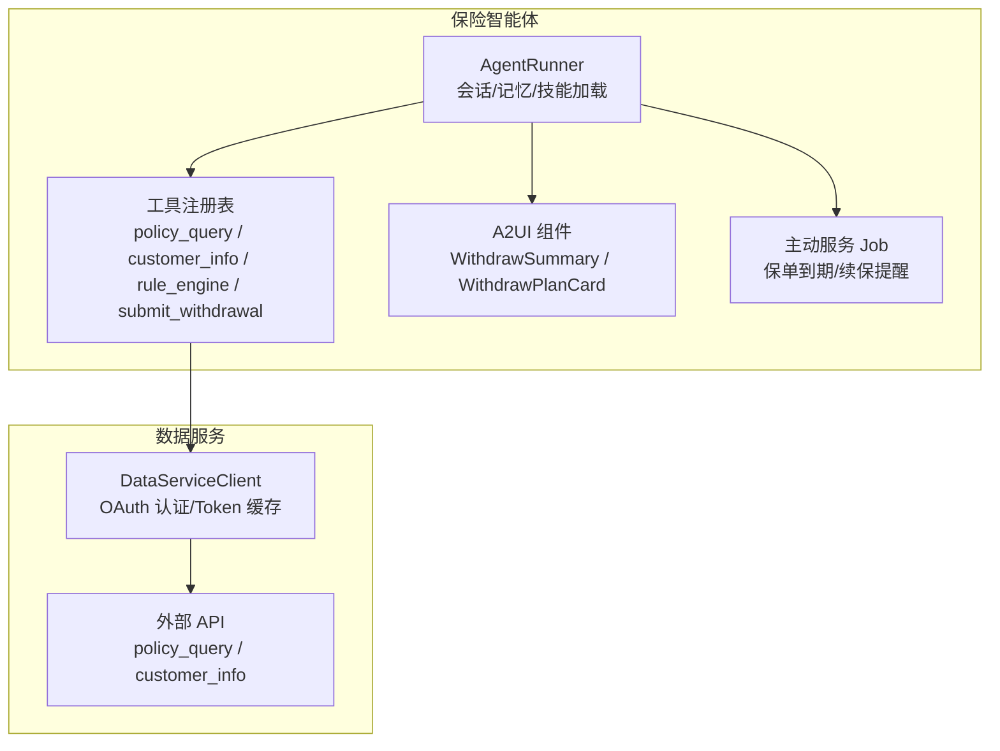
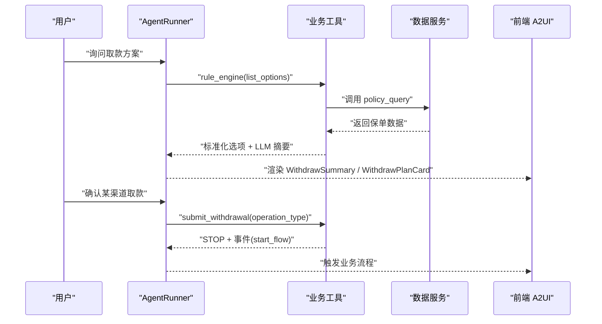
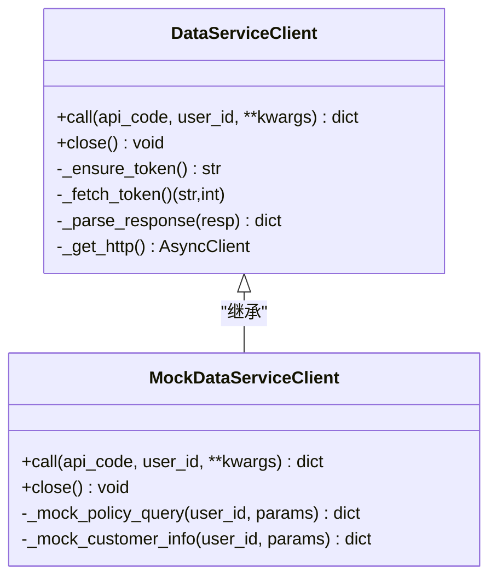
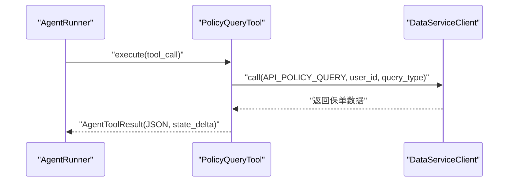
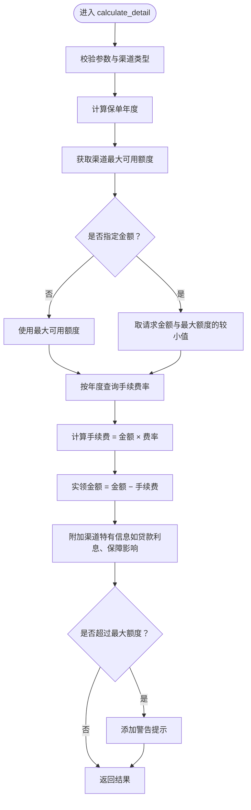
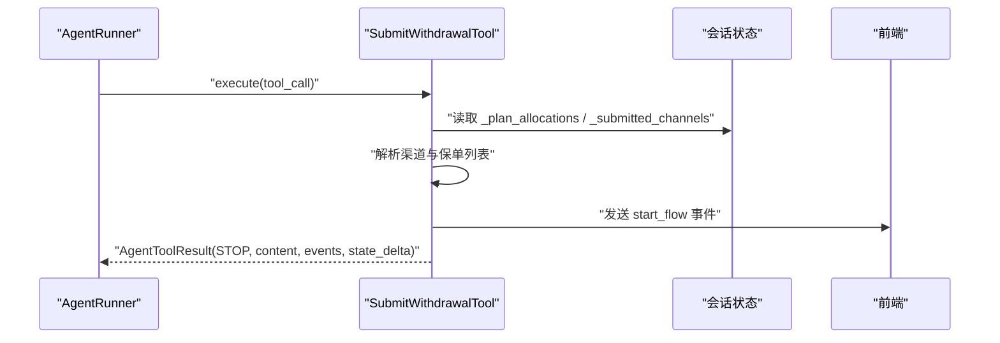
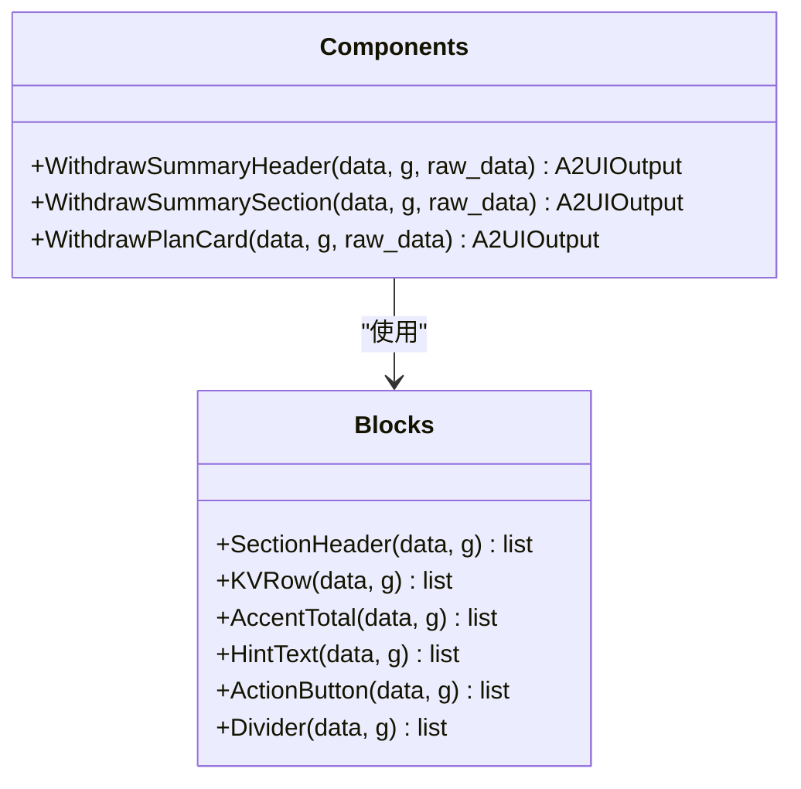
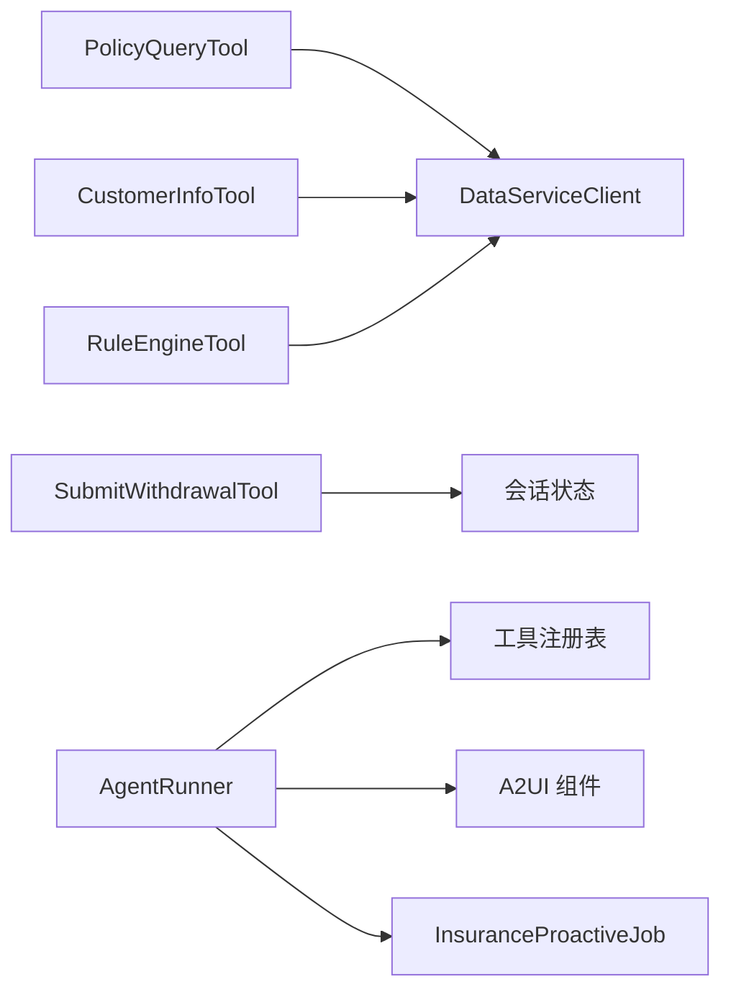

# 保险技能系统

<cite>
**本文档引用的文件**
- [agent.py](file://src/ark_agentic/agents/insurance/agent.py)
- [agent.json](file://src/ark_agentic/agents/insurance/agent.json)
- [proactive_job.py](file://src/ark_agentic/agents/insurance/proactive_job.py)
- [tools/data_service.py](file://src/ark_agentic/agents/insurance/tools/data_service.py)
- [tools/policy_query.py](file://src/ark_agentic/agents/insurance/tools/policy_query.py)
- [tools/customer_info.py](file://src/ark_agentic/agents/insurance/tools/customer_info.py)
- [tools/rule_engine.py](file://src/ark_agentic/agents/insurance/tools/rule_engine.py)
- [tools/submit_withdrawal.py](file://src/ark_agentic/agents/insurance/tools/submit_withdrawal.py)
- [a2ui/components.py](file://src/ark_agentic/agents/insurance/a2ui/components.py)
- [a2ui/blocks.py](file://src/ark_agentic/agents/insurance/a2ui/blocks.py)
</cite>

## 目录
1. [简介](#简介)
2. [项目结构](#项目结构)
3. [核心组件](#核心组件)
4. [架构概览](#架构概览)
5. [详细组件分析](#详细组件分析)
6. [依赖分析](#依赖分析)
7. [性能考虑](#性能考虑)
8. [故障排除指南](#故障排除指南)
9. [结论](#结论)
10. [附录](#附录)

## 简介
本文件面向保险技能系统的开发者与维护者，系统性阐述保险领域专用技能的设计架构与实现原理。重点覆盖两大核心业务场景：
- 撤保执行技能：面向退保（surrender）等高风险操作的确认与执行流程
- 资金提取技能：面向生存金领取、红利领取、保单贷款、部分领取等低风险操作的确认与执行流程

文档将详细说明技能的配置方式、参数传递、结果处理与异常管理，并提供开发规范、扩展指南与性能优化建议，帮助在保险业务场景下高效、安全地实现与演进技能系统。

## 项目结构
保险技能系统位于 `src/ark_agentic/agents/insurance/` 目录下，采用“工具-组件-代理”的分层组织方式：
- 工具层：封装数据服务调用与业务工具（保单查询、客户信息、规则引擎、撤保/取款提交）
- 组件层：负责 A2UI 卡片渲染与对话上下文摘要（WithdrawSummary、WithdrawPlanCard 等）
- 代理层：装配工具与技能，配置会话、记忆与主动服务

**图表来源**
- [agent.py:47-143](file://src/ark_agentic/agents/insurance/agent.py#L47-L143)
- [tools/data_service.py:22-129](file://src/ark_agentic/agents/insurance/tools/data_service.py#L22-L129)

**章节来源**
- [agent.py:38-143](file://src/ark_agentic/agents/insurance/agent.py#L38-L143)
- [agent.json:1-8](file://src/ark_agentic/agents/insurance/agent.json#L1-L8)

## 核心组件
- 数据服务客户端：统一管理认证与调用，支持真实环境与 Mock 模式
- 业务工具：保单查询、客户信息、规则引擎、撤保/取款提交
- A2UI 组件：取款方案卡片、汇总卡片与区块构建器
- 代理运行器：装配工具、加载技能、配置会话与记忆

**章节来源**
- [tools/data_service.py:22-452](file://src/ark_agentic/agents/insurance/tools/data_service.py#L22-L452)
- [tools/policy_query.py:25-77](file://src/ark_agentic/agents/insurance/tools/policy_query.py#L25-L77)
- [tools/customer_info.py:26-94](file://src/ark_agentic/agents/insurance/tools/customer_info.py#L26-L94)
- [tools/rule_engine.py:99-445](file://src/ark_agentic/agents/insurance/tools/rule_engine.py#L99-L445)
- [tools/submit_withdrawal.py:136-214](file://src/ark_agentic/agents/insurance/tools/submit_withdrawal.py#L136-L214)
- [a2ui/components.py:69-470](file://src/ark_agentic/agents/insurance/a2ui/components.py#L69-L470)
- [a2ui/blocks.py:25-145](file://src/ark_agentic/agents/insurance/a2ui/blocks.py#L25-L145)
- [agent.py:47-143](file://src/ark_agentic/agents/insurance/agent.py#L47-L143)

## 架构概览
保险技能系统围绕“工具-代理-前端 A2UI”三层协作：
- 工具层负责与外部数据服务交互，封装认证、参数与响应解析
- 代理层负责工具注册、技能加载、会话管理与记忆蒸馏
- A2UI 层负责将业务数据转化为卡片与摘要，驱动用户交互与后续工具调用

**图表来源**
- [tools/rule_engine.py:155-203](file://src/ark_agentic/agents/insurance/tools/rule_engine.py#L155-L203)
- [tools/submit_withdrawal.py:152-213](file://src/ark_agentic/agents/insurance/tools/submit_withdrawal.py#L152-L213)
- [a2ui/components.py:462-466](file://src/ark_agentic/agents/insurance/a2ui/components.py#L462-L466)

## 详细组件分析

### 数据服务客户端（DataServiceClient）
- 职责
  - OAuth 令牌获取与缓存（5 分钟有效期，预留 30 秒安全余量）
  - 统一 form-urlencoded 请求与响应解析（支持 data.Data 嵌套结构）
  - 支持真实环境与 Mock 模式（通过环境变量开关）
- 关键行为
  - call(api_code, user_id, **extra_params)：构造请求参数并发起调用
  - _ensure_token/_fetch_token：令牌刷新与校验
  - _parse_response：两层 JSON 解析与容错
- 异常处理
  - httpx.HTTPStatusError/RequestError：包装为 DataServiceError
  - 认证失败：ret 非 0 或 access_token 为空时抛出异常

**图表来源**
- [tools/data_service.py:22-452](file://src/ark_agentic/agents/insurance/tools/data_service.py#L22-L452)

**章节来源**
- [tools/data_service.py:22-129](file://src/ark_agentic/agents/insurance/tools/data_service.py#L22-L129)
- [tools/data_service.py:139-194](file://src/ark_agentic/agents/insurance/tools/data_service.py#L139-L194)
- [tools/data_service.py:197-224](file://src/ark_agentic/agents/insurance/tools/data_service.py#L197-L224)
- [tools/data_service.py:236-452](file://src/ark_agentic/agents/insurance/tools/data_service.py#L236-L452)

### 保单查询工具（PolicyQueryTool）
- 功能：查询用户保单列表、详情、现金价值与可取款额度
- 参数：user_id（必填）、query_type（枚举：list）
- 行为：调用数据服务 API，捕获 DataServiceError 并返回错误结果
- 输出：将结果写入会话状态，便于后续工具读取

**图表来源**
- [tools/policy_query.py:55-77](file://src/ark_agentic/agents/insurance/tools/policy_query.py#L55-L77)
- [tools/data_service.py:73-129](file://src/ark_agentic/agents/insurance/tools/data_service.py#L73-L129)

**章节来源**
- [tools/policy_query.py:25-77](file://src/ark_agentic/agents/insurance/tools/policy_query.py#L25-L77)

### 客户信息工具（CustomerInfoTool）
- 功能：查询客户身份、联系方式、受益人、交易与服务记录
- 参数：user_id（必填）、info_type（枚举：identity/contact/beneficiary/transaction_history/service_history/full）、policy_id（可选）
- 行为：根据 info_type 与 policy_id 组装请求参数，调用数据服务 API

**章节来源**
- [tools/customer_info.py:26-94](file://src/ark_agentic/agents/insurance/tools/customer_info.py#L26-L94)

### 规则引擎工具（RuleEngineTool）
- 功能
  - list_options：自动获取用户保单数据，标准化为每张保单一条记录，包含四个可用金额字段与费率信息
  - calculate_detail：对单张保单的某个取款渠道进行详细费用计算（含手续费、利息、到账时间、保障影响）
- 业务规则
  - 保单贷款固定年利率 5%
  - 部分领取手续费率按保单年度递减（第1年 3%，第2年 2%，第3-5年 1%，第6年起 0%）
  - 统一到账时间 1-3个工作日
- 输出
  - list_options：写入会话状态并生成 LLM 摘要（渠道级汇总）
  - calculate_detail：返回详细费用计算结果（含 coverage_impact）

**图表来源**
- [tools/rule_engine.py:338-445](file://src/ark_agentic/agents/insurance/tools/rule_engine.py#L338-L445)

**章节来源**
- [tools/rule_engine.py:99-203](file://src/ark_agentic/agents/insurance/tools/rule_engine.py#L99-L203)
- [tools/rule_engine.py:209-301](file://src/ark_agentic/agents/insurance/tools/rule_engine.py#L209-L301)
- [tools/rule_engine.py:338-445](file://src/ark_agentic/agents/insurance/tools/rule_engine.py#L338-L445)

### 撤保/取款提交工具（SubmitWithdrawalTool）
- 功能：用户确认取款后，提交相应业务流程
- 关键映射
  - operation_type ↔ 渠道/业务流：生存金领取、红利领取、保单贷款、部分领取、退保
  - 渠道中文名：用于 STOP 消息与前端事件
- 流程
  - 从会话状态读取 _plan_allocations，定位对应渠道的保单与金额
  - 检查是否已提交，避免重复操作
  - 计算剩余渠道，生成 STOP 消息与 LLM digest
  - 发送自定义事件 start_flow，携带业务流类型与查询语句
  - 返回 AgentToolResult（STOP + 事件 + 状态增量）

**图表来源**
- [tools/submit_withdrawal.py:152-213](file://src/ark_agentic/agents/insurance/tools/submit_withdrawal.py#L152-L213)

**章节来源**
- [tools/submit_withdrawal.py:136-214](file://src/ark_agentic/agents/insurance/tools/submit_withdrawal.py#L136-L214)

### A2UI 组件与区块
- 组件
  - WithdrawSummaryHeader：展示总览卡片，支持是否包含贷款的合计显示
  - WithdrawSummarySection：按板块展示各保单可领明细
  - WithdrawPlanCard：按目标金额在候选渠道自动分配，生成方案与按钮
- 区块
  - SectionHeader/KVRow/AccentTotal/HintText/ActionButton/Divider：通用布局与样式
- 交互
  - 组件输出包含：components（UI）、llm_digest（对话摘要）、state_delta（会话状态增量）

**图表来源**
- [a2ui/components.py:69-470](file://src/ark_agentic/agents/insurance/a2ui/components.py#L69-L470)
- [a2ui/blocks.py:25-145](file://src/ark_agentic/agents/insurance/a2ui/blocks.py#L25-L145)

**章节来源**
- [a2ui/components.py:69-470](file://src/ark_agentic/agents/insurance/a2ui/components.py#L69-L470)
- [a2ui/blocks.py:25-145](file://src/ark_agentic/agents/insurance/a2ui/blocks.py#L25-L145)

### 主动服务 Job（InsuranceProactiveJob）
- 职责：定时扫描用户记忆，识别保险相关提醒意图（到期、续保、理赔、保费等）
- 流程：关键词过滤 → LLM 意图提取 → 调用 policy_query 获取实时数据 → 格式化通知
- 集成：在代理运行器中配置，随 runner 调度执行

**章节来源**
- [proactive_job.py:59-174](file://src/ark_agentic/agents/insurance/proactive_job.py#L59-L174)

## 依赖分析
- 工具依赖
  - PolicyQueryTool/CustomerInfoTool 依赖 DataServiceClient/MockDataServiceClient
  - RuleEngineTool 依赖数据服务与 A2UI 工具函数（渠道可用性计算）
  - SubmitWithdrawalTool 依赖会话状态与 A2UI 映射表
- 代理依赖
  - AgentRunner 注册保险工具，加载技能目录，配置会话与记忆
- 外部依赖
  - httpx（异步 HTTP 客户端）
  - 环境变量（DATA_SERVICE_*、DATA_SERVICE_MOCK）

**图表来源**
- [tools/policy_query.py:52-53](file://src/ark_agentic/agents/insurance/tools/policy_query.py#L52-L53)
- [tools/customer_info.py:66-67](file://src/ark_agentic/agents/insurance/tools/customer_info.py#L66-L67)
- [tools/rule_engine.py:150-153](file://src/ark_agentic/agents/insurance/tools/rule_engine.py#L150-L153)
- [tools/submit_withdrawal.py:155-156](file://src/ark_agentic/agents/insurance/tools/submit_withdrawal.py#L155-L156)
- [agent.py:74-75](file://src/ark_agentic/agents/insurance/agent.py#L74-L75)

**章节来源**
- [agent.py:74-102](file://src/ark_agentic/agents/insurance/agent.py#L74-L102)

## 性能考虑
- Token 缓存与复用：DataServiceClient 对 access_token 进行缓存并在过期前 30 秒刷新，减少认证开销
- 异步 I/O：使用 httpx.AsyncClient，提升并发请求能力
- 响应解析容错：两层 JSON 解析与 fallback 机制，增强稳定性
- 会话状态增量：工具仅写入必要字段，降低上下文膨胀
- 主动服务批处理：关键词快速过滤 + LLM 意图提取，避免对每个用户进行昂贵的全量分析

[本节为通用性能指导，不直接分析具体文件]

## 故障排除指南
- 数据服务调用失败
  - 现象：返回 DataServiceError
  - 排查：检查 DATA_SERVICE_AUTH_URL/DATA_SERVICE_URL 等环境变量配置
  - 处理：开启 DATA_SERVICE_MOCK=true 使用 MockDataServiceClient 进行本地调试
- 认证失败
  - 现象：ret 非 0 或 access_token 为空
  - 排查：核对 client_id/client_secret/grant_type
- 规则引擎计算异常
  - 现象：calculate_detail 返回 error
  - 排查：确认 policy 字段名兼容（标准化字段名与原始字段名均支持）
- 提交工具重复操作
  - 现象：返回已提交提示
  - 处理：检查 _submitted_channels 状态是否正确更新

**章节来源**
- [tools/data_service.py:121-127](file://src/ark_agentic/agents/insurance/tools/data_service.py#L121-L127)
- [tools/data_service.py:182-194](file://src/ark_agentic/agents/insurance/tools/data_service.py#L182-L194)
- [tools/rule_engine.py:380-398](file://src/ark_agentic/agents/insurance/tools/rule_engine.py#L380-L398)
- [tools/submit_withdrawal.py:167-173](file://src/ark_agentic/agents/insurance/tools/submit_withdrawal.py#L167-L173)

## 结论
保险技能系统通过“工具-组件-代理”的清晰分层，实现了从数据查询、规则计算到业务提交与前端交互的闭环。系统在安全性（重复提交防护）、可扩展性（Mock 模式、通道映射）与可观测性（LLM 摘要、事件驱动）方面具备良好设计。建议在新增技能时遵循统一的参数规范、错误处理与状态增量模式，确保与现有组件的协同与一致性。

[本节为总结性内容，不直接分析具体文件]

## 附录

### 技能开发规范
- 参数设计
  - 必填参数使用 required=True，并提供明确描述
  - 枚举参数使用 enum 列表，避免歧义
- 错误处理
  - 捕获并包装外部异常为统一错误结果
  - 返回 AgentToolResult.error_result，包含 tool_call_id 与错误信息
- 结果输出
  - JSON 结果使用 AgentToolResult.json_result
  - 会话状态增量通过 metadata.state_delta 传递
  - LLM 摘要通过 llm_digest 传递，便于对话上下文压缩
- 事件与交互
  - 需要前端联动时，通过 events.CustomToolEvent 发送自定义事件
  - 使用 ToolLoopAction.STOP 控制代理循环

**章节来源**
- [tools/policy_query.py:55-77](file://src/ark_agentic/agents/insurance/tools/policy_query.py#L55-L77)
- [tools/submit_withdrawal.py:152-213](file://src/ark_agentic/agents/insurance/tools/submit_withdrawal.py#L152-L213)

### 扩展指南
- 新增取款渠道
  - 在映射表中增加 operation_type → 渠道/业务流的映射
  - 在 A2UI 中扩展区块与组件以支持新渠道的展示
- 新增业务工具
  - 继承 AgentTool，定义参数与执行逻辑
  - 通过 ToolRegistry.register_all 注册到代理
- 新增主动提醒场景
  - 在 InsuranceProactiveJob 中扩展关键词与意图映射
  - 增加对应的查询类型与通知格式化逻辑

**章节来源**
- [tools/submit_withdrawal.py:27-49](file://src/ark_agentic/agents/insurance/tools/submit_withdrawal.py#L27-L49)
- [proactive_job.py:71-134](file://src/ark_agentic/agents/insurance/proactive_job.py#L71-L134)
- [agent.py:74-75](file://src/ark_agentic/agents/insurance/agent.py#L74-L75)