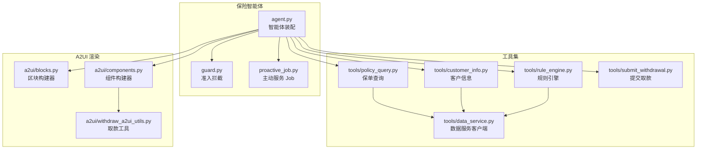
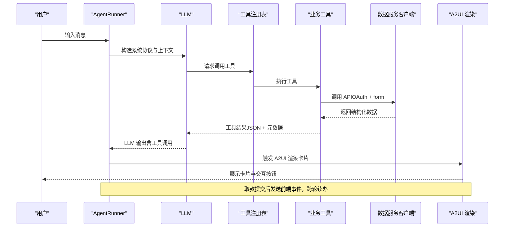
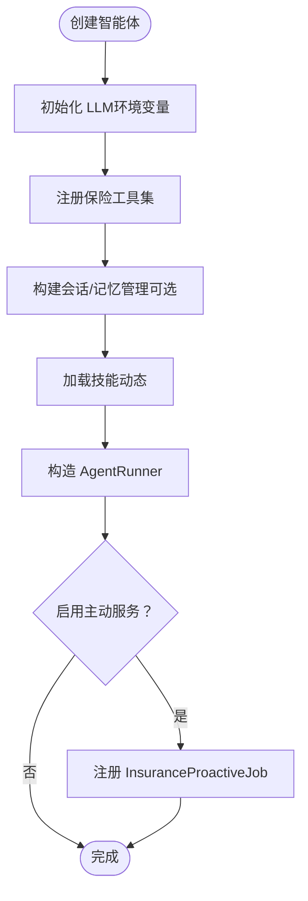
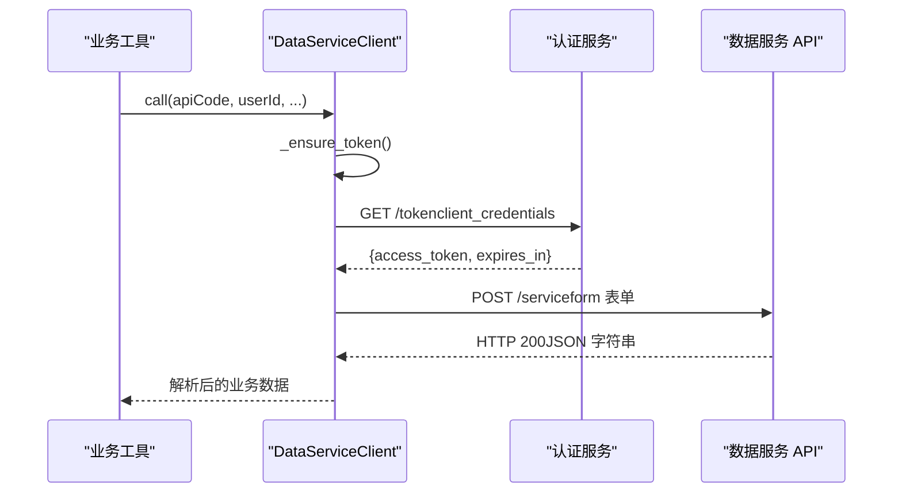
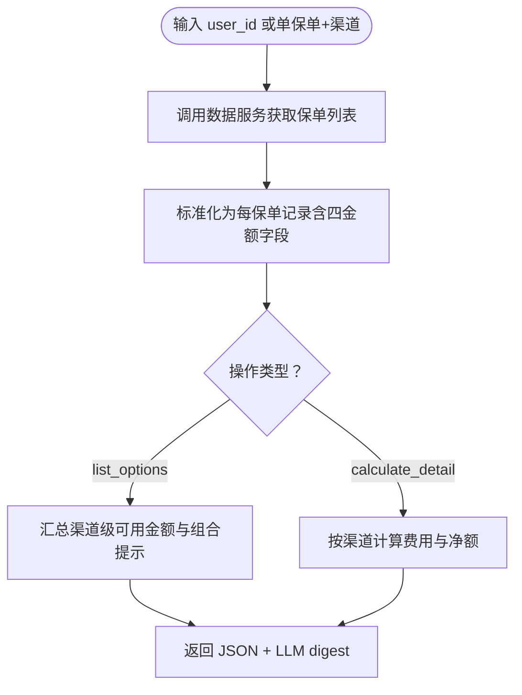
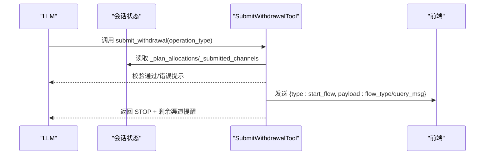
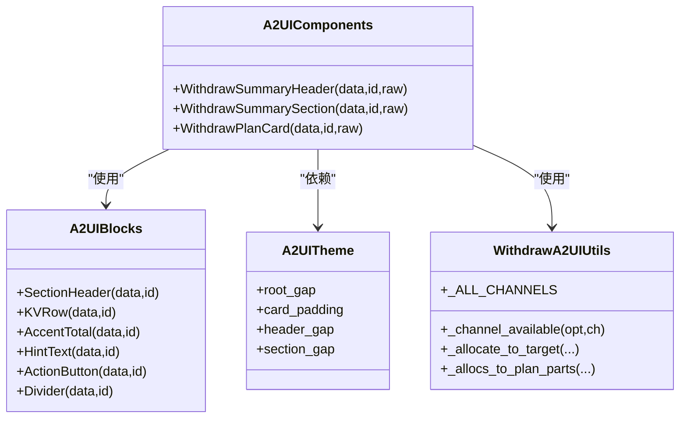
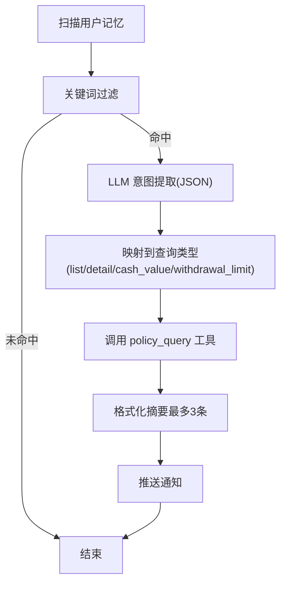
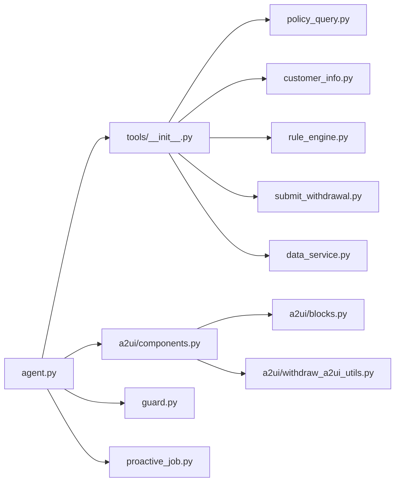

# 保险智能体

<cite>
**本文引用的文件**
- [agent.py](file://src/ark_agentic/agents/insurance/agent.py)
- [guard.py](file://src/ark_agentic/agents/insurance/guard.py)
- [agent.json](file://src/ark_agentic/agents/insurance/agent.json)
- [tools/__init__.py](file://src/ark_agentic/agents/insurance/tools/__init__.py)
- [policy_query.py](file://src/ark_agentic/agents/insurance/tools/policy_query.py)
- [customer_info.py](file://src/ark_agentic/agents/insurance/tools/customer_info.py)
- [data_service.py](file://src/ark_agentic/agents/insurance/tools/data_service.py)
- [rule_engine.py](file://src/ark_agentic/agents/insurance/tools/rule_engine.py)
- [submit_withdrawal.py](file://src/ark_agentic/agents/insurance/tools/submit_withdrawal.py)
- [proactive_job.py](file://src/ark_agentic/agents/insurance/proactive_job.py)
- [a2ui/blocks.py](file://src/ark_agentic/agents/insurance/a2ui/blocks.py)
- [a2ui/components.py](file://src/ark_agentic/agents/insurance/a2ui/components.py)
- [a2ui/withdraw_a2ui_utils.py](file://src/ark_agentic/agents/insurance/a2ui/withdraw_a2ui_utils.py)
</cite>

## 目录
1. [简介](#简介)
2. [项目结构](#项目结构)
3. [核心组件](#核心组件)
4. [架构总览](#架构总览)
5. [详细组件分析](#详细组件分析)
6. [依赖关系分析](#依赖关系分析)
7. [性能考量](#性能考量)
8. [故障排查指南](#故障排查指南)
9. [结论](#结论)
10. [附录](#附录)

## 简介
本文件面向保险智能体的开发者与运维人员，系统化阐述其业务场景、工具集设计、技能实现与安全防护机制。重点覆盖保单查询、取款方案制定与费用计算、客户信息查询、取款提交与跨轮续办、A2UI 卡片渲染、主动服务 Job、准入拦截与安全防护等模块。文档同时提供最佳实践、扩展指南与调试技巧，并解释保险领域的特殊要求与实现细节。

## 项目结构
保险智能体位于 agents/insurance 目录下，采用“工具 + A2UI 组件 + 主动服务”的分层组织方式：
- agents/insurance/agent.py：智能体装配与运行器配置
- agents/insurance/guard.py：准入拦截与安全防护
- agents/insurance/tools/：数据服务与业务工具
- agents/insurance/a2ui/：A2UI 组件与区块构建器
- agents/insurance/proactive_job.py：主动服务 Job（保单到期/续保/理赔跟踪）

图表来源
- [agent.py:1-143](file://src/ark_agentic/agents/insurance/agent.py#L1-L143)
- [tools/__init__.py:73-97](file://src/ark_agentic/agents/insurance/tools/__init__.py#L73-L97)
- [data_service.py:22-452](file://src/ark_agentic/agents/insurance/tools/data_service.py#L22-L452)
- [a2ui/blocks.py:25-145](file://src/ark_agentic/agents/insurance/a2ui/blocks.py#L25-L145)
- [a2ui/components.py:69-470](file://src/ark_agentic/agents/insurance/a2ui/components.py#L69-L470)
- [a2ui/withdraw_a2ui_utils.py:1-123](file://src/ark_agentic/agents/insurance/a2ui/withdraw_a2ui_utils.py#L1-L123)
- [guard.py:71-164](file://src/ark_agentic/agents/insurance/guard.py#L71-L164)
- [proactive_job.py:59-174](file://src/ark_agentic/agents/insurance/proactive_job.py#L59-L174)

章节来源
- [agent.py:1-143](file://src/ark_agentic/agents/insurance/agent.py#L1-L143)
- [tools/__init__.py:1-97](file://src/ark_agentic/agents/insurance/tools/__init__.py#L1-L97)

## 核心组件
- 智能体运行器：负责 LLM、工具注册、会话与记忆管理、技能加载、主动服务 Job 配置与回调注入。
- 数据服务客户端：封装 OAuth 认证、form 表单调用、响应解析与 Mock 客户端切换。
- 工具集：保单查询、客户信息、规则引擎（取款方案与费用计算）、取款提交（跨轮续办与前端事件桥接）。
- A2UI 渲染：区块与组件管线，支持 WithdrawSummary/WithdrawPlan 等卡片模板与主题化样式。
- 准入拦截：基于 LLM 的确定性分类器，限定受理范围并阻断非取款业务。
- 主动服务 Job：定时扫描用户记忆，识别保单到期/续保/理赔/缴费等意图并推送提醒。

章节来源
- [agent.py:47-143](file://src/ark_agentic/agents/insurance/agent.py#L47-L143)
- [tools/__init__.py:73-97](file://src/ark_agentic/agents/insurance/tools/__init__.py#L73-L97)
- [data_service.py:22-452](file://src/ark_agentic/agents/insurance/tools/data_service.py#L22-L452)
- [a2ui/components.py:462-470](file://src/ark_agentic/agents/insurance/a2ui/components.py#L462-L470)
- [guard.py:71-164](file://src/ark_agentic/agents/insurance/guard.py#L71-L164)
- [proactive_job.py:59-174](file://src/ark_agentic/agents/insurance/proactive_job.py#L59-L174)

## 架构总览
保险智能体采用“工具驱动 + A2UI 渲染 + 主动服务”的架构模式。LLM 通过工具调用访问数据服务，结合规则引擎生成取款方案，再由 A2UI 组件将结构化数据渲染为卡片，最终通过前端事件桥接业务流程。

图表来源
- [agent.py:104-143](file://src/ark_agentic/agents/insurance/agent.py#L104-L143)
- [tools/__init__.py:73-97](file://src/ark_agentic/agents/insurance/tools/__init__.py#L73-L97)
- [data_service.py:73-129](file://src/ark_agentic/agents/insurance/tools/data_service.py#L73-L129)
- [submit_withdrawal.py:152-214](file://src/ark_agentic/agents/insurance/tools/submit_withdrawal.py#L152-L214)

## 详细组件分析

### 保险智能体装配与运行器
- 负责创建 LLM、会话管理、记忆管理、技能加载、工具注册与回调注入。
- 默认系统协议限制输出风格，强调敏感操作风险提示与卡片展示后的简洁引导。
- 可选启用主动服务 Job，按 cron 定时扫描用户记忆并推送提醒。

图表来源
- [agent.py:47-143](file://src/ark_agentic/agents/insurance/agent.py#L47-L143)

章节来源
- [agent.py:47-143](file://src/ark_agentic/agents/insurance/agent.py#L47-L143)

### 准入拦截与安全防护
- 采用确定性分类器（temperature=0）判断用户输入是否属于取款业务受理范围。
- 支持历史上下文延续与金额负值预判，必要时回退至 LLM 判定。
- 回调钩子在进入智能体前执行，拒绝时返回统一事件与消息。

图表来源
- [guard.py:102-132](file://src/ark_agentic/agents/insurance/guard.py#L102-L132)
- [guard.py:134-164](file://src/ark_agentic/agents/insurance/guard.py#L134-L164)

章节来源
- [guard.py:71-164](file://src/ark_agentic/agents/insurance/guard.py#L71-L164)

### 数据服务集成与 Mock 切换
- 统一管理 OAuth token 获取与缓存、form 表单调用、响应解析。
- 支持 MockDataServiceClient，便于本地/测试环境快速验证。
- 通过环境变量控制真实服务地址与认证参数。

图表来源
- [data_service.py:73-129](file://src/ark_agentic/agents/insurance/tools/data_service.py#L73-L129)
- [data_service.py:146-194](file://src/ark_agentic/agents/insurance/tools/data_service.py#L146-L194)

章节来源
- [data_service.py:22-452](file://src/ark_agentic/agents/insurance/tools/data_service.py#L22-L452)

### 保单查询工具
- 通过 policy_query API 查询用户保单列表与可用金额。
- 将结果写入会话状态，供后续工具与 A2UI 使用。

章节来源
- [policy_query.py:25-77](file://src/ark_agentic/agents/insurance/tools/policy_query.py#L25-L77)

### 客户信息工具
- 支持身份、联系方式、受益人、交易历史、服务记录等多类型查询。
- 通过 customer_info API 获取完整画像，便于风险评估与合规提示。

章节来源
- [customer_info.py:26-94](file://src/ark_agentic/agents/insurance/tools/customer_info.py#L26-L94)

### 规则引擎工具（取款方案与费用计算）
- 自动获取保单数据，标准化为每张保单一条记录，包含四个可用金额字段与费率。
- 支持 list_options（列出可用金额）与 calculate_detail（单渠道详算）两类操作。
- 费用计算规则：部分领取按保单年度收取手续费，退保无手续费，保单贷款按固定年利率计息。

图表来源
- [rule_engine.py:155-204](file://src/ark_agentic/agents/insurance/tools/rule_engine.py#L155-L204)
- [rule_engine.py:209-302](file://src/ark_agentic/agents/insurance/tools/rule_engine.py#L209-L302)
- [rule_engine.py:338-445](file://src/ark_agentic/agents/insurance/tools/rule_engine.py#L338-L445)

章节来源
- [rule_engine.py:99-445](file://src/ark_agentic/agents/insurance/tools/rule_engine.py#L99-L445)

### 取款提交工具（跨轮续办与前端事件桥接）
- 从会话状态读取取款方案分配，检查是否重复提交。
- 生成前端 start_flow 事件，携带业务流类型与查询消息。
- 返回 STOP 动作与剩余渠道提醒，作为跨轮续办的桥梁。

图表来源
- [submit_withdrawal.py:152-214](file://src/ark_agentic/agents/insurance/tools/submit_withdrawal.py#L152-L214)

章节来源
- [submit_withdrawal.py:136-214](file://src/ark_agentic/agents/insurance/tools/submit_withdrawal.py#L136-L214)

### A2UI 卡片渲染实现
- 组件管线：区块（blocks）定义基础布局与样式，组件（components）实现业务卡片（如 WithdrawSummary/WithdrawPlan）。
- 主题化：通过 A2UITheme 控制间距、颜色与字体，确保视觉一致性。
- 状态桥接：组件输出 state_delta 供后续工具自动填充，llm_digest 用于 LLM 上下文增强。

图表来源
- [a2ui/blocks.py:25-145](file://src/ark_agentic/agents/insurance/a2ui/blocks.py#L25-L145)
- [a2ui/components.py:69-470](file://src/ark_agentic/agents/insurance/a2ui/components.py#L69-L470)
- [a2ui/withdraw_a2ui_utils.py:1-123](file://src/ark_agentic/agents/insurance/a2ui/withdraw_a2ui_utils.py#L1-L123)

章节来源
- [a2ui/blocks.py:25-145](file://src/ark_agentic/agents/insurance/a2ui/blocks.py#L25-L145)
- [a2ui/components.py:462-538](file://src/ark_agentic/agents/insurance/a2ui/components.py#L462-L538)
- [a2ui/withdraw_a2ui_utils.py:55-123](file://src/ark_agentic/agents/insurance/a2ui/withdraw_a2ui_utils.py#L55-L123)

### 主动服务 Job（保单到期/续保/理赔跟踪）
- 关键词快速过滤 + LLM 意图提取，识别保单到期、理赔跟进、保费提醒等场景。
- 调用 policy_query 获取实时保单状态，格式化为可读摘要并推送通知。

图表来源
- [proactive_job.py:79-174](file://src/ark_agentic/agents/insurance/proactive_job.py#L79-L174)

章节来源
- [proactive_job.py:59-174](file://src/ark_agentic/agents/insurance/proactive_job.py#L59-L174)

## 依赖关系分析
- 工具依赖：保单查询、客户信息、规则引擎均依赖数据服务客户端；取款提交工具依赖会话状态与前端事件。
- A2UI 依赖：组件依赖区块与取款工具集；主题化贯穿组件与区块。
- 运行器依赖：工具注册表、会话管理、记忆管理、技能加载、回调注入、主动服务 Job。

图表来源
- [agent.py:74-76](file://src/ark_agentic/agents/insurance/agent.py#L74-L76)
- [tools/__init__.py:73-97](file://src/ark_agentic/agents/insurance/tools/__init__.py#L73-L97)
- [a2ui/components.py:69-470](file://src/ark_agentic/agents/insurance/a2ui/components.py#L69-L470)

章节来源
- [agent.py:74-76](file://src/ark_agentic/agents/insurance/agent.py#L74-L76)
- [tools/__init__.py:73-97](file://src/ark_agentic/agents/insurance/tools/__init__.py#L73-L97)

## 性能考量
- LLM 调用优化：准入拦截使用 temperature=0 的确定性分类，减少非必要推理。
- 数据服务：token 缓存与安全余量（30秒）避免频繁认证；响应解析兼容多种嵌套结构。
- A2UI：组件输出 llm_digest 与 state_delta，减少重复数据传输与上下文膨胀。
- 主动服务：关键词快速过滤 + LLM 意图提取，降低无效扫描成本。

## 故障排查指南
- 数据服务调用失败：检查 DATA_SERVICE_* 环境变量与认证参数；开启 Mock 模式验证工具链路。
- 准入拦截误拒：调整历史窗口与正则模式；确认 system prompt 示例覆盖度。
- A2UI 渲染异常：核对组件 schema 与区块样式；检查 state_delta 是否正确写入。
- 主动服务无提醒：确认 cron 配置与关键词命中；检查工具可用性与 policy_query 返回结构。

章节来源
- [data_service.py:227-229](file://src/ark_agentic/agents/insurance/tools/data_service.py#L227-L229)
- [guard.py:121-131](file://src/ark_agentic/agents/insurance/guard.py#L121-L131)
- [proactive_job.py:90-115](file://src/ark_agentic/agents/insurance/proactive_job.py#L90-L115)

## 结论
保险智能体通过“工具 + A2UI + 主动服务 + 安全防护”的协同架构，实现了从保单查询、取款方案制定、费用计算到卡片渲染与跨轮续办的完整闭环。其确定性准入拦截与主题化渲染提升了用户体验与安全性，规则引擎与数据服务的解耦设计便于扩展与维护。

## 附录

### 业务场景与核心流程
- 保单查询：用户输入 → 工具调用 → 数据服务 → A2UI 展示
- 取款方案：规则引擎 → 组合可用金额 → A2UI 方案卡 → 用户确认
- 取款提交：提交工具 → 读取状态 → 发起前端事件 → 跨轮续办
- 理赔处理：主动服务识别意图 → 查询保单状态 → 推送进度摘要
- 撤保申请：规则引擎支持退保渠道 → A2UI 明确风险提示 → 提交工具发起流程

### 最佳实践
- 工具参数校验：严格使用工具基类提供的参数读取函数，避免运行时异常。
- 状态管理：通过 state_delta 传递中间结果，减少重复查询与上下文冗余。
- A2UI 设计：优先使用内置组件与区块，保持主题一致性与可维护性。
- 安全策略：启用准入拦截；对敏感操作输出风险提示；限制输出风格与重复展示。

### 扩展指南
- 新增工具：在 tools 目录新增工具类，注册到 create_insurance_tools；如需 A2UI 渲染，补充组件与区块。
- 新增渠道：在取款工具集中扩展渠道枚举与可用性判断；更新 A2UI 组件标签与按钮文案。
- 主动服务：扩展意图类型与关键词；完善格式化摘要逻辑，控制通知长度与可读性。

### 调试技巧
- Mock 切换：设置 DATA_SERVICE_MOCK=true 快速验证工具链路与 A2UI 渲染。
- 日志定位：关注数据服务客户端与工具执行日志，定位参数与响应问题。
- 会话追踪：打印会话状态中的 state_delta，确认跨轮数据传递是否正确。