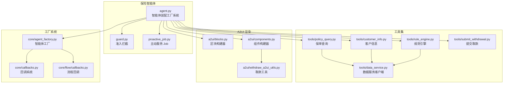
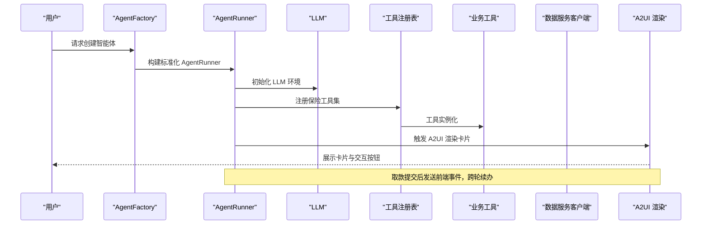
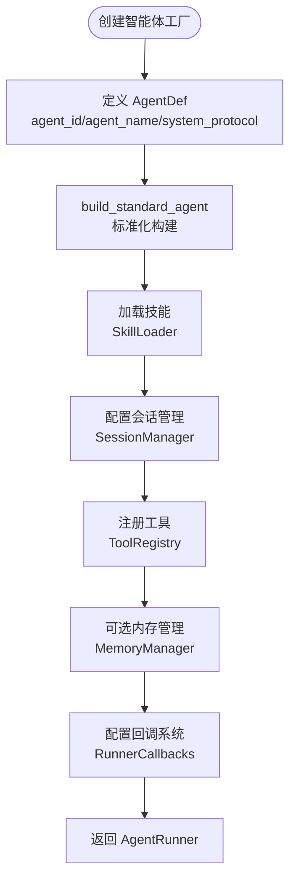
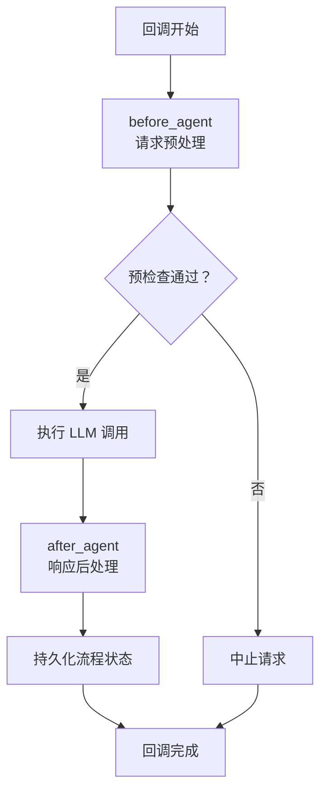
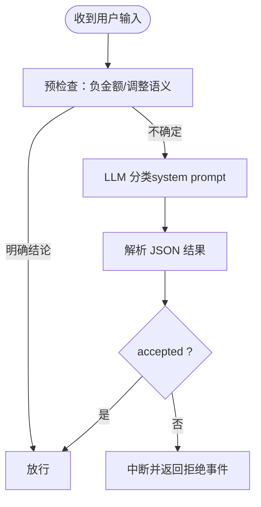
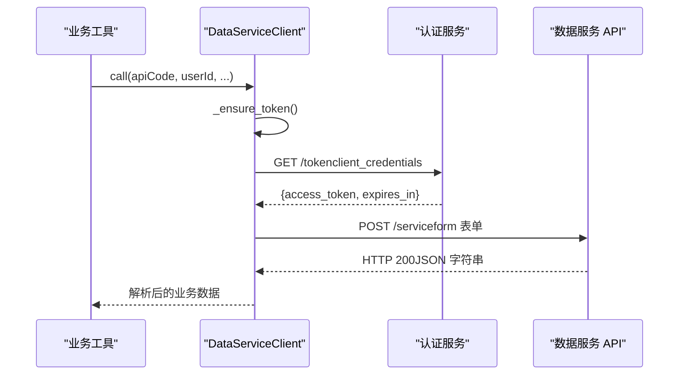
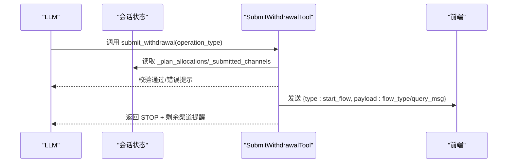
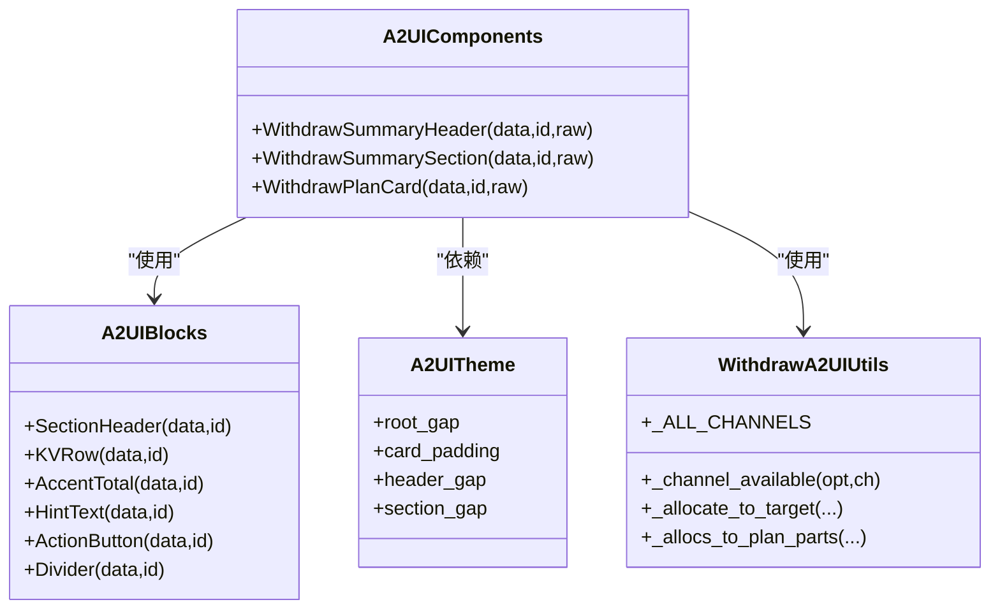
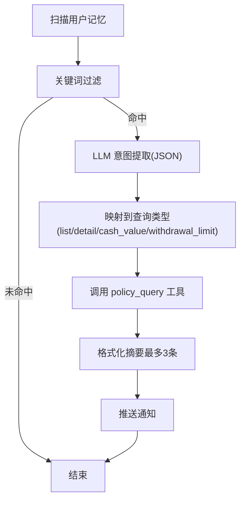
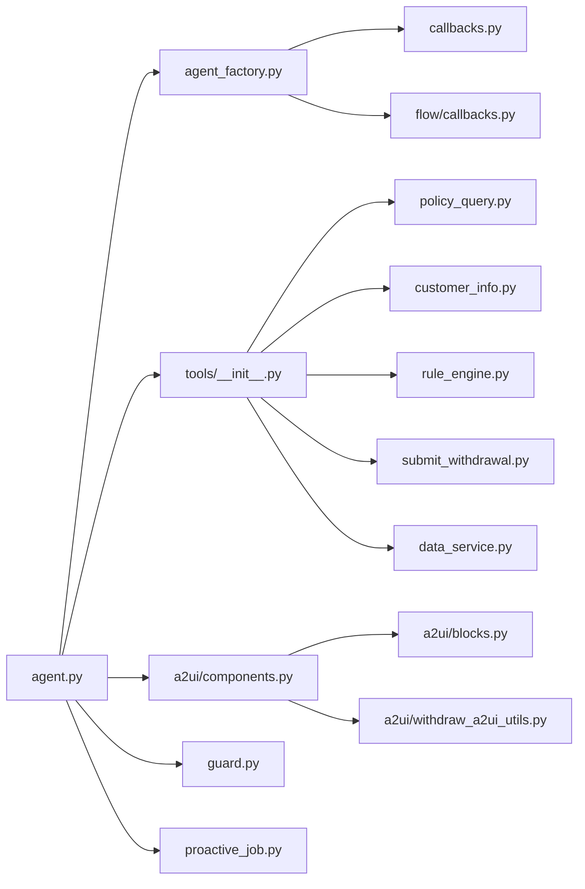

# 保险智能体

<cite>
**本文档引用的文件**
- [agent.py](file://src/ark_agentic/agents/insurance/agent.py)
- [guard.py](file://src/ark_agentic/agents/insurance/guard.py)
- [agent.json](file://src/ark_agentic/agents/insurance/agent.json)
- [tools/__init__.py](file://src/ark_agentic/agents/insurance/tools/__init__.py)
- [policy_query.py](file://src/ark_agentic/agents/insurance/tools/policy_query.py)
- [customer_info.py](file://src/ark_agentic/agents/insurance/tools/customer_info.py)
- [data_service.py](file://src/ark_agentic/agents/insurance/tools/data_service.py)
- [rule_engine.py](file://src/ark_agentic/agents/insurance/tools/rule_engine.py)
- [submit_withdrawal.py](file://src/ark_agentic/agents/insurance/tools/submit_withdrawal.py)
- [proactive_job.py](file://src/ark_agentic/agents/insurance/proactive_job.py)
- [a2ui/blocks.py](file://src/ark_agentic/agents/insurance/a2ui/blocks.py)
- [a2ui/components.py](file://src/ark_agentic/agents/insurance/a2ui/components.py)
- [a2ui/withdraw_a2ui_utils.py](file://src/ark_agentic/agents/insurance/a2ui/withdraw_a2ui_utils.py)
- [agent_factory.py](file://src/ark_agentic/core/agent_factory.py)
- [callbacks.py](file://src/ark_agentic/core/callbacks.py)
- [flow/callbacks.py](file://src/ark_agentic/core/flow/callbacks.py)
- [skills/withdraw_money_flow/SKILL.md](file://src/ark_agentic/agents/insurance/skills/withdraw_money_flow/SKILL.md)
- [skills/execute_withdrawal/SKILL.md](file://src/ark_agentic/agents/insurance/skills/execute_withdrawal/SKILL.md)
</cite>

## 更新摘要
**所做更改**
- 更新智能体装配方式，采用新的智能体工厂系统进行标准化构建
- 移除内部 thinking 回调处理，改用标准化的回调机制
- 优化工具注册和技能加载流程
- 增强流程回调和会话管理功能
- 新增标准化回调机制和流程回调系统
- 新增智能体工厂系统和 AgentDef 定义

## 目录
1. [简介](#简介)
2. [项目结构](#项目结构)
3. [核心组件](#核心组件)
4. [架构总览](#架构总览)
5. [详细组件分析](#详细组件分析)
6. [依赖关系分析](#依赖关系分析)
7. [性能考量](#性能考量)
8. [故障排查指南](#故障排查指南)
9. [结论](#结论)
10. [附录](#附录)

## 简介
本文件面向保险智能体的开发者与运维人员，系统化阐述其业务场景、工具集设计、技能实现与安全防护机制。重点覆盖保单查询、取款方案制定与费用计算、客户信息查询、取款提交与跨轮续办、A2UI 卡片渲染、主动服务 Job、准入拦截与安全防护等模块。文档同时提供最佳实践、扩展指南与调试技巧，并解释保险领域的特殊要求与实现细节。

**更新** 本版本采用新的智能体工厂系统进行标准化构建，移除了内部 thinking 回调处理，实现了更加规范化的智能体装配流程。新增了标准化回调机制和流程回调系统，提供统一的生命周期管理。

## 项目结构
保险智能体位于 agents/insurance 目录下，采用"工具 + A2UI 组件 + 主动服务"的分层组织方式：
- agents/insurance/agent.py：智能体装配与运行器配置（使用新的工厂系统）
- agents/insurance/guard.py：准入拦截与安全防护
- agents/insurance/tools/：数据服务与业务工具
- agents/insurance/a2ui/：A2UI 组件与区块构建器
- agents/insurance/proactive_job.py：主动服务 Job（保单到期/续保/理赔跟踪）

**图表来源**
- [agent.py:18-75](file://src/ark_agentic/agents/insurance/agent.py#L18-L75)
- [agent_factory.py:34-151](file://src/ark_agentic/core/agent_factory.py#L34-L151)
- [callbacks.py:98-200](file://src/ark_agentic/core/callbacks.py#L98-L200)
- [flow/callbacks.py:36-143](file://src/ark_agentic/core/flow/callbacks.py#L36-L143)

**章节来源**
- [agent.py:1-75](file://src/ark_agentic/agents/insurance/agent.py#L1-L75)
- [tools/__init__.py:1-110](file://src/ark_agentic/agents/insurance/tools/__init__.py#L1-L110)

## 核心组件
- **智能体工厂系统**：基于 AgentDef 的标准化智能体构建器，提供约定优于配置的智能体装配方式
- **标准化回调机制**：统一的 RunnerCallbacks 和 FlowCallbacks 系统，替代内部 thinking 回调
- **数据服务客户端**：封装 OAuth 认证、form 表单调用、响应解析与 Mock 客户端切换
- **工具集**：保单查询、客户信息、规则引擎（取款方案与费用计算）、取款提交（跨轮续办与前端事件桥接）
- **A2UI 渲染**：区块与组件管线，支持 WithdrawSummary/WithdrawPlan 等卡片模板与主题化样式
- **准入拦截**：基于 LLM 的确定性分类器，限定受理范围并阻断非取款业务
- **主动服务 Job**：定时扫描用户记忆，识别保单到期/续保/理赔/缴费等意图并推送提醒

**更新** 新增智能体工厂系统和标准化回调机制，移除了原有的内部 thinking 回调处理。

**章节来源**
- [agent.py:38-75](file://src/ark_agentic/agents/insurance/agent.py#L38-L75)
- [agent_factory.py:34-151](file://src/ark_agentic/core/agent_factory.py#L34-L151)
- [callbacks.py:98-200](file://src/ark_agentic/core/callbacks.py#L98-L200)
- [flow/callbacks.py:36-143](file://src/ark_agentic/core/flow/callbacks.py#L36-L143)

## 架构总览
保险智能体采用"智能体工厂 + 工具驱动 + A2UI 渲染 + 主动服务"的架构模式。新的工厂系统提供标准化的智能体装配流程，LLM 通过工具调用访问数据服务，结合规则引擎生成取款方案，再由 A2UI 组件将结构化数据渲染为卡片，最终通过前端事件桥接业务流程。

**图表来源**
- [agent.py:66-75](file://src/ark_agentic/agents/insurance/agent.py#L66-L75)
- [agent_factory.py:58-151](file://src/ark_agentic/core/agent_factory.py#L58-L151)

## 详细组件分析

### 智能体工厂系统与标准化装配
- **AgentDef 定义**：声明式智能体定义，包含身份标识、名称描述、系统协议等核心配置
- **标准化构建**：build_standard_agent 提供约定衍生的默认配置，包括会话目录、内存目录、技能配置等
- **回调集成**：统一的 RunnerCallbacks 和 FlowCallbacks 系统，支持 before_agent/after_agent 等生命周期钩子
- **环境变量控制**：通过环境变量控制 LLM 初始化、会话持久化、内存管理等运行时行为

**图表来源**
- [agent_factory.py:34-151](file://src/ark_agentic/core/agent_factory.py#L34-L151)
- [agent.py:38-75](file://src/ark_agentic/agents/insurance/agent.py#L38-L75)

**章节来源**
- [agent_factory.py:34-151](file://src/ark_agentic/core/agent_factory.py#L34-L151)
- [agent.py:38-75](file://src/ark_agentic/agents/insurance/agent.py#L38-L75)

### 标准化回调机制
- **RunnerCallbacks**：统一的运行时回调接口，支持 before_agent/after_agent 等多个生命周期钩子
- **FlowCallbacks**：专门的流程回调系统，处理未完成任务的注入和持久化
- **回调链路**：支持多个回调函数的串联执行，提供上下文更新、响应覆盖、事件派发等功能
- **错误处理**：统一的回调错误处理机制，确保回调异常不影响主流程执行

**图表来源**
- [callbacks.py:98-200](file://src/ark_agentic/core/callbacks.py#L98-L200)
- [flow/callbacks.py:50-143](file://src/ark_agentic/core/flow/callbacks.py#L50-L143)

**章节来源**
- [callbacks.py:98-200](file://src/ark_agentic/core/callbacks.py#L98-L200)
- [flow/callbacks.py:36-143](file://src/ark_agentic/core/flow/callbacks.py#L36-L143)

### 准入拦截与安全防护
- 采用确定性分类器（temperature=0）判断用户输入是否属于取款业务受理范围
- 支持历史上下文延续与金额负值预判，必要时回退至 LLM 判定
- 回调钩子在进入智能体前执行，拒绝时返回统一事件与消息

**图表来源**
- [guard.py:102-164](file://src/ark_agentic/agents/insurance/guard.py#L102-L164)

**章节来源**
- [guard.py:71-164](file://src/ark_agentic/agents/insurance/guard.py#L71-L164)

### 数据服务集成与 Mock 切换
- 统一管理 OAuth token 获取与缓存、form 表单调用、响应解析
- 支持 MockDataServiceClient，便于本地/测试环境快速验证
- 通过环境变量控制真实服务地址与认证参数

**图表来源**
- [data_service.py:73-129](file://src/ark_agentic/agents/insurance/tools/data_service.py#L73-L129)
- [data_service.py:146-194](file://src/ark_agentic/agents/insurance/tools/data_service.py#L146-L194)

**章节来源**
- [data_service.py:22-452](file://src/ark_agentic/agents/insurance/tools/data_service.py#L22-L452)

### 保单查询工具
- 通过 policy_query API 查询用户保单列表与可用金额
- 将结果写入会话状态，供后续工具与 A2UI 使用

**章节来源**
- [policy_query.py:25-77](file://src/ark_agentic/agents/insurance/tools/policy_query.py#L25-L77)

### 客户信息工具
- 支持身份、联系方式、受益人、交易历史、服务记录等多类型查询
- 通过 customer_info API 获取完整画像，便于风险评估与合规提示

**章节来源**
- [customer_info.py:26-94](file://src/ark_agentic/agents/insurance/tools/customer_info.py#L26-L94)

### 规则引擎工具（取款方案与费用计算）
- 自动获取保单数据，标准化为每张保单一条记录，包含四个可用金额字段与费率
- 支持 list_options（列出可用金额）与 calculate_detail（单渠道详算）两类操作
- 费用计算规则：部分领取按保单年度收取手续费，退保无手续费，保单贷款按固定年利率计息

**图表来源**
- [rule_engine.py:155-204](file://src/ark_agentic/agents/insurance/tools/rule_engine.py#L155-L204)
- [rule_engine.py:209-302](file://src/ark_agentic/agents/insurance/tools/rule_engine.py#L209-L302)
- [rule_engine.py:338-445](file://src/ark_agentic/agents/insurance/tools/rule_engine.py#L338-L445)

**章节来源**
- [rule_engine.py:99-445](file://src/ark_agentic/agents/insurance/tools/rule_engine.py#L99-L445)

### 取款提交工具（跨轮续办与前端事件桥接）
- 从会话状态读取取款方案分配，检查是否重复提交
- 生成前端 start_flow 事件，携带业务流类型与查询消息
- 返回 STOP 动作与剩余渠道提醒，作为跨轮续办的桥梁

**图表来源**
- [submit_withdrawal.py:152-214](file://src/ark_agentic/agents/insurance/tools/submit_withdrawal.py#L152-L214)

**章节来源**
- [submit_withdrawal.py:136-214](file://src/ark_agentic/agents/insurance/tools/submit_withdrawal.py#L136-L214)

### A2UI 卡片渲染实现
- 组件管线：区块（blocks）定义基础布局与样式，组件（components）实现业务卡片（如 WithdrawSummary/WithdrawPlan）
- 主题化：通过 A2UITheme 控制间距、颜色与字体，确保视觉一致性
- 状态桥接：组件输出 state_delta 供后续工具自动填充，llm_digest 用于 LLM 上下文增强

**图表来源**
- [a2ui/blocks.py:25-145](file://src/ark_agentic/agents/insurance/a2ui/blocks.py#L25-L145)
- [a2ui/components.py:69-470](file://src/ark_agentic/agents/insurance/a2ui/components.py#L69-L470)
- [a2ui/withdraw_a2ui_utils.py:1-123](file://src/ark_agentic/agents/insurance/a2ui/withdraw_a2ui_utils.py#L1-L123)

**章节来源**
- [a2ui/blocks.py:25-145](file://src/ark_agentic/agents/insurance/a2ui/blocks.py#L25-L145)
- [a2ui/components.py:462-538](file://src/ark_agentic/agents/insurance/a2ui/components.py#L462-L538)
- [a2ui/withdraw_a2ui_utils.py:55-123](file://src/ark_agentic/agents/insurance/a2ui/withdraw_a2ui_utils.py#L55-L123)

### 主动服务 Job（保单到期/续保/理赔跟踪）
- 关键词快速过滤 + LLM 意图提取，识别保单到期、理赔跟进、保费提醒等场景
- 调用 policy_query 获取实时保单状态，格式化为可读摘要并推送通知

**图表来源**
- [proactive_job.py:79-174](file://src/ark_agentic/agents/insurance/proactive_job.py#L79-L174)

**章节来源**
- [proactive_job.py:59-174](file://src/ark_agentic/agents/insurance/proactive_job.py#L59-L174)

## 依赖关系分析
- **工厂系统依赖**：智能体工厂依赖 AgentDef、RunnerConfig、SkillLoader、ToolRegistry 等核心组件
- **回调系统依赖**：RunnerCallbacks 和 FlowCallbacks 提供统一的生命周期管理
- **工具依赖**：保单查询、客户信息、规则引擎均依赖数据服务客户端；取款提交工具依赖会话状态与前端事件
- **A2UI 依赖**：组件依赖区块与取款工具集；主题化贯穿组件与区块
- **运行器依赖**：工具注册表、会话管理、记忆管理、技能加载、回调注入、主动服务 Job

**图表来源**
- [agent.py:18-25](file://src/ark_agentic/agents/insurance/agent.py#L18-L25)
- [agent_factory.py:16-29](file://src/ark_agentic/core/agent_factory.py#L16-L29)
- [tools/__init__.py:15-26](file://src/ark_agentic/agents/insurance/tools/__init__.py#L15-L26)

**章节来源**
- [agent.py:18-25](file://src/ark_agentic/agents/insurance/agent.py#L18-L25)
- [agent_factory.py:16-29](file://src/ark_agentic/core/agent_factory.py#L16-L29)
- [tools/__init__.py:15-26](file://src/ark_agentic/agents/insurance/tools/__init__.py#L15-L26)

## 性能考量
- **工厂系统优化**：智能体工厂提供缓存机制，避免重复创建相同的 AgentRunner 实例
- **回调系统优化**：统一的回调处理减少了重复的生命周期管理代码
- **LLM 调用优化**：准入拦截使用 temperature=0 的确定性分类，减少非必要推理
- **数据服务**：token 缓存与安全余量（30秒）避免频繁认证；响应解析兼容多种嵌套结构
- **A2UI**：组件输出 llm_digest 与 state_delta，减少重复数据传输与上下文膨胀
- **主动服务**：关键词快速过滤 + LLM 意图提取，降低无效扫描成本

**更新** 新的工厂系统提供了更好的性能表现和资源管理能力。

## 故障排查指南
- **工厂系统问题**：检查 AgentDef 配置是否正确；验证 build_standard_agent 的参数传递
- **回调系统问题**：确认 RunnerCallbacks 和 FlowCallbacks 的注册顺序；检查回调函数的返回值
- **数据服务调用失败**：检查 DATA_SERVICE_* 环境变量与认证参数；开启 Mock 模式验证工具链路
- **准入拦截误拒**：调整历史窗口与正则模式；确认 system prompt 示例覆盖度
- **A2UI 渲染异常**：核对组件 schema 与区块样式；检查 state_delta 是否正确写入
- **主动服务无提醒**：确认 cron 配置与关键词命中；检查工具可用性与 policy_query 返回结构

**更新** 新增工厂系统和回调系统的故障排查指导。

**章节来源**
- [agent_factory.py:58-151](file://src/ark_agentic/core/agent_factory.py#L58-L151)
- [callbacks.py:98-200](file://src/ark_agentic/core/callbacks.py#L98-L200)
- [flow/callbacks.py:50-143](file://src/ark_agentic/core/flow/callbacks.py#L50-L143)

## 结论
保险智能体通过"智能体工厂 + 工具 + A2UI + 主动服务 + 安全防护"的协同架构，实现了从保单查询、取款方案制定、费用计算到卡片渲染与跨轮续办的完整闭环。新的智能体工厂系统提供了标准化的装配流程，统一的回调机制替代了内部 thinking 回调处理，确定性准入拦截与主题化渲染提升了用户体验与安全性，规则引擎与数据服务的解耦设计便于扩展与维护。

**更新** 采用新的智能体工厂系统显著提升了代码的可维护性和一致性，标准化的回调机制为未来的功能扩展奠定了坚实基础。

## 附录

### 业务场景与核心流程
- **保单查询**：用户输入 → 工具调用 → 数据服务 → A2UI 展示
- **取款方案**：规则引擎 → 组合可用金额 → A2UI 方案卡 → 用户确认
- **取款提交**：提交工具 → 读取状态 → 发起前端事件 → 跨轮续办
- **理赔处理**：主动服务识别意图 → 查询保单状态 → 推送进度摘要
- **撤保申请**：规则引擎支持退保渠道 → A2UI 明确风险提示 → 提交工具发起流程

### 最佳实践
- **工厂系统使用**：优先使用 AgentDef 进行声明式配置；通过环境变量控制运行时行为
- **工具参数校验**：严格使用工具基类提供的参数读取函数，避免运行时异常
- **状态管理**：通过 state_delta 传递中间结果，减少重复查询与上下文冗余
- **A2UI 设计**：优先使用内置组件与区块，保持主题一致性与可维护性
- **安全策略**：启用准入拦截；对敏感操作输出风险提示；限制输出风格与重复展示
- **回调处理**：合理使用 RunnerCallbacks 和 FlowCallbacks，避免回调链过长影响性能

**更新** 新增工厂系统和回调系统的最佳实践指导。

### 扩展指南
- **新增智能体**：基于 AgentDef 创建新的智能体定义；使用 build_standard_agent 进行装配
- **新增工具**：在 tools 目录新增工具类，注册到 create_insurance_tools；如需 A2UI 渲染，补充组件与区块
- **新增回调**：在 callbacks.py 中添加新的回调函数；通过 RunnerCallbacks 集成到智能体生命周期
- **新增渠道**：在取款工具集中扩展渠道枚举与可用性判断；更新 A2UI 组件标签与按钮文案
- **主动服务**：扩展意图类型与关键词；完善格式化摘要逻辑，控制通知长度与可读性

**更新** 新增工厂系统和回调系统的扩展指导。

### 调试技巧
- **工厂系统调试**：使用 create_insurance_agent 的参数进行细粒度控制；检查 AgentDef 配置
- **回调系统调试**：通过日志查看回调执行顺序；使用 CallbackResult 进行状态检查
- **Mock 切换**：设置 DATA_SERVICE_MOCK=true 快速验证工具链路与 A2UI 渲染
- **日志定位**：关注数据服务客户端与工具执行日志，定位参数与响应问题
- **会话追踪**：打印会话状态中的 state_delta，确认跨轮数据传递是否正确
- **性能监控**：监控工厂系统的实例创建频率；跟踪回调执行时间

**更新** 新增工厂系统和回调系统的调试技巧。

### 技能流程说明
- **保险取款流程**：通过 4 阶段 SOP 流程处理保险取款，支持跨会话中断恢复
- **取款执行技能**：当最近一次 render_a2ui tool 结果 digest 以"[卡片:方案"开头时，用本技能调用 submit_withdrawal

**章节来源**
- [skills/withdraw_money_flow/SKILL.md:1-61](file://src/ark_agentic/agents/insurance/skills/withdraw_money_flow/SKILL.md#L1-L61)
- [skills/execute_withdrawal/SKILL.md:1-158](file://src/ark_agentic/agents/insurance/skills/execute_withdrawal/SKILL.md#L1-L158)