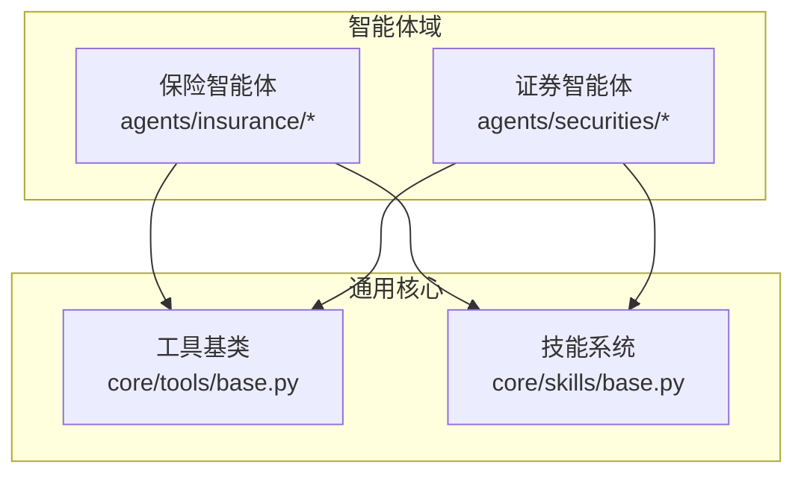
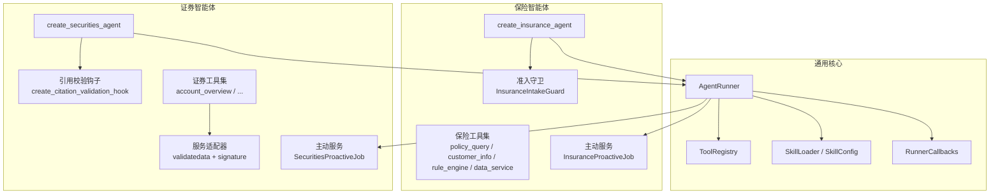
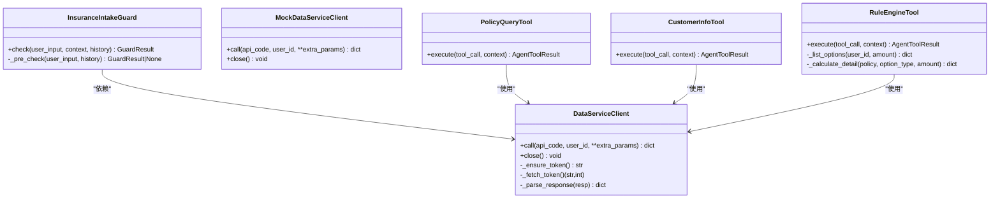
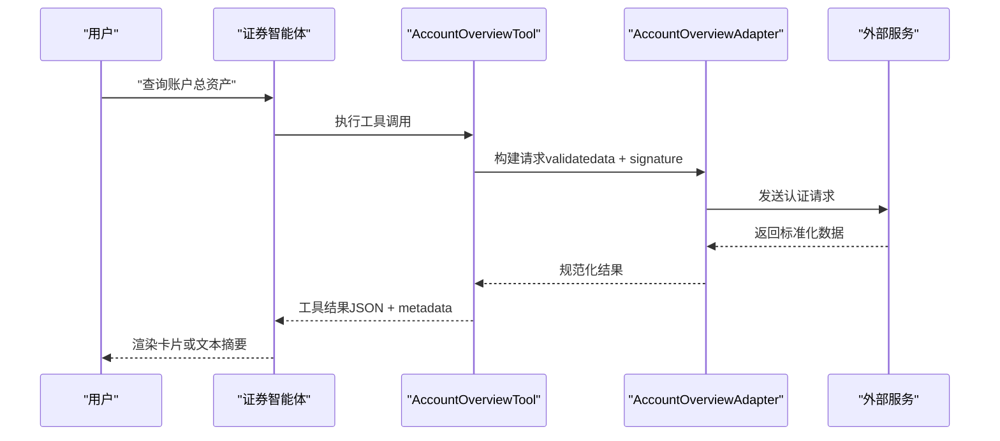
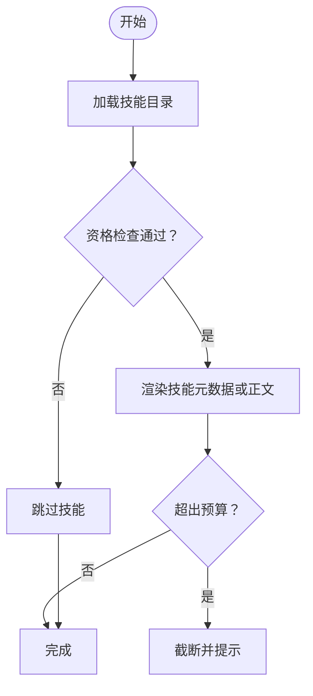
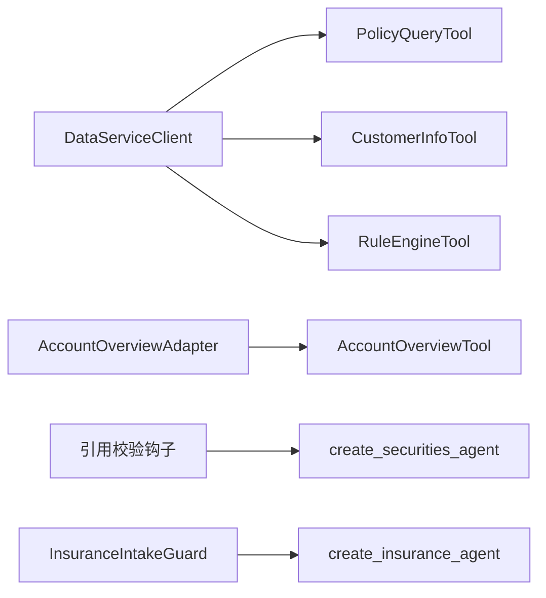

# 智能体实现

<cite>
**本文引用的文件**
- [src/ark_agentic/agents/insurance/agent.py](file://src/ark_agentic/agents/insurance/agent.py)
- [src/ark_agentic/agents/securities/agent.py](file://src/ark_agentic/agents/securities/agent.py)
- [src/ark_agentic/agents/insurance/guard.py](file://src/ark_agentic/agents/insurance/guard.py)
- [src/ark_agentic/agents/securities/validation.py](file://src/ark_agentic/agents/securities/validation.py)
- [src/ark_agentic/agents/insurance/tools/data_service.py](file://src/ark_agentic/agents/insurance/tools/data_service.py)
- [src/ark_agentic/agents/insurance/tools/customer_info.py](file://src/ark_agentic/agents/insurance/tools/customer_info.py)
- [src/ark_agentic/agents/insurance/tools/policy_query.py](file://src/ark_agentic/agents/insurance/tools/policy_query.py)
- [src/ark_agentic/agents/insurance/tools/rule_engine.py](file://src/ark_agentic/agents/insurance/tools/rule_engine.py)
- [src/ark_agentic/agents/securities/tools/agent/account_overview.py](file://src/ark_agentic/agents/securities/tools/agent/account_overview.py)
- [src/ark_agentic/agents/securities/tools/service/base.py](file://src/ark_agentic/agents/securities/tools/service/base.py)
- [src/ark_agentic/agents/securities/tools/service/adapters/account_overview.py](file://src/ark_agentic/agents/securities/tools/service/adapters/account_overview.py)
- [src/ark_agentic/agents/insurance/proactive_job.py](file://src/ark_agentic/agents/insurance/proactive_job.py)
- [src/ark_agentic/agents/securities/proactive_job.py](file://src/ark_agentic/agents/securities/proactive_job.py)
- [src/ark_agentic/agents/securities/skills/asset_overview/SKILL.md](file://src/ark_agentic/agents/securities/skills/asset_overview/SKILL.md)
- [src/ark_agentic/core/tools/base.py](file://src/ark_agentic/core/tools/base.py)
- [src/ark_agentic/core/skills/base.py](file://src/ark_agentic/core/skills/base.py)
</cite>

## 目录
1. [引言](#引言)
2. [项目结构](#项目结构)
3. [核心组件](#核心组件)
4. [架构总览](#架构总览)
5. [详细组件分析](#详细组件分析)
6. [依赖分析](#依赖分析)
7. [性能考量](#性能考量)
8. [故障排查指南](#故障排查指南)
9. [结论](#结论)
10. [附录](#附录)

## 引言
本文件面向智能体实现的技术文档，聚焦两类业务智能体：保险智能体与证券智能体。文档从业务场景、工具集设计、技能实现、安全防护与主动服务等方面展开，结合代码级分析与可视化图示，帮助开发者快速理解并扩展智能体能力。同时提供最佳实践、扩展指南与调试技巧，便于在不同领域间迁移通用模式。

## 项目结构
项目采用按领域划分的模块化组织方式，核心位于 src/ark_agentic 下：
- agents：按业务域划分的智能体实现（insurance、securities），每个域包含 agent.py、tools、skills、a2ui、proactive_job 等子模块
- core：通用基础设施（工具、技能、LLM、内存、回调、作业调度、通知等）
- studio：智能体开发与管理的前端界面（非本文重点）

图表来源
- [src/ark_agentic/agents/insurance/agent.py:1-143](file://src/ark_agentic/agents/insurance/agent.py#L1-L143)
- [src/ark_agentic/agents/securities/agent.py:1-173](file://src/ark_agentic/agents/securities/agent.py#L1-L173)
- [src/ark_agentic/core/tools/base.py:1-289](file://src/ark_agentic/core/tools/base.py#L1-L289)
- [src/ark_agentic/core/skills/base.py:1-344](file://src/ark_agentic/core/skills/base.py#L1-L344)

章节来源
- [src/ark_agentic/agents/insurance/agent.py:1-143](file://src/ark_agentic/agents/insurance/agent.py#L1-L143)
- [src/ark_agentic/agents/securities/agent.py:1-173](file://src/ark_agentic/agents/securities/agent.py#L1-L173)

## 核心组件
- 智能体运行器（AgentRunner）：封装 LLM、工具注册、会话管理、技能加载、记忆管理、回调与主动服务作业
- 工具（AgentTool）：统一的工具抽象，定义参数、可见性、思考提示与执行接口
- 技能（Skill）：以 Markdown 描述的业务流程与工具契约，支持资格检查与动态加载
- 安全与准入：保险智能体的准入守卫与回调；证券智能体的引用校验钩子
- 主动服务：基于记忆扫描与意图提取的定时任务，驱动工具查询并生成通知

章节来源
- [src/ark_agentic/agents/insurance/agent.py:47-143](file://src/ark_agentic/agents/insurance/agent.py#L47-L143)
- [src/ark_agentic/agents/securities/agent.py:37-173](file://src/ark_agentic/agents/securities/agent.py#L37-L173)
- [src/ark_agentic/core/tools/base.py:46-117](file://src/ark_agentic/core/tools/base.py#L46-L117)
- [src/ark_agentic/core/skills/base.py:19-50](file://src/ark_agentic/core/skills/base.py#L19-L50)

## 架构总览
保险与证券智能体共享统一的运行框架，分别在工具集、技能与安全策略上体现业务差异。

图表来源
- [src/ark_agentic/agents/insurance/agent.py:47-143](file://src/ark_agentic/agents/insurance/agent.py#L47-L143)
- [src/ark_agentic/agents/securities/agent.py:37-173](file://src/ark_agentic/agents/securities/agent.py#L37-L173)
- [src/ark_agentic/agents/insurance/guard.py:71-164](file://src/ark_agentic/agents/insurance/guard.py#L71-L164)
- [src/ark_agentic/agents/securities/validation.py:12-22](file://src/ark_agentic/agents/securities/validation.py#L12-L22)
- [src/ark_agentic/agents/securities/tools/service/base.py:38-131](file://src/ark_agentic/agents/securities/tools/service/base.py#L38-L131)

## 详细组件分析

### 保险智能体
- 业务场景：取款受理（红利、生存金、保单贷款、部分领取、退保）、取款方案制定与查询、相关保单与个人信息查询
- 工具集设计：
  - policy_query：查询保单列表与详情
  - customer_info：查询客户身份、联系方式、受益人、交易与服务历史
  - rule_engine：标准化每张保单的可用金额与费率，支持方案列举与单渠道详算
  - data_service：统一 OAuth 令牌管理与 API 调用，支持真实与 Mock 两种客户端
- 技能实现：通过 SkillLoader 动态加载技能，结合 SkillConfig 控制加载模式与资格检查
- 安全防护：准入守卫（InsuranceIntakeGuard）在 before_agent 阶段进行确定性预检与 LLM 分类，拒绝非受理范围请求
- 主动服务：InsuranceProactiveJob 基于记忆扫描与意图提取，调用 policy_query 生成续保、理赔、保费提醒等通知

图表来源
- [src/ark_agentic/agents/insurance/guard.py:71-164](file://src/ark_agentic/agents/insurance/guard.py#L71-L164)
- [src/ark_agentic/agents/insurance/tools/data_service.py:22-225](file://src/ark_agentic/agents/insurance/tools/data_service.py#L22-L225)
- [src/ark_agentic/agents/insurance/tools/policy_query.py:25-77](file://src/ark_agentic/agents/insurance/tools/policy_query.py#L25-L77)
- [src/ark_agentic/agents/insurance/tools/customer_info.py:26-94](file://src/ark_agentic/agents/insurance/tools/customer_info.py#L26-L94)
- [src/ark_agentic/agents/insurance/tools/rule_engine.py:99-445](file://src/ark_agentic/agents/insurance/tools/rule_engine.py#L99-L445)

章节来源
- [src/ark_agentic/agents/insurance/agent.py:47-143](file://src/ark_agentic/agents/insurance/agent.py#L47-L143)
- [src/ark_agentic/agents/insurance/guard.py:71-164](file://src/ark_agentic/agents/insurance/guard.py#L71-L164)
- [src/ark_agentic/agents/insurance/tools/data_service.py:22-452](file://src/ark_agentic/agents/insurance/tools/data_service.py#L22-L452)
- [src/ark_agentic/agents/insurance/tools/policy_query.py:25-77](file://src/ark_agentic/agents/insurance/tools/policy_query.py#L25-L77)
- [src/ark_agentic/agents/insurance/tools/customer_info.py:26-94](file://src/ark_agentic/agents/insurance/tools/customer_info.py#L26-L94)
- [src/ark_agentic/agents/insurance/tools/rule_engine.py:99-445](file://src/ark_agentic/agents/insurance/tools/rule_engine.py#L99-L445)
- [src/ark_agentic/agents/insurance/proactive_job.py:59-174](file://src/ark_agentic/agents/insurance/proactive_job.py#L59-L174)

### 证券智能体
- 业务场景：账户资产总览、现金状况、持仓列表（ETF/基金/港股通）、账户属性与行情提醒
- 工具集设计：
  - account_overview：账户总资产、现金、股票市值、今日收益等
  - 服务适配器：基于 validatedata + signature 的认证与参数映射，统一响应标准化
  - 其他工具：cash_assets、etf_holdings、fund_holdings、hksc_holdings、branch_info、stock_daily_profit、profit_inquiry 等（按技能与场景加载）
- 技能实现：资产总览技能（asset_overview）定义明确的意图与工具映射，支持 MODE_CARD 与 MODE_TEXT 两种输出模式
- 安全与校验：通过 VALIDATION_SYSTEM_INSTRUCTION 约束仅依据工具与上下文作答；before_loop_end 钩子进行引用校验
- 主动服务：SecuritiesProactiveJob 基于记忆扫描与意图提取，调用 security_info_search 获取实时行情并生成通知

图表来源
- [src/ark_agentic/agents/securities/tools/agent/account_overview.py:57-108](file://src/ark_agentic/agents/securities/tools/agent/account_overview.py#L57-L108)
- [src/ark_agentic/agents/securities/tools/service/adapters/account_overview.py:15-61](file://src/ark_agentic/agents/securities/tools/service/adapters/account_overview.py#L15-L61)
- [src/ark_agentic/agents/securities/tools/service/base.py:38-131](file://src/ark_agentic/agents/securities/tools/service/base.py#L38-L131)

章节来源
- [src/ark_agentic/agents/securities/agent.py:37-173](file://src/ark_agentic/agents/securities/agent.py#L37-L173)
- [src/ark_agentic/agents/securities/validation.py:12-22](file://src/ark_agentic/agents/securities/validation.py#L12-L22)
- [src/ark_agentic/agents/securities/tools/agent/account_overview.py:57-108](file://src/ark_agentic/agents/securities/tools/agent/account_overview.py#L57-L108)
- [src/ark_agentic/agents/securities/tools/service/base.py:38-212](file://src/ark_agentic/agents/securities/tools/service/base.py#L38-L212)
- [src/ark_agentic/agents/securities/tools/service/adapters/account_overview.py:15-61](file://src/ark_agentic/agents/securities/tools/service/adapters/account_overview.py#L15-L61)
- [src/ark_agentic/agents/securities/proactive_job.py:54-145](file://src/ark_agentic/agents/securities/proactive_job.py#L54-L145)
- [src/ark_agentic/agents/securities/skills/asset_overview/SKILL.md:1-186](file://src/ark_agentic/agents/securities/skills/asset_overview/SKILL.md#L1-L186)

### 技能系统与工具基类
- 工具基类（AgentTool）：统一参数定义、JSON Schema 导出、LangChain 适配与参数读取辅助函数
- 技能配置（SkillConfig）：控制技能目录、加载模式、调用策略、资格检查与渲染阈值
- 资格检查（check_skill_eligibility）：基于 OS、二进制、环境变量与可用工具集合进行资格判定
- 动态加载（SkillLoader）：按目录加载技能，支持 full/auto/manual 策略

图表来源
- [src/ark_agentic/core/skills/base.py:51-101](file://src/ark_agentic/core/skills/base.py#L51-L101)
- [src/ark_agentic/core/skills/base.py:207-240](file://src/ark_agentic/core/skills/base.py#L207-L240)
- [src/ark_agentic/core/tools/base.py:46-117](file://src/ark_agentic/core/tools/base.py#L46-L117)

章节来源
- [src/ark_agentic/core/tools/base.py:46-289](file://src/ark_agentic/core/tools/base.py#L46-L289)
- [src/ark_agentic/core/skills/base.py:19-344](file://src/ark_agentic/core/skills/base.py#L19-L344)

## 依赖分析
- 保险域依赖：
  - 数据服务客户端（统一 OAuth 与响应解析）
  - 准入守卫（确定性预检 + LLM 分类）
  - 主动服务（基于记忆与意图提取）
- 证券域依赖：
  - 服务适配器（validatedata + signature 认证）
  - 引用校验钩子（约束回答仅基于工具与上下文）
  - 主动服务（基于记忆与行情意图提取）

图表来源
- [src/ark_agentic/agents/insurance/tools/data_service.py:22-225](file://src/ark_agentic/agents/insurance/tools/data_service.py#L22-L225)
- [src/ark_agentic/agents/insurance/tools/policy_query.py:25-77](file://src/ark_agentic/agents/insurance/tools/policy_query.py#L25-L77)
- [src/ark_agentic/agents/insurance/tools/customer_info.py:26-94](file://src/ark_agentic/agents/insurance/tools/customer_info.py#L26-L94)
- [src/ark_agentic/agents/insurance/tools/rule_engine.py:99-445](file://src/ark_agentic/agents/insurance/tools/rule_engine.py#L99-L445)
- [src/ark_agentic/agents/securities/tools/service/adapters/account_overview.py:15-61](file://src/ark_agentic/agents/securities/tools/service/adapters/account_overview.py#L15-L61)
- [src/ark_agentic/agents/securities/agent.py:144-171](file://src/ark_agentic/agents/securities/agent.py#L144-L171)
- [src/ark_agentic/agents/insurance/agent.py:138-142](file://src/ark_agentic/agents/insurance/agent.py#L138-L142)

章节来源
- [src/ark_agentic/agents/insurance/tools/data_service.py:22-452](file://src/ark_agentic/agents/insurance/tools/data_service.py#L22-L452)
- [src/ark_agentic/agents/securities/tools/service/base.py:38-212](file://src/ark_agentic/agents/securities/tools/service/base.py#L38-L212)

## 性能考量
- LLM 采样与上下文压缩：保险智能体默认采用低温采样与工具调用遵循策略，结合会话压缩与摘要器，控制上下文窗口与成本
- 工具调用幂等与缓存：数据服务客户端内置令牌缓存与安全余量，减少鉴权开销
- 服务适配器异步 HTTP：统一超时与连接参数，避免阻塞
- 主动服务批量化：按关键词快速过滤与批量扫描，降低 LLM 调用频率

## 故障排查指南
- 保险数据服务异常
  - 现象：工具调用抛出 DataServiceError
  - 排查：检查 DATA_SERVICE_AUTH_URL、DATA_SERVICE_URL、DATA_SERVICE_MOCK 等环境变量；确认令牌有效期与网络连通性
  - 参考：[data_service.py:22-225](file://src/ark_agentic/agents/insurance/tools/data_service.py#L22-L225)
- 证券工具参数缺失
  - 现象：require_context_fields 抛出 ValueError
  - 排查：确保 context 中包含 validatedata、signature 等必需字段；或开启 Mock 模式
  - 参考：[base.py:138-160](file://src/ark_agentic/agents/securities/tools/service/base.py#L138-L160)
- 技能加载失败
  - 现象：技能目录未正确加载或资格检查不通过
  - 排查：检查 SkillConfig 的目录与加载模式；确认 required_os、required_binaries、required_env_vars、required_tools
  - 参考：[base.py:51-101](file://src/ark_agentic/core/skills/base.py#L51-L101)
- 主动服务未触发
  - 现象：未生成预期通知
  - 排查：检查 cron 表达式、记忆扫描范围、意图关键词与工具可用性
  - 参考：[insurance/proactive_job.py:59-174](file://src/ark_agentic/agents/insurance/proactive_job.py#L59-L174)，[securities/proactive_job.py:54-145](file://src/ark_agentic/agents/securities/proactive_job.py#L54-L145)

章节来源
- [src/ark_agentic/agents/insurance/tools/data_service.py:22-225](file://src/ark_agentic/agents/insurance/tools/data_service.py#L22-L225)
- [src/ark_agentic/agents/securities/tools/service/base.py:138-160](file://src/ark_agentic/agents/securities/tools/service/base.py#L138-L160)
- [src/ark_agentic/core/skills/base.py:51-101](file://src/ark_agentic/core/skills/base.py#L51-L101)
- [src/ark_agentic/agents/insurance/proactive_job.py:59-174](file://src/ark_agentic/agents/insurance/proactive_job.py#L59-L174)
- [src/ark_agentic/agents/securities/proactive_job.py:54-145](file://src/ark_agentic/agents/securities/proactive_job.py#L54-L145)

## 结论
保险与证券智能体在统一框架下实现了差异化业务能力：前者强调准入与规则引擎，后者强调认证与引用校验。通过工具基类与技能系统的抽象，两者均具备良好的可扩展性与可维护性。建议在新增领域智能体时，沿用相同的工具与技能模式，并针对业务特性定制安全与主动服务策略。

## 附录
- 最佳实践
  - 工具参数严格校验与 JSON Schema 导出，确保 LLM 与前端一致理解
  - 技能采用“先读取再调用”的模式，避免违反业务规则
  - 主动服务使用关键词快速过滤与 LLM 意图提取相结合
- 扩展指南
  - 新增工具：继承 AgentTool，定义参数与执行逻辑，注册到 ToolRegistry
  - 新增技能：编写 Markdown 描述与工具契约，放置于技能目录，启用资格检查
  - 新增领域：仿照现有 agent.py 创建 create_*_agent，配置回调、主动服务与验证钩子
- 调试技巧
  - 使用 MockDataServiceClient 快速验证保险工具链路
  - 在证券工具中打印 context 与签名头，定位认证问题
  - 通过 before_loop_end 钩子观察工具输出与引用校验结果