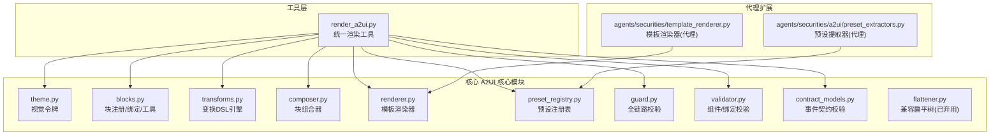
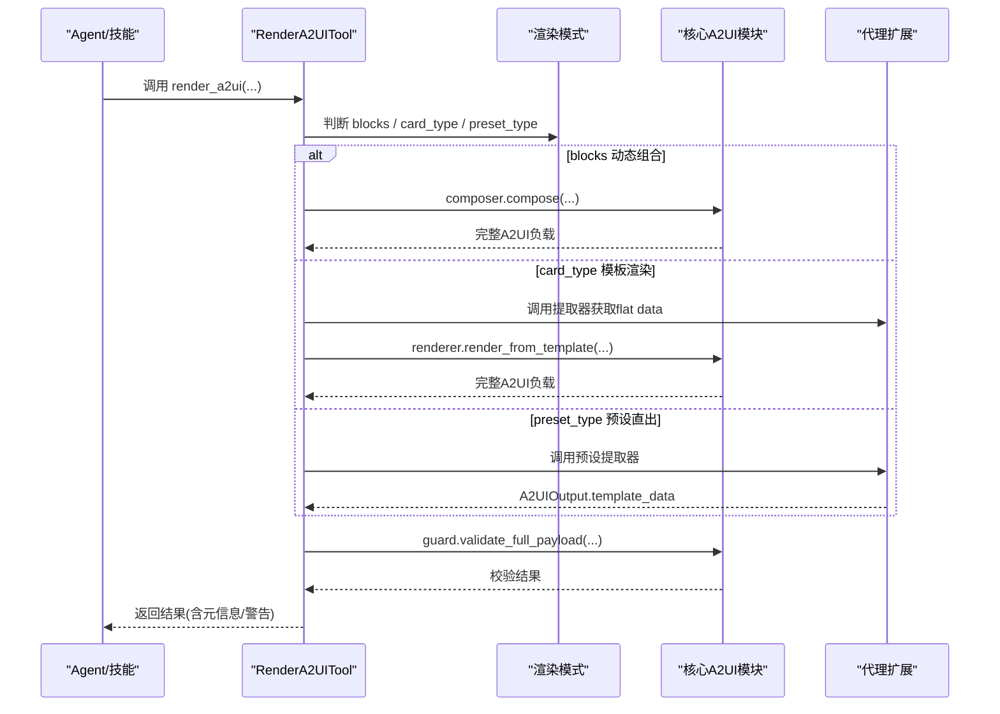
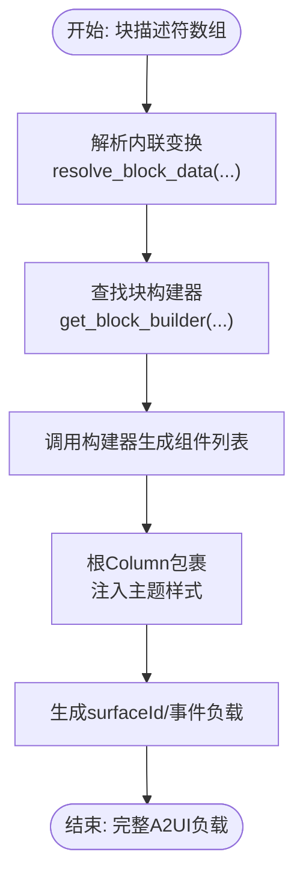
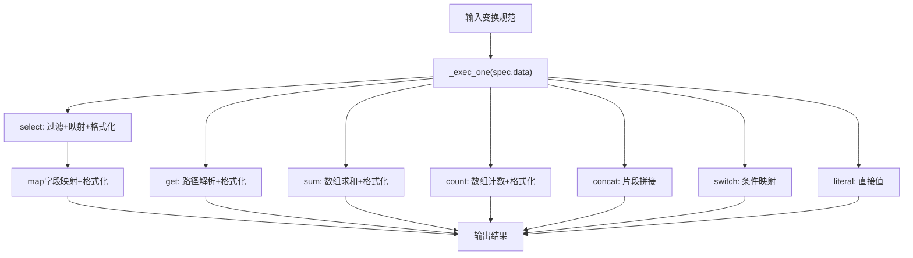
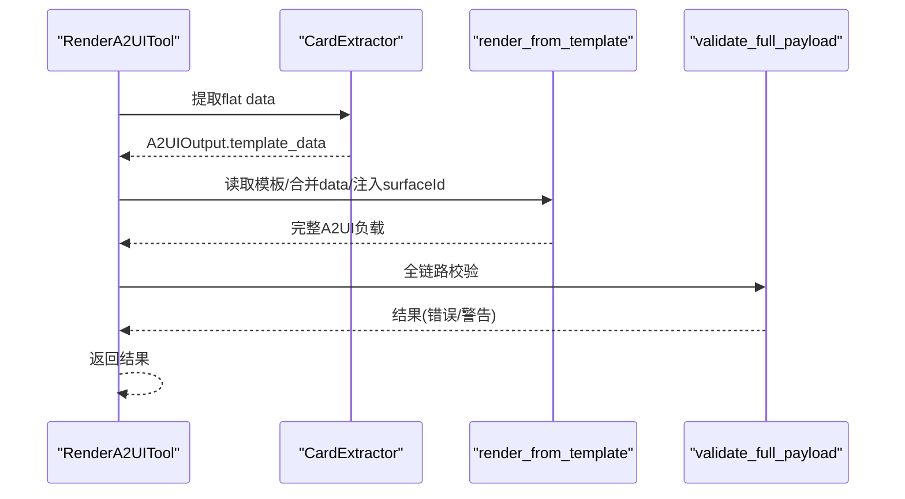
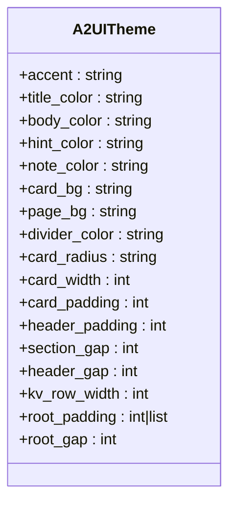
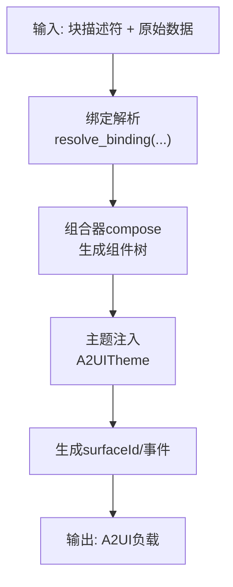
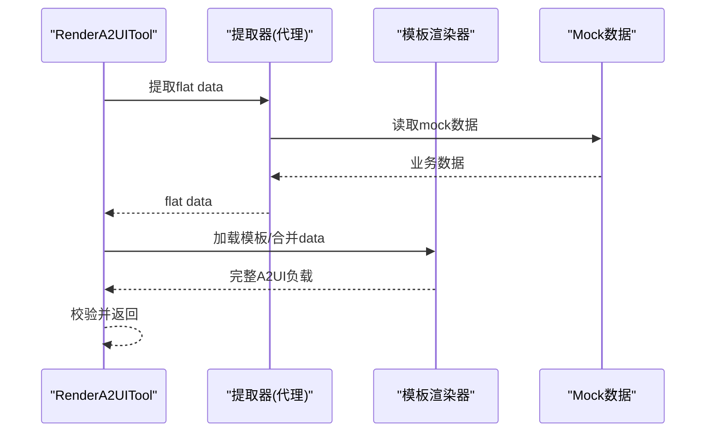
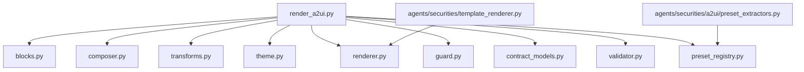

# A2UI 渲染系统

<cite>
**本文引用的文件**
- [blocks.py](file://src/ark_agentic/core/a2ui/blocks.py)
- [composer.py](file://src/ark_agentic/core/a2ui/composer.py)
- [renderer.py](file://src/ark_agentic/core/a2ui/renderer.py)
- [preset_registry.py](file://src/ark_agentic/core/a2ui/preset_registry.py)
- [theme.py](file://src/ark_agentic/core/a2ui/theme.py)
- [transforms.py](file://src/ark_agentic/core/a2ui/transforms.py)
- [flattener.py](file://src/ark_agentic/core/a2ui/flattener.py)
- [guard.py](file://src/ark_agentic/core/a2ui/guard.py)
- [contract_models.py](file://src/ark_agentic/core/a2ui/contract_models.py)
- [validator.py](file://src/ark_agentic/core/a2ui/validator.py)
- [render_a2ui.py](file://src/ark_agentic/core/tools/render_a2ui.py)
- [template_renderer.py](file://src/ark_agentic/agents/securities/template_renderer.py)
- [preset_extractors.py](file://src/ark_agentic/agents/securities/a2ui/preset_extractors.py)
- [account_overview_normal_user.json](file://src/ark_agentic/agents/securities/mock_data/account_overview/normal_user.json)
- [asset_profit_hist_normal_user.json](file://src/ark_agentic/agents/securities/mock_data/asset_profit_hist/normal_user.json)
- [cash_assets_normal_user.json](file://src/ark_agentic/agents/securities/mock_data/cash_assets/normal_user.json)
- [stock_daily_profit_normal_user.json](file://src/ark_agentic/agents/securities/mock_data/stock_daily_profit/normal_user.json)
</cite>

## 目录
1. [简介](#简介)
2. [项目结构](#项目结构)
3. [核心组件](#核心组件)
4. [架构总览](#架构总览)
5. [详细组件分析](#详细组件分析)
6. [依赖分析](#依赖分析)
7. [性能考虑](#性能考虑)
8. [故障排查指南](#故障排查指南)
9. [结论](#结论)
10. [附录](#附录)

## 简介
本文件面向证券智能体的 A2UI 渲染系统，系统性阐述卡片式 UI 组件的构建与渲染机制，涵盖以下方面：
- 块描述符系统：以“块”为单位的可组合 UI 构建单元，支持动态数据绑定与变换。
- 组件组合器：将块描述符转换为标准 A2UI 事件负载，统一注入主题与布局。
- 预设提取器与模板渲染器：基于模板目录与提取器的卡片直出模式，适合快速落地。
- 主题系统：集中管理视觉令牌，确保品牌一致性与可扩展性。
- 数据绑定与动态渲染：通过变换 DSL 将原始业务数据转换为 UI 就绪数据。
- 证券领域典型卡片：资产概览、持仓分析、收益分析等模板与实现要点。

本指南兼顾工程实现细节与非技术读者的理解需求，提供可视化图示、流程图与最佳实践建议。

## 项目结构
A2UI 渲染系统位于核心模块与代理模块中，核心能力集中在 core/a2ui 下，代理侧提供模板与提取器扩展点。

图表来源
- [render_a2ui.py:178-662](file://src/ark_agentic/core/tools/render_a2ui.py#L178-L662)
- [blocks.py:1-149](file://src/ark_agentic/core/a2ui/blocks.py#L1-L149)
- [composer.py:57-122](file://src/ark_agentic/core/a2ui/composer.py#L57-L122)
- [renderer.py:15-52](file://src/ark_agentic/core/a2ui/renderer.py#L15-L52)
- [preset_registry.py:25-52](file://src/ark_agentic/core/a2ui/preset_registry.py#L25-L52)
- [theme.py:12-39](file://src/ark_agentic/core/a2ui/theme.py#L12-L39)
- [transforms.py:186-395](file://src/ark_agentic/core/a2ui/transforms.py#L186-L395)
- [guard.py:83-124](file://src/ark_agentic/core/a2ui/guard.py#L83-L124)
- [validator.py:88-226](file://src/ark_agentic/core/a2ui/validator.py#L88-L226)
- [contract_models.py:97-122](file://src/ark_agentic/core/a2ui/contract_models.py#L97-L122)
- [template_renderer.py](file://src/ark_agentic/agents/securities/template_renderer.py)
- [preset_extractors.py](file://src/ark_agentic/agents/securities/a2ui/preset_extractors.py)

章节来源
- [render_a2ui.py:178-662](file://src/ark_agentic/core/tools/render_a2ui.py#L178-L662)
- [blocks.py:1-149](file://src/ark_agentic/core/a2ui/blocks.py#L1-L149)
- [composer.py:57-122](file://src/ark_agentic/core/a2ui/composer.py#L57-L122)
- [renderer.py:15-52](file://src/ark_agentic/core/a2ui/renderer.py#L15-L52)
- [preset_registry.py:25-52](file://src/ark_agentic/core/a2ui/preset_registry.py#L25-L52)
- [theme.py:12-39](file://src/ark_agentic/core/a2ui/theme.py#L12-L39)
- [transforms.py:186-395](file://src/ark_agentic/core/a2ui/transforms.py#L186-L395)
- [guard.py:83-124](file://src/ark_agentic/core/a2ui/guard.py#L83-L124)
- [validator.py:88-226](file://src/ark_agentic/core/a2ui/validator.py#L88-L226)
- [contract_models.py:97-122](file://src/ark_agentic/core/a2ui/contract_models.py#L97-L122)

## 核心组件
- 视觉主题 A2UITheme：集中定义品牌色板、圆角、间距、根容器布局等视觉令牌，作为所有渲染的默认来源。
- 块系统 blocks：提供块注册表、绑定解析、组件辅助构造方法，以及向后兼容的绑定别名。
- 变换 DSL transforms：声明式数据变换引擎，支持 get/sum/count/concat/select/switch/literal 等操作，将原始数据转换为 UI 就绪值。
- 组件组合器 composer：将块描述符数组转换为完整的 A2UI 事件负载，自动注入根 Column、主题与 surfaceId。
- 模板渲染器 renderer：从模板目录按卡片类型读取 template.json，合并 data 后输出完整负载。
- 预设注册表 preset_registry：为“预设卡片”模式提供 per-agent 提取器注册，直接返回前端就绪 payload。
- 全链路校验 guard：整合事件契约、组件/绑定校验与数据覆盖率检查，统一输出错误与警告。
- 统一渲染工具 render_a2ui：三通道合一的工具入口，支持 blocks 动态组合、card_type 模板渲染、preset_type 预设直出。

章节来源
- [theme.py:12-39](file://src/ark_agentic/core/a2ui/theme.py#L12-L39)
- [blocks.py:46-149](file://src/ark_agentic/core/a2ui/blocks.py#L46-L149)
- [transforms.py:186-395](file://src/ark_agentic/core/a2ui/transforms.py#L186-L395)
- [composer.py:57-122](file://src/ark_agentic/core/a2ui/composer.py#L57-L122)
- [renderer.py:15-52](file://src/ark_agentic/core/a2ui/renderer.py#L15-L52)
- [preset_registry.py:25-52](file://src/ark_agentic/core/a2ui/preset_registry.py#L25-L52)
- [guard.py:83-124](file://src/ark_agentic/core/a2ui/guard.py#L83-L124)
- [render_a2ui.py:178-662](file://src/ark_agentic/core/tools/render_a2ui.py#L178-L662)

## 架构总览
A2UI 渲染系统采用“工具层 + 核心模块 + 代理扩展”的分层设计。工具层根据调用参数选择渲染通道，核心模块提供通用能力，代理层负责业务卡片模板与提取器。

图表来源
- [render_a2ui.py:328-662](file://src/ark_agentic/core/tools/render_a2ui.py#L328-L662)
- [composer.py:60-122](file://src/ark_agentic/core/a2ui/composer.py#L60-L122)
- [renderer.py:15-52](file://src/ark_agentic/core/a2ui/renderer.py#L15-L52)
- [guard.py:83-124](file://src/ark_agentic/core/a2ui/guard.py#L83-L124)

## 详细组件分析

### 块描述符系统与组件组合器
- 块注册与必需键校验：通过装饰器注册块构建器，并对缺失键抛出 BlockDataError，保证输入完整性。
- 绑定解析：支持 $field 简写、字面量与 transform 规范，统一为标准绑定格式。
- 组合器职责：遍历块描述符，解析内联变换，查找构建器，生成组件树，包裹根 Column 并注入主题样式与 surfaceId。

图表来源
- [composer.py:45-122](file://src/ark_agentic/core/a2ui/composer.py#L45-L122)
- [blocks.py:102-149](file://src/ark_agentic/core/a2ui/blocks.py#L102-L149)

章节来源
- [blocks.py:102-149](file://src/ark_agentic/core/a2ui/blocks.py#L102-L149)
- [composer.py:45-122](file://src/ark_agentic/core/a2ui/composer.py#L45-L122)

### 变换 DSL 引擎
- 支持的操作：get、sum、count、concat、select、switch、literal。
- 路径解析：支持嵌套字段与数组索引/通配访问，提供详尽的错误上下文。
- 条件过滤：where 子句支持比较运算与 OR/AND 组合。
- 映射与格式化：select.map 支持字段映射与格式化，失败字段置空但不中断整体。
- 结果处理：统一格式化货币、百分比、整数与原样输出。

图表来源
- [transforms.py:186-395](file://src/ark_agentic/core/a2ui/transforms.py#L186-L395)

章节来源
- [transforms.py:186-395](file://src/ark_agentic/core/a2ui/transforms.py#L186-L395)

### 模板渲染器与预设提取器
- 模板渲染器：从模板根目录按卡片类型读取 template.json，注入 surfaceId，合并 data 后返回完整负载。
- 预设注册表：为每个卡片类型注册提取器，返回前端就绪的 A2UIOutput.template_data，避免组件树装配。

图表来源
- [render_a2ui.py:545-597](file://src/ark_agentic/core/tools/render_a2ui.py#L545-L597)
- [renderer.py:15-52](file://src/ark_agentic/core/a2ui/renderer.py#L15-L52)
- [preset_registry.py:25-52](file://src/ark_agentic/core/a2ui/preset_registry.py#L25-L52)
- [guard.py:83-124](file://src/ark_agentic/core/a2ui/guard.py#L83-L124)

章节来源
- [renderer.py:15-52](file://src/ark_agentic/core/a2ui/renderer.py#L15-L52)
- [preset_registry.py:25-52](file://src/ark_agentic/core/a2ui/preset_registry.py#L25-L52)
- [render_a2ui.py:545-597](file://src/ark_agentic/core/tools/render_a2ui.py#L545-L597)

### 主题系统与样式注入
- A2UITheme 提供统一视觉令牌，包括主色、文本色、背景色、圆角半径、卡片与根容器间距等。
- 组合器与工具层在生成根 Column 与 Card 时直接引用主题属性，确保风格一致。

图表来源
- [theme.py:12-39](file://src/ark_agentic/core/a2ui/theme.py#L12-L39)
- [composer.py:96-108](file://src/ark_agentic/core/a2ui/composer.py#L96-L108)
- [render_a2ui.py:431-437](file://src/ark_agentic/core/tools/render_a2ui.py#L431-L437)

章节来源
- [theme.py:12-39](file://src/ark_agentic/core/a2ui/theme.py#L12-L39)
- [composer.py:96-108](file://src/ark_agentic/core/a2ui/composer.py#L96-L108)
- [render_a2ui.py:431-437](file://src/ark_agentic/core/tools/render_a2ui.py#L431-L437)

### 数据绑定与动态渲染
- 绑定解析：$field 简写展开为标准绑定对象；支持字面量与 transform 规范。
- 卡片嵌套：Card 嵌套深度限制，防止过深导致渲染复杂度上升。
- 会话与 surfaceId：根据 session_id 与随机片段生成稳定且唯一的 surfaceId。

图表来源
- [blocks.py:65-89](file://src/ark_agentic/core/a2ui/blocks.py#L65-L89)
- [composer.py:60-122](file://src/ark_agentic/core/a2ui/composer.py#L60-L122)
- [render_a2ui.py:439-441](file://src/ark_agentic/core/tools/render_a2ui.py#L439-L441)

章节来源
- [blocks.py:65-89](file://src/ark_agentic/core/a2ui/blocks.py#L65-L89)
- [composer.py:60-122](file://src/ark_agentic/core/a2ui/composer.py#L60-L122)
- [render_a2ui.py:439-441](file://src/ark_agentic/core/tools/render_a2ui.py#L439-L441)

### 证券领域卡片模板与实现要点
- 资产概览卡片：展示总资产、可用资金、浮动盈亏等关键指标，使用模板渲染器按类型加载模板，结合提取器产出 flat data。
- 持仓分析卡片：通过变换 DSL 对持仓明细进行聚合与筛选，再映射为 UI 字段，支持条件过滤与格式化。
- 收益分析卡片：利用 sum/count/concat 等变换计算区间收益、胜率与累计曲线，输出数值与标签。

图表来源
- [render_a2ui.py:545-597](file://src/ark_agentic/core/tools/render_a2ui.py#L545-L597)
- [renderer.py:15-52](file://src/ark_agentic/core/a2ui/renderer.py#L15-L52)
- [account_overview_normal_user.json](file://src/ark_agentic/agents/securities/mock_data/account_overview/normal_user.json)
- [asset_profit_hist_normal_user.json](file://src/ark_agentic/agents/securities/mock_data/asset_profit_hist/normal_user.json)
- [cash_assets_normal_user.json](file://src/ark_agentic/agents/securities/mock_data/cash_assets/normal_user.json)
- [stock_daily_profit_normal_user.json](file://src/ark_agentic/agents/securities/mock_data/stock_daily_profit/normal_user.json)

章节来源
- [render_a2ui.py:545-597](file://src/ark_agentic/core/tools/render_a2ui.py#L545-L597)
- [renderer.py:15-52](file://src/ark_agentic/core/a2ui/renderer.py#L15-L52)
- [account_overview_normal_user.json](file://src/ark_agentic/agents/securities/mock_data/account_overview/normal_user.json)
- [asset_profit_hist_normal_user.json](file://src/ark_agentic/agents/securities/mock_data/asset_profit_hist/normal_user.json)
- [cash_assets_normal_user.json](file://src/ark_agentic/agents/securities/mock_data/cash_assets/normal_user.json)
- [stock_daily_profit_normal_user.json](file://src/ark_agentic/agents/securities/mock_data/stock_daily_profit/normal_user.json)

## 依赖分析
- 工具层依赖核心模块：统一渲染工具依赖块系统、组合器、变换引擎、主题、渲染器与校验模块。
- 代理扩展依赖工具层：模板渲染器与预设提取器通过工具层暴露的接口接入。
- 核心模块内部耦合度低：各模块职责清晰，通过协议与函数边界交互，便于替换与扩展。

图表来源
- [render_a2ui.py:25-31](file://src/ark_agentic/core/tools/render_a2ui.py#L25-L31)
- [blocks.py:19-21](file://src/ark_agentic/core/a2ui/blocks.py#L19-L21)
- [composer.py:20-22](file://src/ark_agentic/core/a2ui/composer.py#L20-L22)
- [renderer.py:9-12](file://src/ark_agentic/core/a2ui/renderer.py#L9-L12)
- [preset_registry.py:17-21](file://src/ark_agentic/core/a2ui/preset_registry.py#L17-L21)
- [guard.py:15-16](file://src/ark_agentic/core/a2ui/guard.py#L15-L16)
- [validator.py:5-6](file://src/ark_agentic/core/a2ui/validator.py#L5-L6)
- [contract_models.py:5-6](file://src/ark_agentic/core/a2ui/contract_models.py#L5-L6)

章节来源
- [render_a2ui.py:25-31](file://src/ark_agentic/core/tools/render_a2ui.py#L25-L31)
- [blocks.py:19-21](file://src/ark_agentic/core/a2ui/blocks.py#L19-L21)
- [composer.py:20-22](file://src/ark_agentic/core/a2ui/composer.py#L20-L22)
- [renderer.py:9-12](file://src/ark_agentic/core/a2ui/renderer.py#L9-L12)
- [preset_registry.py:17-21](file://src/ark_agentic/core/a2ui/preset_registry.py#L17-L21)
- [guard.py:15-16](file://src/ark_agentic/core/a2ui/guard.py#L15-L16)
- [validator.py:5-6](file://src/ark_agentic/core/a2ui/validator.py#L5-L6)
- [contract_models.py:5-6](file://src/ark_agentic/core/a2ui/contract_models.py#L5-L6)

## 性能考虑
- 变换 DSL 的确定性执行：所有数值计算在本地完成，避免 LLM 参与，减少不确定性与延迟。
- 组合器与渲染器的线性扫描：块描述符与组件树遍历为 O(n)，适合中小规模卡片。
- 表达式与路径解析：对数组通配与路径解析做了边界检查，异常快速失败，降低误用成本。
- 主题注入与布局：统一从 A2UITheme 获取样式，减少重复计算与不一致风险。

## 故障排查指南
- 事件契约错误：检查事件类型、必填字段与字段合法性，确保 beginRendering/surfaceUpdate/dataModelUpdate 的约束满足。
- 组件/绑定校验：确认组件类型、绑定字段仅包含 path 或 literalString 二选一，引用的子组件 ID 必须存在。
- 数据覆盖率：检查组件绑定的 path 是否存在于 payload.data，避免运行期缺字段。
- 变换执行错误：查看变换规范是否正确，路径是否存在、数组索引是否越界、条件表达式格式是否合法。
- 模板加载失败：确认模板路径存在且为合法 JSON，card_type 与模板目录匹配。

章节来源
- [contract_models.py:97-122](file://src/ark_agentic/core/a2ui/contract_models.py#L97-L122)
- [validator.py:88-226](file://src/ark_agentic/core/a2ui/validator.py#L88-L226)
- [guard.py:39-80](file://src/ark_agentic/core/a2ui/guard.py#L39-L80)
- [transforms.py:186-315](file://src/ark_agentic/core/a2ui/transforms.py#L186-L315)
- [renderer.py:40-41](file://src/ark_agentic/core/a2ui/renderer.py#L40-L41)

## 结论
A2UI 渲染系统通过“块描述符 + 组合器 + 主题 + 校验”的分层设计，实现了可组合、可扩展、可校验的卡片渲染能力。在证券场景下，结合模板渲染器与预设提取器，既能快速落地标准卡片，又能通过变换 DSL 实现灵活的数据加工。建议在实际开发中遵循统一的主题与校验策略，优先使用 blocks 动态组合与 card_type 模板渲染，必要时采用 preset_type 直出以提升性能。

## 附录
- A2UI 开发指南
  - 使用 blocks 模式时，先定义块构建器与组件，再通过组合器生成负载。
  - 使用 card_type 模式时，准备模板目录与提取器，确保 flat data 与模板字段一一对应。
  - 使用 preset_type 模式时，直接返回 A2UIOutput.template_data，避免组件树装配。
- 样式定制
  - 修改 A2UITheme 中的视觉令牌，即可全局生效。
  - 在组合器与工具层注入自定义主题实例，覆盖默认主题。
- 交互设计最佳实践
  - 绑定字段严格遵循 path/literalString 二选一原则。
  - 使用变换 DSL 进行数据清洗与格式化，减少前端负担。
  - 控制卡片嵌套深度，保持渲染性能与可维护性。