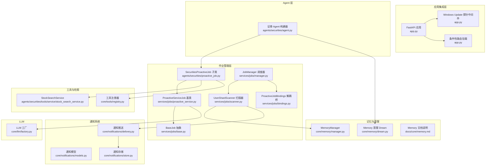
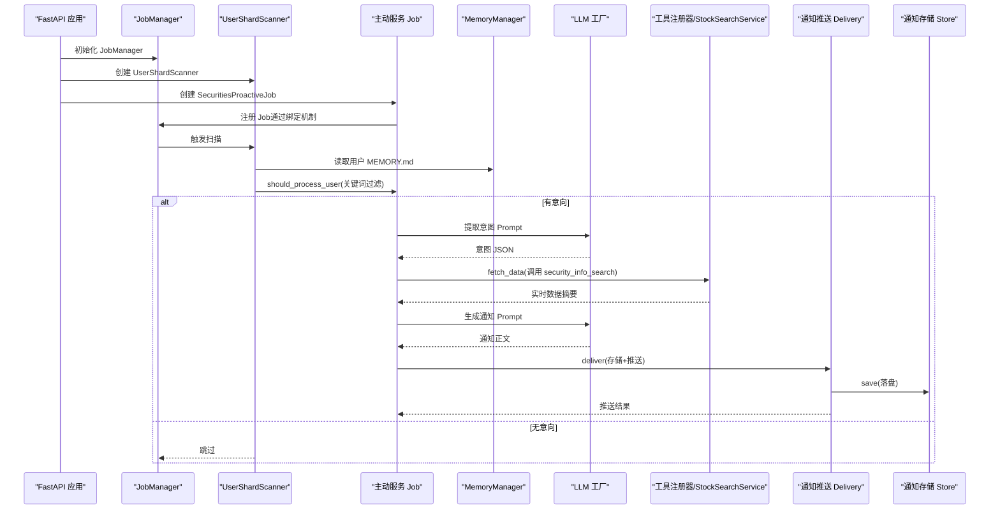
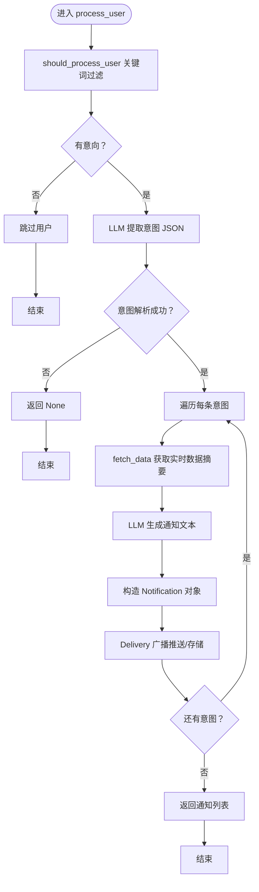
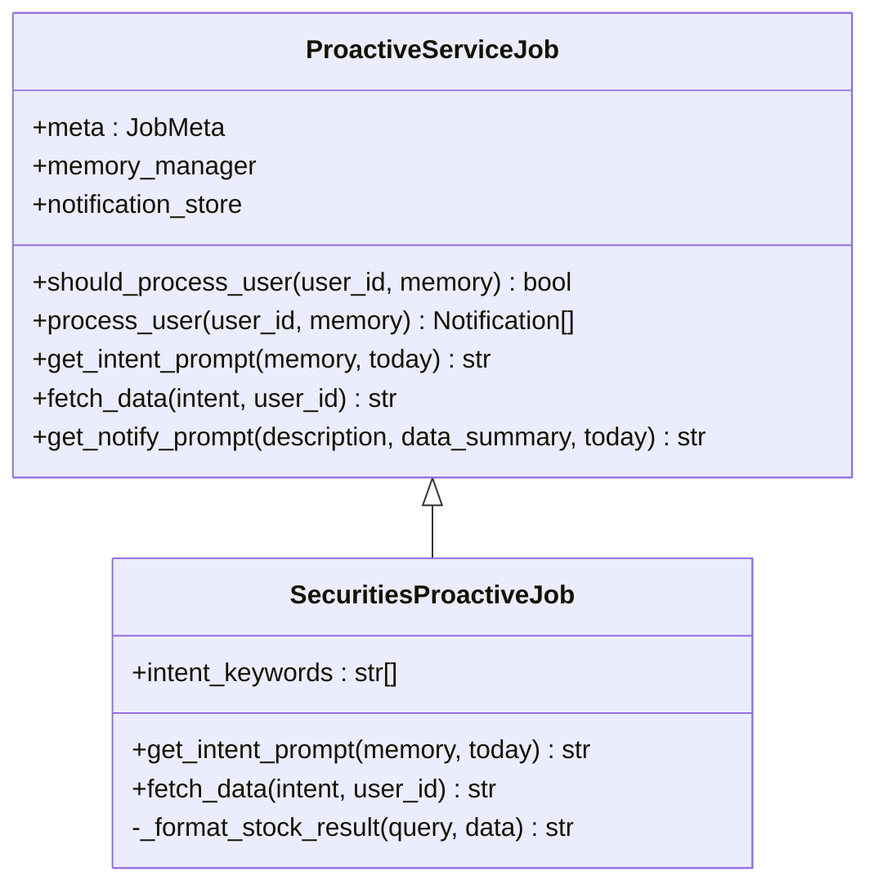
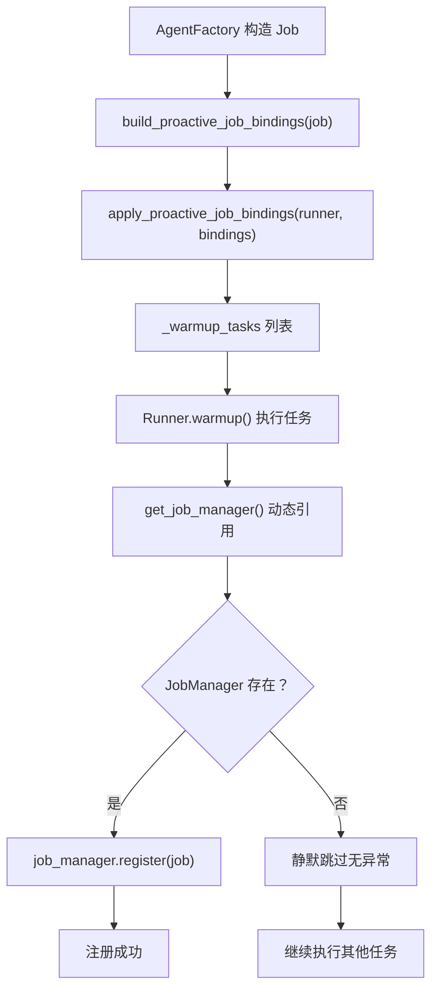
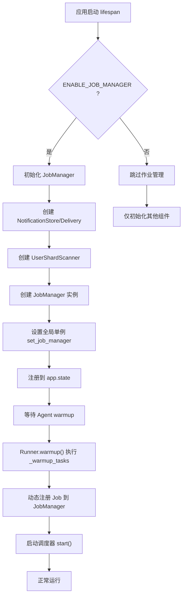
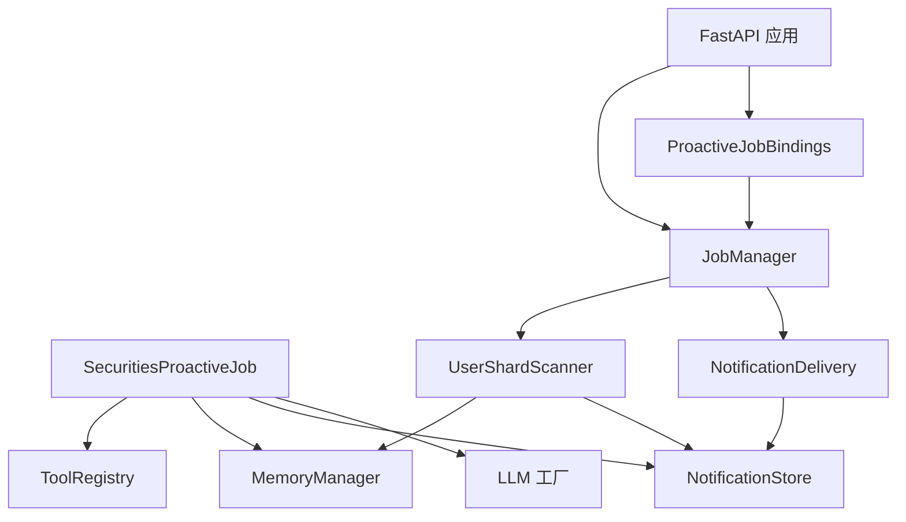

# 主动服务

<cite>
**本文引用的文件**
- [proactive_job.py](file://src/ark_agentic/agents/securities/proactive_job.py)
- [proactive_service.py](file://src/ark_agentic/services/jobs/proactive_service.py)
- [manager.py](file://src/ark_agentic/services/jobs/manager.py)
- [scanner.py](file://src/ark_agentic/services/jobs/scanner.py)
- [base.py](file://src/ark_agentic/services/jobs/base.py)
- [bindings.py](file://src/ark_agentic/services/jobs/bindings.py)
- [agent.py](file://src/ark_agentic/agents/securities/agent.py)
- [app.py](file://src/ark_agentic/app.py)
- [test_proactive_bindings.py](file://tests/unit/services/test_proactive_bindings.py)
- [.env-sample](file://.env-sample)
- [manager.py](file://src/ark_agentic/core/memory/manager.py)
- [models.py](file://src/ark_agentic/core/notifications/models.py)
- [store.py](file://src/ark_agentic/core/notifications/store.py)
- [delivery.py](file://src/ark_agentic/core/notifications/delivery.py)
- [stock_search_service.py](file://src/ark_agentic/agents/securities/tools/service/stock_search_service.py)
- [registry.py](file://src/ark_agentic/core/tools/registry.py)
- [factory.py](file://src/ark_agentic/core/llm/factory.py)
- [runner.py](file://src/ark_agentic/core/runner.py)
- [memory.md](file://docs/core/memory.md)
- [dream.py](file://src/ark_agentic/core/memory/dream.py)
</cite>

## 更新摘要
**所做更改**
- 新增作业管理生命周期管理章节，详细说明 JobManager 初始化和条件性路由挂载
- 添加环境变量配置选项和条件性功能启用机制
- 更新架构图以反映新的作业管理架构
- 新增 Windows Update 探针中间件功能说明
- 完善作业绑定机制和解耦桥接模式

## 目录
1. [简介](#简介)
2. [项目结构](#项目结构)
3. [核心组件](#核心组件)
4. [架构总览](#架构总览)
5. [详细组件分析](#详细组件分析)
6. [作业管理生命周期](#作业管理生命周期)
7. [条件性功能启用机制](#条件性功能启用机制)
8. [依赖分析](#依赖分析)
9. [性能考量](#性能考量)
10. [故障排除指南](#故障排除指南)
11. [结论](#结论)
12. [附录](#附录)

## 简介
本文件面向"证券智能体主动服务"的技术实现，围绕主动服务 Job 的设计原理、调度机制与执行流程展开，重点说明：
- 工作日触发策略与 Cron 配置
- LLM 后台蒸馏与 Memory 系统集成
- 内存管理与客户服务推送机制
- 作业管理生命周期与条件性功能启用
- Windows Update 探针中间件
- 监控指标与异常处理
- 性能优化建议与配置指南

## 项目结构
主动服务相关代码主要分布在以下模块：
- 作业与调度：services/jobs/proactive_service.py、services/jobs/manager.py、services/jobs/scanner.py、services/jobs/base.py、services/jobs/bindings.py
- 证券主动服务实现：agents/securities/proactive_job.py、agents/securities/agent.py
- 应用程序集成：app.py
- 记忆系统：core/memory/manager.py、docs/core/memory.md、core/memory/dream.py
- 通知系统：core/notifications/models.py、core/notifications/store.py、core/notifications/delivery.py
- 工具与检索：agents/securities/tools/service/stock_search_service.py、core/tools/registry.py
- LLM 工厂：core/llm/factory.py
- 运行器：core/runner.py

**图表来源**
- [proactive_service.py:49-221](file://src/ark_agentic/services/jobs/proactive_service.py#L49-L221)
- [proactive_job.py:54-145](file://src/ark_agentic/agents/securities/proactive_job.py#L54-L145)
- [manager.py:41-123](file://src/ark_agentic/services/jobs/manager.py#L41-L123)
- [scanner.py:34-194](file://src/ark_agentic/services/jobs/scanner.py#L34-L194)
- [base.py:20-103](file://src/ark_agentic/services/jobs/base.py#L20-L103)
- [bindings.py:1-78](file://src/ark_agentic/services/jobs/bindings.py#L1-L78)
- [agent.py:37-173](file://src/ark_agentic/agents/securities/agent.py#L37-L173)
- [app.py:52-165](file://src/ark_agentic/app.py#L52-L165)
- [manager.py:24-92](file://src/ark_agentic/core/memory/manager.py#L24-L92)
- [models.py:12-29](file://src/ark_agentic/core/notifications/models.py#L12-L29)
- [store.py:25-126](file://src/ark_agentic/core/notifications/store.py#L25-L126)
- [delivery.py:22-88](file://src/ark_agentic/core/notifications/delivery.py#L22-L88)
- [stock_search_service.py:32-84](file://src/ark_agentic/agents/securities/tools/service/stock_search_service.py#L32-L84)
- [registry.py:14-178](file://src/ark_agentic/core/tools/registry.py#L14-L178)
- [factory.py:104-275](file://src/ark_agentic/core/llm/factory.py#L104-L275)
- [runner.py:193-200](file://src/ark_agentic/core/runner.py#L193-L200)

**章节来源**
- [proactive_job.py:1-145](file://src/ark_agentic/agents/securities/proactive_job.py#L1-L145)
- [proactive_service.py:1-221](file://src/ark_agentic/services/jobs/proactive_service.py#L1-L221)
- [manager.py:1-123](file://src/ark_agentic/services/jobs/manager.py#L1-L123)
- [scanner.py:1-194](file://src/ark_agentic/services/jobs/scanner.py#L1-L194)
- [base.py:1-103](file://src/ark_agentic/services/jobs/base.py#L1-L103)
- [bindings.py:1-78](file://src/ark_agentic/services/jobs/bindings.py#L1-L78)
- [agent.py:1-173](file://src/ark_agentic/agents/securities/agent.py#L1-L173)
- [app.py:1-165](file://src/ark_agentic/app.py#L1-L165)
- [manager.py:1-92](file://src/ark_agentic/core/memory/manager.py#L1-L92)
- [models.py:1-29](file://src/ark_agentic/core/notifications/models.py#L1-L29)
- [store.py:1-126](file://src/ark_agentic/core/notifications/store.py#L1-L126)
- [delivery.py:1-88](file://src/ark_agentic/core/notifications/delivery.py#L1-L88)
- [stock_search_service.py:1-84](file://src/ark_agentic/agents/securities/tools/service/stock_search_service.py#L1-L84)
- [registry.py:1-178](file://src/ark_agentic/core/tools/registry.py#L1-L178)
- [factory.py:1-275](file://src/ark_agentic/core/llm/factory.py#L1-L275)
- [runner.py:1-200](file://src/ark_agentic/core/runner.py#L1-L200)
- [memory.md:1-99](file://docs/core/memory.md#L1-L99)
- [dream.py:1-322](file://src/ark_agentic/core/memory/dream.py#L1-L322)

## 核心组件
- 主动服务基类：定义意图提取、数据获取、通知生成的统一流程与钩子，负责并发、批处理、幂等保护与统计。
- 证券主动服务子类：覆盖关键词过滤、意图提取 Prompt、数据获取（调用安全工具）、通知文本生成。
- 作业管理器：统一调度多个 BaseJob 实例，通过 APScheduler 按 Cron 触发，支持手动触发和生命周期管理。
- 条件性路由挂载：基于环境变量 ENABLE_JOB_MANAGER 动态挂载通知和作业管理 API 路由。
- 作业绑定机制：ProactiveJobBindings 作为解耦桥，将 AgentFactory 与 Core Runner 解耦。
- Windows Update 探针中间件：静默处理 Windows Update 请求，避免产生无意义的日志。
- 调度器与扫描器：基于 APScheduler 的 Cron 触发，按用户分片扫描，控制并发与超时。
- 记忆系统与蒸馏：MEMORY.md 作为单一可信源，Session 到 Memory 的周期蒸馏，支撑主动服务的上下文输入。
- 通知系统：落盘优先，实时推送在线用户，离线用户持久化存储。
- 工具与检索：本地 CSV 加载的股票检索服务，支持进程内缓存与分红附加。
- LLM 工厂：统一模型创建与采样配置，支持 PA 与 OpenAI 兼容端点。

**章节来源**
- [proactive_service.py:49-221](file://src/ark_agentic/services/jobs/proactive_service.py#L49-L221)
- [proactive_job.py:54-145](file://src/ark_agentic/agents/securities/proactive_job.py#L54-L145)
- [manager.py:41-123](file://src/ark_agentic/services/jobs/manager.py#L41-L123)
- [bindings.py:1-78](file://src/ark_agentic/services/jobs/bindings.py#L1-L78)
- [app.py:148-165](file://src/ark_agentic/app.py#L148-L165)
- [scanner.py:34-194](file://src/ark_agentic/services/jobs/scanner.py#L34-L194)
- [manager.py:24-92](file://src/ark_agentic/core/memory/manager.py#L24-L92)
- [models.py:12-29](file://src/ark_agentic/core/notifications/models.py#L12-L29)
- [store.py:25-126](file://src/ark_agentic/core/notifications/store.py#L25-L126)
- [delivery.py:22-88](file://src/ark_agentic/core/notifications/delivery.py#L22-L88)
- [stock_search_service.py:32-84](file://src/ark_agentic/agents/securities/tools/service/stock_search_service.py#L32-L84)
- [registry.py:14-178](file://src/ark_agentic/core/tools/registry.py#L14-L178)
- [factory.py:104-275](file://src/ark_agentic/core/llm/factory.py#L104-L275)

## 架构总览
主动服务的整体执行链路如下：
- AgentRunner 在构建证券 Agent 时，按需创建 SecuritiesProactiveJob。
- ProactiveJobBindings 作为解耦桥，将 Job 注册到 Runner 的 _warmup_tasks 中。
- Runner.warmup() 执行 _warmup_tasks，动态引用 get_job_manager() 获取 JobManager。
- JobManager 注册 Job，基于 Cron 表达式调度。
- UserShardScanner 扫描用户目录，按活跃度排序，分片与批处理并发处理。
- SecuritiesProactiveJob 通过关键词快速过滤 → LLM 意图提取 → 工具调用 → 通知生成 → 推送/存储。
- 通知系统先落盘，再尝试实时推送；离线用户持久化存储等待拉取。
- Memory 系统通过 Dream 周期性蒸馏，确保 MEMORY.md 的时效性与质量。
- FastAPI 应用通过 Windows Update 探针中间件处理系统请求，条件性挂载作业管理路由。

**图表来源**
- [app.py:52-117](file://src/ark_agentic/app.py#L52-L117)
- [manager.py:110-123](file://src/ark_agentic/services/jobs/manager.py#L110-L123)
- [scanner.py:57-92](file://src/ark_agentic/services/jobs/scanner.py#L57-L92)
- [proactive_service.py:142-156](file://src/ark_agentic/services/jobs/proactive_service.py#L142-L156)
- [proactive_job.py:79-104](file://src/ark_agentic/agents/securities/proactive_job.py#L79-L104)
- [delivery.py:46-77](file://src/ark_agentic/core/notifications/delivery.py#L46-L77)
- [store.py:43-53](file://src/ark_agentic/core/notifications/store.py#L43-L53)

## 详细组件分析

### 主动服务基类（ProactiveServiceJob）
- 设计要点
  - 三钩子模式：关键词过滤、意图提取 Prompt、数据获取。
  - 统一流程：should_process_user → process_user → _extract_intents → _process_intent → _generate_notification_text。
  - 并发与批处理：通过 JobMeta 控制并发用户数与批大小；Scanner 分批 gather 并发。
  - 幂等保护：按用户写入 .last_job_{job_id}，24 小时内跳过重复处理。
  - 统计指标：JobRunStats 记录扫描、跳过、通知、推送、存储、错误、超时。
- 关键配置
  - cron 默认每日 9:00；可通过构造函数参数覆盖。
  - 并发上限、批大小、单用户超时可在 JobMeta 中调整。
- 异常处理
  - 意图提取与通知生成失败时记录警告并返回空结果，不影响整体流程。
  - JSON 解析增强：支持去除代码块包裹与边界裁剪。

**图表来源**
- [proactive_service.py:142-205](file://src/ark_agentic/services/jobs/proactive_service.py#L142-L205)

**章节来源**
- [proactive_service.py:49-221](file://src/ark_agentic/services/jobs/proactive_service.py#L49-L221)
- [base.py:20-103](file://src/ark_agentic/services/jobs/base.py#L20-L103)

### 证券主动服务子类（SecuritiesProactiveJob）
- 关键词快速过滤：覆盖 intent_keywords，使用高频关键词在 <1ms 内完成初步筛选。
- 意图提取 Prompt：模板化 Prompt，要求返回 JSON，包含类型、标题、符号与描述。
- 数据获取：通过工具注册器获取 security_info_search，构造 ToolCall，调用工具执行并格式化结果。
- 结果格式化：处理多候选、缺失数据与分红信息，输出简洁可读摘要。
- 与 Agent 集成：在 create_securities_agent 中按需创建并注入 Runner。

**图表来源**
- [proactive_service.py:49-135](file://src/ark_agentic/services/jobs/proactive_service.py#L49-L135)
- [proactive_job.py:54-145](file://src/ark_agentic/agents/securities/proactive_job.py#L54-L145)

**章节来源**
- [proactive_job.py:54-145](file://src/ark_agentic/agents/securities/proactive_job.py#L54-L145)
- [agent.py:149-172](file://src/ark_agentic/agents/securities/agent.py#L149-L172)

### 作业绑定机制（ProactiveJobBindings）
- 解耦桥设计：ProactiveJobBindings 作为 AgentFactory 与 Core Runner 的解耦桥。
- 动态注册：apply_proactive_job_bindings 将注册任务挂到 runner 的 _warmup_tasks 上。
- 条件性启用：当 get_job_manager() 返回 None 时静默跳过，支持未启用 JobManager 的场景。
- 温启动集成：Runner.warmup() 时执行 _warmup_tasks，动态引用 JobManager。

**图表来源**
- [bindings.py:38-77](file://src/ark_agentic/services/jobs/bindings.py#L38-L77)

**章节来源**
- [bindings.py:1-78](file://src/ark_agentic/services/jobs/bindings.py#L1-L78)
- [test_proactive_bindings.py:71-104](file://tests/unit/services/test_proactive_bindings.py#L71-L104)

## 作业管理生命周期
- JobManager 初始化
  - 在 FastAPI lifespan 中根据 ENABLE_JOB_MANAGER 环境变量决定是否初始化。
  - 需要在 agent warmup 之前设置，因为 warmup 时会自动向 JobManager 注册 Job。
  - 支持 apscheduler 依赖的条件性导入，未安装时提供清晰的错误信息。
- 生命周期管理
  - start/stop 方法：在 FastAPI lifespan 开始和结束时调用，确保调度器正确启动和停止。
  - dispatch 方法：支持手动立即触发某个 Job，供管理 API 或测试使用。
  - list_jobs 方法：返回所有已注册 Job 的基本信息，包括 cron、enabled 状态和下次运行时间。
- 作业注册与调度
  - register 方法：注册 Job 并添加到 APScheduler，支持防重复触发和错过的触发合并。
  - _run_job 方法：实际执行 Job 的入口，包含异常处理和统计信息记录。
  - CronTrigger.from_crontab：支持标准 Cron 表达式，如 "0 9 * * 1-5"（工作日 9:00）。

**图表来源**
- [app.py:52-117](file://src/ark_agentic/app.py#L52-L117)
- [manager.py:81-123](file://src/ark_agentic/services/jobs/manager.py#L81-L123)

**章节来源**
- [manager.py:1-123](file://src/ark_agentic/services/jobs/manager.py#L1-L123)
- [app.py:52-117](file://src/ark_agentic/app.py#L52-L117)

## 条件性功能启用机制
- 环境变量控制
  - ENABLE_JOB_MANAGER：控制是否启用作业管理功能，影响 JobManager 初始化和路由挂载。
  - JOB_MAX_CONCURRENT/JOB_BATCH_SIZE/JOB_SHARD_INDEX/JOB_TOTAL_SHARDS：控制作业执行参数。
  - ENABLE_MEMORY/ENABLE_DREAM：控制记忆和蒸馏功能。
- 条件性路由挂载
  - 仅在 ENABLE_JOB_MANAGER=1 时挂载 /api/notifications 和 /api/jobs 路由。
  - 依赖 services/jobs 的 apscheduler 与 services/notifications 的 FastAPI 路由。
- 依赖管理
  - 通过 try/except 导入 JobManager，未安装 `ark-agentic[jobs]` 时提供调试信息。
  - apscheduler 依赖仅在需要时加载，避免不必要的依赖。

**章节来源**
- [app.py:48-72](file://src/ark_agentic/app.py#L48-L72)
- [app.py:159-165](file://src/ark_agentic/app.py#L159-L165)
- [app.py:32-41](file://src/ark_agentic/services/jobs/__init__.py#L32-L41)
- [.env-sample:1-88](file://.env-sample#L1-L88)

## 依赖分析
- 组件耦合
  - SecuritiesProactiveJob 依赖 ToolRegistry、MemoryManager、NotificationStore、LLM 工厂。
  - JobManager 依赖 Scanner、Delivery、NotificationStore。
  - Scanner 依赖 MemoryManager、NotificationStore、NotificationDelivery。
  - ProactiveJobBindings 依赖 JobManager，但通过动态导入避免强耦合。
- 外部依赖
  - APScheduler 用于 Cron 调度。
  - LangChain ChatOpenAI 作为 LLM 后端。
  - 文件系统用于持久化（MEMORY.md、通知 JSONL、.read_ids、.last_job_*）。
  - FastAPI 用于 Web 服务和路由管理。

**图表来源**
- [proactive_job.py:79-104](file://src/ark_agentic/agents/securities/proactive_job.py#L79-L104)
- [manager.py:41-89](file://src/ark_agentic/services/jobs/manager.py#L41-L89)
- [scanner.py:57-92](file://src/ark_agentic/services/jobs/scanner.py#L57-L92)
- [bindings.py:52-70](file://src/ark_agentic/services/jobs/bindings.py#L52-L70)
- [app.py:52-91](file://src/ark_agentic/app.py#L52-L91)
- [delivery.py:22-43](file://src/ark_agentic/core/notifications/delivery.py#L22-L43)

**章节来源**
- [proactive_job.py:18-22](file://src/ark_agentic/agents/securities/proactive_job.py#L18-L22)
- [manager.py:15-21](file://src/ark_agentic/services/jobs/manager.py#L15-L21)
- [scanner.py:18-23](file://src/ark_agentic/services/jobs/scanner.py#L18-L23)
- [bindings.py:17-20](file://src/ark_agentic/services/jobs/bindings.py#L17-L20)

## 性能考量
- 关键词过滤优先：intent_keywords 在 <1ms 内完成初步筛选，大幅降低 LLM 调用压力。
- 并发与批处理：Scanner 使用 Semaphore 控制并发，分批 gather 并发，减少事件循环占用。
- 幂等保护：.last_job_{job_id} 防止重复处理，避免资源浪费。
- 存储与推送：通知先落盘再推送，避免推送失败导致的数据丢失；队列容量限制防止慢消费者积压。
- 蒸馏优化：Dream 周期性合并，减少 MEMORY.md 更新频率，降低后续读取成本。
- 检索性能：StockSearchService 使用进程内单例 Loader 与 MultiPathMatcher，避免重复 IO。
- 条件性加载：JobManager 通过 try/except 导入，未启用时完全跳过，避免不必要的开销。
- 中间件优化：Windows Update 探针中间件静默处理系统请求，减少日志噪声。

**章节来源**
- [proactive_service.py:138-140](file://src/ark_agentic/services/jobs/proactive_service.py#L138-L140)
- [scanner.py:43-56](file://src/ark_agentic/services/jobs/scanner.py#L43-L56)
- [delivery.py:18-20](file://src/ark_agentic/core/notifications/delivery.py#L18-L20)
- [stock_search_service.py:23-29](file://src/ark_agentic/agents/securities/tools/service/stock_search_service.py#L23-L29)
- [dream.py:289-322](file://src/ark_agentic/core/memory/dream.py#L289-L322)
- [bindings.py:52-61](file://src/ark_agentic/services/jobs/bindings.py#L52-L61)
- [app.py:148-155](file://src/ark_agentic/app.py#L148-L155)

## 故障排除指南
- Cron 未触发
  - 检查 ENABLE_JOB_MANAGER 环境变量是否正确设置。
  - 确认 JobManager 初始化和 APScheduler 状态；检查 job.meta.enabled 与 cron 表达式。
  - 使用 list_jobs 查看 next_run 时间和 job 状态。
- 主动服务无通知
  - 确认用户 MEMORY.md 是否存在且包含关键词；检查 should_process_user 过滤条件。
  - 意图提取失败会记录警告并返回空结果，检查 LLM 输出与 JSON 解析。
- 工具调用失败
  - 确认 ToolRegistry 中 security_info_search 已注册；检查 fetch_data 返回的错误信息。
- 通知未送达
  - 确认用户在线状态与队列容量；查看推送日志；离线用户检查通知存储文件。
- 蒸馏异常
  - 检查 .last_dream 文件与失败计数；必要时手动推进时间戳以恢复。
- 作业管理功能异常
  - 检查 apscheduler 依赖是否正确安装（pip install 'ark-agentic[proactive]'）。
  - 确认 ENABLE_JOB_MANAGER 环境变量设置；检查 JobManager 全局单例是否正确设置。
- 路由挂载问题
  - 确认 ENABLE_JOB_MANAGER=1 时才会挂载 /api/notifications 和 /api/jobs 路由。
  - 检查 FastAPI 应用的路由配置和中间件设置。
- Windows Update 探针问题
  - 确认中间件正确处理 msdownload/update 路径；检查日志中是否有相关条目。

**章节来源**
- [manager.py:97-108](file://src/ark_agentic/services/jobs/manager.py#L97-L108)
- [scanner.py:162-167](file://src/ark_agentic/services/jobs/scanner.py#L162-L167)
- [proactive_service.py:169-171](file://src/ark_agentic/services/jobs/proactive_service.py#L169-L171)
- [delivery.py:76-87](file://src/ark_agentic/core/notifications/delivery.py#L76-L87)
- [dream.py:548-572](file://src/ark_agentic/core/memory/dream.py#L548-L572)
- [app.py:68-72](file://src/ark_agentic/app.py#L68-L72)
- [app.py:159-165](file://src/ark_agentic/app.py#L159-L165)

## 结论
主动服务通过"关键词过滤 + LLM 意图提取 + 工具调用 + 通知生成"的流水线，结合 Cron 调度、分片扫描与幂等保护，在保证性能与可靠性的同时，实现了面向证券领域的智能化客户服务。新增的作业管理生命周期管理、条件性功能启用机制和 Windows Update 探针中间件进一步增强了系统的可维护性和生产环境适应性。配合 Memory 蒸馏与通知落盘推送，形成闭环的用户体验。

## 附录

### Cron 表达式配置与工作日触发策略
- 默认：每日 9:00（非工作日也会触发）。
- 工作日触发：推荐 "0 9 * * 1-5"（周一至周五 9:00）。
- 多时段触发：如 "0 8,12 * * *"（早 8:00 与 12:00）。
- 高频触发：如 "*/30 9-15 * * 1-5"（工作日 9:00-15:00 每 30 分钟）。
- 配置位置：在 create_securities_agent 的 proactive_cron 参数传入自定义表达式。

**章节来源**
- [agent.py:42-55](file://src/ark_agentic/agents/securities/agent.py#L42-L55)
- [proactive_service.py:104-119](file://src/ark_agentic/services/jobs/proactive_service.py#L104-L119)

### 主动服务配置指南
- 启用 Memory：在 create_securities_agent 中开启 enable_memory，以便主动服务读取 MEMORY.md。
- LLM 配置：通过 LLM 工厂创建 ChatOpenAI 实例，支持 PA 与 OpenAI 兼容端点。
- 工具注册：确保 security_info_search 工具已注册到 ToolRegistry。
- 通知存储：通知按 agent_id 隔离目录，避免跨域干扰。
- 并发与批大小：根据服务器资源调整 JobMeta 的 max_concurrent_users 与 batch_size。
- 作业管理配置：通过环境变量 ENABLE_JOB_MANAGER 控制作业管理功能启停。

**章节来源**
- [agent.py:61-114](file://src/ark_agentic/agents/securities/agent.py#L61-L114)
- [factory.py:215-266](file://src/ark_agentic/core/llm/factory.py#L215-L266)
- [registry.py:24-50](file://src/ark_agentic/core/tools/registry.py#L24-L50)
- [store.py:25-28](file://src/ark_agentic/core/notifications/store.py#L25-L28)
- [proactive_service.py:113-119](file://src/ark_agentic/services/jobs/proactive_service.py#L113-L119)

### 服务执行监控最佳实践
- 统计指标：关注扫描数、跳过数、通知数、推送数、存储数、错误数、超时数。
- 日志：观察 JobManager、Scanner、Delivery 的日志级别与异常堆栈。
- 性能观测：记录 StockSearchService 查询耗时与 LLM 调用耗时，定位瓶颈。
- 告警：对连续错误与超时设置阈值告警。
- 作业管理监控：监控 JobManager 的启动状态、作业注册情况和调度器运行状态。

**章节来源**
- [scanner.py:162-167](file://src/ark_agentic/services/jobs/scanner.py#L162-L167)
- [delivery.py:76-87](file://src/ark_agentic/core/notifications/delivery.py#L76-L87)
- [stock_search_service.py:58-83](file://src/ark_agentic/agents/securities/tools/service/stock_search_service.py#L58-L83)
- [manager.py:81-108](file://src/ark_agentic/services/jobs/manager.py#L81-L108)

### 条件性功能启用配置
- 环境变量设置
  - ENABLE_JOB_MANAGER=true：启用作业管理功能，挂载相关路由。
  - ENABLE_MEMORY=true：启用记忆功能。
  - ENABLE_DREAM=true：启用记忆蒸馏功能。
  - JOB_MAX_CONCURRENT=50：设置最大并发用户数。
  - JOB_BATCH_SIZE=500：设置批处理大小。
  - JOB_SHARD_INDEX=0：设置分片索引。
  - JOB_TOTAL_SHARDS=1：设置总分片数。
- 依赖安装
  - pip install 'ark-agentic[proactive]'：安装 apscheduler 依赖。
  - 未安装时 JobManager 将不可用，但系统仍可正常运行其他功能。

**章节来源**
- [app.py:48-91](file://src/ark_agentic/app.py#L48-L91)
- [.env-sample:1-88](file://.env-sample#L1-L88)
- [app.py:32-41](file://src/ark_agentic/services/jobs/__init__.py#L32-L41)