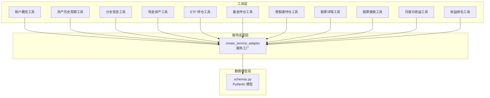
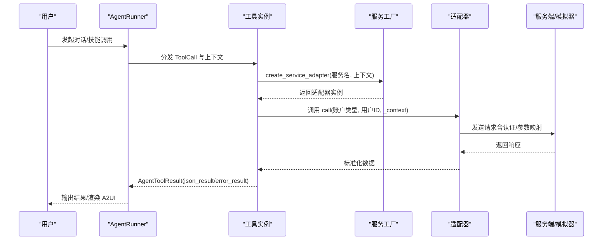
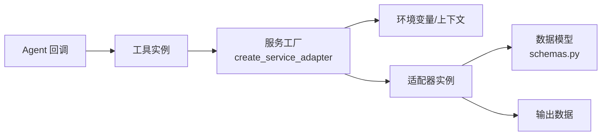

# 代理工具集

<cite>
**本文引用的文件**
- [src/ark_agentic/agents/securities/tools/__init__.py](file://src/ark_agentic/agents/securities/tools/__init__.py)
- [src/ark_agentic/agents/securities/tools/agent/account_overview.py](file://src/ark_agentic/agents/securities/tools/agent/account_overview.py)
- [src/ark_agentic/agents/securities/tools/agent/asset_profit_hist_period.py](file://src/ark_agentic/agents/securities/tools/agent/asset_profit_hist_period.py)
- [src/ark_agentic/agents/securities/tools/agent/branch_info.py](file://src/ark_agentic/agents/securities/tools/agent/branch_info.py)
- [src/ark_agentic/agents/securities/tools/agent/cash_assets.py](file://src/ark_agentic/agents/securities/tools/agent/cash_assets.py)
- [src/ark_agentic/agents/securities/tools/agent/etf_holdings.py](file://src/ark_agentic/agents/securities/tools/agent/etf_holdings.py)
- [src/ark_agentic/agents/securities/tools/agent/fund_holdings.py](file://src/ark_agentic/agents/securities/tools/agent/fund_holdings.py)
- [src/ark_agentic/agents/securities/tools/agent/hksc_holdings.py](file://src/ark_agentic/agents/securities/tools/agent/hksc_holdings.py)
- [src/ark_agentic/agents/securities/tools/agent/security_detail.py](file://src/ark_agentic/agents/securities/tools/agent/security_detail.py)
- [src/ark_agentic/agents/securities/tools/agent/security_info_search.py](file://src/ark_agentic/agents/securities/tools/agent/security_info_search.py)
- [src/ark_agentic/agents/securities/tools/agent/stock_daily_profit_month.py](file://src/ark_agentic/agents/securities/tools/agent/stock_daily_profit_month.py)
- [src/ark_agentic/agents/securities/tools/agent/stock_daily_profit_range.py](file://src/ark_agentic/agents/securities/tools/agent/stock_daily_profit_range.py)
- [src/ark_agentic/agents/securities/tools/agent/stock_profit_ranking.py](file://src/ark_agentic/agents/securities/tools/agent/stock_profit_ranking.py)
- [src/ark_agentic/agents/securities/tools/service/__init__.py](file://src/ark_agentic/agents/securities/tools/service/__init__.py)
- [src/ark_agentic/agents/securities/schemas.py](file://src/ark_agentic/agents/securities/schemas.py)
- [src/ark_agentic/agents/securities/validation.py](file://src/ark_agentic/agents/securities/validation.py)
- [src/ark_agentic/agents/securities/agent.py](file://src/ark_agentic/agents/securities/agent.py)
</cite>

## 目录
1. [简介](#简介)
2. [项目结构](#项目结构)
3. [核心组件](#核心组件)
4. [架构总览](#架构总览)
5. [详细组件分析](#详细组件分析)
6. [依赖分析](#依赖分析)
7. [性能考虑](#性能考虑)
8. [故障排查指南](#故障排查指南)
9. [结论](#结论)
10. [附录](#附录)

## 简介
本文件系统性梳理“证券智能体代理工具集”的设计与实现，覆盖账户概览、资产历史、分支信息、现金资产、ETF/基金/港股通持仓、股票详情、日收益与收益排名等工具。文档面向开发者与产品人员，提供工具功能、参数、返回结构、调用方式与使用场景说明，并给出最佳实践与常见问题处理建议。

## 项目结构
证券智能体工具集位于 agents/securities 子模块，采用“工具层 + 服务适配层 + 数据模型层”的分层架构：
- 工具层：各业务工具封装为 AgentTool 子类，负责参数解析、上下文注入与错误处理。
- 服务适配层：统一通过 create_service_adapter 创建对应服务适配器，屏蔽真实 API 与 Mock 模式差异。
- 数据模型层：使用 Pydantic 定义标准化数据结构，确保输出一致性与强类型校验。

图表来源
- [src/ark_agentic/agents/securities/tools/__init__.py:48-66](file://src/ark_agentic/agents/securities/tools/__init__.py#L48-L66)
- [src/ark_agentic/agents/securities/tools/service/__init__.py:39-85](file://src/ark_agentic/agents/securities/tools/service/__init__.py#L39-L85)
- [src/ark_agentic/agents/securities/schemas.py:1-465](file://src/ark_agentic/agents/securities/schemas.py#L1-L465)

章节来源
- [src/ark_agentic/agents/securities/tools/__init__.py:1-66](file://src/ark_agentic/agents/securities/tools/__init__.py#L1-L66)
- [src/ark_agentic/agents/securities/tools/service/__init__.py:1-85](file://src/ark_agentic/agents/securities/tools/service/__init__.py#L1-L85)
- [src/ark_agentic/agents/securities/schemas.py:1-465](file://src/ark_agentic/agents/securities/schemas.py#L1-L465)

## 核心组件
- 工具工厂与注册
  - create_securities_tools：集中创建全部证券工具实例，统一注册到工具注册表，便于 AgentRunner 使用。
  - RenderA2UITool：用于渲染 A2UI 卡片，结合预设模板输出结构化 UI。
- 服务适配器工厂
  - create_service_adapter：根据服务名选择 Mock 或真实 API，自动解析环境变量与上下文，返回对应适配器实例。
- 数据模型
  - 账户概览、ETF/港股通/基金/现金资产、股票详情等模型均以 Pydantic 定义，保证字段命名、别名与类型一致。
- 验证与约束
  - VALIDATION_SYSTEM_INSTRUCTION：限制回答仅基于工具与上下文，配合框架的引用校验钩子，确保事实可信。

章节来源
- [src/ark_agentic/agents/securities/tools/__init__.py:41-66](file://src/ark_agentic/agents/securities/tools/__init__.py#L41-L66)
- [src/ark_agentic/agents/securities/tools/service/__init__.py:39-85](file://src/ark_agentic/agents/securities/tools/service/__init__.py#L39-L85)
- [src/ark_agentic/agents/securities/schemas.py:1-465](file://src/ark_agentic/agents/securities/schemas.py#L1-L465)
- [src/ark_agentic/agents/securities/validation.py:11-22](file://src/ark_agentic/agents/securities/validation.py#L11-L22)

## 架构总览
工具调用链路如下：
- 工具接收 ToolCall 与上下文，解析参数与用户态字段（支持 user: 前缀与裸键兼容）。
- 通过 create_service_adapter 选择适配器（Mock 或真实 API），并传入上下文进行参数映射与认证。
- 服务适配器执行请求，返回标准化数据，工具封装为 AgentToolResult 并携带状态增量。

图表来源
- [src/ark_agentic/agents/securities/tools/agent/account_overview.py:72-108](file://src/ark_agentic/agents/securities/tools/agent/account_overview.py#L72-L108)
- [src/ark_agentic/agents/securities/tools/service/__init__.py:39-85](file://src/ark_agentic/agents/securities/tools/service/__init__.py#L39-L85)

## 详细组件分析

### 账户概览工具
- 功能用途
  - 查询用户账户总资产信息，包含总资产、仓位比例、稳健仓位、市场类资产、资金类资产、现金类资产与两融资产等。
- 参数定义
  - account_type：normal（普通账户）或 margin（两融账户），默认 normal。
  - 其他上下文参数（user: 前缀优先）：usercode、userid、account、branchno、loginflag、mobileNo、signature 等（生产环境必需，Mock 模式可省略）。
- 返回数据结构
  - 使用 AccountOverviewSchema 校验与反序列化，字段包含标题、账户类型、总资产、仓位、稳健仓位以及三类资产字典。
- 调用方式
  - 工具内部通过 create_service_adapter("account_overview", context) 调用，传递 account_type 与 user_id。
- 使用场景
  - 用户首次进入资产页面或需要快速概览资产分布时。
- 最佳实践
  - 优先从上下文读取认证参数，避免硬编码；若 loginflag 非 1，工具回调中止并提示登录。
- 常见问题
  - 缺少认证参数导致签名失败；检查 user: 前缀与环境变量是否正确设置。

章节来源
- [src/ark_agentic/agents/securities/tools/agent/account_overview.py:1-108](file://src/ark_agentic/agents/securities/tools/agent/account_overview.py#L1-L108)
- [src/ark_agentic/agents/securities/schemas.py:29-70](file://src/ark_agentic/agents/securities/schemas.py#L29-L70)
- [src/ark_agentic/agents/securities/agent.py:118-142](file://src/ark_agentic/agents/securities/agent.py#L118-L142)

### 资产历史查询工具（按周期）
- 功能用途
  - 查询用户资产历史收益曲线，支持本周、月初至今、年初至今、过去一年、开户以来等周期。
- 参数定义
  - period：枚举值 this_week/month_to_date/year_to_date/past_year/since_inception。
  - account_type：normal/margin，默认 normal。
- 返回数据结构
  - 由服务适配器返回标准化数据（周期描述由工具生成可读文本）。
- 调用方式
  - 将 period 映射为 time_type（整数）注入上下文，再调用 asset_profit_hist 服务。
- 使用场景
  - 用户希望对比不同时间维度的收益表现。
- 最佳实践
  - 若传入非法 period，工具直接返回错误；请使用受支持的枚举值。
- 常见问题
  - 传入未知 period 导致映射失败；核对枚举值。

章节来源
- [src/ark_agentic/agents/securities/tools/agent/asset_profit_hist_period.py:1-148](file://src/ark_agentic/agents/securities/tools/agent/asset_profit_hist_period.py#L1-L148)

### 分支信息工具
- 功能用途
  - 查询用户开户营业部信息，包括名称、地址、电话与席位号。
- 参数定义
  - 无显式工具参数；认证参数通过上下文注入（user: 前缀优先）。
- 返回数据结构
  - 服务端返回标准化结构，工具直接透传。
- 调用方式
  - create_service_adapter("branch_info", context) 调用。
- 使用场景
  - 用户需要联系营业部或核对席位信息。
- 最佳实践
  - 确保上下文包含必要的 validatedata 字段与签名。

章节来源
- [src/ark_agentic/agents/securities/tools/agent/branch_info.py:1-61](file://src/ark_agentic/agents/securities/tools/agent/branch_info.py#L1-L61)

### 现金资产工具
- 功能用途
  - 查询用户现金资产，包括现金总额、可用资金、可取资金、今日收益、冻结资金、在途资产等。
- 参数定义
  - account_type：normal/margin，默认 normal。
- 返回数据结构
  - 使用 CashAssetsSchema 校验，字段覆盖余额、可用、可取、结算日、今日收益、累计收益、理财产品信息、冻结与在途明细等。
- 调用方式
  - create_service_adapter("cash_assets", context) 调用。
- 使用场景
  - 用户关注流动性与可用资金状况。
- 最佳实践
  - 优先从上下文读取 user_id，避免默认值。

章节来源
- [src/ark_agentic/agents/securities/tools/agent/cash_assets.py:1-96](file://src/ark_agentic/agents/securities/tools/agent/cash_assets.py#L1-L96)
- [src/ark_agentic/agents/securities/schemas.py:340-393](file://src/ark_agentic/agents/securities/schemas.py#L340-L393)

### ETF 持仓工具
- 功能用途
  - 查询用户 ETF 持仓列表与汇总信息，包括持仓数量、市值、今日收益/收益率、成本价、持仓盈亏等。
- 参数定义
  - account_type：normal/margin（参数保留以保持一致性，ETF 查询不区分账户类型）。
- 返回数据结构
  - 使用 ETFHoldingsSchema 校验，包含汇总字段与持仓条目列表（ETFHoldingItemSchema）。
- 调用方式
  - create_service_adapter("etf_holdings", context) 调用。
- 使用场景
  - 用户关注宽基/行业 ETF 的实时表现与收益情况。
- 最佳实践
  - 即使不区分账户类型，也建议保留 account_type 参数以统一接口。

章节来源
- [src/ark_agentic/agents/securities/tools/agent/etf_holdings.py:1-99](file://src/ark_agentic/agents/securities/tools/agent/etf_holdings.py#L1-L99)
- [src/ark_agentic/agents/securities/schemas.py:71-148](file://src/ark_agentic/agents/securities/schemas.py#L71-L148)

### 基金持仓工具
- 功能用途
  - 查询用户持有的场内/场外基金，包括产品代码、名称、份额、成本净值、当前净值、市值、盈亏金额/比率、今日盈亏等。
- 参数定义
  - 无显式工具参数；通过上下文注入认证与用户标识。
- 返回数据结构
  - 使用 FundHoldingsSchema 校验，包含 holdings 列表与 summary 汇总。
- 调用方式
  - create_service_adapter("fund_holdings", context) 调用。
- 使用场景
  - 用户关注混合型/指数型/主题型基金的收益与净值变化。
- 最佳实践
  - 注意不同来源字段别名的兼容处理（get_val 多源取值）。

章节来源
- [src/ark_agentic/agents/securities/tools/agent/fund_holdings.py](file://src/ark_agentic/agents/securities/tools/agent/fund_holdings.py)
- [src/ark_agentic/agents/securities/schemas.py:258-336](file://src/ark_agentic/agents/securities/schemas.py#L258-L336)

### 港股通持仓工具
- 功能用途
  - 查询港股通持仓与额度信息，包括持仓市值、今日总收益/率、可用额度、限额、预冻结资产、持仓列表与预冻结清单。
- 参数定义
  - 无显式工具参数；通过上下文注入认证与用户标识。
- 返回数据结构
  - 使用 HKSCHoldingsSchema 校验，包含汇总字段与两个子列表：持仓项（HKSCHoldingItemSchema）与预冻结项（HKSCPreFrozenItemSchema）。
- 调用方式
  - create_service_adapter("hksc_holdings", context) 调用。
- 使用场景
  - 用户关注港股通额度与个股表现，规避额度与预冻结影响。
- 最佳实践
  - 关注可用额度与预冻结资产，避免交易受限。

章节来源
- [src/ark_agentic/agents/securities/tools/agent/hksc_holdings.py](file://src/ark_agentic/agents/securities/tools/agent/hksc_holdings.py)
- [src/ark_agentic/agents/securities/schemas.py:150-256](file://src/ark_agentic/agents/securities/schemas.py#L150-L256)

### 股票详情工具
- 功能用途
  - 查询单只股票的持仓信息与行情信息，包括数量、可用、成本价、当前价、市值、盈亏、今日收益/率等。
- 参数定义
  - 无显式工具参数；通过上下文注入认证与用户标识。
- 返回数据结构
  - 使用 SecurityDetailSchema 校验，包含 security_code/name/type/market、holding（SecurityHoldingSchema）、market_info（SecurityMarketInfoSchema）。
- 调用方式
  - create_service_adapter("security_detail", context) 调用。
- 使用场景
  - 用户需要某只股票的实时与历史收益细节。
- 最佳实践
  - 与股票搜索工具配合使用，先检索再查看详情。

章节来源
- [src/ark_agentic/agents/securities/tools/agent/security_detail.py](file://src/ark_agentic/agents/securities/tools/agent/security_detail.py)
- [src/ark_agentic/agents/securities/schemas.py:395-465](file://src/ark_agentic/agents/securities/schemas.py#L395-L465)

### 股票信息搜索工具
- 功能用途
  - 提供股票代码/名称的检索能力，辅助用户定位目标标的。
- 参数定义
  - 无显式工具参数；通过上下文注入认证与用户标识。
- 返回数据结构
  - 由服务适配器返回匹配结果（字段结构由服务定义）。
- 调用方式
  - create_service_adapter("security_info_search", context) 调用。
- 使用场景
  - 用户输入模糊名称或代码片段时，先搜索再查看详情。
- 最佳实践
  - 与股票详情工具串联，形成“搜索-查看”闭环。

章节来源
- [src/ark_agentic/agents/securities/tools/agent/security_info_search.py](file://src/ark_agentic/agents/securities/tools/agent/security_info_search.py)

### 月度日收益工具
- 功能用途
  - 查询某只股票在指定月份的日收益序列，帮助用户观察月度收益波动。
- 参数定义
  - 无显式工具参数；通过上下文注入认证与用户标识。
- 返回数据结构
  - 由服务适配器返回标准化序列数据。
- 调用方式
  - create_service_adapter("stock_daily_profit_month", context) 调用。
- 使用场景
  - 用户需要按月度维度分析个股收益轨迹。
- 最佳实践
  - 与股票详情/搜索工具配合，先确定标的再查月度收益。

章节来源
- [src/ark_agentic/agents/securities/tools/agent/stock_daily_profit_month.py](file://src/ark_agentic/agents/securities/tools/agent/stock_daily_profit_month.py)

### 日收益范围工具
- 功能用途
  - 查询某只股票在指定日期范围内的日收益序列。
- 参数定义
  - 无显式工具参数；通过上下文注入认证与用户标识。
- 返回数据结构
  - 由服务适配器返回标准化序列数据。
- 调用方式
  - create_service_adapter("stock_daily_profit_range", context) 调用。
- 使用场景
  - 用户需要对比特定窗口期内的收益变化。
- 最佳实践
  - 明确起止日期，避免跨节假日/休市期导致的数据缺失。

章节来源
- [src/ark_agentic/agents/securities/tools/agent/stock_daily_profit_range.py](file://src/ark_agentic/agents/securities/tools/agent/stock_daily_profit_range.py)

### 股票收益排名工具
- 功能用途
  - 查询股票池内收益排名，帮助用户识别优劣标的。
- 参数定义
  - 无显式工具参数；通过上下文注入认证与用户标识。
- 返回数据结构
  - 由服务适配器返回标准化排名数据。
- 调用方式
  - create_service_adapter("stock_profit_ranking", context) 调用。
- 使用场景
  - 用户需要在自定义池内做收益排序与择时参考。
- 最佳实践
  - 明确排名口径（如区间、指标），并与市场环境结合解读。

章节来源
- [src/ark_agentic/agents/securities/tools/agent/stock_profit_ranking.py](file://src/ark_agentic/agents/securities/tools/agent/stock_profit_ranking.py)

## 依赖分析
- 工具与服务适配器
  - 所有工具通过 create_service_adapter("服务名", context) 获取适配器，统一处理认证与参数映射。
- 服务适配器与环境变量
  - 通过环境变量 SECURITIES_{SERVICE_NAME}_URL/AUTH_TYPE/AUTH_KEY/AUTH_VALUE 控制真实 API 调用；Mock 模式由上下文决定。
- 数据模型与工具输出
  - 工具返回数据经由 schemas.py 中的 Pydantic 模型进行校验与反序列化，确保字段一致与类型安全。
- Agent 回调与鉴权
  - AgentRunner 在 before_agent 阶段注入上下文，在 before_loop_end 阶段执行引用校验；当 loginflag 非 1 时，工具回调中止并提示登录。

图表来源
- [src/ark_agentic/agents/securities/tools/service/__init__.py:39-85](file://src/ark_agentic/agents/securities/tools/service/__init__.py#L39-L85)
- [src/ark_agentic/agents/securities/schemas.py:1-465](file://src/ark_agentic/agents/securities/schemas.py#L1-L465)
- [src/ark_agentic/agents/securities/agent.py:118-147](file://src/ark_agentic/agents/securities/agent.py#L118-L147)

章节来源
- [src/ark_agentic/agents/securities/tools/service/__init__.py:1-85](file://src/ark_agentic/agents/securities/tools/service/__init__.py#L1-L85)
- [src/ark_agentic/agents/securities/agent.py:118-147](file://src/ark_agentic/agents/securities/agent.py#L118-L147)

## 性能考虑
- 工具聚合与批量
  - 工具集合通过 create_securities_tools 统一注册，减少重复初始化开销。
- 适配器选择与缓存
  - 服务工厂根据上下文判断 Mock/API 模式，避免不必要的网络请求；Mock 模式适合测试与离线调试。
- 数据模型校验
  - 使用 Pydantic 校验可提前发现异常字段，降低下游处理成本。
- 回调与引用校验
  - 在每轮结束执行引用校验，有助于减少无效输出与重复计算。

## 故障排查指南
- 环境变量缺失
  - 现象：创建适配器时报错，提示缺少 SECURITIES_{SERVICE_NAME}_URL。
  - 处理：检查对应服务的环境变量是否设置，或切换到 Mock 模式。
- 认证参数不全
  - 现象：签名失败或被拒绝。
  - 处理：确保上下文中包含 channel、usercode、userid、account、branchno、loginflag、mobileNo、signature 等字段（user: 前缀优先）。
- 登录状态异常
  - 现象：工具回调中止并提示登录。
  - 处理：检查 loginflag 是否为 1；必要时引导用户完成登录流程。
- 参数非法
  - 现象：资产历史周期工具报错，提示 period 无效。
  - 处理：使用受支持的枚举值（this_week/month_to_date/year_to_date/past_year/since_inception）。
- Mock 与真实模式切换
  - 现象：工具行为与预期不符。
  - 处理：检查上下文中的 mock_mode 或用户态 mock_mode 字段，确认当前模式。

章节来源
- [src/ark_agentic/agents/securities/tools/service/__init__.py:65-70](file://src/ark_agentic/agents/securities/tools/service/__init__.py#L65-L70)
- [src/ark_agentic/agents/securities/agent.py:123-142](file://src/ark_agentic/agents/securities/agent.py#L123-L142)
- [src/ark_agentic/agents/securities/tools/agent/asset_profit_hist_period.py:114-119](file://src/ark_agentic/agents/securities/tools/agent/asset_profit_hist_period.py#L114-L119)

## 结论
本工具集以统一的服务适配器为核心，屏蔽真实 API 与 Mock 的差异，结合严格的 Pydantic 数据模型与 Agent 回调机制，实现了高一致性与高可靠性的证券信息服务。通过规范化的参数注入、上下文增强与引用校验，工具能够稳定支撑账户概览、资产历史、分支信息、现金资产、ETF/基金/港股通持仓、股票详情、日收益与收益排名等多维查询场景。

## 附录
- 工具清单与职责
  - 账户概览：总资产、两融资产、资产构成概览。
  - 资产历史周期：按周/月/年/年度/开户以来收益曲线。
  - 分支信息：营业部名称、地址、电话、席位号。
  - 现金资产：余额、可用、可取、冻结、在途、今日/累计收益。
  - ETF 持仓：ETF 持仓列表与汇总。
  - 基金持仓：场内/场外基金持有明细与汇总。
  - 港股通持仓：港股通额度、持仓与预冻结。
  - 股票详情：单只股票持仓与行情。
  - 股票搜索：标的检索辅助。
  - 月度日收益：按月度的日收益序列。
  - 日收益范围：按日期范围的日收益序列。
  - 收益排名：股票池内收益排名。