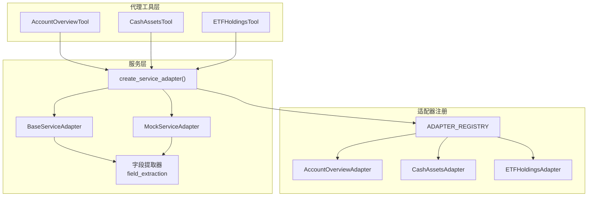
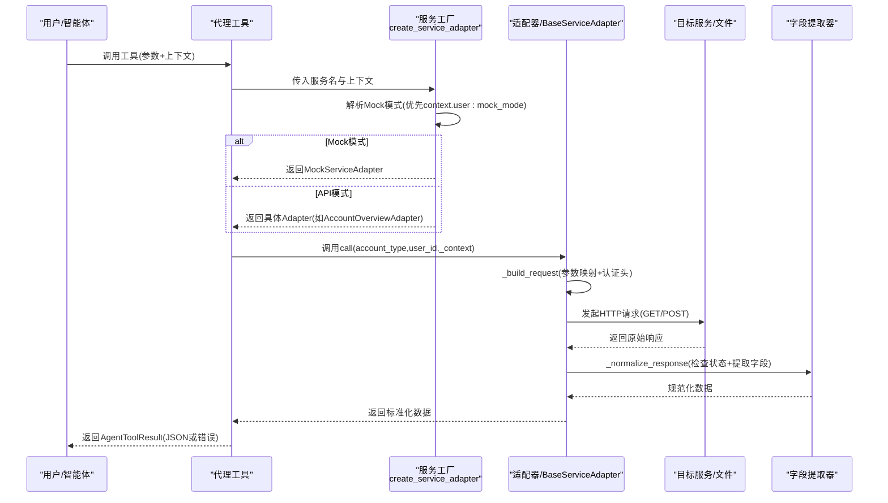
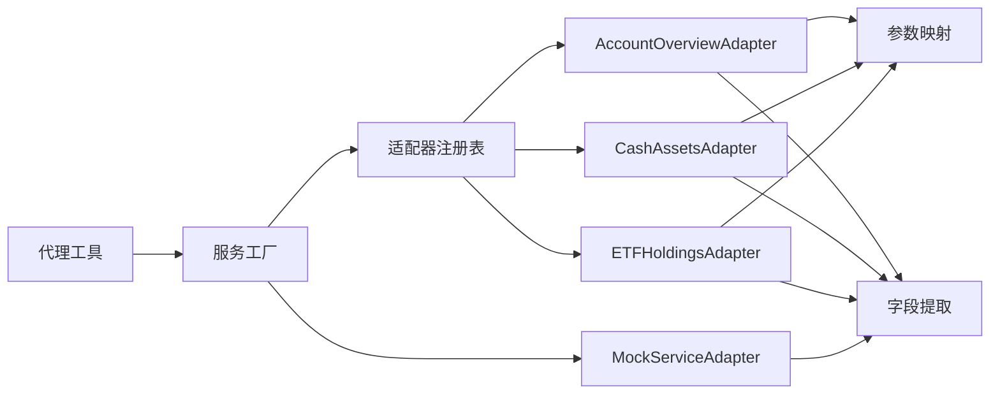
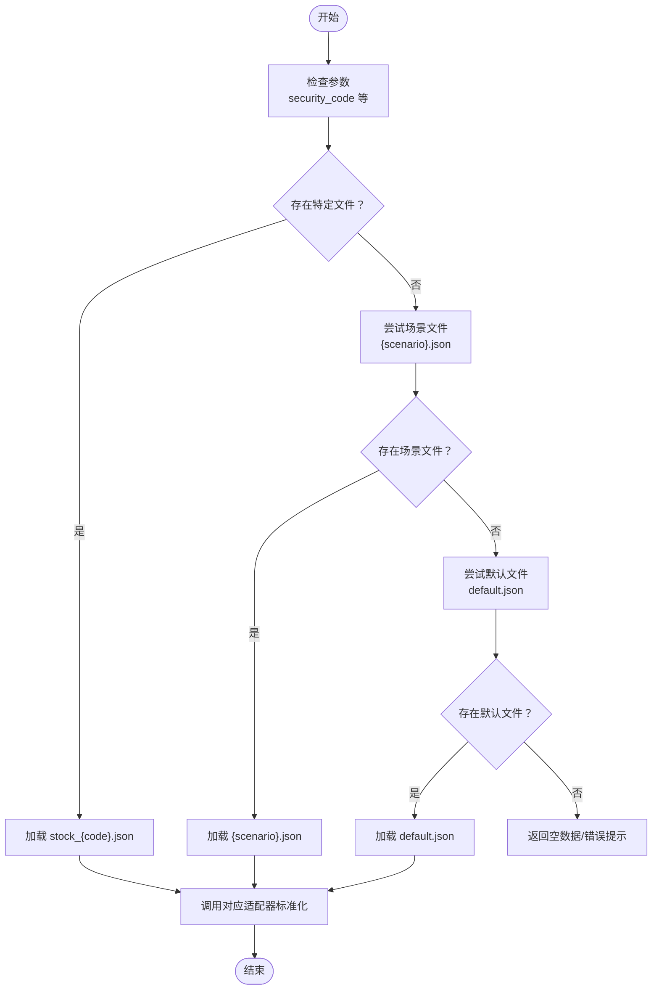

# 工具系统

<cite>
**本文引用的文件**
- [src/ark_agentic/agents/securities/tools/__init__.py](file://src/ark_agentic/agents/securities/tools/__init__.py)
- [src/ark_agentic/agents/securities/tools/agent/account_overview.py](file://src/ark_agentic/agents/securities/tools/agent/account_overview.py)
- [src/ark_agentic/agents/securities/tools/agent/cash_assets.py](file://src/ark_agentic/agents/securities/tools/agent/cash_assets.py)
- [src/ark_agentic/agents/securities/tools/agent/etf_holdings.py](file://src/ark_agentic/agents/securities/tools/agent/etf_holdings.py)
- [src/ark_agentic/agents/securities/tools/service/__init__.py](file://src/ark_agentic/agents/securities/tools/service/__init__.py)
- [src/ark_agentic/agents/securities/tools/service/base.py](file://src/ark_agentic/agents/securities/tools/service/base.py)
- [src/ark_agentic/agents/securities/tools/service/adapters/__init__.py](file://src/ark_agentic/agents/securities/tools/service/adapters/__init__.py)
- [src/ark_agentic/agents/securities/tools/service/adapters/account_overview.py](file://src/ark_agentic/agents/securities/tools/service/adapters/account_overview.py)
- [src/ark_agentic/agents/securities/tools/service/adapters/cash_assets.py](file://src/ark_agentic/agents/securities/tools/service/adapters/cash_assets.py)
- [src/ark_agentic/agents/securities/tools/service/adapters/etf_holdings.py](file://src/ark_agentic/agents/securities/tools/service/adapters/etf_holdings.py)
- [src/ark_agentic/agents/securities/tools/service/field_extraction.py](file://src/ark_agentic/agents/securities/tools/service/field_extraction.py)
- [src/ark_agentic/agents/securities/tools/service/mock_loader.py](file://src/ark_agentic/agents/securities/tools/service/mock_loader.py)
- [src/ark_agentic/agents/securities/tools/service/mock_mode.py](file://src/ark_agentic/agents/securities/tools/service/mock_mode.py)
- [src/ark_agentic/agents/securities/tools/service/param_mapping.py](file://src/ark_agentic/agents/securities/tools/service/param_mapping.py)
</cite>

## 目录
1. [简介](#简介)
2. [项目结构](#项目结构)
3. [核心组件](#核心组件)
4. [架构总览](#架构总览)
5. [详细组件分析](#详细组件分析)
6. [依赖分析](#依赖分析)
7. [性能考虑](#性能考虑)
8. [故障排查指南](#故障排查指南)
9. [结论](#结论)
10. [附录](#附录)

## 简介
本文件面向“证券智能体工具系统”，系统性阐述工具注册表架构、工具执行器设计、服务适配器模式以及代理工具集的实现。重点覆盖以下工具：账户概览、资产历史、分支信息、现金资产、ETF 持仓、基金持仓、港股通持仓、股票详情、股票日收益、股票收益排名。内容涵盖：
- 工具参数映射与字段提取策略
- Mock 数据加载机制与适配器切换
- 工具执行的安全验证与错误处理
- 工具开发最佳实践与扩展指南

## 项目结构
证券工具系统位于 agents/securities/tools 下，采用“代理工具 + 服务层”的分层设计：
- 代理工具层：面向智能体调用，负责参数解析、上下文注入、结果封装与错误处理
- 服务层：负责适配器选择、请求构建、认证头生成、响应标准化与字段提取
- Mock 层：在 Mock 模式下从本地 JSON 文件加载模拟数据，支持按场景与参数选择数据文件

图表来源
- [src/ark_agentic/agents/securities/tools/__init__.py:48-66](file://src/ark_agentic/agents/securities/tools/__init__.py#L48-L66)
- [src/ark_agentic/agents/securities/tools/service/__init__.py:39-85](file://src/ark_agentic/agents/securities/tools/service/__init__.py#L39-L85)
- [src/ark_agentic/agents/securities/tools/service/adapters/__init__.py:14-25](file://src/ark_agentic/agents/securities/tools/service/adapters/__init__.py#L14-L25)

章节来源
- [src/ark_agentic/agents/securities/tools/__init__.py:1-66](file://src/ark_agentic/agents/securities/tools/__init__.py#L1-L66)
- [src/ark_agentic/agents/securities/tools/service/__init__.py:1-85](file://src/ark_agentic/agents/securities/tools/service/__init__.py#L1-L85)

## 核心组件
- 工具注册表与工厂
  - 工具集合通过工厂函数集中创建，统一暴露给智能体运行时
  - 工具清单包含账户概览、资产历史、分支信息、现金资产、ETF 持仓、基金持仓、港股通持仓、股票详情、股票日收益、股票收益排名等
- 服务适配器工厂
  - 根据服务名动态选择适配器或 Mock 适配器
  - 支持 per-request 的 Mock 模式开关，优先级：context.user:mock_mode > 环境变量
- 适配器注册表
  - 以服务名为键，映射到具体适配器类，便于工厂按名创建
- 参数映射与认证
  - 统一的 validatedata 解析与签名头生成，支持静态、上下文与转换三类参数来源
  - 适配器内部复用参数映射与认证逻辑，保证请求体与头部的一致性
- 字段提取
  - 针对不同服务定义字段映射，支持点号路径提取与列表项映射
  - 提供通用提取器与服务专用提取器，确保输出字段与渲染层一致
- Mock 加载
  - Mock 数据按服务与场景组织，支持按 security_code 选择特定文件
  - Mock 适配器在 Mock 模式下调用对应适配器进行响应标准化

章节来源
- [src/ark_agentic/agents/securities/tools/__init__.py:48-66](file://src/ark_agentic/agents/securities/tools/__init__.py#L48-L66)
- [src/ark_agentic/agents/securities/tools/service/__init__.py:39-85](file://src/ark_agentic/agents/securities/tools/service/__init__.py#L39-L85)
- [src/ark_agentic/agents/securities/tools/service/adapters/__init__.py:14-25](file://src/ark_agentic/agents/securities/tools/service/adapters/__init__.py#L14-L25)
- [src/ark_agentic/agents/securities/tools/service/param_mapping.py:305-435](file://src/ark_agentic/agents/securities/tools/service/param_mapping.py#L305-L435)
- [src/ark_agentic/agents/securities/tools/service/field_extraction.py:61-472](file://src/ark_agentic/agents/securities/tools/service/field_extraction.py#L61-L472)
- [src/ark_agentic/agents/securities/tools/service/mock_loader.py:17-178](file://src/ark_agentic/agents/securities/tools/service/mock_loader.py#L17-L178)

## 架构总览
工具系统采用“代理工具 + 服务适配器 + 字段提取 + Mock 加载”的分层架构。代理工具负责输入参数与上下文解析，服务适配器负责请求构建与认证，字段提取器负责输出规范化，Mock 加载器负责在 Mock 模式下提供稳定数据。

图表来源
- [src/ark_agentic/agents/securities/tools/service/__init__.py:39-85](file://src/ark_agentic/agents/securities/tools/service/__init__.py#L39-L85)
- [src/ark_agentic/agents/securities/tools/service/base.py:55-104](file://src/ark_agentic/agents/securities/tools/service/base.py#L55-L104)
- [src/ark_agentic/agents/securities/tools/service/field_extraction.py:12-34](file://src/ark_agentic/agents/securities/tools/service/field_extraction.py#L12-L34)
- [src/ark_agentic/agents/securities/tools/service/mock_loader.py:118-141](file://src/ark_agentic/agents/securities/tools/service/mock_loader.py#L118-L141)

## 详细组件分析

### 工具注册表与工厂
- 工具集合通过工厂函数集中创建，统一暴露给智能体运行时
- 工具清单包含账户概览、资产历史、分支信息、现金资产、ETF 持仓、基金持仓、港股通持仓、股票详情、股票日收益、股票收益排名等

章节来源
- [src/ark_agentic/agents/securities/tools/__init__.py:48-66](file://src/ark_agentic/agents/securities/tools/__init__.py#L48-L66)

### 服务适配器工厂与 Mock 切换
- 工厂根据服务名选择适配器或 Mock 适配器
- Mock 模式优先级：context.user:mock_mode > 环境变量 SECURITIES_SERVICE_MOCK
- API 模式下从环境变量读取服务 URL 与认证配置，不存在时报错

章节来源
- [src/ark_agentic/agents/securities/tools/service/__init__.py:39-85](file://src/ark_agentic/agents/securities/tools/service/__init__.py#L39-L85)
- [src/ark_agentic/agents/securities/tools/service/mock_mode.py:12-24](file://src/ark_agentic/agents/securities/tools/service/mock_mode.py#L12-L24)

### 适配器注册表
- 以服务名为键，映射到具体适配器类，便于工厂按名创建
- 支持账户总览、资产历史、分支信息、现金资产、ETF 持仓、基金持仓、港股通持仓、股票详情、股票日收益、股票收益排名等

章节来源
- [src/ark_agentic/agents/securities/tools/service/adapters/__init__.py:14-25](file://src/ark_agentic/agents/securities/tools/service/adapters/__init__.py#L14-L25)

### 参数映射与认证
- 统一的 validatedata 解析与签名头生成，支持静态、上下文与转换三类参数来源
- 适配器内部复用参数映射与认证逻辑，保证请求体与头部的一致性
- 支持 per-request 的 context.user:mock_mode 跳过 validatedata 校验

章节来源
- [src/ark_agentic/agents/securities/tools/service/param_mapping.py:305-435](file://src/ark_agentic/agents/securities/tools/service/param_mapping.py#L305-L435)
- [src/ark_agentic/agents/securities/tools/service/base.py:162-199](file://src/ark_agentic/agents/securities/tools/service/base.py#L162-L199)

### 字段提取与输出规范化
- 针对不同服务定义字段映射，支持点号路径提取与列表项映射
- 提供通用提取器与服务专用提取器，确保输出字段与渲染层一致
- 支持账户总览、现金资产、ETF 持仓、港股通持仓、资产历史收益曲线、股票日收益明细、股票盈亏排行等

章节来源
- [src/ark_agentic/agents/securities/tools/service/field_extraction.py:61-472](file://src/ark_agentic/agents/securities/tools/service/field_extraction.py#L61-L472)

### Mock 数据加载机制
- Mock 数据按服务与场景组织，支持按 security_code 选择特定文件
- Mock 适配器在 Mock 模式下调用对应适配器进行响应标准化
- 默认目录为 agents/securities/mock_data，不存在时自动创建

章节来源
- [src/ark_agentic/agents/securities/tools/service/mock_loader.py:17-178](file://src/ark_agentic/agents/securities/tools/service/mock_loader.py#L17-L178)

### 代理工具集实现要点
- 账户概览：支持普通与两融账户，参数 account_type 可选
- 现金资产：支持普通与两融账户，参数 account_type 可选
- ETF 持仓：参数 account_type 可选（ETF 查询不区分账户类型）
- 其他工具（资产历史、分支信息、港股通持仓、股票详情、股票日收益、股票收益排名）均遵循相同模式：参数映射、上下文注入、适配器调用、字段提取、结果封装

章节来源
- [src/ark_agentic/agents/securities/tools/agent/account_overview.py:57-108](file://src/ark_agentic/agents/securities/tools/agent/account_overview.py#L57-L108)
- [src/ark_agentic/agents/securities/tools/agent/cash_assets.py:46-96](file://src/ark_agentic/agents/securities/tools/agent/cash_assets.py#L46-L96)
- [src/ark_agentic/agents/securities/tools/agent/etf_holdings.py:46-99](file://src/ark_agentic/agents/securities/tools/agent/etf_holdings.py#L46-L99)

## 依赖分析
- 工具层依赖服务层：代理工具通过工厂创建适配器并发起调用
- 服务层依赖适配器注册表：工厂按服务名查找适配器类
- 适配器依赖参数映射与字段提取：统一构建请求与标准化响应
- Mock 模式依赖 Mock 加载器：在 Mock 模式下替代真实服务调用

图表来源
- [src/ark_agentic/agents/securities/tools/service/adapters/__init__.py:14-25](file://src/ark_agentic/agents/securities/tools/service/adapters/__init__.py#L14-L25)
- [src/ark_agentic/agents/securities/tools/service/__init__.py:39-85](file://src/ark_agentic/agents/securities/tools/service/__init__.py#L39-L85)
- [src/ark_agentic/agents/securities/tools/service/param_mapping.py:305-435](file://src/ark_agentic/agents/securities/tools/service/param_mapping.py#L305-L435)
- [src/ark_agentic/agents/securities/tools/service/field_extraction.py:61-472](file://src/ark_agentic/agents/securities/tools/service/field_extraction.py#L61-L472)
- [src/ark_agentic/agents/securities/tools/service/mock_loader.py:118-141](file://src/ark_agentic/agents/securities/tools/service/mock_loader.py#L118-L141)

章节来源
- [src/ark_agentic/agents/securities/tools/service/adapters/__init__.py:14-25](file://src/ark_agentic/agents/securities/tools/service/adapters/__init__.py#L14-L25)
- [src/ark_agentic/agents/securities/tools/service/__init__.py:39-85](file://src/ark_agentic/agents/securities/tools/service/__init__.py#L39-L85)

## 性能考虑
- 异步 HTTP 客户端复用：BaseServiceAdapter 内部维护 AsyncClient，避免重复创建带来的连接开销
- Mock 模式下减少网络往返：直接从本地文件加载数据，适合测试与离线场景
- 参数映射与字段提取：采用点号路径与列表映射，避免深层遍历与重复计算
- 适配器注册表：按需按名创建，降低初始化成本

## 故障排查指南
- 适配器工厂报错：确认环境变量 SECURITIES_{SERVICE_NAME}_URL 是否设置，Mock 模式下无需该变量
- 认证失败：检查 validatedata 与 signature 是否正确，Mock 模式下 validatedata 可为空
- 字段提取异常：核对字段映射配置是否与实际响应结构一致
- Mock 数据缺失：确认 agents/securities/mock_data/{service_name}/{scenario}.json 是否存在

章节来源
- [src/ark_agentic/agents/securities/tools/service/__init__.py:65-78](file://src/ark_agentic/agents/securities/tools/service/__init__.py#L65-L78)
- [src/ark_agentic/agents/securities/tools/service/base.py:79-101](file://src/ark_agentic/agents/securities/tools/service/base.py#L79-L101)
- [src/ark_agentic/agents/securities/tools/service/field_extraction.py:61-472](file://src/ark_agentic/agents/securities/tools/service/field_extraction.py#L61-L472)
- [src/ark_agentic/agents/securities/tools/service/mock_loader.py:31-71](file://src/ark_agentic/agents/securities/tools/service/mock_loader.py#L31-L71)

## 结论
本工具系统通过清晰的分层设计与统一的参数映射、认证与字段提取机制，实现了对多种证券查询工具的高效集成。Mock 模式与适配器注册表进一步提升了系统的可测试性与可扩展性。建议在新增工具时遵循现有模式，统一使用参数映射与字段提取，确保输出结构一致与渲染兼容。

## 附录

### 工具参数映射与字段提取一览
- 账户总览
  - 参数映射：channel、appName、tokenId、body.accountType
  - 字段提取：account_type、total_assets、cash_balance、stock_market_value、fund_market_value、today_profit、today_return_rate、positions、prudent_positions、rzrq_assets_info
- 现金资产
  - 参数映射：channel、appName、tokenId、body.accountType
  - 字段提取：account_type、cash_balance、cash_available、draw_balance、today_profit、accu_profit、fund_name、fund_code、frozen_funds_total、frozen_funds_detail、in_transit_asset_total、in_transit_asset_detail、settlement_date
- ETF 持仓
  - 参数映射：assetGrpType、appName、limit
  - 字段提取：total、total_market_value、total_profit、total_profit_rate、account_type、stock_list（含 code、name、hold_cnt、market_value、day_profit、day_profit_rate、price、cost_price、market_type、hold_position_profit、hold_position_profit_rate）

章节来源
- [src/ark_agentic/agents/securities/tools/service/param_mapping.py:307-354](file://src/ark_agentic/agents/securities/tools/service/param_mapping.py#L307-L354)
- [src/ark_agentic/agents/securities/tools/service/field_extraction.py:61-125](file://src/ark_agentic/agents/securities/tools/service/field_extraction.py#L61-L125)
- [src/ark_agentic/agents/securities/tools/service/field_extraction.py:127-200](file://src/ark_agentic/agents/securities/tools/service/field_extraction.py#L127-L200)

### Mock 数据加载流程

图表来源
- [src/ark_agentic/agents/securities/tools/service/mock_loader.py:31-71](file://src/ark_agentic/agents/securities/tools/service/mock_loader.py#L31-L71)
- [src/ark_agentic/agents/securities/tools/service/mock_loader.py:118-141](file://src/ark_agentic/agents/securities/tools/service/mock_loader.py#L118-L141)