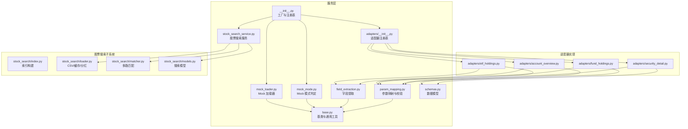
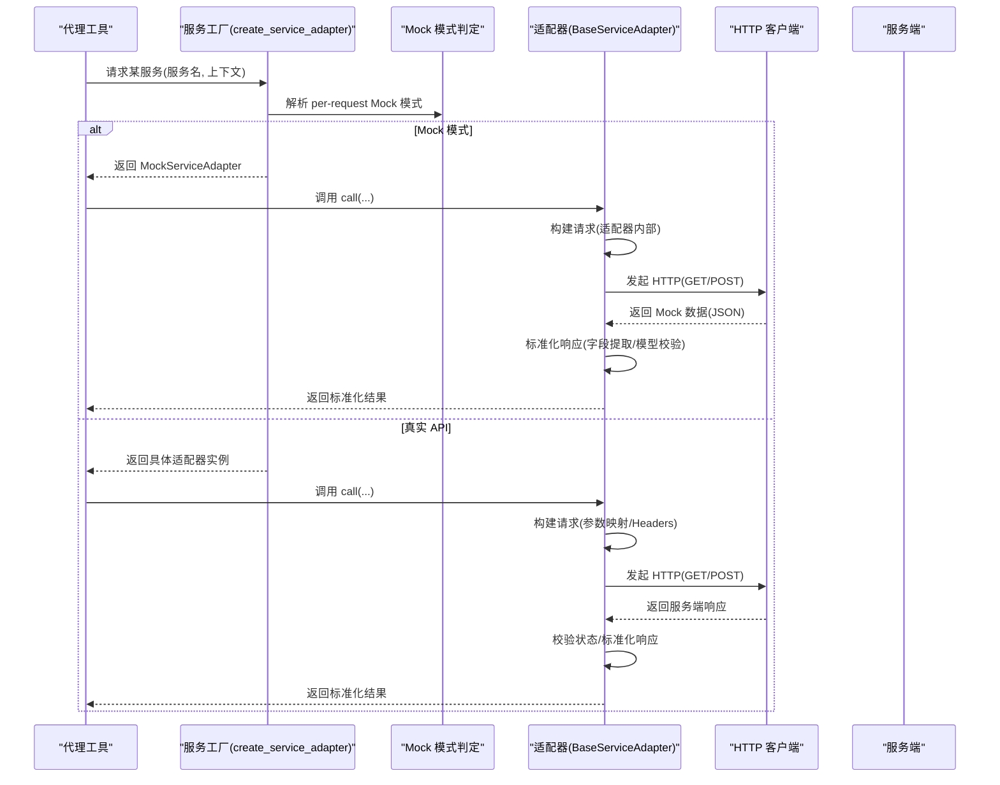
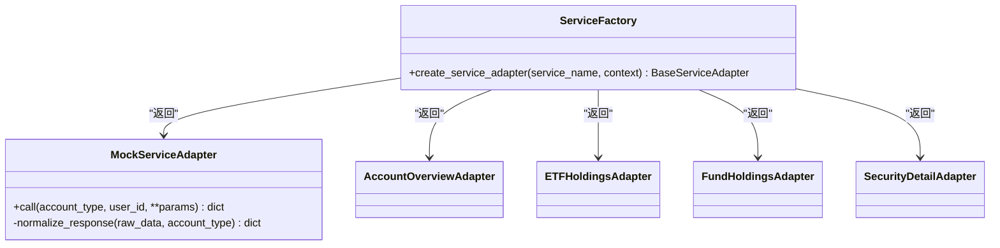
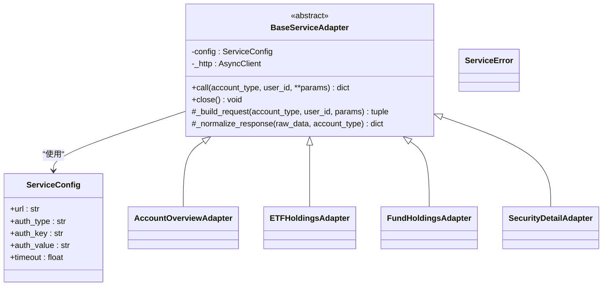
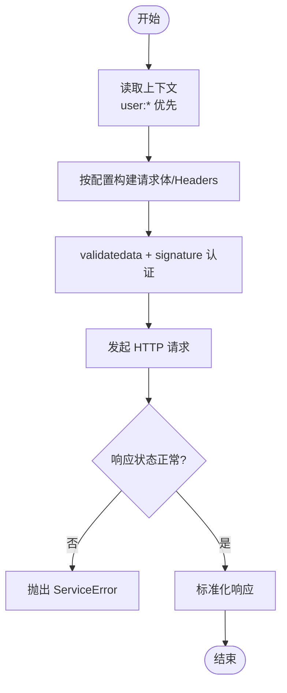
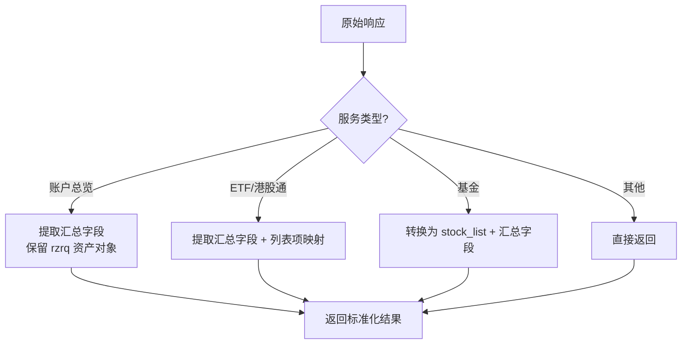
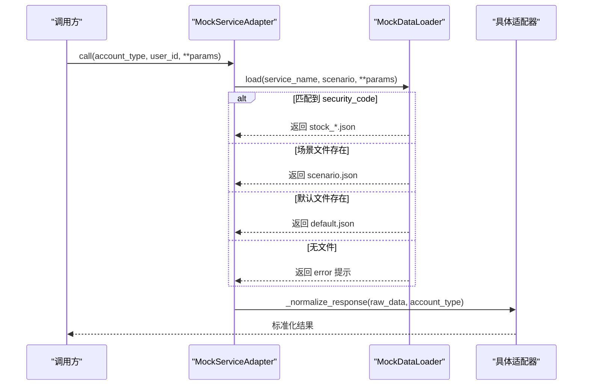
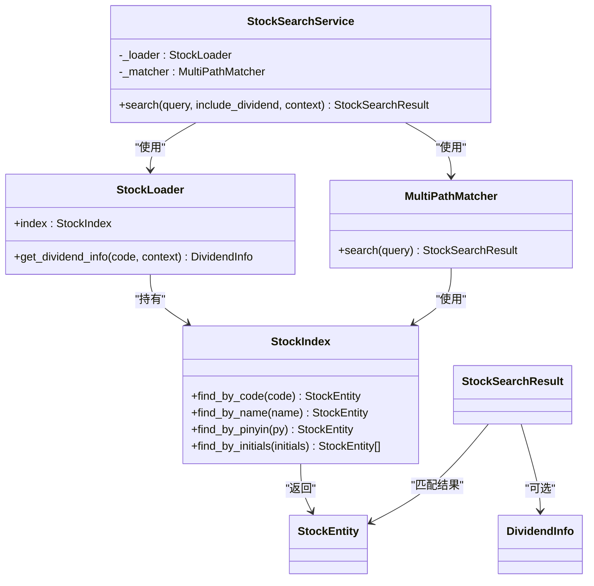
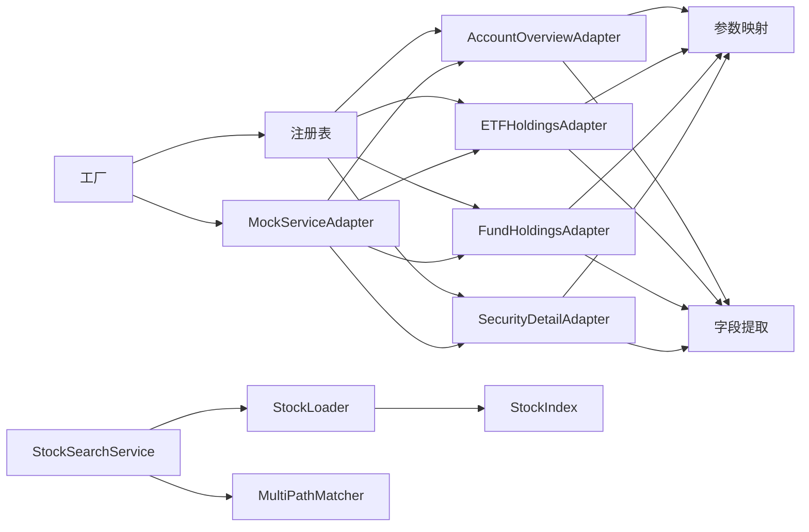

# 服务层架构

<cite>
**本文引用的文件**
- [__init__.py](file://src/ark_agentic/agents/securities/tools/service/__init__.py)
- [base.py](file://src/ark_agentic/agents/securities/tools/service/base.py)
- [field_extraction.py](file://src/ark_agentic/agents/securities/tools/service/field_extraction.py)
- [param_mapping.py](file://src/ark_agentic/agents/securities/tools/service/param_mapping.py)
- [mock_loader.py](file://src/ark_agentic/agents/securities/tools/service/mock_loader.py)
- [mock_mode.py](file://src/ark_agentic/agents/securities/tools/service/mock_mode.py)
- [adapters/__init__.py](file://src/ark_agentic/agents/securities/tools/service/adapters/__init__.py)
- [adapters/account_overview.py](file://src/ark_agentic/agents/securities/tools/service/adapters/account_overview.py)
- [adapters/security_detail.py](file://src/ark_agentic/agents/securities/tools/service/adapters/security_detail.py)
- [adapters/etf_holdings.py](file://src/ark_agentic/agents/securities/tools/service/adapters/etf_holdings.py)
- [adapters/fund_holdings.py](file://src/ark_agentic/agents/securities/tools/service/adapters/fund_holdings.py)
- [stock_search_service.py](file://src/ark_agentic/agents/securities/tools/service/stock_search_service.py)
- [stock_search/index.py](file://src/ark_agentic/agents/securities/tools/service/stock_search/index.py)
- [stock_search/loader.py](file://src/ark_agentic/agents/securities/tools/service/stock_search/loader.py)
- [stock_search/matcher.py](file://src/ark_agentic/agents/securities/tools/service/stock_search/matcher.py)
- [stock_search/models.py](file://src/ark_agentic/agents/securities/tools/service/stock_search/models.py)
- [schemas.py](file://src/ark_agentic/agents/securities/schemas.py)
</cite>

## 目录
1. [简介](#简介)
2. [项目结构](#项目结构)
3. [核心组件](#核心组件)
4. [架构总览](#架构总览)
5. [组件详解](#组件详解)
6. [依赖关系分析](#依赖关系分析)
7. [性能考量](#性能考量)
8. [故障排查指南](#故障排查指南)
9. [结论](#结论)
10. [附录](#附录)

## 简介
本文件系统化阐述“证券智能体服务层”的架构设计与实现细节，重点覆盖：
- 服务层设计模式与适配器架构
- 字段提取机制与参数映射规则
- Mock 数据加载策略与切换逻辑
- 股票搜索服务的实现与缓存优化
- 为代理工具提供统一数据访问接口的流程：数据转换、验证、缓存与错误处理
- 扩展与定制最佳实践

目标是帮助开发者快速理解并高效扩展服务层能力。

## 项目结构
服务层位于“agents/securities/tools/service”目录，采用“适配器 + 参数映射 + 字段提取 + Mock + 搜索服务”的分层组织方式，辅以统一的基类与工厂方法，确保对外暴露一致的调用接口。

图表来源
- [__init__.py:1-85](file://src/ark_agentic/agents/securities/tools/service/__init__.py#L1-L85)
- [adapters/__init__.py:1-40](file://src/ark_agentic/agents/securities/tools/service/adapters/__init__.py#L1-L40)
- [stock_search_service.py:1-84](file://src/ark_agentic/agents/securities/tools/service/stock_search_service.py#L1-L84)

章节来源
- [__init__.py:1-85](file://src/ark_agentic/agents/securities/tools/service/__init__.py#L1-L85)
- [adapters/__init__.py:1-40](file://src/ark_agentic/agents/securities/tools/service/adapters/__init__.py#L1-L40)

## 核心组件
- 服务工厂与注册表：集中创建适配器、解析 Mock 模式、读取环境变量配置
- 基类与通用工具：统一 HTTP 客户端生命周期、请求构建、响应标准化、错误处理
- 参数映射：将上下文 context 转换为 API 请求体/Headers，支持静态、上下文、转换三种来源
- 字段提取：按服务维度抽取 API 响应中的展示字段，支持列表项映射与汇总字段
- Mock 系统：MockDataLoader 与 MockServiceAdapter，支持场景化 JSON 文件与适配器链路复用
- 股票搜索服务：基于 StockLoader + MultiPathMatcher 的进程内缓存搜索，支持代码/名称/拼音/首字母多路匹配
- 数据模型：Pydantic 模型用于强类型校验与后续渲染

章节来源
- [base.py:1-212](file://src/ark_agentic/agents/securities/tools/service/base.py#L1-L212)
- [param_mapping.py:1-479](file://src/ark_agentic/agents/securities/tools/service/param_mapping.py#L1-L479)
- [field_extraction.py:1-472](file://src/ark_agentic/agents/securities/tools/service/field_extraction.py#L1-L472)
- [mock_loader.py:1-178](file://src/ark_agentic/agents/securities/tools/service/mock_loader.py#L1-L178)
- [mock_mode.py:1-24](file://src/ark_agentic/agents/securities/tools/service/mock_mode.py#L1-L24)
- [stock_search_service.py:1-84](file://src/ark_agentic/agents/securities/tools/service/stock_search_service.py#L1-L84)
- [schemas.py:1-465](file://src/ark_agentic/agents/securities/schemas.py#L1-L465)

## 架构总览
服务层通过“工厂 + 注册表 + 适配器”的模式，屏蔽底层 API 差异，向上提供统一的调用接口。Mock 模式与真实 API 通过同一接口无缝切换，保证测试与生产的可移植性。

图表来源
- [__init__.py:39-85](file://src/ark_agentic/agents/securities/tools/service/__init__.py#L39-L85)
- [base.py:55-136](file://src/ark_agentic/agents/securities/tools/service/base.py#L55-L136)
- [mock_loader.py:118-178](file://src/ark_agentic/agents/securities/tools/service/mock_loader.py#L118-L178)

## 组件详解

### 1) 服务工厂与适配器注册
- 工厂方法负责：
  - 解析 per-session 的 Mock 模式（优先 user:mock_mode）
  - 读取环境变量生成 ServiceConfig
  - 通过注册表选择具体适配器类
  - 返回 MockServiceAdapter 或具体适配器实例
- 注册表维护服务名到适配器类的映射，便于扩展新服务

图表来源
- [__init__.py:39-85](file://src/ark_agentic/agents/securities/tools/service/__init__.py#L39-L85)
- [adapters/__init__.py:14-25](file://src/ark_agentic/agents/securities/tools/service/adapters/__init__.py#L14-L25)

章节来源
- [__init__.py:39-85](file://src/ark_agentic/agents/securities/tools/service/__init__.py#L39-L85)
- [adapters/__init__.py:14-25](file://src/ark_agentic/agents/securities/tools/service/adapters/__init__.py#L14-L25)

### 2) 基类与通用工具
- BaseServiceAdapter
  - 统一管理 AsyncClient 生命周期
  - call 方法封装 HTTP 发起、状态检查、错误日志与异常抛出
  - _build_request 可覆盖，支持 GET/POST
  - _normalize_response 抽象方法，交由子类实现
- 通用工具
  - require_context_fields：校验上下文必需字段（Mock 模式跳过）
  - build_validatedata_request：构建 validatedata + signature 认证请求
  - check_api_response：校验服务端返回状态

图表来源
- [base.py:38-136](file://src/ark_agentic/agents/securities/tools/service/base.py#L38-L136)

章节来源
- [base.py:14-212](file://src/ark_agentic/agents/securities/tools/service/base.py#L14-L212)

### 3) 参数映射与认证
- 上下文兼容：优先 user: 前缀，兼容裸 key
- 三种来源：
  - static：静态值
  - context：从上下文取值
  - transform：从上下文取值后进行转换
- Headers 支持 validatedata + signature 认证，统一 header 配置
- validatedata 解析与 enriched 预处理，自动推导账户类型

图表来源
- [param_mapping.py:38-118](file://src/ark_agentic/agents/securities/tools/service/param_mapping.py#L38-L118)
- [param_mapping.py:210-235](file://src/ark_agentic/agents/securities/tools/service/param_mapping.py#L210-L235)
- [base.py:106-131](file://src/ark_agentic/agents/securities/tools/service/base.py#L106-L131)

章节来源
- [param_mapping.py:13-479](file://src/ark_agentic/agents/securities/tools/service/param_mapping.py#L13-L479)
- [base.py:106-131](file://src/ark_agentic/agents/securities/tools/service/base.py#L106-L131)

### 4) 字段提取机制
- 支持点号路径提取与列表项映射
- 针对不同服务提供专用提取器：
  - 账户总览、现金资产、ETF 持仓、港股通、资产历史收益曲线、股票每日收益、股票盈亏排行
- 部分服务输出统一的 stock_list 格式，便于前端渲染一致性

图表来源
- [field_extraction.py:61-472](file://src/ark_agentic/agents/securities/tools/service/field_extraction.py#L61-L472)

章节来源
- [field_extraction.py:12-472](file://src/ark_agentic/agents/securities/tools/service/field_extraction.py#L12-L472)

### 5) Mock 数据加载策略
- MockDataLoader
  - 优先按 security_code 查找特定文件，再按场景文件，最后默认文件
  - 不存在时返回提示信息，避免中断流程
- MockServiceAdapter
  - 根据服务名选择对应适配器进行响应标准化
  - 支持 per-request 的场景选择（普通/两融）

图表来源
- [mock_loader.py:31-82](file://src/ark_agentic/agents/securities/tools/service/mock_loader.py#L31-L82)
- [mock_loader.py:118-178](file://src/ark_agentic/agents/securities/tools/service/mock_loader.py#L118-L178)

章节来源
- [mock_loader.py:17-178](file://src/ark_agentic/agents/securities/tools/service/mock_loader.py#L17-L178)
- [mock_mode.py:7-24](file://src/ark_agentic/agents/securities/tools/service/mock_mode.py#L7-L24)

### 6) 股票搜索服务
- 职责：提供进程内缓存的股票查询能力，支持 6 位代码与名称/拼音/首字母检索
- 组件：
  - StockLoader：加载 CSV/缓存索引，提供分红信息（Mock 模式返回内置数据）
  - StockIndex：构建 code/name/pinyin/initials 映射与批量向量，支持 O(1) 精确查找
  - MultiPathMatcher：多路匹配 + 综合打分，支持 exact/high/ambiguous/none 四档置信度
  - StockSearchService：组合上述组件，提供统一查询接口

图表来源
- [stock_search_service.py:32-84](file://src/ark_agentic/agents/securities/tools/service/stock_search_service.py#L32-L84)
- [stock_search/loader.py:74-138](file://src/ark_agentic/agents/securities/tools/service/stock_search/loader.py#L74-L138)
- [stock_search/index.py:53-148](file://src/ark_agentic/agents/securities/tools/service/stock_search/index.py#L53-L148)
- [stock_search/matcher.py:59-239](file://src/ark_agentic/agents/securities/tools/service/stock_search/matcher.py#L59-L239)
- [stock_search/models.py:114-136](file://src/ark_agentic/agents/securities/tools/service/stock_search/models.py#L114-L136)

章节来源
- [stock_search_service.py:1-84](file://src/ark_agentic/agents/securities/tools/service/stock_search_service.py#L1-L84)
- [stock_search/loader.py:1-138](file://src/ark_agentic/agents/securities/tools/service/stock_search/loader.py#L1-L138)
- [stock_search/index.py:1-148](file://src/ark_agentic/agents/securities/tools/service/stock_search/index.py#L1-L148)
- [stock_search/matcher.py:1-239](file://src/ark_agentic/agents/securities/tools/service/stock_search/matcher.py#L1-L239)
- [stock_search/models.py:1-136](file://src/ark_agentic/agents/securities/tools/service/stock_search/models.py#L1-L136)

### 7) 适配器实现要点
- 账户总览/ETF 持仓/安全详情等适配器均继承 BaseServiceAdapter，覆盖 _build_request 与 _normalize_response
- 认证统一使用 validatedata + signature；部分 GET 接口使用 query 参数
- 校验与转换：
  - validatedata 校验与 enriched 预处理
  - 字段提取与 Pydantic 模型校验（如安全详情、基金持仓）

章节来源
- [adapters/account_overview.py:15-61](file://src/ark_agentic/agents/securities/tools/service/adapters/account_overview.py#L15-L61)
- [adapters/etf_holdings.py:15-58](file://src/ark_agentic/agents/securities/tools/service/adapters/etf_holdings.py#L15-L58)
- [adapters/security_detail.py:18-68](file://src/ark_agentic/agents/securities/tools/service/adapters/security_detail.py#L18-L68)
- [adapters/fund_holdings.py:18-75](file://src/ark_agentic/agents/securities/tools/service/adapters/fund_holdings.py#L18-L75)
- [schemas.py:441-465](file://src/ark_agentic/agents/securities/schemas.py#L441-L465)

## 依赖关系分析
- 低耦合高内聚：适配器通过统一基类与注册表解耦，新增服务只需实现 _build_request/_normalize_response 并加入注册表
- 关键依赖链：
  - 工厂 → 注册表 → 适配器 → 参数映射/字段提取
  - Mock 模式 → MockServiceAdapter → 具体适配器（复用标准化流程）
  - 股票搜索 → StockLoader → StockIndex/MultiPathMatcher → 模型

图表来源
- [__init__.py:39-85](file://src/ark_agentic/agents/securities/tools/service/__init__.py#L39-L85)
- [adapters/__init__.py:14-25](file://src/ark_agentic/agents/securities/tools/service/adapters/__init__.py#L14-L25)
- [stock_search_service.py:32-84](file://src/ark_agentic/agents/securities/tools/service/stock_search_service.py#L32-L84)

章节来源
- [__init__.py:39-85](file://src/ark_agentic/agents/securities/tools/service/__init__.py#L39-L85)
- [adapters/__init__.py:14-25](file://src/ark_agentic/agents/securities/tools/service/adapters/__init__.py#L14-L25)

## 性能考量
- HTTP 客户端复用：AsyncClient 生命周期由基类统一管理，减少连接开销
- 进程内缓存：
  - StockLoader 使用 lru_cache 缓存默认索引与 Mock 分红数据
  - StockSearchService 复用进程内单例 Loader，避免重复 IO
- 匹配性能：
  - StockIndex 构建多映射与批量向量，支持 O(1) 精确查找
  - MultiPathMatcher 优先精确代码与首字母匹配，必要时进行模糊匹配并限制 Top-N
- Mock 模式：在开发/测试阶段避免网络请求，提升迭代效率

章节来源
- [base.py:47-53](file://src/ark_agentic/agents/securities/tools/service/base.py#L47-L53)
- [stock_search/loader.py:52-71](file://src/ark_agentic/agents/securities/tools/service/stock_search/loader.py#L52-L71)
- [stock_search/loader.py:102-132](file://src/ark_agentic/agents/securities/tools/service/stock_search/loader.py#L102-L132)
- [stock_search/index.py:61-107](file://src/ark_agentic/agents/securities/tools/service/stock_search/index.py#L61-L107)
- [stock_search/matcher.py:70-114](file://src/ark_agentic/agents/securities/tools/service/stock_search/matcher.py#L70-L114)

## 故障排查指南
- HTTP 异常
  - 状态码错误：记录服务名、方法、URL、状态码、负载与响应摘要，抛出 ServiceError
  - 请求失败：记录错误类型，抛出 ServiceError
- 响应校验
  - check_api_response：当 status 非 1 时，提取 errmsg/msg 等字段并抛出 ServiceError
- Mock 数据缺失
  - MockDataLoader：找不到文件时返回 error 提示，避免中断；可通过 list_scenarios 检查可用场景
- 上下文字段缺失
  - require_context_fields：在非 Mock 模式下校验缺失字段，提供明确错误信息
- 股票搜索无结果
  - MultiPathMatcher：根据置信度返回 exact/high/ambiguous/none；ambiguous 时返回候选列表

章节来源
- [base.py:79-101](file://src/ark_agentic/agents/securities/tools/service/base.py#L79-L101)
- [base.py:202-212](file://src/ark_agentic/agents/securities/tools/service/base.py#L202-L212)
- [mock_loader.py:66-70](file://src/ark_agentic/agents/securities/tools/service/mock_loader.py#L66-L70)
- [param_mapping.py:138-159](file://src/ark_agentic/agents/securities/tools/service/param_mapping.py#L138-L159)
- [stock_search/matcher.py:70-114](file://src/ark_agentic/agents/securities/tools/service/stock_search/matcher.py#L70-L114)

## 结论
该服务层通过“工厂 + 适配器 + 参数映射 + 字段提取 + Mock + 搜索服务”的组合，实现了对多源 API 的统一抽象与稳定输出。其设计强调：
- 可扩展性：新增服务只需实现两个钩子并注册
- 可测试性：Mock 模式与进程内缓存使测试与调试更高效
- 可靠性：统一的错误处理与响应校验保障了接口稳定性
- 可维护性：清晰的职责划分与模块化组织降低了复杂度

## 附录

### A. 扩展与定制最佳实践
- 新增服务步骤
  - 在 adapters/__init__.py 注册服务名到适配器类
  - 实现适配器：覆盖 _build_request（参数映射/Headers）与 _normalize_response（字段提取/模型校验）
  - 如需 GET 查询，设置 http_method = "GET"
  - 如需 validatedata 认证，确保上下文包含 validatedata 与 signature
- 参数映射
  - 优先使用 SERVICE_PARAM_CONFIGS/SERVICE_HEADER_CONFIGS，保持配置集中
  - 使用 transform 处理账户类型等跨服务差异
- 字段提取
  - 为新服务新增提取器与映射，遵循现有命名规范
  - 列表项与汇总字段分离，保证渲染一致性
- Mock 数据
  - 在 mock_data 下按服务名建立目录，提供 default/场景文件
  - 场景文件命名与 MockServiceAdapter 的场景选择保持一致
- 股票搜索
  - 确保 CSV 提供 code/name/exchange 字段，以便 StockIndex 正常构建
  - 如需拼音/首字母匹配，确保安装 pypinyin；若无，系统会降级为精确名称匹配
- 错误处理
  - 统一使用 ServiceError 抛出，便于上层捕获与日志记录
  - 在 _normalize_response 中进行业务校验（如 API 状态码、schema 校验）

章节来源
- [adapters/__init__.py:14-25](file://src/ark_agentic/agents/securities/tools/service/adapters/__init__.py#L14-L25)
- [param_mapping.py:307-435](file://src/ark_agentic/agents/securities/tools/service/param_mapping.py#L307-L435)
- [field_extraction.py:436-472](file://src/ark_agentic/agents/securities/tools/service/field_extraction.py#L436-L472)
- [mock_loader.py:31-71](file://src/ark_agentic/agents/securities/tools/service/mock_loader.py#L31-L71)
- [stock_search/index.py:75-107](file://src/ark_agentic/agents/securities/tools/service/stock_search/index.py#L75-L107)
- [stock_search/matcher.py:35-43](file://src/ark_agentic/agents/securities/tools/service/stock_search/matcher.py#L35-L43)