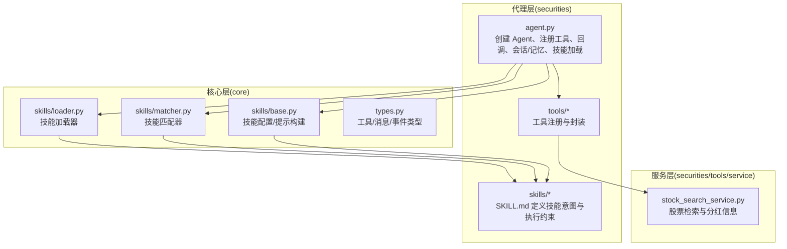
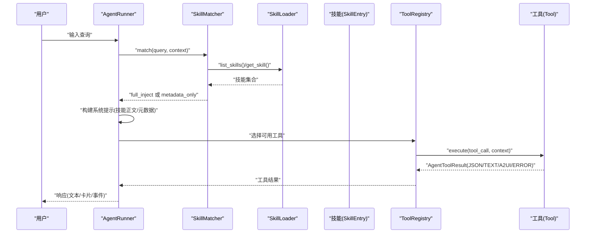
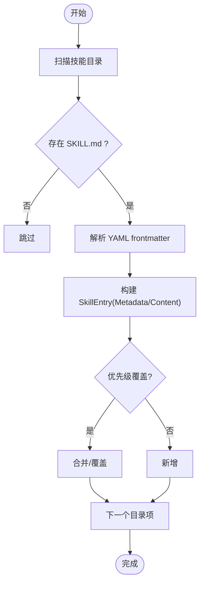
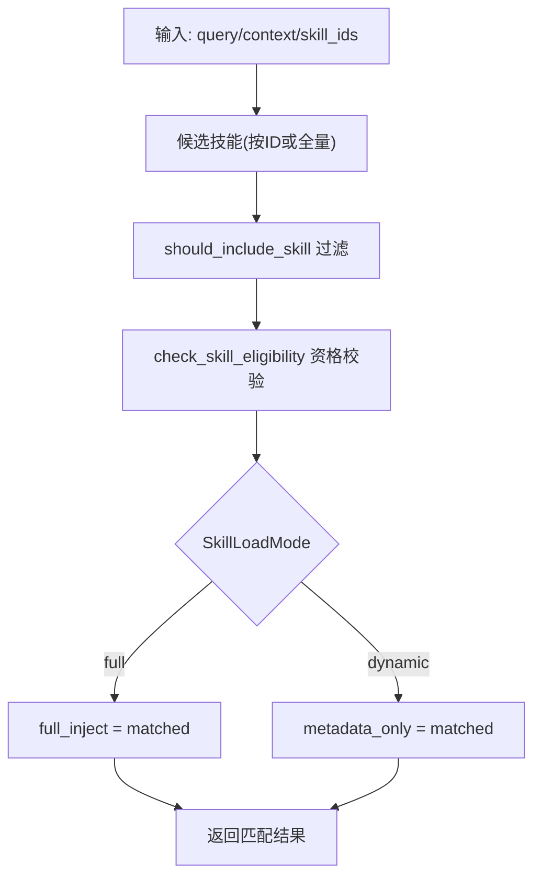
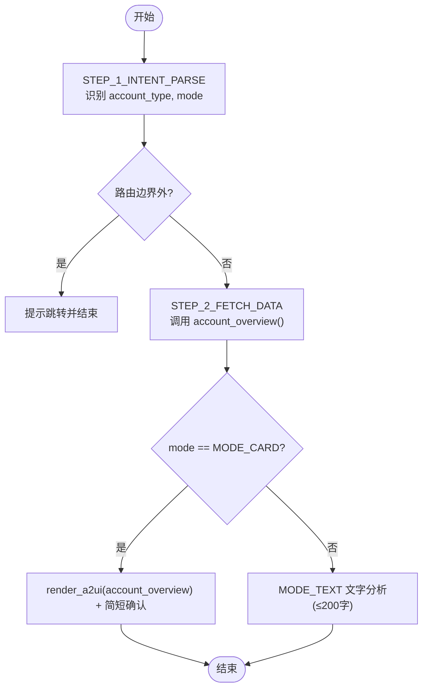
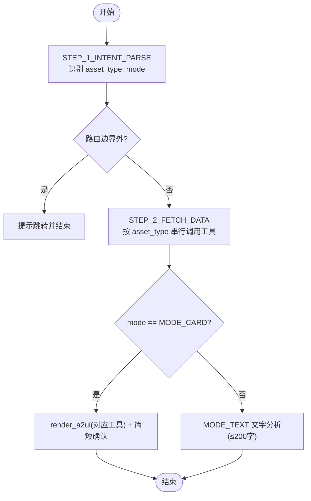
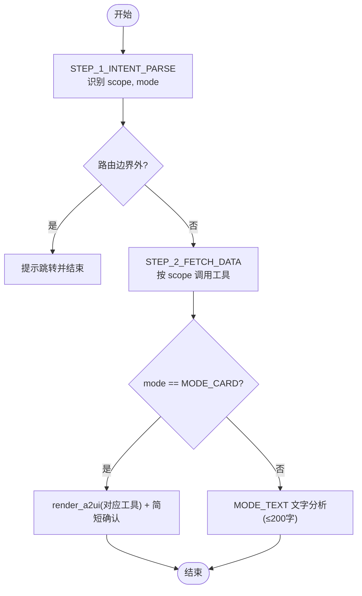
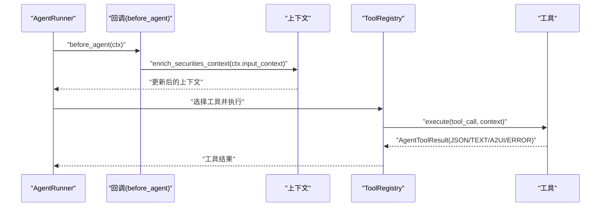
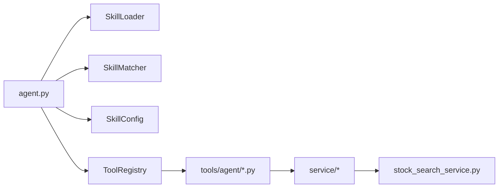

# 技能系统

<cite>
**本文引用的文件**
- [src/ark_agentic/agents/securities/agent.py](file://src/ark_agentic/agents/securities/agent.py)
- [src/ark_agentic/agents/securities/skills/asset_overview/SKILL.md](file://src/ark_agentic/agents/securities/skills/asset_overview/SKILL.md)
- [src/ark_agentic/agents/securities/skills/holdings_analysis/SKILL.md](file://src/ark_agentic/agents/securities/skills/holdings_analysis/SKILL.md)
- [src/ark_agentic/agents/securities/skills/profit_analysis/SKILL.md](file://src/ark_agentic/agents/securities/skills/profit_analysis/SKILL.md)
- [src/ark_agentic/agents/securities/skills/profit_inquiry/SKILL.md](file://src/ark_agentic/agents/securities/skills/profit_inquiry/SKILL.md)
- [src/ark_agentic/agents/securities/skills/security_detail/SKILL.md](file://src/ark_agentic/agents/securities/skills/security_detail/SKILL.md)
- [src/ark_agentic/core/skills/loader.py](file://src/ark_agentic/core/skills/loader.py)
- [src/ark_agentic/core/skills/matcher.py](file://src/ark_agentic/core/skills/matcher.py)
- [src/ark_agentic/core/skills/base.py](file://src/ark_agentic/core/skills/base.py)
- [src/ark_agentic/agents/securities/tools/__init__.py](file://src/ark_agentic/agents/securities/tools/__init__.py)
- [src/ark_agentic/agents/securities/tools/agent/account_overview.py](file://src/ark_agentic/agents/securities/tools/agent/account_overview.py)
- [src/ark_agentic/agents/securities/tools/agent/security_detail.py](file://src/ark_agentic/agents/securities/tools/agent/security_detail.py)
- [src/ark_agentic/agents/securities/validation.py](file://src/ark_agentic/agents/securities/validation.py)
- [src/ark_agentic/agents/securities/tools/service/stock_search_service.py](file://src/ark_agentic/agents/securities/tools/service/stock_search_service.py)
- [src/ark_agentic/core/types.py](file://src/ark_agentic/core/types.py)
</cite>

## 目录
1. [简介](#简介)
2. [项目结构](#项目结构)
3. [核心组件](#核心组件)
4. [架构总览](#架构总览)
5. [详细组件分析](#详细组件分析)
6. [依赖分析](#依赖分析)
7. [性能考虑](#性能考虑)
8. [故障排查指南](#故障排查指南)
9. [结论](#结论)
10. [附录](#附录)

## 简介
本文件面向“证券智能体技能系统”，系统性阐述技能加载机制、技能匹配算法、技能配置管理与动态技能开发方法，并深入解析资产概览、持仓分析、收益分析、收益查询、股票详情等核心技能的实现原理与使用场景。文档还涵盖技能的输入输出格式、上下文注入机制、多轮对话处理与技能组合使用策略，提供技能开发指南、最佳实践与性能优化建议。

## 项目结构
围绕“证券智能体”的技能系统，代码组织采用“按领域分层 + 按功能模块划分”的方式：
- 代理层：构建证券 Agent，注册工具、回调、记忆与会话管理，加载技能。
- 技能层：以 SKILL.md 描述技能意图、工具契约、执行流程与约束。
- 工具层：封装具体业务工具（账户总览、持仓查询、收益曲线、渲染卡片等）。
- 服务层：适配外部接口或本地数据源（如股票索引与搜索）。
- 核心层：技能加载器、匹配器、类型定义与系统提示构建。

**图表来源**
- [src/ark_agentic/agents/securities/agent.py:37-173](file://src/ark_agentic/agents/securities/agent.py#L37-L173)
- [src/ark_agentic/core/skills/loader.py:25-177](file://src/ark_agentic/core/skills/loader.py#L25-L177)
- [src/ark_agentic/core/skills/matcher.py:55-152](file://src/ark_agentic/core/skills/matcher.py#L55-L152)
- [src/ark_agentic/core/skills/base.py:19-344](file://src/ark_agentic/core/skills/base.py#L19-L344)
- [src/ark_agentic/agents/securities/tools/service/stock_search_service.py:32-84](file://src/ark_agentic/agents/securities/tools/service/stock_search_service.py#L32-L84)

**章节来源**
- [src/ark_agentic/agents/securities/agent.py:37-173](file://src/ark_agentic/agents/securities/agent.py#L37-L173)

## 核心组件
- 技能加载器：从目录扫描 SKILL.md，解析 YAML frontmatter，构建 SkillEntry 并按优先级覆盖。
- 技能匹配器：按上下文与策略过滤技能，结合加载模式（full/dynamic）分配注入方式。
- 技能配置：集中管理技能目录、Agent ID、调用策略、最大条数与字符预算等。
- 工具注册：统一创建并注册证券领域工具，包括账户、持仓、收益、渲染卡片等。
- 上下文注入与校验：在回调阶段注入上下文并进行事实校验，确保回答基于工具与上下文。

**章节来源**
- [src/ark_agentic/core/skills/loader.py:25-177](file://src/ark_agentic/core/skills/loader.py#L25-L177)
- [src/ark_agentic/core/skills/matcher.py:55-152](file://src/ark_agentic/core/skills/matcher.py#L55-L152)
- [src/ark_agentic/core/skills/base.py:19-344](file://src/ark_agentic/core/skills/base.py#L19-L344)
- [src/ark_agentic/agents/securities/tools/__init__.py:48-66](file://src/ark_agentic/agents/securities/tools/__init__.py#L48-L66)
- [src/ark_agentic/agents/securities/agent.py:118-147](file://src/ark_agentic/agents/securities/agent.py#L118-L147)

## 架构总览
技能系统遵循“声明式技能 + 动态加载 + 元数据驱动”的设计：
- 技能以 SKILL.md 声明意图、工具契约与执行约束；
- Agent 在启动时加载技能目录，构建技能集合；
- 匹配器根据上下文与策略选择候选技能；
- 动态模式下，LLM 仅看到技能元数据，按需通过 read_skill 获取正文；
- 工具执行严格遵循“先数据、后展示”的契约，禁止复用历史对话数据。

**图表来源**
- [src/ark_agentic/core/skills/matcher.py:64-126](file://src/ark_agentic/core/skills/matcher.py#L64-L126)
- [src/ark_agentic/core/skills/loader.py:35-84](file://src/ark_agentic/core/skills/loader.py#L35-L84)
- [src/ark_agentic/core/skills/base.py:306-344](file://src/ark_agentic/core/skills/base.py#L306-L344)
- [src/ark_agentic/agents/securities/agent.py:95-110](file://src/ark_agentic/agents/securities/agent.py#L95-L110)

## 详细组件分析

### 技能加载机制
- 目录扫描：遍历配置的技能目录，按优先级顺序加载，后加载同名技能覆盖前者。
- Frontmatter 解析：使用正则提取 YAML frontmatter，构建 SkillMetadata（名称、版本、调用策略、所需工具、分组、标签等）。
- 全局唯一 ID：以 agent_id.skill_name 组合，便于跨代理隔离。
- 重新加载：支持 reload 以热更新技能集合。

**图表来源**
- [src/ark_agentic/core/skills/loader.py:35-107](file://src/ark_agentic/core/skills/loader.py#L35-L107)

**章节来源**
- [src/ark_agentic/core/skills/loader.py:25-177](file://src/ark_agentic/core/skills/loader.py#L25-L177)

### 技能匹配算法
- 过滤策略：先按 should_include_skill 判断是否纳入（auto/always/manual），再按 check_skill_eligibility 做资格校验（OS/二进制/环境变量/所需工具）。
- 动态/全文注入：根据 SkillLoadMode 决定注入方式；dynamic 模式下仅注入元数据，由 LLM 通过 read_skill 按需加载正文。
- 结果聚合：排除技能、资格不符技能、匹配后的技能集合，分别记录以便审计与调试。

**图表来源**
- [src/ark_agentic/core/skills/matcher.py:64-126](file://src/ark_agentic/core/skills/matcher.py#L64-L126)
- [src/ark_agentic/core/skills/base.py:51-101](file://src/ark_agentic/core/skills/base.py#L51-L101)

**章节来源**
- [src/ark_agentic/core/skills/matcher.py:55-152](file://src/ark_agentic/core/skills/matcher.py#L55-L152)
- [src/ark_agentic/core/skills/base.py:51-138](file://src/ark_agentic/core/skills/base.py#L51-L138)

### 技能配置管理
- 配置项：技能目录、Agent ID、调用策略、是否启用资格检查、加载模式、分组渲染阈值、最大技能条数与字符预算。
- 提示构建：支持 flat/grouped 两种渲染方式，自动截断并提示隐藏数量。
- 动态模式提示：强制先 read_skill 再调用工具，确保严格遵循技能正文约束。

**章节来源**
- [src/ark_agentic/core/skills/base.py:19-50](file://src/ark_agentic/core/skills/base.py#L19-L50)
- [src/ark_agentic/core/skills/base.py:242-304](file://src/ark_agentic/core/skills/base.py#L242-L304)

### 动态技能开发
- 新增技能：在 skills 目录下新建子目录，编写 SKILL.md（frontmatter + 正文），声明所需工具与执行约束。
- 调用策略：auto（默认）/always/manual；manual 需在上下文指定 requested_skills。
- 资质检查：通过 required_os/required_binaries/required_env_vars/required_tools 控制技能可用性。
- 元数据注入：dynamic 模式下，LLM 仅见元数据，通过 read_skill 获取正文后再执行。

**章节来源**
- [src/ark_agentic/core/skills/base.py:104-138](file://src/ark_agentic/core/skills/base.py#L104-L138)
- [src/ark_agentic/core/skills/base.py:328-344](file://src/ark_agentic/core/skills/base.py#L328-L344)

### 资产概览（asset_overview）
- 核心职责：账户整体资产、两融指标、现金余额、各类持仓列表与账户/营业部信息。
- 工具契约：account_overview（数据）+ render_a2ui（展示）。
- 执行流程：意图解析（account_type、mode）、数据获取、MODE_CARD（卡片）或 MODE_TEXT（文字分析）。
- 输出策略：MODE_CARD 仅调用 render_a2ui 并简短确认；MODE_TEXT 输出 ≤200 字 Markdown 文字分析。
- 错误处理：工具不可用、数据为空、部分失败的统一回复。

**图表来源**
- [src/ark_agentic/agents/securities/skills/asset_overview/SKILL.md:96-145](file://src/ark_agentic/agents/securities/skills/asset_overview/SKILL.md#L96-L145)

**章节来源**
- [src/ark_agentic/agents/securities/skills/asset_overview/SKILL.md:1-186](file://src/ark_agentic/agents/securities/skills/asset_overview/SKILL.md#L1-L186)

### 持仓分析（holdings_analysis）
- 核心职责：ETF、港股通、基金持仓的查询与分析（盈亏、占比、分布）。
- 工具契约：etf_holdings/hksc_holdings/fund_holdings（数据）+ render_a2ui（展示）。
- 执行流程：意图解析（asset_type、mode）→ 串行调用对应工具 → MODE_CARD（卡片）或 MODE_TEXT（文字分析）。
- 输出策略：MODE_CARD 简短确认 + render_a2ui；MODE_TEXT 输出 ≤200 字 Markdown。

**图表来源**
- [src/ark_agentic/agents/securities/skills/holdings_analysis/SKILL.md:127-142](file://src/ark_agentic/agents/securities/skills/holdings_analysis/SKILL.md#L127-L142)

**章节来源**
- [src/ark_agentic/agents/securities/skills/holdings_analysis/SKILL.md:1-243](file://src/ark_agentic/agents/securities/skills/holdings_analysis/SKILL.md#L1-L243)

### 收益分析（profit_analysis）
- 核心职责：收益排行、历史收益曲线、逐日收益明细、分红事件。
- 工具契约：stock_profit_ranking、asset_profit_hist_period/range、stock_daily_profit_month/range、security_info_search、display_card。
- 执行约束：严格提取时间语义；空数据如实告知；仅支持已持仓股票的分红查询；禁止复述卡片数据。

**章节来源**
- [src/ark_agentic/agents/securities/skills/profit_analysis/SKILL.md:1-58](file://src/ark_agentic/agents/securities/skills/profit_analysis/SKILL.md#L1-L58)

### 收益查询（profit_inquiry）
- 核心职责：今日/累计收益、各类资产收益对比、收益排名与亏损提示。
- 工具契约：account_overview/etf_holdings/hksc_holdings/fund_holdings（数据）+ render_a2ui（展示）。
- 执行流程：意图解析（scope: TOTAL/ASSET_TYPE、mode: MODE_CARD/MODE_TEXT）→ 调用对应工具 → MODE_CARD（卡片）或 MODE_TEXT（文字分析）。
- 输出策略：MODE_CARD 简短确认 + render_a2ui；MODE_TEXT 输出 ≤200 字 Markdown。

**图表来源**
- [src/ark_agentic/agents/securities/skills/profit_inquiry/SKILL.md:131-142](file://src/ark_agentic/agents/securities/skills/profit_inquiry/SKILL.md#L131-L142)

**章节来源**
- [src/ark_agentic/agents/securities/skills/profit_inquiry/SKILL.md:1-245](file://src/ark_agentic/agents/securities/skills/profit_inquiry/SKILL.md#L1-L245)

### 股票详情（security_detail）
- 当前状态：security_detail 工具尚未实现，SKILL.md 为占位文档，暂不处理请求。
- 后续规划：待工具实现后，补充意图映射与执行约束。

**章节来源**
- [src/ark_agentic/agents/securities/skills/security_detail/SKILL.md:1-19](file://src/ark_agentic/agents/securities/skills/security_detail/SKILL.md#L1-L19)

### 工具与上下文注入
- 工具注册：统一通过 create_securities_tools 创建并注册，包括账户总览、各类持仓、收益工具与渲染卡片工具。
- 上下文参数：工具执行前从 context 读取参数，优先 user:* 前缀，兼容裸 key；随后回退到工具参数。
- 上下文注入：AgentRunner 回调 before_agent 中调用上下文增强函数，注入账户类型、登录状态等。
- 事实校验：Runner 在循环结束前做 grounding 校验，确保回答仅基于工具与上下文。

**图表来源**
- [src/ark_agentic/agents/securities/agent.py:118-147](file://src/ark_agentic/agents/securities/agent.py#L118-L147)
- [src/ark_agentic/agents/securities/tools/agent/account_overview.py:32-84](file://src/ark_agentic/agents/securities/tools/agent/account_overview.py#L32-L84)
- [src/ark_agentic/agents/securities/validation.py:12-22](file://src/ark_agentic/agents/securities/validation.py#L12-L22)

**章节来源**
- [src/ark_agentic/agents/securities/tools/__init__.py:48-66](file://src/ark_agentic/agents/securities/tools/__init__.py#L48-L66)
- [src/ark_agentic/agents/securities/tools/agent/account_overview.py:57-108](file://src/ark_agentic/agents/securities/tools/agent/account_overview.py#L57-L108)
- [src/ark_agentic/agents/securities/tools/agent/security_detail.py:46-103](file://src/ark_agentic/agents/securities/tools/agent/security_detail.py#L46-L103)
- [src/ark_agentic/agents/securities/agent.py:118-147](file://src/ark_agentic/agents/securities/agent.py#L118-L147)
- [src/ark_agentic/agents/securities/validation.py:12-22](file://src/ark_agentic/agents/securities/validation.py#L12-L22)

### 多轮对话与技能组合
- 多轮对话：AgentRunner 支持 max_turns 控制轮次；SessionManager 管理会话持久化与压缩。
- 技能组合：不同技能可按需组合使用（如先资产概览再收益查询），但每轮严格遵循“先数据、后展示”的契约。
- 事件与结果：工具结果支持 JSON/TEXT/A2UI/ERROR，A2UI 自动转换为 UIComponentToolEvent，便于前端渲染。

**章节来源**
- [src/ark_agentic/agents/securities/agent.py:101-110](file://src/ark_agentic/agents/securities/agent.py#L101-L110)
- [src/ark_agentic/core/types.py:86-196](file://src/ark_agentic/core/types.py#L86-L196)

## 依赖分析
- Agent 依赖核心技能系统：SkillLoader、SkillMatcher、SkillConfig、SkillLoadMode。
- 工具依赖服务层：通过 create_service_adapter 调用适配器，支持参数映射与上下文透传。
- 股票检索：StockSearchService 复用进程内单例 StockLoader，MultiPathMatcher 提供多路径检索。

**图表来源**
- [src/ark_agentic/agents/securities/agent.py:95-110](file://src/ark_agentic/agents/securities/agent.py#L95-L110)
- [src/ark_agentic/core/skills/loader.py:35-61](file://src/ark_agentic/core/skills/loader.py#L35-L61)
- [src/ark_agentic/core/skills/matcher.py:64-126](file://src/ark_agentic/core/skills/matcher.py#L64-L126)
- [src/ark_agentic/agents/securities/tools/__init__.py:48-66](file://src/ark_agentic/agents/securities/tools/__init__.py#L48-L66)
- [src/ark_agentic/agents/securities/tools/agent/account_overview.py:88-107](file://src/ark_agentic/agents/securities/tools/agent/account_overview.py#L88-L107)
- [src/ark_agentic/agents/securities/tools/service/stock_search_service.py:39-83](file://src/ark_agentic/agents/securities/tools/service/stock_search_service.py#L39-L83)

**章节来源**
- [src/ark_agentic/core/skills/loader.py:35-107](file://src/ark_agentic/core/skills/loader.py#L35-L107)
- [src/ark_agentic/core/skills/matcher.py:64-126](file://src/ark_agentic/core/skills/matcher.py#L64-L126)
- [src/ark_agentic/agents/securities/tools/agent/account_overview.py:88-107](file://src/ark_agentic/agents/securities/tools/agent/account_overview.py#L88-L107)
- [src/ark_agentic/agents/securities/tools/service/stock_search_service.py:39-83](file://src/ark_agentic/agents/securities/tools/service/stock_search_service.py#L39-L83)

## 性能考虑
- 技能提示预算：限制最大技能条数与字符数，超过阈值自动截断并提示隐藏数量。
- 动态模式：仅注入元数据，减少 LLM 上下文负担；按需 read_skill，避免一次性注入全文。
- 工具调用串行化：持仓分析与收益查询等多工具场景严格串行，避免并发带来的资源竞争。
- 进程内缓存：股票检索服务复用单例 Loader，降低 IO 开销。
- 会话压缩：SessionManager 使用压缩配置与 LLM 摘要器，控制上下文窗口大小。

**章节来源**
- [src/ark_agentic/core/skills/base.py:207-240](file://src/ark_agentic/core/skills/base.py#L207-L240)
- [src/ark_agentic/agents/securities/tools/service/stock_search_service.py:23-29](file://src/ark_agentic/agents/securities/tools/service/stock_search_service.py#L23-L29)
- [src/ark_agentic/agents/securities/agent.py:80-87](file://src/ark_agentic/agents/securities/agent.py#L80-L87)

## 故障排查指南
- 技能加载失败：检查 SKILL.md frontmatter 是否正确、目录是否存在、权限是否可读。
- 资格检查失败：确认 required_os/required_binaries/required_env_vars/required_tools 是否满足。
- 工具不可用：检查工具是否注册、上下文是否包含必要字段、签名与鉴权是否通过。
- 数据为空：遵循“严禁从历史对话提取数值”，必须实时调用工具；空数据时按技能约束如实告知。
- 登录校验：未登录时中断并返回登录 UI 组件事件，提示用户完成登录。

**章节来源**
- [src/ark_agentic/core/skills/loader.py:82-84](file://src/ark_agentic/core/skills/loader.py#L82-L84)
- [src/ark_agentic/core/skills/base.py:51-101](file://src/ark_agentic/core/skills/base.py#L51-L101)
- [src/ark_agentic/agents/securities/agent.py:123-142](file://src/ark_agentic/agents/securities/agent.py#L123-L142)
- [src/ark_agentic/agents/securities/skills/asset_overview/SKILL.md:170-177](file://src/ark_agentic/agents/securities/skills/asset_overview/SKILL.md#L170-L177)
- [src/ark_agentic/agents/securities/skills/holdings_analysis/SKILL.md:227-234](file://src/ark_agentic/agents/securities/skills/holdings_analysis/SKILL.md#L227-L234)
- [src/ark_agentic/agents/securities/skills/profit_inquiry/SKILL.md:229-236](file://src/ark_agentic/agents/securities/skills/profit_inquiry/SKILL.md#L229-L236)

## 结论
本技能系统通过“声明式技能 + 动态加载 + 元数据驱动”的架构，实现了高扩展性与强约束的执行流程。资产概览、持仓分析、收益分析与查询等核心技能均以 SKILL.md 明确意图与契约，配合严格的上下文注入与事实校验，确保回答准确、合规。动态加载模式在保证灵活性的同时，显著降低了 LLM 上下文负担，适合大规模技能集合的场景。

## 附录
- 输入输出格式约定
  - 工具结果类型：JSON、TEXT、IMAGE、A2UI、ERROR。
  - A2UI 结果自动转换为 UIComponentToolEvent，便于前端渲染。
- 最佳实践
  - 严格遵循“先数据、后展示”契约，禁止复用历史对话数据。
  - 使用 manual 策略时，显式在上下文指定 requested_skills。
  - 多工具场景串行调用，避免并发。
  - 分组渲染阈值合理设置，平衡可读性与覆盖度。
- 性能优化建议
  - 启用动态加载模式，按需加载技能正文。
  - 控制最大技能条数与字符预算，避免上下文溢出。
  - 复用进程内单例服务，减少 IO 与初始化成本。
  - 合理设置会话压缩配置，保持上下文新鲜度与体积平衡。

**章节来源**
- [src/ark_agentic/core/types.py:86-196](file://src/ark_agentic/core/types.py#L86-L196)
- [src/ark_agentic/core/skills/base.py:242-304](file://src/ark_agentic/core/skills/base.py#L242-L304)
- [src/ark_agentic/agents/securities/tools/service/stock_search_service.py:23-29](file://src/ark_agentic/agents/securities/tools/service/stock_search_service.py#L23-L29)
- [src/ark_agentic/agents/securities/agent.py:80-87](file://src/ark_agentic/agents/securities/agent.py#L80-L87)