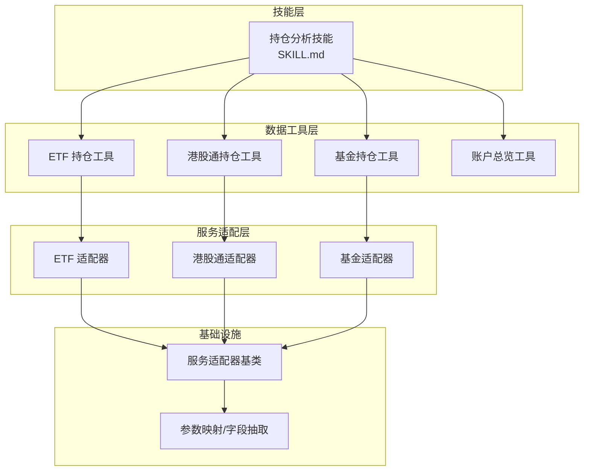
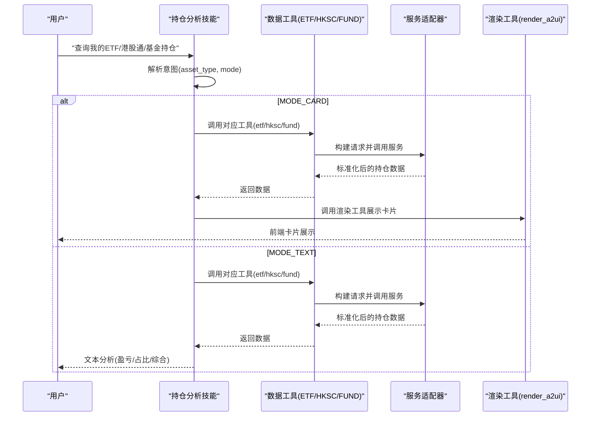
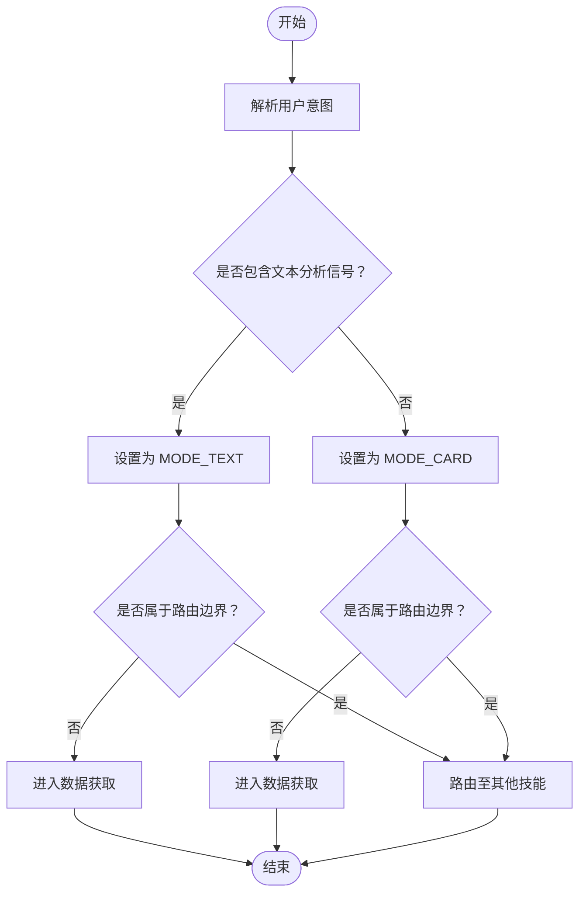
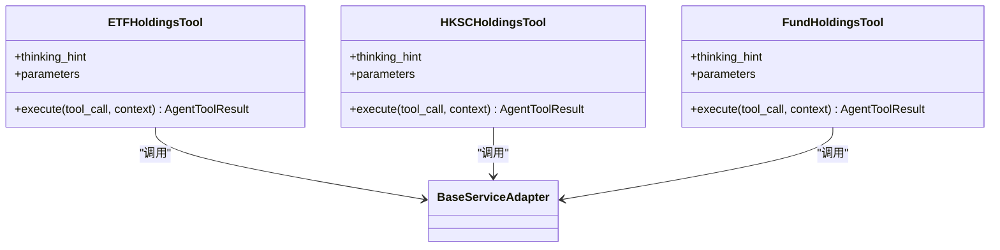
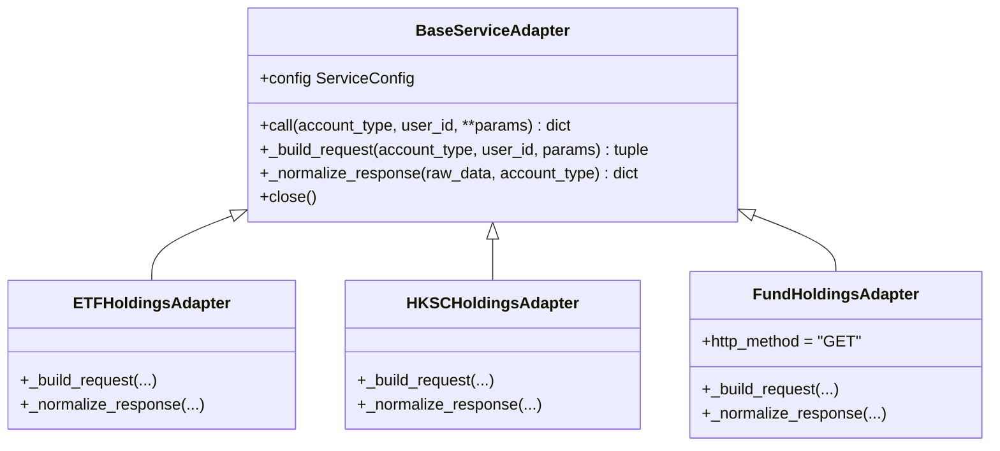
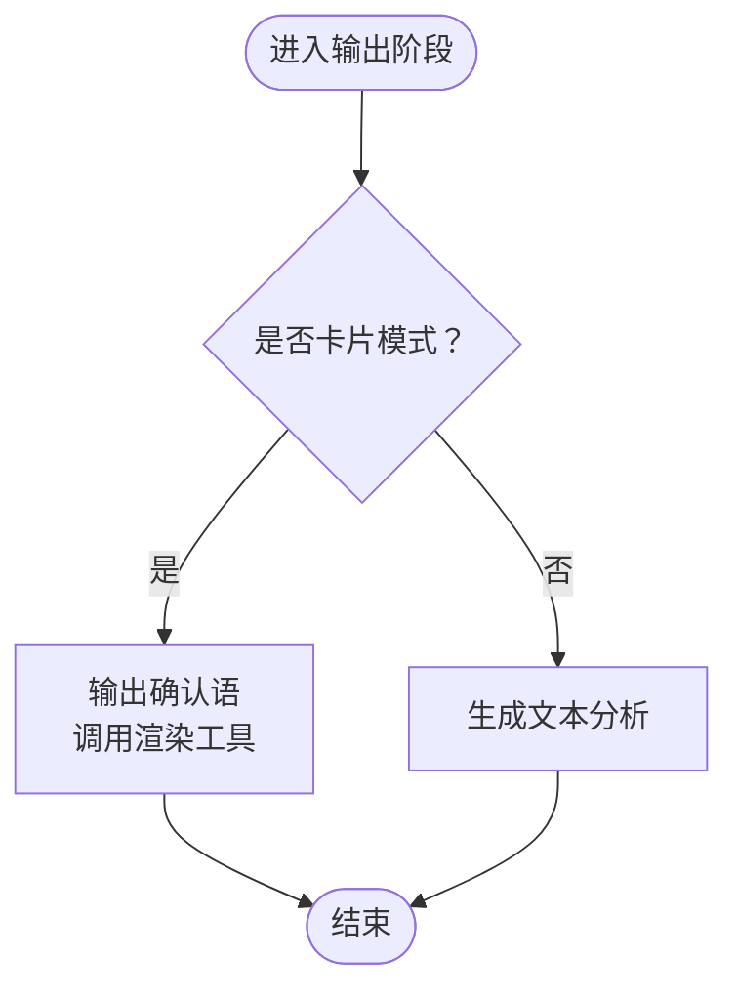
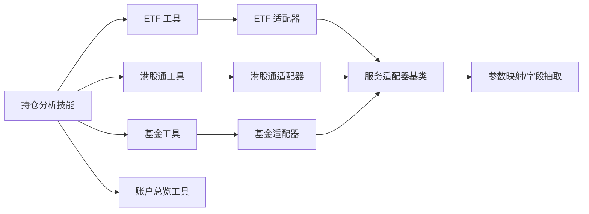

# 持仓分析技能

<cite>
**本文引用的文件**
- [SKILL.md](file://src/ark_agentic/agents/securities/skills/holdings_analysis/SKILL.md)
- [etf_holdings.py](file://src/ark_agentic/agents/securities/tools/agent/etf_holdings.py)
- [hksc_holdings.py](file://src/ark_agentic/agents/securities/tools/agent/hksc_holdings.py)
- [fund_holdings.py](file://src/ark_agentic/agents/securities/tools/agent/fund_holdings.py)
- [account_overview.py](file://src/ark_agentic/agents/securities/tools/agent/account_overview.py)
- [base.py](file://src/ark_agentic/agents/securities/tools/service/base.py)
- [etf_holdings.py](file://src/ark_agentic/agents/securities/tools/service/adapters/etf_holdings.py)
- [hksc_holdings.py](file://src/ark_agentic/agents/securities/tools/service/adapters/hksc_holdings.py)
- [fund_holdings.py](file://src/ark_agentic/agents/securities/tools/service/adapters/fund_holdings.py)
</cite>

## 目录
1. [简介](#简介)
2. [项目结构](#项目结构)
3. [核心组件](#核心组件)
4. [架构总览](#架构总览)
5. [详细组件分析](#详细组件分析)
6. [依赖关系分析](#依赖关系分析)
7. [性能考虑](#性能考虑)
8. [故障排查指南](#故障排查指南)
9. [结论](#结论)
10. [附录](#附录)

## 简介
本文件面向“持仓分析技能”，系统化阐述其对用户持仓进行深度分析的技术方案，包括：
- 持仓集中度分析
- 行业/资产类别分布
- 个股/ETF/基金权重计算
- 风险评估与提示
- 数据处理流程、分析算法与可视化输出
- 参数配置、过滤条件与排序规则
- 实战案例演示与性能优化建议

该技能支持对 ETF、港股通、基金三类资产的实时查询与分析，并提供卡片展示与文本分析两种模式，严格遵循“实时调用、禁止并发、禁止历史数据”的约束。

## 项目结构
围绕“持仓分析技能”，涉及以下关键模块：
- 技能定义与意图路由：位于技能目录的技能描述文件
- 数据工具层：ETF、港股通、基金持仓查询工具
- 服务适配层：各资产类型的适配器，负责认证、参数映射与响应标准化
- 基础设施：通用服务适配器基类、参数映射与字段抽取工具
- 可视化渲染：统一的卡片渲染工具

图表来源
- [SKILL.md:1-243](file://src/ark_agentic/agents/securities/skills/holdings_analysis/SKILL.md#L1-L243)
- [etf_holdings.py:1-99](file://src/ark_agentic/agents/securities/tools/agent/etf_holdings.py#L1-L99)
- [hksc_holdings.py:1-105](file://src/ark_agentic/agents/securities/tools/agent/hksc_holdings.py#L1-L105)
- [fund_holdings.py:1-104](file://src/ark_agentic/agents/securities/tools/agent/fund_holdings.py#L1-L104)
- [base.py:1-212](file://src/ark_agentic/agents/securities/tools/service/base.py#L1-L212)

章节来源
- [SKILL.md:1-243](file://src/ark_agentic/agents/securities/skills/holdings_analysis/SKILL.md#L1-L243)

## 核心组件
- 意图识别与模式选择：根据用户表达识别资产类型与展示模式（卡片/文本）
- 数据获取工具：分别封装 ETF、港股通、基金的查询逻辑
- 服务适配器：统一处理认证、参数映射、请求构造与响应标准化
- 输出策略：卡片模式与文本模式的差异化输出规范
- 错误处理与安全约束：工具不可用、空持仓、部分失败等场景的处理策略

章节来源
- [SKILL.md:39-243](file://src/ark_agentic/agents/securities/skills/holdings_analysis/SKILL.md#L39-L243)

## 架构总览
下图展示了“持仓分析技能”的端到端调用链路与数据流：

图表来源
- [SKILL.md:127-195](file://src/ark_agentic/agents/securities/skills/holdings_analysis/SKILL.md#L127-L195)
- [etf_holdings.py:62-99](file://src/ark_agentic/agents/securities/tools/agent/etf_holdings.py#L62-L99)
- [hksc_holdings.py:62-105](file://src/ark_agentic/agents/securities/tools/agent/hksc_holdings.py#L62-L105)
- [fund_holdings.py:62-104](file://src/ark_agentic/agents/securities/tools/agent/fund_holdings.py#L62-L104)

## 详细组件分析

### 意图识别与模式选择
- 资产类型枚举：ETF、HKSC、FUND
- 模式枚举：MODE_CARD（卡片展示）、MODE_TEXT（文本分析）
- 判断规则：
  - 优先识别文本分析信号（盈亏、比较、分布、明确要求文字），否则默认卡片模式
  - 对于“总资产/账户总览/收益排名”等边界问题，路由至其他技能

图表来源
- [SKILL.md:39-103](file://src/ark_agentic/agents/securities/skills/holdings_analysis/SKILL.md#L39-L103)

章节来源
- [SKILL.md:39-103](file://src/ark_agentic/agents/securities/skills/holdings_analysis/SKILL.md#L39-L103)

### 数据工具层（ETF/HKSC/FUND）
- 共同特性
  - 支持 user:* 前缀与裸键的上下文参数兼容
  - 优先使用上下文中的用户标识与账户类型
  - 统一通过服务适配器发起调用
- 差异点
  - 基金持仓工具对两融账户进行显式限制（返回提示并记录错误标记）
  - 港股通与ETF工具对两融账户进行显式限制（返回提示并记录错误标记）

图表来源
- [etf_holdings.py:46-99](file://src/ark_agentic/agents/securities/tools/agent/etf_holdings.py#L46-L99)
- [hksc_holdings.py:46-105](file://src/ark_agentic/agents/securities/tools/agent/hksc_holdings.py#L46-L105)
- [fund_holdings.py:46-104](file://src/ark_agentic/agents/securities/tools/agent/fund_holdings.py#L46-L104)

章节来源
- [etf_holdings.py:1-99](file://src/ark_agentic/agents/securities/tools/agent/etf_holdings.py#L1-L99)
- [hksc_holdings.py:1-105](file://src/ark_agentic/agents/securities/tools/agent/hksc_holdings.py#L1-L105)
- [fund_holdings.py:1-104](file://src/ark_agentic/agents/securities/tools/agent/fund_holdings.py#L1-L104)

### 服务适配器层（ETFS/HKSC/FUND）
- 统一基类职责
  - 构建请求头与负载
  - 发起 HTTP 请求（GET/POST）
  - 校验响应状态与业务状态
  - 标准化响应数据
- 适配器差异
  - ETF/HKSC：使用 validatedata + signature 认证
  - 基金：GET 请求，query 参数传递 usercode/channel
- 字段抽取
  - 通过字段抽取函数将原始数据转换为统一结构

图表来源
- [base.py:38-136](file://src/ark_agentic/agents/securities/tools/service/base.py#L38-L136)
- [etf_holdings.py:15-58](file://src/ark_agentic/agents/securities/tools/service/adapters/etf_holdings.py#L15-L58)
- [hksc_holdings.py:15-58](file://src/ark_agentic/agents/securities/tools/service/adapters/hksc_holdings.py#L15-L58)
- [fund_holdings.py:18-75](file://src/ark_agentic/agents/securities/tools/service/adapters/fund_holdings.py#L18-L75)

章节来源
- [base.py:1-212](file://src/ark_agentic/agents/securities/tools/service/base.py#L1-L212)
- [etf_holdings.py:1-58](file://src/ark_agentic/agents/securities/tools/service/adapters/etf_holdings.py#L1-L58)
- [hksc_holdings.py:1-58](file://src/ark_agentic/agents/securities/tools/service/adapters/hksc_holdings.py#L1-L58)
- [fund_holdings.py:1-75](file://src/ark_agentic/agents/securities/tools/service/adapters/fund_holdings.py#L1-L75)

### 输出策略与可视化
- 卡片模式（MODE_CARD）
  - 确认语 ≤30字
  - 成功后调用渲染工具展示卡片
  - 超时/空持仓时不调用渲染
- 文本模式（MODE_TEXT）
  - 总字数 ≤200字，Markdown 格式
  - 分析内容按用户意图选取：盈亏、分布、综合
  - 禁止生成交易建议、买卖推荐、市场预测

图表来源
- [SKILL.md:198-224](file://src/ark_agentic/agents/securities/skills/holdings_analysis/SKILL.md#L198-L224)

章节来源
- [SKILL.md:198-224](file://src/ark_agentic/agents/securities/skills/holdings_analysis/SKILL.md#L198-L224)

### 错误处理与安全约束
- 工具不可用：系统繁忙，请稍后重试
- 数据为空：当前无持仓
- 部分失败：已显示可获取的数据
- 安全约束：禁止使用历史对话数据、禁止泄露原始 JSON、禁止提供投资建议

章节来源
- [SKILL.md:227-243](file://src/ark_agentic/agents/securities/skills/holdings_analysis/SKILL.md#L227-L243)

## 依赖关系分析
- 技能层依赖数据工具层
- 数据工具层依赖服务适配器层
- 服务适配器层依赖基础设施（参数映射、字段抽取）
- 账户总览工具作为独立工具存在，与持仓分析技能互补

图表来源
- [SKILL.md:106-124](file://src/ark_agentic/agents/securities/skills/holdings_analysis/SKILL.md#L106-L124)
- [base.py:1-212](file://src/ark_agentic/agents/securities/tools/service/base.py#L1-L212)

章节来源
- [SKILL.md:106-124](file://src/ark_agentic/agents/securities/skills/holdings_analysis/SKILL.md#L106-L124)
- [base.py:1-212](file://src/ark_agentic/agents/securities/tools/service/base.py#L1-L212)

## 性能考虑
- 串行调用：多资产查询必须串行，避免并发带来的资源竞争与抖动
- 实时性：严禁使用历史对话数据，每次必须实时调用工具
- 网络优化：服务适配器基类内置超时控制与连接池管理，确保稳定性
- 输出控制：卡片模式与文本模式的字数上限与格式约束，减少前端渲染压力

章节来源
- [SKILL.md:150-163](file://src/ark_agentic/agents/securities/skills/holdings_analysis/SKILL.md#L150-L163)
- [base.py:47-53](file://src/ark_agentic/agents/securities/tools/service/base.py#L47-L53)

## 故障排查指南
- 工具不可用
  - 现象：调用报错或超时
  - 排查：检查网络连通性、服务端状态、认证配置
  - 处理：提示“系统繁忙，请稍后重试”
- 数据为空
  - 现象：返回“当前无持仓”
  - 排查：确认用户是否存在有效持仓、账户类型是否正确
  - 处理：提示空持仓并结束流程
- 部分失败
  - 现象：部分资产查询成功，部分失败
  - 排查：检查各资产工具的上下文参数与认证信息
  - 处理：展示可获取的数据，其余资产提示失败

章节来源
- [SKILL.md:227-234](file://src/ark_agentic/agents/securities/skills/holdings_analysis/SKILL.md#L227-L234)

## 结论
“持仓分析技能”通过清晰的意图识别、严格的工具调用顺序与统一的服务适配器架构，实现了对 ETF、港股通、基金三类资产的实时查询与分析。其输出策略兼顾用户体验与合规要求，既支持直观的卡片展示，也支持严谨的文本分析。在工程层面，通过串行调用、实时数据与统一错误处理，保障了系统的稳定性与安全性。

## 附录

### 参数配置与上下文兼容
- 上下文参数优先级：user:* 前缀 > 裸键 > 工具调用参数
- 必需字段（validatedata + signature 认证）：channel、usercode、userid、account、branchno、loginflag、mobileNo
- 可选字段：account_type（normal/margin）、user_id、signature

章节来源
- [etf_holdings.py:3-20](file://src/ark_agentic/agents/securities/tools/agent/etf_holdings.py#L3-L20)
- [hksc_holdings.py:3-20](file://src/ark_agentic/agents/securities/tools/agent/hksc_holdings.py#L3-L20)
- [fund_holdings.py:3-20](file://src/ark_agentic/agents/securities/tools/agent/fund_holdings.py#L3-L20)
- [account_overview.py:1-20](file://src/ark_agentic/agents/securities/tools/agent/account_overview.py#L1-L20)

### 过滤条件与排序规则
- 过滤条件
  - 两融账户限制：基金与港股通工具对 margin 账户返回提示
- 排序规则
  - 文本分析默认按用户意图选取重点字段展示
  - 卡片模式由渲染工具决定展示顺序

章节来源
- [fund_holdings.py:78-84](file://src/ark_agentic/agents/securities/tools/agent/fund_holdings.py#L78-L84)
- [hksc_holdings.py:79-85](file://src/ark_agentic/agents/securities/tools/agent/hksc_holdings.py#L79-L85)
- [SKILL.md:180-195](file://src/ark_agentic/agents/securities/skills/holdings_analysis/SKILL.md#L180-L195)

### 实战案例演示
- 案例1：查看 ETF 持仓
  - 用户表达：“我的ETF”
  - 意图：asset_type=ETF，mode=MODE_CARD
  - 流程：调用 ETF 工具 → 适配器标准化 → 渲染卡片
- 案例2：分析基金收益
  - 用户表达：“基金收益怎么样”
  - 意图：asset_type=FUND，mode=MODE_TEXT
  - 流程：调用基金工具 → 适配器标准化 → 文本分析（盈亏/占比/综合）
- 案例3：占比分布查询
  - 用户表达：“各类资产占比”
  - 意图：未指定具体资产类型，按占比查询
  - 流程：串行调用 ETF → HKSC → FUND → 文本分析占比分布

章节来源
- [SKILL.md:74-94](file://src/ark_agentic/agents/securities/skills/holdings_analysis/SKILL.md#L74-L94)
- [SKILL.md:152-159](file://src/ark_agentic/agents/securities/skills/holdings_analysis/SKILL.md#L152-L159)
- [SKILL.md:186-192](file://src/ark_agentic/agents/securities/skills/holdings_analysis/SKILL.md#L186-L192)