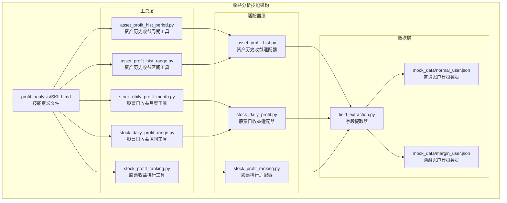
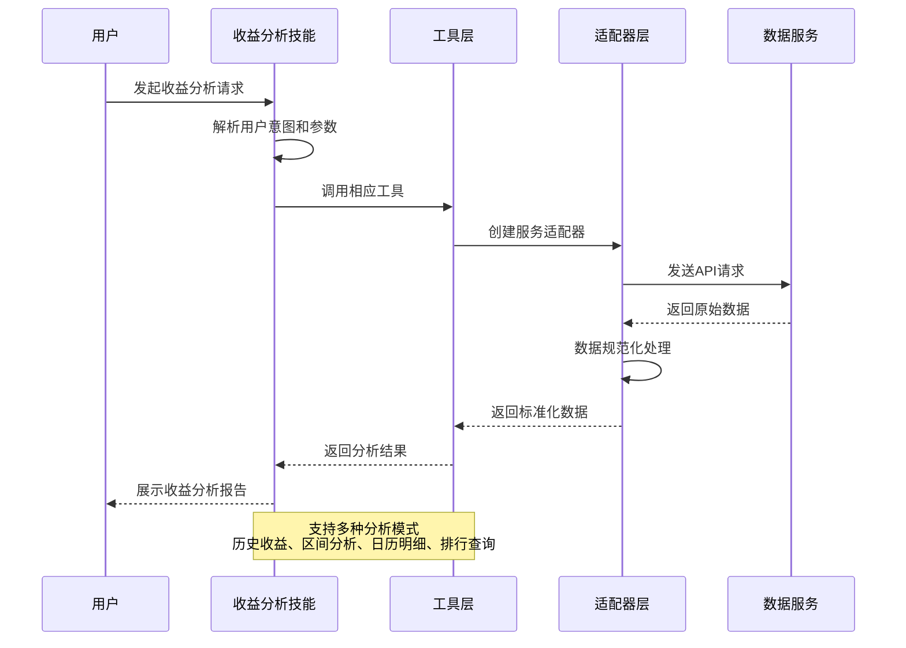
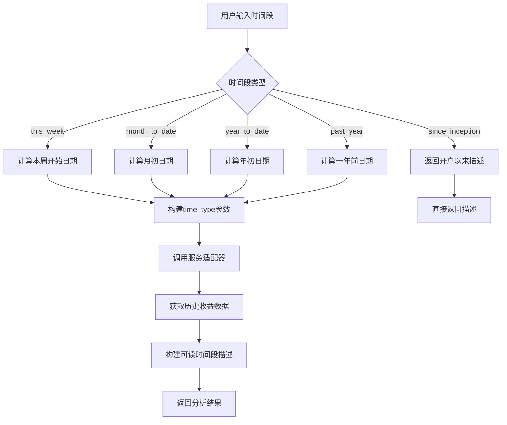
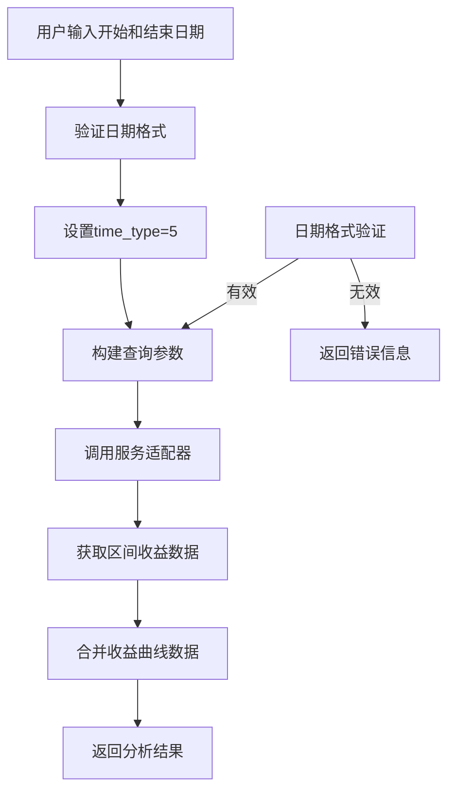
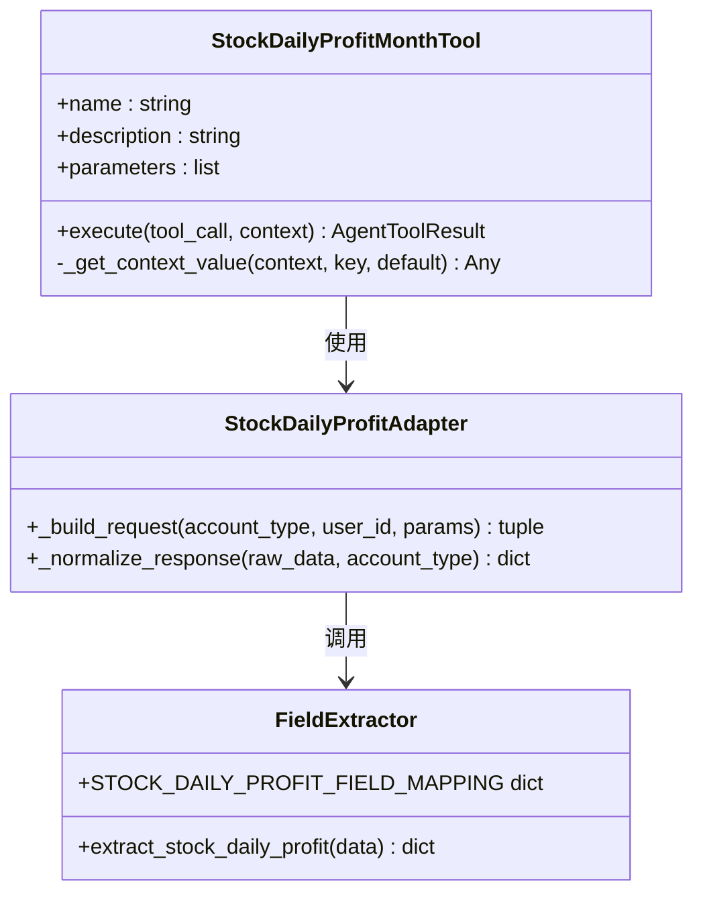
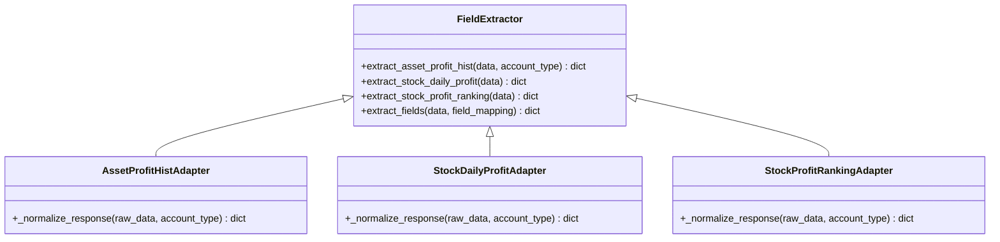
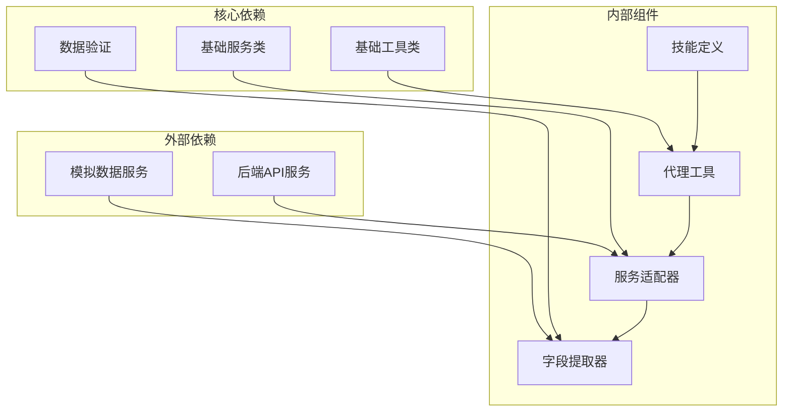
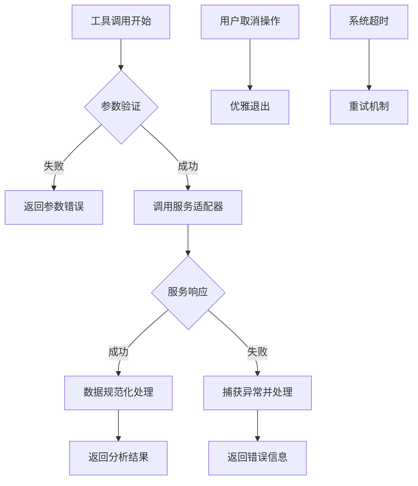

# 收益分析技能

<cite>
**本文档引用的文件**
- [profit_analysis/SKILL.md](file://src/ark_agentic/agents/securities/skills/profit_analysis/SKILL.md)
- [profit_inquiry/SKILL.md](file://src/ark_agentic/agents/securities/skills/profit_inquiry/SKILL.md)
- [asset_profit_hist_period.py](file://src/ark_agentic/agents/securities/tools/agent/asset_profit_hist_period.py)
- [asset_profit_hist_range.py](file://src/ark_agentic/agents/securities/tools/agent/asset_profit_hist_range.py)
- [stock_daily_profit_month.py](file://src/ark_agentic/agents/securities/tools/agent/stock_daily_profit_month.py)
- [stock_daily_profit_range.py](file://src/ark_agentic/agents/securities/tools/agent/stock_daily_profit_range.py)
- [stock_profit_ranking.py](file://src/ark_agentic/agents/securities/tools/agent/stock_profit_ranking.py)
- [asset_profit_hist.py](file://src/ark_agentic/agents/securities/tools/service/adapters/asset_profit_hist.py)
- [stock_daily_profit.py](file://src/ark_agentic/agents/securities/tools/service/adapters/stock_daily_profit.py)
- [stock_profit_ranking.py](file://src/ark_agentic/agents/securities/tools/service/adapters/stock_profit_ranking.py)
- [field_extraction.py](file://src/ark_agentic/agents/securities/tools/service/field_extraction.py)
- [asset_profit_hist_api.md](file://docs/securities/asset_profit_hist_api.md)
- [normal_user.json](file://src/ark_agentic/agents/securities/mock_data/stock_daily_profit/normal_user.json)
- [margin_user.json](file://src/ark_agentic/agents/securities/mock_data/stock_daily_profit/margin_user.json)
</cite>

## 目录
1. [简介](#简介)
2. [项目结构](#项目结构)
3. [核心组件](#核心组件)
4. [架构概览](#架构概览)
5. [详细组件分析](#详细组件分析)
6. [依赖关系分析](#依赖关系分析)
7. [性能考虑](#性能考虑)
8. [故障排除指南](#故障排除指南)
9. [结论](#结论)

## 简介

收益分析技能是ark-agentic智能体系统中的核心财务分析模块，专门负责处理用户与"钱的变动"相关的查询需求。该技能能够为用户提供全面的收益分析服务，包括历史收益追踪、区间收益分析、日历明细查询、收益排行以及分红事件管理等功能。

该技能的核心价值在于通过智能化的工具组合和严谨的数据处理流程，为用户提供准确、及时、可理解的收益分析结果，帮助用户更好地掌握自己的投资状况和市场表现。

## 项目结构

收益分析技能位于证券智能体的技能目录下，采用模块化设计，包含技能定义文件、工具实现和适配器层：

**图表来源**
- [profit_analysis/SKILL.md:1-58](file://src/ark_agentic/agents/securities/skills/profit_analysis/SKILL.md#L1-L58)
- [asset_profit_hist_period.py:1-148](file://src/ark_agentic/agents/securities/tools/agent/asset_profit_hist_period.py#L1-L148)
- [field_extraction.py:339-406](file://src/ark_agentic/agents/securities/tools/service/field_extraction.py#L339-L406)

**章节来源**
- [profit_analysis/SKILL.md:1-58](file://src/ark_agentic/agents/securities/skills/profit_analysis/SKILL.md#L1-L58)
- [profit_inquiry/SKILL.md:1-245](file://src/ark_agentic/agents/securities/skills/profit_inquiry/SKILL.md#L1-L245)

## 核心组件

收益分析技能包含以下核心组件，每个组件都有明确的职责分工和接口定义：

### 技能定义组件
- **profit_analysis/SKILL.md**: 定义了收益分析技能的整体架构、触发关键词、工具映射关系和执行约束
- **profit_inquiry/SKILL.md**: 提供收益查询的基础框架和模式识别机制

### 工具组件
- **资产历史收益工具**: 支持预定义时间段和自定义日期区间的资产收益曲线查询
- **股票日收益工具**: 提供月度和区间维度的股票每日收益明细查询
- **收益排行工具**: 实现股票盈利和亏损排行的综合分析

### 适配器组件
- **服务适配器**: 负责与后端服务的通信和数据转换
- **字段提取器**: 统一处理API响应数据的字段映射和格式化

**章节来源**
- [profit_analysis/SKILL.md:11-18](file://src/ark_agentic/agents/securities/skills/profit_analysis/SKILL.md#L11-L18)
- [profit_inquiry/SKILL.md:12-16](file://src/ark_agentic/agents/securities/skills/profit_inquiry/SKILL.md#L12-L16)

## 架构概览

收益分析技能采用分层架构设计，确保了系统的可维护性和扩展性：

**图表来源**
- [profit_analysis/SKILL.md:36-47](file://src/ark_agentic/agents/securities/skills/profit_analysis/SKILL.md#L36-L47)
- [asset_profit_hist_period.py:104-148](file://src/ark_agentic/agents/securities/tools/agent/asset_profit_hist_period.py#L104-L148)

该架构实现了以下关键特性：
- **模块化设计**: 每个组件职责单一，便于测试和维护
- **统一接口**: 所有工具遵循相同的参数约定和返回格式
- **灵活扩展**: 新增分析维度时只需添加相应的工具和适配器
- **数据一致性**: 通过字段提取器确保不同服务返回数据的格式统一

## 详细组件分析

### 资产历史收益分析组件

资产历史收益分析是收益分析技能的核心功能，支持两种查询模式：

#### 预定义时间段查询

**图表来源**
- [asset_profit_hist_period.py:33-55](file://src/ark_agentic/agents/securities/tools/agent/asset_profit_hist_period.py#L33-L55)
- [asset_profit_hist_period.py:104-148](file://src/ark_agentic/agents/securities/tools/agent/asset_profit_hist_period.py#L104-L148)

#### 自定义日期区间查询

**图表来源**
- [asset_profit_hist_range.py:60-100](file://src/ark_agentic/agents/securities/tools/agent/asset_profit_hist_range.py#L60-L100)

### 股票日收益明细分析组件

股票日收益明细分析提供精细化的收益追踪能力：

#### 月度收益查询

**图表来源**
- [stock_daily_profit_month.py:29-92](file://src/ark_agentic/agents/securities/tools/agent/stock_daily_profit_month.py#L29-L92)
- [stock_daily_profit.py:16-50](file://src/ark_agentic/agents/securities/tools/service/adapters/stock_daily_profit.py#L16-L50)
- [field_extraction.py:393-406](file://src/ark_agentic/agents/securities/tools/service/field_extraction.py#L393-L406)

#### 区间收益查询
支持用户自定义日期范围的收益明细查询，提供更灵活的分析能力。

### 收益排行分析组件

收益排行功能提供市场层面的收益对比分析：

#### 盈利排行分析

**图表来源**
- [stock_profit_ranking.py:80-137](file://src/ark_agentic/agents/securities/tools/agent/stock_profit_ranking.py#L80-L137)

#### 亏损排行分析
与盈利排行类似，但关注亏损最严重的股票标的。

**章节来源**
- [stock_profit_ranking.py:1-137](file://src/ark_agentic/agents/securities/tools/agent/stock_profit_ranking.py#L1-L137)

### 数据处理和分析组件

#### 字段提取和规范化

**图表来源**
- [field_extraction.py:350-406](file://src/ark_agentic/agents/securities/tools/service/field_extraction.py#L350-L406)
- [asset_profit_hist.py:44-51](file://src/ark_agentic/agents/securities/tools/service/adapters/asset_profit_hist.py#L44-L51)

#### 数据结构和格式
系统支持两种账户类型的收益数据处理：

**普通账户数据结构**：
- totalProfit: 累计总收益
- totalProfitRate: 累计收益率
- trdDate: 交易日期数组
- profit: 每日收益数组
- asset: 资产序列（期初→期末）

**两融账户数据结构**：
- 在普通账户基础上增加assetTotal字段
- 提供总资产和净资产的双重维度分析

**章节来源**
- [field_extraction.py:339-406](file://src/ark_agentic/agents/securities/tools/service/field_extraction.py#L339-L406)
- [asset_profit_hist_api.md:38-62](file://docs/securities/asset_profit_hist_api.md#L38-L62)

## 依赖关系分析

收益分析技能的依赖关系体现了清晰的分层架构：

**图表来源**
- [asset_profit_hist_period.py:11-14](file://src/ark_agentic/agents/securities/tools/agent/asset_profit_hist_period.py#L11-L14)
- [field_extraction.py:1-14](file://src/ark_agentic/agents/securities/tools/service/field_extraction.py#L1-L14)

### 关键依赖特性

1. **松耦合设计**: 工具层和适配器层通过接口解耦
2. **可替换性**: 服务适配器可以独立替换不同的后端实现
3. **数据一致性**: 字段提取器确保跨服务的数据格式统一
4. **错误隔离**: 异常处理在各层独立进行，避免级联故障

**章节来源**
- [asset_profit_hist.py:17-51](file://src/ark_agentic/agents/securities/tools/service/adapters/asset_profit_hist.py#L17-L51)
- [stock_daily_profit.py:16-50](file://src/ark_agentic/agents/securities/tools/service/adapters/stock_daily_profit.py#L16-L50)

## 性能考虑

收益分析技能在设计时充分考虑了性能优化和用户体验：

### 查询性能优化
- **参数预验证**: 在工具执行前验证参数有效性，减少无效请求
- **缓存策略**: 利用状态增量机制避免重复计算
- **批量处理**: 支持多维度数据的并行处理

### 内存使用优化
- **流式处理**: 对于大数据集采用流式处理方式
- **按需加载**: 仅加载必要的数据字段
- **及时释放**: 处理完成后及时释放内存资源

### 网络传输优化
- **压缩传输**: 对大体积数据进行压缩传输
- **连接复用**: 复用HTTP连接减少建立开销
- **超时控制**: 设置合理的超时机制避免长时间等待

## 故障排除指南

### 常见问题和解决方案

#### 参数验证错误
**问题**: 用户输入的时间参数格式不正确
**解决方案**: 
- 检查时间格式是否符合YYYYMMDD要求
- 验证时间段枚举值的有效性
- 确认日期范围的逻辑合理性

#### 数据获取失败
**问题**: 服务适配器无法获取预期数据
**排查步骤**:
1. 检查认证信息（validatedata）的有效性
2. 验证账户类型和权限设置
3. 确认网络连接状态
4. 查看服务端响应状态码

#### 数据格式异常
**问题**: 字段提取器无法正确解析API响应
**解决方法**:
- 检查API响应结构是否符合预期
- 验证字段映射配置的准确性
- 确认数据类型转换的正确性

### 错误处理策略

**图表来源**
- [asset_profit_hist_period.py:114-148](file://src/ark_agentic/agents/securities/tools/agent/asset_profit_hist_period.py#L114-L148)

**章节来源**
- [profit_analysis/SKILL.md:49-57](file://src/ark_agentic/agents/securities/skills/profit_analysis/SKILL.md#L49-L57)
- [profit_inquiry/SKILL.md:229-245](file://src/ark_agentic/agents/securities/skills/profit_inquiry/SKILL.md#L229-L245)

## 结论

收益分析技能通过其精心设计的架构和严格的实现规范，为用户提供了全面、准确、及时的收益分析服务。该技能的主要优势包括：

### 技术优势
- **模块化设计**: 清晰的分层架构便于维护和扩展
- **数据一致性**: 统一的字段提取机制确保数据格式标准化
- **错误处理**: 完善的异常处理机制提升系统稳定性
- **性能优化**: 多层次的性能优化策略保证响应速度

### 业务价值
- **用户体验**: 直观的查询界面和清晰的结果展示
- **决策支持**: 全面的收益分析为投资决策提供数据支撑
- **风险控制**: 及时的风险提示和预警机制
- **合规保障**: 严格的数据处理规范确保合规性

### 发展前景
随着金融市场的不断发展和用户需求的持续演进，收益分析技能将继续完善其功能特性，为用户提供更加智能化、个性化的收益分析服务。通过持续的技术创新和优化改进，该技能将在智能投顾领域发挥越来越重要的作用。