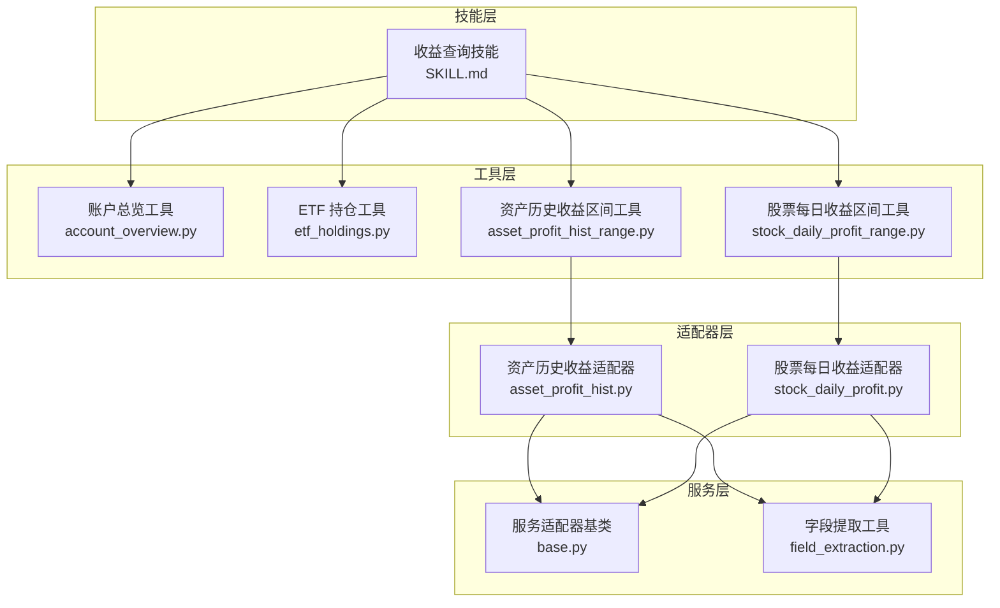
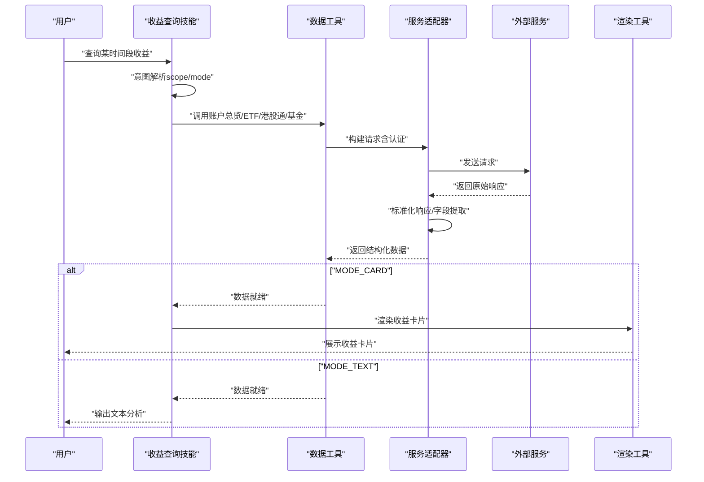
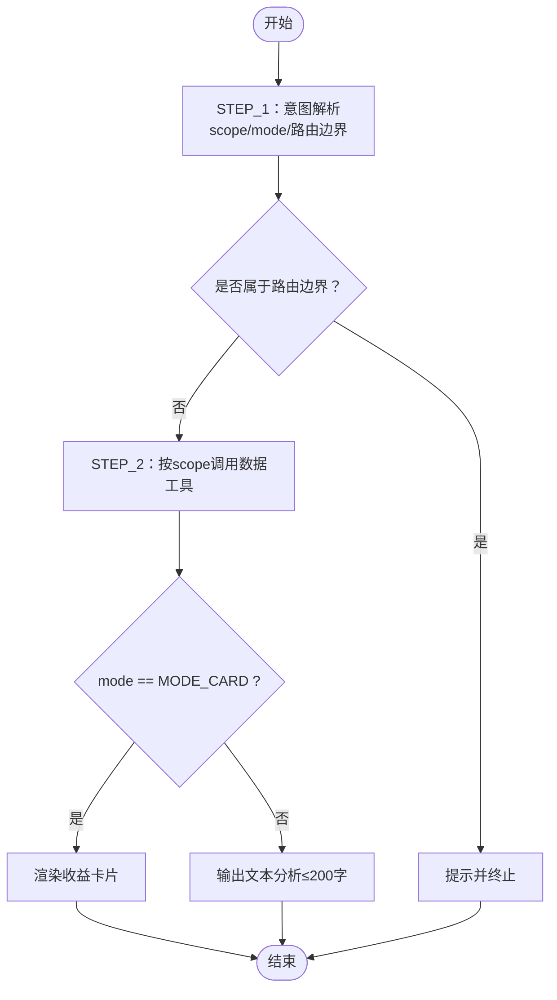
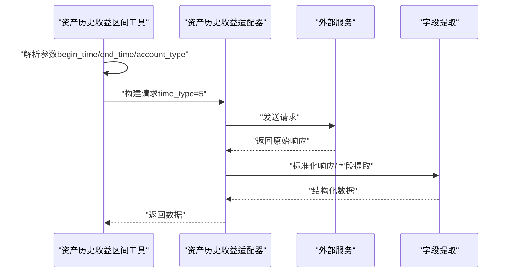
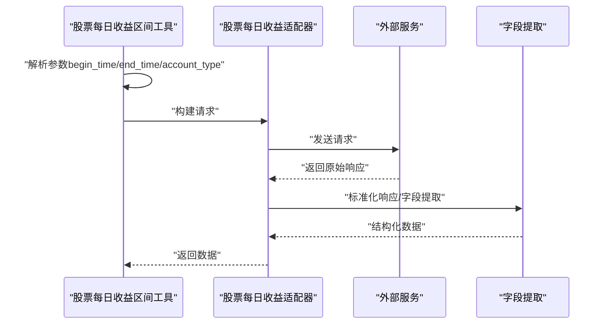
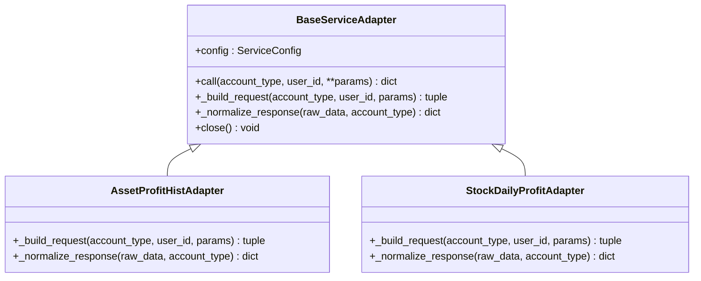
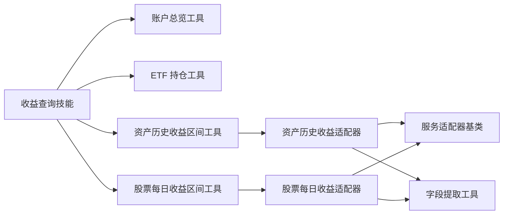

# 收益查询技能

<cite>
**本文引用的文件**
- [SKILL.md](file://src/ark_agentic/agents/securities/skills/profit_inquiry/SKILL.md)
- [asset_profit_hist_range.py](file://src/ark_agentic/agents/securities/tools/agent/asset_profit_hist_range.py)
- [stock_daily_profit_range.py](file://src/ark_agentic/agents/securities/tools/agent/stock_daily_profit_range.py)
- [asset_profit_hist.py](file://src/ark_agentic/agents/securities/tools/service/adapters/asset_profit_hist.py)
- [stock_daily_profit.py](file://src/ark_agentic/agents/securities/tools/service/adapters/stock_daily_profit.py)
- [base.py](file://src/ark_agentic/agents/securities/tools/service/base.py)
- [field_extraction.py](file://src/ark_agentic/agents/securities/tools/service/field_extraction.py)
- [account_overview.py](file://src/ark_agentic/agents/securities/tools/agent/account_overview.py)
- [etf_holdings.py](file://src/ark_agentic/agents/securities/tools/agent/etf_holdings.py)
</cite>

## 目录
1. [简介](#简介)
2. [项目结构](#项目结构)
3. [核心组件](#核心组件)
4. [架构概览](#架构概览)
5. [详细组件分析](#详细组件分析)
6. [依赖关系分析](#依赖关系分析)
7. [性能考虑](#性能考虑)
8. [故障排查指南](#故障排查指南)
9. [结论](#结论)
10. [附录](#附录)

## 简介
本文件面向“收益查询技能”，系统性阐述其如何快速查询用户的特定时间段收益情况，覆盖日收益、周收益、月收益等多时间粒度，并详细说明查询接口设计、数据缓存机制与实时更新策略。文档还包含技能的查询参数、过滤条件、结果格式化规范，以及性能优化与用户体验改进建议。

## 项目结构
收益查询技能位于证券智能体模块中，围绕“收益查询”这一核心能力，配套了账户总览、ETF/港股通/基金等持仓工具，以及资产历史收益曲线与股票每日收益明细两类服务适配器。整体采用“技能-工具-适配器-服务”的分层设计，确保查询链路清晰、职责分离。

图表来源
- [SKILL.md:1-245](file://src/ark_agentic/agents/securities/skills/profit_inquiry/SKILL.md#L1-L245)
- [account_overview.py:1-108](file://src/ark_agentic/agents/securities/tools/agent/account_overview.py#L1-L108)
- [etf_holdings.py:1-99](file://src/ark_agentic/agents/securities/tools/agent/etf_holdings.py#L1-L99)
- [asset_profit_hist_range.py:1-100](file://src/ark_agentic/agents/securities/tools/agent/asset_profit_hist_range.py#L1-L100)
- [stock_daily_profit_range.py:1-101](file://src/ark_agentic/agents/securities/tools/agent/stock_daily_profit_range.py#L1-L101)
- [asset_profit_hist.py:1-51](file://src/ark_agentic/agents/securities/tools/service/adapters/asset_profit_hist.py#L1-L51)
- [stock_daily_profit.py:1-50](file://src/ark_agentic/agents/securities/tools/service/adapters/stock_daily_profit.py#L1-L50)
- [base.py:1-212](file://src/ark_agentic/agents/securities/tools/service/base.py#L1-L212)
- [field_extraction.py:1-472](file://src/ark_agentic/agents/securities/tools/service/field_extraction.py#L1-L472)

章节来源
- [SKILL.md:1-245](file://src/ark_agentic/agents/securities/skills/profit_inquiry/SKILL.md#L1-L245)
- [account_overview.py:1-108](file://src/ark_agentic/agents/securities/tools/agent/account_overview.py#L1-L108)
- [etf_holdings.py:1-99](file://src/ark_agentic/agents/securities/tools/agent/etf_holdings.py#L1-L99)
- [asset_profit_hist_range.py:1-100](file://src/ark_agentic/agents/securities/tools/agent/asset_profit_hist_range.py#L1-L100)
- [stock_daily_profit_range.py:1-101](file://src/ark_agentic/agents/securities/tools/agent/stock_daily_profit_range.py#L1-L101)
- [asset_profit_hist.py:1-51](file://src/ark_agentic/agents/securities/tools/service/adapters/asset_profit_hist.py#L1-L51)
- [stock_daily_profit.py:1-50](file://src/ark_agentic/agents/securities/tools/service/adapters/stock_daily_profit.py#L1-L50)
- [base.py:1-212](file://src/ark_agentic/agents/securities/tools/service/base.py#L1-L212)
- [field_extraction.py:1-472](file://src/ark_agentic/agents/securities/tools/service/field_extraction.py#L1-L472)

## 核心组件
- 技能定义与意图模型：技能通过意图解析确定查询范围（总收益/单类资产收益）与模式（卡片展示/文本分析），并严格限定路由边界，避免与“账户总览”“持仓明细”等技能交叉。
- 工具契约：技能要求调用账户总览、ETF/港股通/基金等数据工具，随后调用渲染工具展示卡片；严禁同时调用多个工具，且必须实时调用工具获取最新数据。
- 适配器与字段提取：服务适配器负责构建请求、认证与响应标准化，字段提取工具将复杂API响应映射为前端友好的展示字段。
- 执行流程：意图解析 → 数据获取 → 模式分支（卡片/文本），并提供明确的失败处理策略。

章节来源
- [SKILL.md:19-245](file://src/ark_agentic/agents/securities/skills/profit_inquiry/SKILL.md#L19-L245)

## 架构概览
收益查询技能的调用链路遵循“技能 → 工具 → 适配器 → 服务”的分层结构。工具负责参数校验与上下文注入，适配器负责认证与请求构建，服务层负责响应标准化与字段抽取。

图表来源
- [SKILL.md:131-227](file://src/ark_agentic/agents/securities/skills/profit_inquiry/SKILL.md#L131-L227)
- [account_overview.py:72-107](file://src/ark_agentic/agents/securities/tools/agent/account_overview.py#L72-L107)
- [etf_holdings.py:62-98](file://src/ark_agentic/agents/securities/tools/agent/etf_holdings.py#L62-L98)
- [asset_profit_hist.py:24-50](file://src/ark_agentic/agents/securities/tools/service/adapters/asset_profit_hist.py#L24-L50)
- [stock_daily_profit.py:23-49](file://src/ark_agentic/agents/securities/tools/service/adapters/stock_daily_profit.py#L23-L49)
- [base.py:55-104](file://src/ark_agentic/agents/securities/tools/service/base.py#L55-L104)

## 详细组件分析

### 组件A：收益查询技能（意图与执行）
- 目标：快速呈现用户在特定时间段的收益情况，支持数值查询（卡片）与分析查询（文本）。
- 意图模型：
  - scope：TOTAL（总收益）、ASSET_TYPE（单类资产收益）
  - mode：MODE_CARD（卡片展示）、MODE_TEXT（文本分析）
- 执行流程：
  - STEP_1：意图解析，识别 scope 与 mode，并进行路由边界判定。
  - STEP_2：根据 scope 调用对应数据工具（账户总览/ETF/港股通/基金）。
  - MODE_CARD：输出简短确认语，调用渲染工具展示卡片。
  - MODE_TEXT：基于工具数据输出不超过200字的文本分析，禁止渲染卡片。
- 错误处理：工具不可用、数据为空、部分失败分别给出明确提示。

图表来源
- [SKILL.md:144-227](file://src/ark_agentic/agents/securities/skills/profit_inquiry/SKILL.md#L144-L227)

章节来源
- [SKILL.md:35-245](file://src/ark_agentic/agents/securities/skills/profit_inquiry/SKILL.md#L35-L245)

### 组件B：资产历史收益区间工具（按日期区间）
- 功能：查询用户指定起止日期区间的资产历史收益曲线，返回累计总收益、累计收益率及资产序列。
- 参数：
  - begin_time：起始日期（YYYYMMDD）
  - end_time：结束日期（YYYYMMDD）
  - account_type：账户类型（normal/margin，默认 normal）
- 实时性：工具在执行时从上下文解析 user_id 与 account_type，并将 time_type 固定为5（自定义区间），随后通过服务适配器调用外部服务并返回结构化数据。

图表来源
- [asset_profit_hist_range.py:60-99](file://src/ark_agentic/agents/securities/tools/agent/asset_profit_hist_range.py#L60-L99)
- [asset_profit_hist.py:24-50](file://src/ark_agentic/agents/securities/tools/service/adapters/asset_profit_hist.py#L24-L50)
- [field_extraction.py:350-391](file://src/ark_agentic/agents/securities/tools/service/field_extraction.py#L350-L391)

章节来源
- [asset_profit_hist_range.py:1-100](file://src/ark_agentic/agents/securities/tools/agent/asset_profit_hist_range.py#L1-L100)
- [asset_profit_hist.py:1-51](file://src/ark_agentic/agents/securities/tools/service/adapters/asset_profit_hist.py#L1-L51)
- [field_extraction.py:339-391](file://src/ark_agentic/agents/securities/tools/service/field_extraction.py#L339-L391)

### 组件C：股票每日收益区间工具（按日期区间）
- 功能：查询用户指定起止日期内的股票每日收益明细，包括总收益、总收益率及各交易日的收益额和收益率。
- 参数：
  - begin_time：起始日期（YYYYMMDD）
  - end_time：结束日期（YYYYMMDD）
  - account_type：账户类型（normal/margin，默认 normal）
- 实时性：工具在执行时从上下文解析 user_id 与 account_type，随后通过服务适配器调用外部服务并返回结构化数据。

图表来源
- [stock_daily_profit_range.py:61-100](file://src/ark_agentic/agents/securities/tools/agent/stock_daily_profit_range.py#L61-L100)
- [stock_daily_profit.py:23-49](file://src/ark_agentic/agents/securities/tools/service/adapters/stock_daily_profit.py#L23-L49)
- [field_extraction.py:404-406](file://src/ark_agentic/agents/securities/tools/service/field_extraction.py#L404-L406)

章节来源
- [stock_daily_profit_range.py:1-101](file://src/ark_agentic/agents/securities/tools/agent/stock_daily_profit_range.py#L1-L101)
- [stock_daily_profit.py:1-50](file://src/ark_agentic/agents/securities/tools/service/adapters/stock_daily_profit.py#L1-L50)
- [field_extraction.py:393-406](file://src/ark_agentic/agents/securities/tools/service/field_extraction.py#L393-L406)

### 组件D：服务适配器与字段提取
- 适配器基类：统一处理认证、请求构建、超时控制与错误日志记录；支持 GET/POST 方法；提供 require_context_fields 与 build_validatedata_request 等通用工具。
- 资产历史收益适配器：校验 validatedata 字段，构建 validatedata + signature 认证请求，标准化响应并调用字段提取工具。
- 股票每日收益适配器：与上述类似，但针对股票每日收益响应进行标准化。
- 字段提取工具：提供 extract_asset_profit_hist 与 extract_stock_daily_profit 等函数，将API响应映射为前端可用字段，如收益曲线、累计收益、日收益等。

图表来源
- [base.py:38-130](file://src/ark_agentic/agents/securities/tools/service/base.py#L38-L130)
- [asset_profit_hist.py:17-50](file://src/ark_agentic/agents/securities/tools/service/adapters/asset_profit_hist.py#L17-L50)
- [stock_daily_profit.py:16-49](file://src/ark_agentic/agents/securities/tools/service/adapters/stock_daily_profit.py#L16-L49)

章节来源
- [base.py:1-212](file://src/ark_agentic/agents/securities/tools/service/base.py#L1-L212)
- [asset_profit_hist.py:1-51](file://src/ark_agentic/agents/securities/tools/service/adapters/asset_profit_hist.py#L1-L51)
- [stock_daily_profit.py:1-50](file://src/ark_agentic/agents/securities/tools/service/adapters/stock_daily_profit.py#L1-L50)
- [field_extraction.py:339-406](file://src/ark_agentic/agents/securities/tools/service/field_extraction.py#L339-L406)

### 组件E：账户总览与ETF持仓工具
- 账户总览工具：提供总资产、现金、股票市值、今日收益、收益率等关键指标，支持普通与两融账户。
- ETF持仓工具：提供ETF持仓列表、市值、今日收益与收益率等，不区分账户类型。
- 两者均通过服务适配器进行认证与响应标准化，并将数据写入状态增量，供后续渲染使用。

章节来源
- [account_overview.py:57-107](file://src/ark_agentic/agents/securities/tools/agent/account_overview.py#L57-L107)
- [etf_holdings.py:46-98](file://src/ark_agentic/agents/securities/tools/agent/etf_holdings.py#L46-L98)
- [field_extraction.py:61-88](file://src/ark_agentic/agents/securities/tools/service/field_extraction.py#L61-L88)
- [field_extraction.py:127-199](file://src/ark_agentic/agents/securities/tools/service/field_extraction.py#L127-L199)

## 依赖关系分析
- 技能对工具的依赖：技能仅依赖账户总览、ETF/港股通/基金等数据工具，以及渲染工具；工具之间互不依赖，降低耦合。
- 工具对适配器的依赖：资产历史收益区间工具与股票每日收益区间工具均依赖对应适配器，适配器再依赖基类与字段提取工具。
- 适配器对服务层的依赖：适配器依赖基类提供的认证与请求构建能力，以及字段提取工具完成响应标准化。
- 上下文与参数：工具通过上下文解析 user_id、account_type 等参数，确保不同用户与账户类型的差异化处理。

图表来源
- [SKILL.md:110-127](file://src/ark_agentic/agents/securities/skills/profit_inquiry/SKILL.md#L110-L127)
- [asset_profit_hist_range.py:13-13](file://src/ark_agentic/agents/securities/tools/agent/asset_profit_hist_range.py#L13-L13)
- [stock_daily_profit_range.py:13-13](file://src/ark_agentic/agents/securities/tools/agent/stock_daily_profit_range.py#L13-L13)
- [asset_profit_hist.py:1-14](file://src/ark_agentic/agents/securities/tools/service/adapters/asset_profit_hist.py#L1-L14)
- [stock_daily_profit.py:1-13](file://src/ark_agentic/agents/securities/tools/service/adapters/stock_daily_profit.py#L1-L13)
- [base.py:1-212](file://src/ark_agentic/agents/securities/tools/service/base.py#L1-L212)
- [field_extraction.py:1-472](file://src/ark_agentic/agents/securities/tools/service/field_extraction.py#L1-L472)

章节来源
- [SKILL.md:110-127](file://src/ark_agentic/agents/securities/skills/profit_inquiry/SKILL.md#L110-L127)
- [asset_profit_hist_range.py:1-100](file://src/ark_agentic/agents/securities/tools/agent/asset_profit_hist_range.py#L1-L100)
- [stock_daily_profit_range.py:1-101](file://src/ark_agentic/agents/securities/tools/agent/stock_daily_profit_range.py#L1-L101)
- [asset_profit_hist.py:1-51](file://src/ark_agentic/agents/securities/tools/service/adapters/asset_profit_hist.py#L1-L51)
- [stock_daily_profit.py:1-50](file://src/ark_agentic/agents/securities/tools/service/adapters/stock_daily_profit.py#L1-L50)
- [base.py:1-212](file://src/ark_agentic/agents/securities/tools/service/base.py#L1-L212)
- [field_extraction.py:1-472](file://src/ark_agentic/agents/securities/tools/service/field_extraction.py#L1-L472)

## 性能考虑
- 实时查询与缓存策略
  - 实时性：技能与工具严格要求实时调用，不得复用历史对话数据，确保收益数据的时效性。
  - 缓存建议：可在工具层引入短期缓存（如1-5分钟）以减少重复查询压力，但需在UI层明确标注“数据更新时间”，并在用户主动刷新时强制清空缓存。
  - 区间优化：对于大跨度区间查询，建议前端分页或分批加载收益曲线，避免一次性渲染过多数据导致卡顿。
- 并发与超时
  - 适配器基类提供统一超时配置，建议在高并发场景下限制并发数并增加重试与熔断策略。
- 结果格式化
  - 字段提取工具将复杂响应映射为前端友好字段，建议在渲染层进行懒加载与虚拟滚动，提升长列表性能。

## 故障排查指南
- 常见错误与处理
  - 工具不可用：提示“系统繁忙，请稍后重试”，检查服务适配器日志与网络连通性。
  - 数据为空：提示“当前无收益数据”，确认用户上下文参数（user_id、account_type）正确。
  - 部分失败：提示“已显示可获取的数据”，引导用户重试或缩小查询区间。
- 日志与追踪
  - 适配器基类记录请求URL、参数与响应文本片段，便于定位问题；建议在网关层添加请求ID，串联前后端日志。
- 参数校验
  - 使用 require_context_fields 校验 validatedata 等必需字段，避免因上下文缺失导致的请求失败。

章节来源
- [base.py:89-101](file://src/ark_agentic/agents/securities/tools/service/base.py#L89-L101)
- [base.py:138-159](file://src/ark_agentic/agents/securities/tools/service/base.py#L138-L159)
- [SKILL.md:229-236](file://src/ark_agentic/agents/securities/skills/profit_inquiry/SKILL.md#L229-L236)

## 结论
收益查询技能通过清晰的意图模型、严格的工具契约与稳健的服务适配器架构，实现了对用户特定时间段收益的快速查询与展示。结合实时性保障、缓存策略与性能优化建议，可在保证数据准确性的前提下显著提升用户体验。

## 附录

### 查询参数与过滤条件
- 资产历史收益区间工具
  - begin_time：YYYYMMDD
  - end_time：YYYYMMDD
  - account_type：normal/margin
- 股票每日收益区间工具
  - begin_time：YYYYMMDD
  - end_time：YYYYMMDD
  - account_type：normal/margin

章节来源
- [asset_profit_hist_range.py:39-58](file://src/ark_agentic/agents/securities/tools/agent/asset_profit_hist_range.py#L39-L58)
- [stock_daily_profit_range.py:40-59](file://src/ark_agentic/agents/securities/tools/agent/stock_daily_profit_range.py#L40-L59)

### 结果格式化要点
- 资产历史收益曲线：包含累计总收益、累计收益率、交易日序列与资产序列，两融账户额外包含总资产序列。
- 股票每日收益明细：包含总收益、总收益率、交易日序列与日收益序列。

章节来源
- [field_extraction.py:350-391](file://src/ark_agentic/agents/securities/tools/service/field_extraction.py#L350-L391)
- [field_extraction.py:404-406](file://src/ark_agentic/agents/securities/tools/service/field_extraction.py#L404-L406)