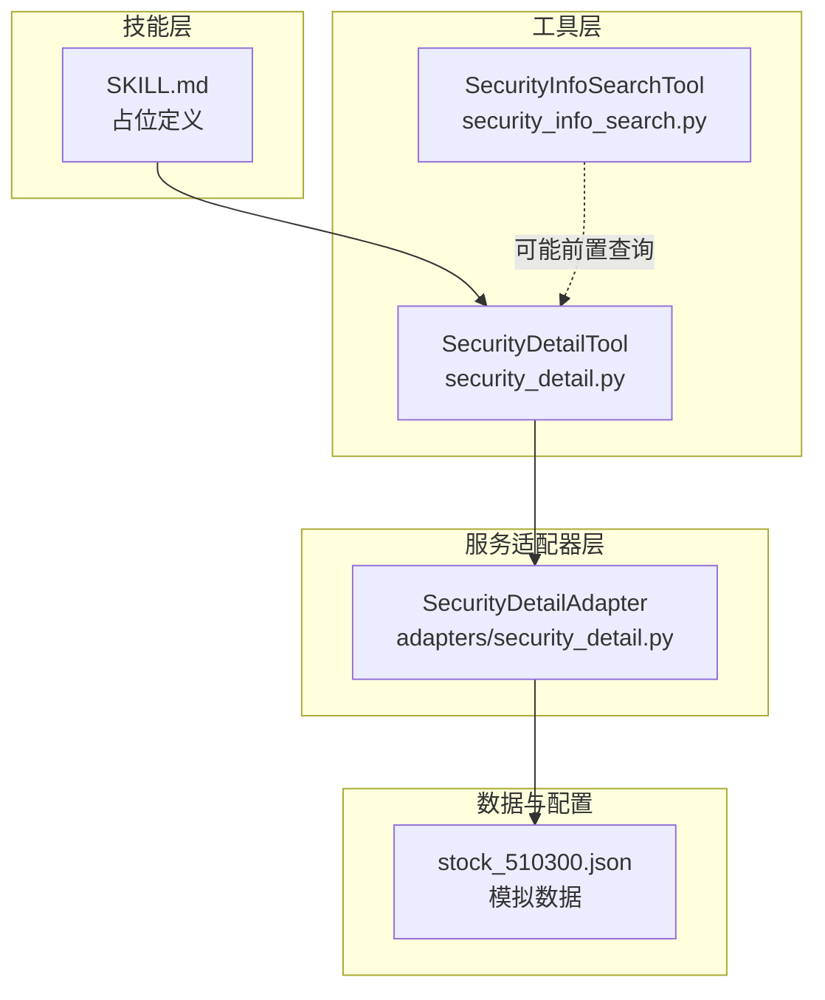
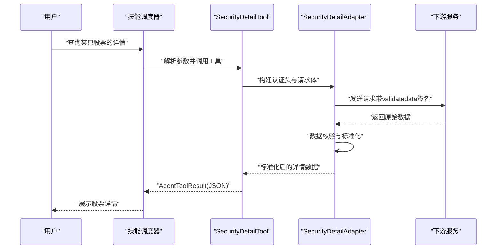
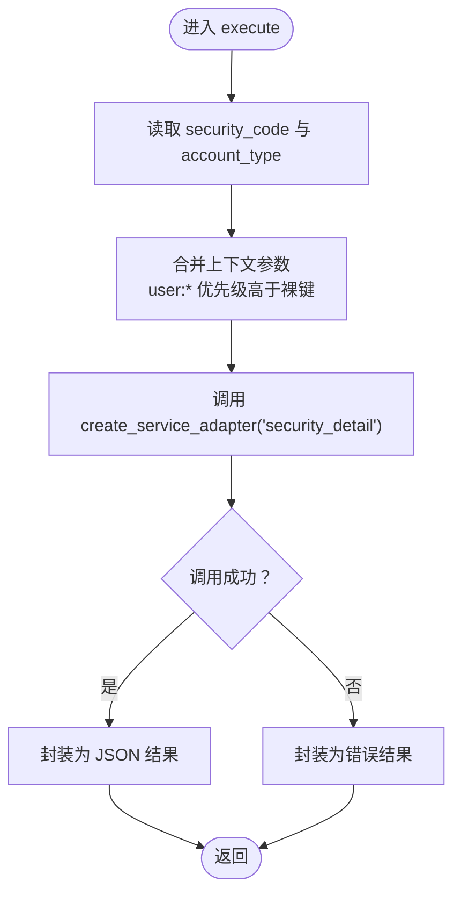
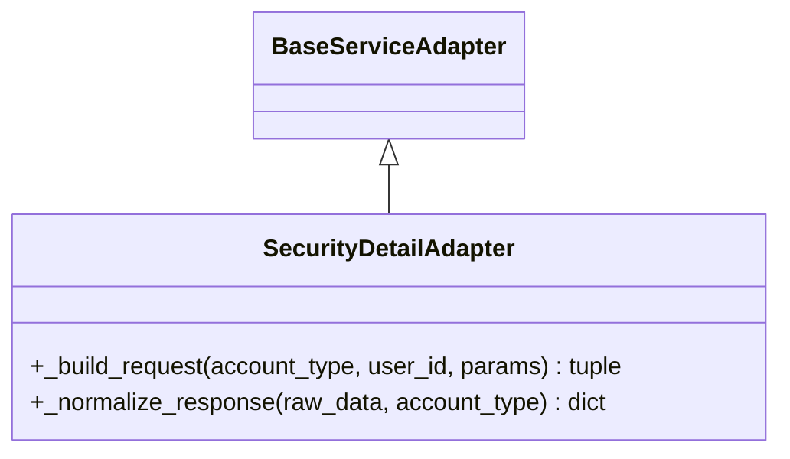
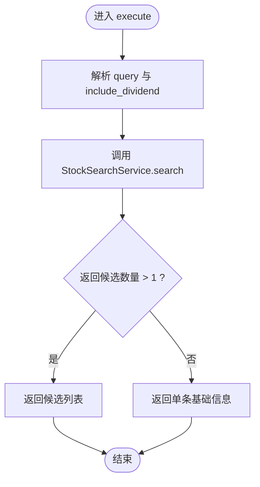
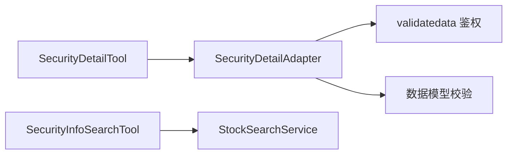

# 股票详情技能

<cite>
**本文引用的文件**
- [src/ark_agentic/agents/securities/skills/security_detail/SKILL.md](file://src/ark_agentic/agents/securities/skills/security_detail/SKILL.md)
- [src/ark_agentic/agents/securities/tools/agent/security_detail.py](file://src/ark_agentic/agents/securities/tools/agent/security_detail.py)
- [src/ark_agentic/agents/securities/tools/service/adapters/security_detail.py](file://src/ark_agentic/agents/securities/tools/service/adapters/security_detail.py)
- [src/ark_agentic/agents/securities/tools/agent/security_info_search.py](file://src/ark_agentic/agents/securities/tools/agent/security_info_search.py)
- [src/ark_agentic/agents/securities/mock_data/security_detail/stock_510300.json](file://src/ark_agentic/agents/securities/mock_data/security_detail/stock_510300.json)
</cite>

## 目录
1. [简介](#简介)
2. [项目结构](#项目结构)
3. [核心组件](#核心组件)
4. [架构总览](#架构总览)
5. [详细组件分析](#详细组件分析)
6. [依赖分析](#依赖分析)
7. [性能考虑](#性能考虑)
8. [故障排查指南](#故障排查指南)
9. [结论](#结论)
10. [附录](#附录)

## 简介
本文件面向“股票详情技能”，系统化阐述其在代理系统中的职责、数据流、认证与适配机制，以及与相关工具（如“股票信息查询”）的协作方式。当前仓库中，“股票详情技能”的技能定义仍处于占位状态，但其底层工具与适配器已具备可运行的框架：工具负责参数解析与调用服务适配器；适配器负责构建认证头、发起请求、标准化响应，并进行数据校验。同时，项目提供了模拟数据以支撑本地开发与测试。

## 项目结构
围绕“股票详情技能”，相关代码主要分布在以下位置：
- 技能定义：位于 securities/skills/security_detail/SKILL.md（当前为占位）
- 工具层：securities/tools/agent/security_detail.py（对外暴露的工具类）
- 服务适配器：securities/tools/service/adapters/security_detail.py（认证与响应标准化）
- 股票信息查询工具：securities/tools/agent/security_info_search.py（用于基础信息与候选匹配）
- 模拟数据：securities/mock_data/security_detail/stock_510300.json（示例返回结构）

图表来源
- [src/ark_agentic/agents/securities/skills/security_detail/SKILL.md:1-19](file://src/ark_agentic/agents/securities/skills/security_detail/SKILL.md#L1-L19)
- [src/ark_agentic/agents/securities/tools/agent/security_detail.py:46-103](file://src/ark_agentic/agents/securities/tools/agent/security_detail.py#L46-L103)
- [src/ark_agentic/agents/securities/tools/service/adapters/security_detail.py:18-68](file://src/ark_agentic/agents/securities/tools/service/adapters/security_detail.py#L18-L68)
- [src/ark_agentic/agents/securities/tools/agent/security_info_search.py:19-79](file://src/ark_agentic/agents/securities/tools/agent/security_info_search.py#L19-L79)
- [src/ark_agentic/agents/securities/mock_data/security_detail/stock_510300.json:1-29](file://src/ark_agentic/agents/securities/mock_data/security_detail/stock_510300.json#L1-L29)

章节来源
- [src/ark_agentic/agents/securities/skills/security_detail/SKILL.md:1-19](file://src/ark_agentic/agents/securities/skills/security_detail/SKILL.md#L1-L19)
- [src/ark_agentic/agents/securities/tools/agent/security_detail.py:1-103](file://src/ark_agentic/agents/securities/tools/agent/security_detail.py#L1-L103)
- [src/ark_agentic/agents/securities/tools/service/adapters/security_detail.py:1-68](file://src/ark_agentic/agents/securities/tools/service/adapters/security_detail.py#L1-L68)
- [src/ark_agentic/agents/securities/tools/agent/security_info_search.py:1-79](file://src/ark_agentic/agents/securities/tools/agent/security_info_search.py#L1-L79)
- [src/ark_agentic/agents/securities/mock_data/security_detail/stock_510300.json:1-29](file://src/ark_agentic/agents/securities/mock_data/security_detail/stock_510300.json#L1-L29)

## 核心组件
- 股票详情工具（SecurityDetailTool）
  - 职责：接收用户输入的证券代码与账户类型，构造上下文参数，调用服务适配器获取详情。
  - 关键点：支持 user:* 前缀与裸键的参数兼容；默认账户类型为普通账户；异常统一转为错误结果。
- 服务适配器（SecurityDetailAdapter）
  - 职责：基于 validatedata 与签名生成认证头，构建请求体，调用下游服务并标准化响应。
  - 关键点：要求上下文中存在 validatedata 字段；对响应使用安全的数据模型进行校验与转换。
- 股票信息查询工具（SecurityInfoSearchTool）
  - 职责：支持 6 位代码、名称、拼音与模糊输入，返回候选列表或基础信息（可选包含分红）。
  - 关键点：当输入模糊时返回多候选，便于后续确认。

章节来源
- [src/ark_agentic/agents/securities/tools/agent/security_detail.py:46-103](file://src/ark_agentic/agents/securities/tools/agent/security_detail.py#L46-L103)
- [src/ark_agentic/agents/securities/tools/service/adapters/security_detail.py:18-68](file://src/ark_agentic/agents/securities/tools/service/adapters/security_detail.py#L18-L68)
- [src/ark_agentic/agents/securities/tools/agent/security_info_search.py:19-79](file://src/ark_agentic/agents/securities/tools/agent/security_info_search.py#L19-L79)

## 架构总览
下图展示了“股票详情技能”在代理系统中的端到端调用链路：用户意图触发技能，技能调度工具，工具调用服务适配器，适配器完成认证与请求，最终返回标准化数据。

图表来源
- [src/ark_agentic/agents/securities/tools/agent/security_detail.py:68-103](file://src/ark_agentic/agents/securities/tools/agent/security_detail.py#L68-L103)
- [src/ark_agentic/agents/securities/tools/service/adapters/security_detail.py:24-68](file://src/ark_agentic/agents/securities/tools/service/adapters/security_detail.py#L24-L68)

## 详细组件分析

### 组件一：SecurityDetailTool（股票详情工具）
- 角色定位：对外暴露的工具接口，负责参数解析、上下文合并与异常兜底。
- 输入参数
  - 必填：security_code（证券代码）
  - 可选：account_type（账户类型 normal/margin，默认 normal）
- 上下文兼容策略
  - 优先使用工具参数；若不存在则回退到 user:* 前缀键；再回退到裸键；最后使用默认值。
- 执行流程
  - 解析 security_code 与 account_type；
  - 通过工厂方法创建适配器并调用；
  - 将返回数据封装为 AgentToolResult，失败时返回错误信息。

图表来源
- [src/ark_agentic/agents/securities/tools/agent/security_detail.py:68-103](file://src/ark_agentic/agents/securities/tools/agent/security_detail.py#L68-L103)

章节来源
- [src/ark_agentic/agents/securities/tools/agent/security_detail.py:32-103](file://src/ark_agentic/agents/securities/tools/agent/security_detail.py#L32-L103)

### 组件二：SecurityDetailAdapter（服务适配器）
- 角色定位：统一认证与请求构建，负责响应标准化。
- 认证与请求
  - 从上下文提取 validatedata 并生成认证头；
  - 构造请求体包含 user_id 与 account_type；
  - 合并服务通用头配置与鉴权值。
- 响应处理
  - 从原始数据中提取 data 字段；
  - 使用安全的数据模型进行校验与转换，失败抛出服务错误。

图表来源
- [src/ark_agentic/agents/securities/tools/service/adapters/security_detail.py:18-68](file://src/ark_agentic/agents/securities/tools/service/adapters/security_detail.py#L18-L68)

章节来源
- [src/ark_agentic/agents/securities/tools/service/adapters/security_detail.py:18-68](file://src/ark_agentic/agents/securities/tools/service/adapters/security_detail.py#L18-L68)

### 组件三：SecurityInfoSearchTool（股票信息查询工具）
- 角色定位：前置信息检索工具，支持多种输入形式与模糊匹配。
- 输入参数
  - 必填：query（6 位代码或名称/简称/拼音）
  - 可选：include_dividend（是否包含分红信息，默认 false）
- 行为特征
  - 模糊输入返回候选列表，供后续确认；
  - 成功时将数据写入状态增量，便于后续步骤消费。

图表来源
- [src/ark_agentic/agents/securities/tools/agent/security_info_search.py:55-79](file://src/ark_agentic/agents/securities/tools/agent/security_info_search.py#L55-L79)

章节来源
- [src/ark_agentic/agents/securities/tools/agent/security_info_search.py:19-79](file://src/ark_agentic/agents/securities/tools/agent/security_info_search.py#L19-L79)

### 组件四：模拟数据与技能占位
- 模拟数据
  - 提供了示例返回结构，包含证券代码、名称、类型、市场、持有与行情信息等字段，便于前端渲染与本地联调。
- 技能占位
  - 当前 SKILL.md 为占位文档，描述了未来意图与执行约束，但尚未处理任何请求。

章节来源
- [src/ark_agentic/agents/securities/mock_data/security_detail/stock_510300.json:1-29](file://src/ark_agentic/agents/securities/mock_data/security_detail/stock_510300.json#L1-L29)
- [src/ark_agentic/agents/securities/skills/security_detail/SKILL.md:1-19](file://src/ark_agentic/agents/securities/skills/security_detail/SKILL.md#L1-L19)

## 依赖分析
- 组件耦合
  - SecurityDetailTool 依赖服务适配器工厂方法与通用工具基类；
  - SecurityDetailAdapter 依赖认证头构建与数据模型校验；
  - SecurityInfoSearchTool 依赖搜索服务与通用工具基类。
- 外部依赖
  - 认证头生成依赖上下文中的 validatedata；
  - 数据模型校验依赖安全的数据结构（由适配器内部导入）。

图表来源
- [src/ark_agentic/agents/securities/tools/agent/security_detail.py:29-92](file://src/ark_agentic/agents/securities/tools/agent/security_detail.py#L29-L92)
- [src/ark_agentic/agents/securities/tools/service/adapters/security_detail.py:30-68](file://src/ark_agentic/agents/securities/tools/service/adapters/security_detail.py#L30-L68)
- [src/ark_agentic/agents/securities/tools/agent/security_info_search.py:16-67](file://src/ark_agentic/agents/securities/tools/agent/security_info_search.py#L16-L67)

章节来源
- [src/ark_agentic/agents/securities/tools/agent/security_detail.py:29-92](file://src/ark_agentic/agents/securities/tools/agent/security_detail.py#L29-L92)
- [src/ark_agentic/agents/securities/tools/service/adapters/security_detail.py:30-68](file://src/ark_agentic/agents/securities/tools/service/adapters/security_detail.py#L30-L68)
- [src/ark_agentic/agents/securities/tools/agent/security_info_search.py:16-67](file://src/ark_agentic/agents/securities/tools/agent/security_info_search.py#L16-L67)

## 性能考虑
- 请求合并与缓存
  - 对于高频查询的相同标的，可在适配器层引入轻量缓存，减少重复请求。
- 异步并发
  - 工具层已采用异步调用，适配器层建议保持异步特性，避免阻塞事件循环。
- 数据校验成本
  - 校验逻辑在适配器内执行，建议对常见错误路径提前短路，降低无效校验开销。
- 前置查询优化
  - 在调用详情工具前，优先使用“股票信息查询”工具进行精确匹配，减少模糊候选带来的二次请求。

## 故障排查指南
- 常见错误与定位
  - 缺少认证字段：上下文未提供 validatedata 会导致认证头构建失败。请检查调用方是否正确注入。
  - 参数缺失：security_code 为空或格式不正确会直接导致工具执行失败。请确保输入规范。
  - 数据校验失败：适配器在标准化阶段若发现数据不符合模型，会抛出服务错误。请核对下游返回结构与字段映射。
- 排查步骤
  - 检查工具调用参数与上下文键值（优先 user:* 前缀）；
  - 查看适配器构建的请求头与请求体；
  - 对照模拟数据结构验证返回字段；
  - 关注异常结果中的错误信息，定位具体环节。

章节来源
- [src/ark_agentic/agents/securities/tools/agent/security_detail.py:98-102](file://src/ark_agentic/agents/securities/tools/agent/security_detail.py#L98-L102)
- [src/ark_agentic/agents/securities/tools/service/adapters/security_detail.py:65-68](file://src/ark_agentic/agents/securities/tools/service/adapters/security_detail.py#L65-L68)

## 结论
“股票详情技能”在当前版本以占位定义开始，但其工具与适配器已形成清晰的调用链与认证机制。通过“股票信息查询”工具的前置匹配，可提升输入准确性；借助适配器的认证与数据校验，保障了输出的一致性与安全性。建议尽快完善技能定义与意图映射，补齐数据源集成与个性化展示能力，以满足更复杂的用户需求。

## 附录
- 最佳实践
  - 输入规范化：优先使用“股票信息查询”工具进行精确匹配，减少模糊输入带来的歧义。
  - 错误隔离：在工具层捕获异常并返回统一错误格式，便于上层展示与重试。
  - 数据一致性：严格依赖适配器的数据校验，避免直接信任下游返回。
- 投资决策辅助建议
  - 结合持有与行情信息，关注当日收益与累计收益变化趋势；
  - 结合分红信息（如开启包含），评估长期回报潜力；
  - 结合市场波动（开盘、最高、最低、成交量等），判断短期走势与风险。