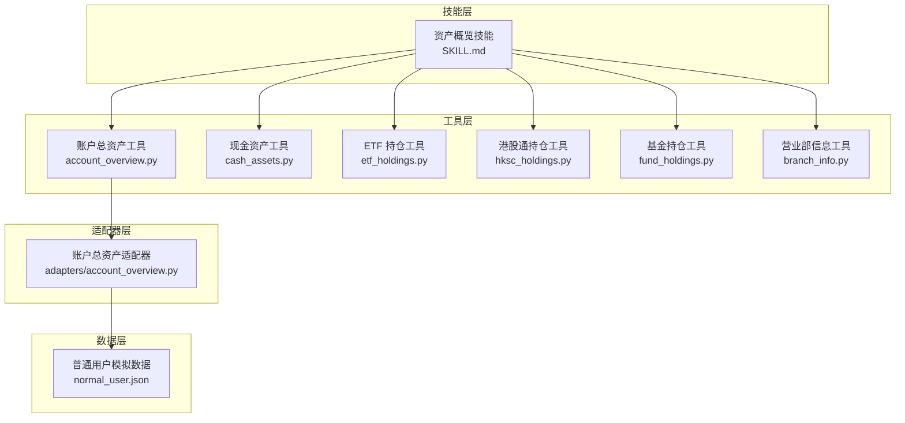
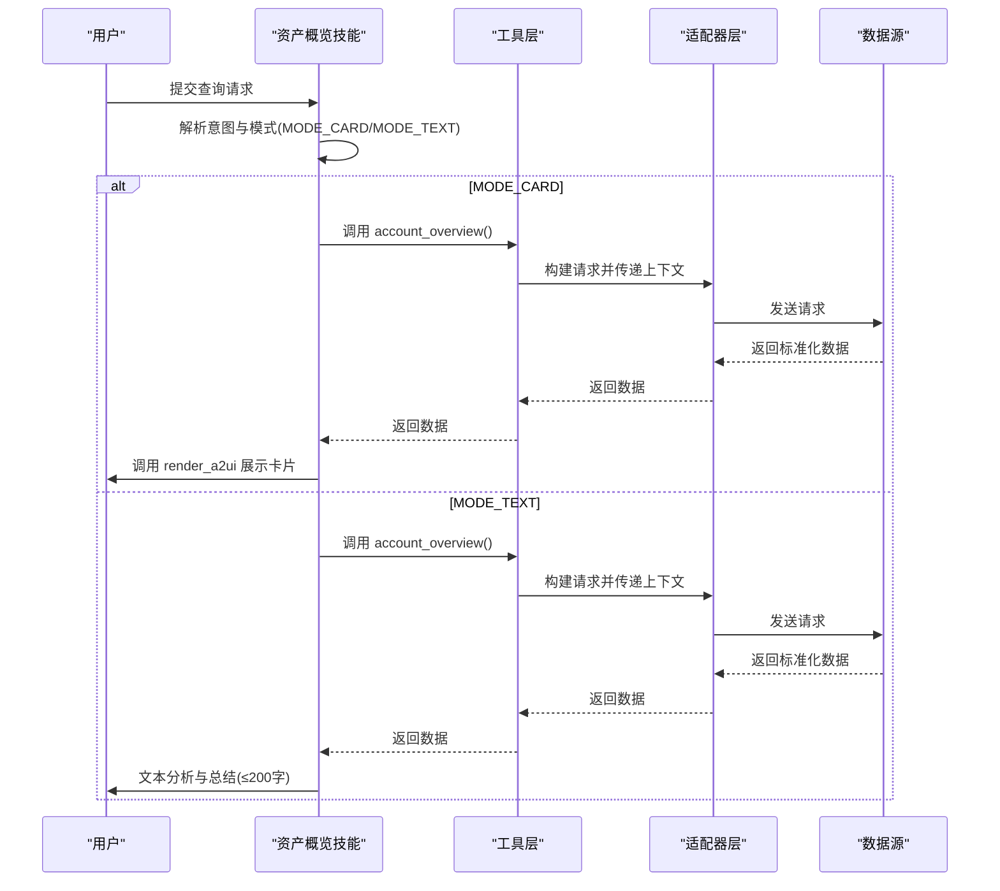
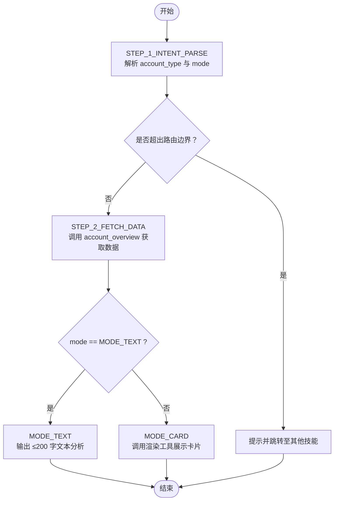
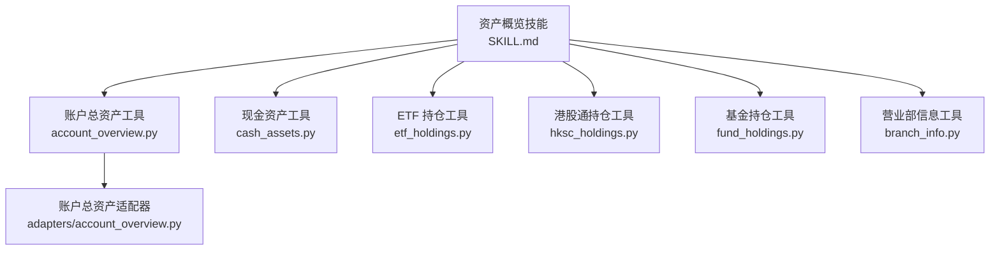

# 资产概览技能

<cite>
**本文档引用的文件**
- [SKILL.md](file://src/ark_agentic/agents/securities/skills/asset_overview/SKILL.md)
- [account_overview.py](file://src/ark_agentic/agents/securities/tools/agent/account_overview.py)
- [account_overview.py](file://src/ark_agentic/agents/securities/tools/service/adapters/account_overview.py)
- [normal_user.json](file://src/ark_agentic/agents/securities/mock_data/account_overview/normal_user.json)
- [cash_assets.py](file://src/ark_agentic/agents/securities/tools/agent/cash_assets.py)
- [etf_holdings.py](file://src/ark_agentic/agents/securities/tools/agent/etf_holdings.py)
- [hksc_holdings.py](file://src/ark_agentic/agents/securities/tools/agent/hksc_holdings.py)
- [fund_holdings.py](file://src/ark_agentic/agents/securities/tools/agent/fund_holdings.py)
- [branch_info.py](file://src/ark_agentic/agents/securities/tools/agent/branch_info.py)
</cite>

## 目录
1. [简介](#简介)
2. [项目结构](#项目结构)
3. [核心组件](#核心组件)
4. [架构总览](#架构总览)
5. [详细组件分析](#详细组件分析)
6. [依赖关系分析](#依赖关系分析)
7. [性能考虑](#性能考虑)
8. [故障排除指南](#故障排除指南)
9. [结论](#结论)
10. [附录](#附录)

## 简介
资产概览技能用于帮助用户快速了解其账户的整体资产状况，涵盖总资产、现金资产、持仓市值、浮动盈亏、两融风控指标等关键信息，并支持以卡片形式直观展示或以文本方式进行简要分析。技能通过统一的上下文注入机制获取用户身份与认证信息，结合多个专用工具完成数据采集与渲染，确保每次查询均为实时数据，避免使用历史对话中的数值。

## 项目结构
资产概览技能位于证券代理模块下，采用“技能 + 工具 + 适配器 + Mock 数据”的分层组织方式：
- 技能定义：位于技能目录，描述职责、触发词、工具映射、执行流程与输出策略
- 工具层：面向具体业务的工具封装，负责参数解析与上下文注入
- 适配器层：对接服务端接口，完成请求构建、认证头生成与响应标准化
- Mock 数据：提供模拟返回，便于本地调试与测试

图表来源
- [SKILL.md:1-186](file://src/ark_agentic/agents/securities/skills/asset_overview/SKILL.md#L1-L186)
- [account_overview.py:1-108](file://src/ark_agentic/agents/securities/tools/agent/account_overview.py#L1-L108)
- [account_overview.py:1-61](file://src/ark_agentic/agents/securities/tools/service/adapters/account_overview.py#L1-L61)
- [normal_user.json:1-103](file://src/ark_agentic/agents/securities/mock_data/account_overview/normal_user.json#L1-L103)

章节来源
- [SKILL.md:1-186](file://src/ark_agentic/agents/securities/skills/asset_overview/SKILL.md#L1-L186)

## 核心组件
- 资产概览技能：定义职责边界、触发词、工具映射、模式判断（卡片/文本）、执行流程与错误处理策略
- 账户总资产工具：从上下文读取认证与用户信息，调用适配器获取总资产数据
- 现金资产工具：查询现金余额、可用资金、可取资金、冻结资金与今日收益
- ETF/港股通/基金持仓工具：分别查询对应大类资产的持仓列表与市值
- 营业部信息工具：查询开户营业部名称、地址、电话与席位号
- 适配器：构建请求参数与认证头，校验响应并标准化输出
- Mock 数据：提供模拟返回，覆盖普通账户的总资产结构

章节来源
- [SKILL.md:21-186](file://src/ark_agentic/agents/securities/skills/asset_overview/SKILL.md#L21-L186)
- [account_overview.py:57-108](file://src/ark_agentic/agents/securities/tools/agent/account_overview.py#L57-L108)
- [cash_assets.py:46-96](file://src/ark_agentic/agents/securities/tools/agent/cash_assets.py#L46-L96)
- [etf_holdings.py:46-99](file://src/ark_agentic/agents/securities/tools/agent/etf_holdings.py#L46-L99)
- [hksc_holdings.py:46-105](file://src/ark_agentic/agents/securities/tools/agent/hksc_holdings.py#L46-L105)
- [fund_holdings.py:46-104](file://src/ark_agentic/agents/securities/tools/agent/fund_holdings.py#L46-L104)
- [branch_info.py:28-61](file://src/ark_agentic/agents/securities/tools/agent/branch_info.py#L28-L61)
- [account_overview.py:15-61](file://src/ark_agentic/agents/securities/tools/service/adapters/account_overview.py#L15-L61)
- [normal_user.json:1-103](file://src/ark_agentic/agents/securities/mock_data/account_overview/normal_user.json#L1-L103)

## 架构总览
资产概览技能的调用链路遵循“意图解析 → 数据获取 → 模式判定 → 输出”的标准流程。技能通过上下文注入机制读取用户身份与认证信息，工具层负责参数解析与上下文传递，适配器层完成请求构建与认证，最终返回标准化数据。

图表来源
- [SKILL.md:96-168](file://src/ark_agentic/agents/securities/skills/asset_overview/SKILL.md#L96-L168)
- [account_overview.py:72-108](file://src/ark_agentic/agents/securities/tools/agent/account_overview.py#L72-L108)
- [account_overview.py:21-61](file://src/ark_agentic/agents/securities/tools/service/adapters/account_overview.py#L21-L61)

## 详细组件分析

### 技能定义与职责边界
- 核心职责：宏观资产、现金状况、持仓列表、账户属性
- 触发关键词：总资产、账户情况、仓位、现金、可用资金、冻结、ETF 持仓、港股持仓、我的基金、营业部、在哪开的户
- 工具映射：账户整体资产 → account_overview；现金状况 → cash_assets；持仓列表 → etf_holdings/hksc_holdings/fund_holdings；账户属性 → branch_info
- 模式判断：优先识别是否需要诊断/归因分析，否则默认卡片模式
- 路由边界：持仓明细与收益排名不由本技能处理，应转交至相应技能

章节来源
- [SKILL.md:23-78](file://src/ark_agentic/agents/securities/skills/asset_overview/SKILL.md#L23-L78)

### 上下文注入机制
- 参数来源优先级：user:* 前缀上下文 > 裸键上下文 > 工具调用参数
- 必需认证字段：validatedata、signature
- 可选字段：account_type、user_id/id
- 工具层统一通过上下文读取并透传给适配器，保证参数一致性与安全性

章节来源
- [account_overview.py:32-86](file://src/ark_agentic/agents/securities/tools/agent/account_overview.py#L32-L86)
- [cash_assets.py:32-76](file://src/ark_agentic/agents/securities/tools/agent/cash_assets.py#L32-L76)
- [etf_holdings.py:32-76](file://src/ark_agentic/agents/securities/tools/agent/etf_holdings.py#L32-L76)
- [hksc_holdings.py:32-76](file://src/ark_agentic/agents/securities/tools/agent/hksc_holdings.py#L32-L76)
- [fund_holdings.py:32-76](file://src/ark_agentic/agents/securities/tools/agent/fund_holdings.py#L32-L76)
- [branch_info.py:37-49](file://src/ark_agentic/agents/securities/tools/agent/branch_info.py#L37-L49)

### 执行流程与模式判定
- 步骤一：意图解析，识别 account_type 与 mode
- 步骤二：数据获取，调用 account_overview 获取总资产数据
- 条件分支：
  - MODE_TEXT：基于数据输出 ≤200 字的文本分析，禁止调用渲染工具
  - MODE_CARD：调用渲染工具展示卡片，输出简短确认语（≤30 字）

图表来源
- [SKILL.md:96-168](file://src/ark_agentic/agents/securities/skills/asset_overview/SKILL.md#L96-L168)

章节来源
- [SKILL.md:96-168](file://src/ark_agentic/agents/securities/skills/asset_overview/SKILL.md#L96-L168)

### 数据来源与计算逻辑
- 账户总资产数据来源于账户总资产工具，适配器负责：
  - 校验上下文必需字段 validatedata
  - 构建请求体与认证头
  - 标准化响应并提取关键指标
- 模拟数据包含普通账户的总资产、现金、持仓市值、今日收益等字段，便于本地验证

章节来源
- [account_overview.py:21-61](file://src/ark_agentic/agents/securities/tools/service/adapters/account_overview.py#L21-L61)
- [normal_user.json:1-103](file://src/ark_agentic/agents/securities/mock_data/account_overview/normal_user.json#L1-L103)

### 输出格式与约束
- MODE_CARD：调用渲染工具输出卡片，附加 ≤30 字确认语，禁止输出数值摘要或原始 JSON
- MODE_TEXT：禁止调用渲染工具，输出 ≤200 字的 Markdown 文本分析
- 安全与合规：禁止使用历史对话数据、禁止泄露原始 JSON、禁止提供投资建议

章节来源
- [SKILL.md:147-186](file://src/ark_agentic/agents/securities/skills/asset_overview/SKILL.md#L147-L186)

### 多轮对话处理能力
- 技能通过上下文注入机制持续获取用户身份与认证信息，确保多次交互中参数一致
- 工具层统一从上下文中读取 account_type 与 user_id，避免重复输入
- 适配器层在每次调用时重新构建请求，保证数据实时性

章节来源
- [account_overview.py:80-96](file://src/ark_agentic/agents/securities/tools/agent/account_overview.py#L80-L96)
- [cash_assets.py:70-84](file://src/ark_agentic/agents/securities/tools/agent/cash_assets.py#L70-L84)
- [etf_holdings.py:70-85](file://src/ark_agentic/agents/securities/tools/agent/etf_holdings.py#L70-L85)
- [hksc_holdings.py:70-93](file://src/ark_agentic/agents/securities/tools/agent/hksc_holdings.py#L70-L93)
- [fund_holdings.py:70-91](file://src/ark_agentic/agents/securities/tools/agent/fund_holdings.py#L70-L91)
- [branch_info.py:44-49](file://src/ark_agentic/agents/securities/tools/agent/branch_info.py#L44-L49)

### 与其他技能的协作关系
- 路由边界：持仓明细与收益排名不由本技能处理，应转交至持仓分析与收益查询技能
- 协作方式：技能匹配器根据用户意图选择合适技能，避免交叉处理

章节来源
- [SKILL.md:69-78](file://src/ark_agentic/agents/securities/skills/asset_overview/SKILL.md#L69-L78)

## 依赖关系分析
资产概览技能依赖多个工具与适配器，形成清晰的分层依赖关系：

图表来源
- [SKILL.md:11-18](file://src/ark_agentic/agents/securities/skills/asset_overview/SKILL.md#L11-L18)
- [account_overview.py:29-96](file://src/ark_agentic/agents/securities/tools/agent/account_overview.py#L29-L96)
- [account_overview.py:15-61](file://src/ark_agentic/agents/securities/tools/service/adapters/account_overview.py#L15-L61)

章节来源
- [SKILL.md:11-18](file://src/ark_agentic/agents/securities/skills/asset_overview/SKILL.md#L11-L18)

## 性能考虑
- 实时数据：每次查询均需实时调用工具，严禁使用历史对话数据
- 请求构建：适配器在每次调用时重新构建请求与认证头，确保时效性与安全性
- 输出控制：严格限制文本长度与卡片渲染，避免冗余信息影响用户体验

章节来源
- [SKILL.md:112-118](file://src/ark_agentic/agents/securities/skills/asset_overview/SKILL.md#L112-L118)
- [SKILL.md:157-158](file://src/ark_agentic/agents/securities/skills/asset_overview/SKILL.md#L157-L158)

## 故障排除指南
- 工具不可用：系统繁忙，请稍后重试
- 数据为空：当前无资产数据
- 部分失败：已显示可获取的数据
- 两融账户限制：港股通与基金持仓工具对两融账户返回提示卡片，需调用渲染工具展示

章节来源
- [SKILL.md:170-177](file://src/ark_agentic/agents/securities/skills/asset_overview/SKILL.md#L170-L177)
- [hksc_holdings.py:79-85](file://src/ark_agentic/agents/securities/tools/agent/hksc_holdings.py#L79-L85)
- [fund_holdings.py:78-84](file://src/ark_agentic/agents/securities/tools/agent/fund_holdings.py#L78-L84)

## 结论
资产概览技能通过清晰的职责边界、严格的上下文注入与模式判定机制，实现了对用户资产的快速、准确与合规展示。其分层架构确保了数据获取的实时性与安全性，同时通过与其它技能的协作，形成了完整的资产信息服务闭环。

## 附录

### 使用示例与最佳实践
- 示例场景
  - “查看我的资产” → MODE_CARD：调用渲染工具展示卡片
  - “为什么今天亏损” → MODE_TEXT：输出 ≤200 字的文本分析
- 最佳实践
  - 优先使用上下文注入的认证参数，避免硬编码
  - 严禁在 MODE_TEXT 中调用渲染工具
  - 对两融账户的港股通与基金持仓，使用提示卡片引导用户

章节来源
- [SKILL.md:53-68](file://src/ark_agentic/agents/securities/skills/asset_overview/SKILL.md#L53-L68)
- [SKILL.md:147-158](file://src/ark_agentic/agents/securities/skills/asset_overview/SKILL.md#L147-L158)