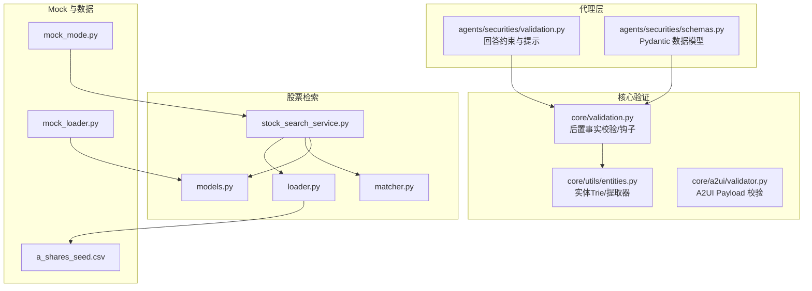
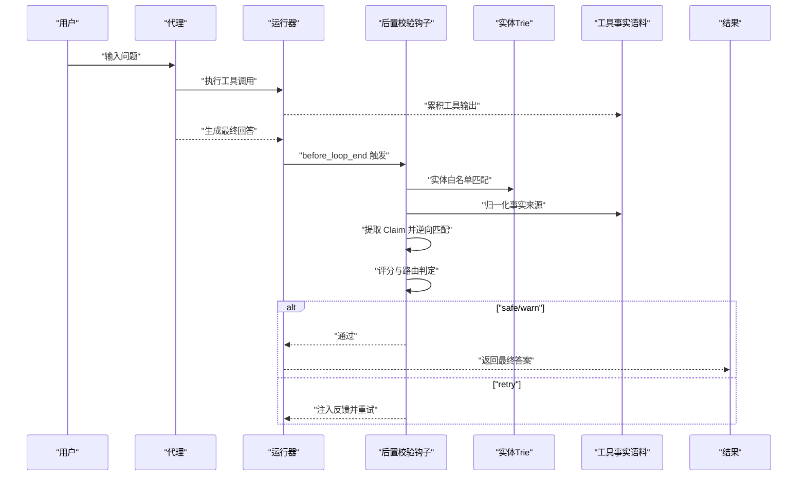
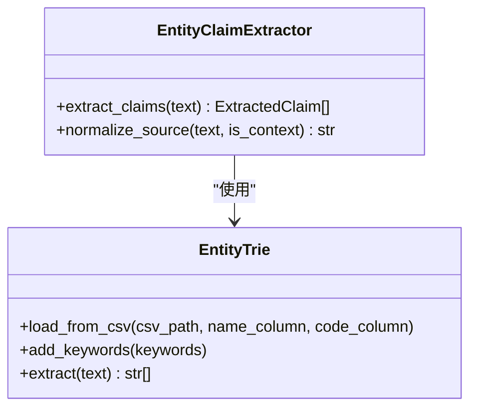
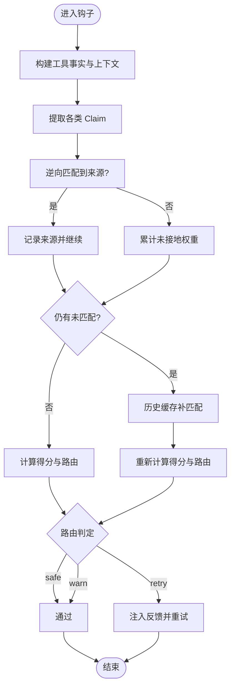
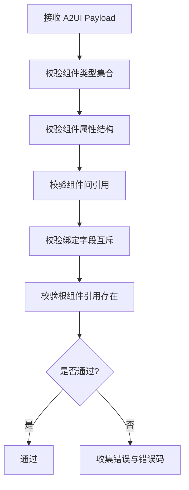
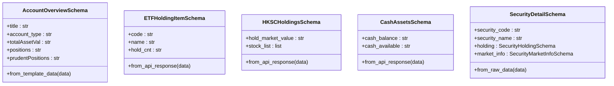
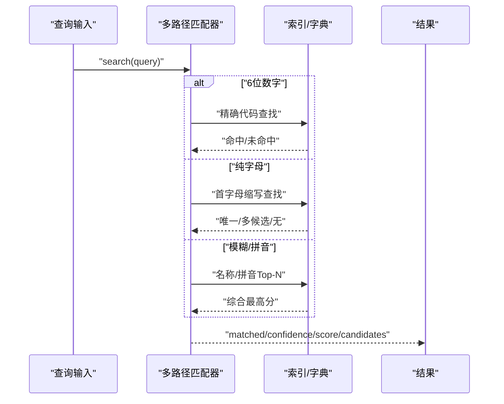
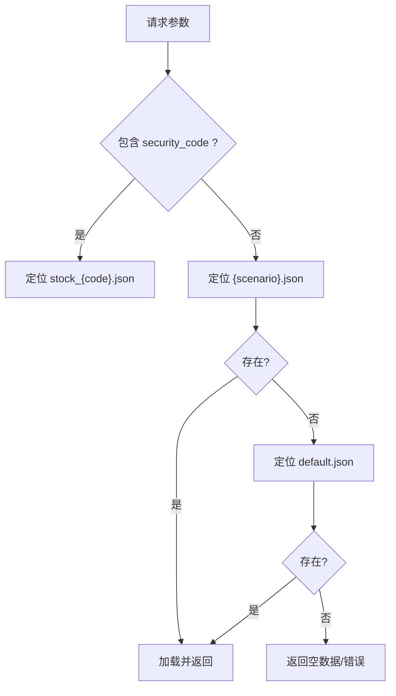
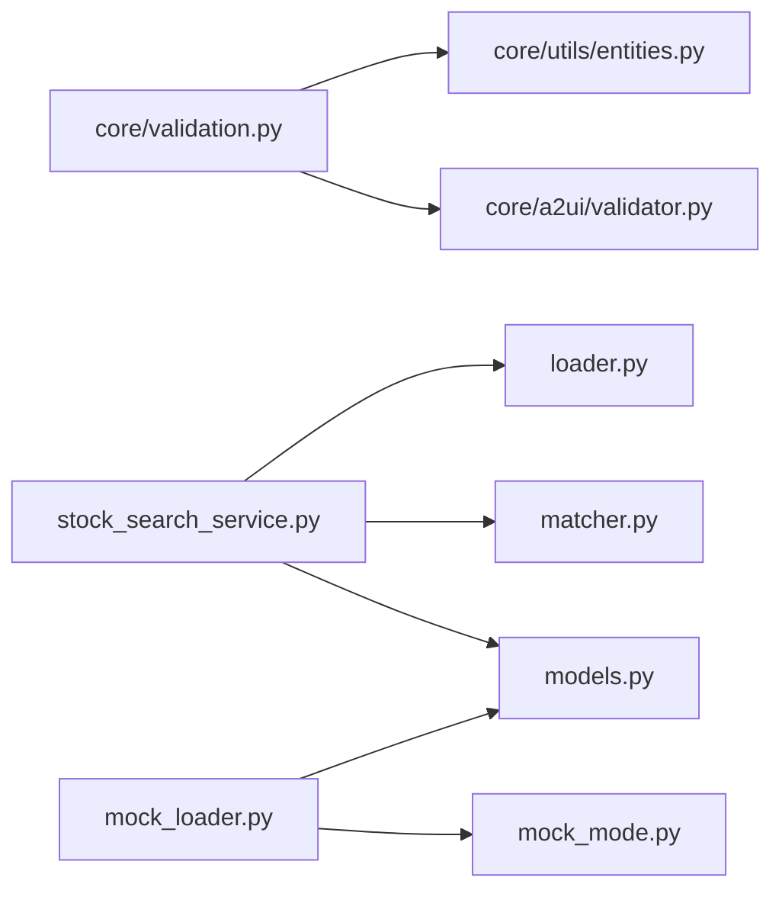

# 数据验证与安全

<cite>
**本文档引用的文件**
- [validation.py](file://src/ark_agentic/agents/securities/validation.py)
- [schemas.py](file://src/ark_agentic/agents/securities/schemas.py)
- [validation.py](file://src/ark_agentic/core/validation.py)
- [validator.py](file://src/ark_agentic/core/a2ui/validator.py)
- [entities.py](file://src/ark_agentic/core/utils/entities.py)
- [stock_search_service.py](file://src/ark_agentic/agents/securities/tools/service/stock_search_service.py)
- [loader.py](file://src/ark_agentic/agents/securities/tools/service/stock_search/loader.py)
- [matcher.py](file://src/ark_agentic/agents/securities/tools/service/stock_search/matcher.py)
- [models.py](file://src/ark_agentic/agents/securities/tools/service/stock_search/models.py)
- [mock_loader.py](file://src/ark_agentic/agents/securities/tools/service/mock_loader.py)
- [mock_mode.py](file://src/ark_agentic/agents/securities/tools/service/mock_mode.py)
- [a_shares_seed.csv](file://src/ark_agentic/agents/securities/mock_data/stocks/a_shares_seed.csv)
</cite>

## 目录
1. [简介](#简介)
2. [项目结构](#项目结构)
3. [核心组件](#核心组件)
4. [架构总览](#架构总览)
5. [详细组件分析](#详细组件分析)
6. [依赖分析](#依赖分析)
7. [性能考量](#性能考量)
8. [故障排查指南](#故障排查指南)
9. [结论](#结论)
10. [附录](#附录)

## 简介
本文件面向“证券智能体数据验证与安全系统”，聚焦以下目标：
- 实体 Trie 树构建与引用验证钩子
- Schema 验证机制与安全防护
- 股票代码验证、数据完整性检查
- Mock 数据加载与实体识别系统
- 验证规则配置、错误处理机制、安全策略与合规检查
- 数据验证最佳实践、安全开发指南与调试技巧

系统采用“输出后置事实校验”与“A2UI 层级校验”双轨机制，结合实体白名单、Trie 树与多路径匹配，确保回答事实可追溯、可验证、可审计。

## 项目结构
围绕“证券智能体”的验证与安全，相关模块分布如下：
- 代理层验证与提示约束：agents/securities/validation.py
- 数据模型与 Schema：agents/securities/schemas.py
- 核心验证框架：core/validation.py（后置事实校验、钩子工厂）
- A2UI Payload 校验：core/a2ui/validator.py
- 实体提取与 Trie：core/utils/entities.py
- 股票检索服务：agents/securities/tools/service/stock_search_service.py
- 股票索引与匹配：stock_search/loader.py、matcher.py、models.py
- Mock 数据加载与模式：mock_loader.py、mock_mode.py
- 股票种子数据：a_shares_seed.csv

**图表来源**
- [validation.py:1-22](file://src/ark_agentic/agents/securities/validation.py#L1-L22)
- [schemas.py:1-465](file://src/ark_agentic/agents/securities/schemas.py#L1-L465)
- [validation.py:1-605](file://src/ark_agentic/core/validation.py#L1-L605)
- [entities.py:1-96](file://src/ark_agentic/core/utils/entities.py#L1-L96)
- [validator.py:1-227](file://src/ark_agentic/core/a2ui/validator.py#L1-L227)
- [stock_search_service.py:1-84](file://src/ark_agentic/agents/securities/tools/service/stock_search_service.py#L1-L84)
- [loader.py:1-138](file://src/ark_agentic/agents/securities/tools/service/stock_search/loader.py#L1-L138)
- [matcher.py:1-239](file://src/ark_agentic/agents/securities/tools/service/stock_search/matcher.py#L1-L239)
- [models.py:1-136](file://src/ark_agentic/agents/securities/tools/service/stock_search/models.py#L1-L136)
- [mock_loader.py:1-178](file://src/ark_agentic/agents/securities/tools/service/mock_loader.py#L1-L178)
- [mock_mode.py:1-24](file://src/ark_agentic/agents/securities/tools/service/mock_mode.py#L1-L24)
- [a_shares_seed.csv:1-800](file://src/ark_agentic/agents/securities/mock_data/stocks/a_shares_seed.csv#L1-L800)

**章节来源**
- [validation.py:1-22](file://src/ark_agentic/agents/securities/validation.py#L1-L22)
- [validation.py:1-605](file://src/ark_agentic/core/validation.py#L1-L605)
- [validator.py:1-227](file://src/ark_agentic/core/a2ui/validator.py#L1-L227)
- [entities.py:1-96](file://src/ark_agentic/core/utils/entities.py#L1-L96)
- [stock_search_service.py:1-84](file://src/ark_agentic/agents/securities/tools/service/stock_search_service.py#L1-L84)
- [loader.py:1-138](file://src/ark_agentic/agents/securities/tools/service/stock_search/loader.py#L1-L138)
- [matcher.py:1-239](file://src/ark_agentic/agents/securities/tools/service/stock_search/matcher.py#L1-L239)
- [models.py:1-136](file://src/ark_agentic/agents/securities/tools/service/stock_search/models.py#L1-L136)
- [mock_loader.py:1-178](file://src/ark_agentic/agents/securities/tools/service/mock_loader.py#L1-L178)
- [mock_mode.py:1-24](file://src/ark_agentic/agents/securities/tools/service/mock_mode.py#L1-L24)
- [a_shares_seed.csv:1-800](file://src/ark_agentic/agents/securities/mock_data/stocks/a_shares_seed.csv#L1-L800)

## 核心组件
- 代理层回答约束：通过系统提示约束回答范围，避免编造事实，强调“仅依据工具与上下文”。
- 核心验证框架：提供 Claim 抽取、事实来源归一化、逆向匹配、评分与路由（safe/warn/retry）、钩子工厂。
- 实体 Trie 与提取器：基于 FlashText 的 Trie，支持名称与代码两类关键词，用于实体白名单校验。
- A2UI Payload 校验：对组件类型、绑定字段、引用一致性进行静态校验。
- 股票检索服务：多路径匹配（精确代码、首字母、模糊名称、拼音），支持 ASR 纠错与置信度分级。
- Mock 数据体系：按服务/场景/参数加载 JSON，支持账户类型场景化与默认回退。

**章节来源**
- [validation.py:1-22](file://src/ark_agentic/agents/securities/validation.py#L1-L22)
- [validation.py:1-605](file://src/ark_agentic/core/validation.py#L1-L605)
- [entities.py:1-96](file://src/ark_agentic/core/utils/entities.py#L1-L96)
- [validator.py:1-227](file://src/ark_agentic/core/a2ui/validator.py#L1-L227)
- [stock_search_service.py:1-84](file://src/ark_agentic/agents/securities/tools/service/stock_search_service.py#L1-L84)

## 架构总览
系统以“回答后置校验”为核心，贯穿“工具事实证据收集—实体白名单—多路径匹配—评分与路由—必要时注入反馈重试”。同时，A2UI Payload 校验保障界面渲染数据结构正确性；股票检索服务提供稳健的实体识别与纠错能力；Mock 数据体系保证测试与演示的可控性与一致性。

**图表来源**
- [validation.py:496-605](file://src/ark_agentic/core/validation.py#L496-L605)
- [entities.py:21-96](file://src/ark_agentic/core/utils/entities.py#L21-L96)

## 详细组件分析

### 组件A：实体 Trie 树与实体提取
- 职责：从 CSV 加载实体白名单，构建名称与代码两类 KeywordProcessor；提供实体提取与规范化。
- 特性：名称处理器大小写不敏感，代码处理器大小写敏感；支持手动添加关键词；提取结果去重并保持顺序。
- 应用：在后置校验中作为 ClaimExtractor，抽取“实体”类 Claim，参与逆向匹配。

**图表来源**
- [entities.py:21-96](file://src/ark_agentic/core/utils/entities.py#L21-L96)
- [validation.py:66-111](file://src/ark_agentic/core/validation.py#L66-L111)

**章节来源**
- [entities.py:1-96](file://src/ark_agentic/core/utils/entities.py#L1-L96)
- [validation.py:66-111](file://src/ark_agentic/core/validation.py#L66-L111)

### 组件B：引用验证钩子与后置事实校验
- 职责：在每轮最终回答落地前，自动从会话中抽取工具事实与上下文，构建扁平化事实来源，提取实体/日期/数字 Claim，逆向匹配并评分，决定 safe/warn/retry。
- 流程：阶段1（当前轮事实+上下文）→ 阈值判定；阶段2（低分时）在历史缓存中补匹配，二次评分与路由。
- 安全策略：当判定为 retry 时，注入反馈并重试，避免输出不可溯源的事实。

**图表来源**
- [validation.py:213-292](file://src/ark_agentic/core/validation.py#L213-L292)
- [validation.py:409-436](file://src/ark_agentic/core/validation.py#L409-L436)
- [validation.py:496-605](file://src/ark_agentic/core/validation.py#L496-L605)

**章节来源**
- [validation.py:1-605](file://src/ark_agentic/core/validation.py#L1-L605)

### 组件C：A2UI Payload 校验
- 职责：对 A2UI 组件与绑定进行静态校验，包括组件类型合法性、属性结构、引用一致性、绑定字段互斥等。
- 错误码：覆盖 payload 结构、组件对象、组件 ID、绑定字段、根组件引用等维度。
- 适用场景：渲染前的契约校验，防止无效/缺失字段导致渲染异常。

**图表来源**
- [validator.py:88-227](file://src/ark_agentic/core/a2ui/validator.py#L88-L227)

**章节来源**
- [validator.py:1-227](file://src/ark_agentic/core/a2ui/validator.py#L1-L227)

### 组件D：Schema 验证机制
- 职责：使用 Pydantic 定义标准化数据结构，支持别名映射、类型校验、字段提取与 from_* 工厂方法，确保工具输出与模板渲染的数据一致性。
- 覆盖范围：账户总览、ETF 持仓、港股通持仓、基金理财、现金资产、标的详情等。
- 价值：在数据进入渲染与展示前，完成字段对齐与类型收敛，降低下游处理复杂度。

**图表来源**
- [schemas.py:29-68](file://src/ark_agentic/agents/securities/schemas.py#L29-L68)
- [schemas.py:73-108](file://src/ark_agentic/agents/securities/schemas.py#L73-L108)
- [schemas.py:206-255](file://src/ark_agentic/agents/securities/schemas.py#L206-L255)
- [schemas.py:340-392](file://src/ark_agentic/agents/securities/schemas.py#L340-L392)
- [schemas.py:441-465](file://src/ark_agentic/agents/securities/schemas.py#L441-L465)

**章节来源**
- [schemas.py:1-465](file://src/ark_agentic/agents/securities/schemas.py#L1-L465)

### 组件E：股票代码验证与实体识别系统
- 多路径匹配：精确代码（6 位数字）、首字母缩写（ASCII 纯字母）、模糊名称（rapidfuzz WRatio）、拼音相似度（pypinyin）。
- 置信度分级：exact（≥0.95）、high（0.80–0.95）、ambiguous（0.60–0.80，返回 Top 3）、none（<0.60）。
- 实体白名单：来源于 CSV 种子文件，支持环境变量覆盖；Mock 模式下可加载内置分红数据。
- 安全与合规：严格区分 Mock 与生产模式，避免泄露真实数据；对空查询与边界条件进行显式处理。

**图表来源**
- [matcher.py:70-239](file://src/ark_agentic/agents/securities/tools/service/stock_search/matcher.py#L70-L239)
- [loader.py:62-138](file://src/ark_agentic/agents/securities/tools/service/stock_search/loader.py#L62-L138)
- [models.py:114-136](file://src/ark_agentic/agents/securities/tools/service/stock_search/models.py#L114-L136)

**章节来源**
- [stock_search_service.py:1-84](file://src/ark_agentic/agents/securities/tools/service/stock_search_service.py#L1-L84)
- [matcher.py:1-239](file://src/ark_agentic/agents/securities/tools/service/stock_search/matcher.py#L1-L239)
- [loader.py:1-138](file://src/ark_agentic/agents/securities/tools/service/stock_search/loader.py#L1-L138)
- [models.py:1-136](file://src/ark_agentic/agents/securities/tools/service/stock_search/models.py#L1-L136)
- [a_shares_seed.csv:1-800](file://src/ark_agentic/agents/securities/mock_data/stocks/a_shares_seed.csv#L1-L800)

### 组件F：Mock 数据加载与安全模式
- Mock 数据加载：按服务/场景/参数优先级选择 JSON 文件，支持默认回退与空数据兜底。
- 适配器：针对不同服务返回结构进行标准化，确保与上游调用一致。
- Mock 模式：支持服务级默认与请求级覆盖（context.user:mock_mode 或 mock_mode），保证测试与演示可控。

**图表来源**
- [mock_loader.py:31-82](file://src/ark_agentic/agents/securities/tools/service/mock_loader.py#L31-L82)
- [mock_loader.py:118-178](file://src/ark_agentic/agents/securities/tools/service/mock_loader.py#L118-L178)
- [mock_mode.py:12-24](file://src/ark_agentic/agents/securities/tools/service/mock_mode.py#L12-L24)

**章节来源**
- [mock_loader.py:1-178](file://src/ark_agentic/agents/securities/tools/service/mock_loader.py#L1-L178)
- [mock_mode.py:1-24](file://src/ark_agentic/agents/securities/tools/service/mock_mode.py#L1-L24)

## 依赖分析
- 组件耦合与内聚
  - 核心验证框架与实体提取器解耦，通过 ClaimExtractor 协议对接，便于扩展其他提取器。
  - A2UI 校验独立于渲染管线，仅做静态契约校验，降低与动态渲染的耦合。
  - 股票检索服务与索引/匹配模块分离，便于替换算法或扩展数据源。
- 外部依赖
  - flashtext：Trie 树关键词提取。
  - rapidfuzz（可选）：模糊匹配与 Top-N 选择。
  - Pydantic：Schema 定义与类型校验。
- 潜在循环依赖
  - 当前模块间为单向依赖，未发现循环导入风险。

**图表来源**
- [validation.py:1-605](file://src/ark_agentic/core/validation.py#L1-L605)
- [entities.py:1-96](file://src/ark_agentic/core/utils/entities.py#L1-L96)
- [validator.py:1-227](file://src/ark_agentic/core/a2ui/validator.py#L1-L227)
- [stock_search_service.py:1-84](file://src/ark_agentic/agents/securities/tools/service/stock_search_service.py#L1-L84)
- [loader.py:1-138](file://src/ark_agentic/agents/securities/tools/service/stock_search/loader.py#L1-L138)
- [matcher.py:1-239](file://src/ark_agentic/agents/securities/tools/service/stock_search/matcher.py#L1-L239)
- [models.py:1-136](file://src/ark_agentic/agents/securities/tools/service/stock_search/models.py#L1-L136)
- [mock_loader.py:1-178](file://src/ark_agentic/agents/securities/tools/service/mock_loader.py#L1-L178)
- [mock_mode.py:1-24](file://src/ark_agentic/agents/securities/tools/service/mock_mode.py#L1-L24)

**章节来源**
- [validation.py:1-605](file://src/ark_agentic/core/validation.py#L1-L605)
- [entities.py:1-96](file://src/ark_agentic/core/utils/entities.py#L1-L96)
- [validator.py:1-227](file://src/ark_agentic/core/a2ui/validator.py#L1-L227)
- [stock_search_service.py:1-84](file://src/ark_agentic/agents/securities/tools/service/stock_search_service.py#L1-L84)
- [loader.py:1-138](file://src/ark_agentic/agents/securities/tools/service/stock_search/loader.py#L1-L138)
- [matcher.py:1-239](file://src/ark_agentic/agents/securities/tools/service/stock_search/matcher.py#L1-L239)
- [models.py:1-136](file://src/ark_agentic/agents/securities/tools/service/stock_search/models.py#L1-L136)
- [mock_loader.py:1-178](file://src/ark_agentic/agents/securities/tools/service/mock_loader.py#L1-L178)
- [mock_mode.py:1-24](file://src/ark_agentic/agents/securities/tools/service/mock_mode.py#L1-L24)

## 性能考量
- Trie 树与实体提取
  - 使用 flashtext 的 KeywordProcessor，构建阶段 O(N) 插入，查询阶段近似 O(L)，其中 L 为查询长度。
  - 名称与代码分别维护处理器，避免大小写干扰带来的额外开销。
- 多路径匹配
  - 精确代码与首字母路径为 O(1)/O(logN) 查找；模糊/拼音路径依赖 Top-N 选择，复杂度与候选规模相关。
  - 当未安装 rapidfuzz 时降级为精确名称查找，避免额外依赖。
- 缓存与 IO
  - StockLoader 与 Mock 分红数据使用进程内缓存，减少重复 IO。
  - Mock 数据加载器按优先级查找文件，命中后直接返回，避免多余遍历。
- 校验性能
  - 后置校验在每轮仅执行一次，且通过历史缓存补匹配减少重复扫描。
  - 评分与路由采用加权求和，复杂度与 Claim 数量线性相关。

[本节为通用性能讨论，不直接分析具体文件]

## 故障排查指南
- 回答事实校验失败
  - 现象：路由为 retry，系统注入反馈并重试。
  - 排查：查看日志中未接地 Claim 与权重扣分明细；确认工具输出是否包含必要事实；检查实体白名单是否覆盖。
- A2UI 渲染异常
  - 现象：组件类型非法、绑定字段缺失或互斥、组件引用不存在。
  - 排查：对照校验错误码逐项修正；确保组件 ID 唯一且被引用。
- 股票检索无结果
  - 现象：confidence 为 none，或 ambiguous 返回候选。
  - 排查：确认输入是否为 6 位代码；检查拼音/首字母是否准确；确保种子 CSV 可访问。
- Mock 数据加载失败
  - 现象：返回空数据或错误信息。
  - 排查：确认服务目录与场景文件存在；检查 JSON 格式；验证参数键值。

**章节来源**
- [validation.py:578-605](file://src/ark_agentic/core/validation.py#L578-L605)
- [validator.py:88-227](file://src/ark_agentic/core/a2ui/validator.py#L88-L227)
- [matcher.py:70-114](file://src/ark_agentic/agents/securities/tools/service/stock_search/matcher.py#L70-L114)
- [mock_loader.py:31-82](file://src/ark_agentic/agents/securities/tools/service/mock_loader.py#L31-L82)

## 结论
本系统通过“实体 Trie 树 + 多路径匹配 + 后置事实校验 + A2UI 契约校验 + Mock 数据体系”，实现了对证券智能体输出的全面验证与安全防护。实体白名单与加权评分机制有效降低幻觉风险；A2UI 校验确保界面数据结构正确；Mock 体系提升测试与演示的可控性。建议在生产环境中启用实体白名单与后置校验钩子，并结合日志与阈值策略持续优化路由与反馈闭环。

[本节为总结性内容，不直接分析具体文件]

## 附录
- 最佳实践
  - 明确回答约束：在系统提示中强调“仅依据工具与上下文”，减少自由生成。
  - 启用实体白名单：定期更新 CSV，覆盖常用股票与机构名称。
  - 合理设置阈值：根据业务风险调整 safe/warn/retry 阈值与评分权重。
  - A2UI 契约前置：在渲染前进行 Payload 校验，尽早暴露配置错误。
  - Mock 与生产隔离：严格区分 Mock 模式与真实服务，避免数据泄露。
- 安全开发指南
  - 限制工具输出：仅允许结构化数据进入校验与渲染。
  - 保护种子数据：CSV 与 Mock JSON 放置于受控目录，避免公开。
  - 日志脱敏：记录错误与评分时避免输出敏感数据。
- 调试技巧
  - 启用详细日志：观察 Claim 提取、匹配与评分过程。
  - 使用最小化样例：构造简单输入快速定位问题。
  - 分层验证：先验证 Schema，再验证实体，最后验证 A2UI。

[本节为通用指导，不直接分析具体文件]