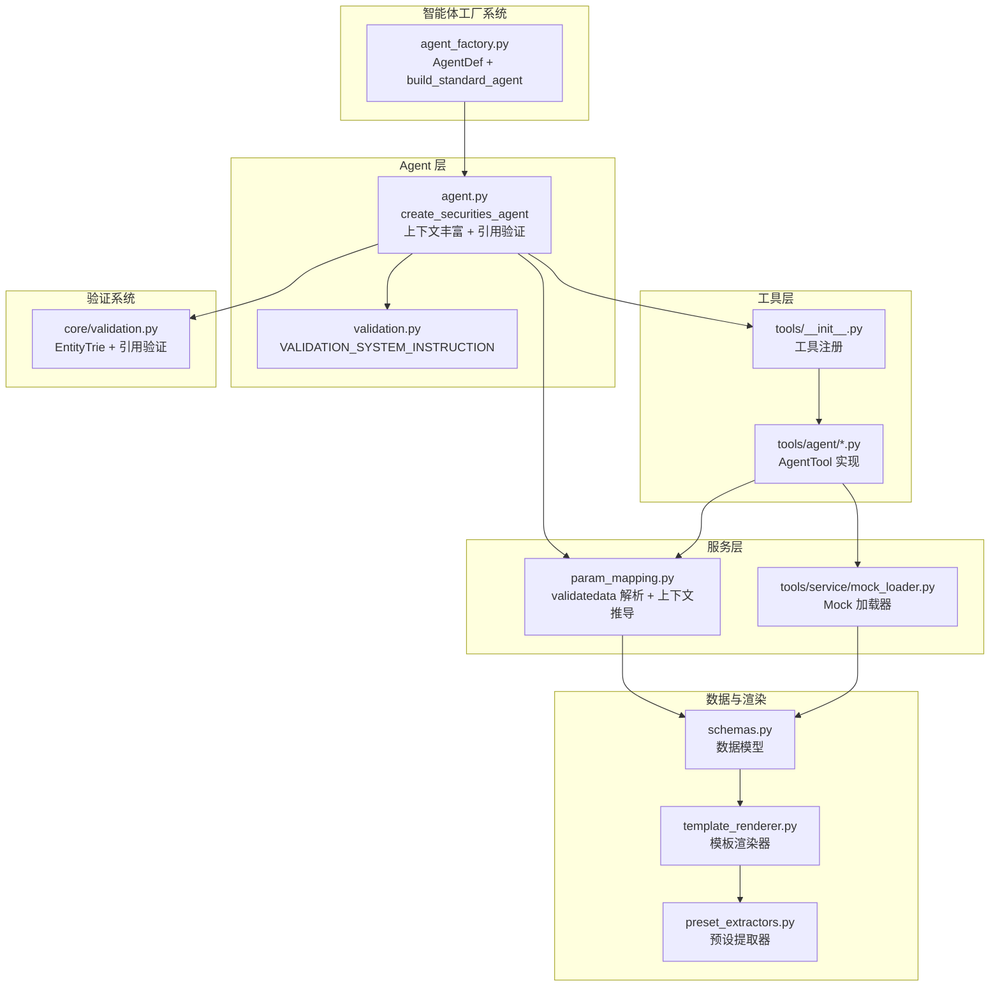
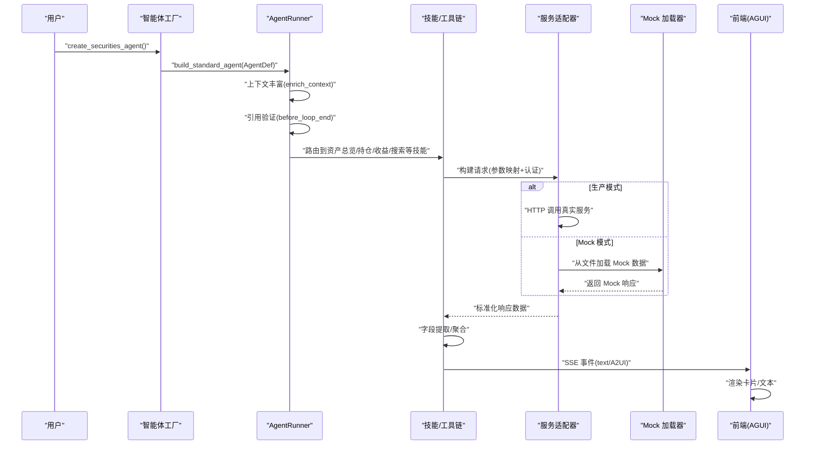
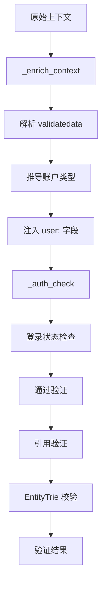
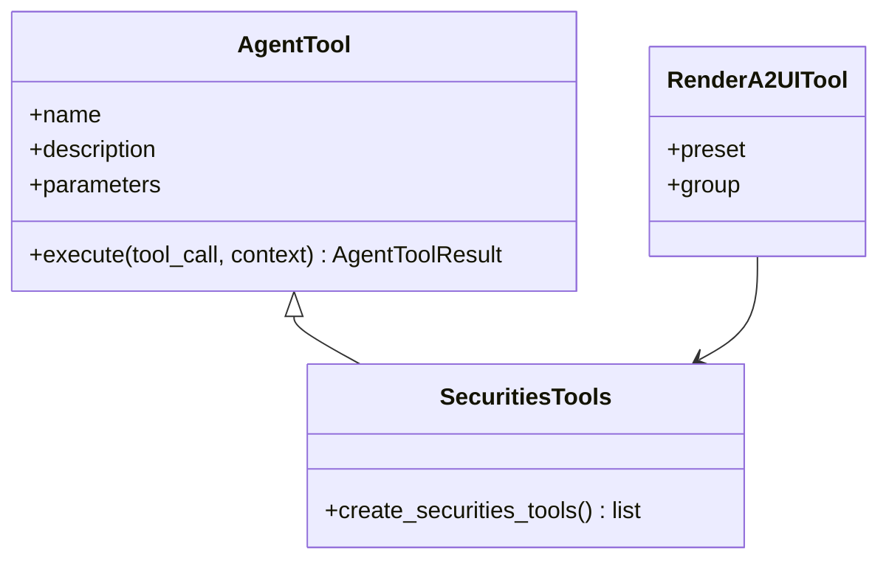
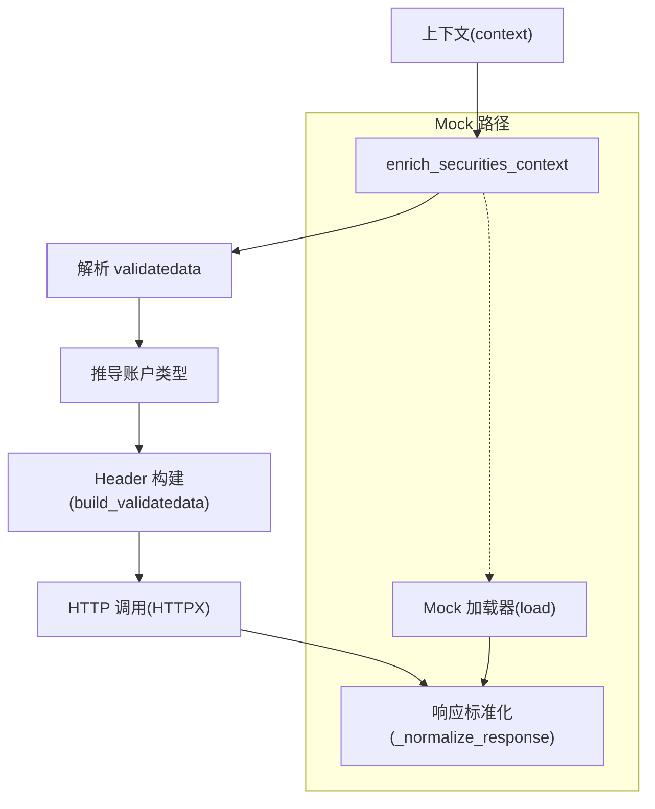
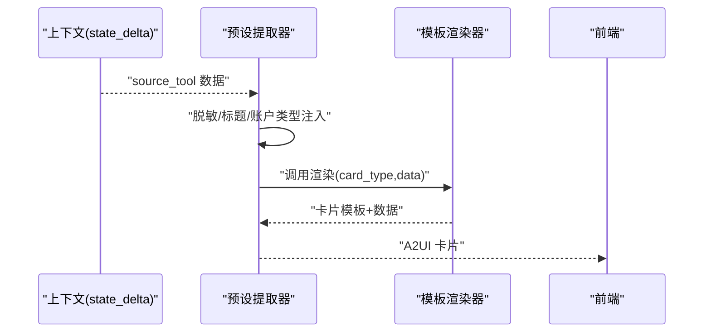
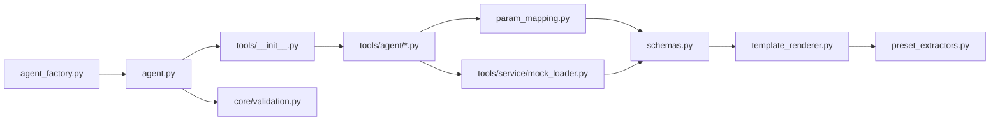

# 证券智能体

<cite>
**本文引用的文件**
- [agent_factory.py](file://src/ark_agentic/core/agent_factory.py)
- [agent.py](file://src/ark_agentic/agents/securities/agent.py)
- [__init__.py](file://src/ark_agentic/agents/securities/__init__.py)
- [agent.json](file://src/ark_agentic/agents/securities/agent.json)
- [validation.py](file://src/ark_agentic/agents/securities/validation.py)
- [param_mapping.py](file://src/ark_agentic/agents/securities/tools/service/src/param_mapping.py)
- [preset_extractors.py](file://src/ark_agentic/agents/securities/a2ui/preset_extractors.py)
- [template_renderer.py](file://src/ark_agentic/agents/securities/template_renderer.py)
- [schemas.py](file://src/ark_agentic/agents/securities/schemas.py)
- [validation.py](file://src/ark_agentic/core/validation.py)
</cite>

## 更新摘要
**变更内容**
- 引入新的智能体工厂系统，实现标准化构建流程
- 增强引用验证机制，使用 EntityTrie 进行实体校验
- 优化上下文丰富功能，支持 validatedata 解析和账户类型推导
- 更新 AgentRunner 装配流程，采用约定优于配置的构建模式

## 目录
1. [简介](#简介)
2. [项目结构](#项目结构)
3. [核心组件](#核心组件)
4. [架构总览](#架构总览)
5. [详细组件分析](#详细组件分析)
6. [依赖关系分析](#依赖关系分析)
7. [性能考量](#性能考量)
8. [故障排查指南](#故障排查指南)
9. [结论](#结论)
10. [附录](#附录)

## 简介
本文档面向"证券智能体"的技术实现，围绕资产管理场景，系统阐述使用新智能体工厂系统进行标准化构建的实现方案，包括工具集设计、技能实现、增强的引用验证机制、数据验证机制、A2UI 卡片渲染、主动服务与验证机制，并给出开发最佳实践、扩展指南与调试技巧。重点覆盖资产查询、持仓分析、收益计算、股票搜索等核心能力，以及 Mock 数据服务集成与前端 AGUI 协议对接。

## 项目结构
证券智能体位于 agents/securities 目录，采用"智能体工厂 + 技能 + 工具 + 服务 + 渲染 + 主动服务"的分层组织：
- agent.py：使用智能体工厂系统创建 AgentRunner，包含上下文丰富和引用验证
- agent_factory.py：智能体工厂系统，提供标准化构建流程
- tools：Agent 可调用工具集合，封装服务适配器与参数映射
- tools/service：服务层（适配器、Mock 加载器、参数映射、字段提取）
- schemas.py：Pydantic 数据模型，统一 API 响应与渲染数据结构
- template_renderer.py：模板渲染器，将结构化数据渲染为 A2UI 卡片
- preset_extractors.py：A2UI 预设提取器，从上下文抽取并增强数据，调用渲染器
- validation.py：增强的引用验证系统，使用 EntityTrie 进行实体校验
- proactive_job.py：主动服务 Job，基于用户记忆识别关注意图并推送通知

**图表来源**
- [agent_factory.py:58-151](file://src/ark_agentic/core/agent_factory.py#L58-L151)
- [agent.py:72-100](file://src/ark_agentic/agents/securities/agent.py#L72-L100)
- [param_mapping.py:210-236](file://src/ark_agentic/agents/securities/tools/service/param_mapping.py#L210-L236)
- [validation.py:12-22](file://src/ark_agentic/agents/securities/validation.py#L12-L22)
- [core/validation.py:496-605](file://src/ark_agentic/core/validation.py#L496-L605)

**章节来源**
- [agent_factory.py:1-151](file://src/ark_agentic/core/agent_factory.py#L1-L151)
- [agent.py:1-100](file://src/ark_agentic/agents/securities/agent.py#L1-L100)

## 核心组件
- 智能体工厂系统：AgentDef 定义 + build_standard_agent 标准化构建，提供约定优于配置的 AgentRunner 创建流程
- 增强的 AgentRunner 装配：创建 LLM、会话管理、记忆管理、工具注册、技能加载、回调钩子、主动服务 Job
- 上下文丰富系统：validatedata 解析、账户类型推导、参数映射、登录状态校验
- 引用验证系统：EntityTrie 实体索引 + create_citation_validation_hook 后置验证
- 工具集：账户总览、现金资产、ETF/港股通/基金持仓、标的详情、分支信息、收益历史、收益排行、每日收益、股票搜索、卡片渲染等
- 服务层：适配器基类、Mock 加载器、参数映射、字段提取、认证（validatedata + signature）
- 数据模型：账户总资产、ETF/HKSC/基金/现金/标的详情等标准化结构
- 渲染层：模板渲染器与 A2UI 预设提取器，输出前端可渲染卡片
- 主动服务：基于用户记忆的意图识别与主动推送

**章节来源**
- [agent_factory.py:34-151](file://src/ark_agentic/core/agent_factory.py#L34-L151)
- [agent.py:49-100](file://src/ark_agentic/agents/securities/agent.py#L49-L100)
- [param_mapping.py:210-236](file://src/ark_agentic/agents/securities/tools/service/param_mapping.py#L210-L236)
- [core/validation.py:496-605](file://src/ark_agentic/core/validation.py#L496-L605)

## 架构总览
下图展示使用智能体工厂系统构建的证券智能体完整数据流，涵盖智能体定义、上下文丰富、引用验证、参数映射、认证、服务调用、字段提取、模板渲染与 SSE 推送。

**图表来源**
- [agent_factory.py:58-151](file://src/ark_agentic/core/agent_factory.py#L58-L151)
- [agent.py:72-100](file://src/ark_agentic/agents/securities/agent.py#L72-L100)
- [param_mapping.py:210-236](file://src/ark_agentic/agents/securities/tools/service/param_mapping.py#L210-L236)
- [core/validation.py:522-605](file://src/ark_agentic/core/validation.py#L522-L605)

## 详细组件分析

### 智能体工厂系统与标准化构建
- AgentDef：声明式智能体定义，包含 agent_id、agent_name、agent_description 等必需标识，以及可选的系统协议和自定义指令
- build_standard_agent：标准化构建函数，应用约定派生默认配置，包括会话目录、内存目录、技能配置、压缩配置等
- 约定优于配置：自动派生 sessions_dir、memory_dir，设置默认的 context_window=128000、preserve_recent=4

**图表来源**
- [agent_factory.py:34-151](file://src/ark_agentic/core/agent_factory.py#L34-L151)
- [agent.py:72-100](file://src/ark_agentic/agents/securities/agent.py#L72-L100)

**章节来源**
- [agent_factory.py:34-151](file://src/ark_agentic/core/agent_factory.py#L34-L151)
- [agent.py:41-46](file://src/ark_agentic/agents/securities/agent.py#L41-L46)

### 增强的上下文丰富与引用验证
- 上下文丰富：_enrich_context 回调函数解析 validatedata 字符串，推导账户类型，注入 user: 前缀字段
- 登录状态校验：_auth_check 回调函数检查 loginflag，必要时返回 UI 组件进行登录
- 引用验证：使用 EntityTrie 加载股票代码 CSV，create_citation_validation_hook 在 before_loop_end 执行后置验证
- 系统指令：VALIDATION_SYSTEM_INSTRUCTION 约束回答仅基于工具与上下文

**图表来源**
- [agent.py:49-70](file://src/ark_agentic/agents/securities/agent.py#L49-L70)
- [param_mapping.py:210-236](file://src/ark_agentic/agents/securities/tools/service/param_mapping.py#L210-L236)
- [validation.py:12-22](file://src/ark_agentic/agents/securities/validation.py#L12-L22)
- [core/validation.py:496-605](file://src/ark_agentic/core/validation.py#L496-L605)

**章节来源**
- [agent.py:49-100](file://src/ark_agentic/agents/securities/agent.py#L49-L100)
- [param_mapping.py:210-236](file://src/ark_agentic/agents/securities/tools/service/param_mapping.py#L210-L236)
- [validation.py:12-22](file://src/ark_agentic/agents/securities/validation.py#L12-L22)

### 工具集设计与技能实现
- 工具注册：统一在 tools/__init__.py 中创建并注册，包含 RenderA2UITool 预设
- AgentTool：每个工具封装参数读取、上下文优先级、错误处理与状态增量
- 技能：按意图划分（资产总览、持仓分析、收益查询），定义工具调用顺序与输出策略
- A2UI 渲染：RenderA2UITool 使用 SECURITIES_PRESETS 预设组进行卡片渲染

**图表来源**
- [agent.py:72-100](file://src/ark_agentic/agents/securities/agent.py#L72-L100)
- [tools/__init__.py:48-66](file://src/ark_agentic/agents/securities/tools/__init__.py#L48-L66)

**章节来源**
- [tools/__init__.py:48-66](file://src/ark_agentic/agents/securities/tools/__init__.py#L48-L66)
- [agent.py:72-100](file://src/ark_agentic/agents/securities/agent.py#L72-L100)

### 服务层与 Mock 集成
- 参数映射：enrich_securities_context 解析 validatedata，推导账户类型，支持 user: 前缀兼容
- 认证：validatedata + signature，支持从上下文构建 Header
- Mock 加载器：按服务名与场景（普通/两融）加载 JSON 文件，支持按参数选择文件
- 参数映射：将扁平上下文映射为 API 请求体与 Header

**图表来源**
- [param_mapping.py:210-236](file://src/ark_agentic/agents/securities/tools/service/param_mapping.py#L210-L236)
- [param_mapping.py:256-303](file://src/ark_agentic/agents/securities/tools/service/param_mapping.py#L256-L303)

**章节来源**
- [param_mapping.py:210-236](file://src/ark_agentic/agents/securities/tools/service/param_mapping.py#L210-L236)
- [param_mapping.py:256-303](file://src/ark_agentic/agents/securities/tools/service/param_mapping.py#L256-L303)

### 数据模型与字段提取
- 使用 Pydantic 定义标准化数据结构，支持别名映射、类型校验与字段提取
- 账户总资产、ETF/HKSC/基金/现金/标的详情等模型，确保前后端一致性
- 字段提取：支持从 API 响应提取标准化数据，转换为内部模型

**章节来源**
- [schemas.py:29-465](file://src/ark_agentic/agents/securities/schemas.py#L29-L465)

### A2UI 卡片渲染与预设提取器
- 预设提取器：从上下文读取上游工具结果，脱敏账号、注入标题与账户类型，调用模板渲染器
- 模板渲染器：将结构化数据渲染为前端可识别的卡片模板与数据
- 预设注册：SECURITIES_PRESETS 注册各种卡片类型的提取器

**图表来源**
- [preset_extractors.py:116-151](file://src/ark_agentic/agents/securities/a2ui/preset_extractors.py#L116-L151)
- [template_renderer.py:16-200](file://src/ark_agentic/agents/securities/template_renderer.py#L16-L200)

**章节来源**
- [preset_extractors.py:208-222](file://src/ark_agentic/agents/securities/a2ui/preset_extractors.py#L208-L222)
- [template_renderer.py:12-200](file://src/ark_agentic/agents/securities/template_renderer.py#L12-L200)

### 主动服务与意图识别
- 关键词快速过滤：股票、股价、涨到、跌到、目标价、关注、持仓、基金、净值、提醒等
- LLM 意图提取：从用户记忆中识别持续关注意图（如价格提醒、持仓跟踪）
- 数据获取：调用 security_info_search 获取实时行情，格式化为可读摘要

**章节来源**
- [agent.py:72-100](file://src/ark_agentic/agents/securities/agent.py#L72-L100)

### 资产查询与收益计算
- 资产查询：account_overview 工具通过适配器获取账户总资产、现金、股票市值、今日收益等
- 收益计算：收益历史、收益排行、每日收益等工具提供周期性收益曲线与排行统计
- 数据一致性：通过字段提取与模板渲染保证前端展示字段一致

**章节来源**
- [agent.py:72-100](file://src/ark_agentic/agents/securities/agent.py#L72-L100)
- [template_renderer.py:16-200](file://src/ark_agentic/agents/securities/template_renderer.py#L16-L200)

### 持仓分析与股票搜索
- 持仓分析：ETF/HKSC/基金持仓列表与汇总，支持两融账户特有字段
- 股票搜索：支持精确代码、名称、拼音与模糊匹配，返回候选列表供确认

**章节来源**
- [preset_extractors.py:92-151](file://src/ark_agentic/agents/securities/a2ui/preset_extractors.py#L92-L151)
- [agent.py:72-100](file://src/ark_agentic/agents/securities/agent.py#L72-L100)

## 依赖关系分析
- 组件耦合：智能体工厂系统提供标准化构建，AgentRunner 依赖工具注册表、技能加载器、会话与记忆管理；工具依赖服务适配器与 Mock 加载器；渲染依赖数据模型
- 外部依赖：HTTPX（异步 HTTP 客户端）、Pydantic（数据模型）、前端 AGUI 协议（SSE 事件）
- 引用验证：EntityTrie 实体索引、create_citation_validation_hook 后置验证

**图表来源**
- [agent_factory.py:58-151](file://src/ark_agentic/core/agent_factory.py#L58-L151)
- [agent.py:72-100](file://src/ark_agentic/agents/securities/agent.py#L72-L100)
- [param_mapping.py:210-236](file://src/ark_agentic/agents/securities/tools/service/param_mapping.py#L210-L236)
- [core/validation.py:496-605](file://src/ark_agentic/core/validation.py#L496-L605)

**章节来源**
- [agent_factory.py:58-151](file://src/ark_agentic/core/agent_factory.py#L58-L151)
- [agent.py:72-100](file://src/ark_agentic/agents/securities/agent.py#L72-L100)

## 性能考量
- 智能体工厂：标准化构建减少配置复杂度，提高部署效率
- 上下文压缩与会话管理：通过会话管理器与总结器降低上下文长度，提升响应效率
- 并发与超时：服务适配器使用异步 HTTP 客户端，合理设置超时与连接超时
- Mock 模式：开发/测试阶段使用文件驱动的 Mock 数据，减少对外部服务依赖
- 引用验证：EntityTrie 实体索引优化实体匹配性能
- 主动服务：关键词快速过滤与 LLM 意图提取分离，降低无效调用成本

## 故障排查指南
- 智能体构建失败：检查 AgentDef 配置，确认 agent_id、agent_name、agent_description 是否正确
- 上下文丰富失败：验证 validatedata 格式，检查 loginflag 推导逻辑
- 引用验证失败：确认 EntityTrie 加载的股票代码 CSV 是否正确，检查验证阈值设置
- 认证失败：检查上下文中 validatedata 与 signature 是否齐全，或切换 Mock 模式
- 工具不可用：确认工具注册与技能加载是否成功，查看 AgentRunner 回调链
- 数据为空：检查 Mock 文件是否存在或服务返回状态码，核对参数映射
- 前端无卡片：确认 SSE 事件类型为 A2UI，模板名称与数据结构一致

**章节来源**
- [agent_factory.py:58-151](file://src/ark_agentic/core/agent_factory.py#L58-L151)
- [agent.py:49-70](file://src/ark_agentic/agents/securities/agent.py#L49-L70)
- [core/validation.py:496-605](file://src/ark_agentic/core/validation.py#L496-L605)

## 结论
本证券智能体通过引入智能体工厂系统实现标准化构建，结合增强的引用验证机制和上下文丰富功能，实现了从资产查询、持仓分析到收益计算与股票搜索的完整能力闭环。新的架构提供了更好的可维护性和扩展性，借助 A2UI 卡片渲染与主动服务，提升了用户体验与运营效率。建议在生产环境中完善监控与告警，持续优化意图识别与数据模型，以适应更复杂的业务场景。

## 附录
- 开发与调试要点
  - 使用智能体工厂系统快速创建标准化 AgentRunner
  - 通过 VALIDATION_SYSTEM_INSTRUCTION 约束回答范围，确保准确性
  - 利用 EntityTrie 进行实体校验，提高输出可信度
  - 使用 Mock 模式快速迭代，确保工具与渲染链路稳定
  - 通过技能定义明确工具调用顺序与输出策略
  - 在 AgentRunner 中注入回调钩子，统一处理上下文增强与鉴权
  - 前端对接 AGUI 协议，确保事件类型与数据结构一致

**章节来源**
- [agent_factory.py:58-151](file://src/ark_agentic/core/agent_factory.py#L58-L151)
- [agent.py:72-100](file://src/ark_agentic/agents/securities/agent.py#L72-L100)
- [validation.py:12-22](file://src/ark_agentic/agents/securities/validation.py#L12-L22)