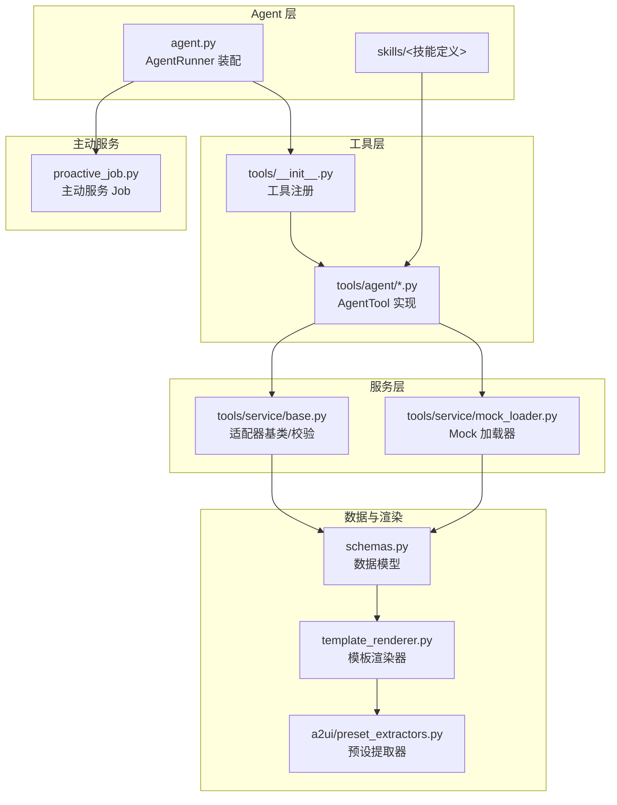
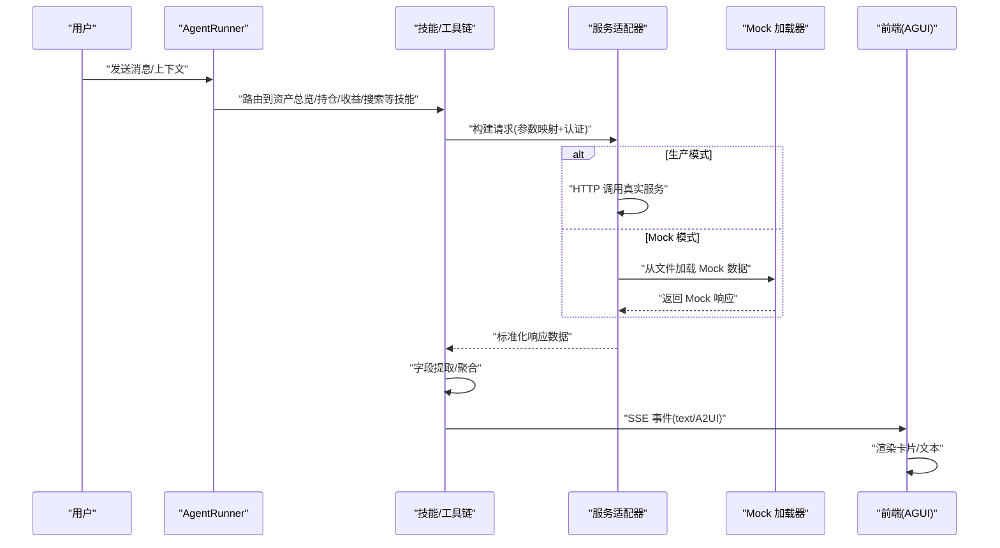
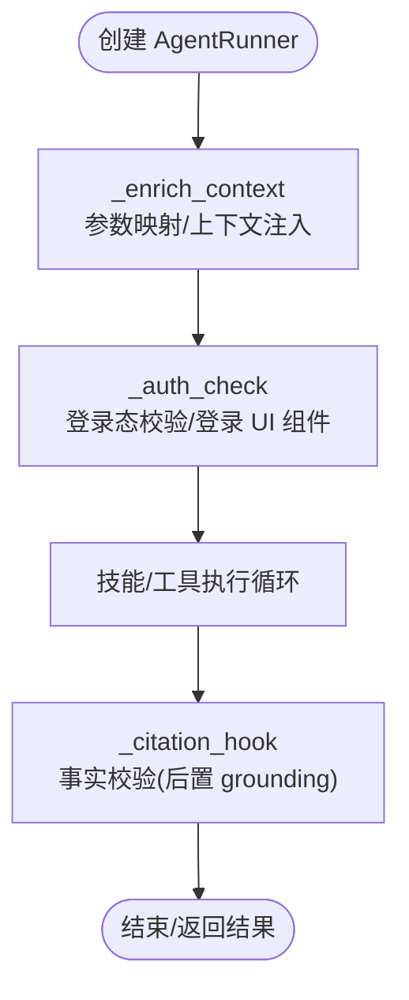
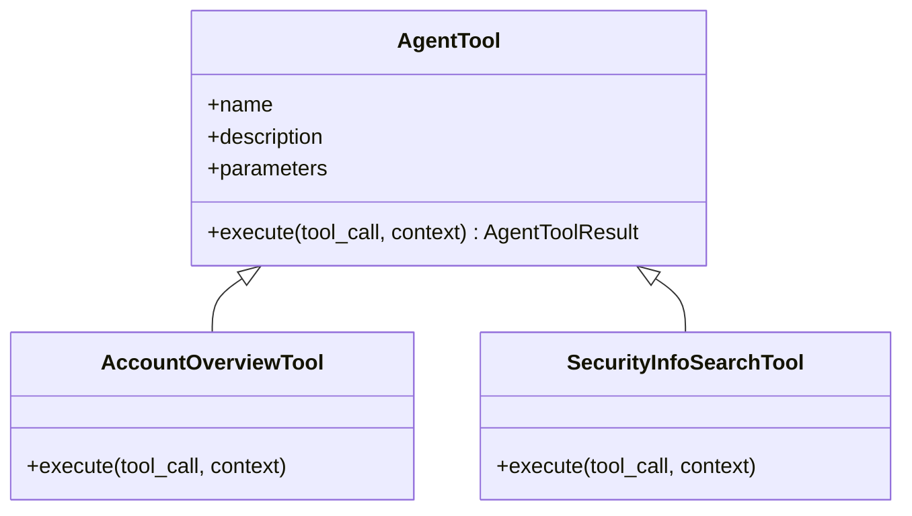
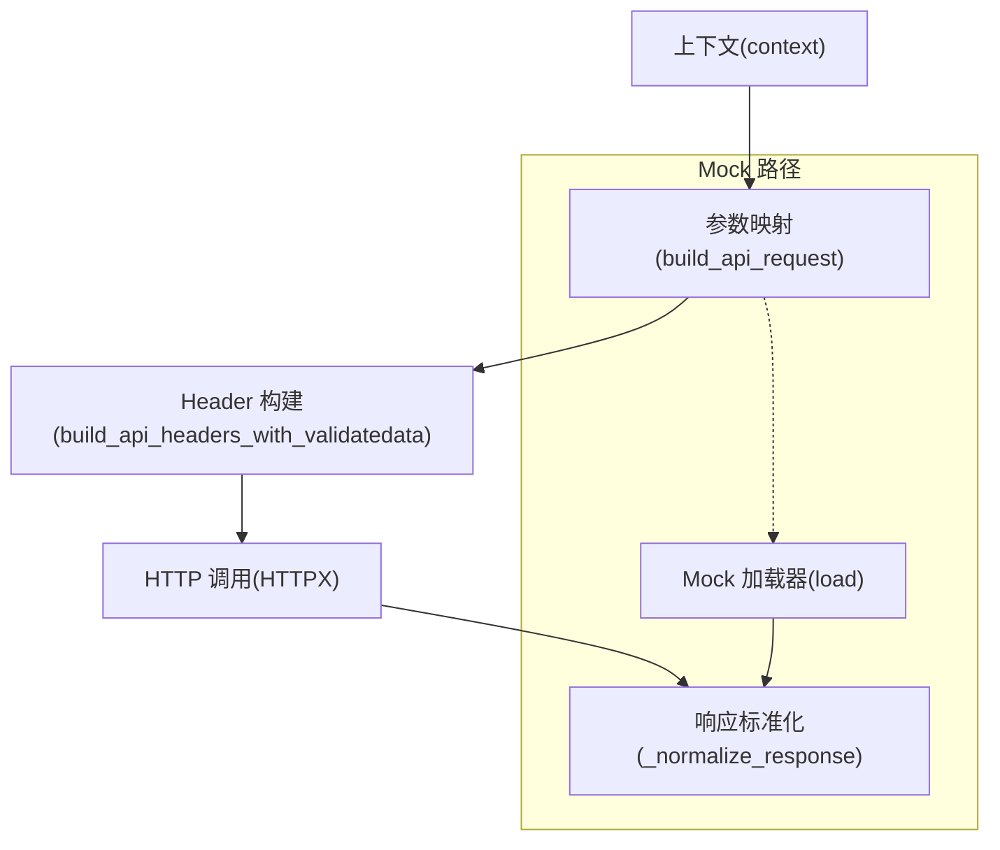
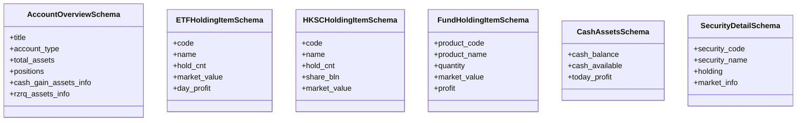
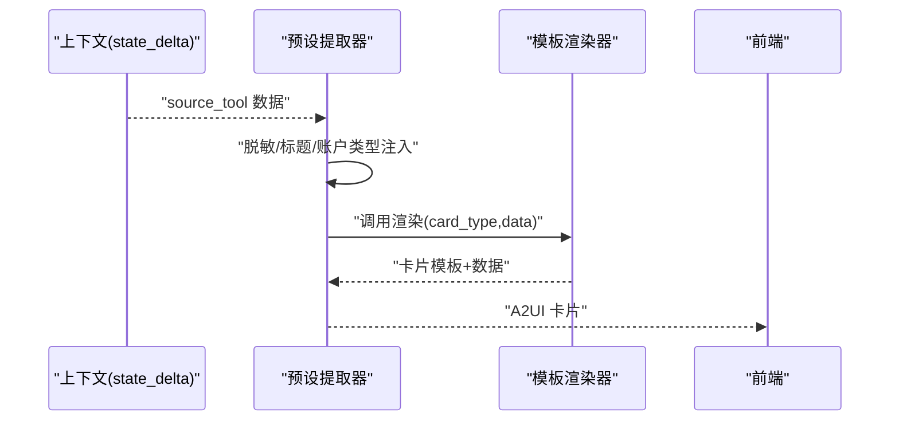
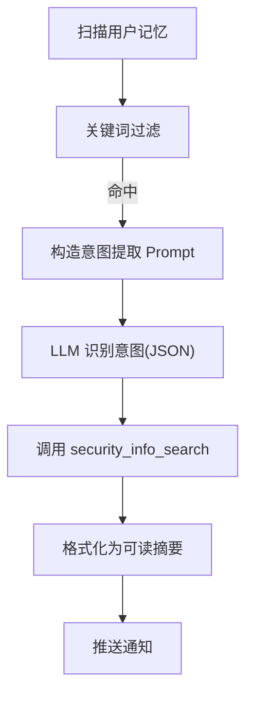
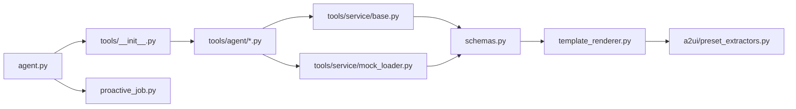

# 证券智能体

<cite>
**本文引用的文件**
- [agent.py](file://src/ark_agentic/agents/securities/agent.py)
- [__init__.py](file://src/ark_agentic/agents/securities/__init__.py)
- [agent.json](file://src/ark_agentic/agents/securities/agent.json)
- [README.md](file://src/ark_agentic/agents/securities/README.md)
- [schemas.py](file://src/ark_agentic/agents/securities/schemas.py)
- [tools/__init__.py](file://src/ark_agentic/agents/securities/tools/__init__.py)
- [tools/service/base.py](file://src/ark_agentic/agents/securities/tools/service/base.py)
- [tools/service/mock_loader.py](file://src/ark_agentic/agents/securities/tools/service/mock_loader.py)
- [validation.py](file://src/ark_agentic/agents/securities/validation.py)
- [template_renderer.py](file://src/ark_agentic/agents/securities/template_renderer.py)
- [tools/agent/account_overview.py](file://src/ark_agentic/agents/securities/tools/agent/account_overview.py)
- [tools/agent/security_info_search.py](file://src/ark_agentic/agents/securities/tools/agent/security_info_search.py)
- [proactive_job.py](file://src/ark_agentic/agents/securities/proactive_job.py)
- [a2ui/preset_extractors.py](file://src/ark_agentic/agents/securities/a2ui/preset_extractors.py)
- [skills/asset_overview/SKILL.md](file://src/ark_agentic/agents/securities/skills/asset_overview/SKILL.md)
</cite>

## 目录
1. [简介](#简介)
2. [项目结构](#项目结构)
3. [核心组件](#核心组件)
4. [架构总览](#架构总览)
5. [详细组件分析](#详细组件分析)
6. [依赖关系分析](#依赖关系分析)
7. [性能考量](#性能考量)
8. [故障排查指南](#故障排查指南)
9. [结论](#结论)
10. [附录](#附录)

## 简介
本文件面向“证券智能体”的技术实现，围绕资产管理场景，系统阐述工具集设计、技能实现、数据验证机制、A2UI 卡片渲染、主动服务与验证机制，并给出开发最佳实践、扩展指南与调试技巧。重点覆盖资产查询、持仓分析、收益计算、股票搜索等核心能力，以及 Mock 数据服务集成与前端 AGUI 协议对接。

## 项目结构
证券智能体位于 agents/securities 目录，采用“技能 + 工具 + 服务 + 渲染 + 主动服务”的分层组织：
- agent.py：Agent 构建与运行器装配，回调钩子、记忆与会话管理、主动服务 Job 注册
- tools：Agent 可调用工具集合，封装服务适配器与参数映射
- tools/service：服务层（适配器、Mock 加载器、参数映射、字段提取）
- schemas.py：Pydantic 数据模型，统一 API 响应与渲染数据结构
- template_renderer.py：模板渲染器，将结构化数据渲染为 A2UI 卡片
- a2ui/preset_extractors.py：A2UI 预设提取器，从上下文抽取并增强数据，调用渲染器
- skills：技能定义，指导工具调用顺序与输出策略
- proactive_job.py：主动服务 Job，基于用户记忆识别关注意图并推送通知
- validation.py：系统提示注入的校验约束，配合框架做事实校验

图表来源
- [agent.py:1-173](file://src/ark_agentic/agents/securities/agent.py#L1-L173)
- [tools/__init__.py:1-66](file://src/ark_agentic/agents/securities/tools/__init__.py#L1-L66)
- [tools/service/base.py:1-212](file://src/ark_agentic/agents/securities/tools/service/base.py#L1-L212)
- [tools/service/mock_loader.py:1-178](file://src/ark_agentic/agents/securities/tools/service/mock_loader.py#L1-L178)
- [schemas.py:1-465](file://src/ark_agentic/agents/securities/schemas.py#L1-L465)
- [template_renderer.py:1-374](file://src/ark_agentic/agents/securities/template_renderer.py#L1-L374)
- [a2ui/preset_extractors.py:1-222](file://src/ark_agentic/agents/securities/a2ui/preset_extractors.py#L1-L222)
- [proactive_job.py:1-145](file://src/ark_agentic/agents/securities/proactive_job.py#L1-L145)

章节来源
- [README.md:574-636](file://src/ark_agentic/agents/securities/README.md#L574-L636)

## 核心组件
- AgentRunner 装配：创建 LLM、会话管理、记忆管理、工具注册、技能加载、回调钩子、主动服务 Job
- 工具集：账户总览、现金资产、ETF/港股通/基金持仓、标的详情、分支信息、收益历史、收益排行、每日收益、股票搜索、卡片渲染等
- 服务层：适配器基类、Mock 加载器、参数映射、字段提取、认证（validatedata + signature）
- 数据模型：账户总资产、ETF/HKSC/基金/现金/标的详情等标准化结构
- 渲染层：模板渲染器与 A2UI 预设提取器，输出前端可渲染卡片
- 主动服务：基于用户记忆的意图识别与主动推送
- 验证机制：系统提示注入的事实校验约束，结合框架后置 grounding

章节来源
- [agent.py:37-173](file://src/ark_agentic/agents/securities/agent.py#L37-L173)
- [tools/__init__.py:48-66](file://src/ark_agentic/agents/securities/tools/__init__.py#L48-L66)
- [schemas.py:29-465](file://src/ark_agentic/agents/securities/schemas.py#L29-L465)
- [template_renderer.py:12-374](file://src/ark_agentic/agents/securities/template_renderer.py#L12-L374)
- [a2ui/preset_extractors.py:208-222](file://src/ark_agentic/agents/securities/a2ui/preset_extractors.py#L208-L222)
- [proactive_job.py:54-145](file://src/ark_agentic/agents/securities/proactive_job.py#L54-L145)
- [validation.py:12-22](file://src/ark_agentic/agents/securities/validation.py#L12-L22)

## 架构总览
下图展示从用户消息到前端卡片渲染的完整数据流，涵盖参数映射、认证、服务调用、字段提取、模板渲染与 SSE 推送。

图表来源
- [README.md:734-772](file://src/ark_agentic/agents/securities/README.md#L734-L772)
- [tools/service/base.py:55-130](file://src/ark_agentic/agents/securities/tools/service/base.py#L55-L130)
- [tools/service/mock_loader.py:118-178](file://src/ark_agentic/agents/securities/tools/service/mock_loader.py#L118-L178)
- [template_renderer.py:16-374](file://src/ark_agentic/agents/securities/template_renderer.py#L16-L374)

## 详细组件分析

### AgentRunner 装配与回调
- LLM 初始化、会话与记忆管理、技能加载、工具注册、回调钩子（上下文增强、鉴权拦截、事实校验）
- 主动服务 Job（仅在启用记忆时创建），按 cron 定时扫描用户记忆并推送通知

图表来源
- [agent.py:118-147](file://src/ark_agentic/agents/securities/agent.py#L118-L147)
- [validation.py:12-22](file://src/ark_agentic/agents/securities/validation.py#L12-L22)

章节来源
- [agent.py:37-173](file://src/ark_agentic/agents/securities/agent.py#L37-L173)

### 工具集设计与技能实现
- 工具注册：统一在 tools/__init__.py 中创建并注册
- AgentTool：每个工具封装参数读取、上下文优先级、错误处理与状态增量
- 技能：按意图划分（资产总览、持仓分析、收益查询），定义工具调用顺序与输出策略

图表来源
- [tools/agent/account_overview.py:57-108](file://src/ark_agentic/agents/securities/tools/agent/account_overview.py#L57-L108)
- [tools/agent/security_info_search.py:19-79](file://src/ark_agentic/agents/securities/tools/agent/security_info_search.py#L19-L79)

章节来源
- [tools/__init__.py:48-66](file://src/ark_agentic/agents/securities/tools/__init__.py#L48-L66)
- [skills/asset_overview/SKILL.md:1-186](file://src/ark_agentic/agents/securities/skills/asset_overview/SKILL.md#L1-L186)

### 服务层与 Mock 集成
- 适配器基类：统一 HTTP 客户端、请求构建、响应标准化、错误处理
- 认证：validatedata + signature，支持从上下文构建 Header
- Mock 加载器：按服务名与场景（普通/两融）加载 JSON 文件，支持按参数选择文件
- 参数映射：将扁平上下文映射为 API 请求体与 Header

图表来源
- [tools/service/base.py:106-130](file://src/ark_agentic/agents/securities/tools/service/base.py#L106-L130)
- [tools/service/base.py:162-199](file://src/ark_agentic/agents/securities/tools/service/base.py#L162-L199)
- [tools/service/mock_loader.py:31-71](file://src/ark_agentic/agents/securities/tools/service/mock_loader.py#L31-L71)

章节来源
- [tools/service/base.py:14-212](file://src/ark_agentic/agents/securities/tools/service/base.py#L14-L212)
- [tools/service/mock_loader.py:17-178](file://src/ark_agentic/agents/securities/tools/service/mock_loader.py#L17-L178)

### 数据模型与字段提取
- 使用 Pydantic 定义标准化数据结构，支持别名映射、类型校验与字段提取
- 账户总资产、ETF/HKSC/基金/现金/标的详情等模型，确保前后端一致性

图表来源
- [schemas.py:29-465](file://src/ark_agentic/agents/securities/schemas.py#L29-L465)

章节来源
- [schemas.py:29-465](file://src/ark_agentic/agents/securities/schemas.py#L29-L465)

### A2UI 卡片渲染与预设提取器
- 预设提取器：从上下文读取上游工具结果，脱敏账号、注入标题与账户类型，调用模板渲染器
- 模板渲染器：将结构化数据渲染为前端可识别的卡片模板与数据

图表来源
- [a2ui/preset_extractors.py:47-150](file://src/ark_agentic/agents/securities/a2ui/preset_extractors.py#L47-L150)
- [template_renderer.py:16-374](file://src/ark_agentic/agents/securities/template_renderer.py#L16-L374)

章节来源
- [a2ui/preset_extractors.py:208-222](file://src/ark_agentic/agents/securities/a2ui/preset_extractors.py#L208-L222)
- [template_renderer.py:12-374](file://src/ark_agentic/agents/securities/template_renderer.py#L12-L374)

### 主动服务与意图识别
- 关键词快速过滤：股票、股价、涨到、跌到、目标价、关注、持仓、基金、净值、提醒等
- LLM 意图提取：从用户记忆中识别持续关注意图（如价格提醒、持仓跟踪）
- 数据获取：调用 security_info_search 获取实时行情，格式化为可读摘要

图表来源
- [proactive_job.py:66-104](file://src/ark_agentic/agents/securities/proactive_job.py#L66-L104)

章节来源
- [proactive_job.py:54-145](file://src/ark_agentic/agents/securities/proactive_job.py#L54-L145)

### 资产查询与收益计算
- 资产查询：account_overview 工具通过适配器获取账户总资产、现金、股票市值、今日收益等
- 收益计算：收益历史、收益排行、每日收益等工具提供周期性收益曲线与排行统计
- 数据一致性：通过字段提取与模板渲染保证前端展示字段一致

章节来源
- [tools/agent/account_overview.py:57-108](file://src/ark_agentic/agents/securities/tools/agent/account_overview.py#L57-L108)
- [template_renderer.py:227-330](file://src/ark_agentic/agents/securities/template_renderer.py#L227-L330)

### 持仓分析与股票搜索
- 持仓分析：ETF/HKSC/基金持仓列表与汇总，支持两融账户特有字段
- 股票搜索：支持精确代码、名称、拼音与模糊匹配，返回候选列表供确认

章节来源
- [template_renderer.py:73-141](file://src/ark_agentic/agents/securities/template_renderer.py#L73-L141)
- [tools/agent/security_info_search.py:19-79](file://src/ark_agentic/agents/securities/tools/agent/security_info_search.py#L19-L79)

## 依赖关系分析
- 组件耦合：AgentRunner 依赖工具注册表、技能加载器、会话与记忆管理；工具依赖服务适配器与 Mock 加载器；渲染依赖数据模型
- 外部依赖：HTTPX（异步 HTTP 客户端）、Pydantic（数据模型）、前端 AGUI 协议（SSE 事件）

图表来源
- [agent.py:73-76](file://src/ark_agentic/agents/securities/agent.py#L73-L76)
- [tools/__init__.py:48-66](file://src/ark_agentic/agents/securities/tools/__init__.py#L48-L66)
- [tools/service/base.py:38-130](file://src/ark_agentic/agents/securities/tools/service/base.py#L38-L130)
- [tools/service/mock_loader.py:110-178](file://src/ark_agentic/agents/securities/tools/service/mock_loader.py#L110-L178)
- [schemas.py:14-51](file://src/ark_agentic/agents/securities/schemas.py#L14-L51)
- [template_renderer.py:12-70](file://src/ark_agentic/agents/securities/template_renderer.py#L12-L70)
- [a2ui/preset_extractors.py:208-222](file://src/ark_agentic/agents/securities/a2ui/preset_extractors.py#L208-L222)
- [proactive_job.py:54-104](file://src/ark_agentic/agents/securities/proactive_job.py#L54-L104)

章节来源
- [agent.py:37-173](file://src/ark_agentic/agents/securities/agent.py#L37-L173)
- [tools/__init__.py:48-66](file://src/ark_agentic/agents/securities/tools/__init__.py#L48-L66)

## 性能考量
- 上下文压缩与会话管理：通过会话管理器与总结器降低上下文长度，提升响应效率
- 并发与超时：服务适配器使用异步 HTTP 客户端，合理设置超时与连接超时
- Mock 模式：开发/测试阶段使用文件驱动的 Mock 数据，减少对外部服务依赖
- 主动服务：关键词快速过滤与 LLM 意图提取分离，降低无效调用成本

## 故障排查指南
- 认证失败：检查上下文中 validatedata 与 signature 是否齐全，或切换 Mock 模式
- 工具不可用：确认工具注册与技能加载是否成功，查看 AgentRunner 回调链
- 数据为空：检查 Mock 文件是否存在或服务返回状态码，核对参数映射
- 前端无卡片：确认 SSE 事件类型为 A2UI，模板名称与数据结构一致

章节来源
- [tools/service/base.py:162-199](file://src/ark_agentic/agents/securities/tools/service/base.py#L162-L199)
- [tools/service/base.py:202-212](file://src/ark_agentic/agents/securities/tools/service/base.py#L202-L212)
- [tools/service/mock_loader.py:31-71](file://src/ark_agentic/agents/securities/tools/service/mock_loader.py#L31-L71)

## 结论
本证券智能体通过清晰的分层架构与严格的验证机制，实现了从资产查询、持仓分析到收益计算与股票搜索的完整能力闭环。借助 A2UI 卡片渲染与主动服务，提升了用户体验与运营效率。建议在生产环境中完善监控与告警，持续优化意图识别与数据模型，以适应更复杂的业务场景。

## 附录
- 开发与调试要点
  - 使用 Mock 模式快速迭代，确保工具与渲染链路稳定
  - 通过技能定义明确工具调用顺序与输出策略
  - 在 AgentRunner 中注入回调钩子，统一处理上下文增强与鉴权
  - 前端对接 AGUI 协议，确保事件类型与数据结构一致

章节来源
- [README.md:42-270](file://src/ark_agentic/agents/securities/README.md#L42-L270)
- [agent.py:118-147](file://src/ark_agentic/agents/securities/agent.py#L118-L147)