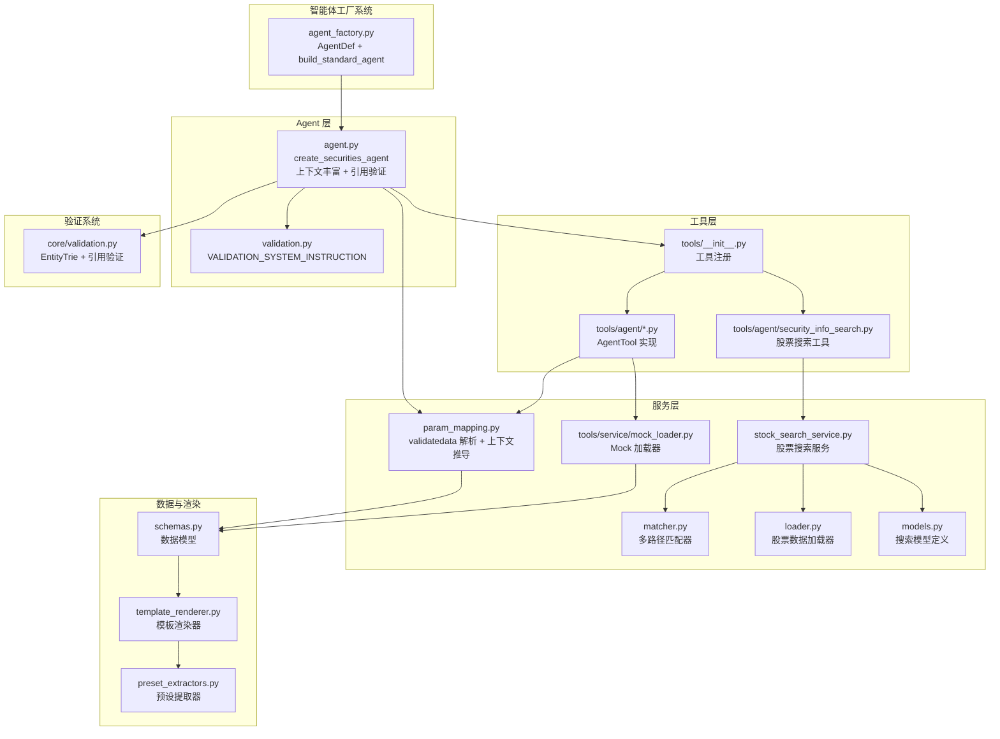
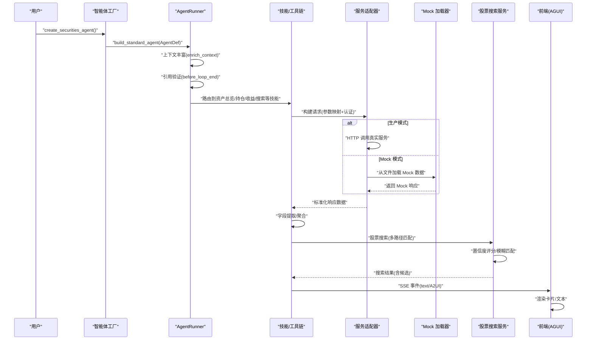
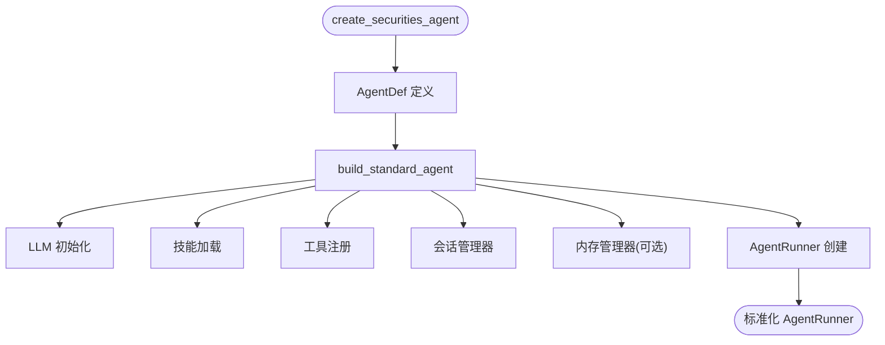
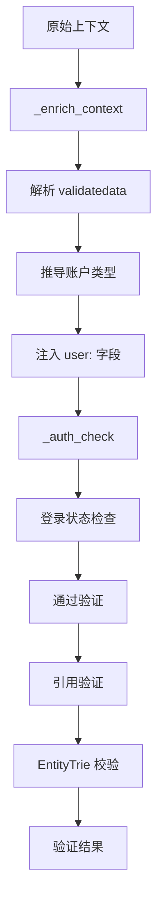
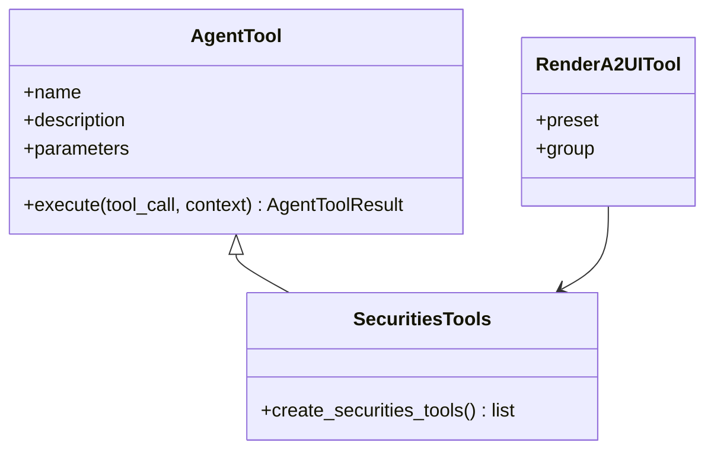
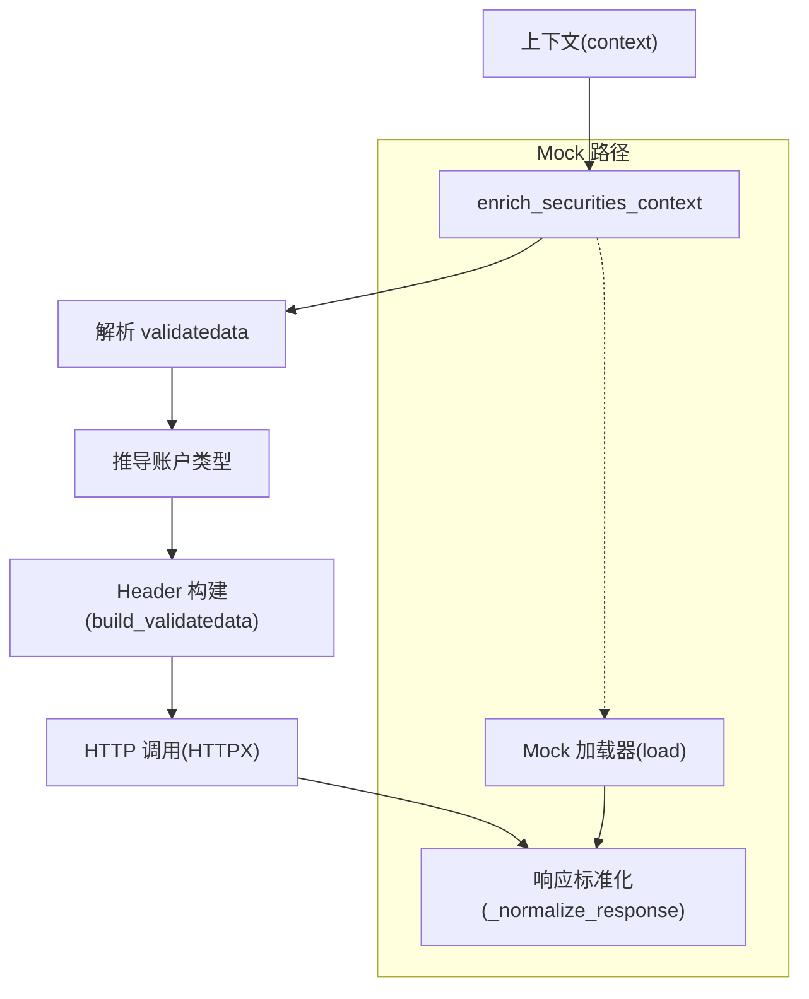
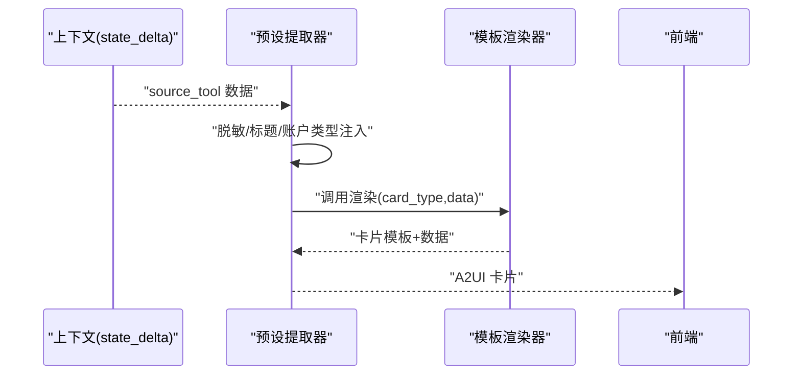
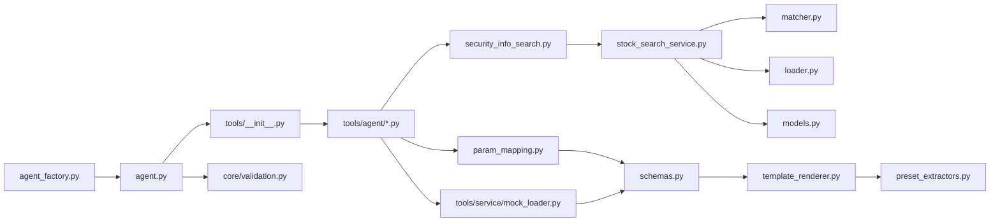

# 证券智能体

<cite>
**本文引用的文件**
- [README.md](file://src/ark_agentic/agents/securities/README.md)
- [stock_search_service.py](file://src/ark_agentic/agents/securities/tools/service/stock_search_service.py)
- [matcher.py](file://src/ark_agentic/agents/securities/tools/service/stock_search/matcher.py)
- [models.py](file://src/ark_agentic/agents/securities/tools/service/stock_search/models.py)
- [loader.py](file://src/ark_agentic/agents/securities/tools/service/stock_search/loader.py)
- [security_info_search.py](file://src/ark_agentic/agents/securities/tools/agent/security_info_search.py)
- [preset_extractors.py](file://src/ark_agentic/agents/securities/a2ui/preset_extractors.py)
- [a2ui-standard.md](file://docs/a2ui/a2ui-standard.md)
- [a2ui-modes-overview.md](file://docs/a2ui/a2ui-modes-overview.md)
- [ark-agentic-api.postman_collection.json](file://docs/postman/ark-agentic-api.postman_collection.json)
- [agent_factory.py](file://src/ark_agentic/core/agent_factory.py)
- [agent.py](file://src/ark_agentic/agents/securities/agent.py)
- [__init__.py](file://src/ark_agentic/agents/securities/__init__.py)
- [agent.json](file://src/ark_agentic/agents/securities/agent.json)
- [validation.py](file://src/ark_agentic/agents/securities/validation.py)
- [param_mapping.py](file://src/ark_agentic/agents/securities/tools/service/param_mapping.py)
- [template_renderer.py](file://src/ark_agentic/agents/securities/template_renderer.py)
- [schemas.py](file://src/ark_agentic/agents/securities/schemas.py)
- [validation.py](file://src/ark_agentic/core/validation.py)
</cite>

## 更新摘要
**变更内容**
- 增强了API接口文档，包含详细的HTTP端点规范和请求/响应示例
- 新增了SSE流协议文档，详细说明enterprise协议格式
- 完善了模板卡片文档，包含完整的卡片类型和字段说明
- 增强了股票信息搜索功能，包含多路径匹配算法和置信度评分系统
- 新增了Postman集合文件，提供完整的API测试用例
- 优化了A2UI双模式架构文档，明确preset和dynamic模式的区别

## 目录
1. [简介](#简介)
2. [项目结构](#项目结构)
3. [核心组件](#核心组件)
4. [架构总览](#架构总览)
5. [详细组件分析](#详细组件分析)
6. [API接口规范](#api接口规范)
7. [SSE流协议](#sse流协议)
8. [模板卡片系统](#模板卡片系统)
9. [股票搜索算法](#股票搜索算法)
10. [依赖关系分析](#依赖关系分析)
11. [性能考量](#性能考量)
12. [故障排查指南](#故障排查指南)
13. [结论](#结论)
14. [附录](#附录)

## 简介
本文档面向"证券智能体"的技术实现，围绕资产管理场景，系统阐述使用新智能体工厂系统进行标准化构建的实现方案，包括工具集设计、技能实现、增强的引用验证机制、数据验证机制、A2UI 卡片渲染、主动服务与验证机制，并给出开发最佳实践、扩展指南与调试技巧。重点覆盖资产查询、持仓分析、收益计算、股票搜索等核心能力，以及 Mock 数据服务集成与前端 AGUI 协议对接。

**更新** 新增了详细的API接口规范、SSE流协议文档、模板卡片系统说明、股票搜索算法实现和Postman测试集合。

## 项目结构
证券智能体位于 agents/securities 目录，采用"智能体工厂 + 技能 + 工具 + 服务 + 渲染 + 主动服务"的分层组织：
- agent.py：使用智能体工厂系统创建 AgentRunner，包含上下文丰富和引用验证
- agent_factory.py：智能体工厂系统，提供标准化构建流程
- tools：Agent 可调用工具集合，封装服务适配器与参数映射
- tools/service：服务层（适配器、Mock 加载器、参数映射、字段提取）
- schemas.py：Pydantic 数据模型，统一 API 响应与渲染数据结构
- template_renderer.py：模板渲染器，将结构化数据渲染为 A2UI 卡片
- preset_extractors.py：A2UI 预设提取器，从上下文抽取并增强数据，调用渲染器
- validation.py：增强的引用验证系统，使用 EntityTrie 进行实体校验
- proactive_job.py：主动服务 Job，基于用户记忆识别关注意图并推送通知
- stock_search：股票搜索模块，包含多路径匹配算法和置信度评分系统



**图表来源**
- [agent_factory.py:58-151](file://src/ark_agentic/core/agent_factory.py#L58-L151)
- [agent.py:72-100](file://src/ark_agentic/agents/securities/agent.py#L72-L100)
- [param_mapping.py:210-236](file://src/ark_agentic/agents/securities/tools/service/param_mapping.py#L210-L236)
- [validation.py:12-22](file://src/ark_agentic/agents/securities/validation.py#L12-L22)
- [core/validation.py:496-605](file://src/ark_agentic/core/validation.py#L496-L605)
- [stock_search_service.py:32-84](file://src/ark_agentic/agents/securities/tools/service/stock_search_service.py#L32-L84)
- [matcher.py:59-239](file://src/ark_agentic/agents/securities/tools/service/stock_search/matcher.py#L59-L239)
- [loader.py:74-138](file://src/ark_agentic/agents/securities/tools/service/stock_search/loader.py#L74-L138)

**章节来源**
- [agent_factory.py:1-151](file://src/ark_agentic/core/agent_factory.py#L1-L151)
- [agent.py:1-100](file://src/ark_agentic/agents/securities/agent.py#L1-L100)

## 核心组件
- 智能体工厂系统：AgentDef 定义 + build_standard_agent 标准化构建，提供约定优于配置的 AgentRunner 创建流程
- 增强的 AgentRunner 装配：创建 LLM、会话管理、记忆管理、工具注册、技能加载、回调钩子、主动服务 Job
- 上下文丰富系统：validatedata 解析、账户类型推导、参数映射、登录状态校验
- 引用验证系统：EntityTrie 实体索引 + create_citation_validation_hook 后置验证
- 工具集：账户总览、现金资产、ETF/港股通/基金持仓、标的详情、分支信息、收益历史、收益排行、每日收益、股票搜索、卡片渲染等
- 服务层：适配器基类、Mock 加载器、参数映射、字段提取、认证（validatedata + signature）
- 数据模型：账户总资产、ETF/HKSC/基金/现金/标的详情等标准化结构
- 渲染层：模板渲染器与 A2UI 预设提取器，输出前端可渲染卡片
- 主动服务：基于用户记忆的意图识别与主动推送
- 股票搜索系统：多路径匹配算法、置信度评分、模糊匹配支持

**更新** 新增了股票搜索系统的详细说明，包括多路径匹配算法和置信度评分系统。

**章节来源**
- [agent_factory.py:34-151](file://src/ark_agentic/core/agent_factory.py#L34-L151)
- [agent.py:49-100](file://src/ark_agentic/agents/securities/agent.py#L49-L100)
- [param_mapping.py:210-236](file://src/ark_agentic/agents/securities/tools/service/param_mapping.py#L210-L236)
- [core/validation.py:496-605](file://src/ark_agentic/core/validation.py#L496-L605)
- [stock_search_service.py:32-84](file://src/ark_agentic/agents/securities/tools/service/stock_search_service.py#L32-L84)

## 架构总览
下图展示使用智能体工厂系统构建的证券智能体完整数据流，涵盖智能体定义、上下文丰富、引用验证、参数映射、认证、服务调用、字段提取、模板渲染与 SSE 推送。



**图表来源**
- [agent_factory.py:58-151](file://src/ark_agentic/core/agent_factory.py#L58-L151)
- [agent.py:72-100](file://src/ark_agentic/agents/securities/agent.py#L72-L100)
- [param_mapping.py:210-236](file://src/ark_agentic/agents/securities/tools/service/param_mapping.py#L210-L236)
- [core/validation.py:522-605](file://src/ark_agentic/core/validation.py#L522-L605)
- [stock_search_service.py:43-84](file://src/ark_agentic/agents/securities/tools/service/stock_search_service.py#L43-L84)

## 详细组件分析

### 智能体工厂系统与标准化构建
- AgentDef：声明式智能体定义，包含 agent_id、agent_name、agent_description 等必需标识，以及可选的系统协议和自定义指令
- build_standard_agent：标准化构建函数，应用约定派生默认配置，包括会话目录、内存目录、技能配置、压缩配置等
- 约定优于配置：自动派生 sessions_dir、memory_dir，设置默认的 context_window=128000、preserve_recent=4



**图表来源**
- [agent_factory.py:34-151](file://src/ark_agentic/core/agent_factory.py#L34-L151)
- [agent.py:72-100](file://src/ark_agentic/agents/securities/agent.py#L72-L100)

**章节来源**
- [agent_factory.py:34-151](file://src/ark_agentic/core/agent_factory.py#L34-L151)
- [agent.py:41-46](file://src/ark_agentic/agents/securities/agent.py#L41-L46)

### 增强的上下文丰富与引用验证
- 上下文丰富：_enrich_context 回调函数解析 validatedata 字符串，推导账户类型，注入 user: 前缀字段
- 登录状态校验：_auth_check 回调函数检查 loginflag，必要时返回 UI 组件进行登录
- 引用验证：使用 EntityTrie 加载股票代码 CSV，create_citation_validation_hook 在 before_loop_end 执行后置验证
- 系统指令：VALIDATION_SYSTEM_INSTRUCTION 约束回答仅基于工具与上下文



**图表来源**
- [agent.py:49-70](file://src/ark_agentic/agents/securities/agent.py#L49-L70)
- [param_mapping.py:210-236](file://src/ark_agentic/agents/securities/tools/service/param_mapping.py#L210-L236)
- [validation.py:12-22](file://src/ark_agentic/agents/securities/validation.py#L12-L22)
- [core/validation.py:496-605](file://src/ark_agentic/core/validation.py#L496-L605)

**章节来源**
- [agent.py:49-100](file://src/ark_agentic/agents/securities/agent.py#L49-L100)
- [param_mapping.py:210-236](file://src/ark_agentic/agents/securities/tools/service/param_mapping.py#L210-L236)
- [validation.py:12-22](file://src/ark_agentic/agents/securities/validation.py#L12-L22)

### 工具集设计与技能实现
- 工具注册：统一在 tools/__init__.py 中创建并注册，包含 RenderA2UITool 预设
- AgentTool：每个工具封装参数读取、上下文优先级、错误处理与状态增量
- 技能：按意图划分（资产总览、持仓分析、收益查询），定义工具调用顺序与输出策略
- A2UI 渲染：RenderA2UITool 使用 SECURITIES_PRESETS 预设组进行卡片渲染



**图表来源**
- [agent.py:72-100](file://src/ark_agentic/agents/securities/agent.py#L72-L100)
- [tools/__init__.py:48-66](file://src/ark_agentic/agents/securities/tools/__init__.py#L48-L66)

**章节来源**
- [tools/__init__.py:48-66](file://src/ark_agentic/agents/securities/tools/__init__.py#L48-L66)
- [agent.py:72-100](file://src/ark_agentic/agents/securities/agent.py#L72-L100)

### 服务层与 Mock 集成
- 参数映射：enrich_securities_context 解析 validatedata，推导账户类型，支持 user: 前缀兼容
- 认证：validatedata + signature，支持从上下文构建 Header
- Mock 加载器：按服务名与场景（普通/两融）加载 JSON 文件，支持按参数选择文件
- 参数映射：将扁平上下文映射为 API 请求体与 Header



**图表来源**
- [param_mapping.py:210-236](file://src/ark_agentic/agents/securities/tools/service/param_mapping.py#L210-L236)
- [param_mapping.py:256-303](file://src/ark_agentic/agents/securities/tools/service/param_mapping.py#L256-L303)

**章节来源**
- [param_mapping.py:210-236](file://src/ark_agentic/agents/securities/tools/service/param_mapping.py#L210-L236)
- [param_mapping.py:256-303](file://src/ark_agentic/agents/securities/tools/service/param_mapping.py#L256-L303)

### 数据模型与字段提取
- 使用 Pydantic 定义标准化数据结构，支持别名映射、类型校验与字段提取
- 账户总资产、ETF/HKSC/基金/现金/标的详情等模型，确保前后端一致性
- 字段提取：支持从 API 响应提取标准化数据，转换为内部模型

**章节来源**
- [schemas.py:29-465](file://src/ark_agentic/agents/securities/schemas.py#L29-L465)

### A2UI 卡片渲染与预设提取器
- 预设提取器：从上下文读取上游工具结果，脱敏账号、注入标题与账户类型，调用模板渲染器
- 模板渲染器：将结构化数据渲染为前端可识别的卡片模板与数据
- 预设注册：SECURITIES_PRESETS 注册各种卡片类型的提取器



**图表来源**
- [preset_extractors.py:116-151](file://src/ark_agentic/agents/securities/a2ui/preset_extractors.py#L116-L151)
- [template_renderer.py:16-200](file://src/ark_agentic/agents/securities/template_renderer.py#L16-L200)

**章节来源**
- [preset_extractors.py:208-222](file://src/ark_agentic/agents/securities/a2ui/preset_extractors.py#L208-L222)
- [template_renderer.py:12-200](file://src/ark_agentic/agents/securities/template_renderer.py#L12-L200)

### 主动服务与意图识别
- 关键词快速过滤：股票、股价、涨到、跌到、目标价、关注、持仓、基金、净值、提醒等
- LLM 意图提取：从用户记忆中识别持续关注意图（如价格提醒、持仓跟踪）
- 数据获取：调用 security_info_search 获取实时行情，格式化为可读摘要

**章节来源**
- [agent.py:72-100](file://src/ark_agentic/agents/securities/agent.py#L72-L100)

### 资产查询与收益计算
- 资产查询：account_overview 工具通过适配器获取账户总资产、现金、股票市值、今日收益等
- 收益计算：收益历史、收益排行、每日收益等工具提供周期性收益曲线与排行统计
- 数据一致性：通过字段提取与模板渲染保证前端展示字段一致

**章节来源**
- [agent.py:72-100](file://src/ark_agentic/agents/securities/agent.py#L72-L100)
- [template_renderer.py:16-200](file://src/ark_agentic/agents/securities/template_renderer.py#L16-L200)

### 持仓分析与股票搜索
- 持仓分析：ETF/HKSC/基金持仓列表与汇总，支持两融账户特有字段
- 股票搜索：支持精确代码、名称、拼音与模糊匹配，返回候选列表供确认

**更新** 新增了详细的股票搜索算法实现，包括多路径匹配和置信度评分系统。

**章节来源**
- [preset_extractors.py:92-151](file://src/ark_agentic/agents/securities/a2ui/preset_extractors.py#L92-L151)
- [agent.py:72-100](file://src/ark_agentic/agents/securities/agent.py#L72-L100)
- [security_info_search.py:19-79](file://src/ark_agentic/agents/securities/tools/agent/security_info_search.py#L19-L79)

## API接口规范

### HTTP端点
证券智能体提供标准的REST API接口，支持同步和流式响应：

| 端点 | 方法 | 描述 |
|------|------|------|
| `/chat` | POST | 发送消息（支持流式/非流式） |
| `/sessions` | POST | 创建新会话 |
| `/sessions/{session_id}` | GET | 获取会话历史 |
| `/sessions/{session_id}` | DELETE | 删除会话 |
| `/sessions` | GET | 列出所有会话 |
| `/health` | GET | 健康检查 |

### Chat请求
**端点:** `POST /chat`

**请求体:**
```json
{
  "agent_id": "securities",
  "message": "查询我的账户总资产",
  "session_id": null,
  "stream": true,
  "protocol": "enterprise",
  "user_id": "U001",
  "context": {
    "user_id": "U001",
    "channel": "REST",
    "usercode": "150573383",
    "userid": "12977997",
    "account": "3310123",
    "branchno": "3310",
    "loginflag": "3",
    "mobileNo": "137123123",
    "signature": "xxx",
    "account_type": "normal"
  }
}
```

**请求字段说明:**

| 字段 | 类型 | 必填 | 描述 |
|------|------|------|------|
| `agent_id` | string | 是 | Agent ID，固定为 `"securities"` |
| `message` | string | 是 | 用户消息内容 |
| `session_id` | string | 否 | 会话 ID，为空则创建新会话 |
| `stream` | boolean | 否 | 是否启用 SSE 流式输出，默认 `false` |
| `user_id` | string | 否 | 用户 ID |
| `context` | object | 否 | 业务上下文数据 |

**Context 字段说明:**

| 字段 | 类型 | 必填 | 描述 |
|------|------|------|------|
| `user_id` | string | 否 | 用户 ID |
| `account_type` | string | 否 | 账户类型：`"normal"` 或 `"margin"`，默认 `"normal"` |

**validatedata 认证字段**（生产环境必需，Mock 模式可省略）：

| 字段 | 类型 | 必填 | 描述 |
|------|------|------|------|
| `channel` | string | 是* | 渠道类型（如 `REST`） |
| `usercode` | string | 是* | 用户代码 |
| `userid` | string | 是* | 用户 ID |
| `account` | string | 是* | 账户号 |
| `branchno` | string | 是* | 分支机构号 |
| `loginflag` | string | 是* | 登录标志 |
| `mobileNo` | string | 是* | 手机号 |
| `signature` | string | 是* | 签名字符串 |

> *所有 validatedata 和 signature 字段在生产环境必需，Mock 模式下可选。

### Chat响应（非流式）
```json
{
  "session_id": "550e8400-e29b-41d4-a716-446655440000",
  "response": "您的账户总资产为 1,000,000.00 元...",
  "tool_calls": [
    {"name": "account_overview", "arguments": {}},
    {"name": "display_card", "arguments": {"source_tool": "account_overview"}}
  ],
  "turns": 1,
  "usage": {
    "prompt_tokens": 150,
    "completion_tokens": 80
  }
}
```

**章节来源**
- [README.md:42-133](file://src/ark_agentic/agents/securities/README.md#L42-L133)

## SSE流协议

### enterprise协议格式
当 `stream: true` 时，响应为 `text/event-stream` 格式，使用 **enterprise 协议（AGUIEnvelope）**。

每条 SSE 消息格式：
```
event: <ag-ui-event-type>
data: <AGUIEnvelope JSON>
```

**AGUIEnvelope 顶层结构:**
```json
{
  "protocol": "AGUI",
  "id": 5,
  "event": "<ag-ui-event-type>",
  "source_bu_type": "",
  "app_type": "",
  "data": {
    "code": "success",
    "message_id": "msg_abc",
    "conversation_id": "550e8400-e29b-41d4-a716-446655440000",
    "timestamp": "2026-03-04 10:00:00.000000",
    "ui_protocol": "text | json | A2UI",
    "ui_data": "<内容，类型由 ui_protocol 决定>",
    "turn": 1
  }
}
```

**事件类型与 data 字段对应:**

| 事件类型 (`event`) | `ui_protocol` | `ui_data` 内容 | 描述 |
|---|---|---|---|
| `run_started` | `text` | 描述字符串 | Run 初始化 |
| `step_started` | `json` | `{"think": "步骤名", "think_status": 1}` | Agent 步骤开始 |
| `step_finished` | `json` | `{"think": "步骤名", "think_status": 0}` | Agent 步骤结束 |
| `tool_call_start` | `json` | `{"think": "正在调用 xxx", "think_status": 1}` | 工具调用开始 |
| `tool_call_result` | `json` | `{"think": "xxx 调用完成", "think_status": 0}` | 工具调用完成 |
| `text_message_content` | `text` | delta 字符串（打字机效果） | 文本片段，`data.turn` 标识 ReAct 轮次 |
| `text_message_content` | `A2UI` | 模板卡片对象（含 `template`） | JSON 卡片组件 |
| `run_finished` | `text` | 完整回答字符串 | Run 完成 |
| `run_error` | `text` | 错误信息字符串 | 运行失败 |

### 典型事件序列
#### run_started
```json
{
  "protocol": "AGUI", "id": 1, "event": "run_started",
  "data": {
    "conversation_id": "550e8400-e29b-41d4-a716-446655440000",
    "ui_protocol": "text",
    "ui_data": "收到您的消息，正在处理中…"
  }
}
```

#### step_started
```json
{
  "protocol": "AGUI", "id": 2, "event": "step_started",
  "data": {
    "conversation_id": "550e8400-e29b-41d4-a716-446655440000",
    "ui_protocol": "json",
    "ui_data": {"think": "调用工具 account_overview 查询账户总资产", "think_status": 1}
  }
}
```

#### text_message_content（文本 delta）
```json
{
  "protocol": "AGUI", "id": 5, "event": "text_message_content",
  "data": {
    "conversation_id": "550e8400-e29b-41d4-a716-446655440000",
    "ui_protocol": "text",
    "ui_data": "您的账户总资产为",
    "turn": 1
  }
}
```

#### text_message_content（A2UI 卡片）
前端收到 `ui_protocol == "A2UI"` 时，根据 `ui_data.template` 渲染对应的卡片组件。

```json
{
  "protocol": "AGUI", "id": 4, "event": "text_message_content",
  "data": {
    "conversation_id": "550e8400-e29b-41d4-a716-446655440000",
    "ui_protocol": "A2UI",
    "ui_data": {
      "template": "account_overview_card",
      "data": {
        "total_assets": "1000000.00",
        "cash_balance": "500000.00",
        "stock_market_value": "500000.00",
        "today_profit": "5000.00",
        "account_type": "normal"
      }
    }
  }
}
```

#### run_finished
```json
{
  "protocol": "AGUI", "id": 6, "event": "run_finished",
  "data": {
    "conversation_id": "550e8400-e29b-41d4-a716-446655440000",
    "ui_protocol": "text",
    "ui_data": "您的账户总资产为 1,000,000.00 元..."
  }
}
```

#### run_error
```json
{
  "protocol": "AGUI", "id": 3, "event": "run_error",
  "data": {
    "conversation_id": "550e8400-e29b-41d4-a716-446655440000",
    "ui_protocol": "text",
    "ui_data": "API returned error: Invalid token"
  }
}
```

**章节来源**
- [README.md:135-270](file://src/ark_agentic/agents/securities/README.md#L135-L270)

## 模板卡片系统

### 卡片类型与字段
前端收到 `response.ui.component` 事件后，根据 `template` 渲染对应的卡片组件。

#### account_overview_card（账户总览卡片）
```json
{
  "template": "account_overview_card",
  "data": {
    "total_assets": "1000000.00",
    "cash_balance": "500000.00",
    "stock_market_value": "400000.00",
    "fund_market_value": "100000.00",
    "today_profit": "5000.00",
    "today_return_rate": "0.0050",
    "account_type": "normal",
    "net_assets": null,
    "total_liabilities": null,
    "maintenance_margin_ratio": null
  }
}
```

**字段说明:**

| 字段 | 类型 | 描述 | 适用账户 |
|------|------|------|----------|
| `total_assets` | string | 总资产 | 全部 |
| `cash_balance` | string | 现金余额 | 全部 |
| `stock_market_value` | string | 股票市值 | 全部 |
| `fund_market_value` | string | 基金市值 | 普通账户 |
| `today_profit` | string | 今日收益 | 全部 |
| `today_return_rate` | string | 今日收益率 | 全部 |
| `account_type` | string | 账户类型：`normal` / `margin` | 全部 |
| `net_assets` | string | 净资产 | 两融账户 |
| `total_liabilities` | string | 总负债 | 两融账户 |
| `maintenance_margin_ratio` | string | 维持担保比例 | 两融账户 |

#### cash_assets_card（现金资产卡片）
```json
{
  "template": "cash_assets_card",
  "data": {
    "cash_balance": "500000.00",
    "cash_available": "450000.00",
    "draw_balance": "400000.00",
    "today_profit": "100.00",
    "accu_profit": "5000.00",
    "fund_name": "天天利",
    "fund_code": "001234",
    "frozen_funds_total": "50000.00",
    "frozen_funds_detail": [...],
    "in_transit_asset_total": "10000.00"
  }
}
```

**字段说明:**

| 字段 | 类型 | 描述 |
|------|------|------|
| `cash_balance` | string | 现金总额 |
| `cash_available` | string | 可用资金 |
| `draw_balance` | string | 可取资金 |
| `today_profit` | string | 今日收益 |
| `accu_profit` | string | 累计收益 |
| `fund_name` | string | 理财产品名称 |
| `fund_code` | string | 理财产品代码 |
| `frozen_funds_total` | string | 冻结资金总额 |
| `frozen_funds_detail` | array | 冻结资金明细 |
| `in_transit_asset_total` | string | 在途资产总额 |

#### holdings_list_card（持仓列表卡片）
用于 ETF、港股通、基金持仓列表。

```json
{
  "template": "holdings_list_card",
  "asset_class": "ETF",
  "data": {
    "holdings": [
      {
        "code": "510300",
        "name": "沪深300ETF",
        "hold_cnt": "1000",
        "market_value": "4500000.00",
        "day_profit": "5000.00",
        "day_profit_rate": "0.0011",
        "price": "4.500",
        "cost_price": "4.200",
        "hold_position_profit": "30000.00",
        "hold_position_profit_rate": "0.0667"
      }
    ],
    "summary": {
      "total_market_value": "4500000.00",
      "total_profit": "5000.00",
      "total_profit_rate": "0.0011",
      "total": 1
    }
  }
}
```

**asset_class 取值:**

| 值 | 描述 |
|----|------|
| `ETF` | ETF 持仓 |
| `HKSC` | 港股通持仓 |
| `Fund` | 基金持仓 |

**持仓项字段（holdings[]）:**

| 字段 | 类型 | 描述 |
|------|------|------|
| `code` | string | 证券代码 |
| `name` | string | 证券名称 |
| `hold_cnt` | string | 持仓数量 |
| `market_value` | string | 市值 |
| `day_profit` | string | 今日收益 |
| `day_profit_rate` | string | 今日收益率 |
| `price` | string | 当前价格 |
| `cost_price` | string | 成本价 |
| `hold_position_profit` | string | 持仓盈亏 |
| `hold_position_profit_rate` | string | 持仓盈亏率 |

**港股通特有字段:**

| 字段 | 类型 | 描述 |
|------|------|------|
| `share_bln` | string | 可用份额 |
| `position` | string | 持仓位置 |
| `secu_acc` | string | 证券账户 |

**汇总字段（summary）:**

| 字段 | 类型 | 描述 |
|------|------|------|
| `total_market_value` | string | 总市值 |
| `total_profit` | string | 今日总收益 |
| `total_profit_rate` | string | 今日收益率 |
| `total` | number | 持仓数量 |

**港股通特有汇总字段:**

| 字段 | 类型 | 描述 |
|------|------|------|
| `available_hksc_share` | string | 港股通可用额度 |
| `limit_hksc_share` | string | 港股通限额 |
| `total_hksc_share` | string | 港股通总额度 |
| `pre_frozen_asset` | string | 预冻结资产 |

#### security_detail_card（标的详情卡片）
```json
{
  "template": "security_detail_card",
  "data": {
    "security_code": "510300",
    "security_name": "沪深300ETF",
    "security_type": "ETF",
    "market": "SH",
    "holding": {
      "quantity": "1000",
      "available_quantity": "1000",
      "cost_price": "4.200",
      "current_price": "4.500",
      "market_value": "4500.00",
      "profit": "300.00",
      "profit_rate": "0.0714",
      "today_profit": "50.00",
      "today_profit_rate": "0.0111"
    },
    "market_info": {
      "open_price": "4.480",
      "high_price": "4.520",
      "low_price": "4.460",
      "volume": "12345678",
      "turnover": "55555555.00",
      "change_rate": "0.0111"
    }
  }
}
```

**章节来源**
- [README.md:273-462](file://src/ark_agentic/agents/securities/README.md#L273-L462)

## 股票搜索算法

### MultiPathMatcher 多路径匹配器
股票搜索采用三路匹配算法，结合精确匹配、模糊匹配和拼音匹配，提供高精度的股票查询能力。

**匹配流水线：**
- 路径 A：正则 r'^\d{6}$' → 精确代码查找 → score=1.0
- 路径 D：纯英文字母 → initials_map 精确首字母匹配（先于 B/C）
- 路径 B：rapidfuzz.WRatio → 名称模糊匹配
- 路径 C：pypinyin 转拼音 → 拼音相似度匹配（ASR 纠错核心）

**综合打分：** B/C 综合打分 = max(score_B, score_C)；D 命中则直接返回

**决策规则：**
- score >= 0.95 → confidence="exact"
- 0.80 <= score < 0.95 → confidence="high"
- 0.60 <= score < 0.80 → confidence="ambiguous"，返回 Top 3
- score < 0.60 → confidence="none"

### 算法实现细节

#### 精确代码匹配（路径 A）
```python
if _CODE_RE.match(query):
    entity = self._index.find_by_code(query)
    if entity:
        return StockSearchResult(
            matched=True,
            confidence="exact",
            score=1.0,
            stock=entity,
            raw_query=query,
            dividend_info=None
        )
```

#### 首字母缩写匹配（路径 D）
```python
if query.isascii() and query.isalpha():
    q = query.lower()
    initials_hits = self._index.find_by_initials(q)
    if len(initials_hits) == 1:
        return StockSearchResult(
            matched=True,
            confidence="exact",
            score=1.0,
            stock=initials_hits[0],
            raw_query=query,
            dividend_info=None
        )
    if len(initials_hits) > 1:
        # 返回候选列表
```

#### 模糊匹配（路径 B + C）
```python
# 路径 B：名称模糊匹配
name_results = _extract_top(query, self._index.all_names, _TOP_N * 2)

# 路径 C：拼音匹配
query_pinyin = query.lower() if query.isascii() else _to_pinyin(query)
query_initials = query.lower() if query.isascii() else _to_initials(query)
pinyin_results = _extract_top(query_pinyin, self._index.all_pinyins, _TOP_N * 2)

# 合并、去重、取综合最高分
score_map: dict[str, float] = {}
entity_map: dict[str, StockEntity] = {}
```

#### 置信度评分
```python
# ── 决策 ────────────────────────────────────────────────────
if best_score_100 >= _THRESHOLD_EXACT:
    return StockSearchResult(
        matched=True,
        confidence="exact",
        score=best_score,
        stock=best_entity,
        raw_query=query,
        dividend_info=None,
    )

if best_score_100 >= _THRESHOLD_HIGH:
    return StockSearchResult(
        matched=True,
        confidence="high",
        score=best_score,
        stock=best_entity,
        raw_query=query,
        dividend_info=None,
    )

if best_score_100 >= _THRESHOLD_AMBIGUOUS:
    candidates = [
        {
            "code": entity_map[code].code,
            "name": entity_map[code].name,
            "exchange": entity_map[code].exchange,
            "full_code": entity_map[code].full_code,
            "score": round(_score_to_01(s), 3),
        }
        for code, s in sorted_items[:_TOP_N]
    ]
    return StockSearchResult(
        matched=False,
        confidence="ambiguous",
        score=best_score,
        candidates=candidates,
        raw_query=query,
        stock=None,
        dividend_info=None
    )
```

### 数据模型
```python
class StockSearchResult(BaseModel):
    """股票搜索结果"""
    
    matched: bool = Field(..., description="是否找到匹配结果")
    confidence: Literal["exact", "high", "ambiguous", "none"] = Field(
        ...,
        description=(
            "匹配置信度："
            " exact=精确匹配（score≥0.95）,"
            " high=高置信度（0.80≤score<0.95）,"
            " ambiguous=模糊匹配（0.60≤score<0.80，返回候选列表）,"
            " none=未匹配（score<0.60）"
        ),
    )
    score: float = Field(default=0.0, description="最终综合匹配分数（0.0–1.0）")
    stock: StockEntity | None = Field(None, description="匹配到的股票实体（仅 exact/high 时有值）")
    dividend_info: DividendInfo | None = Field(None, description="分红信息（需查询时返回）")
    candidates: list[dict] = Field(
        default_factory=list,
        description="候选列表（ambiguous 时返回 Top 3，每项含 code/name/exchange/score）",
    )
    raw_query: str = Field(..., description="原始查询输入")
```

### 服务集成
```python
class StockSearchService:
    """股票信息检索服务
    
    通过 6 位代码或名称/拼音检索 A 股基本信息及分红数据。
    复用进程内 StockLoader 单例，多次调用无重复 IO 开销。
    """
    
    def __init__(self, loader: StockLoader | None = None) -> None:
        self._loader = loader or _get_default_loader()
        self._matcher = MultiPathMatcher(self._loader.index)
    
    def search(
        self,
        query: str,
        include_dividend: bool = True,
        context: dict[str, Any] | None = None,
    ) -> StockSearchResult:
        """检索股票信息
        
        Args:
            query: 6 位代码或名称/拼音
            include_dividend: 是否附加分红信息
        
        Returns:
            StockSearchResult，confidence 为 none 时 matched=False
        """
        result = self._matcher.search(query)
        if include_dividend and result.matched and result.stock:
            result.dividend_info = self._loader.get_dividend_info(
                result.stock.code, context=context
            )
        
        return result
```

**章节来源**
- [stock_search_service.py:32-84](file://src/ark_agentic/agents/securities/tools/service/stock_search_service.py#L32-L84)
- [matcher.py:59-239](file://src/ark_agentic/agents/securities/tools/service/stock_search/matcher.py#L59-L239)
- [models.py:114-136](file://src/ark_agentic/agents/securities/tools/service/stock_search/models.py#L114-L136)
- [loader.py:74-138](file://src/ark_agentic/agents/securities/tools/service/stock_search/loader.py#L74-L138)
- [security_info_search.py:19-79](file://src/ark_agentic/agents/securities/tools/agent/security_info_search.py#L19-L79)

## 依赖关系分析
- 组件耦合：智能体工厂系统提供标准化构建，AgentRunner 依赖工具注册表、技能加载器、会话与记忆管理；工具依赖服务适配器与 Mock 加载器；渲染依赖数据模型
- 外部依赖：HTTPX（异步 HTTP 客户端）、Pydantic（数据模型）、前端 AGUI 协议（SSE 事件）
- 引用验证：EntityTrie 实体索引、create_citation_validation_hook 后置验证
- 股票搜索：rapidfuzz（模糊匹配）、pypinyin（拼音转换）、akshare（可选）



**图表来源**
- [agent_factory.py:58-151](file://src/ark_agentic/core/agent_factory.py#L58-L151)
- [agent.py:72-100](file://src/ark_agentic/agents/securities/agent.py#L72-L100)
- [param_mapping.py:210-236](file://src/ark_agentic/agents/securities/tools/service/param_mapping.py#L210-L236)
- [core/validation.py:496-605](file://src/ark_agentic/core/validation.py#L496-L605)
- [stock_search_service.py:32-84](file://src/ark_agentic/agents/securities/tools/service/stock_search_service.py#L32-L84)

**章节来源**
- [agent_factory.py:58-151](file://src/ark_agentic/core/agent_factory.py#L58-L151)
- [agent.py:72-100](file://src/ark_agentic/agents/securities/agent.py#L72-L100)

## 性能考量
- 智能体工厂：标准化构建减少配置复杂度，提高部署效率
- 上下文压缩与会话管理：通过会话管理器与总结器降低上下文长度，提升响应效率
- 并发与超时：服务适配器使用异步 HTTP 客户端，合理设置超时与连接超时
- Mock 模式：开发/测试阶段使用文件驱动的 Mock 数据，减少对外部服务依赖
- 引用验证：EntityTrie 实体索引优化实体匹配性能
- 主动服务：关键词快速过滤与 LLM 意图提取分离，降低无效调用成本
- 股票搜索：进程内单例缓存、LRU 缓存机制，避免重复 IO 操作
- 多路径匹配：优先级排序和早期退出，减少不必要的计算

## 故障排查指南
- 智能体构建失败：检查 AgentDef 配置，确认 agent_id、agent_name、agent_description 是否正确
- 上下文丰富失败：验证 validatedata 格式，检查 loginflag 推导逻辑
- 引用验证失败：确认 EntityTrie 加载的股票代码 CSV 是否正确，检查验证阈值设置
- 认证失败：检查上下文中 validatedata 与 signature 是否齐全，或切换 Mock 模式
- 工具不可用：确认工具注册与技能加载是否成功，查看 AgentRunner 回调链
- 数据为空：检查 Mock 文件是否存在或服务返回状态码，核对参数映射
- 前端无卡片：确认 SSE 事件类型为 A2UI，模板名称与数据结构一致
- 股票搜索失败：检查 rapidfuzz 和 pypinyin 依赖是否安装，验证 CSV 数据文件路径
- 置信度评分异常：检查阈值配置，验证输入查询格式和数据完整性

**章节来源**
- [agent_factory.py:58-151](file://src/ark_agentic/core/agent_factory.py#L58-L151)
- [agent.py:49-70](file://src/ark_agentic/agents/securities/agent.py#L49-L70)
- [core/validation.py:496-605](file://src/ark_agentic/core/validation.py#L496-L605)

## 结论
本证券智能体通过引入智能体工厂系统实现标准化构建，结合增强的引用验证机制和上下文丰富功能，实现了从资产查询、持仓分析到收益计算与股票搜索的完整能力闭环。新的架构提供了更好的可维护性和扩展性，借助 A2UI 卡片渲染与主动服务，提升了用户体验与运营效率。

**更新** 新增的API接口规范、SSE流协议、模板卡片系统、股票搜索算法和Postman测试集合，进一步完善了系统的完整性和易用性。建议在生产环境中完善监控与告警，持续优化意图识别与数据模型，以适应更复杂的业务场景。

## 附录
- 开发与调试要点
  - 使用智能体工厂系统快速创建标准化 AgentRunner
  - 通过 VALIDATION_SYSTEM_INSTRUCTION 约束回答范围，确保准确性
  - 利用 EntityTrie 进行实体校验，提高输出可信度
  - 使用 Mock 模式快速迭代，确保工具与渲染链路稳定
  - 通过技能定义明确工具调用顺序与输出策略
  - 在 AgentRunner 中注入回调钩子，统一处理上下文增强与鉴权
  - 前端对接 AGUI 协议，确保事件类型与数据结构一致
  - 使用 Postman 集合进行 API 测试，验证不同协议格式
  - 优化股票搜索算法，平衡准确性和性能
  - 实施缓存策略，提升系统响应速度

**章节来源**
- [agent_factory.py:58-151](file://src/ark_agentic/core/agent_factory.py#L58-L151)
- [agent.py:72-100](file://src/ark_agentic/agents/securities/agent.py#L72-L100)
- [validation.py:12-22](file://src/ark_agentic/agents/securities/validation.py#L12-L22)
- [ark-agentic-api.postman_collection.json:1-364](file://docs/postman/ark-agentic-api.postman_collection.json#L1-L364)