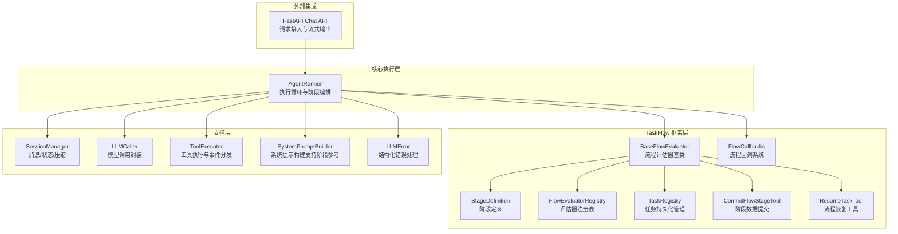
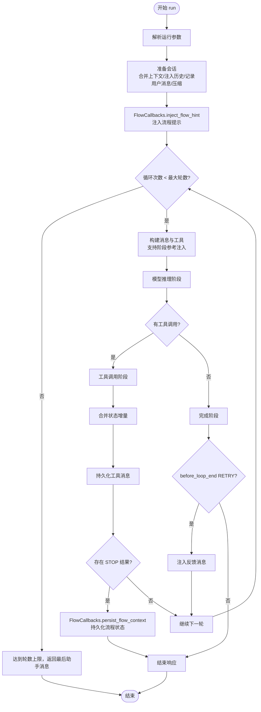
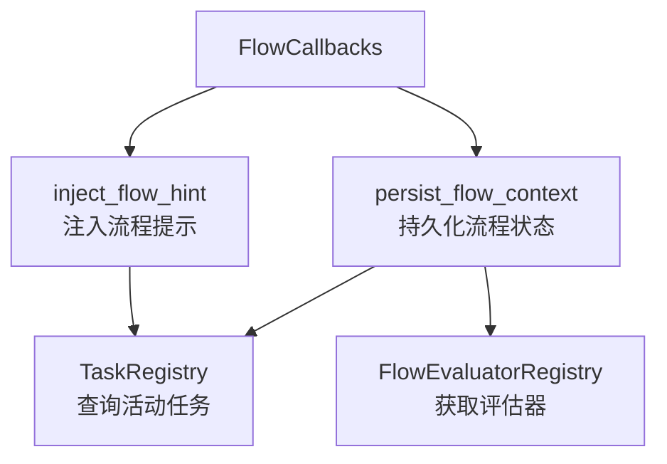
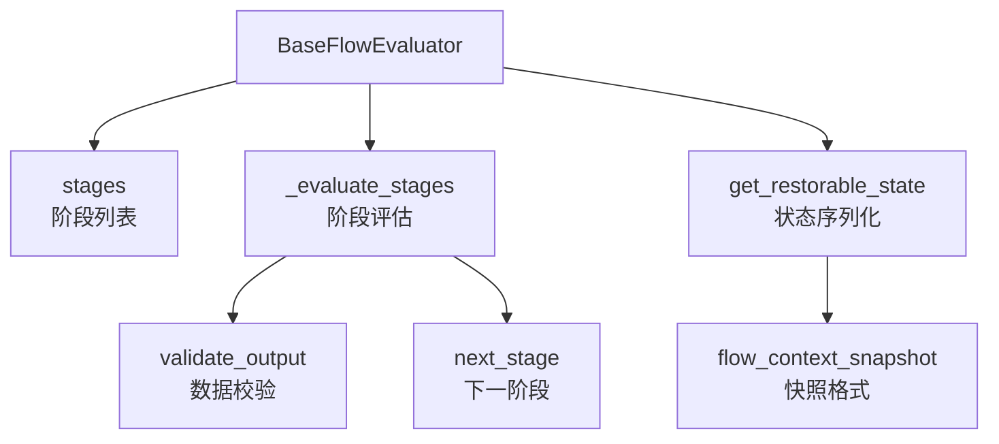
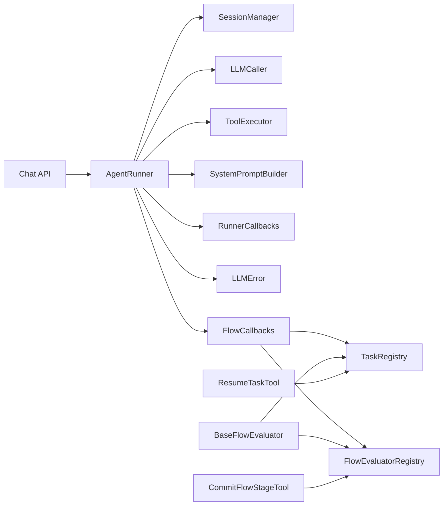

# ReAct 执行引擎

<cite>
**本文档引用的文件**
- [runner.py](file://src/ark_agentic/core/runner.py)
- [types.py](file://src/ark_agentic/core/types.py)
- [callbacks.py](file://src/ark_agentic/core/callbacks.py)
- [session.py](file://src/ark_agentic/core/session.py)
- [builder.py](file://src/ark_agentic/core/prompt/builder.py)
- [executor.py](file://src/ark_agentic/core/tools/executor.py)
- [chat.py](file://src/ark_agentic/api/chat.py)
- [errors.py](file://src/ark_agentic/core/llm/errors.py)
- [flow/__init__.py](file://src/ark_agentic/core/flow/__init__.py)
- [flow/base_evaluator.py](file://src/ark_agentic/core/flow/base_evaluator.py)
- [flow/task_registry.py](file://src/ark_agentic/core/flow/task_registry.py)
- [flow/commit_flow_stage.py](file://src/ark_agentic/core/flow/commit_flow_stage.py)
- [flow/callbacks.py](file://src/ark_agentic/core/flow/callbacks.py)
- [tools/resume_task.py](file://src/ark_agentic/core/tools/resume_task.py)
- [test_runner.py](file://tests/unit/core/test_runner.py)
- [test_callbacks.py](file://tests/unit/core/test_callbacks.py)
</cite>

## 更新摘要
**所做更改**
- 新增 TaskFlow 框架集成章节，详细介绍结构化工作流执行和状态管理
- 更新 AgentRunner 架构图，增加 TaskFlow 相关组件
- 新增 FlowCallbacks 回调系统，支持流程状态注入和持久化
- 新增 CommitFlowStageTool 工具，实现阶段数据提交机制
- 新增 ResumeTaskTool 工具，支持流程恢复和废弃操作
- 更新系统提示构建逻辑，支持动态阶段参考注入
- 新增 TaskRegistry 持久化管理，支持 TLL 清理机制

## 目录
1. [简介](#简介)
2. [项目结构](#项目结构)
3. [核心组件](#核心组件)
4. [架构总览](#架构总览)
5. [详细组件分析](#详细组件分析)
6. [TaskFlow 框架集成](#taskflow-框架集成)
7. [依赖关系分析](#依赖关系分析)
8. [性能考量](#性能考量)
9. [故障排查指南](#故障排查指南)
10. [结论](#结论)
11. [附录](#附录)

## 简介
本文件面向 ReAct 执行引擎的使用者与维护者，系统性阐述 AgentRunner 的设计与实现，重点覆盖 ReAct 循环的五个阶段：准备阶段、模型推理阶段、工具调用阶段、完成阶段与终结阶段；详解执行参数解析、会话准备、消息构建、工具选择与执行机制；并深入说明回调系统的工作原理、错误处理策略与重试机制。

**更新** 本版本集成了全新的 TaskFlow 框架，支持结构化的工作流执行和状态管理，包括流程评估器、阶段定义、状态持久化和动态参考注入等功能。新增了 FlowCallbacks 回调系统，支持流程状态的自动注入和持久化，以及 CommitFlowStageTool 和 ResumeTaskTool 等专用工具。

## 项目结构
ReAct 执行引擎位于核心模块 core 下，围绕 AgentRunner 组织关键能力，现已集成了 TaskFlow 框架：
- 执行器：AgentRunner（核心循环与阶段编排）
- 会话管理：SessionManager（消息持久化、压缩、状态管理）
- 提示构建：SystemPromptBuilder（动态系统提示生成，支持阶段参考注入）
- 工具执行：ToolExecutor（工具并发执行与事件分发）
- 回调系统：RunnerCallbacks/HookAction（生命周期钩子与事件）
- **新增** TaskFlow 框架：BaseFlowEvaluator、StageDefinition、FlowEvaluatorRegistry
- **新增** 流程管理：TaskRegistry（active_tasks.json 持久化与 TTL 清理）
- **新增** 专用工具：CommitFlowStageTool、ResumeTaskTool
- 类型与常量：types（消息、工具、结果、枚举等）
- 错误处理：LLMError（结构化错误分类与处理）



**图表来源**
- [runner.py:193-388](file://src/ark_agentic/core/runner.py#L193-L388)
- [flow/__init__.py:1-19](file://src/ark_agentic/core/flow/__init__.py#L1-L19)
- [flow/base_evaluator.py:134-317](file://src/ark_agentic/core/flow/base_evaluator.py#L134-L317)
- [flow/task_registry.py:32-124](file://src/ark_agentic/core/flow/task_registry.py#L32-L124)
- [flow/commit_flow_stage.py:34-177](file://src/ark_agentic/core/flow/commit_flow_stage.py#L34-L177)
- [tools/resume_task.py:22-193](file://src/ark_agentic/core/tools/resume_task.py#L22-L193)
- [flow/callbacks.py:36-143](file://src/ark_agentic/core/flow/callbacks.py#L36-L143)

## 核心组件
- AgentRunner：ReAct 执行器，负责生命周期编排、消息构建、工具筛选与执行、回调与错误处理、结果汇总。
- SessionManager：会话生命周期与状态管理，支持消息持久化、压缩、令牌统计与技能状态。
- SystemPromptBuilder：动态构建系统提示，按技能加载模式注入工具与技能描述，**新增**支持动态阶段参考注入。
- ToolExecutor：并发执行工具调用，统一事件分发，超时与错误兜底。
- RunnerCallbacks/HookAction：生命周期钩子容器与动作语义，贯穿 Agent 级与每轮 ReAct 轮次。
- **新增** BaseFlowEvaluator：流程评估器基类，实现确定性状态机和阶段遍历。
- **新增** StageDefinition：阶段定义，包含必填/可跳过阶段、字段来源声明和输出模式校验。
- **新增** FlowEvaluatorRegistry：全局单例注册表，维护 skill_name → evaluator 实例映射。
- **新增** TaskRegistry：active_tasks.json 持久化管理，支持 TTL 清理和任务查询。
- **新增** CommitFlowStageTool：提交流程阶段完成数据，自动提取工具结果并校验输出。
- **新增** ResumeTaskTool：恢复或废弃用户之前未完成的业务流程。
- **新增** FlowCallbacks：封装 before_agent / after_agent 两个流程回调钩子。

**章节来源**
- [runner.py:193-388](file://src/ark_agentic/core/runner.py#L193-L388)
- [flow/base_evaluator.py:134-317](file://src/ark_agentic/core/flow/base_evaluator.py#L134-L317)
- [flow/task_registry.py:32-124](file://src/ark_agentic/core/flow/task_registry.py#L32-L124)
- [flow/commit_flow_stage.py:34-177](file://src/ark_agentic/core/flow/commit_flow_stage.py#L34-L177)
- [tools/resume_task.py:22-193](file://src/ark_agentic/core/tools/resume_task.py#L22-L193)
- [flow/callbacks.py:36-143](file://src/ark_agentic/core/flow/callbacks.py#L36-L143)

## 架构总览
ReAct 执行引擎采用"阶段化职责分离"的设计，每个阶段独立封装，通过回调系统解耦扩展点，通过会话管理器统一状态与持久化。**更新** 新增了 TaskFlow 框架层，提供结构化的工作流执行能力，包括流程评估、阶段管理、状态持久化和动态参考注入。

```mermaid
sequenceDiagram
participant Client as "客户端/调用方"
participant API as "Chat API"
participant Runner as "AgentRunner"
participant FlowCB as "FlowCallbacks"
participant LLM as "LLMCaller"
participant Tools as "ToolExecutor"
participant Session as "SessionManager"
Client->>API : 发送聊天请求
API->>Runner : run(session_id, user_input, user_id, ...)
Runner->>FlowCB : inject_flow_hintbefore_agent
FlowCB-->>Runner : 注入流程提示和待恢复任务
Runner->>Runner : _resolve_run_params()
Runner->>Session : _prepare_session()
Runner->>Runner : _run_loop()
loop ReAct 循环
Runner->>Runner : _model_phase()
Runner->>LLM : 调用模型(支持流式)
alt LLM 正常响应
LLM-->>Runner : 返回响应(含工具调用/文本)
alt 有工具调用
Runner->>Tools : _tool_phase()
Tools-->>Runner : 工具结果(含事件)
Runner->>Session : 追加工具消息
alt 包含流程工具
Note over Runner,Tools : CommitFlowStageTool / ResumeTaskTool
Runner->>FlowCB : persist_flow_contextafter_agent
FlowCB-->>Runner : 持久化流程状态
else 无工具调用
Runner->>Runner : _complete_phase()
else LLMError 异常
LLM-->>Runner : 抛出 LLMError
Runner->>Runner : _run_hooks(on_model_error)
Runner->>Session : 记录错误消息
end
end
Runner->>Session : _finalize_run()
Runner-->>API : 返回 RunResult
API-->>Client : 响应/流式事件
```

**图表来源**
- [runner.py:312-370](file://src/ark_agentic/core/runner.py#L312-L370)
- [flow/callbacks.py:50-96](file://src/ark_agentic/core/flow/callbacks.py#L50-L96)
- [flow/callbacks.py:100-143](file://src/ark_agentic/core/flow/callbacks.py#L100-L143)

## 详细组件分析

### AgentRunner：ReAct 执行器
- 职责边界清晰：执行循环、阶段编排、参数解析、回调与错误处理、结果汇总。
- 关键阶段：
  - 准备阶段：解析运行参数、合并输入上下文、注入外部历史、记录用户消息、自动压缩。
  - 模型推理阶段：before_model → LLM 调用 → after_model → 持久化与统计 → 结束原因判断。
  - 工具调用阶段：before_tool → 并发执行 → 合并状态增量 → after_tool → 持久化 → STOP 检查。
  - 完成阶段：before_loop_end → 决策 RETRY/STOP → _finalize_response。
  - 终结阶段：after_agent → 清理临时状态 → 同步会话状态。
- 参数解析：支持 per-request 的模型与温度覆盖，技能加载模式固定于 Agent 级配置。
- 错误处理：LLMError 分类映射为用户友好提示，必要时注入错误消息并终止；工具超时/异常统一兜底。
- 回调系统：**扩展为 8 个钩子**覆盖 Agent 级与每轮 ReAct 轮次，支持 ABORT/OVERRIDE/RETRY/PASS。
- **新增** 系统提示增强：支持动态阶段参考注入，根据当前流程阶段自动添加相关参考文档。

**章节来源**
- [runner.py:312-388](file://src/ark_agentic/core/runner.py#L312-L388)
- [runner.py:652-731](file://src/ark_agentic/core/runner.py#L652-L731)
- [runner.py:760-880](file://src/ark_agentic/core/runner.py#L760-L880)
- [runner.py:882-964](file://src/ark_agentic/core/runner.py#L882-L964)
- [runner.py:966-983](file://src/ark_agentic/core/runner.py#L966-L983)
- [runner.py:1205-1266](file://src/ark_agentic/core/runner.py#L1205-L1266)

### 执行参数解析与会话准备
- 参数解析：支持 per-request 的模型与温度覆盖；技能加载模式来自 Agent 级配置。
- 会话准备：合并 input_context（覆盖语义）、注入外部历史、记录用户消息、自动压缩、设置 temp:user_input 以便工具访问。
- 回调：before_agent 支持 ABORT 早停；after_agent 支持替换最终响应。

**章节来源**
- [runner.py:391-404](file://src/ark_agentic/core/runner.py#L391-L404)
- [runner.py:406-493](file://src/ark_agentic/core/runner.py#L406-L493)
- [callbacks.py:98-114](file://src/ark_agentic/core/callbacks.py#L98-L114)

### 消息构建与系统提示
- 消息构建：将历史消息转换为 LLM 输入格式，工具调用与工具结果进行差异化处理（A2UI 结果遮蔽、非 A2UI 结果 JSON 序列化）。
- 系统提示：根据技能加载模式注入工具描述与技能内容；动态模式下注入当前激活技能正文；**新增**支持动态阶段参考注入，根据 _flow_stage 自动添加相关参考文档。
- 工具筛选：按技能加载模式与当前激活技能过滤可用工具，确保 API schema 与系统提示一致。

**章节来源**
- [runner.py:985-1072](file://src/ark_agentic/core/runner.py#L985-L1072)
- [runner.py:1103-1156](file://src/ark_agentic/core/runner.py#L1103-L1156)
- [runner.py:1158-1194](file://src/ark_agentic/core/runner.py#L1158-L1194)
- [runner.py:1205-1266](file://src/ark_agentic/core/runner.py#L1205-L1266)
- [builder.py:276-325](file://src/ark_agentic/core/prompt/builder.py#L276-L325)

### 工具选择与执行机制
- 工具选择：按技能加载模式与当前激活技能筛选；动态模式下仅暴露必要工具。
- 工具执行：并发执行工具调用，限制每轮最大调用次数；统一事件分发（步骤、UI 组件、自定义事件）；超时与异常兜底。
- 状态合并：工具结果中的 state_delta 合并到会话状态，供下一轮使用。

**章节来源**
- [runner.py:1158-1194](file://src/ark_agentic/core/runner.py#L1158-L1194)
- [executor.py:43-100](file://src/ark_agentic/core/tools/executor.py#L43-L100)
- [runner.py:574-583](file://src/ark_agentic/core/runner.py#L574-L583)

### 回调系统工作原理
- **扩展的钩子类型**：8 个钩子覆盖 Agent 级与每轮 ReAct 轮次，包括新增的 on_model_error。
- 动作语义：PASS（默认）、ABORT（拒绝请求）、OVERRIDE（替换输出/结果）、RETRY（注入反馈重试）。
- 事件分发：回调可产生事件，由 Runner 统一分发至 AgentEventHandler。

**章节来源**
- [callbacks.py:43-198](file://src/ark_agentic/core/callbacks.py#L43-L198)
- [runner.py:612-650](file://src/ark_agentic/core/runner.py#L612-L650)

### 错误处理策略与重试机制
- **结构化的 LLM 错误分类**：认证、配额、限流、超时、上下文溢出、内容过滤、服务器错误、网络错误等，映射为用户友好提示。
- **专门的错误处理钩子**：on_model_error 独立触发，不影响 after_model；错误消息注入会话并终止当前轮。
- before_loop_end RETRY：允许在最终回答轮注入反馈消息，驱动模型自我修正并继续循环。
- 工具超时/异常：统一兜底为错误结果，记录日志并继续流程。

**章节来源**
- [runner.py:592-611](file://src/ark_agentic/core/runner.py#L592-L611)
- [runner.py:816-840](file://src/ark_agentic/core/runner.py#L816-L840)
- [runner.py:744-758](file://src/ark_agentic/core/runner.py#L744-L758)
- [executor.py:77-100](file://src/ark_agentic/core/tools/executor.py#L77-L100)
- [errors.py:17-29](file://src/ark_agentic/core/llm/errors.py#L17-L29)

### 完整 ReAct 循环时序


**图表来源**
- [runner.py:652-731](file://src/ark_agentic/core/runner.py#L652-L731)
- [runner.py:734-758](file://src/ark_agentic/core/runner.py#L734-L758)
- [runner.py:760-880](file://src/ark_agentic/core/runner.py#L760-L880)
- [runner.py:882-964](file://src/ark_agentic/core/runner.py#L882-L964)
- [flow/callbacks.py:50-96](file://src/ark_agentic/core/flow/callbacks.py#L50-L96)
- [flow/callbacks.py:100-143](file://src/ark_agentic/core/flow/callbacks.py#L100-L143)

## TaskFlow 框架集成

### FlowCallbacks：流程回调系统
FlowCallbacks 是 TaskFlow 框架的核心回调实现，提供两个关键钩子：

- **inject_flow_hint（before_agent）**：检查用户的 active tasks，将提示注入 session state 供系统提示构建器读取
- **persist_flow_context（after_agent）**：持久化 _flow_context 到 active_tasks.json 文件



**图表来源**
- [flow/callbacks.py:36-143](file://src/ark_agentic/core/flow/callbacks.py#L36-L143)
- [flow/task_registry.py:32-124](file://src/ark_agentic/core/flow/task_registry.py#L32-L124)
- [flow/base_evaluator.py:108-129](file://src/ark_agentic/core/flow/base_evaluator.py#L108-L129)

**章节来源**
- [flow/callbacks.py:36-143](file://src/ark_agentic/core/flow/callbacks.py#L36-L143)

### BaseFlowEvaluator：流程评估器基类
BaseFlowEvaluator 是 TaskFlow 框架的核心抽象基类，提供：

- **确定性状态机**：实现阶段遍历、状态管理和流程推进
- **Pydantic 校验**：自动验证阶段输出数据的结构和类型
- **状态恢复**：支持跨会话的流程状态序列化和恢复
- **动态参考注入**：根据当前阶段自动注入相关参考文档



**图表来源**
- [flow/base_evaluator.py:134-317](file://src/ark_agentic/core/flow/base_evaluator.py#L134-L317)

**章节来源**
- [flow/base_evaluator.py:134-317](file://src/ark_agentic/core/flow/base_evaluator.py#L134-L317)

### CommitFlowStageTool：阶段数据提交工具
CommitFlowStageTool 实现了流程阶段数据的提交机制：

- **自动字段提取**：根据 FieldSource 声明自动从 session.state 提取工具结果
- **用户数据收集**：要求 LLM 通过 user_data 参数提供用户对话中收集的字段
- **数据校验**：使用 Pydantic Schema 对提交的数据进行结构化校验
- **状态写入**：将验证通过的数据写入 _flow_context.stage_<id>，触发流程推进

**章节来源**
- [flow/commit_flow_stage.py:34-177](file://src/ark_agentic/core/flow/commit_flow_stage.py#L34-L177)

### ResumeTaskTool：流程恢复工具
ResumeTaskTool 提供了流程恢复和废弃操作：

- **流程恢复**：从 active_tasks.json 还原 _flow_context 到当前会话，使 flow_evaluator 能从上次中断的阶段继续执行
- **流程废弃**：从 active_tasks.json 删除任务记录，供用户选择废弃或重新开始时使用
- **状态还原**：支持将已完成阶段的 delta 数据还原到 session.state 顶层

**章节来源**
- [tools/resume_task.py:22-193](file://src/ark_agentic/core/tools/resume_task.py#L22-L193)

### TaskRegistry：任务持久化管理
TaskRegistry 负责管理 active_tasks.json 文件：

- **持久化存储**：将流程状态序列化为可恢复格式
- **TTL 清理**：支持按小时的过期时间管理，默认 72 小时
- **任务查询**：提供按用户和流程 ID 的查询接口
- **状态跟踪**：记录最后会话 ID 和更新时间戳

**章节来源**
- [flow/task_registry.py:32-124](file://src/ark_agentic/core/flow/task_registry.py#L32-L124)

## 依赖关系分析
- AgentRunner 依赖 SessionManager（消息/状态/压缩）、LLMCaller（模型调用）、ToolExecutor（工具执行）、SystemPromptBuilder（系统提示）、RunnerCallbacks（回调）、LLMError（错误处理）。
- **新增** TaskFlow 框架依赖 FlowCallbacks（流程回调）、BaseFlowEvaluator（流程评估）、TaskRegistry（任务持久化）。
- 工具注册与筛选通过 ToolRegistry 实现，动态模式下结合技能加载器与匹配器。
- API 层通过 Chat API 调用 AgentRunner，支持流式与非流式两种输出。



**图表来源**
- [chat.py:27-177](file://src/ark_agentic/api/chat.py#L27-L177)
- [runner.py:193-388](file://src/ark_agentic/core/runner.py#L193-L388)
- [flow/callbacks.py:36-143](file://src/ark_agentic/core/flow/callbacks.py#L36-L143)
- [flow/base_evaluator.py:108-129](file://src/ark_agentic/core/flow/base_evaluator.py#L108-L129)
- [flow/task_registry.py:32-124](file://src/ark_agentic/core/flow/task_registry.py#L32-L124)

**章节来源**
- [chat.py:27-177](file://src/ark_agentic/api/chat.py#L27-L177)
- [runner.py:193-388](file://src/ark_agentic/core/runner.py#L193-L388)
- [flow/callbacks.py:36-143](file://src/ark_agentic/core/flow/callbacks.py#L36-L143)

## 性能考量
- 消息压缩：启用 auto_compact，在需要时自动压缩历史消息，降低上下文长度与 token 消耗。
- 工具并发：ToolExecutor 并发执行工具调用，受 max_calls_per_turn 限制，避免过载。
- 流式输出：支持流式模型调用与事件分发，提升前端交互体验。
- A2UI 结果遮蔽：对 A2UI 工具结果进行轻量标记，减少 token 消耗。
- 令牌统计：每轮记录 prompt/completion tokens，便于成本控制与优化。
- **新增** 流程状态持久化：FlowCallbacks 在 after_agent 钩子中异步持久化，避免阻塞主流程。
- **新增** 动态参考注入：仅在需要时加载阶段参考文件，减少不必要的 I/O 操作。

**章节来源**
- [runner.py:473-487](file://src/ark_agentic/core/runner.py#L473-L487)
- [runner.py:88-128](file://src/ark_agentic/core/runner.py#L88-L128)
- [runner.py:985-1072](file://src/ark_agentic/core/runner.py#L985-L1072)
- [executor.py:43-61](file://src/ark_agentic/core/tools/executor.py#L43-L61)
- [flow/callbacks.py:100-143](file://src/ark_agentic/core/flow/callbacks.py#L100-L143)

## 故障排查指南
- **模型错误**：根据 LLMError.reason 映射用户友好提示；检查认证、配额、限流、网络与上下文长度。
- 工具超时/异常：查看工具执行日志与错误兜底结果；调整 timeout 与 max_calls_per_turn。
- 回调异常：确认回调返回的 CallbackResult.action 语义正确；避免阻塞钩子。
- 会话状态：确认 temp: 前缀键在 _finalize_run 后被清理；检查 state_delta 合并逻辑。
- 流式事件：确保 AgentEventHandler.on_content_delta/on_tool_call_* 等方法正确实现。
- **新增** 流程状态问题：检查 FlowCallbacks 是否正确注入和持久化；验证 TaskRegistry 文件权限。
- **新增** 阶段数据校验：确认 CommitFlowStageTool 的 FieldSource 配置正确；检查 Pydantic Schema 定义。
- **新增** 流程恢复：验证 resume_task 工具的 flow_id 参数；检查 active_tasks.json 文件格式。

**章节来源**
- [runner.py:592-611](file://src/ark_agentic/core/runner.py#L592-L611)
- [runner.py:816-840](file://src/ark_agentic/core/runner.py#L816-L840)
- [executor.py:77-100](file://src/ark_agentic/core/tools/executor.py#L77-L100)
- [callbacks.py:43-70](file://src/ark_agentic/core/callbacks.py#L43-L70)
- [errors.py:17-29](file://src/ark_agentic/core/llm/errors.py#L17-L29)
- [flow/callbacks.py:50-96](file://src/ark_agentic/core/flow/callbacks.py#L50-L96)
- [flow/commit_flow_stage.py:102-147](file://src/ark_agentic/core/flow/commit_flow_stage.py#L102-L147)
- [tools/resume_task.py:54-84](file://src/ark_agentic/core/tools/resume_task.py#L54-L84)

## 结论
AgentRunner 以清晰的阶段划分与回调系统实现了 ReAct 执行引擎的高内聚、低耦合设计。通过系统提示构建、工具筛选与执行、会话状态管理与错误处理，提供了稳定可靠的智能体执行能力。

**最新增强** 包括 TaskFlow 框架的完整集成，提供了结构化的流程执行能力，包括：
- 流程评估器基类和阶段定义系统
- 动态参考注入机制，支持按阶段自动添加相关文档
- 流程状态的自动持久化和恢复
- 专用的流程管理工具链

这些新增功能显著提升了执行引擎在复杂业务场景下的可扩展性和可维护性，配合 API 层的流式输出与测试用例，可满足生产环境的可观察性与可维护性需求。

## 附录

### 配置与使用示例（路径指引）
- 基本运行（非流式）：参见测试用例中的基本文本响应与工具调用示例路径
  - [test_runner.py:142-157](file://tests/unit/core/test_runner.py#L142-L157)
  - [test_runner.py:160-195](file://tests/unit/core/test_runner.py#L160-L195)
- 流式运行：参见测试用例中的流式文本与工具调用示例路径
  - [test_runner.py:198-244](file://tests/unit/core/test_runner.py#L198-L244)
  - [test_runner.py:247-315](file://tests/unit/core/test_runner.py#L247-L315)
- 状态增量合并：参见测试用例中的 state_delta 合并示例路径
  - [test_runner.py:422-451](file://tests/unit/core/test_runner.py#L422-L451)
- A2UI 结果遮蔽与事件分发：参见测试用例中的 A2UI 相关示例路径
  - [test_runner.py:506-543](file://tests/unit/core/test_runner.py#L506-L543)
  - [test_runner.py:546-592](file://tests/unit/core/test_runner.py#L546-L592)
- **新增** 回调系统测试：参见回调模块的单元测试
  - [test_callbacks.py:16-82](file://tests/unit/core/test_callbacks.py#L16-L82)
- **新增** TaskFlow 框架测试：参见 TaskFlow 相关的测试用例
  - [flow/base_evaluator.py:134-317](file://src/ark_agentic/core/flow/base_evaluator.py#L134-L317)
  - [flow/commit_flow_stage.py:34-177](file://src/ark_agentic/core/flow/commit_flow_stage.py#L34-L177)
  - [tools/resume_task.py:22-193](file://src/ark_agentic/core/tools/resume_task.py#L22-L193)

**章节来源**
- [test_runner.py:142-315](file://tests/unit/core/test_runner.py#L142-L315)
- [test_runner.py:422-592](file://tests/unit/core/test_runner.py#L422-L592)
- [test_callbacks.py:16-82](file://tests/unit/core/test_callbacks.py#L16-L82)
- [flow/base_evaluator.py:134-317](file://src/ark_agentic/core/flow/base_evaluator.py#L134-L317)
- [flow/commit_flow_stage.py:34-177](file://src/ark_agentic/core/flow/commit_flow_stage.py#L34-L177)
- [tools/resume_task.py:22-193](file://src/ark_agentic/core/tools/resume_task.py#L22-L193)

### TaskFlow 框架详细说明

#### FlowCallbacks：流程回调系统
- **inject_flow_hint 钩子**：检查用户的 active tasks，将提示注入 session state 供系统提示构建器读取
- **persist_flow_context 钩子**：持久化 _flow_context 到 active_tasks.json 文件
- **使用方式**：通过 make_flow_callbacks 工厂函数创建，然后与业务回调合并

#### BaseFlowEvaluator：流程评估器基类
- **阶段定义**：通过 stages 属性定义有序的阶段列表
- **数据校验**：使用 Pydantic Schema 对阶段输出进行结构化校验
- **状态管理**：自动管理流程状态的初始化、推进和完成检测
- **动态参考**：根据当前阶段自动注入相关参考文档

#### CommitFlowStageTool：阶段数据提交工具
- **字段来源声明**：通过 FieldSource 声明每个字段的数据来源（tool/user）
- **自动提取**：自动从 session.state 提取 source="tool" 的字段
- **用户收集**：要求 LLM 通过 user_data 参数提供 source="user" 的字段
- **状态写入**：将验证通过的数据写入 _flow_context.stage_<id>

#### ResumeTaskTool：流程恢复工具
- **流程恢复**：从 active_tasks.json 还原 _flow_context 到当前会话
- **状态还原**：支持将已完成阶段的 delta 数据还原到 session.state 顶层
- **流程废弃**：从 active_tasks.json 删除任务记录

#### TaskRegistry：任务持久化管理
- **文件格式**：{base_dir}/{user_id}/active_tasks.json
- **TTL 管理**：支持按小时的过期时间管理，默认 72 小时
- **查询接口**：提供按用户和流程 ID 的查询方法
- **状态跟踪**：记录最后会话 ID 和更新时间戳

**章节来源**
- [flow/callbacks.py:36-143](file://src/ark_agentic/core/flow/callbacks.py#L36-L143)
- [flow/base_evaluator.py:134-317](file://src/ark_agentic/core/flow/base_evaluator.py#L134-L317)
- [flow/commit_flow_stage.py:34-177](file://src/ark_agentic/core/flow/commit_flow_stage.py#L34-L177)
- [tools/resume_task.py:22-193](file://src/ark_agentic/core/tools/resume_task.py#L22-L193)
- [flow/task_registry.py:32-124](file://src/ark_agentic/core/flow/task_registry.py#L32-L124)