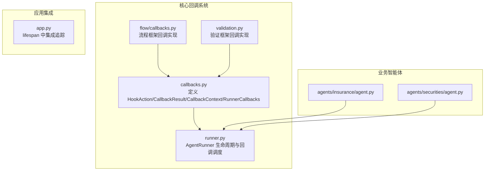
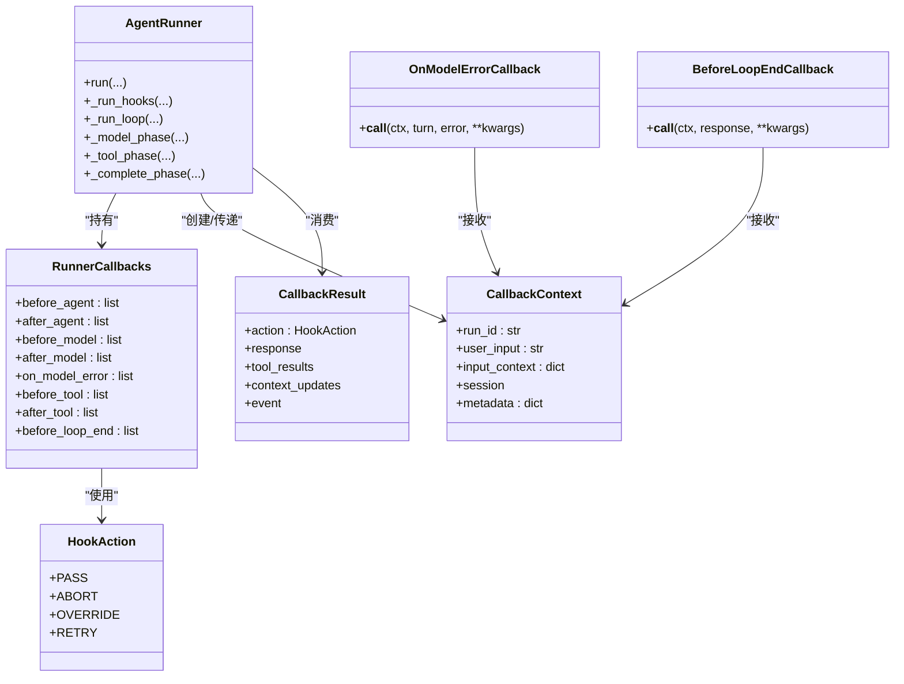
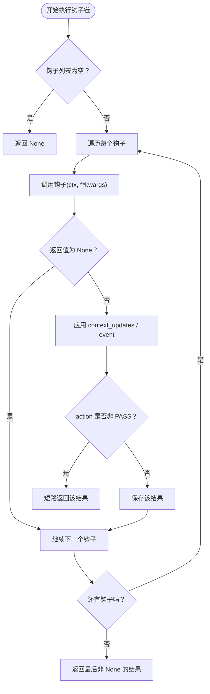
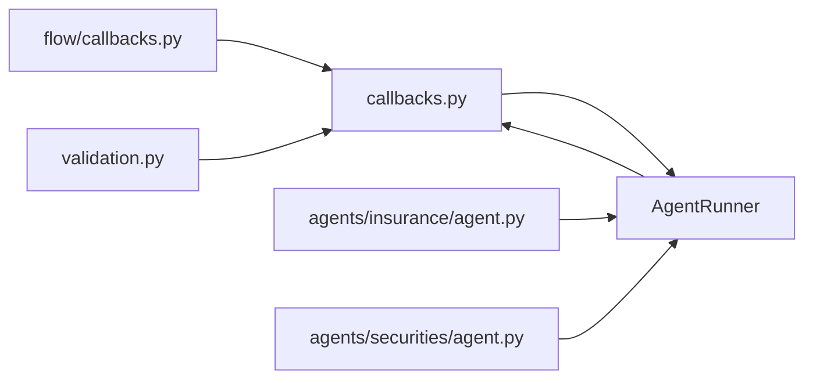
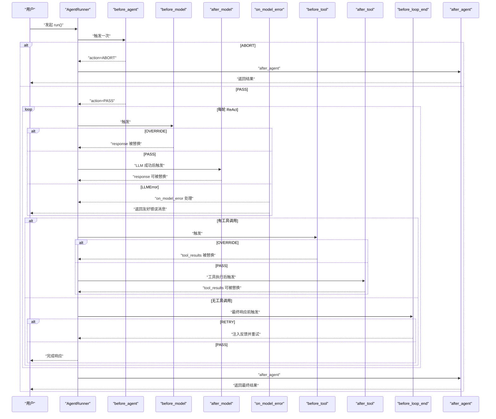

# 回调系统

<cite>
**本文引用的文件**
- [callbacks.py](file://src/ark_agentic/core/callbacks.py)
- [runner.py](file://src/ark_agentic/core/runner.py)
- [flow/callbacks.py](file://src/ark_agentic/core/flow/callbacks.py)
- [validation.py](file://src/ark_agentic/core/validation.py)
- [__init__.py](file://src/ark_agentic/core/__init__.py)
- [test_callbacks.py](file://tests/unit/core/test_callbacks.py)
</cite>

## 更新摘要
**所做更改**
- 新增 on_model_error 错误处理钩子，专门处理 LLMError 异常
- 改进 CallbackContext 结构，确保 run_id 和 metadata 字段的完整性
- 所有钩子协议增加 **kwargs 支持，允许透传执行上下文元数据
- 新增 BeforeLoopEndCallback 协议，处理最终响应前的自检和重试逻辑
- 增强错误传播机制，确保 on_model_error 与 after_model 的互斥性
- 更新回调链执行顺序和条件判断逻辑

## 目录
1. [简介](#简介)
2. [项目结构](#项目结构)
3. [核心组件](#核心组件)
4. [架构总览](#架构总览)
5. [详细组件分析](#详细组件分析)
6. [依赖关系分析](#依赖关系分析)
7. [性能考量](#性能考量)
8. [故障排查指南](#故障排查指南)
9. [结论](#结论)
10. [附录](#附录)

## 简介
本文件系统性阐述 Ark Agentic 的回调系统设计与实现，重点包括：
- RunnerCallbacks 类的设计模式与职责边界
- HookAction 枚举的动作意图与执行语义
- CallbackContext 上下文传递与可扩展元数据
- CallbackResult 结果处理与链式决策
- 九类回调钩子的触发时机、条件判断与错误传播
- 回调链执行顺序、短路策略与事件分发
- 自定义回调开发指南与最佳实践
- **新增** 错误处理钩子 on_model_error 的详细机制
- **新增** BeforeLoopEndCallback 的自检和重试逻辑

## 项目结构
回调系统位于核心模块中，围绕 AgentRunner 的生命周期提供细粒度扩展点。系统包含基础回调协议、错误处理钩子、流程框架回调和验证框架回调等多个层次。

**图表来源**
- [callbacks.py:1-246](file://src/ark_agentic/core/callbacks.py#L1-L246)
- [runner.py:18-50](file://src/ark_agentic/core/runner.py#L18-L50)
- [flow/callbacks.py:1-142](file://src/ark_agentic/core/flow/callbacks.py#L1-L142)
- [validation.py:490-605](file://src/ark_agentic/core/validation.py#L490-L605)

**章节来源**
- [callbacks.py:1-246](file://src/ark_agentic/core/callbacks.py#L1-L246)
- [runner.py:18-50](file://src/ark_agentic/core/runner.py#L18-L50)
- [flow/callbacks.py:1-142](file://src/ark_agentic/core/flow/callbacks.py#L1-L142)
- [validation.py:490-605](file://src/ark_agentic/core/validation.py#L490-L605)

## 核心组件
- HookAction：定义回调动作意图，决定 Runner 的分支行为
- CallbackResult：回调返回的"变更声明"，包含 action、response、tool_results、context_updates、event
- CallbackContext：贯穿所有钩子的共享上下文，承载 run_id、user_input、input_context、session、metadata
- RunnerCallbacks：九类回调钩子的容器，支持合并与组合
- **新增** OnModelErrorCallback：专门处理 LLMError 异常的错误处理钩子
- **新增** BeforeLoopEndCallback：处理最终响应前的自检和重试逻辑
- **增强** 所有钩子协议支持 **kwargs 参数，允许透传执行上下文元数据

**章节来源**
- [callbacks.py:43-246](file://src/ark_agentic/core/callbacks.py#L43-L246)
- [runner.py:622-651](file://src/ark_agentic/core/runner.py#L622-L651)

## 架构总览
回调系统采用"协议 + 数据类 + 容器"的分层设计，包含基础回调协议、错误处理钩子和特殊用途回调：
- 协议层：各钩子协议定义签名与语义，支持 **kwargs 透传
- 数据层：CallbackResult/CallbackContext/CallbackEvent 描述变更与上下文
- 容器层：RunnerCallbacks 聚合钩子列表，支持外部与内部钩子的有序组合
- 调度层：AgentRunner 在生命周期关键节点调用 _run_hooks，按 HookAction 决策短路或继续
- 特殊层：OnModelErrorCallback 专门处理 LLMError 异常，BeforeLoopEndCallback 处理最终响应自检

**图表来源**
- [callbacks.py:43-246](file://src/ark_agentic/core/callbacks.py#L43-L246)
- [runner.py:193-242](file://src/ark_agentic/core/runner.py#L193-L242)

## 详细组件分析

### RunnerCallbacks 设计模式
- 职责：聚合九类钩子，支持外部与内部钩子的组合与顺序控制
- 组合策略：内部钩子优先于外部钩子执行（例如 before_agent 内部在前，after_agent 外部在前）
- 合并策略：merge_runner_callbacks 追加合并，保持调用顺序

**章节来源**
- [callbacks.py:220-246](file://src/ark_agentic/core/callbacks.py#L220-L246)
- [runner.py:58-72](file://src/ark_agentic/core/runner.py#L58-L72)
- [test_callbacks.py:42-74](file://tests/unit/core/test_callbacks.py#L42-L74)

### HookAction 动作机制
- PASS：不干预，继续默认流程
- ABORT：仅在 before_agent 生效，拒绝请求并提前结束
- OVERRIDE：在 before_model 或 before_tool 生效，替换默认输出
- RETRY：仅在 before_loop_end 生效，注入反馈消息并重试

**章节来源**
- [callbacks.py:43-49](file://src/ark_agentic/core/callbacks.py#L43-L49)
- [runner.py:744-758](file://src/ark_agentic/core/runner.py#L744-L758)

### CallbackContext 上下文传递
- run_id：本次 run 的唯一标识（与 OTel span 的 ark.run_id 同源）
- user_input：原始用户输入
- input_context：请求级上下文，可通过 CallbackResult.context_updates 合并
- session：当前会话对象（只读引用）
- metadata：运行期元数据（如 user_id、agent_id、model、stream 等），回调可读写私有字段（建议以 _ 前缀）

**章节来源**
- [callbacks.py:75-93](file://src/ark_agentic/core/callbacks.py#L75-L93)
- [runner.py:425-431](file://src/ark_agentic/core/runner.py#L425-L431)

### CallbackResult 结果处理
- action 决定是否短路
- response 可替换模型输出或最终响应
- tool_results 可替换工具执行结果
- context_updates 合并到 input_context
- event 通过事件处理器分发

**章节来源**
- [callbacks.py:58-70](file://src/ark_agentic/core/callbacks.py#L58-L70)
- [runner.py:622-651](file://src/ark_agentic/core/runner.py#L622-L651)

### 九类回调钩子与触发时机
- before_agent：一次，run 前，可 ABORT 拒绝请求
- after_agent：一次，run 后，可替换最终响应
- before_model：每轮 LLM 调用前，可 OVERRIDE 替换输出
- after_model：每轮 LLM 成功后，可替换响应
- **新增** on_model_error：LLMError 发生时，与 after_model 互斥
- before_tool：每轮工具调用批处理前，可 OVERRIDE 替换结果
- after_tool：工具执行后，可替换结果
- **新增** before_loop_end：最终非工具调用响应前，可 RETRY 注入反馈重试

**章节来源**
- [callbacks.py:98-214](file://src/ark_agentic/core/callbacks.py#L98-L214)
- [runner.py:433-457](file://src/ark_agentic/core/runner.py#L433-L457)
- [runner.py:898-921](file://src/ark_agentic/core/runner.py#L898-L921)
- [runner.py:903-935](file://src/ark_agentic/core/runner.py#L903-L935)
- [runner.py:744-758](file://src/ark_agentic/core/runner.py#L744-L758)

### 回调链执行顺序与短路策略
- 顺序：按钩子列表顺序依次执行
- 短路：遇到非 PASS 的 action 即停止后续钩子，返回首个非 PASS 的结果
- 最终结果：若无非 PASS，返回最后一个非 None 的结果；否则返回 None

**图表来源**
- [runner.py:622-651](file://src/ark_agentic/core/runner.py#L622-L651)

**章节来源**
- [runner.py:622-651](file://src/ark_agentic/core/runner.py#L622-L651)

### 错误传播机制
- LLMError 触发 on_model_error，记录友好错误消息并持久化
- after_model 不在 LLMError 分支触发，确保成功/错误路径分离
- 用户友好的错误消息根据 LLMErrorReason 映射
- **增强** 所有钩子协议支持 **kwargs，允许传递额外的执行上下文信息

**章节来源**
- [runner.py:898-921](file://src/ark_agentic/core/runner.py#L898-L921)
- [runner.py:592-611](file://src/ark_agentic/core/runner.py#L592-L611)

### 事件分发与 UI/流式输出
- 回调可通过 CallbackEvent 与 AgentEventHandler 交互
- _dispatch_event 将事件路由到 handler.on_step/on_ui_component/on_custom_event

**章节来源**
- [callbacks.py:51-56](file://src/ark_agentic/core/callbacks.py#L51-L56)
- [runner.py:613-621](file://src/ark_agentic/core/runner.py#L613-L621)

### **新增** 错误处理钩子 OnModelErrorCallback
- 专门处理 LLMError 异常，与 after_model 钩子互斥
- 接收 turn 和 error 参数，支持 **kwargs 透传
- 在 LLMError 发生时触发，提供统一的错误处理机制

**章节来源**
- [callbacks.py:155-167](file://src/ark_agentic/core/callbacks.py#L155-L167)
- [runner.py:898-921](file://src/ark_agentic/core/runner.py#L898-L921)

### **新增** 最终响应自检钩子 BeforeLoopEndCallback
- 在最终非工具调用响应前触发，允许进行后置验证
- 支持 RETRY 动作，注入反馈消息并重试
- 适用于事实核查、引用验证等场景

**章节来源**
- [callbacks.py:200-214](file://src/ark_agentic/core/callbacks.py#L200-L214)
- [validation.py:496-605](file://src/ark_agentic/core/validation.py#L496-L605)

### **新增** 流程框架回调 FlowCallbacks
- 提供 before_agent 和 after_agent 两个流程钩子
- 注入到 RunnerCallbacks，支持工作流状态持久化和提示注入
- 通过 make_flow_callbacks 工厂函数创建

**章节来源**
- [flow/callbacks.py:28-142](file://src/ark_agentic/core/flow/callbacks.py#L28-L142)

### 依赖关系分析
- AgentRunner 依赖 callbacks 模块提供的类型与容器
- **新增** OnModelErrorCallback 专门处理 LLMError 异常
- **新增** BeforeLoopEndCallback 支持最终响应的自检和重试
- **增强** 所有钩子协议支持 **kwargs 参数，提高灵活性
- 业务智能体通过 RunnerCallbacks 注册自定义钩子

**图表来源**
- [runner.py:18-24](file://src/ark_agentic/core/runner.py#L18-L24)
- [callbacks.py:1-246](file://src/ark_agentic/core/callbacks.py#L1-L246)
- [flow/callbacks.py:1-142](file://src/ark_agentic/core/flow/callbacks.py#L1-L142)
- [validation.py:490-605](file://src/ark_agentic/core/validation.py#L490-L605)

**章节来源**
- [runner.py:18-24](file://src/ark_agentic/core/runner.py#L18-L24)
- [callbacks.py:1-246](file://src/ark_agentic/core/callbacks.py#L1-L246)
- [flow/callbacks.py:1-142](file://src/ark_agentic/core/flow/callbacks.py#L1-L142)
- [validation.py:490-605](file://src/ark_agentic/core/validation.py#L490-L605)

## 性能考量
- 钩子链顺序固定，避免 O(n log n) 排序成本
- 短路策略减少无效计算，建议在早期钩子快速 ABORT/RETRY
- 事件分发与上下文更新按需进行，避免不必要的序列化
- **新增** 错误处理钩子 on_model_error 提供专门的异常处理路径
- **新增** BeforeLoopEndCallback 支持延迟验证，避免不必要的重试
- **增强** **kwargs 支持允许按需传递参数，减少不必要的数据传输

## 故障排查指南
- 回调未生效
  - 检查 RunnerCallbacks 是否正确传入 AgentRunner
  - 确认钩子列表非空且顺序符合预期
- 回调短路导致流程异常
  - 检查 HookAction 是否为 PASS/OVERRIDE/RETRY 的合理组合
  - 确保 ABORT 仅在 before_agent 使用
- 上下文未更新
  - 确认 CallbackResult.context_updates 是否存在
  - 检查 _run_hooks 是否正确合并到 context
- 事件未到达前端
  - 确认 handler 非空且事件类型正确
  - 检查 _dispatch_event 的路由逻辑
- LLMError 未触发 on_model_error
  - 确认异常类型为 LLMError
  - 检查 _run_hooks 的 on_model_error 分支
- **新增** 错误处理钩子未触发
  - 确认 LLMError 是否正确抛出
  - 检查钩子列表是否包含 OnModelErrorCallback
- **新增** BeforeLoopEndCallback 未生效
  - 确认最终响应是否为非工具调用
  - 检查 RETRY 动作是否正确设置
- **新增** **kwargs 参数未传递
  - 确认钩子协议是否支持 **kwargs
  - 检查调用时是否正确传递参数

**章节来源**
- [runner.py:622-651](file://src/ark_agentic/core/runner.py#L622-L651)
- [runner.py:898-921](file://src/ark_agentic/core/runner.py#L898-L921)
- [test_callbacks.py:16-30](file://tests/unit/core/test_callbacks.py#L16-L30)

## 结论
回调系统通过明确的动作意图、强类型的上下文与结果声明，以及严格的生命周期钩子划分，提供了高内聚、低耦合的扩展能力。**新增的错误处理钩子 on_model_error** 和 **BeforeLoopEndCallback** 进一步增强了系统的健壮性和智能化水平。**增强的 **kwargs 支持** 提高了回调系统的灵活性和可扩展性。这种设计为业务逻辑回调提供了强大的扩展能力，同时保持了系统的稳定性和可维护性。

## 附录

### 回调钩子触发序列图（一次完整 ReAct 循环）

**图表来源**
- [runner.py:433-457](file://src/ark_agentic/core/runner.py#L433-L457)
- [runner.py:898-921](file://src/ark_agentic/core/runner.py#L898-L921)
- [runner.py:903-935](file://src/ark_agentic/core/runner.py#L903-L935)
- [runner.py:744-758](file://src/ark_agentic/core/runner.py#L744-L758)
- [runner.py:495-517](file://src/ark_agentic/core/runner.py#L495-L517)

### **新增** 错误处理钩子使用示例
- 在 LLMError 发生时自动触发 on_model_error 钩子
- 提供用户友好的错误消息映射
- 支持错误原因分类和重试策略

**章节来源**
- [runner.py:898-921](file://src/ark_agentic/core/runner.py#L898-L921)
- [callbacks.py:155-167](file://src/ark_agentic/core/callbacks.py#L155-L167)

### **新增** BeforeLoopEndCallback 使用示例
- 在最终响应前进行事实核查和引用验证
- 支持 RETRY 动作，自动注入反馈消息
- 适用于保险、证券等需要严格事实验证的场景

**章节来源**
- [callbacks.py:200-214](file://src/ark_agentic/core/callbacks.py#L200-L214)
- [validation.py:496-605](file://src/ark_agentic/core/validation.py#L496-L605)

### **新增** 流程框架回调使用示例
- 注入工作流提示，指导用户处理未完成任务
- 持久化工作流上下文，支持断点续跑
- 通过 make_flow_callbacks 工厂函数创建

**章节来源**
- [flow/callbacks.py:28-142](file://src/ark_agentic/core/flow/callbacks.py#L28-L142)

### 自定义回调开发指南
- 定义钩子
  - 实现对应协议（如 BeforeAgentCallback、BeforeModelCallback 等）
  - 支持 **kwargs 参数，按需获取执行上下文
  - 返回 CallbackResult 或 None
- 注册钩子
  - 构造 RunnerCallbacks 并传入 AgentRunner
  - 可通过 merge_runner_callbacks 合并多个 RunnerCallbacks
- 使用上下文
  - 从 ctx 读取 run_id、user_input、input_context、session、metadata
  - 通过 context_updates 合并 input_context
- 事件与 UI
  - 通过 CallbackEvent 与 handler 通信
- **新增** 错误处理
  - 使用 OnModelErrorCallback 处理 LLMError 异常
  - 确保与 after_model 钩子的互斥性
- **新增** 最终验证
  - 使用 BeforeLoopEndCallback 进行最终响应验证
  - 支持 RETRY 动作进行自动重试
- 注意事项
  - 遵循 HookAction 语义，避免跨阶段误用
  - 在错误路径（on_model_error）与成功路径（after_model）互斥
  - 保持钩子幂等与无副作用

**章节来源**
- [callbacks.py:98-214](file://src/ark_agentic/core/callbacks.py#L98-L214)
- [callbacks.py:220-246](file://src/ark_agentic/core/callbacks.py#L220-L246)
- [runner.py:622-651](file://src/ark_agentic/core/runner.py#L622-L651)

### 代码示例（注册与使用）
- 在保险智能体中注册空回调容器
  - [agent.py（保险）:137-140](file://src/ark_agentic/agents/insurance/agent.py#L137-L140)
- 在证券智能体中注册多个钩子（上下文增强、鉴权、引用）
  - [agent.py（证券）:144-170](file://src/ark_agentic/agents/securities/agent.py#L144-L170)
- **新增** 错误处理钩子注册示例
  - [runner.py:898-921](file://src/ark_agentic/core/runner.py#L898-L921)
- **新增** BeforeLoopEndCallback 注册示例
  - [validation.py:496-605](file://src/ark_agentic/core/validation.py#L496-L605)
- **新增** 流程框架回调注册示例
  - [flow/callbacks.py:28-142](file://src/ark_agentic/core/flow/callbacks.py#L28-L142)
- 测试用例验证合并顺序与默认值
  - [test_callbacks.py:42-74](file://tests/unit/core/test_callbacks.py#L42-L74)