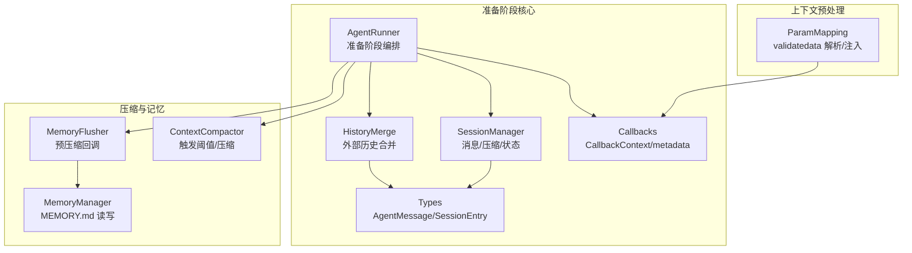
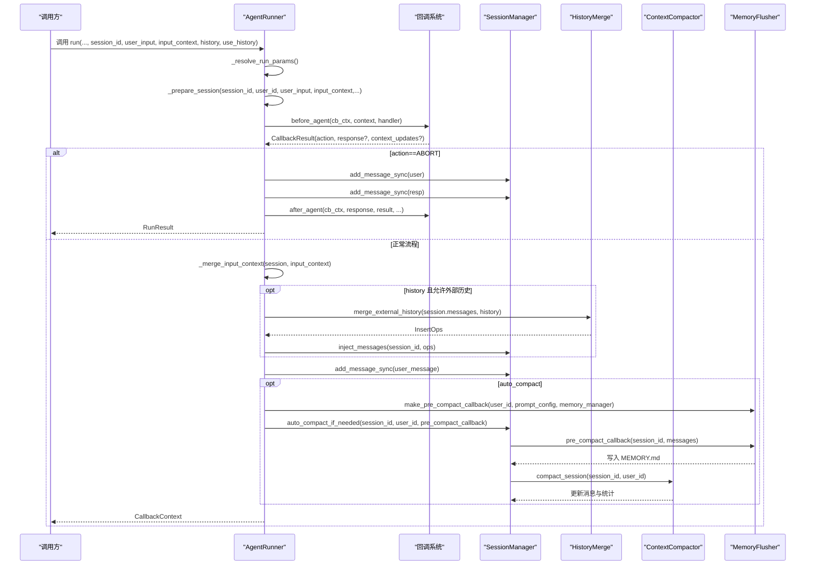
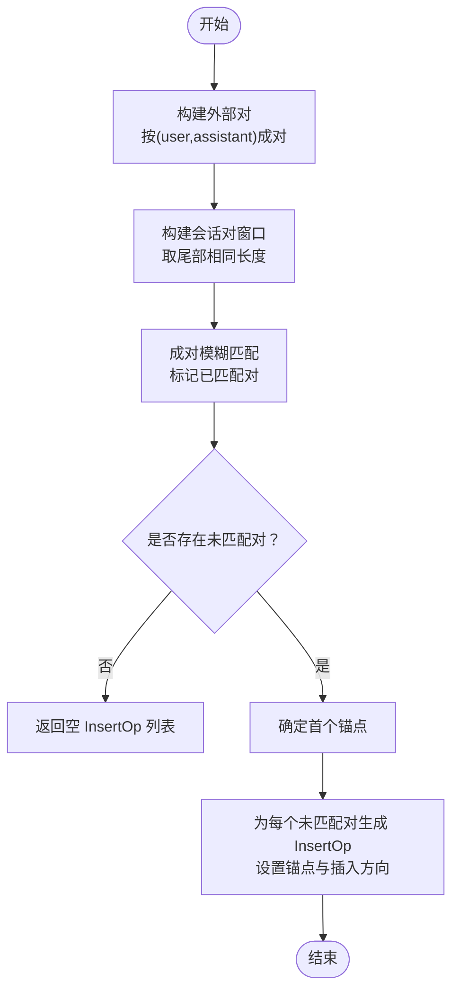
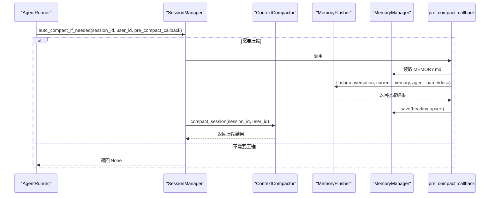
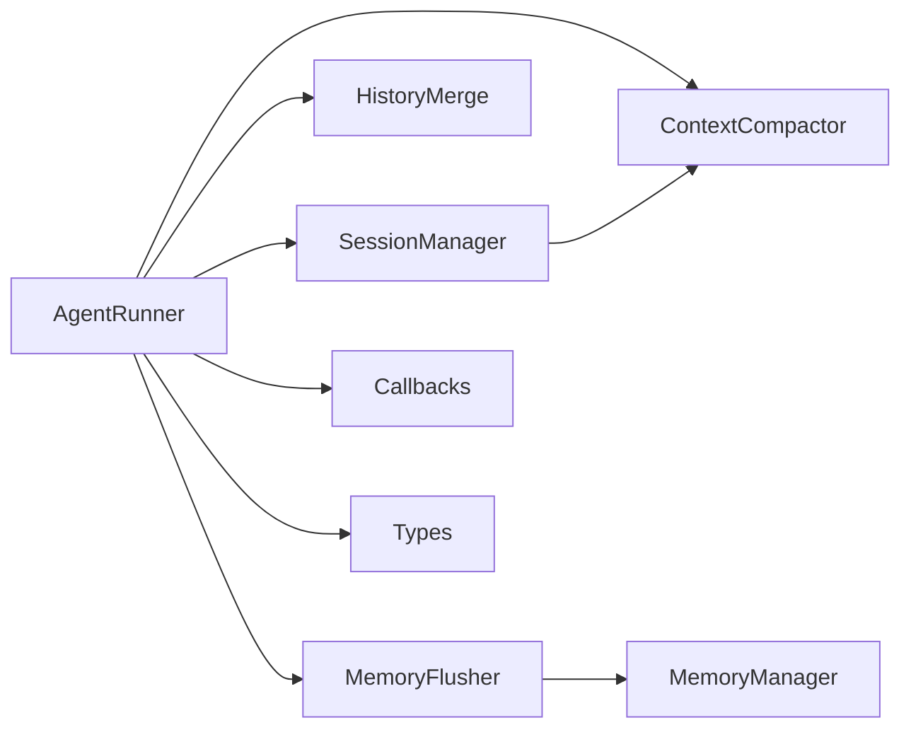

# 准备阶段

<cite>
**本文档引用的文件**
- [runner.py](file://src/ark_agentic/core/runner.py)
- [session.py](file://src/ark_agentic/core/session.py)
- [history_merge.py](file://src/ark_agentic/core/history_merge.py)
- [callbacks.py](file://src/ark_agentic/core/callbacks.py)
- [types.py](file://src/ark_agentic/core/types.py)
- [compaction.py](file://src/ark_agentic/core/compaction.py)
- [extractor.py](file://src/ark_agentic/core/memory/extractor.py)
- [manager.py](file://src/ark_agentic/core/memory/manager.py)
- [param_mapping.py](file://src/ark_agentic/agents/securities/tools/service/param_mapping.py)
- [test_runner.py](file://tests/unit/core/test_runner.py)
- [test_compaction.py](file://tests/unit/core/test_compaction.py)
- [test_param_mapping.py](file://tests/unit/agents/securities/test_param_mapping.py)
</cite>

## 目录
1. [简介](#简介)
2. [项目结构](#项目结构)
3. [核心组件](#核心组件)
4. [架构总览](#架构总览)
5. [详细组件分析](#详细组件分析)
6. [依赖分析](#依赖分析)
7. [性能考量](#性能考量)
8. [故障排查指南](#故障排查指南)
9. [结论](#结论)
10. [附录](#附录)

## 简介
本章节聚焦“准备阶段”的实现细节，涵盖以下关键流程：
- 会话准备（Session 初始化、用户身份设置、运行元数据构建）
- 上下文合并（input_context 合并到 session.state、覆盖策略）
- 历史合并（外部历史注入、消息操作序列）
- 用户消息记录（用户输入消息创建和存储）
- 自动压缩（auto_compact 触发条件、预压缩回调）

文档将逐项给出输入/输出、关键参数、异常处理与性能考量，并提供调用流程与状态转换的图示与示例路径。

## 项目结构
围绕准备阶段的关键模块与文件如下：
- runner.py：执行器入口，负责准备阶段的生命周期编排
- session.py：会话管理器，负责消息注入、自动压缩、状态同步
- history_merge.py：外部历史合并算法，计算插入操作序列
- callbacks.py：回调上下文与钩子协议，承载 run_id、metadata 等运行期元数据
- types.py：消息、会话、Token 统计等核心类型
- compaction.py：上下文压缩器与触发阈值计算
- memory/extractor.py：预压缩回调中的记忆抽取与持久化
- memory/manager.py：记忆文件读写与路径管理
- agents/securities/tools/service/param_mapping.py：上下文预处理（示例），演示“先预处理再合并”的策略

**图表来源**
- [runner.py:406-493](file://src/ark_agentic/core/runner.py#L406-L493)
- [session.py:24-482](file://src/ark_agentic/core/session.py#L24-L482)
- [history_merge.py:155-243](file://src/ark_agentic/core/history_merge.py#L155-L243)
- [callbacks.py:75-93](file://src/ark_agentic/core/callbacks.py#L75-L93)
- [types.py:199-422](file://src/ark_agentic/core/types.py#L199-L422)
- [compaction.py:423-741](file://src/ark_agentic/core/compaction.py#L423-L741)
- [extractor.py:98-187](file://src/ark_agentic/core/memory/extractor.py#L98-L187)
- [manager.py:24-92](file://src/ark_agentic/core/memory/manager.py#L24-L92)
- [param_mapping.py:211-235](file://src/ark_agentic/agents/securities/tools/service/param_mapping.py#L211-L235)

**章节来源**
- [runner.py:406-493](file://src/ark_agentic/core/runner.py#L406-L493)
- [session.py:24-482](file://src/ark_agentic/core/session.py#L24-L482)

## 核心组件
- AgentRunner.prepare_session：准备阶段主入口，串联回调、上下文合并、历史合并、用户消息记录、自动压缩
- SessionManager：负责消息注入、外部历史插入、自动压缩触发与执行、状态同步
- HistoryMerge：基于成对消息的去重与锚点定位，生成插入操作序列
- CallbackContext：承载 run_id、metadata 等运行期元数据，贯穿准备阶段
- MemoryFlusher：在压缩前抽取对话要点，写入 MEMORY.md
- MemoryManager：MEMORY.md 读写与 heading 级 upsert
- ParamMapping：上下文预处理示例，演示“先预处理再合并”的策略

**章节来源**
- [runner.py:406-493](file://src/ark_agentic/core/runner.py#L406-L493)
- [session.py:291-431](file://src/ark_agentic/core/session.py#L291-L431)
- [history_merge.py:155-243](file://src/ark_agentic/core/history_merge.py#L155-L243)
- [callbacks.py:75-93](file://src/ark_agentic/core/callbacks.py#L75-L93)
- [extractor.py:152-186](file://src/ark_agentic/core/memory/extractor.py#L152-L186)
- [manager.py:41-69](file://src/ark_agentic/core/memory/manager.py#L41-L69)
- [param_mapping.py:211-235](file://src/ark_agentic/agents/securities/tools/service/param_mapping.py#L211-L235)

## 架构总览
准备阶段的调用序列与状态转换如下：

**图表来源**
- [runner.py:312-371](file://src/ark_agentic/core/runner.py#L312-L371)
- [runner.py:406-493](file://src/ark_agentic/core/runner.py#L406-L493)
- [session.py:415-431](file://src/ark_agentic/core/session.py#L415-L431)
- [history_merge.py:155-243](file://src/ark_agentic/core/history_merge.py#L155-L243)
- [extractor.py:152-186](file://src/ark_agentic/core/memory/extractor.py#L152-L186)
- [compaction.py:458-413](file://src/ark_agentic/core/compaction.py#L458-L413)

## 详细组件分析

### 会话准备（Session 准备、用户身份设置、运行元数据构建）
- 输入
  - session_id：目标会话标识
  - user_id：用户标识
  - user_input：原始用户输入
  - input_context：请求级上下文字典
  - history/use_history：外部历史与开关
  - run_id/run_metadata：运行期标识与元数据
- 关键步骤
  - 设置 session.user_id
  - 构造 CallbackContext（包含 run_id、metadata、input_context、session 引用）
  - before_agent 钩子：支持 ABORT 早停；可合并 context_updates
  - 若 ABORT，则立即记录用户与响应消息，after_agent 钩子后返回 RunResult
  - 若继续：合并 input_context 到 session.state（覆盖策略）
- 输出
  - RunResult（ABORT 场景）
  - CallbackContext（正常场景）

关键实现位置
- [runner.py:406-493](file://src/ark_agentic/core/runner.py#L406-L493)
- [callbacks.py:75-93](file://src/ark_agentic/core/callbacks.py#L75-L93)

**章节来源**
- [runner.py:406-493](file://src/ark_agentic/core/runner.py#L406-L493)
- [callbacks.py:75-93](file://src/ark_agentic/core/callbacks.py#L75-L93)

### 上下文合并（input_context 合并到 session.state、覆盖策略）
- 行为
  - 将 input_context 的键值对浅合并到 session.state
  - 所有键始终覆盖已有值（不保留旧值）
- 异常处理
  - 无副作用函数，异常由上层钩子或调用方捕获
- 性能
  - O(k) 合并，k 为 input_context 键数
- 示例路径
  - [runner.py:585-590](file://src/ark_agentic/core/runner.py#L585-L590)

**章节来源**
- [runner.py:585-590](file://src/ark_agentic/core/runner.py#L585-L590)

### 历史合并（外部历史注入、消息操作序列）
- 输入
  - session.messages：当前会话消息列表
  - raw_history：外部历史（字典数组）
- 算法
  - 将 raw_history 按 (user, assistant) 成对分组，忽略不完整的尾部对
  - 将 session.messages 同步成对列表，取尾部与外部对数相同的窗口
  - 基于内容相似度匹配（模糊匹配），标记已匹配对
  - 未匹配的外部对生成 InsertOp（包含锚点时间戳与插入方向）
  - 若存在锚点，按锚点相对位置插入；否则追加
- 输出
  - InsertOp 列表（可能为空）
- 异常处理
  - merge_external_history 为纯函数，无内部异常；调用方负责处理空输入与空结果
- 性能
  - 外部对数 n，会话窗口 m，匹配复杂度近似 O(n·m)
- 示例路径
  - [history_merge.py:155-243](file://src/ark_agentic/core/history_merge.py#L155-L243)
  - [session.py:291-334](file://src/ark_agentic/core/session.py#L291-L334)

**图表来源**
- [history_merge.py:155-243](file://src/ark_agentic/core/history_merge.py#L155-L243)

**章节来源**
- [history_merge.py:155-243](file://src/ark_agentic/core/history_merge.py#L155-L243)
- [session.py:291-334](file://src/ark_agentic/core/session.py#L291-L334)

### 用户消息记录（用户输入消息创建和存储）
- 输入
  - user_input：用户输入
  - input_context：消息元数据（将随消息写入）
- 步骤
  - 构造 AgentMessage.user(user_input, metadata=input_context)
  - 同步添加到会话（add_message_sync），消息进入待持久化队列
- 输出
  - 会话中新增一条用户消息
- 异常处理
  - 会话不存在抛出异常（由 get_session_required 触发）
- 示例路径
  - [runner.py:470-471](file://src/ark_agentic/core/runner.py#L470-L471)
  - [types.py:199-238](file://src/ark_agentic/core/types.py#L199-L238)
  - [session.py:279-289](file://src/ark_agentic/core/session.py#L279-L289)

**章节来源**
- [runner.py:470-471](file://src/ark_agentic/core/runner.py#L470-L471)
- [types.py:199-238](file://src/ark_agentic/core/types.py#L199-L238)
- [session.py:279-289](file://src/ark_agentic/core/session.py#L279-L289)

### 自动压缩（auto_compact 触发条件、预压缩回调）
- 触发条件
  - SessionManager.needs_compaction(session_id) 返回 True
  - 由 ContextCompactor 基于安全边界估算与阈值计算
- 预压缩回调
  - MemoryFlusher.make_pre_compact_callback 生成回调
  - 回调在压缩前执行，抽取对话要点写入 MEMORY.md
- 流程
  - SessionManager.auto_compact_if_needed
    - 若需要压缩：先调用 pre_compact_callback
    - 再执行 ContextCompactor.compact，更新消息与统计
    - 最后同步会话状态
- 异常处理
  - 预压缩回调异常会被捕获并记录警告，不影响压缩流程
- 性能
  - 预压缩抽取受 MAX_FLUSH_TOKENS 限制，避免过长历史导致开销过大
- 示例路径
  - [runner.py:473-487](file://src/ark_agentic/core/runner.py#L473-L487)
  - [session.py:415-431](file://src/ark_agentic/core/session.py#L415-L431)
  - [compaction.py:450-413](file://src/ark_agentic/core/compaction.py#L450-L413)
  - [extractor.py:152-186](file://src/ark_agentic/core/memory/extractor.py#L152-L186)
  - [manager.py:41-69](file://src/ark_agentic/core/memory/manager.py#L41-L69)

**图表来源**
- [runner.py:473-487](file://src/ark_agentic/core/runner.py#L473-L487)
- [session.py:415-431](file://src/ark_agentic/core/session.py#L415-L431)
- [compaction.py:450-413](file://src/ark_agentic/core/compaction.py#L450-L413)
- [extractor.py:152-186](file://src/ark_agentic/core/memory/extractor.py#L152-L186)
- [manager.py:41-69](file://src/ark_agentic/core/memory/manager.py#L41-L69)

**章节来源**
- [runner.py:473-487](file://src/ark_agentic/core/runner.py#L473-L487)
- [session.py:415-431](file://src/ark_agentic/core/session.py#L415-L431)
- [compaction.py:450-413](file://src/ark_agentic/core/compaction.py#L450-L413)
- [extractor.py:152-186](file://src/ark_agentic/core/memory/extractor.py#L152-L186)
- [manager.py:41-69](file://src/ark_agentic/core/memory/manager.py#L41-L69)

### 上下文预处理（示例：validatedata 解析与注入）
- 目的
  - 在合并 session.state 之前，解析 validatedata 字符串，推断账户类型等派生字段
  - 仅注入不存在的键，避免覆盖显式传入的值
- 关键逻辑
  - 从 input_context["user:validatedata"] 读取原始字符串
  - 解析为键值对，拼接 user: 前缀后注入
  - 从 loginflag 推导 account_type，不覆盖显式值
- 示例路径
  - [param_mapping.py:211-235](file://src/ark_agentic/agents/securities/tools/service/param_mapping.py#L211-L235)

**章节来源**
- [param_mapping.py:211-235](file://src/ark_agentic/agents/securities/tools/service/param_mapping.py#L211-L235)

## 依赖分析
- 组件耦合
  - AgentRunner 依赖 SessionManager、HistoryMerge、ContextCompactor、MemoryFlusher
  - SessionManager 依赖 TranscriptManager、SessionStore、ContextCompactor
  - MemoryFlusher 依赖 MemoryManager 与 PromptConfig
- 外部依赖
  - LLM 客户端（LangChain BaseChatModel）用于预压缩抽取
- 潜在循环依赖
  - 无直接循环；回调与类型定义为纯数据结构，避免循环

**图表来源**
- [runner.py:203-284](file://src/ark_agentic/core/runner.py#L203-L284)
- [session.py:24-41](file://src/ark_agentic/core/session.py#L24-L41)
- [extractor.py:98-107](file://src/ark_agentic/core/memory/extractor.py#L98-L107)
- [manager.py:24-36](file://src/ark_agentic/core/memory/manager.py#L24-L36)
- [callbacks.py:172-198](file://src/ark_agentic/core/callbacks.py#L172-L198)
- [types.py:351-422](file://src/ark_agentic/core/types.py#L351-L422)

**章节来源**
- [runner.py:203-284](file://src/ark_agentic/core/runner.py#L203-L284)
- [session.py:24-41](file://src/ark_agentic/core/session.py#L24-L41)
- [extractor.py:98-107](file://src/ark_agentic/core/memory/extractor.py#L98-L107)
- [manager.py:24-36](file://src/ark_agentic/core/memory/manager.py#L24-L36)
- [callbacks.py:172-198](file://src/ark_agentic/core/callbacks.py#L172-L198)
- [types.py:351-422](file://src/ark_agentic/core/types.py#L351-L422)

## 性能考量
- 历史合并
  - 外部对数 n，会话窗口 m，匹配复杂度 O(n·m)，建议控制历史长度
- 自动压缩
  - 预压缩抽取受 MAX_FLUSH_TOKENS 限制，避免过长历史导致 LLM 调用成本过高
  - ContextCompactor 使用安全边界估算，减少频繁压缩带来的抖动
- 消息同步
  - add_message_sync 采用待持久化队列，批量写入提升吞吐
- Token 估算
  - estimate_message_tokens 与 estimate_context_usage 用于阈值判断，避免上下文溢出

[本节为通用性能讨论，无需特定文件分析]

## 故障排查指南
- 外部历史未注入
  - 检查 accept_external_history 与 use_history 开关
  - 确认 merge_external_history 返回非空 InsertOp 列表
  - 参考：[runner.py:462-468](file://src/ark_agentic/core/runner.py#L462-L468)，[history_merge.py:155-243](file://src/ark_agentic/core/history_merge.py#L155-L243)
- 自动压缩未触发
  - 确认 auto_compact 开启
  - 检查 needs_compaction 估算结果与阈值配置
  - 参考：[runner.py:473-487](file://src/ark_agentic/core/runner.py#L473-L487)，[compaction.py:450-457](file://src/ark_agentic/core/compaction.py#L450-L457)
- 预压缩回调失败
  - 查看日志 warning，确认 LLM 抽取 JSON 解析与 MEMORY.md 写入
  - 参考：[extractor.py:183-184](file://src/ark_agentic/core/memory/extractor.py#L183-L184)，[manager.py:145-150](file://src/ark_agentic/core/memory/manager.py#L145-L150)
- 会话不存在
  - get_session_required 抛出异常，检查 session_id 有效性
  - 参考：[session.py:97-101](file://src/ark_agentic/core/session.py#L97-L101)

**章节来源**
- [runner.py:462-487](file://src/ark_agentic/core/runner.py#L462-L487)
- [history_merge.py:155-243](file://src/ark_agentic/core/history_merge.py#L155-L243)
- [compaction.py:450-457](file://src/ark_agentic/core/compaction.py#L450-L457)
- [extractor.py:183-184](file://src/ark_agentic/core/memory/extractor.py#L183-L184)
- [manager.py:145-150](file://src/ark_agentic/core/memory/manager.py#L145-L150)
- [session.py:97-101](file://src/ark_agentic/core/session.py#L97-L101)

## 结论
准备阶段通过“回调—上下文—历史—消息—压缩”的有序编排，确保会话状态一致、历史完整、上下文可控。其关键在于：
- 明确的覆盖策略与预处理顺序
- 基于成对消息的稳健历史合并
- 可靠的自动压缩与预压缩记忆抽取
- 清晰的运行期元数据（run_id、metadata）贯穿全流程

[本节为总结性内容，无需特定文件分析]

## 附录
- 相关测试参考
  - [test_runner.py](file://tests/unit/core/test_runner.py)
  - [test_compaction.py](file://tests/unit/core/test_compaction.py)
  - [test_param_mapping.py](file://tests/unit/agents/securities/test_param_mapping.py)