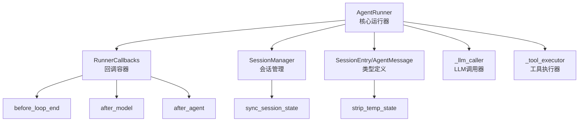
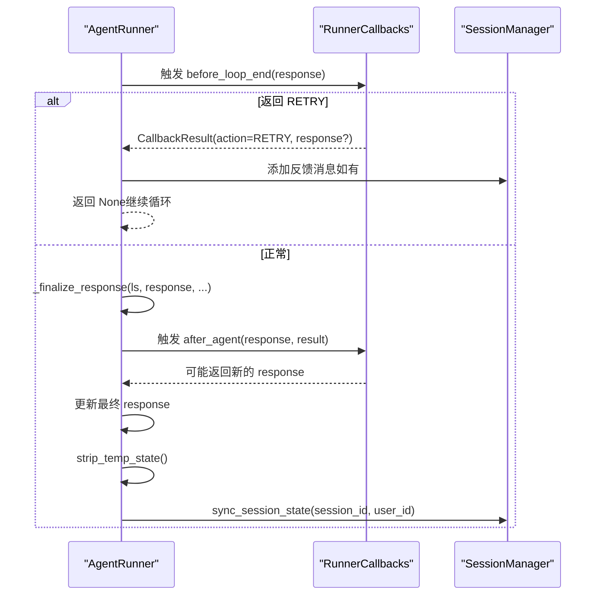
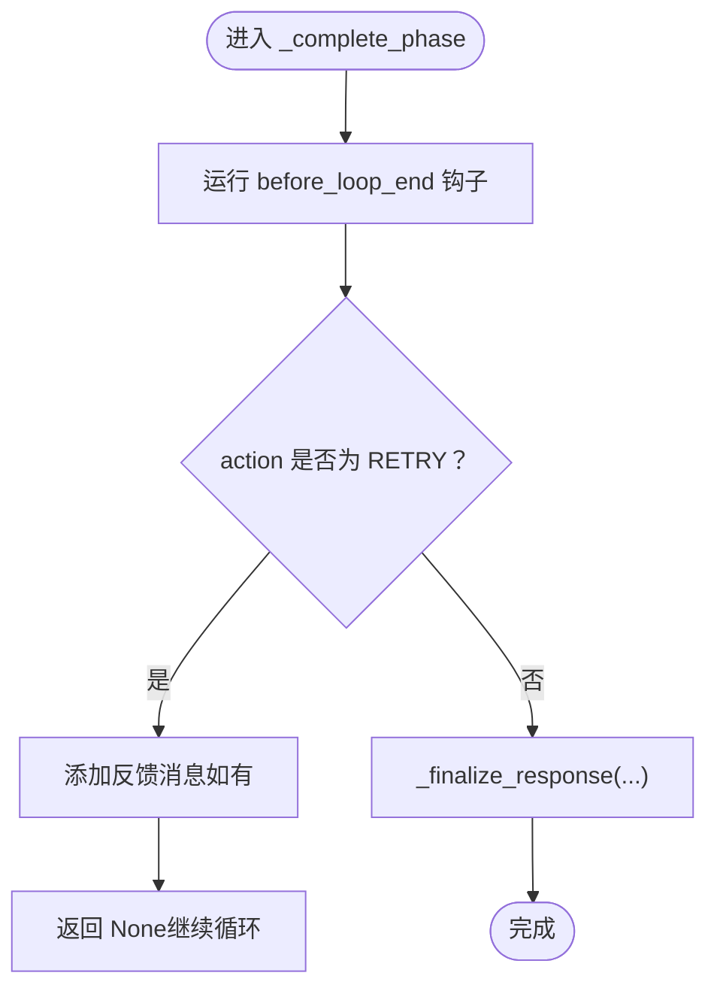
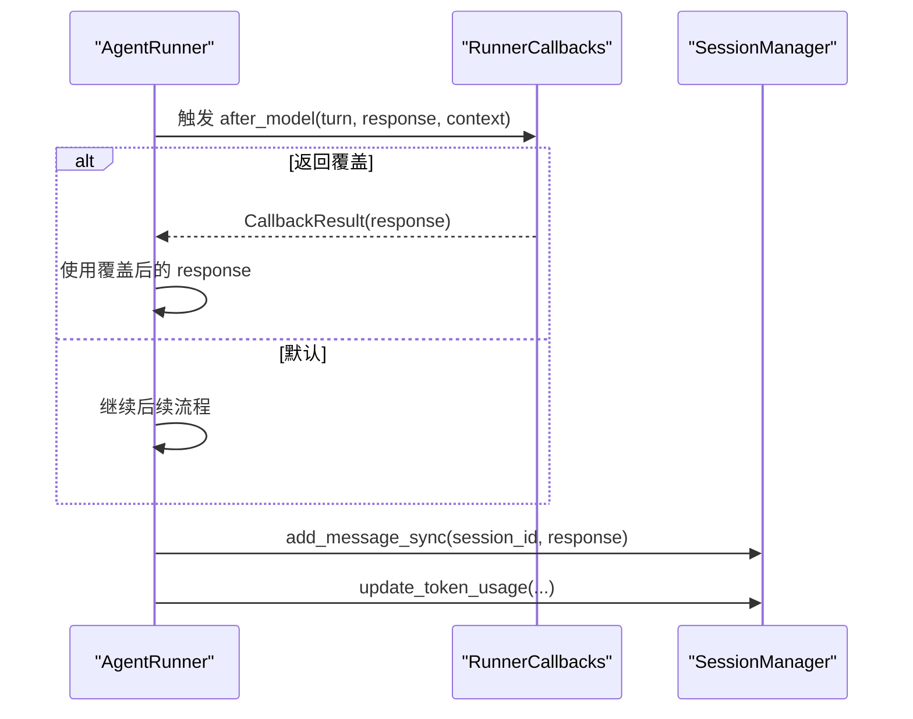
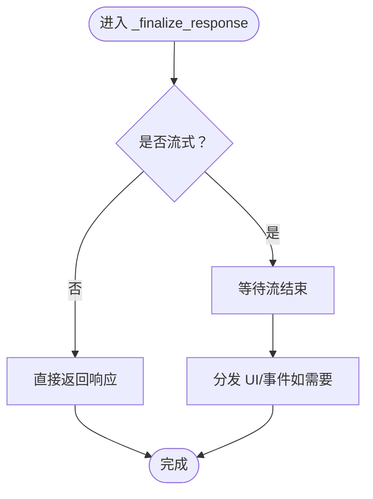
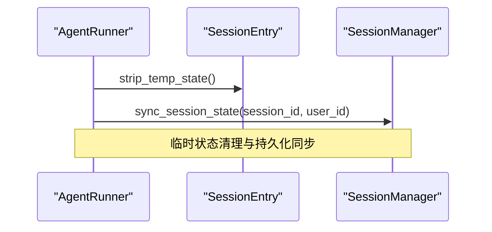
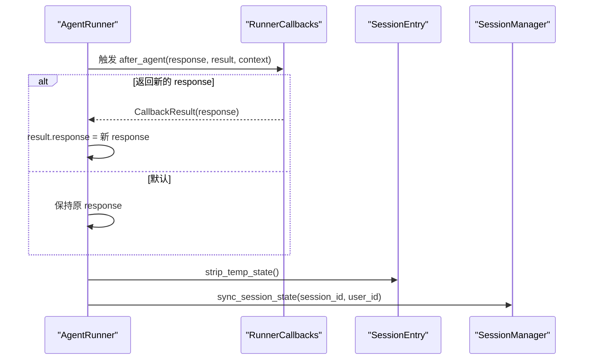
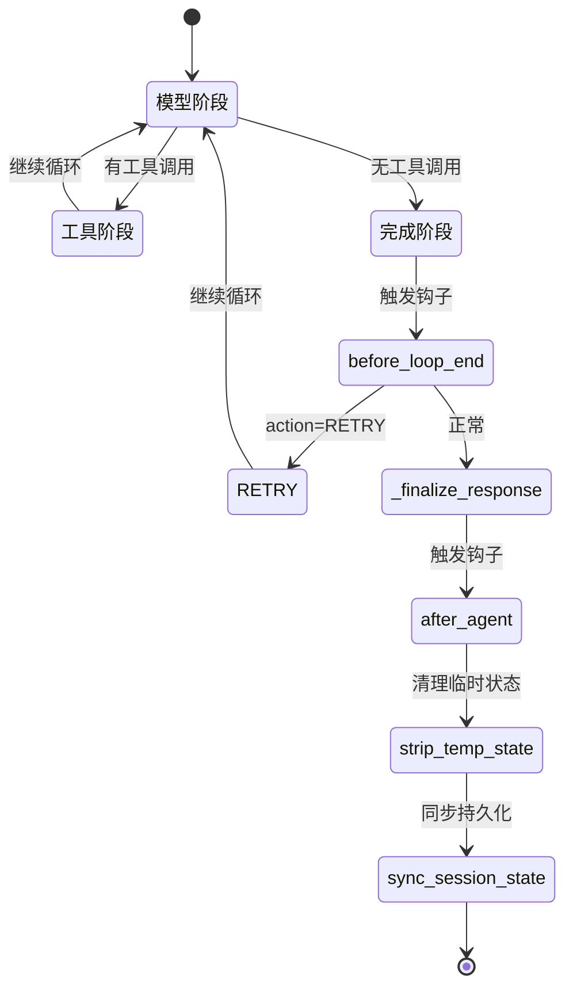
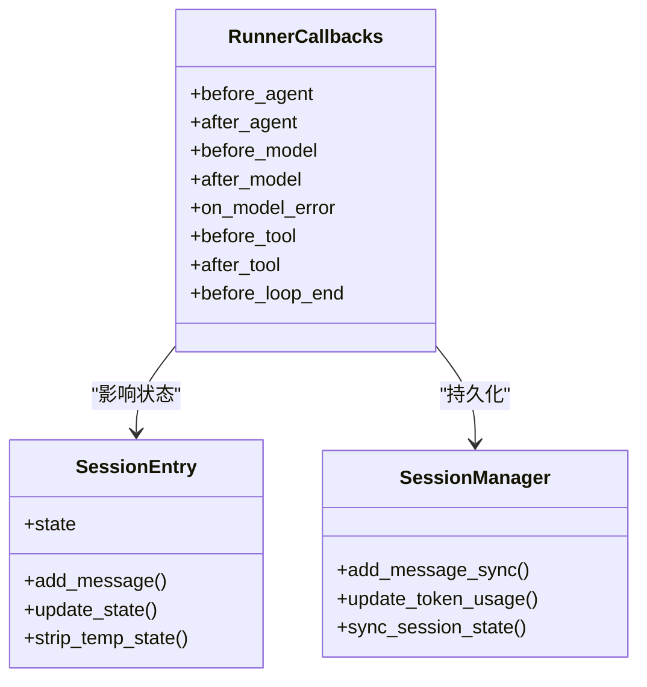

# 完成阶段

<cite>
**本文引用的文件**
- [runner.py](file://src/ark_agentic/core/runner.py)
- [callbacks.py](file://src/ark_agentic/core/callbacks.py)
- [session.py](file://src/ark_agentic/core/session.py)
- [types.py](file://src/ark_agentic/core/types.py)
- [agent.py](file://src/ark_agentic/agents/securities/agent.py)
</cite>

## 目录
1. [简介](#简介)
2. [项目结构](#项目结构)
3. [核心组件](#核心组件)
4. [架构总览](#架构总览)
5. [详细组件分析](#详细组件分析)
6. [依赖关系分析](#依赖关系分析)
7. [性能考量](#性能考量)
8. [故障排查指南](#故障排查指南)
9. [结论](#结论)

## 简介
本章节聚焦“完成阶段”的完整实现，涵盖以下关键流程与行为：
- 循环结束钩子（before_loop_end）的触发与处理
- RETRY 机制：在 before_loop_end 中注入反馈促使模型重试
- 响应覆盖：after_model 钩子对模型输出进行覆盖
- 响应最终化（_finalize_response）：非流式与流式响应的收尾处理
- 会话状态清理：strip_temp_state 清理临时状态、sync_session_state 同步持久化
- 回调执行：after_agent 钩子、响应替换、上下文更新
- 输入输出、关键参数、异常处理与性能优化要点
- 提供可定位的代码片段路径，便于进一步查阅

## 项目结构
完成阶段位于核心运行器中，围绕 Runner 的 ReAct 循环展开，涉及回调系统、会话管理与类型定义。

图表来源
- [runner.py:622-650](file://src/ark_agentic/core/runner.py#L622-L650)
- [callbacks.py:172-198](file://src/ark_agentic/core/callbacks.py#L172-L198)
- [session.py:240-262](file://src/ark_agentic/core/session.py#L240-L262)
- [types.py:419-422](file://src/ark_agentic/core/types.py#L419-L422)

章节来源
- [runner.py:495-520](file://src/ark_agentic/core/runner.py#L495-L520)
- [callbacks.py:1-198](file://src/ark_agentic/core/callbacks.py#L1-L198)
- [session.py:235-434](file://src/ark_agentic/core/session.py#L235-L434)
- [types.py:410-422](file://src/ark_agentic/core/types.py#L410-L422)

## 核心组件
- 完成阶段入口：_complete_phase
- 响应最终化：_finalize_response
- 会话状态清理：strip_temp_state、sync_session_state
- 回调系统：RunnerCallbacks、BeforeLoopEndCallback、AfterAgentCallback
- 会话实体：SessionEntry、SessionManager

章节来源
- [runner.py:734-758](file://src/ark_agentic/core/runner.py#L734-L758)
- [runner.py:495-520](file://src/ark_agentic/core/runner.py#L495-L520)
- [callbacks.py:158-167](file://src/ark_agentic/core/callbacks.py#L158-L167)
- [session.py:240-262](file://src/ark_agentic/core/session.py#L240-L262)
- [types.py:419-422](file://src/ark_agentic/core/types.py#L419-L422)

## 架构总览
完成阶段处于 ReAct 循环的收尾位置，负责在模型产生最终非工具调用响应后，执行 before_loop_end 钩子、决定是否 RETRY 或进入 _finalize_response，随后在 run 结束后执行 after_agent 钩子并清理会话状态。

图表来源
- [runner.py:734-758](file://src/ark_agentic/core/runner.py#L734-L758)
- [runner.py:495-520](file://src/ark_agentic/core/runner.py#L495-L520)
- [callbacks.py:158-167](file://src/ark_agentic/core/callbacks.py#L158-L167)

## 详细组件分析

### 循环结束钩子（before_loop_end）与 RETRY 机制
- 触发时机：当模型产生最终（非工具调用）响应时，在进入 _finalize_response 前触发
- 行为语义：
  - PASS/None：继续正常流程，进入 _finalize_response
  - RETRY：注入反馈消息（可选），将该消息作为用户消息加入会话，然后返回 None，使循环继续一轮
- 关键参数：
  - response：最终模型输出
  - handler：事件处理器（用于 UI/SSE 事件分发）
- 异常与边界：
  - 若钩子返回 RETRY 且携带 response，则将其追加到会话中再继续
  - 若无 RETRY，则直接进入 _finalize_response

图表来源
- [runner.py:744-758](file://src/ark_agentic/core/runner.py#L744-L758)

章节来源
- [runner.py:744-758](file://src/ark_agentic/core/runner.py#L744-L758)
- [callbacks.py:158-167](file://src/ark_agentic/core/callbacks.py#L158-L167)

### 响应覆盖（after_model）
- 触发时机：模型成功生成响应后、持久化前
- 行为语义：
  - 若钩子返回 OVERRIDE 且携带 response，则用该 response 覆盖模型输出
  - 同时记录 token 使用量、finish_reason，并将响应写入会话
- 关键参数：
  - turn：当前轮次
  - response：模型输出
  - context：当前上下文（可能被钩子更新）
  - handler：事件处理器
- 异常与边界：
  - on_model_error 与 after_model 互斥（前者在 LLMError 时触发）

图表来源
- [runner.py:842-880](file://src/ark_agentic/core/runner.py#L842-L880)

章节来源
- [runner.py:774-880](file://src/ark_agentic/core/runner.py#L774-L880)
- [callbacks.py:125-131](file://src/ark_agentic/core/callbacks.py#L125-L131)

### 响应最终化（_finalize_response）
- 非流式响应：直接返回最终 AgentMessage
- 流式响应：在流结束后进行收尾处理（如 UI 组件渲染、事件推送等）
- 与 UI 的关系：handler 用于分发文本增量、思考增量、UI 组件等事件
- 关键参数：
  - ls：循环状态
  - response：最终响应
  - session_id、handler：会话与事件处理器

图表来源
- [runner.py:760-880](file://src/ark_agentic/core/runner.py#L760-L880)

章节来源
- [runner.py:760-880](file://src/ark_agentic/core/runner.py#L760-L880)

### 会话状态清理（strip_temp_state 与 sync_session_state）
- strip_temp_state：移除 state 中以 temp: 开头的临时键，防止污染长期状态
- sync_session_state：将会话的消息、状态、token 使用等同步到存储层
- 触发时机：after_agent 钩子之后，strip_temp_state 先清理，再同步

图表来源
- [runner.py:495-520](file://src/ark_agentic/core/runner.py#L495-L520)
- [types.py:419-422](file://src/ark_agentic/core/types.py#L419-L422)
- [session.py:240-262](file://src/ark_agentic/core/session.py#L240-L262)

章节来源
- [runner.py:495-520](file://src/ark_agentic/core/runner.py#L495-L520)
- [types.py:419-422](file://src/ark_agentic/core/types.py#L419-L422)
- [session.py:240-262](file://src/ark_agentic/core/session.py#L240-L262)

### 回调执行（after_agent）与响应替换、上下文更新
- after_agent：在整次 run 完成后触发，接收 response 与 RunResult
- 行为语义：
  - 可返回新的 response 以替换最终输出
  - 可通过 context_updates 影响输入上下文
- 与会话状态的关系：先替换 response，再清理临时状态并同步

图表来源
- [runner.py:495-520](file://src/ark_agentic/core/runner.py#L495-L520)
- [callbacks.py:108-113](file://src/ark_agentic/core/callbacks.py#L108-L113)

章节来源
- [runner.py:495-520](file://src/ark_agentic/core/runner.py#L495-L520)
- [callbacks.py:108-113](file://src/ark_agentic/core/callbacks.py#L108-L113)

### 完成阶段调用流程与状态转换（端到端）
- 输入：session_id、_LoopState、AgentMessage（response）、state、handler、cb_ctx
- 输出：RunResult（最终结果）或 None（RETRY 时）
- 关键状态：
  - before_loop_end：决定是否 RETRY
  - _finalize_response：非流式/流式响应收尾
  - after_agent：最终响应替换与上下文更新
  - strip_temp_state/sync_session_state：清理与持久化

图表来源
- [runner.py:652-694](file://src/ark_agentic/core/runner.py#L652-L694)
- [runner.py:734-758](file://src/ark_agentic/core/runner.py#L734-L758)
- [runner.py:495-520](file://src/ark_agentic/core/runner.py#L495-L520)

章节来源
- [runner.py:652-694](file://src/ark_agentic/core/runner.py#L652-L694)
- [runner.py:734-758](file://src/ark_agentic/core/runner.py#L734-L758)
- [runner.py:495-520](file://src/ark_agentic/core/runner.py#L495-L520)

## 依赖关系分析
- RunnerCallbacks 容器聚合各类钩子，按生命周期顺序触发
- SessionEntry 与 SessionManager 提供状态与持久化能力
- 类型系统中的 AgentMessage、ToolCall、AgentToolResult 等支撑消息与工具调用的数据结构

图表来源
- [callbacks.py:172-198](file://src/ark_agentic/core/callbacks.py#L172-L198)
- [types.py:419-422](file://src/ark_agentic/core/types.py#L419-L422)
- [session.py:240-262](file://src/ark_agentic/core/session.py#L240-L262)

章节来源
- [callbacks.py:172-198](file://src/ark_agentic/core/callbacks.py#L172-L198)
- [types.py:419-422](file://src/ark_agentic/core/types.py#L419-L422)
- [session.py:240-262](file://src/ark_agentic/core/session.py#L240-L262)

## 性能考量
- 流式响应：通过 handler 分发增量内容，降低前端等待时间，提升交互体验
- 临时状态清理：避免 temp: 前缀键长期驻留，减少状态膨胀
- token 统计：在 after_model 阶段统一累加，便于成本控制与上限检测
- 会话同步：批量 pending 消息一次性同步，减少磁盘 IO 次数

## 故障排查指南
- before_loop_end 返回 RETRY 但未注入反馈消息
  - 现象：循环继续但无明显提示
  - 排查：确认钩子是否设置 response 字段
  - 参考路径：[runner.py:751-755](file://src/ark_agentic/core/runner.py#L751-L755)
- after_agent 替换响应无效
  - 现象：最终输出未变化
  - 排查：确认钩子返回的 CallbackResult 是否包含 response
  - 参考路径：[runner.py:512-514](file://src/ark_agentic/core/runner.py#L512-L514)
- 临时状态未清理导致后续轮次状态污染
  - 现象：状态键残留
  - 排查：确认 _finalize_run 是否调用了 strip_temp_state
  - 参考路径：[runner.py](file://src/ark_agentic/core/runner.py#L515)
- 会话状态未持久化
  - 现象：重启后状态丢失
  - 排查：确认 sync_session_state 是否被调用
  - 参考路径：[runner.py](file://src/ark_agentic/core/runner.py#L516)、[session.py:240-262](file://src/ark_agentic/core/session.py#L240-L262)

章节来源
- [runner.py:751-755](file://src/ark_agentic/core/runner.py#L751-L755)
- [runner.py:512-516](file://src/ark_agentic/core/runner.py#L512-L516)
- [session.py:240-262](file://src/ark_agentic/core/session.py#L240-L262)

## 结论
完成阶段通过 before_loop_end、_finalize_response、after_agent、strip_temp_state 与 sync_session_state 的协同，实现了从模型最终响应到会话持久化的闭环。RETRY 机制与响应覆盖为系统提供了强大的可控性与可扩展性；流式响应与事件分发提升了用户体验。遵循本文的输入输出、参数与异常处理建议，可确保完成阶段在复杂场景下的稳定性与性能表现。