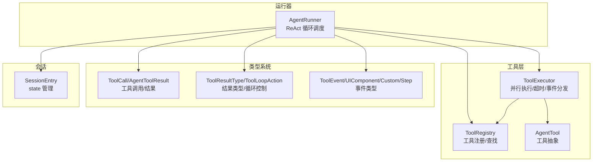
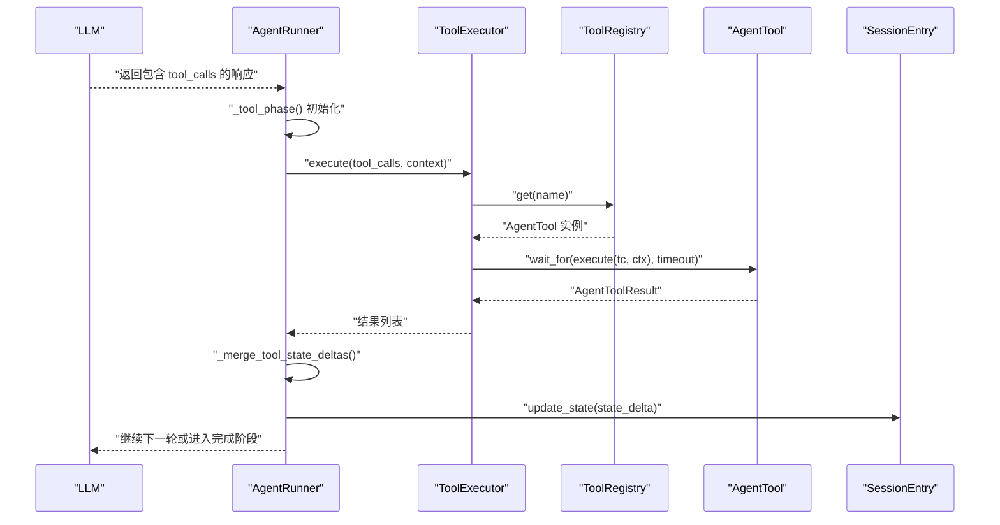
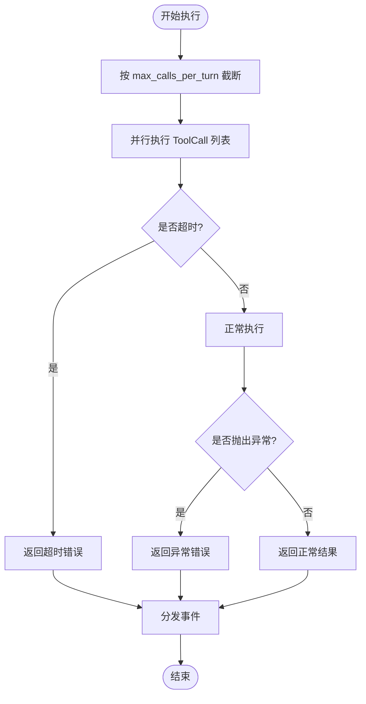
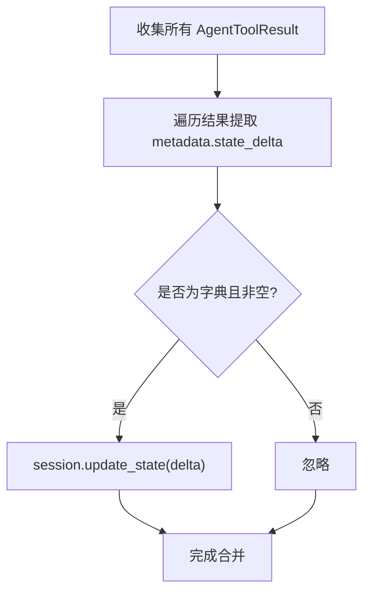
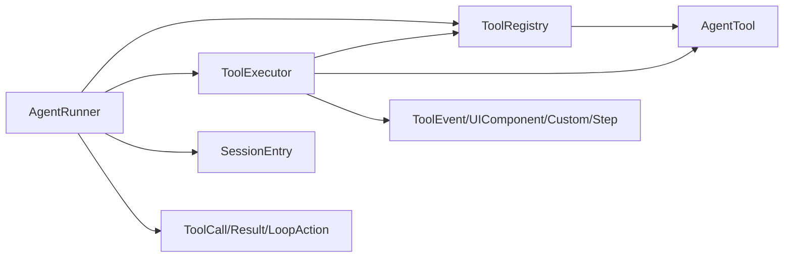

# 工具调用阶段

<cite>
**本文引用的文件**
- [src/ark_agentic/core/runner.py](file://src/ark_agentic/core/runner.py)
- [src/ark_agentic/core/tools/executor.py](file://src/ark_agentic/core/tools/executor.py)
- [src/ark_agentic/core/tools/base.py](file://src/ark_agentic/core/tools/base.py)
- [src/ark_agentic/core/tools/registry.py](file://src/ark_agentic/core/tools/registry.py)
- [src/ark_agentic/core/types.py](file://src/ark_agentic/core/types.py)
- [src/ark_agentic/core/session.py](file://src/ark_agentic/core/session.py)
- [tests/unit/core/test_tool_executor.py](file://tests/unit/core/test_tool_executor.py)
- [tests/unit/core/test_executor_parallel.py](file://tests/unit/core/test_executor_parallel.py)
</cite>

## 目录
1. [简介](#简介)
2. [项目结构](#项目结构)
3. [核心组件](#核心组件)
4. [架构总览](#架构总览)
5. [详细组件分析](#详细组件分析)
6. [依赖分析](#依赖分析)
7. [性能考量](#性能考量)
8. [故障排查指南](#故障排查指南)
9. [结论](#结论)

## 简介
本章节聚焦“工具调用阶段”的完整实现，涵盖以下关键流程与机制：
- 工具选择与解析：从 LLM 输出中提取 ToolCall 列表，进行数量限制与调度。
- 工具参数验证与安全检查：基于工具 JSON Schema 的参数校验与默认值处理。
- 工具执行：ToolExecutor 并行执行、超时控制、错误兜底、事件分发。
- 结果处理：AgentToolResult 的创建、事件聚合、状态增量合并、循环控制信号。
- 工具状态更新：state_delta 合并至 session.state。
- 循环继续判断：工具调用次数限制、是否继续下一轮或进入完成阶段。

## 项目结构
围绕工具调用阶段的相关模块组织如下：
- 核心运行器：负责 ReAct 循环、模型推理、工具阶段调度与最终收尾。
- 工具层：工具抽象、注册表、执行器与事件分发。
- 类型系统：统一的工具调用、结果、事件与循环控制信号。
- 会话管理：维护 session.state，并支持状态增量合并。

图表来源
- [src/ark_agentic/core/runner.py:882-900](file://src/ark_agentic/core/runner.py#L882-L900)
- [src/ark_agentic/core/tools/executor.py:29-127](file://src/ark_agentic/core/tools/executor.py#L29-L127)
- [src/ark_agentic/core/tools/registry.py:14-93](file://src/ark_agentic/core/tools/registry.py#L14-L93)
- [src/ark_agentic/core/tools/base.py:46-116](file://src/ark_agentic/core/tools/base.py#L46-L116)
- [src/ark_agentic/core/types.py:27-42](file://src/ark_agentic/core/types.py#L27-L42)
- [src/ark_agentic/core/session.py:350-422](file://src/ark_agentic/core/session.py#L350-L422)

章节来源
- [src/ark_agentic/core/runner.py:882-900](file://src/ark_agentic/core/runner.py#L882-L900)
- [src/ark_agentic/core/tools/executor.py:29-127](file://src/ark_agentic/core/tools/executor.py#L29-L127)
- [src/ark_agentic/core/tools/registry.py:14-93](file://src/ark_agentic/core/tools/registry.py#L14-L93)
- [src/ark_agentic/core/tools/base.py:46-116](file://src/ark_agentic/core/tools/base.py#L46-L116)
- [src/ark_agentic/core/types.py:27-42](file://src/ark_agentic/core/types.py#L27-L42)
- [src/ark_agentic/core/session.py:350-422](file://src/ark_agentic/core/session.py#L350-L422)

## 核心组件
- AgentRunner._tool_phase：触发工具阶段，负责工具调用、状态合并、事件持久化与循环控制。
- ToolExecutor：并行执行 ToolCall 列表，统一处理超时、错误与事件分发。
- ToolRegistry：工具注册与查找，提供 JSON Schema 与过滤能力。
- AgentTool：工具抽象基类，定义 execute 接口与参数读取辅助函数。
- AgentToolResult：工具结果载体，支持多种结果类型与事件集合。
- SessionEntry：会话状态容器，支持 state_delta 的浅合并。

章节来源
- [src/ark_agentic/core/runner.py:882-900](file://src/ark_agentic/core/runner.py#L882-L900)
- [src/ark_agentic/core/tools/executor.py:29-127](file://src/ark_agentic/core/tools/executor.py#L29-L127)
- [src/ark_agentic/core/tools/registry.py:14-93](file://src/ark_agentic/core/tools/registry.py#L14-L93)
- [src/ark_agentic/core/tools/base.py:46-116](file://src/ark_agentic/core/tools/base.py#L46-L116)
- [src/ark_agentic/core/types.py:85-196](file://src/ark_agentic/core/types.py#L85-L196)
- [src/ark_agentic/core/session.py:350-422](file://src/ark_agentic/core/session.py#L350-L422)

## 架构总览
工具调用阶段在 ReAct 循环中的位置与交互如下：

图表来源
- [src/ark_agentic/core/runner.py:882-900](file://src/ark_agentic/core/runner.py#L882-L900)
- [src/ark_agentic/core/tools/executor.py:43-100](file://src/ark_agentic/core/tools/executor.py#L43-L100)
- [src/ark_agentic/core/tools/registry.py:41-50](file://src/ark_agentic/core/tools/registry.py#L41-L50)
- [src/ark_agentic/core/tools/base.py:103-116](file://src/ark_agentic/core/tools/base.py#L103-L116)
- [src/ark_agentic/core/session.py:414-417](file://src/ark_agentic/core/session.py#L414-L417)

## 详细组件分析

### 工具选择与解析（tool_calls）
- 输入：来自 LLM 的响应消息，包含 tool_calls 列表。
- 解析与限制：
  - 从响应中提取 tool_calls。
  - 使用 Runner 配置中的最大工具调用数限制单轮调用数量。
- 关键参数：
  - ToolCall.id/name/arguments。
  - Runner.config.max_tool_calls_per_turn。
- 异常处理：
  - 当工具调用超过限制时，记录警告日志并截断调用列表。
- 性能考虑：
  - 单轮限制避免资源耗尽与长尾延迟。

章节来源
- [src/ark_agentic/core/runner.py:882-900](file://src/ark_agentic/core/runner.py#L882-L900)
- [src/ark_agentic/core/types.py:70-83](file://src/ark_agentic/core/types.py#L70-L83)

### 工具参数验证与安全检查
- 参数读取辅助：
  - 提供字符串、整数、浮点、布尔、列表、字典等参数读取与必填校验函数。
  - 对非法类型进行安全降级（返回默认值或抛出异常）。
- JSON Schema：
  - AgentTool.get_json_schema 生成 OpenAI 兼容的函数调用 schema，便于 LLM 正确构造参数。
- 安全要点：
  - 严格区分“参数读取”与“工具执行”，前者保证类型安全，后者负责业务逻辑与外部调用。

章节来源
- [src/ark_agentic/core/tools/base.py:169-289](file://src/ark_agentic/core/tools/base.py#L169-L289)
- [src/ark_agentic/core/tools/base.py:79-101](file://src/ark_agentic/core/tools/base.py#L79-L101)

### 工具执行（ToolExecutor 调用、超时处理、并发控制）
- 并发策略：
  - 使用 asyncio.gather 并行执行最多 max_calls_per_turn 个 ToolCall。
  - 并行执行期间，各工具互不可见彼此产生的 state_delta。
- 超时控制：
  - 每个工具执行设置超时阈值，超时返回错误结果。
- 错误兜底：
  - 工具不存在、执行异常、超时均转化为 AgentToolResult.error_result。
- 事件分发：
  - 统一分发 UIComponent/Custom/Step 等事件到 AgentEventHandler。
- 关键参数：
  - timeout、max_calls_per_turn。
- 性能考虑：
  - 并行显著降低多工具总耗时；超时与错误不影响其他工具执行。

图表来源
- [src/ark_agentic/core/tools/executor.py:43-100](file://src/ark_agentic/core/tools/executor.py#L43-L100)
- [tests/unit/core/test_executor_parallel.py:41-143](file://tests/unit/core/test_executor_parallel.py#L41-L143)

章节来源
- [src/ark_agentic/core/tools/executor.py:43-100](file://src/ark_agentic/core/tools/executor.py#L43-L100)
- [tests/unit/core/test_tool_executor.py:47-70](file://tests/unit/core/test_tool_executor.py#L47-L70)
- [tests/unit/core/test_executor_parallel.py:41-143](file://tests/unit/core/test_executor_parallel.py#L41-L143)

### 结果处理（AgentToolResult 创建、状态增量合并、错误处理）
- AgentToolResult：
  - 提供 json/text/image/a2ui/error 等工厂方法。
  - 支持 metadata（含 state_delta）、loop_action（CONTINUE/STOP）、events 列表。
- 事件聚合：
  - ToolExecutor 统一分发事件到 AgentEventHandler。
- 错误处理：
  - 所有异常均封装为 is_error=True 的结果，保留原始错误信息。
- 循环控制：
  - 若任一结果 loop_action=STOP，则提前终止本轮工具阶段。

章节来源
- [src/ark_agentic/core/types.py:85-196](file://src/ark_agentic/core/types.py#L85-L196)
- [src/ark_agentic/core/tools/executor.py:110-127](file://src/ark_agentic/core/tools/executor.py#L110-L127)
- [tests/unit/core/test_tool_executor.py:121-134](file://tests/unit/core/test_tool_executor.py#L121-L134)

### 工具状态更新（state_delta 合并到 session.state）
- 合并时机：
  - 在工具执行完成后，由 Runner 调用 _merge_tool_state_deltas 将所有结果的 state_delta 浅合并到 session.state。
- 注意事项：
  - 并行执行期间各工具互相不可见彼此的 state_delta；合并发生在所有工具执行完毕之后。
- 数据结构：
  - state_delta 为字典，键值对直接覆盖 session.state。

图表来源
- [src/ark_agentic/core/runner.py:575-582](file://src/ark_agentic/core/runner.py#L575-L582)
- [src/ark_agentic/core/session.py:414-417](file://src/ark_agentic/core/session.py#L414-L417)
- [tests/unit/core/test_executor_parallel.py:58-76](file://tests/unit/core/test_executor_parallel.py#L58-L76)

章节来源
- [src/ark_agentic/core/runner.py:575-582](file://src/ark_agentic/core/runner.py#L575-L582)
- [src/ark_agentic/core/session.py:414-417](file://src/ark_agentic/core/session.py#L414-L417)
- [tests/unit/core/test_executor_parallel.py:58-76](file://tests/unit/core/test_executor_parallel.py#L58-L76)

### 循环继续判断（工具调用次数限制、继续下一轮或进入完成阶段）
- 继续条件：
  - 若任一工具结果 loop_action=STOP，则提前结束工具阶段，返回 RUN 结果。
  - 否则继续下一轮 LLM 推理。
- 限制与保护：
  - 单轮工具调用数受 max_tool_calls_per_turn 限制。
  - 整体轮数受 max_turns 限制，避免无限循环。
- 用户友好提示：
  - 执行器在工具错误时发送“尝试其他方式”等提示事件。

章节来源
- [src/ark_agentic/core/runner.py:882-900](file://src/ark_agentic/core/runner.py#L882-L900)
- [src/ark_agentic/core/runner.py:668-730](file://src/ark_agentic/core/runner.py#L668-L730)
- [src/ark_agentic/core/tools/executor.py:110-127](file://src/ark_agentic/core/tools/executor.py#L110-L127)

## 依赖分析
- Runner 依赖：
  - ToolRegistry：提供工具实例与过滤能力。
  - ToolExecutor：执行工具并返回结果。
  - SessionEntry：维护与更新会话状态。
  - AgentToolResult/ToolCall/ToolLoopAction：统一的数据结构与控制信号。
- ToolExecutor 依赖：
  - ToolRegistry：按名称查找工具。
  - AgentTool：实际执行逻辑。
  - AgentEventHandler：事件分发。
- ToolRegistry 依赖：
  - AgentTool：注册与查找工具实例。
- AgentTool 依赖：
  - 参数读取辅助函数：确保参数类型安全。
  - ToolCall/AgentToolResult：输入输出契约。

图表来源
- [src/ark_agentic/core/runner.py:882-900](file://src/ark_agentic/core/runner.py#L882-L900)
- [src/ark_agentic/core/tools/executor.py:29-127](file://src/ark_agentic/core/tools/executor.py#L29-L127)
- [src/ark_agentic/core/tools/registry.py:14-93](file://src/ark_agentic/core/tools/registry.py#L14-L93)
- [src/ark_agentic/core/tools/base.py:46-116](file://src/ark_agentic/core/tools/base.py#L46-L116)
- [src/ark_agentic/core/types.py:70-196](file://src/ark_agentic/core/types.py#L70-L196)

章节来源
- [src/ark_agentic/core/runner.py:882-900](file://src/ark_agentic/core/runner.py#L882-L900)
- [src/ark_agentic/core/tools/executor.py:29-127](file://src/ark_agentic/core/tools/executor.py#L29-L127)
- [src/ark_agentic/core/tools/registry.py:14-93](file://src/ark_agentic/core/tools/registry.py#L14-L93)
- [src/ark_agentic/core/tools/base.py:46-116](file://src/ark_agentic/core/tools/base.py#L46-L116)
- [src/ark_agentic/core/types.py:70-196](file://src/ark_agentic/core/types.py#L70-L196)

## 性能考量
- 并行执行：ToolExecutor 使用 asyncio.gather 并行执行多个工具，显著降低总耗时。
- 超时控制：为每个工具设置超时阈值，避免阻塞影响整体吞吐。
- 单轮上限：max_tool_calls_per_turn 限制每轮工具数量，防止资源滥用。
- 事件分发：事件在执行完成后统一分发，避免在执行路径上引入额外开销。
- 状态合并：state_delta 在工具执行结束后统一合并，避免并行场景下的竞态。

## 故障排查指南
- 工具未找到：
  - 现象：返回错误结果，内容包含“not found”。
  - 排查：确认工具已在 ToolRegistry 中注册，名称与 LLM 输出一致。
- 执行超时：
  - 现象：返回超时错误，包含工具名与超时秒数。
  - 排查：提升 tool_timeout，优化工具内部逻辑或外部依赖。
- 执行异常：
  - 现象：返回异常错误，内容为异常字符串。
  - 排查：查看工具内部日志，修复参数或外部依赖。
- 并行状态不可见：
  - 现象：同一轮内工具间无法看到彼此的 state_delta。
  - 说明：这是预期行为，state_delta 在工具执行完成后统一合并。
- 事件未到达前端：
  - 现象：前端未收到 UIComponent/Custom/Step 事件。
  - 排查：确认 ToolExecutor 的 handler 非空，且工具返回的 events 包含相应类型。

章节来源
- [tests/unit/core/test_tool_executor.py:47-56](file://tests/unit/core/test_tool_executor.py#L47-L56)
- [tests/unit/core/test_executor_parallel.py:109-143](file://tests/unit/core/test_executor_parallel.py#L109-L143)
- [src/ark_agentic/core/tools/executor.py:77-100](file://src/ark_agentic/core/tools/executor.py#L77-L100)

## 结论
工具调用阶段通过“并行执行 + 统一事件分发 + 严格的超时与错误兜底 + 单轮调用上限”实现了高可靠与高性能的工具链路。配合 state_delta 的统一合并与循环控制信号，系统能够在复杂业务场景中稳定推进 ReAct 循环，逐步完成用户目标。