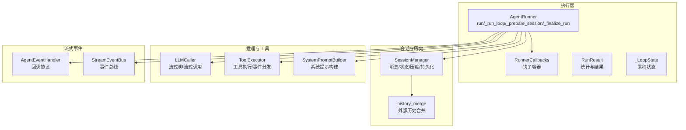
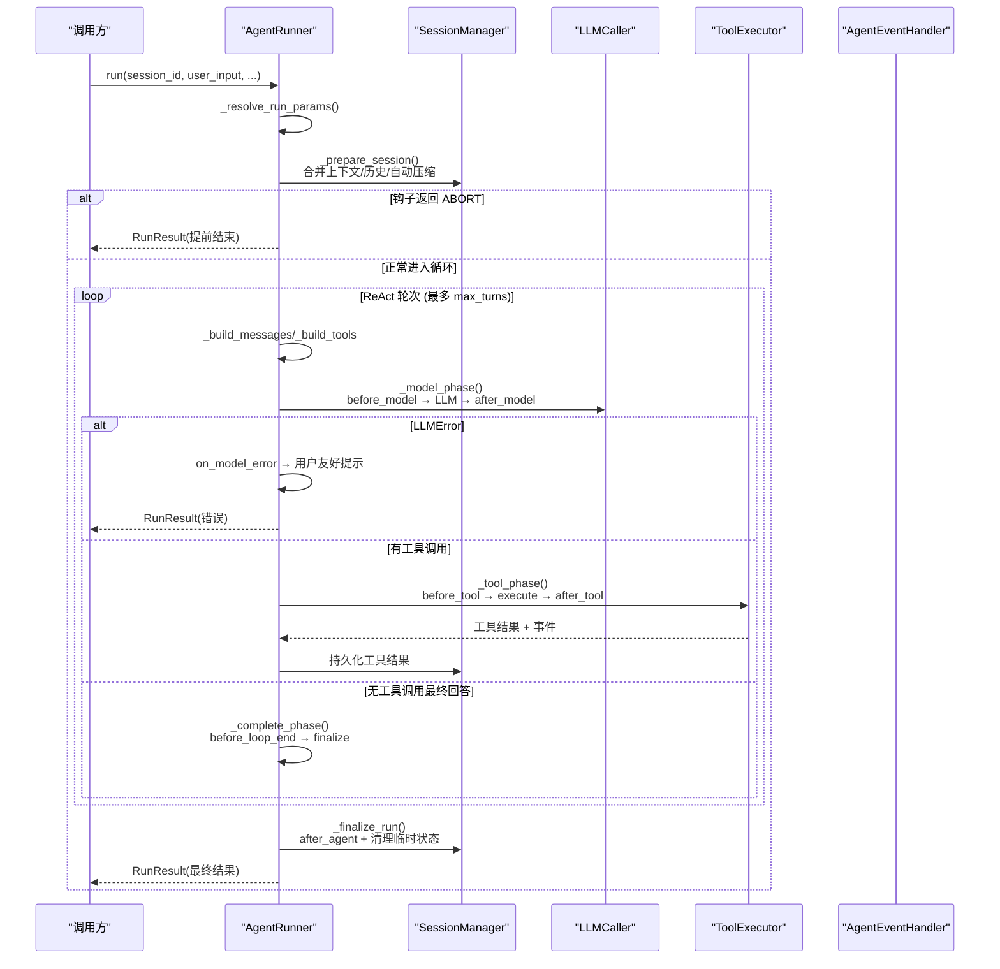
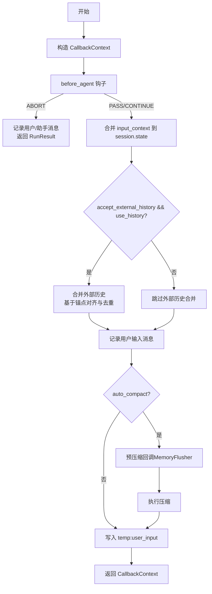
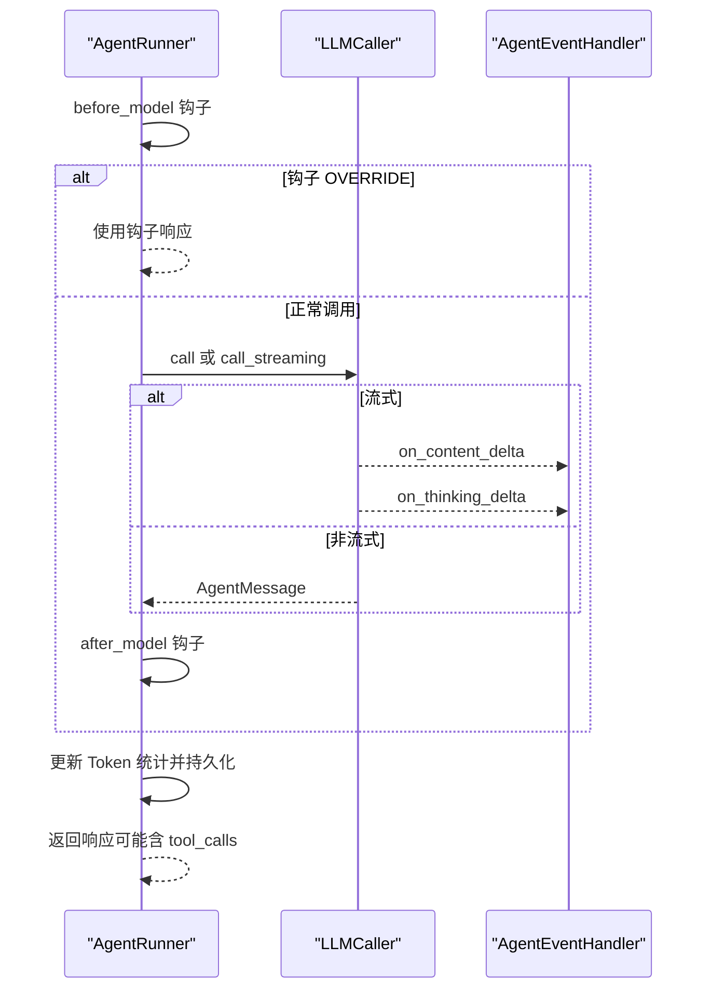
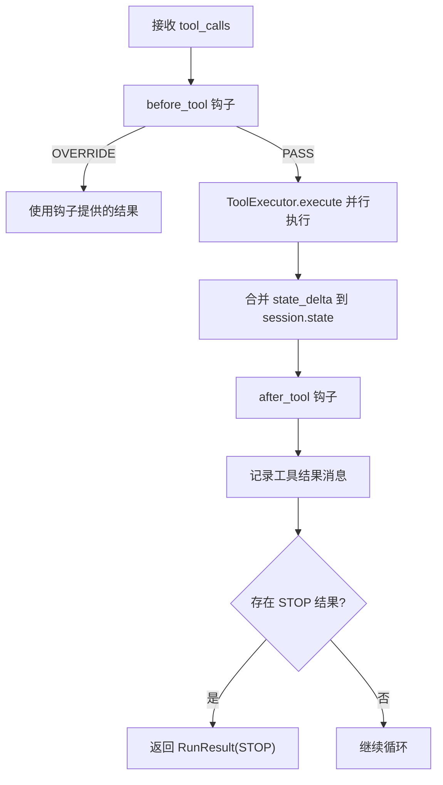
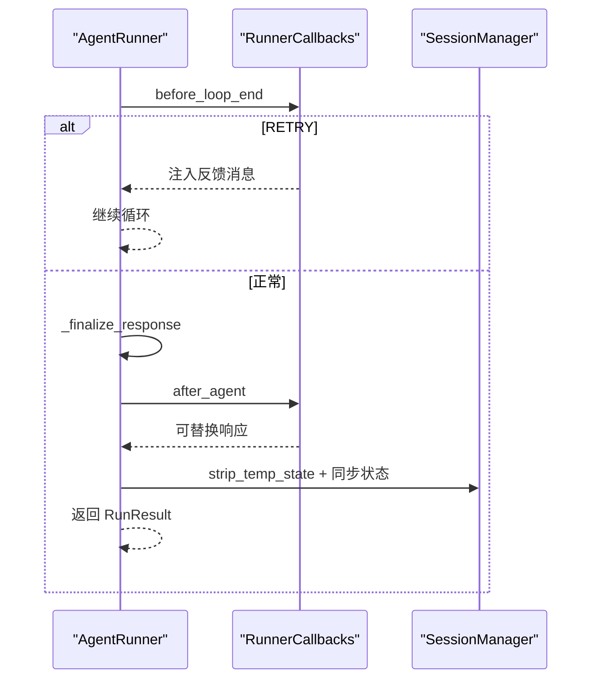
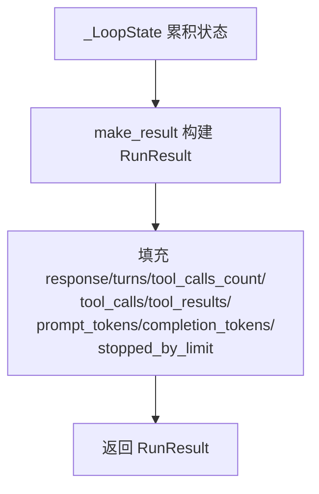
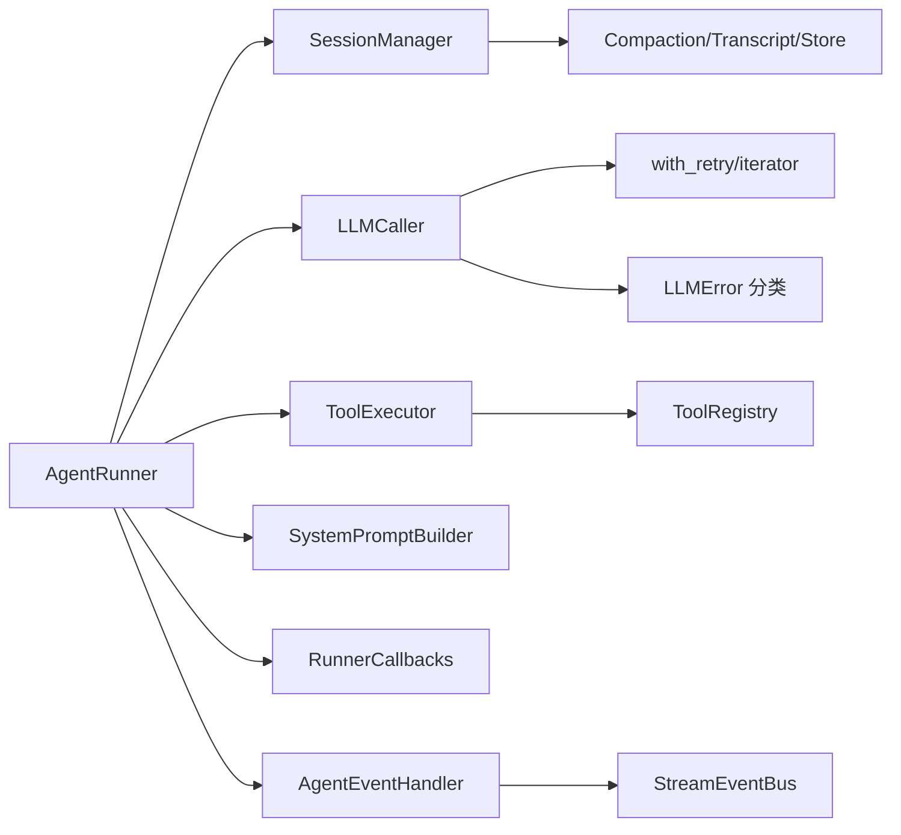

# 执行循环阶段

<cite>
**本文档引用的文件**
- [runner.py](file://src/ark_agentic/core/runner.py)
- [session.py](file://src/ark_agentic/core/session.py)
- [history_merge.py](file://src/ark_agentic/core/history_merge.py)
- [callbacks.py](file://src/ark_agentic/core/callbacks.py)
- [types.py](file://src/ark_agentic/core/types.py)
- [caller.py](file://src/ark_agentic/core/llm/caller.py)
- [executor.py](file://src/ark_agentic/core/tools/executor.py)
- [event_bus.py](file://src/ark_agentic/core/stream/event_bus.py)
- [builder.py](file://src/ark_agentic/core/prompt/builder.py)
- [errors.py](file://src/ark_agentic/core/llm/errors.py)
- [retry.py](file://src/ark_agentic/core/llm/retry.py)
</cite>

## 目录
1. [简介](#简介)
2. [项目结构](#项目结构)
3. [核心组件](#核心组件)
4. [架构总览](#架构总览)
5. [详细组件分析](#详细组件分析)
6. [依赖分析](#依赖分析)
7. [性能考虑](#性能考虑)
8. [故障排查指南](#故障排查指南)
9. [结论](#结论)

## 简介
本文件面向 ReAct 执行循环的五个阶段，提供完整的技术文档：准备阶段、模型推理阶段、工具调用阶段、完成阶段、终结阶段。文档涵盖每个阶段的输入输出、关键参数、异常处理与性能考量，并通过图示展示调用流程与状态转换。

## 项目结构
围绕 ReAct 执行循环的核心模块包括：
- 执行器与生命周期：AgentRunner、RunnerCallbacks、RunResult、_LoopState
- 会话与历史：SessionManager、SessionEntry、history_merge
- LLM 与工具：LLMCaller、ToolExecutor、SystemPromptBuilder
- 流式事件：AgentEventHandler、StreamEventBus
- 类型与错误：AgentMessage、ToolCall、AgentToolResult、LLMError、Retry

**图表来源**
- [runner.py:193-387](file://src/ark_agentic/core/runner.py#L193-L387)
- [session.py:24-482](file://src/ark_agentic/core/session.py#L24-L482)
- [history_merge.py:155-243](file://src/ark_agentic/core/history_merge.py#L155-L243)
- [callbacks.py:172-198](file://src/ark_agentic/core/callbacks.py#L172-L198)
- [types.py:131-188](file://src/ark_agentic/core/types.py#L131-L188)
- [caller.py:26-218](file://src/ark_agentic/core/llm/caller.py#L26-L218)
- [executor.py:29-127](file://src/ark_agentic/core/tools/executor.py#L29-L127)
- [event_bus.py:67-248](file://src/ark_agentic/core/stream/event_bus.py#L67-L248)
- [builder.py:72-328](file://src/ark_agentic/core/prompt/builder.py#L72-L328)

**章节来源**
- [runner.py:193-387](file://src/ark_agentic/core/runner.py#L193-L387)
- [session.py:24-120](file://src/ark_agentic/core/session.py#L24-L120)
- [history_merge.py:155-243](file://src/ark_agentic/core/history_merge.py#L155-L243)
- [callbacks.py:172-198](file://src/ark_agentic/core/callbacks.py#L172-L198)
- [types.py:131-188](file://src/ark_agentic/core/types.py#L131-L188)
- [caller.py:26-218](file://src/ark_agentic/core/llm/caller.py#L26-L218)
- [executor.py:29-127](file://src/ark_agentic/core/tools/executor.py#L29-L127)
- [event_bus.py:67-248](file://src/ark_agentic/core/stream/event_bus.py#L67-L248)
- [builder.py:72-328](file://src/ark_agentic/core/prompt/builder.py#L72-L328)

## 核心组件
- AgentRunner：执行器主体，驱动 ReAct 循环，管理钩子、会话、统计与错误处理。
- SessionManager：会话生命周期、消息管理、上下文压缩、状态持久化。
- LLMCaller：LLM 调用封装，支持流式/非流式、重试、工具绑定、Token 统计。
- ToolExecutor：工具执行器，限频并发、超时保护、事件分发。
- SystemPromptBuilder：动态构建系统提示，整合工具、技能、上下文与记忆。
- StreamEventBus：将内部回调映射为前端事件，自动配对起止事件。
- RunnerCallbacks：钩子容器，覆盖 Agent 级与每轮循环的生命周期事件。

**章节来源**
- [runner.py:193-387](file://src/ark_agentic/core/runner.py#L193-L387)
- [session.py:24-120](file://src/ark_agentic/core/session.py#L24-L120)
- [caller.py:26-218](file://src/ark_agentic/core/llm/caller.py#L26-L218)
- [executor.py:29-127](file://src/ark_agentic/core/tools/executor.py#L29-L127)
- [builder.py:72-328](file://src/ark_agentic/core/prompt/builder.py#L72-L328)
- [event_bus.py:67-248](file://src/ark_agentic/core/stream/event_bus.py#L67-L248)
- [callbacks.py:172-198](file://src/ark_agentic/core/callbacks.py#L172-L198)

## 架构总览
ReAct 执行循环的生命周期与阶段划分如下：

**图表来源**
- [runner.py:312-370](file://src/ark_agentic/core/runner.py#L312-L370)
- [runner.py:652-730](file://src/ark_agentic/core/runner.py#L652-L730)
- [runner.py:760-880](file://src/ark_agentic/core/runner.py#L760-L880)
- [runner.py:882-964](file://src/ark_agentic/core/runner.py#L882-L964)
- [runner.py:734-758](file://src/ark_agentic/core/runner.py#L734-L758)
- [runner.py:495-519](file://src/ark_agentic/core/runner.py#L495-L519)
- [session.py:229-262](file://src/ark_agentic/core/session.py#L229-L262)
- [caller.py:70-192](file://src/ark_agentic/core/llm/caller.py#L70-L192)
- [executor.py:43-100](file://src/ark_agentic/core/tools/executor.py#L43-L100)

**章节来源**
- [runner.py:312-370](file://src/ark_agentic/core/runner.py#L312-L370)
- [runner.py:652-730](file://src/ark_agentic/core/runner.py#L652-L730)
- [runner.py:760-880](file://src/ark_agentic/core/runner.py#L760-L880)
- [runner.py:882-964](file://src/ark_agentic/core/runner.py#L882-L964)
- [runner.py:734-758](file://src/ark_agentic/core/runner.py#L734-L758)
- [runner.py:495-519](file://src/ark_agentic/core/runner.py#L495-L519)
- [session.py:229-262](file://src/ark_agentic/core/session.py#L229-L262)
- [caller.py:70-192](file://src/ark_agentic/core/llm/caller.py#L70-L192)
- [executor.py:43-100](file://src/ark_agentic/core/tools/executor.py#L43-L100)

## 详细组件分析

### 准备阶段（Session 准备、上下文合并、历史合并）
- 输入
  - session_id、user_id、user_input、input_context、history、use_history、run_id、run_metadata
- 关键动作
  - 构造 CallbackContext，触发 before_agent 钩子
  - 合并 input_context 到 session.state（覆盖策略）
  - 可选合并外部历史（基于锚点的时间线对齐与去重）
  - 记录用户输入消息
  - 自动压缩（可选）：触发 MemoryFlusher 预压缩回调，再执行压缩
  - 临时状态注入：将当前用户输入写入 session.state["temp:user_input"]
- 输出
  - 成功：返回 CallbackContext；失败（ABORT）：返回 RunResult
- 异常与边界
  - 钩子返回 ABORT 时，直接记录前后两条消息并返回 RunResult
  - 外部历史合并仅在配置允许且 use_history 为真时生效
- 性能与优化
  - 合并外部历史采用成对去重与窗口匹配，避免重复插入
  - 自动压缩在需要时触发，减少上下文长度

**图表来源**
- [runner.py:406-493](file://src/ark_agentic/core/runner.py#L406-L493)
- [history_merge.py:155-243](file://src/ark_agentic/core/history_merge.py#L155-L243)
- [session.py:415-430](file://src/ark_agentic/core/session.py#L415-L430)

**章节来源**
- [runner.py:406-493](file://src/ark_agentic/core/runner.py#L406-L493)
- [history_merge.py:155-243](file://src/ark_agentic/core/history_merge.py#L155-L243)
- [session.py:415-430](file://src/ark_agentic/core/session.py#L415-L430)

### 模型推理阶段（LLM 调用、流式响应处理）
- 输入
  - messages（系统提示 + 历史 + 工具调用摘要）、tools schema、use_streaming、model_override、sampling_override
- 关键动作
  - before_model 钩子：可覆盖响应（OVERRIDE）
  - 流式：astream + with_retry_iterator，识别 reasoning_content 路由到 thinking_callback
  - 非流式：ainvoke + with_retry
  - after_model 钩子：可替换响应
  - 持久化：记录响应消息，更新 Token 统计
  - finish_reason 处理：length 截断则标记 stopped_by_limit
- 输出
  - AgentMessage（可能包含 tool_calls）
- 异常与边界
  - LLMError 分类与重试：仅 retryable 错误指数退避重试
  - 非 retryable 错误（认证、配额、上下文溢出、内容过滤）直接抛出
  - on_model_error 钩子：记录错误并返回用户友好提示
- 性能与优化
  - 流式模式下，思考内容与文本内容分别回调，降低前端耦合
  - 工具 schema 绑定减少模型幻觉

**图表来源**
- [runner.py:760-880](file://src/ark_agentic/core/runner.py#L760-L880)
- [caller.py:70-192](file://src/ark_agentic/core/llm/caller.py#L70-L192)
- [retry.py:45-96](file://src/ark_agentic/core/llm/retry.py#L45-L96)
- [errors.py:31-52](file://src/ark_agentic/core/llm/errors.py#L31-L52)
- [event_bus.py:146-171](file://src/ark_agentic/core/stream/event_bus.py#L146-L171)

**章节来源**
- [runner.py:760-880](file://src/ark_agentic/core/runner.py#L760-L880)
- [caller.py:70-192](file://src/ark_agentic/core/llm/caller.py#L70-L192)
- [retry.py:45-96](file://src/ark_agentic/core/llm/retry.py#L45-L96)
- [errors.py:31-52](file://src/ark_agentic/core/llm/errors.py#L31-L52)
- [event_bus.py:146-171](file://src/ark_agentic/core/stream/event_bus.py#L146-L171)

### 工具调用阶段（工具选择、执行、结果处理）
- 输入
  - tool_calls（来自上一轮 LLM 响应）、state（会话状态）
- 关键动作
  - before_tool 钩子：可直接提供工具结果（OVERRIDE）
  - ToolExecutor 并行执行（受 max_calls_per_turn 限制）
  - 超时保护：单工具超时返回错误结果
  - 合并 state_delta：将工具返回的 state_delta 合并到 session.state
  - after_tool 钩子：可替换工具结果
  - 持久化：记录工具结果消息（支持 A2UI 遮蔽）
  - STOP 检查：若存在 ToolLoopAction.STOP，直接结束并返回
- 输出
  - AgentToolResult 列表、可能的 RunResult（STOP）
- 异常与边界
  - 缺失工具：返回错误结果
  - 全部工具失败：记录警告
  - 事件分发：UI 组件、自定义事件、步骤事件
- 性能与优化
  - 并行执行提升吞吐，受 max_calls_per_turn 限制
  - A2UI 结果在消息中以占位符形式节省 Token

**图表来源**
- [runner.py:882-964](file://src/ark_agentic/core/runner.py#L882-L964)
- [executor.py:43-100](file://src/ark_agentic/core/tools/executor.py#L43-L100)
- [types.py:86-100](file://src/ark_agentic/core/types.py#L86-L100)

**章节来源**
- [runner.py:882-964](file://src/ark_agentic/core/runner.py#L882-L964)
- [executor.py:43-100](file://src/ark_agentic/core/tools/executor.py#L43-L100)
- [types.py:86-100](file://src/ark_agentic/core/types.py#L86-L100)

### 完成阶段（回调触发、会话清理）
- 输入
  - 最终 AgentMessage、当前轮次、handler、cb_ctx
- 关键动作
  - before_loop_end 钩子：可触发 RETRY（注入反馈消息后继续）
  - finalize_response：记录统计信息，构建 RunResult
  - after_agent 钩子：可替换最终响应
  - 清理临时状态：strip_temp_state
  - 同步会话状态与 Token 统计
  - 可选触发 Dream（记忆蒸馏）
- 输出
  - RunResult（最终响应、轮次、工具调用次数、Token 统计、是否受限停止）

**图表来源**
- [runner.py:734-758](file://src/ark_agentic/core/runner.py#L734-L758)
- [runner.py:495-519](file://src/ark_agentic/core/runner.py#L495-L519)
- [session.py:240-262](file://src/ark_agentic/core/session.py#L240-L262)

**章节来源**
- [runner.py:734-758](file://src/ark_agentic/core/runner.py#L734-L758)
- [runner.py:495-519](file://src/ark_agentic/core/runner.py#L495-L519)
- [session.py:240-262](file://src/ark_agentic/core/session.py#L240-L262)

### 终结阶段（结果封装、统计信息收集）
- 输入
  - _LoopState 累积状态、最终响应
- 关键动作
  - 统计：轮次、工具调用总数、Prompt/Completion Token
  - 构建 RunResult：包含 response、turns、tool_calls_count、tool_calls、tool_results、prompt_tokens、completion_tokens、stopped_by_limit
- 输出
  - RunResult（供调用方消费）

**图表来源**
- [runner.py:166-187](file://src/ark_agentic/core/runner.py#L166-L187)
- [runner.py:966-983](file://src/ark_agentic/core/runner.py#L966-L983)

**章节来源**
- [runner.py:166-187](file://src/ark_agentic/core/runner.py#L166-L187)
- [runner.py:966-983](file://src/ark_agentic/core/runner.py#L966-L983)

## 依赖分析
- 组件耦合
  - AgentRunner 依赖 SessionManager（消息/状态/压缩/持久化）、LLMCaller（推理）、ToolExecutor（工具）、SystemPromptBuilder（提示）、RunnerCallbacks（钩子）、AgentEventHandler（事件）
  - SessionManager 依赖 Compaction、TranscriptManager、SessionStore
  - LLMCaller 依赖 with_retry/with_retry_iterator 与错误分类
  - ToolExecutor 依赖 ToolRegistry 与事件分发
- 关键依赖链
  - run → _prepare_session → _run_loop → _model_phase/_tool_phase/_complete_phase → _finalize_run → 返回 RunResult
  - _build_messages → _build_system_prompt → SystemPromptBuilder
  - _tool_phase → ToolExecutor.execute → 事件分发至 AgentEventHandler

**图表来源**
- [runner.py:193-387](file://src/ark_agentic/core/runner.py#L193-L387)
- [session.py:24-120](file://src/ark_agentic/core/session.py#L24-L120)
- [caller.py:26-218](file://src/ark_agentic/core/llm/caller.py#L26-L218)
- [executor.py:29-127](file://src/ark_agentic/core/tools/executor.py#L29-L127)
- [builder.py:72-328](file://src/ark_agentic/core/prompt/builder.py#L72-L328)
- [retry.py:45-96](file://src/ark_agentic/core/llm/retry.py#L45-L96)
- [errors.py:31-52](file://src/ark_agentic/core/llm/errors.py#L31-L52)
- [event_bus.py:67-248](file://src/ark_agentic/core/stream/event_bus.py#L67-L248)

**章节来源**
- [runner.py:193-387](file://src/ark_agentic/core/runner.py#L193-L387)
- [session.py:24-120](file://src/ark_agentic/core/session.py#L24-L120)
- [caller.py:26-218](file://src/ark_agentic/core/llm/caller.py#L26-L218)
- [executor.py:29-127](file://src/ark_agentic/core/tools/executor.py#L29-L127)
- [builder.py:72-328](file://src/ark_agentic/core/prompt/builder.py#L72-L328)
- [retry.py:45-96](file://src/ark_agentic/core/llm/retry.py#L45-L96)
- [errors.py:31-52](file://src/ark_agentic/core/llm/errors.py#L31-L52)
- [event_bus.py:67-248](file://src/ark_agentic/core/stream/event_bus.py#L67-L248)

## 性能考虑
- 重试策略
  - 指数退避 + 抖动，仅对 retryable 错误重试，避免中间流重试导致重复输出
- 并发与限流
  - 工具执行并行，受 max_calls_per_turn 限制；单工具超时保护
- 上下文与 Token
  - 自动压缩与 A2UI 遮蔽减少 Token 消耗
- 流式输出
  - 文本与思考内容分离回调，降低前端复杂度

[本节为通用指导，无需特定文件引用]

## 故障排查指南
- LLM 错误分类
  - 认证失败、配额不足、速率限制、超时、上下文溢出、内容过滤、服务器错误、网络错误、未知错误
- 重试机制
  - 非 retryable 错误立即抛出；retryable 错误按指数退避重试，最多 max_retries 次
- 常见问题定位
  - LLMError.reason 与 retryable 标记用于区分可恢复与不可恢复错误
  - on_model_error 钩子用于记录错误并返回用户友好提示
  - 工具缺失：返回错误结果；全部失败：记录警告
- 事件与日志
  - 流式事件总线自动配对起止事件，便于前端正确渲染

**章节来源**
- [errors.py:17-29](file://src/ark_agentic/core/llm/errors.py#L17-L29)
- [retry.py:22-29](file://src/ark_agentic/core/llm/retry.py#L22-L29)
- [retry.py:45-96](file://src/ark_agentic/core/llm/retry.py#L45-L96)
- [runner.py:816-840](file://src/ark_agentic/core/runner.py#L816-L840)
- [executor.py:77-87](file://src/ark_agentic/core/tools/executor.py#L77-L87)
- [event_bus.py:117-136](file://src/ark_agentic/core/stream/event_bus.py#L117-L136)

## 结论
ReAct 执行循环通过清晰的阶段划分与钩子机制，实现了可插拔、可观测、可扩展的智能体执行框架。准备阶段确保上下文与历史就绪，模型推理阶段兼顾准确性与实时性，工具调用阶段强调安全与可观测，完成与终结阶段提供稳健的收尾与统计。配合完善的错误分类与重试策略，系统在复杂场景下仍能保持稳定与高效。