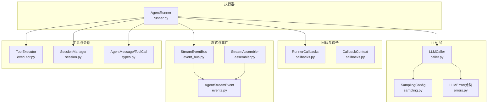
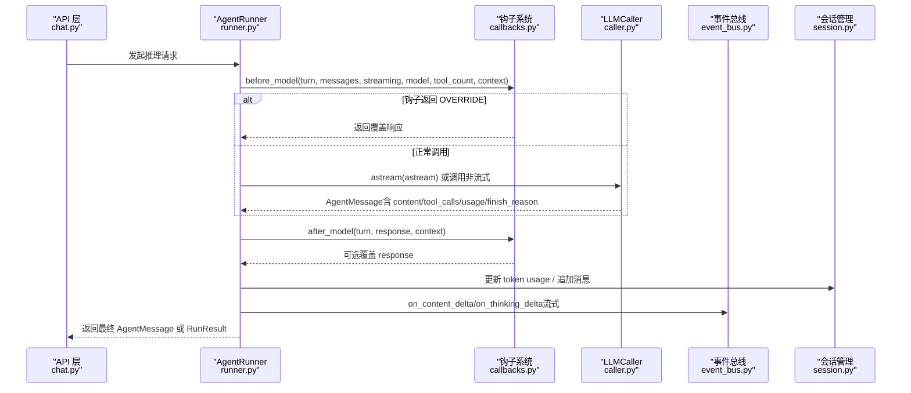
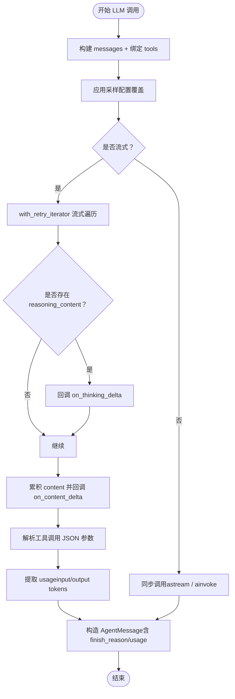
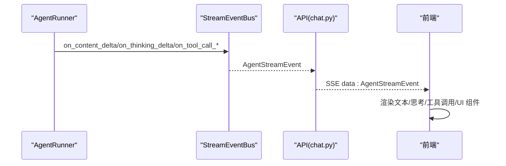
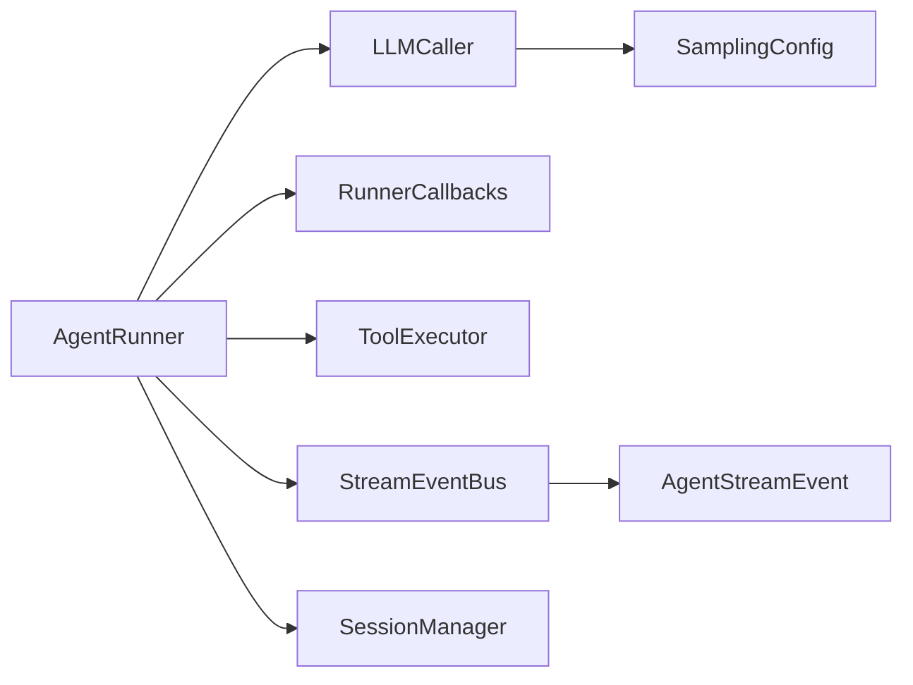

# 模型推理阶段

<cite>
**本文引用的文件**
- [runner.py](file://src/ark_agentic/core/runner.py)
- [callbacks.py](file://src/ark_agentic/core/callbacks.py)
- [types.py](file://src/ark_agentic/core/types.py)
- [session.py](file://src/ark_agentic/core/session.py)
- [caller.py](file://src/ark_agentic/core/llm/caller.py)
- [sampling.py](file://src/ark_agentic/core/llm/sampling.py)
- [errors.py](file://src/ark_agentic/core/llm/errors.py)
- [event_bus.py](file://src/ark_agentic/core/stream/event_bus.py)
- [events.py](file://src/ark_agentic/core/stream/events.py)
- [assembler.py](file://src/ark_agentic/core/stream/assembler.py)
- [executor.py](file://src/ark_agentic/core/tools/executor.py)
- [chat.py](file://src/ark_agentic/api/chat.py)
</cite>

## 目录
1. [简介](#简介)
2. [项目结构](#项目结构)
3. [核心组件](#核心组件)
4. [架构总览](#架构总览)
5. [详细组件分析](#详细组件分析)
6. [依赖关系分析](#依赖关系分析)
7. [性能考量](#性能考量)
8. [故障排查指南](#故障排查指南)
9. [结论](#结论)
10. [附录](#附录)

## 简介
本文件聚焦于“模型推理阶段”的完整技术文档，围绕以下目标展开：
- 深入解释模型调用钩子（before_model 钩子执行、turn 信息传递、工具数量统计）
- LLM 调用（消息构建、工具描述、采样配置、流式响应处理）
- 响应处理（AgentMessage 解析、工具调用提取、流式内容回调）
- 令牌统计（prompt_tokens 和 completion_tokens 收集）
- 完成原因处理（finish_reason）
- 异常处理与重试机制
- 提供可追溯的代码片段路径与可视化图示

## 项目结构
模型推理阶段位于核心执行器 AgentRunner 中，贯穿“before_model → LLM 调用 → after_model → 持久化与统计 → 结束条件判定”的主回路，并与工具执行、流式事件总线、会话管理、采样配置、错误分类等模块协作。

图表来源
- [runner.py](file://src/ark_agentic/core/runner.py)
- [caller.py](file://src/ark_agentic/core/llm/caller.py)
- [sampling.py](file://src/ark_agentic/core/llm/sampling.py)
- [errors.py](file://src/ark_agentic/core/llm/errors.py)
- [callbacks.py](file://src/ark_agentic/core/callbacks.py)
- [event_bus.py](file://src/ark_agentic/core/stream/event_bus.py)
- [events.py](file://src/ark_agentic/core/stream/events.py)
- [assembler.py](file://src/ark_agentic/core/stream/assembler.py)
- [executor.py](file://src/ark_agentic/core/tools/executor.py)
- [session.py](file://src/ark_agentic/core/session.py)
- [types.py](file://src/ark_agentic/core/types.py)

章节来源
- [runner.py](file://src/ark_agentic/core/runner.py)
- [callbacks.py](file://src/ark_agentic/core/callbacks.py)
- [types.py](file://src/ark_agentic/core/types.py)
- [session.py](file://src/ark_agentic/core/session.py)
- [caller.py](file://src/ark_agentic/core/llm/caller.py)
- [sampling.py](file://src/ark_agentic/core/llm/sampling.py)
- [errors.py](file://src/ark_agentic/core/llm/errors.py)
- [event_bus.py](file://src/ark_agentic/core/stream/event_bus.py)
- [events.py](file://src/ark_agentic/core/stream/events.py)
- [assembler.py](file://src/ark_agentic/core/stream/assembler.py)
- [executor.py](file://src/ark_agentic/core/tools/executor.py)
- [chat.py](file://src/ark_agentic/api/chat.py)

## 核心组件
- AgentRunner：ReAct 执行器，负责模型推理阶段、工具执行阶段、状态合并与持久化、统计与结束条件判定。
- LLMCaller：封装 LLM 调用，支持流式/非流式、工具绑定、采样覆盖、重试与 usage 提取。
- RunnerCallbacks/CallbackContext：钩子系统，提供 before_model/after_model/before_tool/after_tool/on_model_error 等扩展点。
- StreamEventBus/AgentStreamEvent：将 Runner 回调映射为前端可消费的 AG-UI 事件序列。
- ToolExecutor：工具执行器，统一处理超时、错误兜底与 ToolEvent 分发。
- SessionManager：会话管理，负责消息持久化、token 统计与状态合并。
- SamplingConfig：采样配置（温度、top_p、top_k、重复惩罚、最大 token 等）。
- AgentMessage/ToolCall：统一的消息与工具调用数据结构。

章节来源
- [runner.py](file://src/ark_agentic/core/runner.py)
- [callbacks.py](file://src/ark_agentic/core/callbacks.py)
- [types.py](file://src/ark_agentic/core/types.py)
- [session.py](file://src/ark_agentic/core/session.py)
- [caller.py](file://src/ark_agentic/core/llm/caller.py)
- [sampling.py](file://src/ark_agentic/core/llm/sampling.py)
- [errors.py](file://src/ark_agentic/core/llm/errors.py)
- [event_bus.py](file://src/ark_agentic/core/stream/event_bus.py)
- [events.py](file://src/ark_agentic/core/stream/events.py)
- [assembler.py](file://src/ark_agentic/core/stream/assembler.py)
- [executor.py](file://src/ark_agentic/core/tools/executor.py)

## 架构总览
模型推理阶段的端到端流程如下：

图表来源
- [runner.py](file://src/ark_agentic/core/runner.py)
- [callbacks.py](file://src/ark_agentic/core/callbacks.py)
- [caller.py](file://src/ark_agentic/core/llm/caller.py)
- [event_bus.py](file://src/ark_agentic/core/stream/event_bus.py)
- [session.py](file://src/ark_agentic/core/session.py)
- [chat.py](file://src/ark_agentic/api/chat.py)

## 详细组件分析

### 模型调用钩子（before_model）
- 输入
  - turn：当前 ReAct 轮次（1-based）
  - messages：消息列表（字典形式，用于 LLM 调用）
  - streaming：是否流式
  - model：模型名称（可被覆盖）
  - tool_count：工具数量
  - context：会话状态
  - handler：事件处理器（用于流式回调）
- 行为
  - 执行 before_model 钩子，支持 HookAction.OVERRIDE 直接返回覆盖响应
  - 若未覆盖，则进入 LLM 调用阶段
- 输出
  - 覆盖响应（若钩子返回 OVERRIDE）
  - 否则为 LLM 返回的 AgentMessage

章节来源
- [runner.py](file://src/ark_agentic/core/runner.py)
- [callbacks.py](file://src/ark_agentic/core/callbacks.py)

### LLM 调用（消息构建、工具描述、采样配置、流式响应处理）
- 消息构建与工具绑定
  - 将 tools 列表绑定到 LLM（LangChain bind_tools）
  - 通过 with_retry_iterator 包裹流式调用，支持指数退避重试
- 采样配置
  - 支持模型覆盖与采样覆盖（SamplingConfig.for_chat/for_extraction/for_summarization）
  - 将采样参数转换为提供商所需的额外参数（如 chat_template_kwargs）
- 流式处理
  - 识别 Thinking 模型的 reasoning_content 字段，路由到 on_thinking_delta
  - 累积 content 与 tool_calls（按索引聚合 JSON 参数）
  - 提取 usage（input_tokens/output_tokens）并写入 AgentMessage.metadata
- 输出
  - AgentMessage（content/tool_calls/thinking/finish_reason/usage）

图表来源
- [caller.py](file://src/ark_agentic/core/llm/caller.py)
- [sampling.py](file://src/ark_agentic/core/llm/sampling.py)
- [errors.py](file://src/ark_agentic/core/llm/errors.py)

章节来源
- [caller.py](file://src/ark_agentic/core/llm/caller.py)
- [sampling.py](file://src/ark_agentic/core/llm/sampling.py)
- [errors.py](file://src/ark_agentic/core/llm/errors.py)

### 响应处理（AgentMessage 解析、工具调用提取、流式内容回调）
- AgentMessage 解析
  - content：最终文本
  - tool_calls：ToolCall 列表（id/name/arguments）
  - thinking：扩展思考内容（来自 reasoning_content）
  - metadata：finish_reason、usage
- 工具调用提取
  - 从 LLM 响应中解析工具调用 JSON 参数；失败时以原始字符串兜底
- 流式内容回调
  - on_content_delta：文本增量
  - on_thinking_delta：思考增量（Thinking 模型）

章节来源
- [caller.py](file://src/ark_agentic/core/llm/caller.py)
- [types.py](file://src/ark_agentic/core/types.py)
- [event_bus.py](file://src/ark_agentic/core/stream/event_bus.py)

### 令牌统计（prompt_tokens 与 completion_tokens 收集）
- 收集来源
  - LLMCaller 从 chunk.usage_metadata 提取 input_tokens/output_tokens
  - 写入 AgentMessage.metadata["usage"]
- 更新策略
  - Runner 在 after_model 钩子后读取 usage 并累加到 _LoopState
  - SessionManager.update_token_usage 同步更新会话级 TokenUsage
- 查询接口
  - SessionManager.get_token_usage 返回当前会话的 TokenUsage

章节来源
- [runner.py](file://src/ark_agentic/core/runner.py)
- [session.py](file://src/ark_agentic/core/session.py)
- [caller.py](file://src/ark_agentic/core/llm/caller.py)

### 完成原因处理（finish_reason）
- 读取位置：AgentMessage.metadata["finish_reason"]
- 常见值：stop、length、end_turn 等（由提供商返回）
- 特殊处理：当 finish_reason == "length" 时，标记 stopped_by_limit 并提前结束本轮

章节来源
- [runner.py](file://src/ark_agentic/core/runner.py)

### 工具数量统计
- 统计维度
  - 单轮工具调用数：max_tool_calls_per_turn 限制
  - 累计工具调用数：_LoopState.total_tool_calls
  - 所有工具调用与结果：all_tool_calls/all_tool_results
- 工具执行
  - ToolExecutor.execute 并行执行工具调用，限制单轮最大调用数
  - 统一分发 ToolEvent（UI 组件、自定义事件、步骤状态）

章节来源
- [runner.py](file://src/ark_agentic/core/runner.py)
- [executor.py](file://src/ark_agentic/core/tools/executor.py)

### 流式事件与前端对接
- 事件总线
  - StreamEventBus 将 Runner 回调映射为 AG-UI 事件（run_started/text_message_content/tool_call_* 等）
  - 自动配对 start/finish 事件，保证状态一致性
- 事件模型
  - AgentStreamEvent 定义 17 种事件类型，统一承载 run_id、session_id、seq 等
- SSE 输出
  - API 层将事件序列化为 SSE 数据行，逐行推送至前端

图表来源
- [event_bus.py](file://src/ark_agentic/core/stream/event_bus.py)
- [events.py](file://src/ark_agentic/core/stream/events.py)
- [chat.py](file://src/ark_agentic/api/chat.py)

章节来源
- [event_bus.py](file://src/ark_agentic/core/stream/event_bus.py)
- [events.py](file://src/ark_agentic/core/stream/events.py)
- [chat.py](file://src/ark_agentic/api/chat.py)

## 依赖关系分析
- AgentRunner 依赖
  - LLMCaller：执行 LLM 调用与流式处理
  - RunnerCallbacks：钩子扩展点
  - ToolExecutor：工具执行与事件分发
  - StreamEventBus：流式事件输出
  - SessionManager：消息持久化与统计
  - SamplingConfig：采样与模型覆盖
- LLMCaller 依赖
  - LangChain BaseChatModel
  - with_retry_iterator（重试）
  - SamplingConfig（采样覆盖）
- 事件总线依赖
  - AgentStreamEvent（事件模型）
  - StreamEventBus（事件装配与队列）

图表来源
- [runner.py](file://src/ark_agentic/core/runner.py)
- [caller.py](file://src/ark_agentic/core/llm/caller.py)
- [callbacks.py](file://src/ark_agentic/core/callbacks.py)
- [executor.py](file://src/ark_agentic/core/tools/executor.py)
- [event_bus.py](file://src/ark_agentic/core/stream/event_bus.py)
- [events.py](file://src/ark_agentic/core/stream/events.py)
- [session.py](file://src/ark_agentic/core/session.py)
- [sampling.py](file://src/ark_agentic/core/llm/sampling.py)

章节来源
- [runner.py](file://src/ark_agentic/core/runner.py)
- [caller.py](file://src/ark_agentic/core/llm/caller.py)
- [callbacks.py](file://src/ark_agentic/core/callbacks.py)
- [executor.py](file://src/ark_agentic/core/tools/executor.py)
- [event_bus.py](file://src/ark_agentic/core/stream/event_bus.py)
- [events.py](file://src/ark_agentic/core/stream/events.py)
- [session.py](file://src/ark_agentic/core/session.py)
- [sampling.py](file://src/ark_agentic/core/llm/sampling.py)

## 性能考量
- 流式优先：尽量使用 astream 以降低首 token 延迟
- 重试策略：with_retry_iterator 对可重试错误进行指数退避，减少抖动
- 工具并发：ToolExecutor.execute 并行执行工具调用，受 max_calls_per_turn 限制
- 上下文压缩：ContextCompactor 在必要时进行多阶段摘要压缩，避免 context overflow
- 令牌预算：SessionManager.update_token_usage 与 SessionManager.estimate_current_tokens 辅助预算控制

## 故障排查指南
- 常见错误分类
  - 认证失败（AUTH）、配额不足（QUOTA）、速率限制（RATE_LIMIT）、超时（TIMEOUT）、上下文溢出（CONTEXT_OVERFLOW）、内容过滤（CONTENT_FILTER）、服务器错误（SERVER_ERROR）、网络错误（NETWORK）、未知（UNKNOWN）
- 错误处理流程
  - LLM 调用抛出异常时，分类为 LLMError 并触发 on_model_error 钩子
  - RunnerCallbacks.on_model_error 可决定是否重试或终止
- 诊断要点
  - 查看 AgentMessage.metadata["finish_reason"] 与 usage
  - 检查 SessionManager.get_token_usage 与 estimate_current_tokens
  - 在流式场景下确认 on_content_delta/on_thinking_delta 是否持续到达

章节来源
- [errors.py](file://src/ark_agentic/core/llm/errors.py)
- [callbacks.py](file://src/ark_agentic/core/callbacks.py)
- [runner.py](file://src/ark_agentic/core/runner.py)
- [session.py](file://src/ark_agentic/core/session.py)

## 结论
模型推理阶段通过“钩子 + LLM 调用 + 流式事件 + 工具执行 + 会话管理”的协同，实现了稳定、可观测且可扩展的智能体推理闭环。采样配置与重试机制保障了鲁棒性，流式事件总线提供了良好的前端体验，令牌统计与上下文压缩确保了资源可控。

## 附录
- 关键参数与默认值
  - 采样配置（SamplingConfig）：温度、top_p、top_k、重复惩罚、存在惩罚、min_p、最大 token、种子、enable_thinking
  - RunnerConfig：最大轮次、单轮最大工具调用数、工具超时、自动压缩等
- 代码片段路径（示例）
  - 模型推理主流程：[runner.py](file://src/ark_agentic/core/runner.py)
  - LLM 流式调用与 usage 提取：[caller.py](file://src/ark_agentic/core/llm/caller.py)
  - 钩子协议与回调结果：[callbacks.py](file://src/ark_agentic/core/callbacks.py)
  - AgentMessage/ToolCall 数据结构：[types.py](file://src/ark_agentic/core/types.py)
  - 会话 token 统计与查询：[session.py](file://src/ark_agentic/core/session.py)
  - 事件模型与总线：[events.py](file://src/ark_agentic/core/stream/events.py)、[event_bus.py](file://src/ark_agentic/core/stream/event_bus.py)
  - 工具执行与事件分发：[executor.py](file://src/ark_agentic/core/tools/executor.py)
  - API 层 SSE 输出：[chat.py](file://src/ark_agentic/api/chat.py)