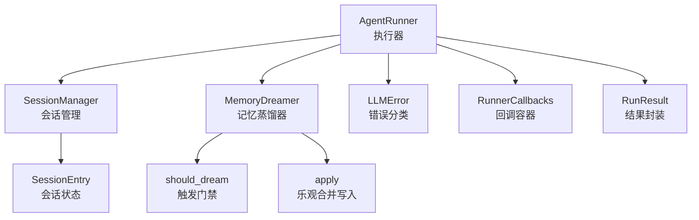
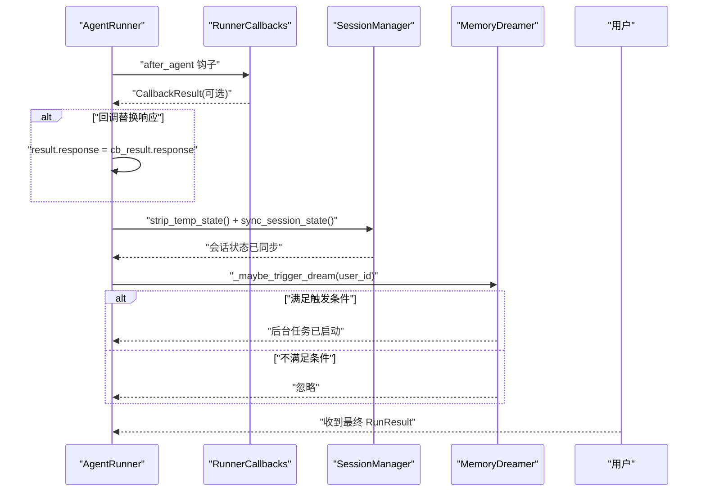
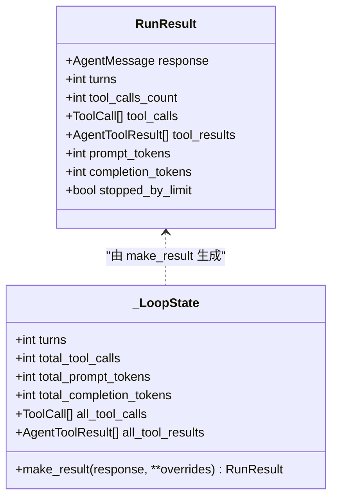
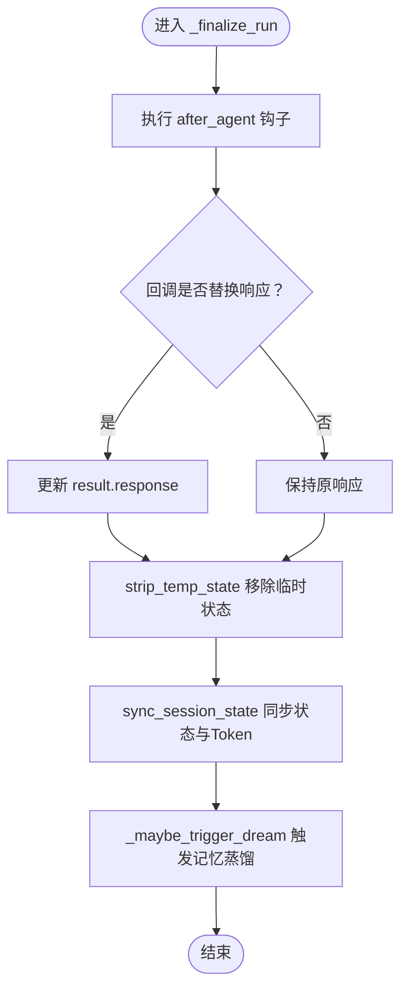
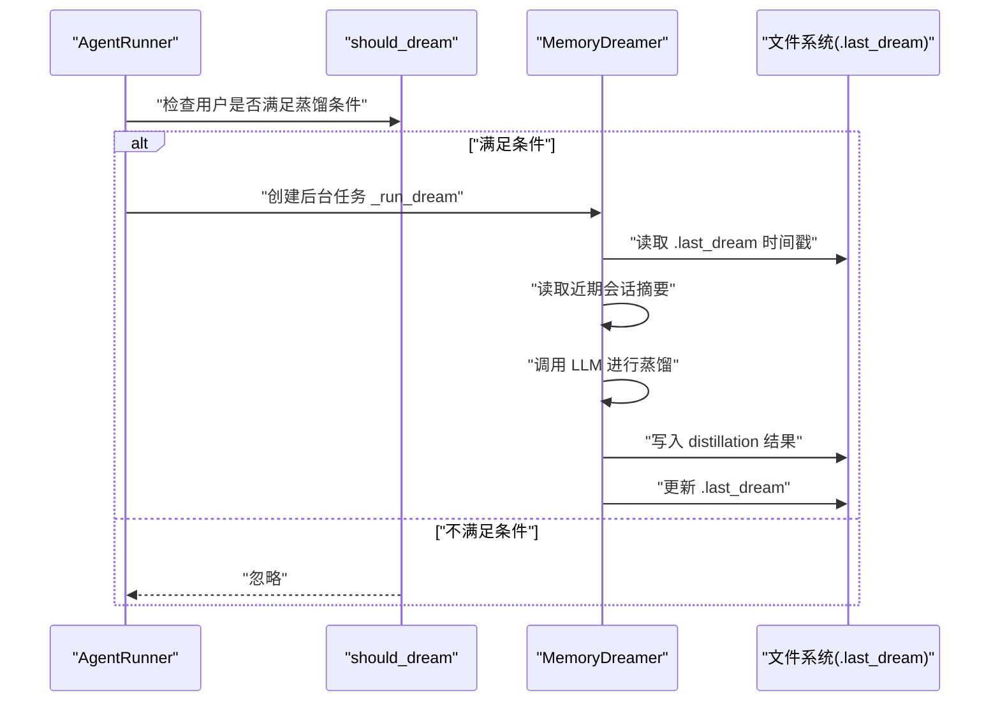
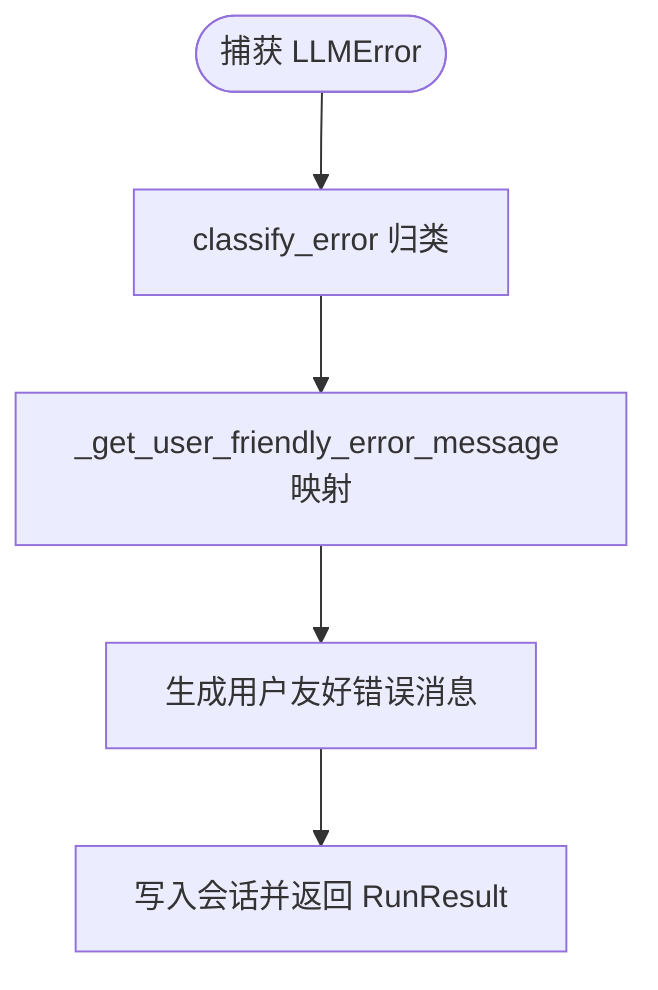
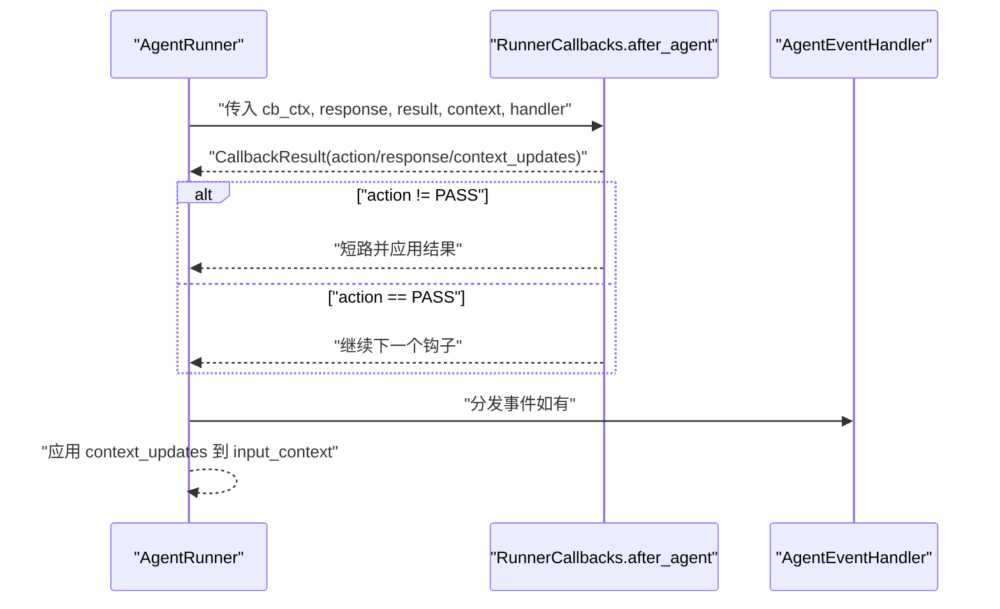
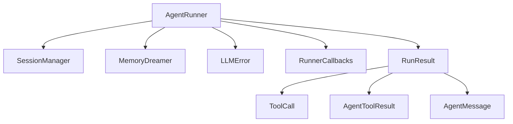

# 终结阶段

<cite>
**本文档引用的文件**
- [runner.py](file://src/ark_agentic/core/runner.py)
- [session.py](file://src/ark_agentic/core/session.py)
- [dream.py](file://src/ark_agentic/core/memory/dream.py)
- [errors.py](file://src/ark_agentic/core/llm/errors.py)
- [callbacks.py](file://src/ark_agentic/core/callbacks.py)
- [types.py](file://src/ark_agentic/core/types.py)
- [test_runner_dispatch_and_loop_state.py](file://tests/unit/core/test_runner_dispatch_and_loop_state.py)
- [tmp_review_diff.txt](file://tmp_review_diff.txt)
</cite>

## 目录
1. [简介](#简介)
2. [项目结构](#项目结构)
3. [核心组件](#核心组件)
4. [架构总览](#架构总览)
5. [详细组件分析](#详细组件分析)
6. [依赖分析](#依赖分析)
7. [性能考量](#性能考量)
8. [故障排查指南](#故障排查指南)
9. [结论](#结论)
10. [附录](#附录)

## 简介
本章节聚焦于智能体执行器的终结阶段，系统性阐述以下关键流程与机制：
- 结果封装：RunResult 的创建、统计信息收集、工具调用列表与工具结果列表的累积
- 会话清理：临时状态移除、会话状态同步
- 记忆系统触发：_maybe_trigger_dream 检查、Dream 任务启动、失败重试保护
- 错误消息友好化：_get_user_friendly_error_message 映射
- 最终回调执行：after_agent 钩子替换响应、上下文更新

同时给出每个步骤的输入输出、关键参数、异常处理策略与性能考虑，并提供调用流程与状态转换的可视化图示。

## 项目结构
终结阶段相关的核心代码位于 core 子模块中，主要涉及执行器、会话管理、记忆系统与错误处理等模块。下图展示了终结阶段涉及的关键文件与交互关系：

图表来源
- [runner.py:495-519](file://src/ark_agentic/core/runner.py#L495-L519)
- [session.py:240-262](file://src/ark_agentic/core/session.py#L240-L262)
- [dream.py:147-176](file://src/ark_agentic/core/memory/dream.py#L147-L176)
- [errors.py:17-53](file://src/ark_agentic/core/llm/errors.py#L17-L53)
- [callbacks.py:172-183](file://src/ark_agentic/core/callbacks.py#L172-L183)
- [types.py:131-153](file://src/ark_agentic/core/types.py#L131-L153)

章节来源
- [runner.py:495-519](file://src/ark_agentic/core/runner.py#L495-L519)
- [session.py:240-262](file://src/ark_agentic/core/session.py#L240-L262)
- [dream.py:147-176](file://src/ark_agentic/core/memory/dream.py#L147-L176)
- [errors.py:17-53](file://src/ark_agentic/core/llm/errors.py#L17-L53)
- [callbacks.py:172-183](file://src/ark_agentic/core/callbacks.py#L172-L183)
- [types.py:131-153](file://src/ark_agentic/core/types.py#L131-L153)

## 核心组件
- RunResult：封装最终响应、回合数、工具调用计数、工具调用列表、工具结果列表、Token 使用量以及是否因限制而停止等统计信息。
- _LoopState：累积统计（回合数、工具调用总数、Prompt/Completion Token 累计、工具调用与结果列表）并在完成时生成 RunResult。
- AgentRunner._finalize_run：执行 after_agent 钩子、清理临时状态、同步会话状态，并触发记忆蒸馏。
- SessionManager：负责消息持久化、状态同步、Token 统计与上下文压缩。
- MemoryDreamer：周期性记忆蒸馏，读取近期会话与当前记忆，进行合并/删除/提取，并乐观合并写回。
- LLMError 与错误映射：将底层 LLM 错误分类并映射为用户友好的提示文本。

章节来源
- [runner.py:131-187](file://src/ark_agentic/core/runner.py#L131-L187)
- [runner.py:495-519](file://src/ark_agentic/core/runner.py#L495-L519)
- [session.py:240-262](file://src/ark_agentic/core/session.py#L240-L262)
- [dream.py:190-323](file://src/ark_agentic/core/memory/dream.py#L190-L323)
- [errors.py:55-160](file://src/ark_agentic/core/llm/errors.py#L55-L160)

## 架构总览
终结阶段的总体流程如下：
- 执行器在 ReAct 循环结束后调用 _finalize_run
- 执行 after_agent 钩子，允许回调替换最终响应
- 清理临时状态并同步会话状态至存储
- 检查记忆蒸馏触发条件，必要时启动后台任务
- 若发生 LLM 错误，执行 on_model_error 钩子并生成用户友好错误消息

图表来源
- [runner.py:495-519](file://src/ark_agentic/core/runner.py#L495-L519)
- [callbacks.py:108-114](file://src/ark_agentic/core/callbacks.py#L108-L114)
- [session.py:240-262](file://src/ark_agentic/core/session.py#L240-L262)
- [dream.py:147-176](file://src/ark_agentic/core/memory/dream.py#L147-L176)

## 详细组件分析

### 结果封装（RunResult 创建与统计）
- 输入
  - 响应消息：AgentMessage（最终回复）
  - 累积统计：回合数、工具调用总数、Prompt/Completion Token、工具调用列表、工具结果列表
  - 附加标志：stopped_by_limit（是否因限制而停止）
- 关键实现
  - _LoopState.make_result：将累积状态与最终响应组合为 RunResult
  - _finalize_response：在最终回合汇总统计并生成 RunResult
- 输出
  - RunResult：包含 response、turns、tool_calls_count、tool_calls、tool_results、prompt_tokens、completion_tokens、stopped_by_limit

图表来源
- [runner.py:131-187](file://src/ark_agentic/core/runner.py#L131-L187)
- [types.py:131-153](file://src/ark_agentic/core/types.py#L131-L153)

章节来源
- [runner.py:177-187](file://src/ark_agentic/core/runner.py#L177-L187)
- [runner.py:966-983](file://src/ark_agentic/core/runner.py#L966-L983)
- [test_runner_dispatch_and_loop_state.py:135-155](file://tests/unit/core/test_runner_dispatch_and_loop_state.py#L135-L155)

### 会话清理（临时状态移除与会话状态同步）
- 输入
  - session_id：会话标识
  - user_id：用户标识
  - result：RunResult（包含最终响应）
  - cb_ctx：回调上下文
  - handler：事件处理器（可选）
- 关键实现
  - strip_temp_state：移除 state 中以 temp: 开头的临时键
  - sync_session_state：将会话状态与 Token 统计写入存储
  - sync_pending_messages：将待持久化的消息追加到会话日志
- 输出
  - 会话状态已清理并持久化

图表来源
- [runner.py:495-519](file://src/ark_agentic/core/runner.py#L495-L519)
- [session.py:240-262](file://src/ark_agentic/core/session.py#L240-L262)
- [types.py:419-422](file://src/ark_agentic/core/types.py#L419-L422)

章节来源
- [runner.py:504-519](file://src/ark_agentic/core/runner.py#L504-L519)
- [session.py:240-262](file://src/ark_agentic/core/session.py#L240-L262)
- [types.py:419-422](file://src/ark_agentic/core/types.py#L419-L422)

### 记忆系统触发（_maybe_trigger_dream 检查、Dream 任务启动、失败重试保护）
- 触发条件
  - 已启用记忆蒸馏（enable_dream）
  - MemoryDreamer 可用
  - 用户会话数量或时间窗口满足 should_dream 判定
- 关键实现
  - _maybe_trigger_dream：检查门禁、创建后台任务、记录日志
  - _run_dream：执行蒸馏、错误处理与失败计数、超过阈值时推进 .last_dream
  - should_dream：基于时间间隔与会话数量判断
- 输出
  - 后台任务启动或忽略
  - 失败累计与阈值保护

图表来源
- [runner.py:520-573](file://src/ark_agentic/core/runner.py#L520-L573)
- [dream.py:147-176](file://src/ark_agentic/core/memory/dream.py#L147-L176)
- [dream.py:289-323](file://src/ark_agentic/core/memory/dream.py#L289-L323)

章节来源
- [runner.py:520-573](file://src/ark_agentic/core/runner.py#L520-L573)
- [dream.py:147-176](file://src/ark_agentic/core/memory/dream.py#L147-L176)
- [dream.py:289-323](file://src/ark_agentic/core/memory/dream.py#L289-L323)

### 错误消息友好化（_get_user_friendly_error_message 映射）
- 输入
  - LLMError：结构化错误对象（包含 reason、retryable 等）
- 关键实现
  - _get_user_friendly_error_message：根据 LLMErrorReason 映射为用户可理解的提示
  - classify_error：将底层异常归类为 LLMErrorReason
- 输出
  - 用户友好提示文本，用于错误响应消息

图表来源
- [runner.py:592-610](file://src/ark_agentic/core/runner.py#L592-L610)
- [errors.py:55-160](file://src/ark_agentic/core/llm/errors.py#L55-L160)

章节来源
- [runner.py:592-610](file://src/ark_agentic/core/runner.py#L592-L610)
- [errors.py:55-160](file://src/ark_agentic/core/llm/errors.py#L55-L160)

### 最终回调执行（after_agent 钩子替换响应、上下文更新）
- 输入
  - cb_ctx：包含 run_id、user_input、input_context、session、metadata
  - result：RunResult（最终结果）
  - handler：事件处理器（可选）
- 关键实现
  - _run_hooks：顺序执行钩子，遇到非 PASS 动作即短路
  - after_agent 钩子签名：接收 response 与 result，允许替换 response
  - CallbackResult.context_updates：合并到 input_context
- 输出
  - 可能被替换的最终响应
  - 更新后的 input_context（通过回调）

图表来源
- [runner.py:622-650](file://src/ark_agentic/core/runner.py#L622-L650)
- [callbacks.py:108-114](file://src/ark_agentic/core/callbacks.py#L108-L114)
- [callbacks.py:58-70](file://src/ark_agentic/core/callbacks.py#L58-L70)

章节来源
- [runner.py:622-650](file://src/ark_agentic/core/runner.py#L622-L650)
- [callbacks.py:58-70](file://src/ark_agentic/core/callbacks.py#L58-L70)

## 依赖分析
终结阶段各组件之间的依赖关系如下：
- AgentRunner 依赖 SessionManager 进行消息与状态持久化
- AgentRunner 依赖 MemoryDreamer 与 MemoryManager 进行记忆蒸馏
- AgentRunner 依赖 LLMError 与错误分类器进行错误友好化
- AgentRunner 依赖 RunnerCallbacks 进行生命周期钩子管理
- RunResult 依赖 ToolCall、AgentToolResult、AgentMessage 等类型

图表来源
- [runner.py:193-284](file://src/ark_agentic/core/runner.py#L193-L284)
- [types.py:131-238](file://src/ark_agentic/core/types.py#L131-L238)

章节来源
- [runner.py:193-284](file://src/ark_agentic/core/runner.py#L193-L284)
- [types.py:131-238](file://src/ark_agentic/core/types.py#L131-L238)

## 性能考量
- 会话状态同步成本：strip_temp_state 与 sync_session_state 会增加 I/O 成本，建议在批量操作时合并写入
- 记忆蒸馏开销：后台任务异步执行，避免阻塞主线程；失败重试保护降低频繁失败带来的抖动
- 错误友好化：字符串映射开销极低，建议在错误路径中尽早短路，避免重复计算
- 回调链：_run_hooks 顺序执行，尽量减少回调中的阻塞操作，必要时使用异步回调

## 故障排查指南
- after_agent 钩子未生效
  - 检查回调动作是否为 PASS；非 PASS 动作会短路后续钩子
  - 确认回调是否正确设置 response 或 context_updates
- 临时状态未清理
  - 确认 _finalize_run 是否被调用；检查 strip_temp_state 是否执行
- 记忆蒸馏未触发
  - 检查 enable_dream 与 MemoryDreamer 是否可用
  - 核对 should_dream 的时间与会话数量阈值
- 错误消息未友好化
  - 确认 LLMError 是否被正确分类
  - 检查 _get_user_friendly_error_message 的映射分支

章节来源
- [runner.py:622-650](file://src/ark_agentic/core/runner.py#L622-L650)
- [session.py:240-262](file://src/ark_agentic/core/session.py#L240-L262)
- [dream.py:147-176](file://src/ark_agentic/core/memory/dream.py#L147-L176)
- [errors.py:55-160](file://src/ark_agentic/core/llm/errors.py#L55-L160)

## 结论
终结阶段通过 RunResult 统一封装执行结果，结合 after_agent 钩子实现灵活的后处理与响应替换；通过会话清理确保状态一致性与持久化；通过记忆蒸馏实现知识的周期性提炼与优化；通过错误友好化提升用户体验。整体设计遵循单一职责与可扩展原则，便于在复杂场景中进行定制与演进。

## 附录
- 调用流程示例（基于源码路径）
  - 终结阶段入口：[runner.py:495-519](file://src/ark_agentic/core/runner.py#L495-L519)
  - RunResult 创建：[runner.py:177-187](file://src/ark_agentic/core/runner.py#L177-L187)
  - 会话状态同步：[session.py:240-262](file://src/ark_agentic/core/session.py#L240-L262)
  - 记忆蒸馏触发：[runner.py:520-573](file://src/ark_agentic/core/runner.py#L520-L573)
  - 错误友好化映射：[runner.py:592-610](file://src/ark_agentic/core/runner.py#L592-L610)
  - 回调执行与上下文更新：[runner.py:622-650](file://src/ark_agentic/core/runner.py#L622-L650)