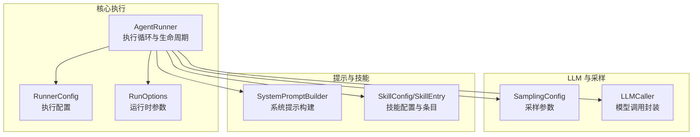
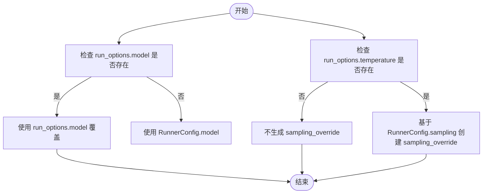
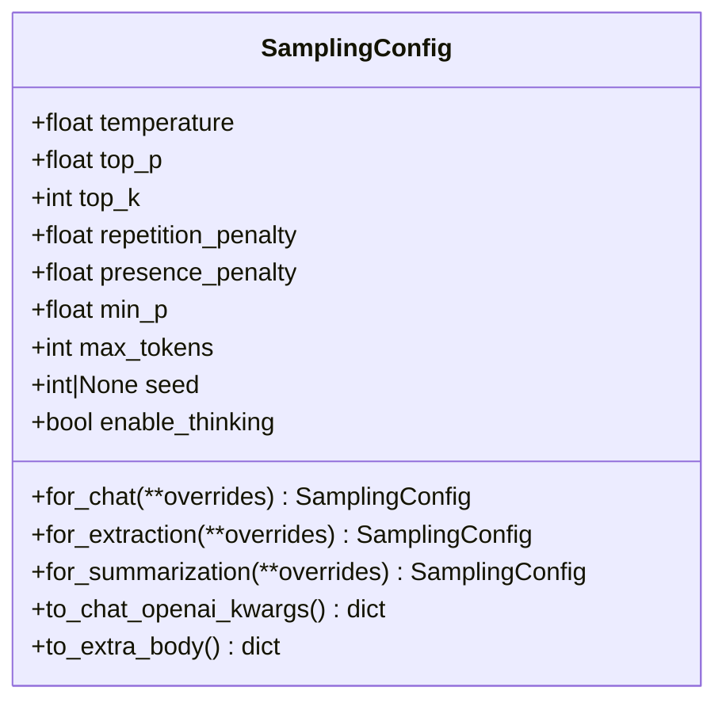
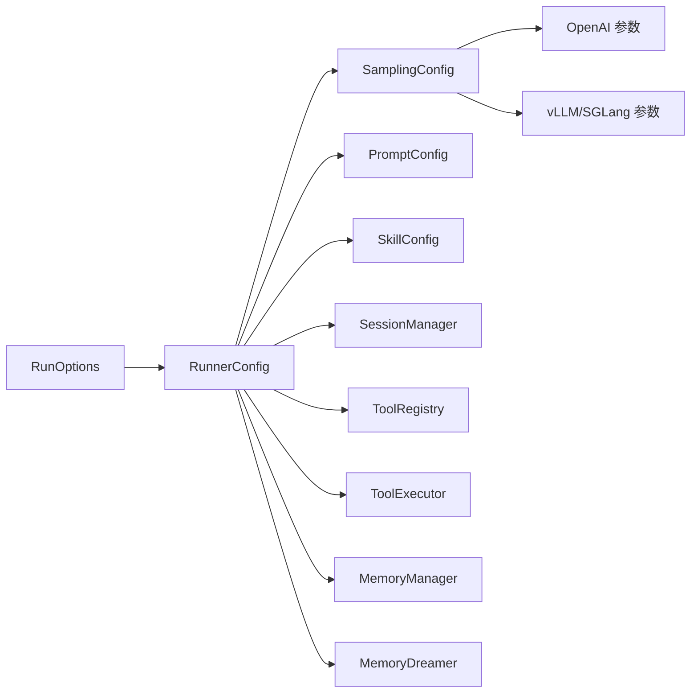

# 执行配置

<cite>
**本文引用的文件**
- [runner.py](file://src/ark_agentic/core/runner.py)
- [types.py](file://src/ark_agentic/core/types.py)
- [sampling.py](file://src/ark_agentic/core/llm/sampling.py)
- [builder.py](file://src/ark_agentic/core/prompt/builder.py)
- [base.py](file://src/ark_agentic/core/skills/base.py)
- [test_sampling_config.py](file://tests/unit/core/test_sampling_config.py)
- [test_run_options_validation.py](file://tests/unit/core/test_run_options_validation.py)
- [test_app_integration.py](file://tests/integration/test_app_integration.py)
</cite>

## 目录
1. [简介](#简介)
2. [项目结构](#项目结构)
3. [核心组件](#核心组件)
4. [架构总览](#架构总览)
5. [详细组件分析](#详细组件分析)
6. [依赖分析](#依赖分析)
7. [性能考虑](#性能考虑)
8. [故障排查指南](#故障排查指南)
9. [结论](#结论)
10. [附录](#附录)

## 简介
本文件面向执行配置系统，聚焦以下目标：
- 深入解释 RunnerConfig 的全部配置项：模型参数（model、sampling）、执行控制（max_turns、max_tool_calls_per_turn、tool_timeout）、自动压缩（auto_compact）、提示配置（prompt_config）、技能配置（skill_config）、子任务支持（enable_subtasks）、Dream 功能（enable_dream、dream_min_sessions）和外部历史合并（accept_external_history）。
- 说明 RunOptions 的运行时参数覆盖机制与优先级规则。
- 解释 SamplingConfig 的采样配置及其与不同后端的映射关系。
- 提供具体配置示例与最佳实践建议。

## 项目结构
围绕执行配置的核心代码主要分布在以下模块：
- 执行器与配置：src/ark_agentic/core/runner.py
- 运行时参数与类型：src/ark_agentic/core/types.py
- 采样配置：src/ark_agentic/core/llm/sampling.py
- 提示构建：src/ark_agentic/core/prompt/builder.py
- 技能配置与渲染：src/ark_agentic/core/skills/base.py
- 单元测试与集成测试：tests/unit/core 与 tests/integration



图表来源
- [runner.py:193-284](file://src/ark_agentic/core/runner.py#L193-L284)
- [types.py:310-320](file://src/ark_agentic/core/types.py#L310-L320)
- [sampling.py:14-97](file://src/ark_agentic/core/llm/sampling.py#L14-L97)
- [builder.py:196-309](file://src/ark_agentic/core/prompt/builder.py#L196-L309)
- [base.py:291-329](file://src/ark_agentic/core/skills/base.py#L291-L329)

章节来源
- [runner.py:92-128](file://src/ark_agentic/core/runner.py#L92-L128)
- [types.py:310-320](file://src/ark_agentic/core/types.py#L310-L320)

## 核心组件
- RunnerConfig：定义执行期的全局配置，包括模型、采样、执行控制、自动压缩、提示与技能配置、子任务与 Dream 开关、外部历史合并等。
- RunOptions：单次运行的可选覆盖参数，目前支持 model 与 temperature。
- SamplingConfig：统一的采样参数配置，提供多种场景预设与参数映射。

章节来源
- [runner.py:92-128](file://src/ark_agentic/core/runner.py#L92-L128)
- [types.py:310-320](file://src/ark_agentic/core/types.py#L310-L320)
- [sampling.py:14-97](file://src/ark_agentic/core/llm/sampling.py#L14-L97)

## 架构总览
执行流程概览：API 层接收 RunOptions，Runner 在运行前解析参数，随后进入 ReAct 循环，按配置进行模型调用、工具执行、内存与压缩、以及 Dream 触发等。

```mermaid
sequenceDiagram
participant API as "API 层"
participant Runner as "AgentRunner"
participant Resolve as "_resolve_run_params"
participant Loop as "_run_loop"
participant LLM as "LLMCaller"
participant Tools as "ToolExecutor"
API->>Runner : 调用 run(session_id, user_input, run_options)
Runner->>Resolve : 解析 run_options 与 RunnerConfig
Resolve-->>Runner : 返回 model_override, sampling_override
Runner->>Loop : 启动 ReAct 循环
Loop->>LLM : 调用模型可带 sampling_override
LLM-->>Loop : 返回响应或错误
alt 响应含工具调用
Loop->>Tools : 执行工具受 max_tool_calls_per_turn 与 tool_timeout 控制
Tools-->>Loop : 返回工具结果
end
Loop-->>Runner : 返回 RunResult
Runner-->>API : 返回最终结果
```

图表来源
- [runner.py:391-404](file://src/ark_agentic/core/runner.py#L391-L404)
- [runner.py:652-730](file://src/ark_agentic/core/runner.py#L652-L730)
- [runner.py:760-880](file://src/ark_agentic/core/runner.py#L760-L880)
- [runner.py:882-964](file://src/ark_agentic/core/runner.py#L882-L964)

## 详细组件分析

### RunnerConfig 配置详解
- 模型参数
  - model: str | None，默认 None。用于覆盖 LLM 模型名称。
  - sampling: SamplingConfig，默认为 for_chat 预设。
- 执行控制
  - max_turns: int，默认 10。限制 ReAct 循环轮数，防止无限循环。
  - max_tool_calls_per_turn: int，默认 5。单轮内工具调用上限。
  - tool_timeout: float，默认 30.0 秒。单个工具执行超时。
- 自动压缩
  - auto_compact: bool，默认 True。开启会话自动压缩以降低上下文长度。
- 提示配置
  - prompt_config: PromptConfig，默认空配置。影响系统提示构建与指令注入。
- 技能配置
  - skill_config: SkillConfig，默认空配置。决定技能加载模式与预算控制。
- 子任务支持
  - enable_subtasks: bool，默认 False。启用后注册 spawn_subtasks 工具。
- Dream 功能
  - enable_dream: bool，默认 True。控制是否启用记忆蒸馏后台任务。
  - dream_min_sessions: int，默认 5。触发 Dream 的最小会话数阈值（OR 语义：时间或会话数满足其一即可）。
- 外部历史合并
  - accept_external_history: bool，默认 True。允许合并外部传入的历史消息。

章节来源
- [runner.py:96-127](file://src/ark_agentic/core/runner.py#L96-L127)

### RunOptions 运行时参数与优先级
- 字段
  - model: str | None，默认 None。覆盖 RunnerConfig.model。
  - temperature: float | None，默认 None。覆盖采样温度（范围 0.0~2.0）。
- 优先级规则
  - model 优先级：run_options.model 若非空则覆盖 RunnerConfig.model。
  - temperature 优先级：仅当 run_options.temperature 非空时，才会生成 sampling_override（基于 RunnerConfig.sampling.model_copy(update={...})）。
  - skill_load_mode：来自 RunnerConfig.skill_config.load_mode，不受 run_options 影响。
- 验证
  - temperature 采用 Pydantic 校验（ge=0.0, le=2.0），超出范围将抛出异常。



图表来源
- [runner.py:391-404](file://src/ark_agentic/core/runner.py#L391-L404)
- [types.py:310-320](file://src/ark_agentic/core/types.py#L310-L320)

章节来源
- [runner.py:391-404](file://src/ark_agentic/core/runner.py#L391-L404)
- [types.py:310-320](file://src/ark_agentic/core/types.py#L310-L320)
- [test_run_options_validation.py:15-36](file://tests/unit/core/test_run_options_validation.py#L15-L36)
- [test_app_integration.py:75-113](file://tests/integration/test_app_integration.py#L75-L113)

### SamplingConfig 采样配置
- 字段与默认值
  - temperature: 0.1（for_chat）、0.0（for_extraction）、0.2（for_summarization）
  - top_p: 0.9（for_chat）、1.0（for_extraction）、0.8（for_summarization）
  - top_k: 20（for_chat）、1（for_extraction）、20（for_summarization）
  - repetition_penalty: 1.05（for_chat）、1.0（for_extraction）、1.1（for_summarization）
  - presence_penalty: 0.6（for_chat）、0.0（for_extraction）、0.0（for_summarization）
  - min_p: 0.0
  - max_tokens: 4096（for_chat）、2048（for_extraction）、1024（for_summarization）
  - seed: None（for_chat）、42（for_extraction）
  - enable_thinking: False（for_chat）、False/True（按调用方设置）
- 场景预设
  - for_chat：对话场景，强调稳定与工具调用遵循。
  - for_extraction：结构化抽取，追求确定性与可复现。
  - for_summarization：摘要/蒸馏，平衡稳定与流畅度。
- 参数映射
  - to_chat_openai_kwargs：OpenAI v1 顶层参数（temperature、top_p、presence_penalty、max_tokens）。
  - to_extra_body：vLLM/SGLang 扩展参数（top_k、repetition_penalty、min_p、chat_template_kwargs），seed 仅在显式提供时写入。



图表来源
- [sampling.py:14-97](file://src/ark_agentic/core/llm/sampling.py#L14-L97)

章节来源
- [sampling.py:14-97](file://src/ark_agentic/core/llm/sampling.py#L14-L97)
- [test_sampling_config.py:10-134](file://tests/unit/core/test_sampling_config.py#L10-L134)

### 提示与技能配置
- 提示配置（PromptConfig）
  - 通过 SystemPromptBuilder 注入 identity、runtime info、custom instructions、工具描述、技能元数据等。
- 技能配置（SkillConfig）
  - load_mode：full/dynamic，决定技能内容注入方式。
  - budget 控制：max_skills_in_prompt、max_skills_prompt_chars，避免提示过长。
- 动态模式要点
  - dynamic 模式下仅注入技能元数据与加载协议，不直接拼接技能正文，避免冗余与层级冲突。

章节来源
- [builder.py:196-309](file://src/ark_agentic/core/prompt/builder.py#L196-L309)
- [base.py:291-329](file://src/ark_agentic/core/skills/base.py#L291-L329)

### 子任务与 Dream
- 子任务（enable_subtasks）
  - 注册 spawn_subtasks 工具，支持并发子任务执行（受内部信号量限制）。
- Dream（enable_dream、dream_min_sessions）
  - 后台蒸馏任务，满足会话数阈值后触发；失败达到阈值后推进 .last_dream 以保护稳定性。

章节来源
- [runner.py:278-283](file://src/ark_agentic/core/runner.py#L278-L283)
- [runner.py:520-573](file://src/ark_agentic/core/runner.py#L520-L573)

### 外部历史合并
- accept_external_history：允许将外部传入的历史消息合并至会话，提升上下文连续性。
- 合并逻辑：在准备阶段调用合并工具，按操作序列注入消息。

章节来源
- [runner.py:462-468](file://src/ark_agentic/core/runner.py#L462-L468)

## 依赖分析
- RunnerConfig 依赖
  - SamplingConfig：采样参数来源。
  - PromptConfig/SkillConfig：系统提示与技能注入。
  - SessionManager：会话管理、自动压缩、历史注入。
  - ToolRegistry/ToolExecutor：工具筛选与执行。
  - MemoryManager/MemoryDreamer：记忆抽取与蒸馏。
- RunOptions 依赖
  - Pydantic 校验，确保 temperature 范围合法。
- SamplingConfig 依赖
  - OpenAI 与 vLLM/SGLang 参数映射，支持扩展字段。



图表来源
- [runner.py:234-284](file://src/ark_agentic/core/runner.py#L234-L284)
- [types.py:310-320](file://src/ark_agentic/core/types.py#L310-L320)
- [sampling.py:71-96](file://src/ark_agentic/core/llm/sampling.py#L71-L96)

章节来源
- [runner.py:234-284](file://src/ark_agentic/core/runner.py#L234-L284)
- [types.py:310-320](file://src/ark_agentic/core/types.py#L310-L320)
- [sampling.py:71-96](file://src/ark_agentic/core/llm/sampling.py#L71-L96)

## 性能考虑
- 采样参数
  - for_chat 默认较低 temperature 与 top_p，有助于稳定输出与工具调用遵循，适合多数对话场景。
  - for_extraction 强制 temperature=0 与较小 top_k，提高抽取确定性与可复现性。
  - for_summarization 在稳定基础上适度放宽，适合摘要与蒸馏。
- 执行控制
  - 合理设置 max_turns 与 max_tool_calls_per_turn，避免长轮次与过多工具调用导致延迟与成本上升。
  - tool_timeout 需结合工具复杂度与后端能力设定，避免阻塞循环。
- 自动压缩与外部历史
  - auto_compact 与 accept_external_history 可显著降低上下文长度，缓解长度截断与成本压力。
- 子任务与 Dream
  - enable_subtasks 与 enable_dream 建议按场景启用，注意后台任务对资源的影响。

## 故障排查指南
- 温度过高或过低
  - 现象：输出不稳定或过于保守。
  - 排查：检查 RunOptions.temperature 与 RunnerConfig.sampling.temperature。
- 上下文过长
  - 现象：长度截断或报错。
  - 排查：确认 auto_compact 是否启用，必要时缩短历史或调整 prompt_config。
- 工具调用超时
  - 现象：工具执行耗时过长导致中断。
  - 排查：调整 tool_timeout，优化工具实现或并发策略。
- 认证/配额/限流
  - 现象：模型调用失败。
  - 排查：查看错误原因与用户友好提示，检查 API 配置与账户状态。
- 子任务/蒸馏异常
  - 现象：spawn_subtasks 失败或 Dream 连续失败。
  - 排查：检查 enable_subtasks 与 enable_dream 配置，关注失败阈值与 .last_dream 推进逻辑。

章节来源
- [runner.py:592-611](file://src/ark_agentic/core/runner.py#L592-L611)
- [runner.py:548-573](file://src/ark_agentic/core/runner.py#L548-L573)

## 结论
执行配置系统通过 RunnerConfig 与 RunOptions 实现“全局默认 + 单次覆盖”的灵活控制，配合 SamplingConfig 的场景化预设与参数映射，能够在稳定性、确定性与性能之间取得平衡。建议在生产环境中：
- 明确各场景的采样预设（for_chat/for_extraction/for_summarization）。
- 严格校验 RunOptions.temperature 范围。
- 合理设置执行控制参数与自动压缩策略。
- 按需启用子任务与 Dream，并监控其资源占用与失败恢复。

## 附录

### 配置示例与最佳实践
- 示例一：对话场景（低温度 + 工具调用遵循）
  - RunnerConfig.sampling 使用 for_chat 预设。
  - RunOptions.temperature 设置为 0.1~0.3。
- 示例二：结构化抽取（确定性 + 可复现）
  - RunnerConfig.sampling 使用 for_extraction 预设。
  - RunOptions.temperature 保持 None 或显式 0.0。
- 示例三：摘要/蒸馏（稳定 + 流畅）
  - RunnerConfig.sampling 使用 for_summarization 预设。
- 最佳实践
  - 优先使用场景预设，再通过 RunOptions 进行微调。
  - 严格控制 max_turns 与 max_tool_calls_per_turn，避免长尾消耗。
  - 启用 auto_compact 并合理设置 prompt_config，避免提示过长。
  - 子任务与 Dream 按业务需求启用，关注失败阈值与资源开销。

章节来源
- [sampling.py:37-69](file://src/ark_agentic/core/llm/sampling.py#L37-L69)
- [test_sampling_config.py:10-47](file://tests/unit/core/test_sampling_config.py#L10-L47)
- [runner.py:96-127](file://src/ark_agentic/core/runner.py#L96-L127)